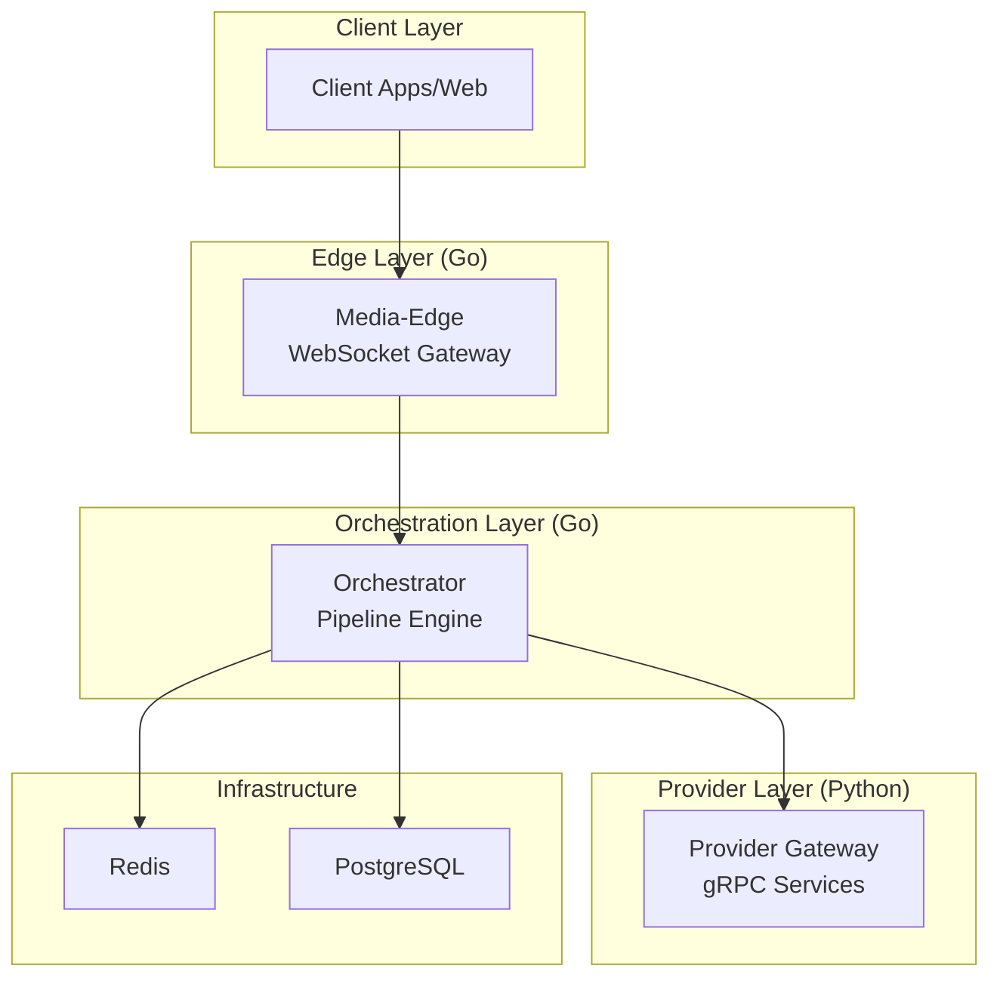
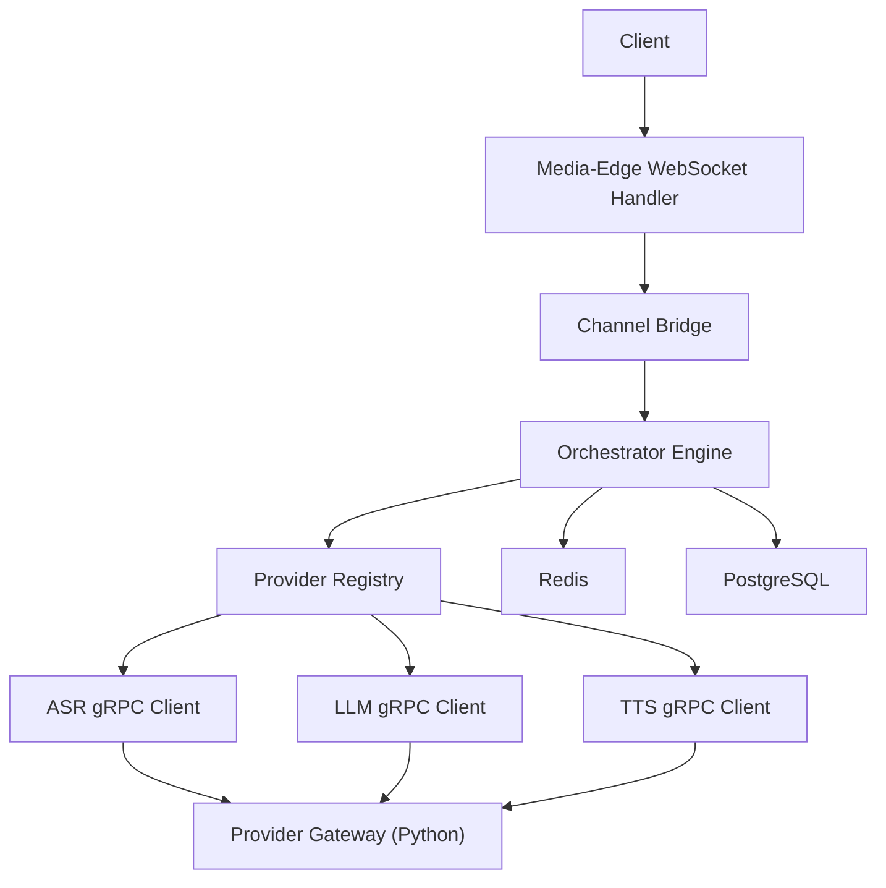
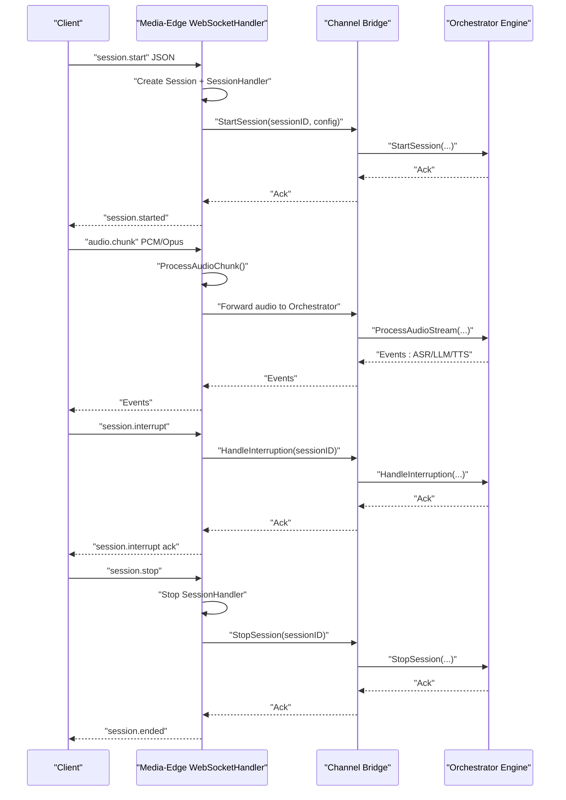
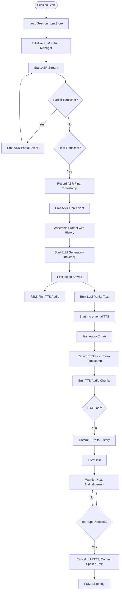
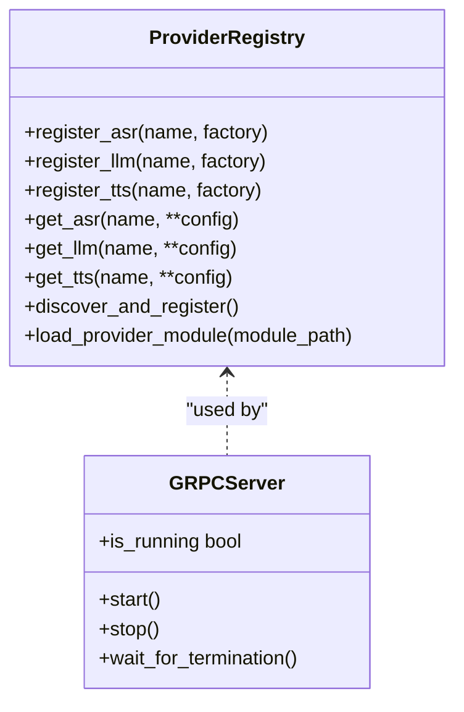
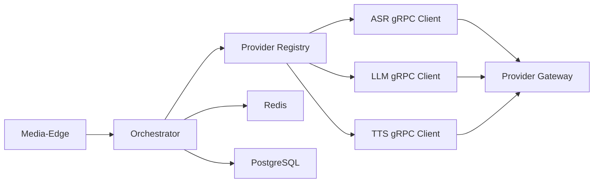
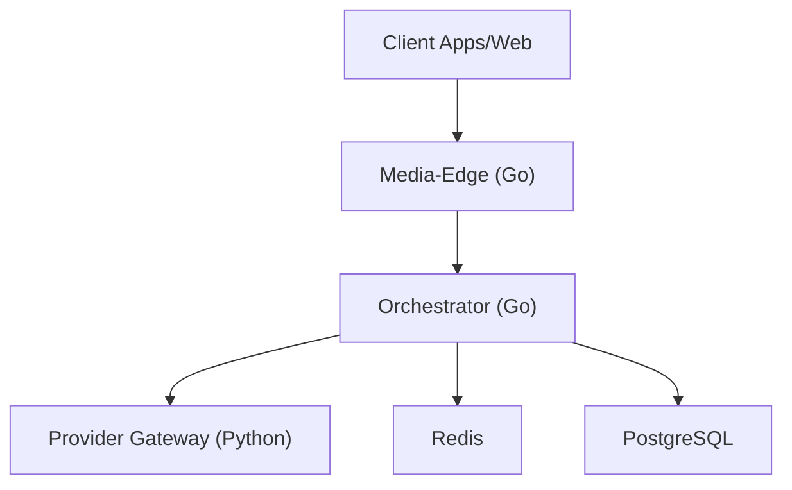

# Architecture & Design

<cite>
**Referenced Files in This Document**
- [README.md](file://README.md)
- [go/media-edge/cmd/main.go](file://go/media-edge/cmd/main.go)
- [go/media-edge/internal/handler/websocket.go](file://go/media-edge/internal/handler/websocket.go)
- [go/orchestrator/cmd/main.go](file://go/orchestrator/cmd/main.go)
- [go/orchestrator/internal/pipeline/engine.go](file://go/orchestrator/internal/pipeline/engine.go)
- [go/pkg/providers/registry.go](file://go/pkg/providers/registry.go)
- [go/pkg/session/session.go](file://go/pkg/session/session.go)
- [go/pkg/observability/logger.go](file://go/pkg/observability/logger.go)
- [py/provider_gateway/main.py](file://py/provider_gateway/main.py)
- [py/provider_gateway/app/grpc_api/server.py](file://py/provider_gateway/app/grpc_api/server.py)
- [py/provider_gateway/app/core/registry.py](file://py/provider_gateway/app/core/registry.py)
- [proto/asr.proto](file://proto/asr.proto)
- [infra/compose/docker-compose.yml](file://infra/compose/docker-compose.yml)
- [infra/k8s/media-edge.yaml](file://infra/k8s/media-edge.yaml)
- [docs/provider-architecture.md](file://docs/provider-architecture.md)
</cite>

## Table of Contents
1. [Introduction](#introduction)
2. [Project Structure](#project-structure)
3. [Core Components](#core-components)
4. [Architecture Overview](#architecture-overview)
5. [Detailed Component Analysis](#detailed-component-analysis)
6. [Dependency Analysis](#dependency-analysis)
7. [Performance Considerations](#performance-considerations)
8. [Troubleshooting Guide](#troubleshooting-guide)
9. [Conclusion](#conclusion)
10. [Appendices](#appendices)

## Introduction
CloudApp implements a three-tier microservices architecture designed for real-time, low-latency voice conversations:
- Media-Edge (Go): WebSocket gateway handling client connections, audio transport, and session lifecycle.
- Orchestrator (Go): Pipeline orchestration coordinating ASR → LLM → TTS stages with state machines and interruptions.
- Provider-Gateway (Python): Pluggable AI providers exposing gRPC services for ASR, LLM, and TTS.

The system emphasizes pluggability, observability, and horizontal scalability, integrating Redis for session caching and PostgreSQL for persistence. It supports multi-tenant configurations, provider capability negotiation, and real-time barge-in behavior.

## Project Structure
The repository is organized into:
- go/: Go services (Media-Edge, Orchestrator) and shared packages (audio, config, contracts, events, observability, providers, session).
- py/provider_gateway/: Python provider gateway implementing gRPC services and provider registry.
- proto/: Protocol Buffer definitions for provider APIs.
- infra/: Container and Kubernetes manifests, migrations, and monitoring configuration.
- docs/: Architectural and operational documentation.
- examples/: Sample configurations for mock, cloud, and local vLLM setups.
- scripts/: Utilities for local runs, migrations, and WebSocket client simulation.

**Diagram sources**
- [README.md: Architecture Overview:5-35](file://README.md#L5-L35)
- [infra/compose/docker-compose.yml: Services:6-164](file://infra/compose/docker-compose.yml#L6-L164)

**Section sources**
- [README.md: Repository Structure:47-102](file://README.md#L47-L102)

## Core Components
- Media-Edge (Go)
  - WebSocket upgrade and message routing.
  - Session creation, updates, interruption, and termination.
  - Event emission to clients and bridging to Orchestrator.
  - Built-in middleware for security, CORS, metrics, and logging.
  - Placeholder session store during MVP; intended to use Redis.

- Orchestrator (Go)
  - Central pipeline engine managing ASR→LLM→TTS stages.
  - Provider registry and gRPC client integration.
  - Session state machine and turn management for interruptions.
  - Persistence via Redis and stubbed PostgreSQL.
  - HTTP endpoints for health/readiness/metrics.

- Provider-Gateway (Python)
  - gRPC server exposing ASR, LLM, TTS, and Provider services.
  - Dynamic provider registry with lazy instantiation and capability queries.
  - Built-in mock providers and extensible provider modules.

- Shared Contracts and Observability
  - Protocol Buffers define provider contracts and streaming semantics.
  - Structured logging, metrics, and tracing utilities across services.

**Section sources**
- [go/media-edge/cmd/main.go: Media-Edge entry and HTTP server:30-180](file://go/media-edge/cmd/main.go#L30-L180)
- [go/media-edge/internal/handler/websocket.go: WebSocket handler and session lifecycle:22-592](file://go/media-edge/internal/handler/websocket.go#L22-L592)
- [go/orchestrator/cmd/main.go: Orchestrator entry and provider registration:26-257](file://go/orchestrator/cmd/main.go#L26-L257)
- [go/orchestrator/internal/pipeline/engine.go: Pipeline engine and session processing:17-510](file://go/orchestrator/internal/pipeline/engine.go#L17-L510)
- [py/provider_gateway/app/grpc_api/server.py: gRPC server setup:25-171](file://py/provider_gateway/app/grpc_api/server.py#L25-L171)
- [py/provider_gateway/app/core/registry.py: Provider registry:19-287](file://py/provider_gateway/app/core/registry.py#L19-L287)
- [proto/asr.proto: ASR service definition:9-53](file://proto/asr.proto#L9-L53)

## Architecture Overview
CloudApp’s architecture enforces a strict separation of concerns:
- Media-Edge: Stateless, horizontally scalable WebSocket ingress.
- Orchestrator: Stateful orchestration with Redis-backed session state and PostgreSQL for durable history.
- Provider-Gateway: Stateless, pluggable provider service with capability negotiation and streaming gRPC.

**Diagram sources**
- [go/media-edge/internal/handler/websocket.go: Session start and bridge invocation:260-374](file://go/media-edge/internal/handler/websocket.go#L260-L374)
- [go/orchestrator/cmd/main.go: Provider registration and engine initialization:195-257](file://go/orchestrator/cmd/main.go#L195-L257)
- [go/orchestrator/internal/pipeline/engine.go: Stage orchestration:108-208](file://go/orchestrator/internal/pipeline/engine.go#L108-L208)
- [py/provider_gateway/app/grpc_api/server.py: gRPC server binding:54-90](file://py/provider_gateway/app/grpc_api/server.py#L54-L90)

## Detailed Component Analysis

### Media-Edge WebSocket Gateway
Responsibilities:
- Upgrade HTTP to WebSocket, enforce CORS and security policies.
- Parse JSON events (session.start, audio.chunk, session.update, session.interrupt, session.stop).
- Create and manage session handlers with VAD and audio profiles.
- Bridge session lifecycle to Orchestrator via an in-process channel bridge.
- Emit events back to clients (partial/final ASR, LLM partial text, TTS audio chunks).

**Diagram sources**
- [go/media-edge/internal/handler/websocket.go: Session lifecycle and message handling:220-481](file://go/media-edge/internal/handler/websocket.go#L220-L481)
- [go/orchestrator/internal/pipeline/engine.go: ProcessSession and interruption handling:108-436](file://go/orchestrator/internal/pipeline/engine.go#L108-L436)

**Section sources**
- [go/media-edge/internal/handler/websocket.go: WebSocketHandler and Connection lifecycle:22-592](file://go/media-edge/internal/handler/websocket.go#L22-L592)
- [go/media-edge/cmd/main.go: HTTP server, middleware chain, and endpoints:93-180](file://go/media-edge/cmd/main.go#L93-L180)

### Orchestrator Pipeline Engine
Responsibilities:
- Manage active sessions, state machine transitions, and turn management.
- Coordinate ASR→LLM→TTS pipeline with concurrency and incremental delivery.
- Handle interruptions: cancel LLM/TTS, compute playout position, commit only spoken text.
- Persist session state to Redis and maintain conversation history.

**Diagram sources**
- [go/orchestrator/internal/pipeline/engine.go: ProcessSession and ProcessUserUtterance:108-375](file://go/orchestrator/internal/pipeline/engine.go#L108-L375)
- [go/orchestrator/internal/pipeline/engine.go: HandleInterruption:377-436](file://go/orchestrator/internal/pipeline/engine.go#L377-L436)

**Section sources**
- [go/orchestrator/internal/pipeline/engine.go: Engine, Config, SessionContext:17-106](file://go/orchestrator/internal/pipeline/engine.go#L17-L106)
- [go/pkg/session/session.go: Session state and runtime fields:62-84](file://go/pkg/session/session.go#L62-L84)

### Provider-Gateway (Python) and gRPC Integration
Responsibilities:
- Expose gRPC services for ASR, LLM, TTS, and Provider capability queries.
- Dynamic provider registry supporting auto-discovery and lazy instantiation.
- Provide mock providers for development and testing.

**Diagram sources**
- [py/provider_gateway/app/core/registry.py: ProviderRegistry:19-287](file://py/provider_gateway/app/core/registry.py#L19-L287)
- [py/provider_gateway/app/grpc_api/server.py: GRPCServer:25-171](file://py/provider_gateway/app/grpc_api/server.py#L25-L171)

**Section sources**
- [py/provider_gateway/app/grpc_api/server.py: gRPC server creation and lifecycle:54-134](file://py/provider_gateway/app/grpc_api/server.py#L54-L134)
- [py/provider_gateway/app/core/registry.py: Discovery and lazy instantiation:206-241](file://py/provider_gateway/app/core/registry.py#L206-L241)
- [docs/provider-architecture.md: Provider architecture and contracts:1-320](file://docs/provider-architecture.md#L1-L320)

### Protocol Buffers and Contracts
- ASRService defines bidirectional streaming for audio input and transcript output, cancellation, and capability queries.
- LLMService and TTSService define streaming generation and synthesis with cancellation support.
- These contracts enable the Go Orchestrator to integrate providers without hard-coding implementations.

**Section sources**
- [proto/asr.proto: ASR service and messages:9-53](file://proto/asr.proto#L9-L53)

## Dependency Analysis
- Media-Edge depends on:
  - Orchestrator bridge (channel-based in MVP; later HTTP/gRPC).
  - Session store abstraction (placeholder; intended Redis).
  - Observability (logging, metrics, tracing).
- Orchestrator depends on:
  - Provider registry and gRPC clients for ASR/LLM/TTS.
  - Redis for session state and temporary data.
  - PostgreSQL for durable history and persistence.
  - Session and events packages for state and messaging.
- Provider-Gateway depends on:
  - Provider registry for dynamic loading.
  - gRPC server for service exposure.
  - Built-in provider modules (ASR/LLM/TTS/VAD).

**Diagram sources**
- [go/orchestrator/cmd/main.go: Provider registration:195-257](file://go/orchestrator/cmd/main.go#L195-L257)
- [go/pkg/providers/registry.go: ProviderRegistry:14-116](file://go/pkg/providers/registry.go#L14-L116)
- [py/provider_gateway/app/grpc_api/server.py: gRPC server:54-90](file://py/provider_gateway/app/grpc_api/server.py#L54-L90)

**Section sources**
- [go/pkg/providers/registry.go: Provider resolution hierarchy:172-251](file://go/pkg/providers/registry.go#L172-L251)
- [go/pkg/session/session.go: SelectedProviders and runtime state:34-84](file://go/pkg/session/session.go#L34-L84)

## Performance Considerations
- Real-time constraints:
  - WebSocket ping/pong keepalives and read/write timeouts prevent resource leaks.
  - Incremental delivery of LLM tokens and TTS audio minimizes end-to-end latency.
  - Interruption handling cancels in-flight operations promptly to reduce wasted work.
- Throughput and latency:
  - gRPC streaming reduces overhead compared to unary calls.
  - Concurrency between LLM token processing and TTS audio synthesis improves throughput.
- Scalability:
  - Stateless Media-Edge scales horizontally behind a load balancer.
  - Orchestrator uses Redis for session sharding and stateless workers.
  - Provider-Gateway scales independently; providers can be colocated or remote.

[No sources needed since this section provides general guidance]

## Troubleshooting Guide
- Observability
  - Structured logging with leveled output and contextual fields.
  - Prometheus metrics endpoint for health and performance.
  - Optional OpenTelemetry tracing for distributed tracing.
- Common issues
  - WebSocket upgrades failing due to CORS or origin mismatch; verify allowed origins.
  - Provider unavailability or timeouts; confirm gRPC server readiness and network connectivity.
  - Session not found errors; ensure session store is reachable and keys are prefixed correctly.
- Diagnostics
  - Use readiness probes to detect dependency failures (Redis, PostgreSQL).
  - Inspect logs for session IDs and trace IDs to correlate events across services.

**Section sources**
- [go/pkg/observability/logger.go: Logger configuration and helpers:25-168](file://go/pkg/observability/logger.go#L25-L168)
- [go/media-edge/cmd/main.go: Health/ready/metrics endpoints:99-127](file://go/media-edge/cmd/main.go#L99-L127)
- [go/orchestrator/cmd/main.go: Health/ready/metrics endpoints:125-149](file://go/orchestrator/cmd/main.go#L125-L149)

## Conclusion
CloudApp’s microservices architecture balances real-time responsiveness with modularity and extensibility. The three-tier design—Media-Edge, Orchestrator, and Provider-Gateway—enables horizontal scaling, multi-tenant isolation, and provider flexibility. gRPC and WebSocket protocols serve distinct roles: WebSocket for low-latency client interaction and gRPC for reliable provider integration. Redis and PostgreSQL provide complementary persistence layers, while comprehensive observability ensures operability at scale.

[No sources needed since this section summarizes without analyzing specific files]

## Appendices

### System Context Diagram

**Diagram sources**
- [README.md: Architecture Overview:5-35](file://README.md#L5-L35)

### Deployment Topologies
- Docker Compose (Local/Mock)
  - Single-command startup with mock providers for quick iteration.
  - Includes health checks and Prometheus metrics scraping.

- Kubernetes (Production)
  - Stateless Media-Edge deployments with readiness probes and resource limits.
  - Separate Deployments for Orchestrator and Provider-Gateway.
  - Persistent volumes for Redis AOF and PostgreSQL data.

**Section sources**
- [infra/compose/docker-compose.yml: Services and health checks:6-164](file://infra/compose/docker-compose.yml#L6-L164)
- [infra/k8s/media-edge.yaml: Deployment and probes:14-73](file://infra/k8s/media-edge.yaml#L14-L73)

### Technology Stack
- Go services: Gorilla WebSocket, HTTP server, Prometheus metrics, Redis client, gRPC.
- Python provider gateway: gRPC aio server, provider registry, capability model.
- Protobuf: Provider contracts and streaming semantics.
- Infrastructure: Redis (session caching), PostgreSQL (persistence), Prometheus (metrics).

**Section sources**
- [go/media-edge/internal/handler/websocket.go: WebSocket upgrade and handlers:94-192](file://go/media-edge/internal/handler/websocket.go#L94-L192)
- [go/orchestrator/cmd/main.go: Redis and HTTP server:73-156](file://go/orchestrator/cmd/main.go#L73-L156)
- [py/provider_gateway/app/grpc_api/server.py: gRPC server options:57-63](file://py/provider_gateway/app/grpc_api/server.py#L57-L63)
- [proto/asr.proto: Streaming RPCs and messages:9-53](file://proto/asr.proto#L9-L53)