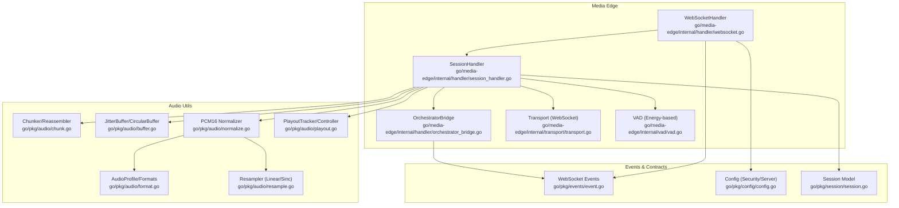
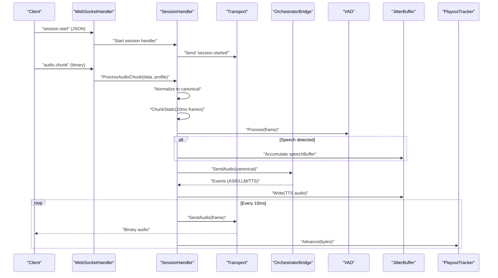
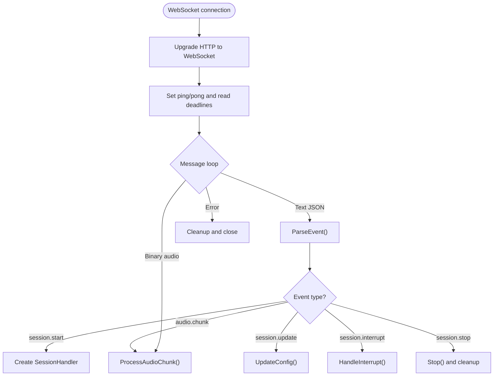
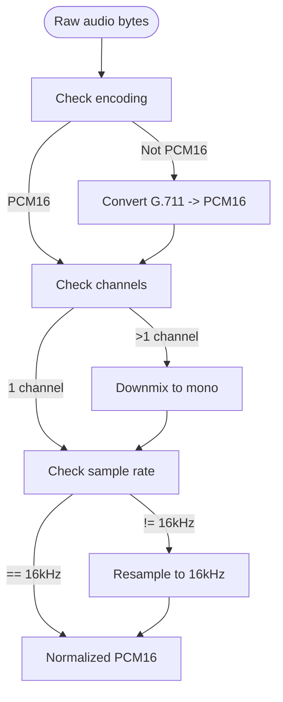
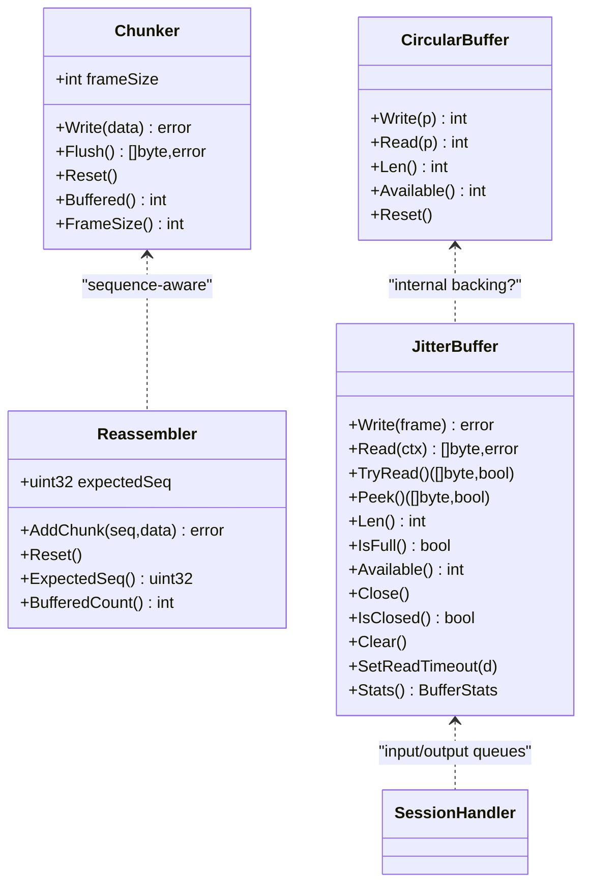
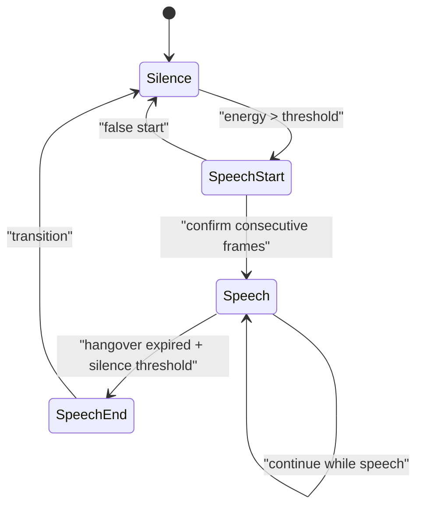
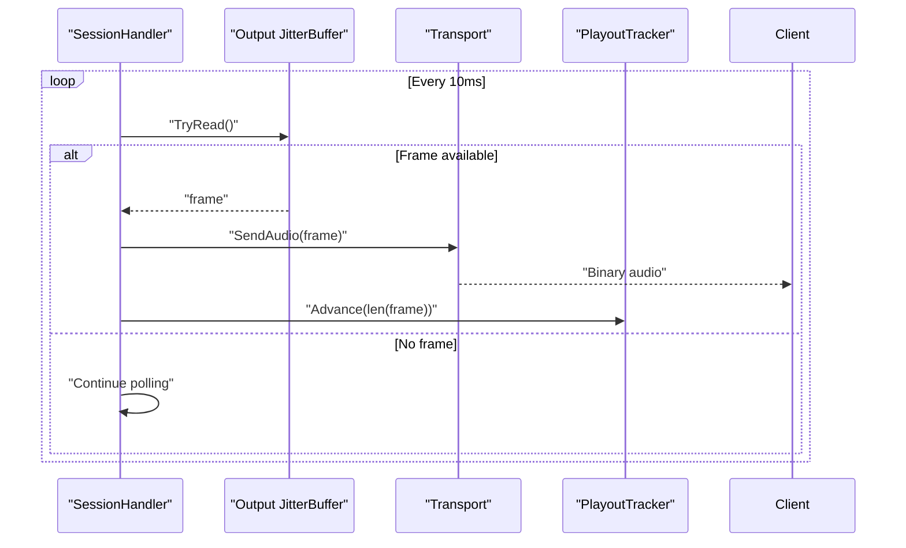
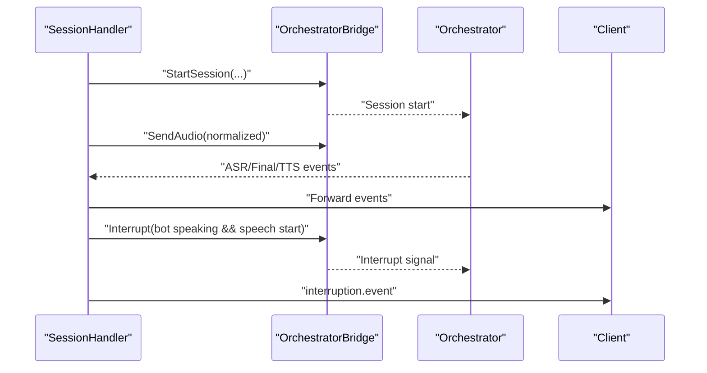
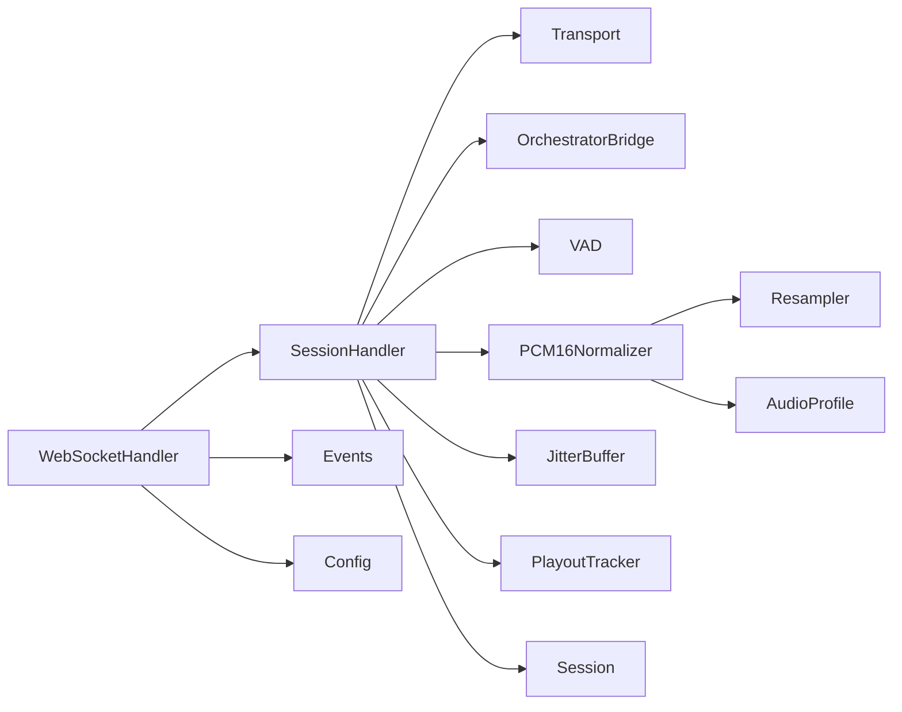

# Audio Streaming Pipeline

<cite>
**Referenced Files in This Document**
- [websocket.go](file://go/media-edge/internal/handler/websocket.go)
- [session_handler.go](file://go/media-edge/internal/handler/session_handler.go)
- [orchestrator_bridge.go](file://go/media-edge/internal/handler/orchestrator_bridge.go)
- [transport.go](file://go/media-edge/internal/transport/transport.go)
- [vad.go](file://go/media-edge/internal/vad/vad.go)
- [chunk.go](file://go/pkg/audio/chunk.go)
- [buffer.go](file://go/pkg/audio/buffer.go)
- [format.go](file://go/pkg/audio/format.go)
- [normalize.go](file://go/pkg/audio/normalize.go)
- [resample.go](file://go/pkg/audio/resample.go)
- [playout.go](file://go/pkg/audio/playout.go)
- [event.go](file://go/pkg/events/event.go)
- [config.go](file://go/pkg/config/config.go)
- [session.go](file://go/pkg/session/session.go)
</cite>

## Table of Contents
1. [Introduction](#introduction)
2. [Project Structure](#project-structure)
3. [Core Components](#core-components)
4. [Architecture Overview](#architecture-overview)
5. [Detailed Component Analysis](#detailed-component-analysis)
6. [Dependency Analysis](#dependency-analysis)
7. [Performance Considerations](#performance-considerations)
8. [Troubleshooting Guide](#troubleshooting-guide)
9. [Conclusion](#conclusion)

## Introduction
This document explains CloudApp’s audio streaming pipeline from WebSocket reception through real-time processing. It covers the complete audio data flow: WebSocket reception, chunk-based transmission protocol, format conversion, resampling, buffering, VAD-driven speech detection, audio normalization, and real-time playout. Practical guidance is included for chunk sizing, buffer tuning, and handling interruptions during streaming.

## Project Structure
The audio streaming pipeline spans three primary areas:
- Media Edge: WebSocket handling, session orchestration, and transport abstraction
- Audio Utilities: Chunking, buffering, format conversion, resampling, and playout tracking
- Events and Contracts: WebSocket event protocol and provider contracts

**Diagram sources**
- [websocket.go:1-592](file://go/media-edge/internal/handler/websocket.go#L1-L592)
- [session_handler.go:1-540](file://go/media-edge/internal/handler/session_handler.go#L1-L540)
- [orchestrator_bridge.go:1-454](file://go/media-edge/internal/handler/orchestrator_bridge.go#L1-L454)
- [transport.go:1-332](file://go/media-edge/internal/transport/transport.go#L1-L332)
- [vad.go:1-373](file://go/media-edge/internal/vad/vad.go#L1-L373)
- [chunk.go:1-230](file://go/pkg/audio/chunk.go#L1-L230)
- [buffer.go:1-334](file://go/pkg/audio/buffer.go#L1-L334)
- [format.go:1-140](file://go/pkg/audio/format.go#L1-L140)
- [normalize.go:1-352](file://go/pkg/audio/normalize.go#L1-L352)
- [resample.go:1-173](file://go/pkg/audio/resample.go#L1-L173)
- [playout.go:1-383](file://go/pkg/audio/playout.go#L1-L383)
- [event.go:1-210](file://go/pkg/events/event.go#L1-L210)
- [config.go:1-276](file://go/pkg/config/config.go#L1-L276)
- [session.go:1-249](file://go/pkg/session/session.go#L1-L249)

**Section sources**
- [websocket.go:1-592](file://go/media-edge/internal/handler/websocket.go#L1-L592)
- [session_handler.go:1-540](file://go/media-edge/internal/handler/session_handler.go#L1-L540)
- [transport.go:1-332](file://go/media-edge/internal/transport/transport.go#L1-L332)
- [vad.go:1-373](file://go/media-edge/internal/vad/vad.go#L1-L373)
- [chunk.go:1-230](file://go/pkg/audio/chunk.go#L1-L230)
- [buffer.go:1-334](file://go/pkg/audio/buffer.go#L1-L334)
- [format.go:1-140](file://go/pkg/audio/format.go#L1-L140)
- [normalize.go:1-352](file://go/pkg/audio/normalize.go#L1-L352)
- [resample.go:1-173](file://go/pkg/audio/resample.go#L1-L173)
- [playout.go:1-383](file://go/pkg/audio/playout.go#L1-L383)
- [event.go:1-210](file://go/pkg/events/event.go#L1-L210)
- [config.go:1-276](file://go/pkg/config/config.go#L1-L276)
- [session.go:1-249](file://go/pkg/session/session.go#L1-L249)

## Core Components
- WebSocketHandler: Upgrades HTTP to WebSocket, manages connections, parses events, and routes to SessionHandler.
- SessionHandler: Central audio pipeline orchestrator—normalization, VAD, buffering, orchestrator bridge, playout.
- Transport: Abstraction for sending events and audio over WebSocket.
- OrchestratorBridge: In-process channel bridge to the orchestration service.
- Audio Utilities: Chunking, buffering, normalization, resampling, and playout tracking.
- VAD: Energy-based voice activity detection with configurable thresholds and hangover.
- Events: WebSocket event protocol for session lifecycle and real-time feedback.
- Config: Security and server limits (e.g., MaxChunkSize) impacting throughput and safety.

**Section sources**
- [websocket.go:22-92](file://go/media-edge/internal/handler/websocket.go#L22-L92)
- [session_handler.go:17-117](file://go/media-edge/internal/handler/session_handler.go#L17-L117)
- [transport.go:16-42](file://go/media-edge/internal/transport/transport.go#L16-L42)
- [orchestrator_bridge.go:13-32](file://go/media-edge/internal/handler/orchestrator_bridge.go#L13-L32)
- [vad.go:68-78](file://go/media-edge/internal/vad/vad.go#L68-L78)
- [event.go:14-35](file://go/pkg/events/event.go#L14-L35)
- [config.go:87-94](file://go/pkg/config/config.go#L87-L94)

## Architecture Overview
The pipeline begins when a client connects via WebSocket and sends a session.start event. The Media Edge creates a SessionHandler bound to a Transport and OrchestratorBridge. Audio chunks are normalized to a canonical format, split into fixed-size frames, passed through VAD for speech detection, and forwarded to the orchestrator. TTS audio chunks are queued in an output buffer and streamed to the client at a steady cadence while playout progress is tracked.

**Diagram sources**
- [websocket.go:261-374](file://go/media-edge/internal/handler/websocket.go#L261-L374)
- [session_handler.go:177-225](file://go/media-edge/internal/handler/session_handler.go#L177-L225)
- [session_handler.go:317-403](file://go/media-edge/internal/handler/session_handler.go#L317-L403)
- [session_handler.go:406-432](file://go/media-edge/internal/handler/session_handler.go#L406-L432)
- [transport.go:82-95](file://go/media-edge/internal/transport/transport.go#L82-L95)
- [vad.go:105-197](file://go/media-edge/internal/vad/vad.go#L105-L197)
- [buffer.go:39-95](file://go/pkg/audio/buffer.go#L39-L95)
- [playout.go:49-73](file://go/pkg/audio/playout.go#L49-L73)

## Detailed Component Analysis

### WebSocket Reception and Protocol
- Connection lifecycle: Upgrade, ping/pong keepalive, read deadlines, write pump, and cleanup.
- Event parsing: Supports session.start, audio.chunk, session.update, session.interrupt, session.stop.
- Backpressure and limits: MaxChunkSize enforced; oversized messages rejected; write channel capacity bounded.

**Diagram sources**
- [websocket.go:95-192](file://go/media-edge/internal/handler/websocket.go#L95-L192)
- [websocket.go:221-258](file://go/media-edge/internal/handler/websocket.go#L221-L258)
- [websocket.go:376-405](file://go/media-edge/internal/handler/websocket.go#L376-L405)
- [websocket.go:427-445](file://go/media-edge/internal/handler/websocket.go#L427-L445)
- [websocket.go:447-481](file://go/media-edge/internal/handler/websocket.go#L447-L481)
- [event.go:80-185](file://go/pkg/events/event.go#L80-L185)
- [config.go:242-248](file://go/pkg/config/config.go#L242-L248)

**Section sources**
- [websocket.go:95-192](file://go/media-edge/internal/handler/websocket.go#L95-L192)
- [websocket.go:221-258](file://go/media-edge/internal/handler/websocket.go#L221-L258)
- [websocket.go:376-405](file://go/media-edge/internal/handler/websocket.go#L376-L405)
- [websocket.go:427-445](file://go/media-edge/internal/handler/websocket.go#L427-L445)
- [websocket.go:447-481](file://go/media-edge/internal/handler/websocket.go#L447-L481)
- [event.go:80-185](file://go/pkg/events/event.go#L80-L185)
- [config.go:242-248](file://go/pkg/config/config.go#L242-L248)

### Audio Normalization and Format Conversion
- Canonical format: 16 kHz, mono, PCM16, 10 ms frames.
- Normalization steps:
  - Encoding conversion (G.711 u-law/A-law to PCM16) if needed
  - Downmix to mono if multichannel
  - Resampling to canonical sample rate using linear interpolation
- Validation and conversion helpers ensure safe transformations.

**Diagram sources**
- [normalize.go:32-74](file://go/pkg/audio/normalize.go#L32-L74)
- [normalize.go:87-110](file://go/pkg/audio/normalize.go#L87-L110)
- [normalize.go:112-136](file://go/pkg/audio/normalize.go#L112-L136)
- [normalize.go:138-178](file://go/pkg/audio/normalize.go#L138-L178)
- [resample.go:26-61](file://go/pkg/audio/resample.go#L26-L61)
- [format.go:51-63](file://go/pkg/audio/format.go#L51-L63)

**Section sources**
- [normalize.go:32-74](file://go/pkg/audio/normalize.go#L32-L74)
- [normalize.go:87-110](file://go/pkg/audio/normalize.go#L87-L110)
- [normalize.go:112-136](file://go/pkg/audio/normalize.go#L112-L136)
- [normalize.go:138-178](file://go/pkg/audio/normalize.go#L138-L178)
- [resample.go:26-61](file://go/pkg/audio/resample.go#L26-L61)
- [format.go:51-63](file://go/pkg/audio/format.go#L51-L63)

### Chunking, Reassembly, and Buffering
- Fixed-frame chunking: Split normalized audio into 10 ms frames for consistent processing.
- Partial frame handling: Buffer remainder across chunks to maintain continuity.
- JitterBuffer: Thread-safe queue with backpressure, timeouts, and notifications for smooth playback.
- CircularBuffer: Fixed-size ring buffer for scenarios requiring overwrite-on-full behavior.

**Diagram sources**
- [chunk.go:7-68](file://go/pkg/audio/chunk.go#L7-L68)
- [chunk.go:103-190](file://go/pkg/audio/chunk.go#L103-L190)
- [buffer.go:16-198](file://go/pkg/audio/buffer.go#L16-L198)
- [buffer.go:252-334](file://go/pkg/audio/buffer.go#L252-L334)

**Section sources**
- [chunk.go:23-53](file://go/pkg/audio/chunk.go#L23-L53)
- [chunk.go:124-174](file://go/pkg/audio/chunk.go#L124-L174)
- [buffer.go:39-95](file://go/pkg/audio/buffer.go#L39-L95)
- [buffer.go:270-334](file://go/pkg/audio/buffer.go#L270-L334)

### Voice Activity Detection (VAD)
- Energy-based detector with configurable thresholds, minimum speech/silence durations, and hangover frames.
- State machine: Silence → SpeechStart → Speech → SpeechEnd.
- Callbacks for speech start/end to trigger downstream actions (e.g., interruption handling).

**Diagram sources**
- [vad.go:13-34](file://go/media-edge/internal/vad/vad.go#L13-L34)
- [vad.go:126-194](file://go/media-edge/internal/vad/vad.go#L126-L194)

**Section sources**
- [vad.go:46-66](file://go/media-edge/internal/vad/vad.go#L46-L66)
- [vad.go:105-197](file://go/media-edge/internal/vad/vad.go#L105-L197)
- [vad.go:305-373](file://go/media-edge/internal/vad/vad.go#L305-L373)

### Playout Tracking and Real-Time Delivery
- PlayoutTracker: Tracks bytes sent, calculates duration, and exposes callbacks for progress/completion.
- PlayoutController: Wraps a JitterBuffer with a profile and integrates playout progress.
- Output loop: Periodic delivery of audio frames to the client at 10 ms intervals.

**Diagram sources**
- [session_handler.go:406-432](file://go/media-edge/internal/handler/session_handler.go#L406-L432)
- [playout.go:49-73](file://go/pkg/audio/playout.go#L49-L73)
- [transport.go:92-95](file://go/media-edge/internal/transport/transport.go#L92-L95)

**Section sources**
- [playout.go:26-73](file://go/pkg/audio/playout.go#L26-L73)
- [playout.go:299-383](file://go/pkg/audio/playout.go#L299-L383)
- [session_handler.go:406-432](file://go/media-edge/internal/handler/session_handler.go#L406-L432)

### Orchestrator Integration and Events
- SessionHandler subscribes to orchestrator events and forwards them to the client.
- Audio chunks are sent to the orchestrator for ASR; TTS audio chunks are enqueued for playout.
- Interruption handling: If the bot is speaking and user speech is detected, the pipeline interrupts and resets state.

**Diagram sources**
- [session_handler.go:317-403](file://go/media-edge/internal/handler/session_handler.go#L317-L403)
- [session_handler.go:279-314](file://go/media-edge/internal/handler/session_handler.go#L279-L314)
- [orchestrator_bridge.go:98-134](file://go/media-edge/internal/handler/orchestrator_bridge.go#L98-L134)
- [orchestrator_bridge.go:136-175](file://go/media-edge/internal/handler/orchestrator_bridge.go#L136-L175)
- [orchestrator_bridge.go:215-240](file://go/media-edge/internal/handler/orchestrator_bridge.go#L215-L240)

**Section sources**
- [session_handler.go:317-403](file://go/media-edge/internal/handler/session_handler.go#L317-L403)
- [session_handler.go:279-314](file://go/media-edge/internal/handler/session_handler.go#L279-L314)
- [orchestrator_bridge.go:98-134](file://go/media-edge/internal/handler/orchestrator_bridge.go#L98-L134)
- [orchestrator_bridge.go:136-175](file://go/media-edge/internal/handler/orchestrator_bridge.go#L136-L175)
- [orchestrator_bridge.go:215-240](file://go/media-edge/internal/handler/orchestrator_bridge.go#L215-L240)

## Dependency Analysis
- Coupling: SessionHandler depends on Transport, OrchestratorBridge, VAD, Normalizer, Buffers, and PlayoutTracker.
- Cohesion: Audio utilities encapsulate format conversion, buffering, and playout independently.
- External dependencies: Gorilla WebSocket for transport, JSON for events, and provider contracts for ASR/TTS.

**Diagram sources**
- [session_handler.go:17-117](file://go/media-edge/internal/handler/session_handler.go#L17-L117)
- [normalize.go:32-74](file://go/pkg/audio/normalize.go#L32-L74)
- [resample.go:26-61](file://go/pkg/audio/resample.go#L26-L61)
- [format.go:51-63](file://go/pkg/audio/format.go#L51-L63)
- [websocket.go:261-374](file://go/media-edge/internal/handler/websocket.go#L261-L374)
- [event.go:80-185](file://go/pkg/events/event.go#L80-L185)
- [config.go:242-248](file://go/pkg/config/config.go#L242-L248)
- [session.go:62-84](file://go/pkg/session/session.go#L62-L84)

**Section sources**
- [session_handler.go:17-117](file://go/media-edge/internal/handler/session_handler.go#L17-L117)
- [normalize.go:32-74](file://go/pkg/audio/normalize.go#L32-L74)
- [resample.go:26-61](file://go/pkg/audio/resample.go#L26-L61)
- [format.go:51-63](file://go/pkg/audio/format.go#L51-L63)
- [websocket.go:261-374](file://go/media-edge/internal/handler/websocket.go#L261-L374)
- [event.go:80-185](file://go/pkg/events/event.go#L80-L185)
- [config.go:242-248](file://go/pkg/config/config.go#L242-L248)
- [session.go:62-84](file://go/pkg/session/session.go#L62-L84)

## Performance Considerations
- Chunk size and frame alignment: Use 10 ms frames at the canonical 16 kHz sample rate for minimal latency and predictable buffering.
- Buffer sizing: Tune JitterBuffer capacities to absorb network jitter without excessive latency; monitor Available() and Stats().
- Resampling cost: Prefer linear resampling for MVP; consider sinc resampler for higher fidelity when CPU allows.
- VAD thresholds: Adjust thresholds and hangover to reduce false positives/negatives; adaptive variants can improve robustness.
- Backpressure: Respect ErrBufferFull and adjust upstream producers to prevent stalls.
- Throughput limits: Enforce MaxChunkSize to protect memory and maintain responsiveness.

[No sources needed since this section provides general guidance]

## Troubleshooting Guide
Common issues and remedies:
- Excessive buffering or latency:
  - Verify JitterBuffer sizes and read timeouts; check Stats() for occupancy.
  - Ensure periodic output loop runs at 10 ms intervals.
- Audio choppy or distorted:
  - Confirm normalization to canonical format; validate resampling and channel downmix.
  - Check for silent frames being inserted inadvertently.
- Frequent interruptions:
  - Review VAD thresholds and hangover; adjust to reduce false starts.
  - Ensure interruption logic only triggers when bot is speaking.
- WebSocket errors:
  - Inspect read/write deadlines and ping/pong handling.
  - Validate MaxChunkSize and oversized message handling.
- Provider failures:
  - Inspect OrchestratorBridge event forwarding and error events.

**Section sources**
- [buffer.go:182-198](file://go/pkg/audio/buffer.go#L182-L198)
- [session_handler.go:406-432](file://go/media-edge/internal/handler/session_handler.go#L406-L432)
- [normalize.go:32-74](file://go/pkg/audio/normalize.go#L32-L74)
- [vad.go:126-194](file://go/media-edge/internal/vad/vad.go#L126-L194)
- [websocket.go:135-192](file://go/media-edge/internal/handler/websocket.go#L135-L192)
- [websocket.go:227-230](file://go/media-edge/internal/handler/websocket.go#L227-L230)
- [orchestrator_bridge.go:282-306](file://go/media-edge/internal/handler/orchestrator_bridge.go#L282-L306)

## Conclusion
CloudApp’s audio streaming pipeline integrates WebSocket reception, robust audio normalization, precise VAD-driven speech detection, resilient buffering, and real-time playout. By aligning chunk sizes, tuning buffers, and carefully managing interruptions, the system achieves low-latency, high-quality conversational audio. The modular design of audio utilities and clear separation of concerns enable incremental improvements, such as advanced resampling and adaptive VAD strategies.