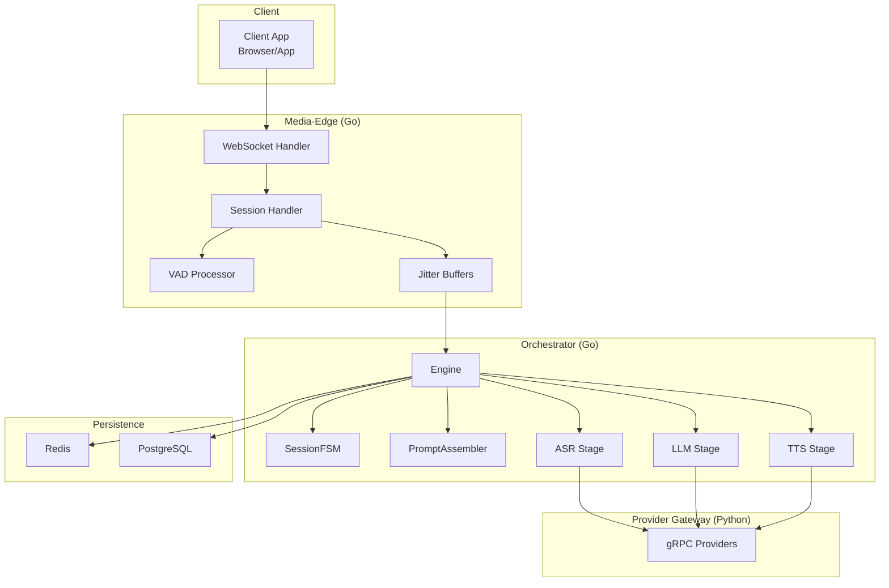
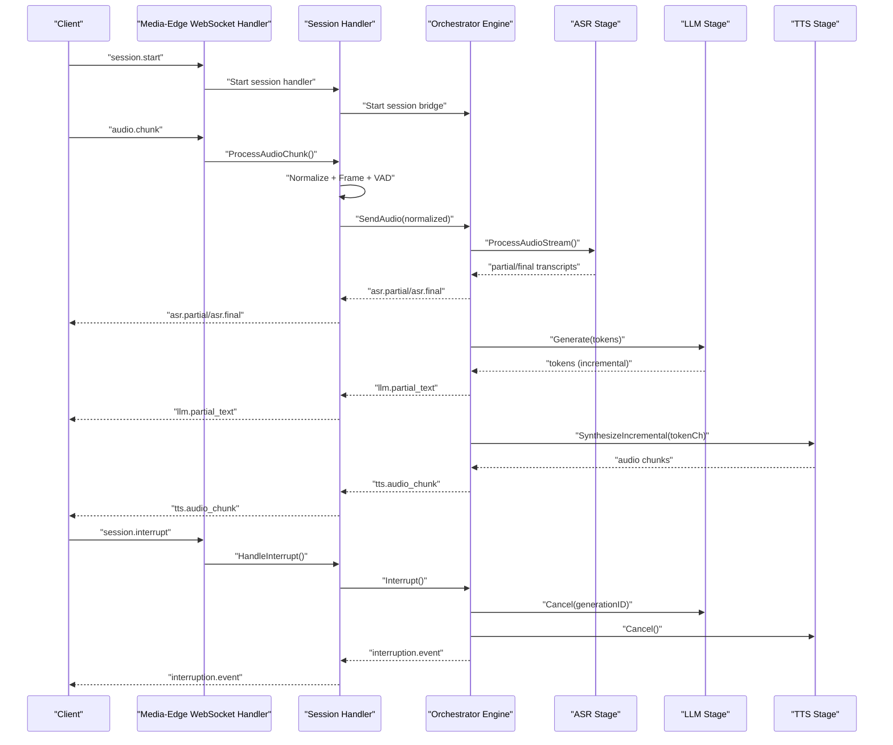
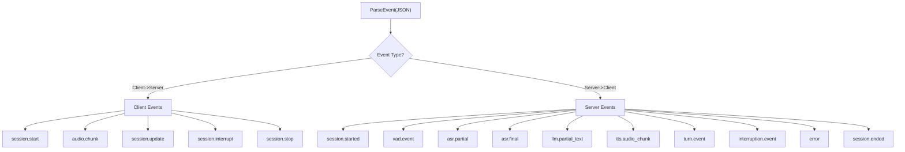
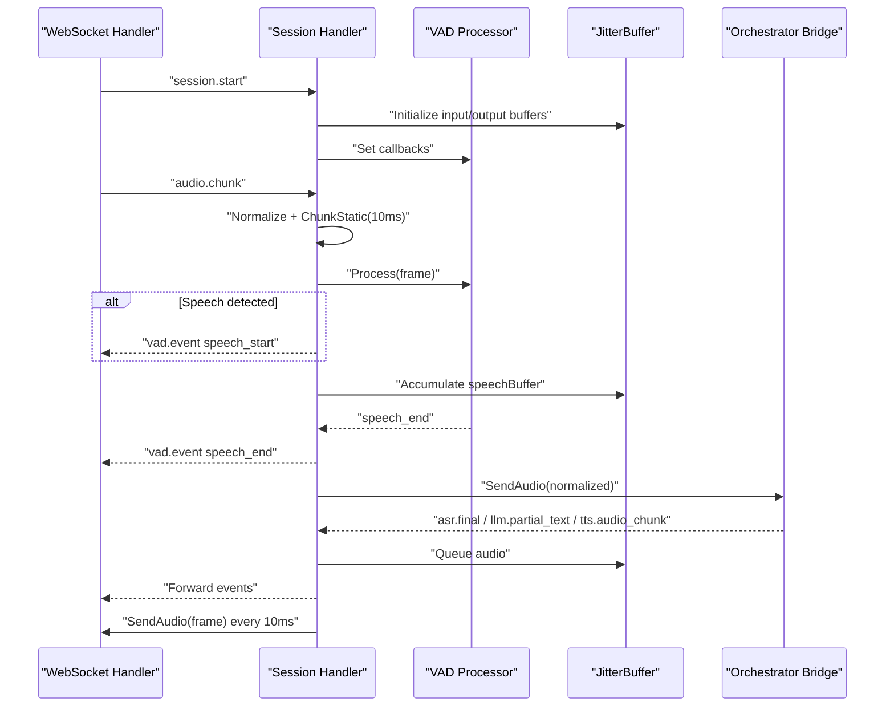
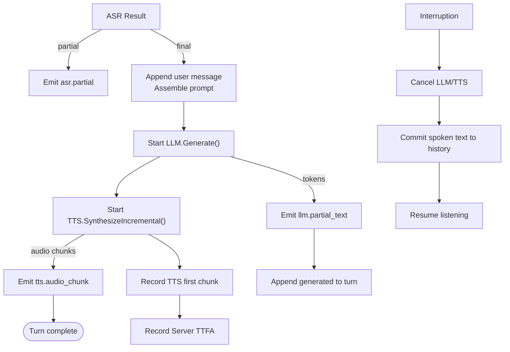
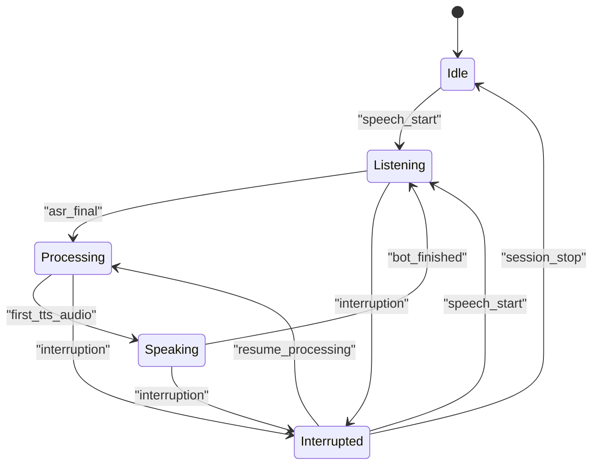
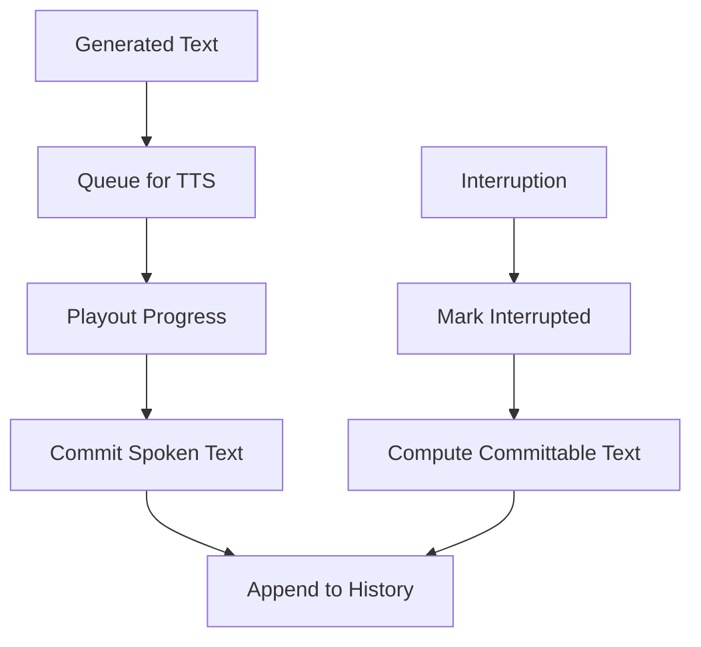
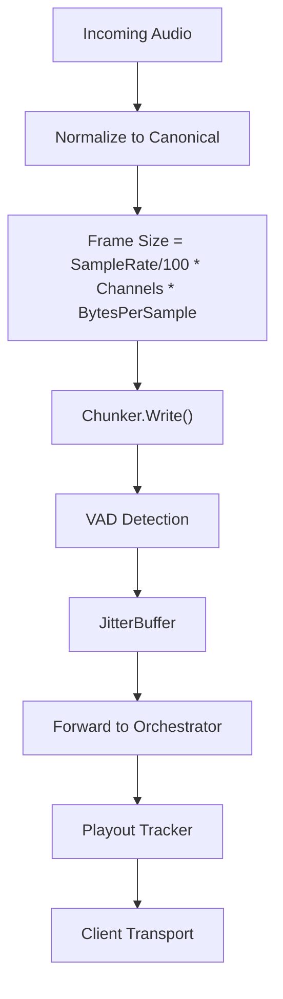
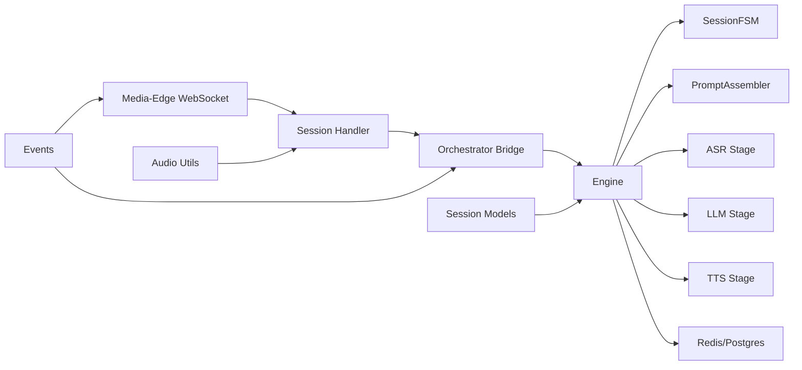

# Data Flow Patterns

<cite>
**Referenced Files in This Document**
- [README.md](file://README.md)
- [main.go](file://go/media-edge/cmd/main.go)
- [main.go](file://go/orchestrator/cmd/main.go)
- [event.go](file://go/pkg/events/event.go)
- [websocket.go](file://go/media-edge/internal/handler/websocket.go)
- [session_handler.go](file://go/media-edge/internal/handler/session_handler.go)
- [vad.go](file://go/media-edge/internal/vad/vad.go)
- [engine.go](file://go/orchestrator/internal/pipeline/engine.go)
- [fsm.go](file://go/orchestrator/internal/statemachine/fsm.go)
- [state.go](file://go/pkg/session/state.go)
- [session.go](file://go/pkg/session/session.go)
- [history.go](file://go/pkg/session/history.go)
- [turn.go](file://go/pkg/session/turn.go)
- [format.go](file://go/pkg/audio/format.go)
- [chunk.go](file://go/pkg/audio/chunk.go)
</cite>

## Table of Contents
1. [Introduction](#introduction)
2. [Project Structure](#project-structure)
3. [Core Components](#core-components)
4. [Architecture Overview](#architecture-overview)
5. [Detailed Component Analysis](#detailed-component-analysis)
6. [Dependency Analysis](#dependency-analysis)
7. [Performance Considerations](#performance-considerations)
8. [Troubleshooting Guide](#troubleshooting-guide)
9. [Conclusion](#conclusion)
10. [Appendices](#appendices)

## Introduction
This document explains CloudApp’s end-to-end data flow patterns across the real-time voice conversation platform. It covers the audio pipeline from WebSocket reception through Automatic Speech Recognition (ASR), Large Language Model (LLM), and Text-to-Speech (TTS), along with session state management, conversation history tracking, interruption handling, event-driven messaging, and persistence patterns. It also documents streaming audio processing, chunk-based transmission, incremental text generation, and audio format conversions.

## Project Structure
CloudApp is composed of:
- Media-Edge (Go): WebSocket ingress, VAD, audio normalization, jitter buffering, and event forwarding to the Orchestrator.
- Orchestrator (Go): Session state machine, pipeline orchestration (ASR→LLM→TTS), turn management, and interruption handling.
- Provider Gateway (Python): Pluggable providers exposing ASR, LLM, and TTS over gRPC.
- Shared Packages: Events, audio utilities, session/state/history/turn models, and contracts.

**Diagram sources**
- [README.md: Architecture Overview:7-35](file://README.md#L7-L35)
- [main.go:30-180](file://go/media-edge/cmd/main.go#L30-L180)
- [main.go:26-193](file://go/orchestrator/cmd/main.go#L26-L193)
- [websocket.go:94-192](file://go/media-edge/internal/handler/websocket.go#L94-L192)
- [session_handler.go:119-174](file://go/media-edge/internal/handler/session_handler.go#L119-L174)
- [engine.go:108-208](file://go/orchestrator/internal/pipeline/engine.go#L108-L208)
- [fsm.go:44-92](file://go/orchestrator/internal/statemachine/fsm.go#L44-L92)

**Section sources**
- [README.md: Architecture Overview:7-35](file://README.md#L7-L35)
- [README.md: Repository Structure:49-102](file://README.md#L49-L102)

## Core Components
- WebSocket API and Events: Defines message types for session lifecycle, audio chunks, VAD events, ASR/LMM/TTS progress, interruptions, and errors.
- Media-Edge: Receives audio, normalizes and frames it, runs VAD, buffers audio, forwards events, and streams TTS output to the client.
- Orchestrator Engine: Manages session state machine, orchestrates ASR→LLM→TTS, handles interruptions, and maintains conversation history and turns.
- Audio Utilities: Profiles, chunking, reassembly, and playout tracking for real-time streaming.
- Session Models: State machine, conversation history, and assistant turn tracking for interruption-aware text commitment.

**Section sources**
- [event.go: Event Types:14-35](file://go/pkg/events/event.go#L14-L35)
- [websocket.go: Session Start/Interrupt/Stop:260-374](file://go/media-edge/internal/handler/websocket.go#L260-L374)
- [session_handler.go: Audio Processing Loop:176-225](file://go/media-edge/internal/handler/session_handler.go#L176-L225)
- [engine.go: Pipeline Orchestration:108-208](file://go/orchestrator/internal/pipeline/engine.go#L108-L208)
- [format.go: Audio Profiles:11-140](file://go/pkg/audio/format.go#L11-L140)
- [chunk.go: Chunker/Reassembler:7-230](file://go/pkg/audio/chunk.go#L7-L230)
- [state.go: Session States:8-62](file://go/pkg/session/state.go#L8-L62)
- [history.go: Conversation History:11-82](file://go/pkg/session/history.go#L11-L82)
- [turn.go: Assistant Turn:9-25](file://go/pkg/session/turn.go#L9-L25)

## Architecture Overview
The system is event-driven and streaming-first:
- Clients connect via WebSocket and exchange JSON events.
- Media-Edge normalizes and frames incoming audio, detects speech, and forwards audio to the Orchestrator.
- Orchestrator runs ASR, then LLM, then TTS concurrently, emitting incremental events.
- Interruptions cancel in-flight generations and commit only spoken text to history.

**Diagram sources**
- [websocket.go: Session Lifecycle Handlers:260-481](file://go/media-edge/internal/handler/websocket.go#L260-L481)
- [session_handler.go: Interrupt Handling:279-314](file://go/media-edge/internal/handler/session_handler.go#L279-L314)
- [engine.go: Interruption Handling:377-436](file://go/orchestrator/internal/pipeline/engine.go#L377-L436)
- [engine.go: User Utterance Processing:210-375](file://go/orchestrator/internal/pipeline/engine.go#L210-L375)

## Detailed Component Analysis

### WebSocket API and Event Propagation
- Client-to-Server events: session.start, audio.chunk, session.update, session.interrupt, session.stop.
- Server-to-Client events: session.started, vad.event, asr.partial, asr.final, llm.partial_text, tts.audio_chunk, turn.event, interruption.event, error, session.ended.
- Events are parsed, validated, and forwarded to the appropriate handler or downstream components.

**Diagram sources**
- [event.go: Event Types:14-35](file://go/pkg/events/event.go#L14-L35)
- [event.go: ParseEvent:80-185](file://go/pkg/events/event.go#L80-L185)

**Section sources**
- [event.go: Event Definitions:14-35](file://go/pkg/events/event.go#L14-L35)
- [event.go: Parse/Marshal:187-210](file://go/pkg/events/event.go#L187-L210)

### Media-Edge: Audio Reception, Normalization, VAD, and Output Streaming
- On session.start, Media-Edge creates a SessionHandler, initializes VAD and audio buffers, and starts event/output loops.
- Incoming audio is normalized to canonical format, framed, passed through VAD, and forwarded to the Orchestrator.
- VAD emits speech_start/speech_end events; interruptions trigger cancellation and playout reset.
- Orchestrator events (ASR/LLM/TTS) are decoded and queued for playout; audio is streamed to the client at 10ms intervals.

**Diagram sources**
- [websocket.go: Session Start/Interrupt/Stop:260-481](file://go/media-edge/internal/handler/websocket.go#L260-L481)
- [session_handler.go: Audio Processing:176-225](file://go/media-edge/internal/handler/session_handler.go#L176-L225)
- [session_handler.go: Event Handling:316-403](file://go/media-edge/internal/handler/session_handler.go#L316-L403)
- [vad.go: EnergyVAD:80-197](file://go/media-edge/internal/vad/vad.go#L80-L197)

**Section sources**
- [websocket.go: Message Handling:220-258](file://go/media-edge/internal/handler/websocket.go#L220-L258)
- [session_handler.go: Start/Stop:119-174](file://go/media-edge/internal/handler/session_handler.go#L119-L174)
- [vad.go: VAD Processor:305-345](file://go/media-edge/internal/vad/vad.go#L305-L345)

### Orchestrator Engine: ASR→LLM→TTS Pipeline and Interruption Handling
- The Engine manages a SessionContext with FSM, TurnManager, ConversationHistory, and TimestampTracker.
- ASR emits partial/final transcripts; final transcripts trigger LLM generation and TTS synthesis.
- LLM tokens are emitted incrementally; TTS consumes tokens and emits audio chunks.
- Interruption cancels LLM/TTS, computes playout-based text commitment, and resumes listening.

**Diagram sources**
- [engine.go: ProcessSession:108-208](file://go/orchestrator/internal/pipeline/engine.go#L108-L208)
- [engine.go: ProcessUserUtterance:210-375](file://go/orchestrator/internal/pipeline/engine.go#L210-L375)
- [engine.go: HandleInterruption:377-436](file://go/orchestrator/internal/pipeline/engine.go#L377-L436)

**Section sources**
- [engine.go: Engine and Config:17-106](file://go/orchestrator/internal/pipeline/engine.go#L17-L106)
- [engine.go: Session Context:59-68](file://go/orchestrator/internal/pipeline/engine.go#L59-L68)

### Session State Management and Turn Tracking
- Session state machine enforces valid transitions: Idle → Listening → Processing → Speaking → Interrupted and back.
- SessionFSM encapsulates state transitions, emits turn events, and integrates with the Orchestrator Engine.
- AssistantTurn tracks generated, queued, and spoken text, with playout cursor and interruption-aware commitment.

**Diagram sources**
- [state.go: Session States:11-62](file://go/pkg/session/state.go#L11-L62)
- [fsm.go: SessionFSM Transitions:164-200](file://go/orchestrator/internal/statemachine/fsm.go#L164-L200)
- [fsm.go: SessionFSM:44-92](file://go/orchestrator/internal/statemachine/fsm.go#L44-L92)

**Section sources**
- [state.go: State Machine:81-153](file://go/pkg/session/state.go#L81-L153)
- [fsm.go: SessionFSM:44-92](file://go/orchestrator/internal/statemachine/fsm.go#L44-L92)
- [turn.go: AssistantTurn:9-25](file://go/pkg/session/turn.go#L9-L25)

### Conversation History and Interruption-Aware Commitment
- ConversationHistory stores user/assistant/system messages and trims to configured size.
- Only text that corresponds to actually-played audio is committed to history, ensuring interruption fidelity.
- TurnManager coordinates generationID, playout cursor, and commitment.

**Diagram sources**
- [history.go: History Append:30-59](file://go/pkg/session/history.go#L30-L59)
- [turn.go: Commit/Playout:71-123](file://go/pkg/session/turn.go#L71-L123)
- [engine.go: Interruption Commit:418-423](file://go/orchestrator/internal/pipeline/engine.go#L418-L423)

**Section sources**
- [history.go: ConversationHistory:11-82](file://go/pkg/session/history.go#L11-L82)
- [turn.go: AssistantTurn Methods:71-123](file://go/pkg/session/turn.go#L71-L123)

### Audio Format Conversions and Buffering Strategies
- AudioProfile defines sample rate, channels, encoding, and frame size; canonical format is 16kHz mono PCM16.
- Chunker splits arbitrary-length audio into fixed-size frames; Reassembler orders out-of-sequence chunks.
- JitterBuffers smooth network variability; playout tracking advances based on bytes sent.

**Diagram sources**
- [format.go: AudioProfile:11-71](file://go/pkg/audio/format.go#L11-L71)
- [chunk.go: Chunker:7-68](file://go/pkg/audio/chunk.go#L7-L68)
- [chunk.go: Reassembler:103-190](file://go/pkg/audio/chunk.go#L103-L190)
- [session_handler.go: Playout Tracking:440-460](file://go/media-edge/internal/handler/session_handler.go#L440-L460)

**Section sources**
- [format.go: Profiles and Conversions:65-140](file://go/pkg/audio/format.go#L65-L140)
- [chunk.go: Chunker/Reassembler:7-230](file://go/pkg/audio/chunk.go#L7-L230)
- [session_handler.go: Playout Tracking:440-460](file://go/media-edge/internal/handler/session_handler.go#L440-L460)

## Dependency Analysis
- Media-Edge depends on:
  - WebSocket handler for connection lifecycle and event parsing.
  - Session handler for audio processing, VAD, interruption, and playout.
  - Orchestrator bridge for audio forwarding and event synchronization.
- Orchestrator depends on:
  - Provider registry and gRPC clients for ASR/LLM/TTS.
  - Session store and persistence for Redis/PostgreSQL.
  - FSM and TurnManager for state and turn coordination.
- Shared packages:
  - Events define the protocol.
  - Audio utilities provide format conversions and buffering.
  - Session models define state, history, and turns.

**Diagram sources**
- [main.go:84-91](file://go/media-edge/cmd/main.go#L84-L91)
- [main.go:108-120](file://go/orchestrator/cmd/main.go#L108-L120)
- [engine.go:17-106](file://go/orchestrator/internal/pipeline/engine.go#L17-L106)
- [websocket.go:322-340](file://go/media-edge/internal/handler/websocket.go#L322-L340)

**Section sources**
- [main.go:84-91](file://go/media-edge/cmd/main.go#L84-L91)
- [main.go:108-120](file://go/orchestrator/cmd/main.go#L108-L120)
- [engine.go:17-106](file://go/orchestrator/internal/pipeline/engine.go#L17-L106)

## Performance Considerations
- Latency:
  - Canonical 10ms frames minimize processing delay.
  - Incremental LLM tokens and TTS audio chunks reduce end-to-end latency.
  - Server TTFA metric recorded from ASR final to first TTS audio.
- Throughput:
  - Concurrent LLM token emission and TTS synthesis maximize throughput.
  - Jitter buffers absorb bursty network conditions.
- Resource Control:
  - Circuit breakers and provider timeouts prevent cascading failures.
  - Max session duration and context limits bound resource usage.

[No sources needed since this section provides general guidance]

## Troubleshooting Guide
Common issues and diagnostics:
- WebSocket errors: Unexpected close, unsupported message type, oversized messages.
  - Check read/write deadlines, allowed origins, and max chunk sizes.
- Session lifecycle errors: Session already started, no active session, session not active.
  - Verify event ordering and handler state transitions.
- Interruption anomalies: Uncommitted text or stale playout positions.
  - Confirm playout cursor updates and interruption commit logic.
- Provider failures: ASR/LLM/TTS errors propagate as error events.
  - Inspect provider registry registration and gRPC connectivity.

**Section sources**
- [websocket.go: Message Handling:220-258](file://go/media-edge/internal/handler/websocket.go#L220-L258)
- [session_handler.go: State Checks:176-183](file://go/media-edge/internal/handler/session_handler.go#L176-L183)
- [engine.go: Interruption Commit:418-423](file://go/orchestrator/internal/pipeline/engine.go#L418-L423)

## Conclusion
CloudApp’s data flow is designed for real-time responsiveness and robustness:
- WebSocket-based eventing with strict typing ensures reliable client-server communication.
- Media-Edge performs efficient audio normalization, framing, and VAD to gate ASR.
- Orchestrator coordinates asynchronous stages with interruption-aware state management and turn tracking.
- Persistence and metrics enable observability and operational control.

[No sources needed since this section summarizes without analyzing specific files]

## Appendices

### Data Persistence Patterns
- Session state and active turns are stored in Redis-backed stores.
- Conversation history is maintained in-memory and persisted via the HistoryStore interface.
- PostgreSQL stub indicates future persistence for long-term storage.

**Section sources**
- [main.go:88-99](file://go/orchestrator/cmd/main.go#L88-L99)
- [history.go: HistoryStore Interface:222-232](file://go/pkg/session/history.go#L222-L232)

### Provider Configuration and Selection
- Providers are registered via gRPC clients and selected per session.
- Default provider selection is set in the Orchestrator registry.

**Section sources**
- [main.go:195-257](file://go/orchestrator/cmd/main.go#L195-L257)
- [session.go: SelectedProviders:34-40](file://go/pkg/session/session.go#L34-L40)