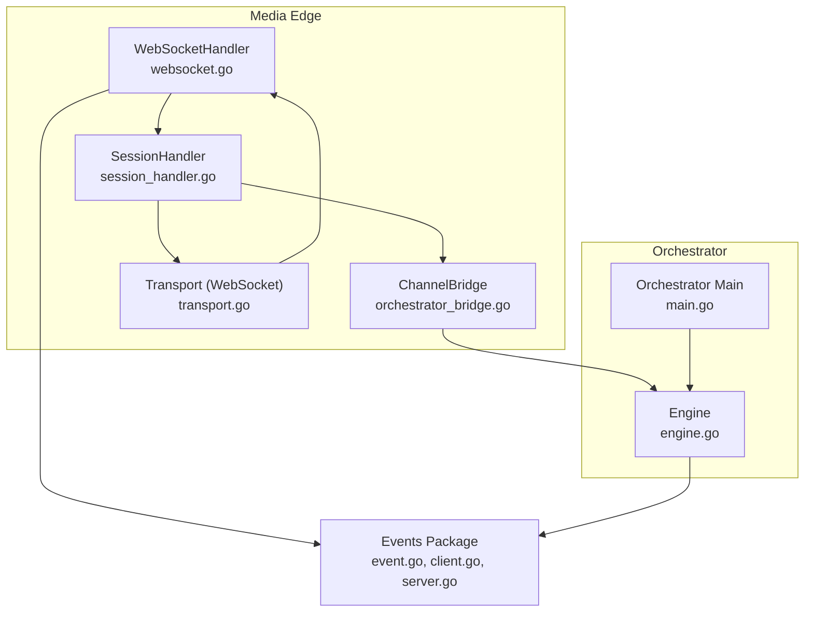
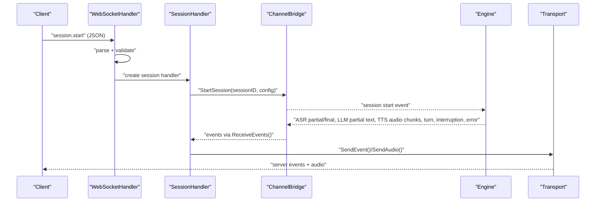
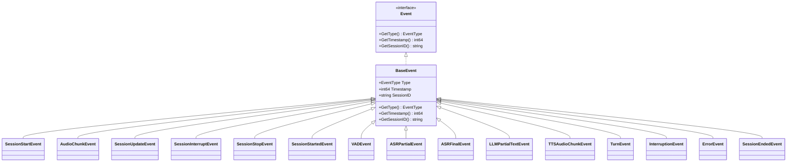
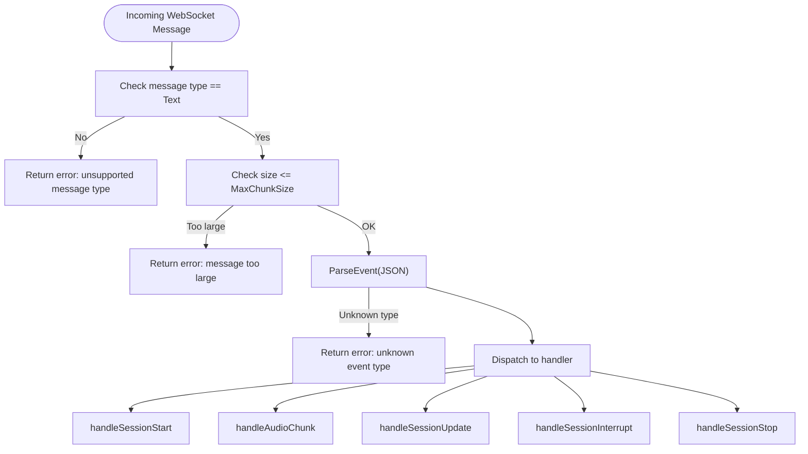
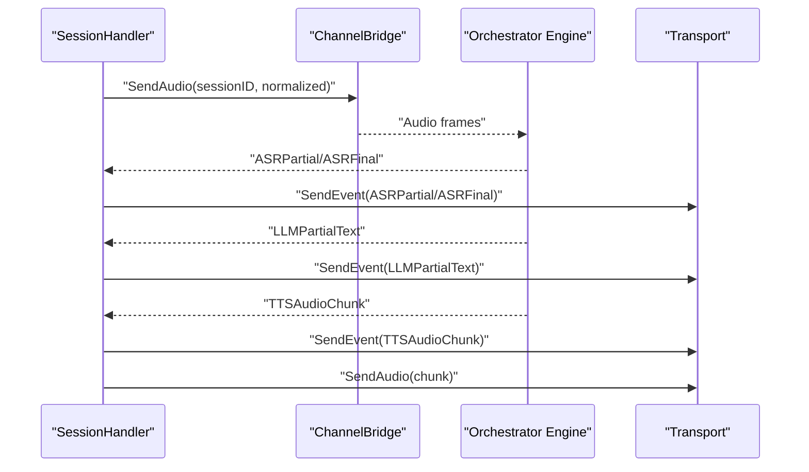
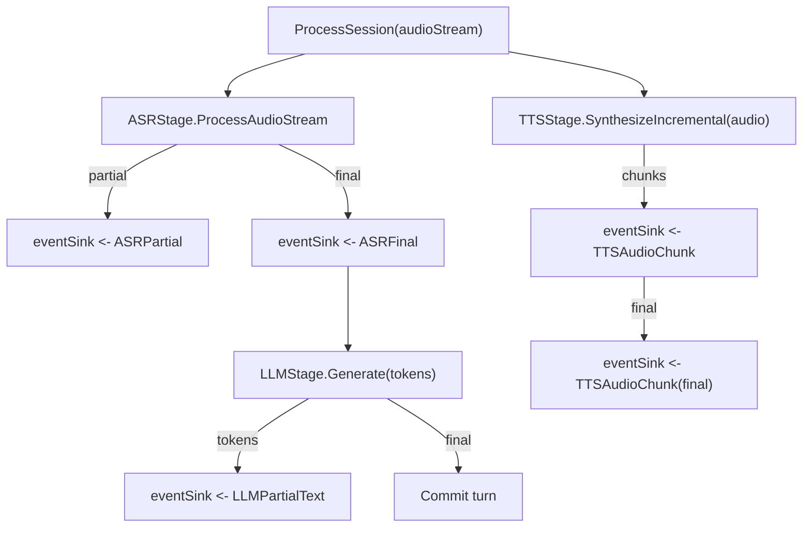
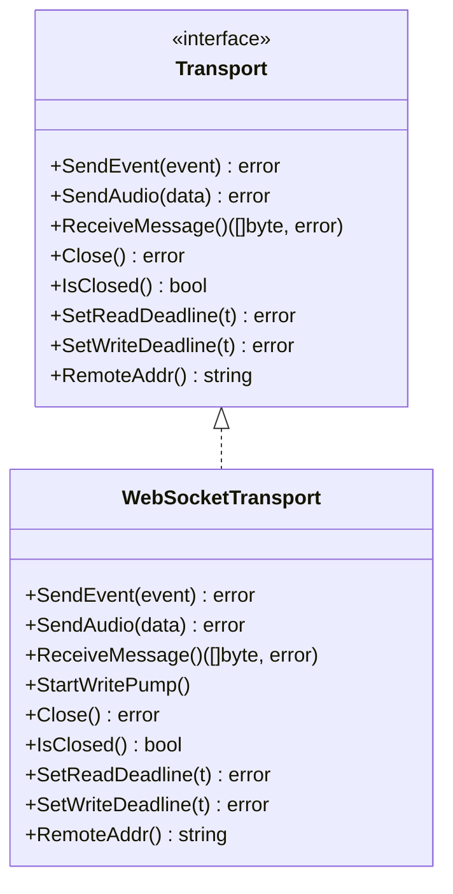
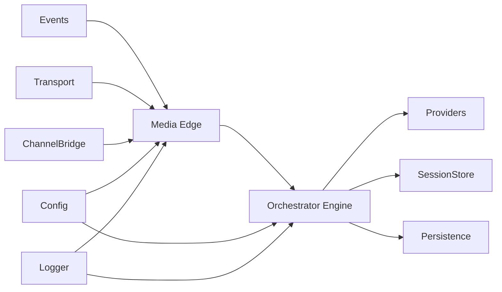

# Event-Driven Architecture

<cite>
**Referenced Files in This Document**
- [event.go](file://go/pkg/events/event.go)
- [client.go](file://go/pkg/events/client.go)
- [server.go](file://go/pkg/events/server.go)
- [events_test.go](file://go/pkg/events/events_test.go)
- [websocket.go](file://go/media-edge/internal/handler/websocket.go)
- [session_handler.go](file://go/media-edge/internal/handler/session_handler.go)
- [orchestrator_bridge.go](file://go/media-edge/internal/handler/orchestrator_bridge.go)
- [transport.go](file://go/media-edge/internal/transport/transport.go)
- [engine.go](file://go/orchestrator/internal/pipeline/engine.go)
- [main.go](file://go/orchestrator/cmd/main.go)
- [session.go](file://go/pkg/session/session.go)
- [common.go](file://go/pkg/contracts/common.go)
- [config.go](file://go/pkg/config/config.go)
- [logger.go](file://go/pkg/observability/logger.go)
</cite>

## Table of Contents
1. [Introduction](#introduction)
2. [Project Structure](#project-structure)
3. [Core Components](#core-components)
4. [Architecture Overview](#architecture-overview)
5. [Detailed Component Analysis](#detailed-component-analysis)
6. [Dependency Analysis](#dependency-analysis)
7. [Performance Considerations](#performance-considerations)
8. [Troubleshooting Guide](#troubleshooting-guide)
9. [Conclusion](#conclusion)
10. [Appendices](#appendices)

## Introduction
This document explains CloudApp’s event-driven architecture and message propagation system. It covers the complete lifecycle of events from generation to delivery, including event types, message formats, routing mechanisms, and inter-service communication patterns. It also documents the event sink pattern for real-time distribution, event serialization/deserialization, event filtering and subscription, ordering guarantees, and practical examples for building custom events and coordinating event-driven workflows. Finally, it outlines persistence, replay capabilities, and debugging strategies.

## Project Structure
CloudApp separates concerns across:
- Events package: event types, serialization, and deserialization
- Media Edge: WebSocket ingress, session lifecycle, and transport abstraction
- Orchestrator: pipeline orchestration, state machines, and event sinks
- Contracts and configuration: shared types and configuration
- Observability: logging, metrics, and tracing



**Diagram sources**
- [websocket.go:22-92](file://go/media-edge/internal/handler/websocket.go#L22-L92)
- [session_handler.go:17-117](file://go/media-edge/internal/handler/session_handler.go#L17-L117)
- [orchestrator_bridge.go:13-58](file://go/media-edge/internal/handler/orchestrator_bridge.go#L13-L58)
- [transport.go:16-42](file://go/media-edge/internal/transport/transport.go#L16-L42)
- [engine.go:17-106](file://go/orchestrator/internal/pipeline/engine.go#L17-L106)
- [main.go:26-193](file://go/orchestrator/cmd/main.go#L26-L193)
- [event.go:11-56](file://go/pkg/events/event.go#L11-L56)

**Section sources**
- [websocket.go:22-92](file://go/media-edge/internal/handler/websocket.go#L22-L92)
- [engine.go:17-106](file://go/orchestrator/internal/pipeline/engine.go#L17-L106)

## Core Components
- Event model and serialization
  - Centralized event types and base structure
  - JSON serialization/deserialization helpers
  - Audio payload encoding/decoding
- WebSocket ingress and session lifecycle
  - Connection management, ping/pong, timeouts
  - Event parsing and dispatch to session handlers
- Session handler and audio pipeline
  - VAD, audio normalization, chunking, playout tracking
  - Event forwarding to client via transport
- Orchestrator bridge
  - In-process channel-based bridge for MVP
  - Session channels, event sink, interruption signaling
- Orchestrator engine
  - ASR->LLM->TTS pipeline orchestration
  - Event sinks, timestamps, turn management, FSM transitions
- Transport abstraction
  - WebSocket transport with write pump and message framing
- Configuration and contracts
  - Shared audio formats, provider capabilities, and configuration structures

**Section sources**
- [event.go:11-210](file://go/pkg/events/event.go#L11-L210)
- [client.go:3-113](file://go/pkg/events/client.go#L3-L113)
- [server.go:7-178](file://go/pkg/events/server.go#L7-L178)
- [websocket.go:221-258](file://go/media-edge/internal/handler/websocket.go#L221-L258)
- [session_handler.go:176-439](file://go/media-edge/internal/handler/session_handler.go#L176-L439)
- [orchestrator_bridge.go:13-337](file://go/media-edge/internal/handler/orchestrator_bridge.go#L13-L337)
- [engine.go:108-375](file://go/orchestrator/internal/pipeline/engine.go#L108-L375)
- [transport.go:44-231](file://go/media-edge/internal/transport/transport.go#L44-L231)
- [config.go:9-276](file://go/pkg/config/config.go#L9-L276)
- [common.go:63-169](file://go/pkg/contracts/common.go#L63-L169)

## Architecture Overview
CloudApp uses a real-time event bus over WebSocket:
- Clients emit client-to-server events (session start/update/interrupt/stop, audio chunks)
- Media Edge parses, validates, and routes events to a per-session handler
- The session handler runs audio processing (VAD, normalization, chunking) and forwards downstream events
- An in-process bridge connects Media Edge to the Orchestrator engine
- The Orchestrator engine emits server-to-client events (ASR partial/final, LLM partial text, TTS audio chunks, turn, interruption, errors, session ended)
- Transport delivers events and audio to the client



**Diagram sources**
- [websocket.go:260-374](file://go/media-edge/internal/handler/websocket.go#L260-L374)
- [session_handler.go:119-147](file://go/media-edge/internal/handler/session_handler.go#L119-L147)
- [orchestrator_bridge.go:98-134](file://go/media-edge/internal/handler/orchestrator_bridge.go#L98-L134)
- [engine.go:108-208](file://go/orchestrator/internal/pipeline/engine.go#L108-L208)
- [transport.go:82-95](file://go/media-edge/internal/transport/transport.go#L82-L95)

## Detailed Component Analysis

### Event Model and Serialization
- Event types
  - Client-to-server: session.start, audio.chunk, session.update, session.interrupt, session.stop
  - Server-to-client: session.started, vad.event, asr.partial, asr.final, llm.partial_text, tts.audio_chunk, turn.event, interruption.event, error, session.ended
- Base event structure includes type, timestamp, and optional session_id
- Parsing and marshaling
  - ParseEvent inspects the base event type and returns the appropriate typed event
  - MarshalEvent/MustMarshalEvent serialize events to JSON
  - Audio payloads are base64-encoded/decoded for transport
- Tests validate round-trip serialization and parsing for all event types



**Diagram sources**
- [event.go:37-78](file://go/pkg/events/event.go#L37-L78)
- [client.go:3-113](file://go/pkg/events/client.go#L3-L113)
- [server.go:7-178](file://go/pkg/events/server.go#L7-L178)

**Section sources**
- [event.go:80-185](file://go/pkg/events/event.go#L80-L185)
- [client.go:3-113](file://go/pkg/events/client.go#L3-L113)
- [server.go:7-178](file://go/pkg/events/server.go#L7-L178)
- [events_test.go:9-582](file://go/pkg/events/events_test.go#L9-L582)

### WebSocket Ingress and Session Lifecycle
- Connection management
  - Upgrade HTTP to WebSocket, enforce allowed origins, set read/write deadlines, ping/pong handling
  - Per-connection write channel with backpressure and cleanup on close
- Message handling
  - Accepts only text messages containing JSON events
  - Enforces maximum message size from configuration
  - Parses events and dispatches to specific handlers
- Session lifecycle
  - session.start: creates session, saves to store, starts session handler, starts bridge session, emits session.started
  - audio.chunk: decodes base64 audio, processes through VAD and audio pipeline
  - session.update: updates session configuration
  - session.interrupt: triggers interruption handling
  - session.stop: stops handler, deletes session, emits session.ended, closes connection



**Diagram sources**
- [websocket.go:221-258](file://go/media-edge/internal/handler/websocket.go#L221-L258)
- [websocket.go:260-481](file://go/media-edge/internal/handler/websocket.go#L260-L481)

**Section sources**
- [websocket.go:94-192](file://go/media-edge/internal/handler/websocket.go#L94-L192)
- [websocket.go:221-481](file://go/media-edge/internal/handler/websocket.go#L221-L481)

### Session Handler and Audio Pipeline
- Responsibilities
  - Manage per-session state and audio pipeline
  - VAD detection, speech start/end handling, interruption on user speech while bot speaks
  - Forward orchestrator events to client via transport
  - Queue and stream TTS audio to client
- Audio processing
  - Normalize audio to canonical format
  - Chunk frames (10 ms at 16 kHz), feed to VAD
  - Accumulate speech for ASR, detect interruptions
- Event forwarding
  - Forwards ASR partial/final, LLM partial text, TTS audio chunks, turn events, and errors to client
- Playout tracking
  - Tracks playback progress and updates active turn cursor



**Diagram sources**
- [session_handler.go:176-439](file://go/media-edge/internal/handler/session_handler.go#L176-L439)
- [engine.go:108-375](file://go/orchestrator/internal/pipeline/engine.go#L108-L375)
- [transport.go:82-95](file://go/media-edge/internal/transport/transport.go#L82-L95)

**Section sources**
- [session_handler.go:17-117](file://go/media-edge/internal/handler/session_handler.go#L17-L117)
- [session_handler.go:176-439](file://go/media-edge/internal/handler/session_handler.go#L176-L439)

### Orchestrator Bridge and Event Sink Pattern
- ChannelBridge
  - Manages per-session channels for audio, utterances, events, interrupts, and stop signals
  - Provides ReceiveEvents() returning a channel for server-to-client events
  - Supports interruption and stop signaling
- Event sink pattern
  - Engine writes events to a channel (eventSink) consumed by SessionHandler
  - SessionHandler forwards events to client via transport
- Statistics and lifecycle
  - Stats, ListSessions, WaitForSession helpers
  - Close cleans up all channels

```mermaid
classDiagram
class OrchestratorBridge {
<<interface>>
+StartSession(ctx, sessionID, config) error
+SendAudio(ctx, sessionID, audio) error
+SendUserUtterance(ctx, sessionID, transcript) error
+ReceiveEvents(ctx, sessionID) <-chan Event
+Interrupt(ctx, sessionID) error
+StopSession(ctx, sessionID) error
}
class ChannelBridge {
+StartSession(...)
+SendAudio(...)
+SendUserUtterance(...)
+ReceiveEvents(...)
+Interrupt(...)
+StopSession(...)
+EventChannel() <-chan BridgeEvent
+SendEventToSession(sessionID, event)
+Stats() BridgeStats
+ListSessions() []string
+WaitForSession(ctx, sessionID, timeout) *SessionChannels
+Close() error
}
class SessionChannels {
+audioCh chan []byte
+utteranceCh chan string
+eventCh chan Event
+interruptCh chan struct{}
+stopCh chan struct{}
}
OrchestratorBridge <|.. ChannelBridge
ChannelBridge --> SessionChannels : "manages"
```

**Diagram sources**
- [orchestrator_bridge.go:13-337](file://go/media-edge/internal/handler/orchestrator_bridge.go#L13-L337)

**Section sources**
- [orchestrator_bridge.go:13-337](file://go/media-edge/internal/handler/orchestrator_bridge.go#L13-L337)

### Orchestrator Engine and Pipeline
- Engine orchestration
  - Creates FSM, turn manager, prompt assembler, and stage instances
  - ProcessSession streams audio, emits ASR partial/final, and triggers LLM/TTS
  - ProcessUserUtterance coordinates LLM token streaming and incremental TTS
  - HandleInterruption cancels in-flight generations and commits partial turns
  - StopSession cleans up resources and state
- Event sinks and timestamps
  - Emits events to eventSink channel for downstream forwarding
  - Records timing metadata for SLIs
- Turn and state management
  - TurnManager tracks generation IDs and playout positions
  - FSM transitions reflect session state changes



**Diagram sources**
- [engine.go:108-375](file://go/orchestrator/internal/pipeline/engine.go#L108-L375)

**Section sources**
- [engine.go:17-106](file://go/orchestrator/internal/pipeline/engine.go#L17-L106)
- [engine.go:108-375](file://go/orchestrator/internal/pipeline/engine.go#L108-L375)

### Transport Abstraction
- Transport interface supports sending events (JSON) and audio (binary), receiving raw messages, and managing deadlines
- WebSocketTransport implements the interface with a write pump, ping/pong, and message framing
- Transport is injected into SessionHandler and used to forward events and audio to the client



**Diagram sources**
- [transport.go:16-42](file://go/media-edge/internal/transport/transport.go#L16-L42)
- [transport.go:44-231](file://go/media-edge/internal/transport/transport.go#L44-L231)

**Section sources**
- [transport.go:16-231](file://go/media-edge/internal/transport/transport.go#L16-L231)

### Configuration and Contracts
- AppConfig centralizes server, Redis, PostgreSQL, providers, audio, observability, and security settings
- Contracts define shared types (AudioFormat, ProviderError, SessionContext) and enums for encodings and error codes
- Session model includes runtime state, provider selections, and profiles

**Section sources**
- [config.go:9-276](file://go/pkg/config/config.go#L9-L276)
- [common.go:63-169](file://go/pkg/contracts/common.go#L63-L169)
- [session.go:62-84](file://go/pkg/session/session.go#L62-L84)

## Dependency Analysis
- Coupling
  - Media Edge depends on Events, Transport, and OrchestratorBridge
  - Orchestrator Engine depends on Providers, SessionStore, Persistence, and Events
  - Both sides communicate via typed events and channels
- Cohesion
  - Events package encapsulates serialization and event types
  - Transport abstracts WebSocket specifics
  - Bridge isolates inter-service communication
- External dependencies
  - Redis for session and persistence
  - Prometheus metrics endpoint
  - Optional OpenTelemetry tracing



**Diagram sources**
- [websocket.go:17-20](file://go/media-edge/internal/handler/websocket.go#L17-L20)
- [engine.go:19-25](file://go/orchestrator/internal/pipeline/engine.go#L19-L25)
- [main.go:73-120](file://go/orchestrator/cmd/main.go#L73-L120)
- [config.go:9-18](file://go/pkg/config/config.go#L9-L18)
- [logger.go:13-59](file://go/pkg/observability/logger.go#L13-L59)

**Section sources**
- [websocket.go:17-20](file://go/media-edge/internal/handler/websocket.go#L17-L20)
- [engine.go:19-25](file://go/orchestrator/internal/pipeline/engine.go#L19-L25)
- [main.go:73-120](file://go/orchestrator/cmd/main.go#L73-L120)

## Performance Considerations
- Backpressure and buffering
  - WebSocketHandler writeCh and SessionHandler outputBuffer prevent overload
  - ChannelBridge drops oldest items on full audio channels
- Audio processing cadence
  - 10 ms frames at 16 kHz balance latency and CPU usage
  - Jitter buffers smooth timing variations
- Concurrency
  - Separate goroutines for write pumps, audio output, and event processing
- Throughput limits
  - Max message size and timeouts protect against resource exhaustion
- Metrics and tracing
  - Prometheus metrics and optional OTel tracing enable monitoring

[No sources needed since this section provides general guidance]

## Troubleshooting Guide
- Unknown event type or invalid JSON
  - ParseEvent returns errors for unknown types or malformed JSON
  - Validate event type and payload shape
- Unsupported message type or oversized message
  - WebSocketHandler rejects non-text messages and enforces MaxChunkSize
- Connection issues
  - Ping/pong handling and deadlines prevent stale connections
  - Cleanup routines close channels and delete sessions
- Provider errors
  - ProviderError carries retriable flags and details
  - Engine forwards error events to client
- Debugging
  - Structured logging with session and trace IDs
  - Metrics endpoints for health and readiness checks

**Section sources**
- [events_test.go:341-363](file://go/pkg/events/events_test.go#L341-L363)
- [websocket.go:221-236](file://go/media-edge/internal/handler/websocket.go#L221-L236)
- [websocket.go:138-145](file://go/media-edge/internal/handler/websocket.go#L138-L145)
- [websocket.go:500-536](file://go/media-edge/internal/handler/websocket.go#L500-L536)
- [common.go:104-111](file://go/pkg/contracts/common.go#L104-L111)
- [logger.go:85-109](file://go/pkg/observability/logger.go#L85-L109)
- [main.go:125-145](file://go/orchestrator/cmd/main.go#L125-L145)

## Conclusion
CloudApp’s event-driven architecture cleanly separates concerns between ingestion, session processing, and orchestration. Events are strongly typed, serialized consistently, and propagated via channels and transports. The design supports real-time responsiveness, interruption handling, and extensibility for future inter-service transports. Persistence and replay can be built on top of existing session stores and event sinks.

[No sources needed since this section summarizes without analyzing specific files]

## Appendices

### Practical Examples

- Custom event creation
  - Create a typed event using the provided constructors and marshal to JSON
  - Example paths:
    - [NewSessionStartEvent:14-19](file://go/pkg/events/client.go#L14-L19)
    - [NewAudioChunkEvent:59-65](file://go/pkg/events/client.go#L59-L65)
    - [NewASRFinalEvent:66-72](file://go/pkg/events/server.go#L66-L72)
    - [NewTTSAudioChunkEvent:97-105](file://go/pkg/events/server.go#L97-L105)
    - [MarshalEvent:187-190](file://go/pkg/events/event.go#L187-L190)

- Event handler registration
  - WebSocketHandler switches on event type and delegates to dedicated handlers
  - Example paths:
    - [handleMessage switch:238-257](file://go/media-edge/internal/handler/websocket.go#L238-L257)
    - [handleSessionStart:260-374](file://go/media-edge/internal/handler/websocket.go#L260-L374)
    - [handleAudioChunk:376-405](file://go/media-edge/internal/handler/websocket.go#L376-L405)
    - [handleSessionUpdate:407-425](file://go/media-edge/internal/handler/websocket.go#L407-L425)
    - [handleSessionInterrupt:427-445](file://go/media-edge/internal/handler/websocket.go#L427-L445)
    - [handleSessionStop:447-481](file://go/media-edge/internal/handler/websocket.go#L447-L481)

- Event-driven workflow coordination
  - Media Edge forwards orchestrator events to client via transport
  - Orchestrator emits events to eventSink for downstream consumption
  - Example paths:
    - [SessionHandler handleOrchestratorEvent:334-403](file://go/media-edge/internal/handler/session_handler.go#L334-L403)
    - [Engine ProcessSession eventSink:183-200](file://go/orchestrator/internal/pipeline/engine.go#L183-L200)
    - [Engine ProcessUserUtterance token/tts concurrency:282-367](file://go/orchestrator/internal/pipeline/engine.go#L282-L367)

- Event ordering guarantees
  - Channel-based eventSink ensures FIFO delivery per session
  - Transport write pump serializes outbound messages
  - Example paths:
    - [ChannelBridge eventCh:53-54](file://go/media-edge/internal/handler/orchestrator_bridge.go#L53-L54)
    - [Transport writeCh and writePump:77-161](file://go/media-edge/internal/transport/transport.go#L77-L161)

- Event persistence and replay
  - SessionStore persists session state and metadata
  - Redis persistence supports session retrieval and cleanup
  - Example paths:
    - [SessionStore usage:314-320](file://go/media-edge/internal/handler/websocket.go#L314-L320)
    - [Redis persistence initialization:88-89](file://go/orchestrator/cmd/main.go#L88-L89)
    - [StopSession cleanup:438-470](file://go/orchestrator/internal/pipeline/engine.go#L438-L470)

- Event filtering and subscription
  - Transport abstraction allows per-connection filtering and throttling
  - Example paths:
    - [Transport.SendEvent:82-90](file://go/media-edge/internal/transport/transport.go#L82-L90)
    - [WebSocketHandler sendEvent:483-498](file://go/media-edge/internal/handler/websocket.go#L483-L498)

- Event debugging strategies
  - Structured logging with session and trace IDs
  - Metrics endpoints for health and performance
  - Example paths:
    - [Logger.WithSession:85-91](file://go/pkg/observability/logger.go#L85-L91)
    - [HTTP health/readiness/metrics:125-149](file://go/orchestrator/cmd/main.go#L125-L149)