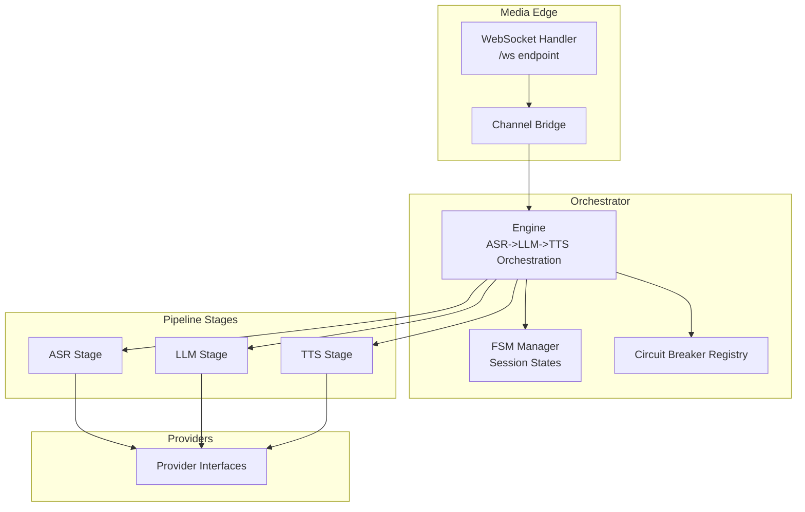
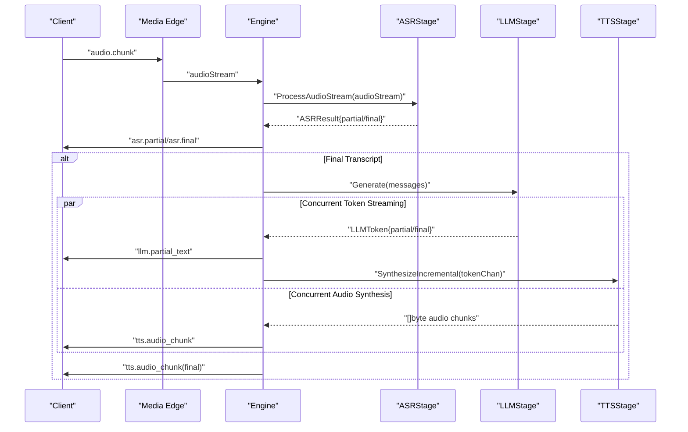
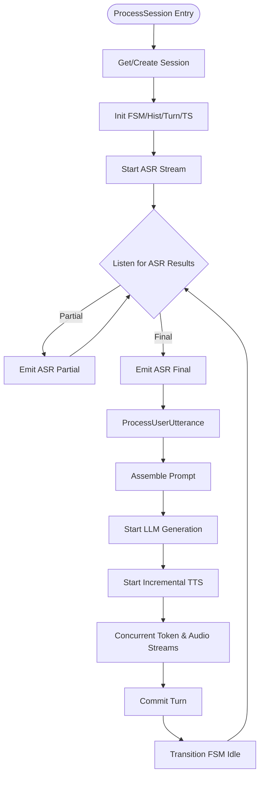
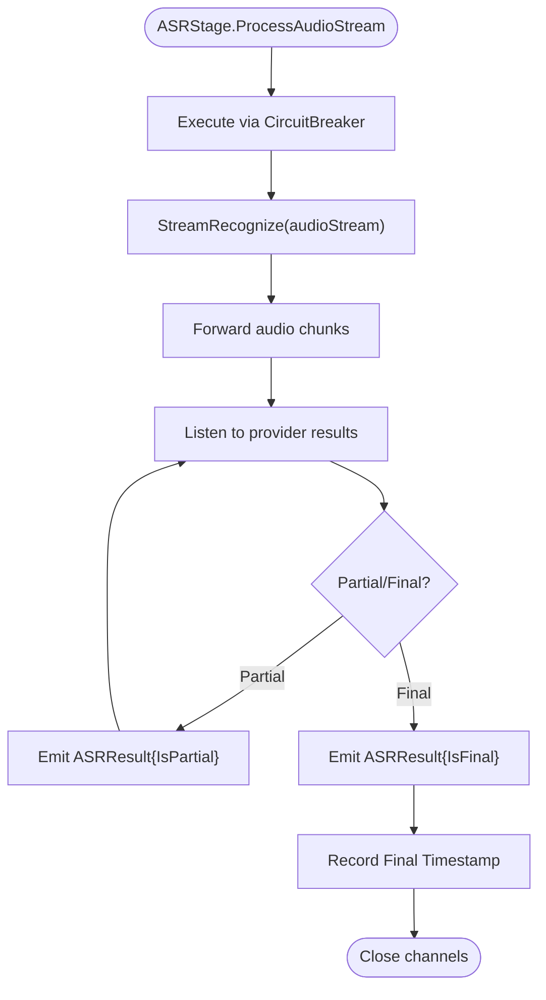
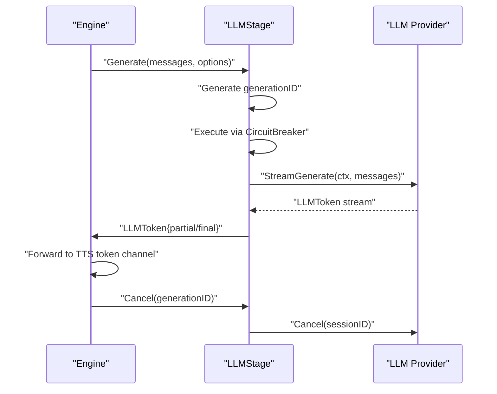
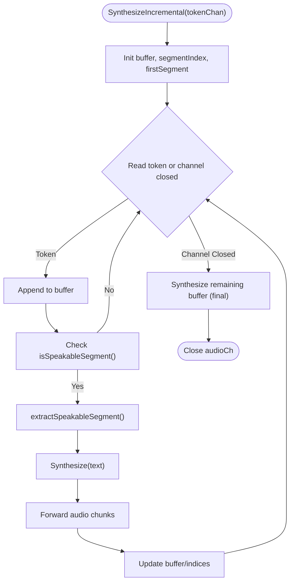
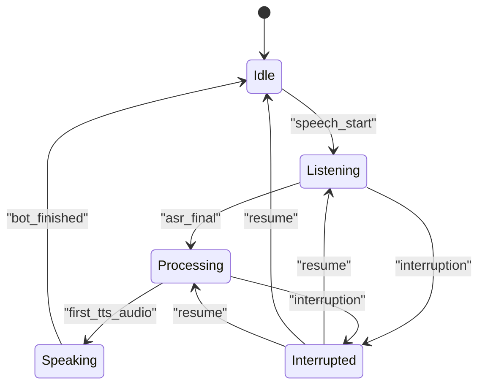
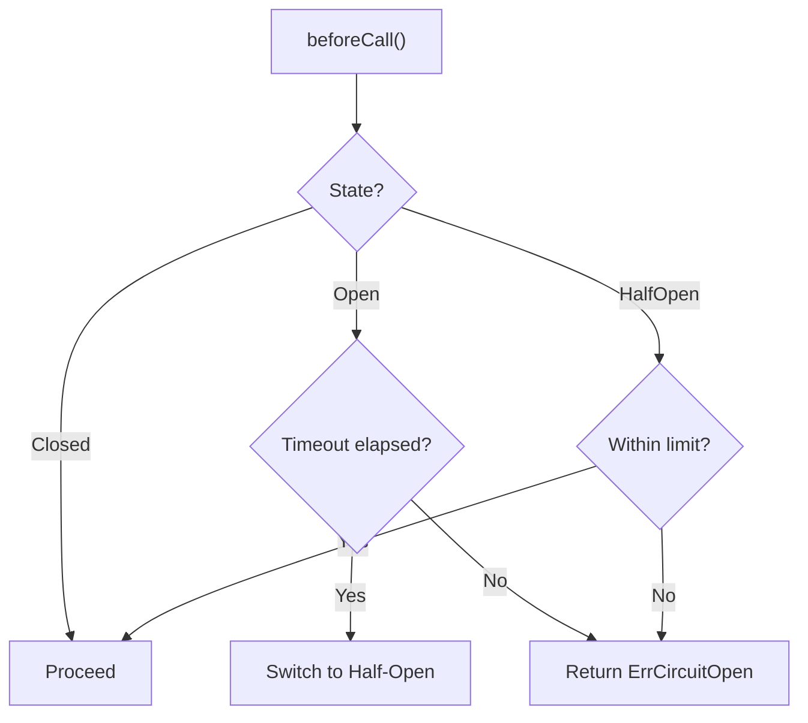
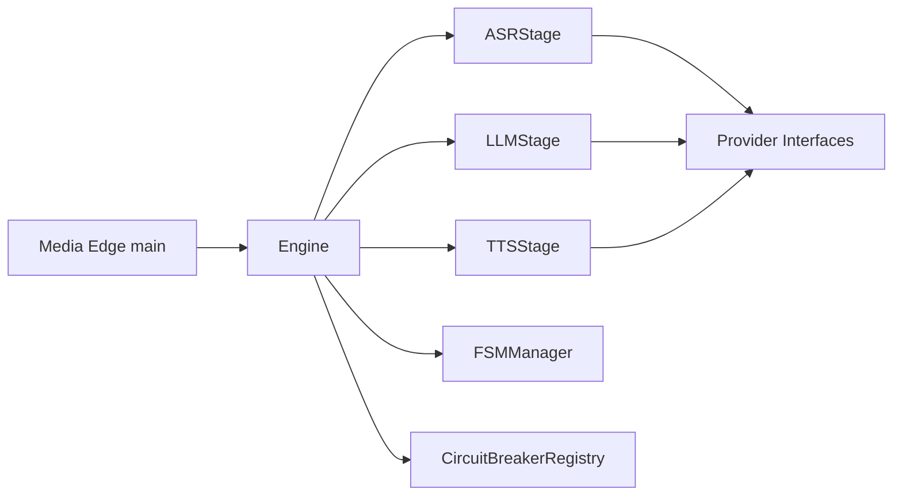

# Pipeline Processing Flow

<cite>
**Referenced Files in This Document**
- [engine.go](file://go/orchestrator/internal/pipeline/engine.go)
- [asr_stage.go](file://go/orchestrator/internal/pipeline/asr_stage.go)
- [llm_stage.go](file://go/orchestrator/internal/pipeline/llm_stage.go)
- [tts_stage.go](file://go/orchestrator/internal/pipeline/tts_stage.go)
- [circuit_breaker.go](file://go/orchestrator/internal/pipeline/circuit_breaker.go)
- [fsm.go](file://go/orchestrator/internal/statemachine/fsm.go)
- [interfaces.go](file://go/pkg/providers/interfaces.go)
- [event.go](file://go/pkg/events/event.go)
- [config.go](file://go/pkg/config/config.go)
- [chunk.go](file://go/pkg/audio/chunk.go)
- [metrics.go](file://go/pkg/observability/metrics.go)
- [main.go](file://go/media-edge/cmd/main.go)
- [config-cloud.yaml](file://examples/config-cloud.yaml)
- [config-local.yaml](file://examples/config-local.yaml)
</cite>

## Table of Contents
1. [Introduction](#introduction)
2. [Project Structure](#project-structure)
3. [Core Components](#core-components)
4. [Architecture Overview](#architecture-overview)
5. [Detailed Component Analysis](#detailed-component-analysis)
6. [Dependency Analysis](#dependency-analysis)
7. [Performance Considerations](#performance-considerations)
8. [Troubleshooting Guide](#troubleshooting-guide)
9. [Conclusion](#conclusion)
10. [Appendices](#appendices)

## Introduction
This document explains CloudApp’s multi-stage pipeline that transforms real-time audio into spoken responses, covering the end-to-end orchestration from Automatic Speech Recognition (ASR), through Large Language Model (LLM) generation, to Text-to-Speech (TTS). It details the concurrent processing model, stage coordination, incremental synthesis, streaming data flow, synchronization mechanisms, error handling, and observability. Practical guidance is included for pipeline customization, stage replacement, and debugging.

## Project Structure
CloudApp is organized into:
- Orchestrator service: pipeline orchestration, state machines, and session management
- Media Edge service: WebSocket ingress, session store bridging, and HTTP endpoints
- Provider interfaces and registries: abstraction for ASR/LLM/TTS/VAD providers
- Observability: metrics, logging, and tracing
- Examples: configuration templates for cloud and local deployments

**Diagram sources**
- [main.go:84-91](file://go/media-edge/cmd/main.go#L84-L91)
- [engine.go:70-106](file://go/orchestrator/internal/pipeline/engine.go#L70-L106)
- [fsm.go:56-92](file://go/orchestrator/internal/statemachine/fsm.go#L56-L92)
- [circuit_breaker.go:208-234](file://go/orchestrator/internal/pipeline/circuit_breaker.go#L208-L234)
- [interfaces.go:21-76](file://go/pkg/providers/interfaces.go#L21-L76)

**Section sources**
- [main.go:84-127](file://go/media-edge/cmd/main.go#L84-L127)
- [engine.go:17-39](file://go/orchestrator/internal/pipeline/engine.go#L17-L39)

## Core Components
- Engine: Central orchestrator managing session lifecycle, stage coordination, and event emission. It wires ASR, LLM, and TTS stages, maintains active sessions, and integrates state machines and prompt assembly.
- Pipeline Stages: ASRStage, LLMStage, and TTSStage encapsulate provider interactions, streaming, cancellation, and circuit breaker protection.
- State Machine: SessionFSM enforces valid state transitions and emits turn events for UI/clients.
- Circuit Breaker: Protects providers from cascading failures with configurable thresholds and timeouts.
- Events: WebSocket event types define the real-time protocol for partial transcripts, audio chunks, turn state, and interruptions.
- Configuration: AppConfig defines server, provider, audio, observability, and security settings.

**Section sources**
- [engine.go:17-106](file://go/orchestrator/internal/pipeline/engine.go#L17-L106)
- [asr_stage.go:25-45](file://go/orchestrator/internal/pipeline/asr_stage.go#L25-L45)
- [llm_stage.go:33-56](file://go/orchestrator/internal/pipeline/llm_stage.go#L33-L56)
- [tts_stage.go:16-39](file://go/orchestrator/internal/pipeline/tts_stage.go#L16-L39)
- [fsm.go:44-92](file://go/orchestrator/internal/statemachine/fsm.go#L44-L92)
- [circuit_breaker.go:57-79](file://go/orchestrator/internal/pipeline/circuit_breaker.go#L57-L79)
- [event.go:11-35](file://go/pkg/events/event.go#L11-L35)
- [config.go:9-95](file://go/pkg/config/config.go#L9-L95)

## Architecture Overview
The pipeline operates as a streaming, concurrent workflow:
- Media Edge accepts audio via WebSocket and bridges to the Orchestrator.
- Engine initializes session context, FSM, and history; starts ASR streaming.
- ASR emits partial and final transcripts; final transcripts trigger LLM generation.
- LLM streams tokens; Engine forwards tokens to TTS incrementally.
- TTS synthesizes audio in segments; Engine emits audio chunks and final markers.
- Interruption handling cancels in-flight LLM/TTS and resumes listening.

**Diagram sources**
- [engine.go:108-208](file://go/orchestrator/internal/pipeline/engine.go#L108-L208)
- [engine.go:210-375](file://go/orchestrator/internal/pipeline/engine.go#L210-L375)
- [asr_stage.go:164-290](file://go/orchestrator/internal/pipeline/asr_stage.go#L164-L290)
- [llm_stage.go:58-185](file://go/orchestrator/internal/pipeline/llm_stage.go#L58-L185)
- [tts_stage.go:129-236](file://go/orchestrator/internal/pipeline/tts_stage.go#L129-L236)

## Detailed Component Analysis

### Engine Orchestration
- Session lifecycle: Engine retrieves or creates sessions, builds FSM, history, and timestamp trackers; stores active sessions in a thread-safe map.
- ASR ingestion: Starts ASR streaming with options derived from session metadata; emits partial and final ASR events; records timestamps.
- Utterance processing: On final ASR, assembles prompt with history, starts LLM generation, and initiates incremental TTS; coordinates token-to-audio forwarding; commits turns and transitions FSM to idle.
- Interruption handling: Cancels active LLM/TTS, records timestamps, commits spoken text, and resumes listening.
- Cleanup: Stops session, transitions FSM to idle, removes session artifacts, and deletes Redis entries.

**Diagram sources**
- [engine.go:108-208](file://go/orchestrator/internal/pipeline/engine.go#L108-L208)
- [engine.go:210-375](file://go/orchestrator/internal/pipeline/engine.go#L210-L375)

**Section sources**
- [engine.go:108-208](file://go/orchestrator/internal/pipeline/engine.go#L108-L208)
- [engine.go:210-375](file://go/orchestrator/internal/pipeline/engine.go#L210-L375)
- [engine.go:377-436](file://go/orchestrator/internal/pipeline/engine.go#L377-L436)
- [engine.go:438-470](file://go/orchestrator/internal/pipeline/engine.go#L438-L470)

### ASR Stage
- Streaming recognition: Accepts an audio stream channel and forwards chunks to provider; emits partial and final results with confidence and language metadata.
- Timing and metrics: Records stage start and final timestamps; tracks latency; integrates circuit breaker protection.
- Cancellation: Delegates cancellation to provider.

**Diagram sources**
- [asr_stage.go:164-290](file://go/orchestrator/internal/pipeline/asr_stage.go#L164-L290)

**Section sources**
- [asr_stage.go:47-162](file://go/orchestrator/internal/pipeline/asr_stage.go#L47-L162)
- [asr_stage.go:164-290](file://go/orchestrator/internal/pipeline/asr_stage.go#L164-L290)
- [asr_stage.go:292-302](file://go/orchestrator/internal/pipeline/asr_stage.go#L292-L302)

### LLM Stage
- Streaming generation: Starts provider generation with a unique generation ID; tracks dispatch and first-token timestamps; streams tokens with usage metadata.
- Concurrency: Uses cancellable contexts per generation; supports cancellation via generation ID.
- Metrics: Records requests, durations, and errors; integrates circuit breaker.

**Diagram sources**
- [llm_stage.go:58-185](file://go/orchestrator/internal/pipeline/llm_stage.go#L58-L185)

**Section sources**
- [llm_stage.go:58-185](file://go/orchestrator/internal/pipeline/llm_stage.go#L58-L185)
- [llm_stage.go:187-211](file://go/orchestrator/internal/pipeline/llm_stage.go#L187-L211)

### TTS Stage
- Incremental synthesis: Buffers tokens until a speakable segment is formed (sentence/phrase boundaries or length thresholds), then synthesizes segments with increasing indices; forwards audio chunks; marks final segment.
- Concurrency: Runs alongside LLM token streaming; uses cancellable contexts per synthesis.
- Metrics: Records dispatch and first-chunk timestamps; integrates circuit breaker.

**Diagram sources**
- [tts_stage.go:129-236](file://go/orchestrator/internal/pipeline/tts_stage.go#L129-L236)
- [tts_stage.go:270-312](file://go/orchestrator/internal/pipeline/tts_stage.go#L270-L312)

**Section sources**
- [tts_stage.go:129-236](file://go/orchestrator/internal/pipeline/tts_stage.go#L129-L236)
- [tts_stage.go:238-258](file://go/orchestrator/internal/pipeline/tts_stage.go#L238-L258)

### State Machine and Turn Management
- SessionFSM defines valid transitions among Idle, Listening, Processing, Speaking, and Interrupted states; emits turn events on transitions.
- Engine integrates FSM with pipeline events and timestamps to reflect real-time state changes.

**Diagram sources**
- [fsm.go:44-92](file://go/orchestrator/internal/statemachine/fsm.go#L44-L92)
- [fsm.go:163-200](file://go/orchestrator/internal/statemachine/fsm.go#L163-L200)

**Section sources**
- [fsm.go:101-161](file://go/orchestrator/internal/statemachine/fsm.go#L101-L161)
- [engine.go:472-493](file://go/orchestrator/internal/pipeline/engine.go#L472-L493)

### Circuit Breaker Protection
- Per-provider circuit breakers guard against provider outages; configurable failure threshold, timeout, and half-open limits.
- Execute(fn) protects stage invocations; Stats and Reset expose diagnostics.

**Diagram sources**
- [circuit_breaker.go:82-121](file://go/orchestrator/internal/pipeline/circuit_breaker.go#L82-L121)
- [circuit_breaker.go:135-171](file://go/orchestrator/internal/pipeline/circuit_breaker.go#L135-L171)

**Section sources**
- [circuit_breaker.go:38-56](file://go/orchestrator/internal/pipeline/circuit_breaker.go#L38-L56)
- [circuit_breaker.go:207-234](file://go/orchestrator/internal/pipeline/circuit_breaker.go#L207-L234)

### Provider Interfaces and Contracts
- ASRProvider, LLMProvider, TTSProvider define streaming contracts with cancellation and capability reporting.
- Options types (ASROptions, LLMOptions, TTSOptions) carry session-specific parameters.

**Section sources**
- [interfaces.go:21-76](file://go/pkg/providers/interfaces.go#L21-L76)

### Events and Real-Time Protocol
- Client-to-server: session.start, audio.chunk, session.update, session.interrupt, session.stop
- Server-to-client: session.started, vad.event, asr.partial, asr.final, llm.partial_text, tts.audio_chunk, turn.event, interruption.event, error, session.ended

**Section sources**
- [event.go:14-35](file://go/pkg/events/event.go#L14-L35)
- [event.go:80-185](file://go/pkg/events/event.go#L80-L185)

### Configuration and Deployment
- AppConfig centralizes server, Redis, Postgres, providers, audio profiles, observability, and security settings.
- Example configs demonstrate cloud and local provider selections and credentials.

**Section sources**
- [config.go:9-95](file://go/pkg/config/config.go#L9-L95)
- [config-cloud.yaml:12-39](file://examples/config-cloud.yaml#L12-L39)
- [config-local.yaml:12-38](file://examples/config-local.yaml#L12-L38)

## Dependency Analysis
- Engine depends on ProviderRegistry, session store, persistence, observability, and state machine components.
- Pipeline stages depend on provider interfaces and circuit breakers.
- Media Edge depends on configuration, session store, and WebSocket handler.

**Diagram sources**
- [engine.go:70-106](file://go/orchestrator/internal/pipeline/engine.go#L70-L106)
- [main.go:80-91](file://go/media-edge/cmd/main.go#L80-L91)

**Section sources**
- [engine.go:17-39](file://go/orchestrator/internal/pipeline/engine.go#L17-L39)
- [main.go:80-91](file://go/media-edge/cmd/main.go#L80-L91)

## Performance Considerations
- Concurrency: Engine uses WaitGroups to coordinate LLM token streaming and TTS audio forwarding, enabling overlap between stages.
- Incremental synthesis: TTS buffers tokens until speakable segments form, reducing latency and improving naturalness.
- Metrics: Built-in histograms for ASR latency, LLM TTFT, TTS first chunk, server TTFA, and interruption stop latency enable SLO monitoring.
- Circuit breakers: Prevent cascading failures under provider stress; tune thresholds per workload.
- Audio framing: Chunker and reassembler support robust framing and sequencing for real-time audio.

**Section sources**
- [engine.go:282-367](file://go/orchestrator/internal/pipeline/engine.go#L282-L367)
- [tts_stage.go:129-236](file://go/orchestrator/internal/pipeline/tts_stage.go#L129-L236)
- [metrics.go:23-56](file://go/pkg/observability/metrics.go#L23-L56)
- [circuit_breaker.go:38-56](file://go/orchestrator/internal/pipeline/circuit_breaker.go#L38-L56)
- [chunk.go:7-101](file://go/pkg/audio/chunk.go#L7-L101)

## Troubleshooting Guide
- Provider errors: Check provider error counters and request durations; inspect stage logs for “provider error” entries.
- Circuit breaker open: Verify provider health; review breaker stats and reset if appropriate.
- Interruption anomalies: Confirm interruption detection and cancellation acknowledgments; verify FSM transitions to listening after interruption.
- Latency spikes: Inspect ASR latency, LLM TTFT, and TTS first chunk histograms; validate network and provider SLAs.
- Session cleanup: Ensure StopSession transitions FSM to idle and removes artifacts; confirm Redis deletion.

**Section sources**
- [metrics.go:124-137](file://go/pkg/observability/metrics.go#L124-L137)
- [circuit_breaker.go:180-189](file://go/orchestrator/internal/pipeline/circuit_breaker.go#L180-L189)
- [engine.go:377-436](file://go/orchestrator/internal/pipeline/engine.go#L377-L436)
- [engine.go:438-470](file://go/orchestrator/internal/pipeline/engine.go#L438-L470)

## Conclusion
CloudApp’s pipeline delivers low-latency, real-time voice interaction by coordinating ASR, LLM, and TTS through a robust orchestration layer. Its concurrent design, incremental synthesis, and strong observability enable responsive and resilient conversational experiences. With clear provider abstractions and configuration options, teams can customize providers, optimize performance, and debug efficiently.

## Appendices

### Pipeline Customization Examples
- Replace ASR provider: Select a new provider in AppConfig and register it via ProviderRegistry; ensure capabilities match expected streaming behavior.
- Swap LLM provider: Update defaults and model options; adjust temperature and max tokens per use case.
- Change TTS voice: Configure voice profile in session; pass voice options to TTS stage.
- Enable/disable interruptions: Toggle engine configuration and update FSM transitions accordingly.

**Section sources**
- [config.go:46-61](file://go/pkg/config/config.go#L46-L61)
- [engine.go:42-57](file://go/orchestrator/internal/pipeline/engine.go#L42-L57)
- [fsm.go:163-200](file://go/orchestrator/internal/statemachine/fsm.go#L163-L200)

### Stage Replacement Patterns
- Implement a new ASRProvider with StreamRecognize and Cancel; wrap with ASRStage for circuit breaker and metrics.
- Implement a new TTSProvider with StreamSynthesize and Cancel; integrate with incremental synthesis logic.
- Ensure options types (ASROptions, LLMOptions, TTSOptions) propagate session context.

**Section sources**
- [interfaces.go:21-76](file://go/pkg/providers/interfaces.go#L21-L76)
- [asr_stage.go:25-45](file://go/orchestrator/internal/pipeline/asr_stage.go#L25-L45)
- [tts_stage.go:16-39](file://go/orchestrator/internal/pipeline/tts_stage.go#L16-L39)

### Real-Time Pipeline Management
- WebSocket endpoints: Expose /ws for audio streaming; /health and /ready for operational checks; /metrics for Prometheus scraping.
- Session store: Manage session metadata and active turns; integrate with Redis for distributed state.
- Audio chunking: Use FrameChunker to align audio frames to provider sampling rates.

**Section sources**
- [main.go:96-127](file://go/media-edge/cmd/main.go#L96-L127)
- [chunk.go:192-230](file://go/pkg/audio/chunk.go#L192-L230)