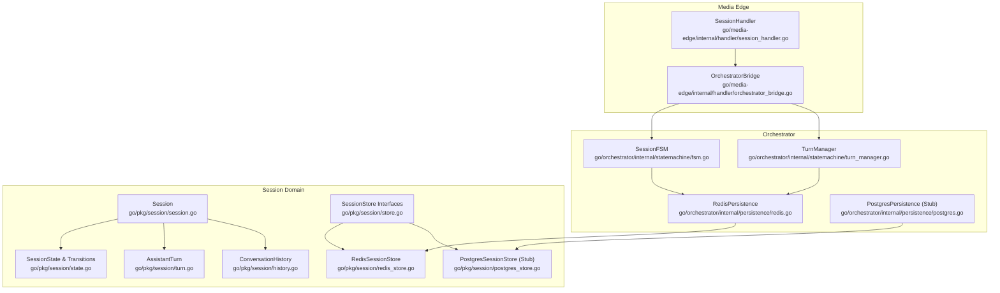
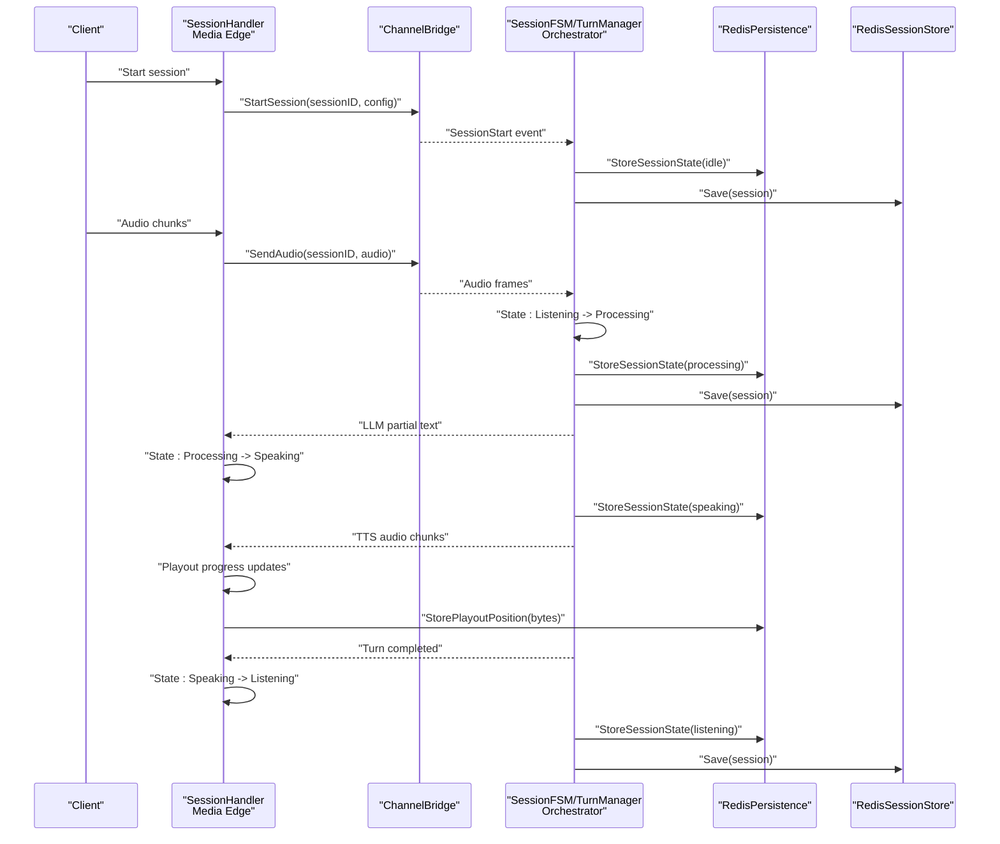
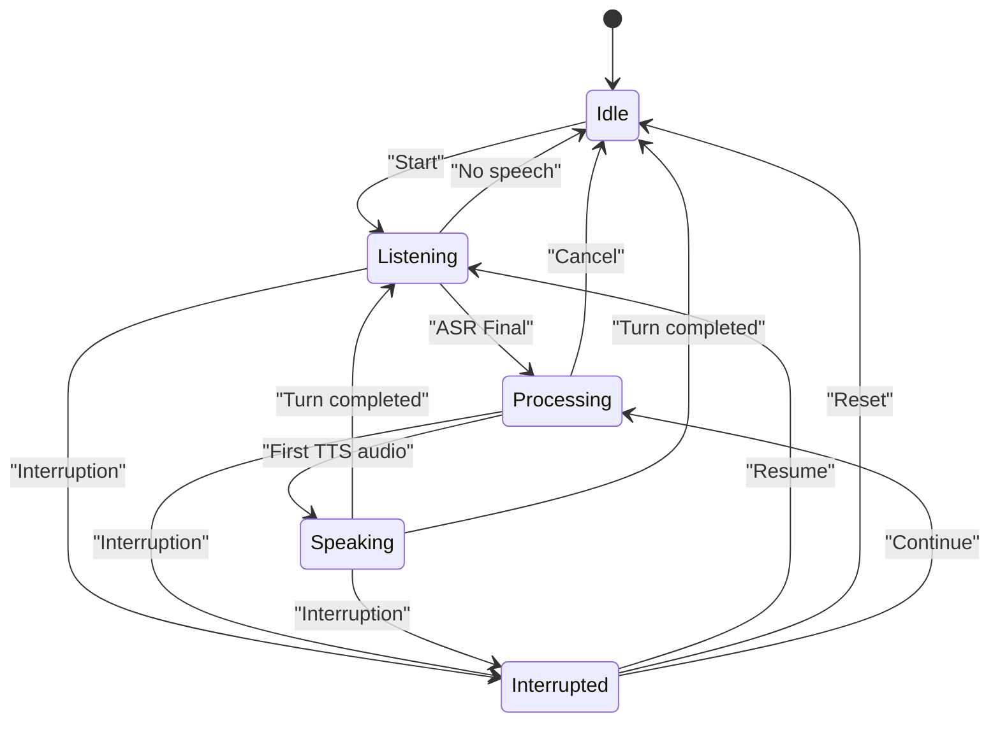
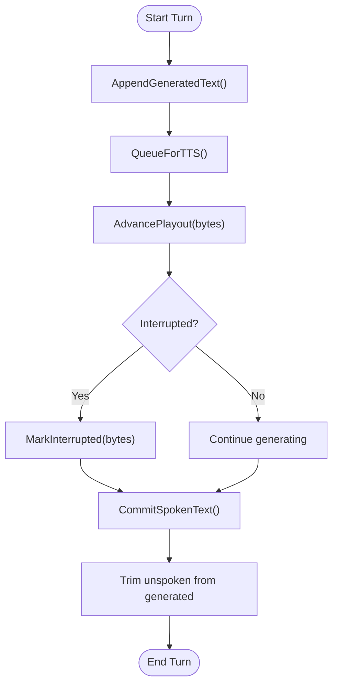
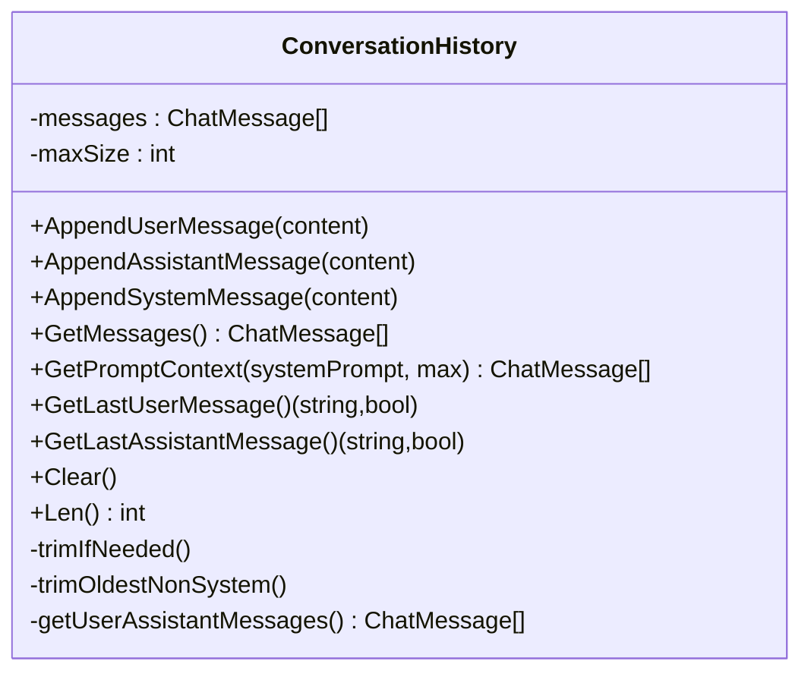
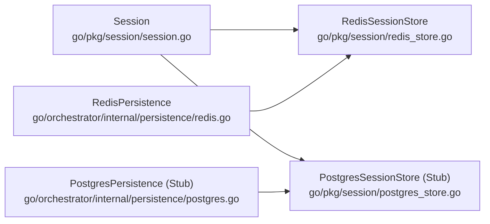
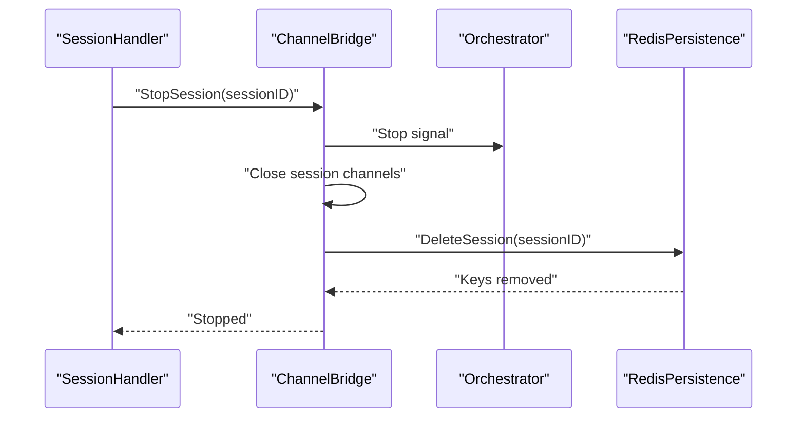
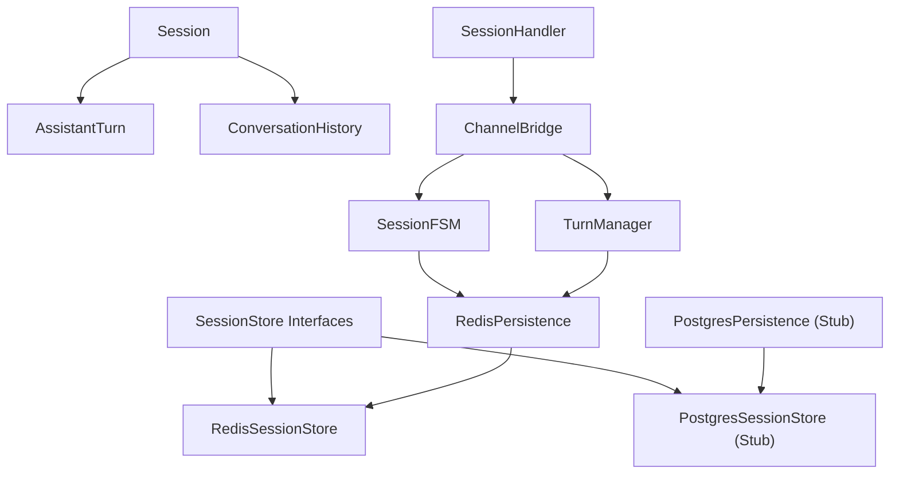

# Session State Management

<cite>
**Referenced Files in This Document**
- [session.go](file://go/pkg/session/session.go)
- [state.go](file://go/pkg/session/state.go)
- [history.go](file://go/pkg/session/history.go)
- [store.go](file://go/pkg/session/store.go)
- [redis_store.go](file://go/pkg/session/redis_store.go)
- [postgres_store.go](file://go/pkg/session/postgres_store.go)
- [turn.go](file://go/pkg/session/turn.go)
- [fsm.go](file://go/orchestrator/internal/statemachine/fsm.go)
- [turn_manager.go](file://go/orchestrator/internal/statemachine/turn_manager.go)
- [session_handler.go](file://go/media-edge/internal/handler/session_handler.go)
- [orchestrator_bridge.go](file://go/media-edge/internal/handler/orchestrator_bridge.go)
- [postgres.go](file://go/orchestrator/internal/persistence/postgres.go)
- [redis.go](file://go/orchestrator/internal/persistence/redis.go)
- [session_test.go](file://go/pkg/session/session_test.go)
</cite>

## Table of Contents
1. [Introduction](#introduction)
2. [Project Structure](#project-structure)
3. [Core Components](#core-components)
4. [Architecture Overview](#architecture-overview)
5. [Detailed Component Analysis](#detailed-component-analysis)
6. [Dependency Analysis](#dependency-analysis)
7. [Performance Considerations](#performance-considerations)
8. [Troubleshooting Guide](#troubleshooting-guide)
9. [Conclusion](#conclusion)
10. [Appendices](#appendices)

## Introduction
This document explains CloudApp’s session state management system end-to-end. It covers the session lifecycle from creation to termination, including session context storage, conversation history tracking, and turn-based state management. It also documents persistence mechanisms using Redis and PostgreSQL, cross-service state synchronization, cleanup procedures, timeouts, concurrency, and recovery strategies. Practical examples demonstrate state manipulation, history querying, and debugging techniques.

## Project Structure
CloudApp separates concerns across three layers:
- Session domain and persistence abstractions live under go/pkg/session.
- Orchestrator-side state machines and turn management live under go/orchestrator/internal/statemachine.
- Media Edge integrates audio pipeline, VAD, and session lifecycle with the orchestrator under go/media-edge/internal/handler.
- Persistence adapters for Redis and PostgreSQL live under go/orchestrator/internal/persistence.

**Diagram sources**
- [session_handler.go:17-117](file://go/media-edge/internal/handler/session_handler.go#L17-L117)
- [orchestrator_bridge.go:13-32](file://go/media-edge/internal/handler/orchestrator_bridge.go#L13-L32)
- [fsm.go:44-92](file://go/orchestrator/internal/statemachine/fsm.go#L44-L92)
- [turn_manager.go:11-25](file://go/orchestrator/internal/statemachine/turn_manager.go#L11-L25)
- [redis.go:13-36](file://go/orchestrator/internal/persistence/redis.go#L13-L36)
- [postgres.go:13-30](file://go/orchestrator/internal/persistence/postgres.go#L13-L30)
- [session.go:62-84](file://go/pkg/session/session.go#L62-L84)
- [state.go:8-17](file://go/pkg/session/state.go#L8-L17)
- [turn.go:9-25](file://go/pkg/session/turn.go#L9-L25)
- [history.go:11-17](file://go/pkg/session/history.go#L11-L17)
- [store.go:16-35](file://go/pkg/session/store.go#L16-L35)
- [redis_store.go:12-36](file://go/pkg/session/redis_store.go#L12-L36)
- [postgres_store.go:10-23](file://go/pkg/session/postgres_store.go#L10-L23)

**Section sources**
- [session_handler.go:17-117](file://go/media-edge/internal/handler/session_handler.go#L17-L117)
- [orchestrator_bridge.go:13-32](file://go/media-edge/internal/handler/orchestrator_bridge.go#L13-L32)
- [fsm.go:44-92](file://go/orchestrator/internal/statemachine/fsm.go#L44-L92)
- [turn_manager.go:11-25](file://go/orchestrator/internal/statemachine/turn_manager.go#L11-L25)
- [redis.go:13-36](file://go/orchestrator/internal/persistence/redis.go#L13-L36)
- [postgres.go:13-30](file://go/orchestrator/internal/persistence/postgres.go#L13-L30)
- [session.go:62-84](file://go/pkg/session/session.go#L62-L84)
- [state.go:8-17](file://go/pkg/session/state.go#L8-L17)
- [turn.go:9-25](file://go/pkg/session/turn.go#L9-L25)
- [history.go:11-17](file://go/pkg/session/history.go#L11-L17)
- [store.go:16-35](file://go/pkg/session/store.go#L16-L35)
- [redis_store.go:12-36](file://go/pkg/session/redis_store.go#L12-L36)
- [postgres_store.go:10-23](file://go/pkg/session/postgres_store.go#L10-L23)

## Core Components
- Session: Encapsulates runtime state, active turn, and metadata. Thread-safe setters update timestamps and enforce state transitions.
- SessionState and Transitions: Defines allowed state machine transitions and validation.
- AssistantTurn: Tracks generated, queued-for-TTS, and spoken text, playout cursor, and interruption state.
- ConversationHistory: Manages ordered message history with trimming and prompt context building.
- SessionStore and RedisSessionStore: Provide Get/Save/Delete/List operations with TTL extension and metrics.
- PostgresSessionStore (stub): Placeholder for durable persistence with documented TODOs.
- SessionFSM and TurnManager: Orchestrator-side state machine and turn lifecycle management.
- RedisPersistence: Hot-state helpers for playout position, bot speaking flag, generation IDs, and session state.
- PostgresPersistence (stub): Transcript/event persistence skeleton with schema definition.

**Section sources**
- [session.go:62-249](file://go/pkg/session/session.go#L62-L249)
- [state.go:8-153](file://go/pkg/session/state.go#L8-L153)
- [turn.go:9-230](file://go/pkg/session/turn.go#L9-L230)
- [history.go:11-233](file://go/pkg/session/history.go#L11-L233)
- [store.go:16-114](file://go/pkg/session/store.go#L16-L114)
- [redis_store.go:12-166](file://go/pkg/session/redis_store.go#L12-L166)
- [postgres_store.go:10-93](file://go/pkg/session/postgres_store.go#L10-L93)
- [fsm.go:44-308](file://go/orchestrator/internal/statemachine/fsm.go#L44-L308)
- [turn_manager.go:11-276](file://go/orchestrator/internal/statemachine/turn_manager.go#L11-L276)
- [redis.go:13-317](file://go/orchestrator/internal/persistence/redis.go#L13-L317)
- [postgres.go:13-196](file://go/orchestrator/internal/persistence/postgres.go#L13-L196)

## Architecture Overview
The system coordinates between Media Edge and Orchestrator:
- Media Edge runs the audio pipeline, VAD, and session lifecycle. It communicates with the Orchestrator via an in-process bridge (ChannelBridge) during MVP.
- Orchestrator maintains the session state machine and turn manager, persisting hot state in Redis and deferring durable persistence to PostgreSQL (stubbed).
- Session data is persisted in Redis via RedisSessionStore; PostgreSQL persistence is stubbed but designed for future implementation.

**Diagram sources**
- [session_handler.go:119-174](file://go/media-edge/internal/handler/session_handler.go#L119-L174)
- [session_handler.go:176-225](file://go/media-edge/internal/handler/session_handler.go#L176-L225)
- [session_handler.go:316-403](file://go/media-edge/internal/handler/session_handler.go#L316-L403)
- [session_handler.go:405-432](file://go/media-edge/internal/handler/session_handler.go#L405-L432)
- [orchestrator_bridge.go:98-134](file://go/media-edge/internal/handler/orchestrator_bridge.go#L98-L134)
- [fsm.go:101-161](file://go/orchestrator/internal/statemachine/fsm.go#L101-L161)
- [redis.go:227-278](file://go/orchestrator/internal/persistence/redis.go#L227-L278)
- [redis_store.go:61-85](file://go/pkg/session/redis_store.go#L61-L85)

**Section sources**
- [session_handler.go:119-174](file://go/media-edge/internal/handler/session_handler.go#L119-L174)
- [session_handler.go:176-225](file://go/media-edge/internal/handler/session_handler.go#L176-L225)
- [session_handler.go:316-403](file://go/media-edge/internal/handler/session_handler.go#L316-L403)
- [session_handler.go:405-432](file://go/media-edge/internal/handler/session_handler.go#L405-L432)
- [orchestrator_bridge.go:98-134](file://go/media-edge/internal/handler/orchestrator_bridge.go#L98-L134)
- [fsm.go:101-161](file://go/orchestrator/internal/statemachine/fsm.go#L101-L161)
- [redis.go:227-278](file://go/orchestrator/internal/persistence/redis.go#L227-L278)
- [redis_store.go:61-85](file://go/pkg/session/redis_store.go#L61-L85)

## Detailed Component Analysis

### Session Lifecycle and State Machine
- Creation: NewSession initializes state to idle, timestamps, and optional tenant/provider/audio profiles.
- Transitions: SetState validates transitions against a deterministic state machine; invalid transitions return an error.
- Runtime state: ActiveTurn, BotSpeaking, Interrupted flags track conversational dynamics.
- Concurrency: All setters/getters are thread-safe with RWMutex; Clone provides deep copy semantics.

**Diagram sources**
- [state.go:11-62](file://go/pkg/session/state.go#L11-L62)
- [fsm.go:62-86](file://go/orchestrator/internal/statemachine/fsm.go#L62-L86)
- [session_handler.go:258-265](file://go/media-edge/internal/handler/session_handler.go#L258-L265)

**Section sources**
- [session.go:86-208](file://go/pkg/session/session.go#L86-L208)
- [state.go:64-153](file://go/pkg/session/state.go#L64-L153)
- [fsm.go:163-200](file://go/orchestrator/internal/statemachine/fsm.go#L163-L200)
- [session_test.go:37-70](file://go/pkg/session/session_test.go#L37-L70)

### Turn-Based State Management
- AssistantTurn tracks generated text, queued-for-TTS text, spoken text, playout cursor, and interruption.
- CommitSpokenText trims generated text to only what was actually spoken, enabling accurate history.
- TurnManager coordinates turn lifecycle: start, append generated text, mark queued, advance playout, handle interruptions, and commit.

**Diagram sources**
- [turn.go:36-95](file://go/pkg/session/turn.go#L36-L95)
- [turn_manager.go:27-130](file://go/orchestrator/internal/statemachine/turn_manager.go#L27-L130)

**Section sources**
- [turn.go:36-230](file://go/pkg/session/turn.go#L36-L230)
- [turn_manager.go:27-130](file://go/orchestrator/internal/statemachine/turn_manager.go#L27-L130)
- [session_test.go:72-135](file://go/pkg/session/session_test.go#L72-L135)

### Conversation History and Prompt Context
- ConversationHistory supports appending user/assistant/system messages, trimming to max size while preserving system messages, and building prompt context for LLMs.
- GetPromptContext composes system prompt plus recent user/assistant messages, respecting a configurable cap.

**Diagram sources**
- [history.go:11-233](file://go/pkg/session/history.go#L11-L233)

**Section sources**
- [history.go:19-233](file://go/pkg/session/history.go#L19-L233)
- [session_test.go:137-182](file://go/pkg/session/session_test.go#L137-L182)

### Session Persistence and Synchronization
- RedisSessionStore: JSON-serialized session objects with TTL, metrics, and key composition helpers. Supports UpdateTurn by fetching, updating, and saving.
- RedisPersistence: Hot-state helpers for playout position, bot speaking flag, generation IDs, and session state using Redis hashes and TTL.
- PostgresSessionStore (stub): Intended for durable persistence with TODOs; currently logs and returns errors.
- PostgresPersistence (stub): Transcript and event persistence skeleton with schema definition and logging.

**Diagram sources**
- [redis_store.go:12-166](file://go/pkg/session/redis_store.go#L12-L166)
- [postgres_store.go:10-93](file://go/pkg/session/postgres_store.go#L10-L93)
- [redis.go:13-317](file://go/orchestrator/internal/persistence/redis.go#L13-L317)
- [postgres.go:13-196](file://go/orchestrator/internal/persistence/postgres.go#L13-L196)

**Section sources**
- [redis_store.go:38-166](file://go/pkg/session/redis_store.go#L38-L166)
- [postgres_store.go:25-93](file://go/pkg/session/postgres_store.go#L25-L93)
- [redis.go:38-317](file://go/orchestrator/internal/persistence/redis.go#L38-L317)
- [postgres.go:40-196](file://go/orchestrator/internal/persistence/postgres.go#L40-L196)

### Cross-Service Communication and Cleanup
- ChannelBridge: In-process bridge between Media Edge and Orchestrator with session channels for audio, utterances, events, interrupts, and stop signals.
- Cleanup: StopSession closes channels and removes session entries; RedisPersistence.DeleteSession removes all hot-state keys.

**Diagram sources**
- [orchestrator_bridge.go:242-267](file://go/media-edge/internal/handler/orchestrator_bridge.go#L242-L267)
- [redis.go:280-301](file://go/orchestrator/internal/persistence/redis.go#L280-L301)

**Section sources**
- [orchestrator_bridge.go:242-267](file://go/media-edge/internal/handler/orchestrator_bridge.go#L242-L267)
- [redis.go:280-301](file://go/orchestrator/internal/persistence/redis.go#L280-L301)

### Practical Examples

- Manipulating session state
  - Create a session and set providers, audio profile, voice profile, and model options.
  - Transition state using SetState with validation.
  - Example path: [session.go:86-138](file://go/pkg/session/session.go#L86-L138)

- Managing conversation history
  - Append user/assistant/system messages and build prompt context.
  - Example path: [history.go:30-115](file://go/pkg/session/history.go#L30-L115)

- Turn-based state manipulation
  - Start a turn, append generated text, queue for TTS, advance playout, handle interruption, and commit.
  - Example path: [turn_manager.go:27-130](file://go/orchestrator/internal/statemachine/turn_manager.go#L27-L130)

- Querying history
  - Retrieve messages, last user/assistant messages, and prompt context.
  - Example path: [history.go:74-141](file://go/pkg/session/history.go#L74-L141)

- Debugging state
  - Use Clone to inspect session state safely and compare timestamps.
  - Example path: [session.go:210-241](file://go/pkg/session/session.go#L210-L241)

**Section sources**
- [session.go:86-241](file://go/pkg/session/session.go#L86-L241)
- [history.go:30-141](file://go/pkg/session/history.go#L30-L141)
- [turn_manager.go:27-130](file://go/orchestrator/internal/statemachine/turn_manager.go#L27-L130)
- [session_test.go:278-330](file://go/pkg/session/session_test.go#L278-L330)

## Dependency Analysis
- Cohesion: Session domain encapsulates state, turns, and history; Orchestrator manages state machine and turn lifecycle; Media Edge controls audio pipeline and bridge.
- Coupling: Media Edge depends on Orchestrator via ChannelBridge; Orchestrator persists hot state in Redis; RedisSessionStore persists sessions; PostgreSQL persistence is stubbed for future use.
- External dependencies: Redis client for hot-state operations; pgx for potential PostgreSQL integration; observability/logging/metrics.

**Diagram sources**
- [session.go:62-84](file://go/pkg/session/session.go#L62-L84)
- [turn.go:9-25](file://go/pkg/session/turn.go#L9-L25)
- [history.go:11-17](file://go/pkg/session/history.go#L11-L17)
- [store.go:16-35](file://go/pkg/session/store.go#L16-L35)
- [redis_store.go:12-36](file://go/pkg/session/redis_store.go#L12-L36)
- [postgres_store.go:10-23](file://go/pkg/session/postgres_store.go#L10-L23)
- [fsm.go:44-54](file://go/orchestrator/internal/statemachine/fsm.go#L44-L54)
- [turn_manager.go:11-17](file://go/orchestrator/internal/statemachine/turn_manager.go#L11-L17)
- [redis.go:13-36](file://go/orchestrator/internal/persistence/redis.go#L13-L36)
- [postgres.go:13-30](file://go/orchestrator/internal/persistence/postgres.go#L13-L30)
- [session_handler.go:17-41](file://go/media-edge/internal/handler/session_handler.go#L17-L41)
- [orchestrator_bridge.go:13-32](file://go/media-edge/internal/handler/orchestrator_bridge.go#L13-L32)

**Section sources**
- [session.go:62-84](file://go/pkg/session/session.go#L62-L84)
- [turn.go:9-25](file://go/pkg/session/turn.go#L9-L25)
- [history.go:11-17](file://go/pkg/session/history.go#L11-L17)
- [store.go:16-35](file://go/pkg/session/store.go#L16-L35)
- [redis_store.go:12-36](file://go/pkg/session/redis_store.go#L12-L36)
- [postgres_store.go:10-23](file://go/pkg/session/postgres_store.go#L10-L23)
- [fsm.go:44-54](file://go/orchestrator/internal/statemachine/fsm.go#L44-L54)
- [turn_manager.go:11-17](file://go/orchestrator/internal/statemachine/turn_manager.go#L11-L17)
- [redis.go:13-36](file://go/orchestrator/internal/persistence/redis.go#L13-L36)
- [postgres.go:13-30](file://go/orchestrator/internal/persistence/postgres.go#L13-L30)
- [session_handler.go:17-41](file://go/media-edge/internal/handler/session_handler.go#L17-L41)
- [orchestrator_bridge.go:13-32](file://go/media-edge/internal/handler/orchestrator_bridge.go#L13-L32)

## Performance Considerations
- Redis hot-state operations: Hash-based storage minimizes memory footprint; pipelining reduces RTTs.
- Session persistence: JSON marshaling overhead is bounded by session size; TTL avoids stale data.
- Turn tracking: Playout cursor updates are lightweight; bytes-to-duration conversion uses simple heuristics suitable for approximate tracking.
- Backpressure: ChannelBridge drops oldest items on overflow to prevent blocking; tune buffer sizes per workload.
- Metrics: Store metrics and observability counters help monitor hit rates and error rates.

[No sources needed since this section provides general guidance]

## Troubleshooting Guide
- Invalid state transitions
  - Symptom: SetState returns an invalid transition error.
  - Action: Review allowed transitions and event-driven state changes.
  - Reference: [state.go:64-76](file://go/pkg/session/state.go#L64-L76), [fsm.go:113-117](file://go/orchestrator/internal/statemachine/fsm.go#L113-L117)

- Session not found
  - Symptom: Redis Get/Delete return not found errors.
  - Action: Verify session key prefix and TTL; check session existence via List.
  - Reference: [redis_store.go:42-58](file://go/pkg/session/redis_store.go#L42-L58), [redis_store.go:88-103](file://go/pkg/session/redis_store.go#L88-L103), [redis_store.go:125-144](file://go/pkg/session/redis_store.go#L125-L144)

- Interruption handling
  - Symptom: Spoken text mismatch after interruption.
  - Action: Confirm playout cursor alignment and CommitSpokenText usage.
  - Reference: [turn.go:71-95](file://go/pkg/session/turn.go#L71-L95), [turn_manager.go:86-103](file://go/orchestrator/internal/statemachine/turn_manager.go#L86-L103)

- History trimming anomalies
  - Symptom: System messages disappearing or history exceeding limits.
  - Action: Inspect trim logic and max size configuration.
  - Reference: [history.go:157-198](file://go/pkg/session/history.go#L157-L198)

**Section sources**
- [state.go:64-76](file://go/pkg/session/state.go#L64-L76)
- [fsm.go:113-117](file://go/orchestrator/internal/statemachine/fsm.go#L113-L117)
- [redis_store.go:42-58](file://go/pkg/session/redis_store.go#L42-L58)
- [redis_store.go:88-103](file://go/pkg/session/redis_store.go#L88-L103)
- [redis_store.go:125-144](file://go/pkg/session/redis_store.go#L125-L144)
- [turn.go:71-95](file://go/pkg/session/turn.go#L71-L95)
- [turn_manager.go:86-103](file://go/orchestrator/internal/statemachine/turn_manager.go#L86-L103)
- [history.go:157-198](file://go/pkg/session/history.go#L157-L198)

## Conclusion
CloudApp’s session state management combines a robust session model with a deterministic state machine and turn-centric lifecycle. Redis provides efficient hot-state persistence, while PostgreSQL persistence is designed for future durability. The Media Edge and Orchestrator communicate via a clean bridge abstraction, enabling scalable and maintainable voice interaction flows.

[No sources needed since this section summarizes without analyzing specific files]

## Appendices

### Session Timeout Handling
- Redis TTL: Sessions persist with default TTL; ExtendTTL refreshes expiration on activity.
- RedisPersistence: Stores updated_at timestamps for hot-state keys to detect staleness.
- Reference: [redis_store.go:156-160](file://go/pkg/session/redis_store.go#L156-L160), [redis.go:38-68](file://go/orchestrator/internal/persistence/redis.go#L38-L68)

### Concurrent Session Management
- SessionHandler uses mutexes to guard state transitions and audio buffers.
- RedisSessionStore and RedisPersistence use atomic operations and pipelining for concurrent updates.
- Reference: [session_handler.go:33-40](file://go/media-edge/internal/handler/session_handler.go#L33-L40), [redis_store.go:125-144](file://go/pkg/session/redis_store.go#L125-L144), [redis.go:38-68](file://go/orchestrator/internal/persistence/redis.go#L38-L68)

### State Recovery Mechanisms
- Redis hot-state restoration: Load playout position, bot speaking flag, generation IDs, and session state on startup.
- Session recovery: Rehydrate session from RedisSessionStore; rebuild active turn if present.
- Reference: [redis.go:70-91](file://go/orchestrator/internal/persistence/redis.go#L70-L91), [redis.go:248-278](file://go/orchestrator/internal/persistence/redis.go#L248-L278), [redis_store.go:38-59](file://go/pkg/session/redis_store.go#L38-L59)