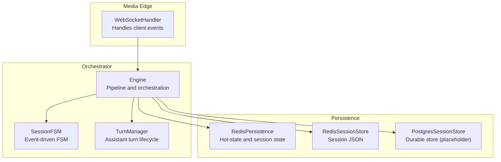
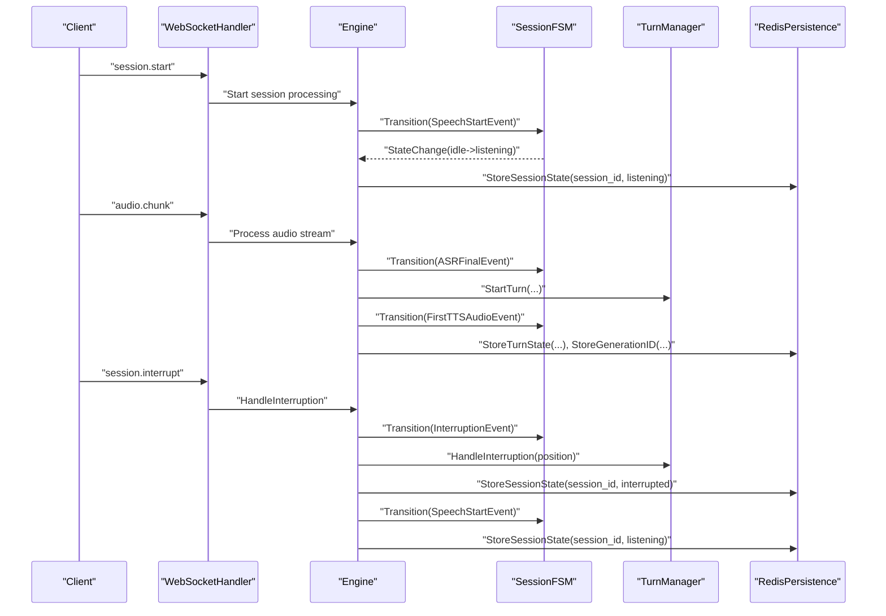
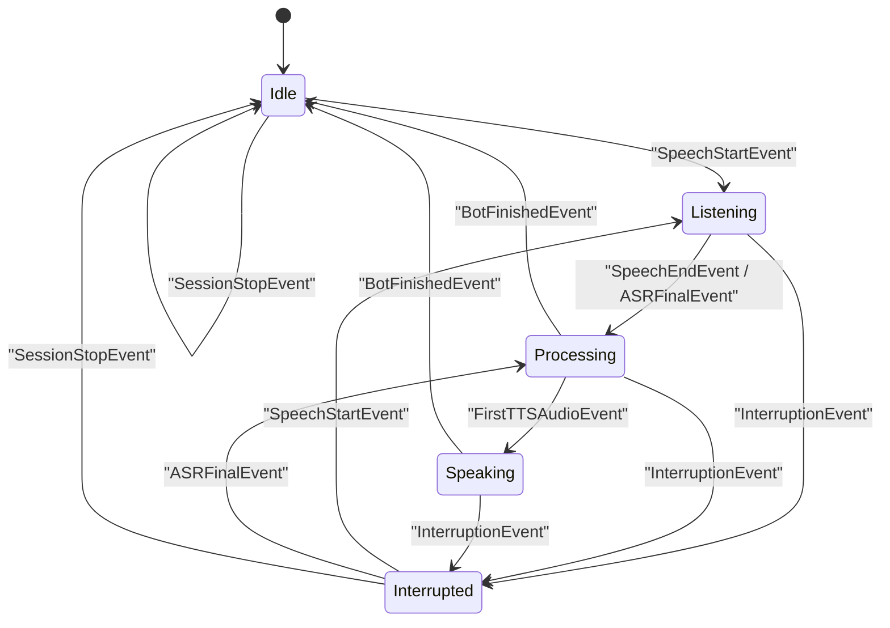
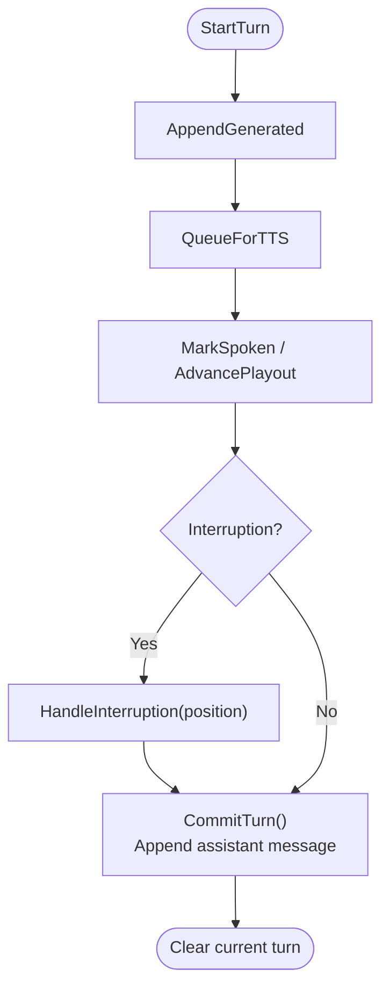
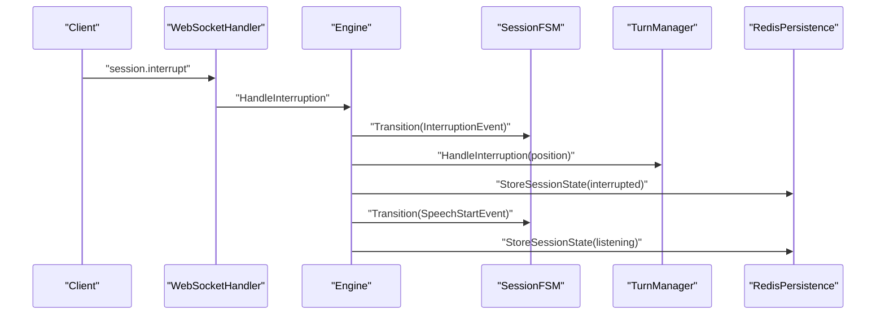
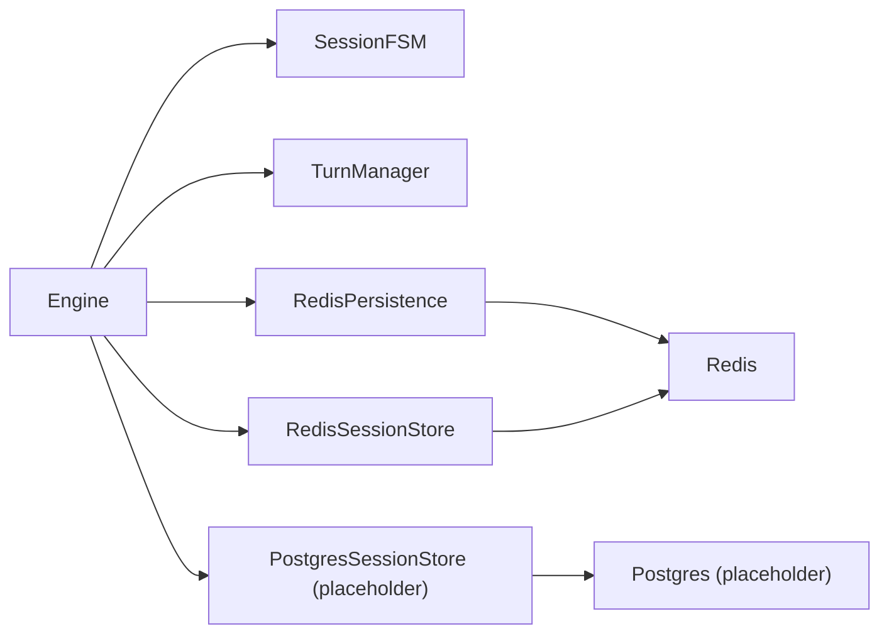
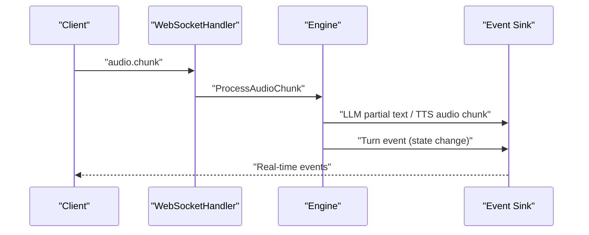
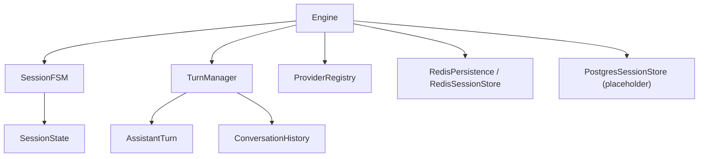

# State Transition System

<cite>
**Referenced Files in This Document**
- [state.go](file://go/pkg/session/state.go)
- [fsm.go](file://go/orchestrator/internal/statemachine/fsm.go)
- [turn_manager.go](file://go/orchestrator/internal/statemachine/turn_manager.go)
- [engine.go](file://go/orchestrator/internal/pipeline/engine.go)
- [websocket.go](file://go/media-edge/internal/handler/websocket.go)
- [event.go](file://go/pkg/events/event.go)
- [redis.go](file://go/orchestrator/internal/persistence/redis.go)
- [redis_store.go](file://go/pkg/session/redis_store.go)
- [postgres_store.go](file://go/pkg/session/postgres_store.go)
- [history.go](file://go/pkg/session/history.go)
- [fsm_test.go](file://go/orchestrator/internal/statemachine/fsm_test.go)
- [turn_manager_test.go](file://go/orchestrator/internal/statemachine/turn_manager_test.go)
- [session_test.go](file://go/pkg/session/session_test.go)
</cite>

## Table of Contents
1. [Introduction](#introduction)
2. [Project Structure](#project-structure)
3. [Core Components](#core-components)
4. [Architecture Overview](#architecture-overview)
5. [Detailed Component Analysis](#detailed-component-analysis)
6. [Dependency Analysis](#dependency-analysis)
7. [Performance Considerations](#performance-considerations)
8. [Troubleshooting Guide](#troubleshooting-guide)
9. [Conclusion](#conclusion)
10. [Appendices](#appendices)

## Introduction
This document explains CloudApp’s state transition system that governs turn-based conversation flow across the media edge, orchestrator, and persistence layers. It covers the finite state machine (FSM) definition, event-driven transitions, turn management, interruption handling, and state synchronization across services. It also documents state persistence strategies, recovery procedures, validation rules, and integration with WebSocket events and real-time notifications.

## Project Structure
The state transition system spans several packages:
- Session-level state and validation live in the session package.
- The orchestrator’s FSM and turn manager implement event-driven transitions and assistant turn lifecycle.
- The media edge integrates WebSocket events and routes them to the orchestrator.
- Persistence utilities maintain hot-state and session state in Redis and provide placeholders for durable storage.

**Diagram sources**
- [websocket.go:221-258](file://go/media-edge/internal/handler/websocket.go#L221-L258)
- [engine.go:108-208](file://go/orchestrator/internal/pipeline/engine.go#L108-L208)
- [fsm.go:44-92](file://go/orchestrator/internal/statemachine/fsm.go#L44-L92)
- [turn_manager.go:11-25](file://go/orchestrator/internal/statemachine/turn_manager.go#L11-L25)
- [redis.go:13-36](file://go/orchestrator/internal/persistence/redis.go#L13-L36)
- [redis_store.go:12-36](file://go/pkg/session/redis_store.go#L12-L36)
- [postgres_store.go:10-23](file://go/pkg/session/postgres_store.go#L10-L23)

**Section sources**
- [websocket.go:221-258](file://go/media-edge/internal/handler/websocket.go#L221-L258)
- [engine.go:108-208](file://go/orchestrator/internal/pipeline/engine.go#L108-L208)
- [fsm.go:44-92](file://go/orchestrator/internal/statemachine/fsm.go#L44-L92)
- [turn_manager.go:11-25](file://go/orchestrator/internal/statemachine/turn_manager.go#L11-L25)
- [redis.go:13-36](file://go/orchestrator/internal/persistence/redis.go#L13-L36)
- [redis_store.go:12-36](file://go/pkg/session/redis_store.go#L12-L36)
- [postgres_store.go:10-23](file://go/pkg/session/postgres_store.go#L10-L23)

## Core Components
- Session state definitions and validation:
  - Defines the five states and a strict transition matrix.
  - Provides validation and error signaling for invalid transitions.
- Orchestrator FSM:
  - Event-driven state machine with handlers for enter/exit and general transitions.
  - Resolves target states from events and emits turn events.
- Turn Manager:
  - Tracks assistant turns, playout progress, interruptions, and commit semantics.
- Engine:
  - Wires events to FSM transitions, orchestrates pipeline stages, and coordinates interruptions.
- WebSocket integration:
  - Parses client events and forwards them to the session handler and orchestrator.
- Persistence:
  - Redis hot-state for turn, playout, generation IDs, and session state.
  - Redis session store for session snapshots; Postgres store is a placeholder.

**Section sources**
- [state.go:8-76](file://go/pkg/session/state.go#L8-L76)
- [fsm.go:44-92](file://go/orchestrator/internal/statemachine/fsm.go#L44-L92)
- [turn_manager.go:11-25](file://go/orchestrator/internal/statemachine/turn_manager.go#L11-L25)
- [engine.go:108-208](file://go/orchestrator/internal/pipeline/engine.go#L108-L208)
- [websocket.go:221-258](file://go/media-edge/internal/handler/websocket.go#L221-L258)
- [redis.go:227-278](file://go/orchestrator/internal/persistence/redis.go#L227-L278)
- [redis_store.go:38-85](file://go/pkg/session/redis_store.go#L38-L85)
- [postgres_store.go:25-51](file://go/pkg/session/postgres_store.go#L25-L51)

## Architecture Overview
The system uses event-driven state transitions coordinated by the orchestrator. Media edge translates WebSocket events into orchestrator actions, which trigger FSM transitions and turn lifecycle updates. Hot-state is persisted in Redis for low-latency access, while session snapshots are stored in Redis and Postgres remains a placeholder.

**Diagram sources**
- [websocket.go:260-374](file://go/media-edge/internal/handler/websocket.go#L260-L374)
- [engine.go:210-375](file://go/orchestrator/internal/pipeline/engine.go#L210-L375)
- [fsm.go:101-161](file://go/orchestrator/internal/statemachine/fsm.go#L101-L161)
- [redis.go:38-91](file://go/orchestrator/internal/persistence/redis.go#L38-L91)

**Section sources**
- [websocket.go:260-374](file://go/media-edge/internal/handler/websocket.go#L260-L374)
- [engine.go:210-375](file://go/orchestrator/internal/pipeline/engine.go#L210-L375)
- [fsm.go:101-161](file://go/orchestrator/internal/statemachine/fsm.go#L101-L161)
- [redis.go:38-91](file://go/orchestrator/internal/persistence/redis.go#L38-L91)

## Detailed Component Analysis

### Finite State Machine (FSM)
- States: idle, listening, processing, speaking, interrupted.
- Transitions are event-driven and validated against a strict matrix.
- Handlers support on-enter, on-exit, and general transition callbacks.
- Emits turn events for real-time updates.

**Diagram sources**
- [fsm.go:16-31](file://go/orchestrator/internal/statemachine/fsm.go#L16-L31)
- [fsm.go:164-200](file://go/orchestrator/internal/statemachine/fsm.go#L164-L200)
- [fsm.go:202-220](file://go/orchestrator/internal/statemachine/fsm.go#L202-L220)

**Section sources**
- [fsm.go:44-92](file://go/orchestrator/internal/statemachine/fsm.go#L44-L92)
- [fsm.go:101-161](file://go/orchestrator/internal/statemachine/fsm.go#L101-L161)
- [fsm.go:202-220](file://go/orchestrator/internal/statemachine/fsm.go#L202-L220)
- [fsm_test.go:9-53](file://go/orchestrator/internal/statemachine/fsm_test.go#L9-L53)

### Turn-Based Conversation Management
- AssistantTurn tracks generated, queued, and spoken text, along with playout cursor and interruption state.
- TurnManager coordinates turn lifecycle: start, append generated text, queue for TTS, advance playout, mark interruption, commit turn.
- Commit semantics ensure only spoken text is appended to history.

**Diagram sources**
- [turn_manager.go:27-130](file://go/orchestrator/internal/statemachine/turn_manager.go#L27-L130)
- [turn.go:36-137](file://go/pkg/session/turn.go#L36-L137)
- [history.go:43-59](file://go/pkg/session/history.go#L43-L59)

**Section sources**
- [turn_manager.go:11-25](file://go/orchestrator/internal/statemachine/turn_manager.go#L11-L25)
- [turn_manager.go:27-130](file://go/orchestrator/internal/statemachine/turn_manager.go#L27-L130)
- [turn.go:9-25](file://go/pkg/session/turn.go#L9-L25)
- [turn.go:139-166](file://go/pkg/session/turn.go#L139-L166)
- [history.go:43-59](file://go/pkg/session/history.go#L43-L59)
- [turn_manager_test.go:10-65](file://go/orchestrator/internal/statemachine/turn_manager_test.go#L10-L65)

### Interruption Handling Mechanisms
- InterruptionEvent triggers transition to interrupted from listening, processing, or speaking.
- Engine cancels LLM/TTS, captures playout position, marks interruption, commits only spoken text, and resumes listening.
- TurnManager recalculates committable text and clears the turn.

**Diagram sources**
- [engine.go:377-436](file://go/orchestrator/internal/pipeline/engine.go#L377-L436)
- [fsm.go:183-188](file://go/orchestrator/internal/statemachine/fsm.go#L183-L188)
- [turn_manager.go:86-103](file://go/orchestrator/internal/statemachine/turn_manager.go#L86-L103)
- [redis.go:227-278](file://go/orchestrator/internal/persistence/redis.go#L227-L278)

**Section sources**
- [engine.go:377-436](file://go/orchestrator/internal/pipeline/engine.go#L377-L436)
- [fsm.go:183-188](file://go/orchestrator/internal/statemachine/fsm.go#L183-L188)
- [turn_manager.go:86-103](file://go/orchestrator/internal/statemachine/turn_manager.go#L86-L103)
- [redis.go:227-278](file://go/orchestrator/internal/persistence/redis.go#L227-L278)

### State Synchronization Across Services
- Engine maintains per-session FSM and TurnManager instances and registers handlers to emit turn events.
- RedisPersistence stores hot-state (turn, playout, generation IDs, session state) with atomic updates and expirations.
- Session snapshots are stored via RedisSessionStore; Postgres store is a placeholder.

**Diagram sources**
- [engine.go:108-151](file://go/orchestrator/internal/pipeline/engine.go#L108-L151)
- [redis.go:13-36](file://go/orchestrator/internal/persistence/redis.go#L13-L36)
- [redis_store.go:12-36](file://go/pkg/session/redis_store.go#L12-L36)
- [postgres_store.go:10-23](file://go/pkg/session/postgres_store.go#L10-L23)

**Section sources**
- [engine.go:108-151](file://go/orchestrator/internal/pipeline/engine.go#L108-L151)
- [redis.go:38-91](file://go/orchestrator/internal/persistence/redis.go#L38-L91)
- [redis_store.go:38-85](file://go/pkg/session/redis_store.go#L38-L85)
- [postgres_store.go:25-51](file://go/pkg/session/postgres_store.go#L25-L51)

### State Persistence Strategies and Recovery
- Hot-state persistence:
  - Turn state, playout position, generation IDs, and session state are stored in Redis hashes with TTL.
  - Atomic pipelines ensure consistency; expirations bound memory usage.
- Session snapshot persistence:
  - RedisSessionStore serializes sessions to JSON with TTL and supports list operations.
  - PostgresSessionStore is a placeholder with stubbed methods.
- Recovery:
  - On session start, Engine loads session from store and initializes FSM/TurnManager.
  - Redis keys are prefixed and organized for easy cleanup and lookup.

**Section sources**
- [redis.go:38-91](file://go/orchestrator/internal/persistence/redis.go#L38-L91)
- [redis.go:131-169](file://go/orchestrator/internal/persistence/redis.go#L131-L169)
- [redis.go:227-278](file://go/orchestrator/internal/persistence/redis.go#L227-L278)
- [redis_store.go:38-85](file://go/pkg/session/redis_store.go#L38-L85)
- [redis_store.go:105-123](file://go/pkg/session/redis_store.go#L105-L123)
- [postgres_store.go:25-51](file://go/pkg/session/postgres_store.go#L25-L51)

### Validation Rules and Error Handling
- Session-level validation:
  - SetState enforces allowed transitions and returns a dedicated error for invalid transitions.
- Orchestrator-level validation:
  - Transition checks validity against the FSM’s allowed transitions and returns descriptive errors.
- Tests validate:
  - Invalid transitions remain blocked.
  - IsActive, IsProcessing, IsListening, IsSpeaking, IsInterrupted reflect current state.
  - Reset transitions to idle.

**Section sources**
- [state.go:64-76](file://go/pkg/session/state.go#L64-L76)
- [fsm.go:202-220](file://go/orchestrator/internal/statemachine/fsm.go#L202-L220)
- [fsm_test.go:55-75](file://go/orchestrator/internal/statemachine/fsm_test.go#L55-L75)
- [fsm_test.go:181-195](file://go/orchestrator/internal/statemachine/fsm_test.go#L181-L195)
- [session_test.go:37-70](file://go/pkg/session/session_test.go#L37-L70)

### Integration with WebSocket Events and Real-Time Updates
- WebSocketHandler parses client events and delegates to session handler and engine.
- Engine emits server-side events (e.g., turn events) to the event sink, which propagates to clients.
- FSM emits turn events on transitions for real-time UI updates.

**Diagram sources**
- [websocket.go:221-258](file://go/media-edge/internal/handler/websocket.go#L221-L258)
- [engine.go:180-207](file://go/orchestrator/internal/pipeline/engine.go#L180-L207)
- [fsm.go:150-159](file://go/orchestrator/internal/statemachine/fsm.go#L150-L159)

**Section sources**
- [websocket.go:221-258](file://go/media-edge/internal/handler/websocket.go#L221-L258)
- [engine.go:180-207](file://go/orchestrator/internal/pipeline/engine.go#L180-L207)
- [fsm.go:150-159](file://go/orchestrator/internal/statemachine/fsm.go#L150-L159)
- [event.go:14-35](file://go/pkg/events/event.go#L14-L35)

### Practical Examples
- Configuring custom state transitions:
  - Use SetOnEnter/SetOnExit to register handlers for state lifecycle.
  - Use SetOnTransition to observe all transitions for logging or analytics.
- Custom event-driven flows:
  - Map custom events to target states via resolveTargetState and ensure allowed transitions.
- Debugging techniques:
  - Inspect current state via Current()/String().
  - Use CanTransition to pre-validate transitions.
  - Enable transition hooks to log from/to states and timestamps.
  - Use TurnManager.GetStats to monitor generation, queued, and spoken text.

**Section sources**
- [fsm.go:222-241](file://go/orchestrator/internal/statemachine/fsm.go#L222-L241)
- [fsm.go:243-248](file://go/orchestrator/internal/statemachine/fsm.go#L243-L248)
- [fsm.go:304-307](file://go/orchestrator/internal/statemachine/fsm.go#L304-L307)
- [turn_manager.go:204-221](file://go/orchestrator/internal/statemachine/turn_manager.go#L204-L221)
- [fsm_test.go:109-154](file://go/orchestrator/internal/statemachine/fsm_test.go#L109-L154)

## Dependency Analysis
- Coupling:
  - Engine depends on FSMManager, TurnManagerRegistry, ProviderRegistry, and persistence layers.
  - FSM depends on session state definitions and event sinks.
  - TurnManager depends on AssistantTurn and ConversationHistory.
- Cohesion:
  - State logic is centralized in session/state.go and orchestrator statemachine.
  - Turn lifecycle is encapsulated in TurnManager and AssistantTurn.
- External dependencies:
  - Redis for hot-state and session snapshots.
  - Postgres store is a placeholder for durable storage.

**Diagram sources**
- [engine.go:17-39](file://go/orchestrator/internal/pipeline/engine.go#L17-L39)
- [fsm.go:44-54](file://go/orchestrator/internal/statemachine/fsm.go#L44-L54)
- [turn_manager.go:11-17](file://go/orchestrator/internal/statemachine/turn_manager.go#L11-L17)
- [redis.go:13-18](file://go/orchestrator/internal/persistence/redis.go#L13-L18)
- [redis_store.go:12-18](file://go/pkg/session/redis_store.go#L12-L18)
- [postgres_store.go:10-11](file://go/pkg/session/postgres_store.go#L10-L11)

**Section sources**
- [engine.go:17-39](file://go/orchestrator/internal/pipeline/engine.go#L17-L39)
- [fsm.go:44-54](file://go/orchestrator/internal/statemachine/fsm.go#L44-L54)
- [turn_manager.go:11-17](file://go/orchestrator/internal/statemachine/turn_manager.go#L11-L17)
- [redis.go:13-18](file://go/orchestrator/internal/persistence/redis.go#L13-L18)
- [redis_store.go:12-18](file://go/pkg/session/redis_store.go#L12-L18)
- [postgres_store.go:10-11](file://go/pkg/session/postgres_store.go#L10-L11)

## Performance Considerations
- Hot-state in Redis minimizes latency for turn and session state queries.
- Atomic pipelines reduce race conditions during concurrent updates.
- TTL prevents memory leaks and ensures timely cleanup.
- Pre-validation via CanTransition avoids unnecessary work and errors.
- Streaming events (LLM partial text, TTS audio chunks) enable responsive UI updates.

## Troubleshooting Guide
- Invalid state transition errors:
  - Validate transitions using CanTransition or rely on built-in validation.
  - Review event sequences and ensure correct event-to-state mapping.
- Interruption anomalies:
  - Confirm playout position captured before interruption.
  - Verify only committable text is appended to history.
- Persistence issues:
  - Check Redis connectivity and key prefixes.
  - For Postgres store, confirm implementation completeness.
- WebSocket event parsing:
  - Ensure event types match client-server contracts and sizes are within limits.

**Section sources**
- [fsm.go:202-220](file://go/orchestrator/internal/statemachine/fsm.go#L202-L220)
- [engine.go:377-436](file://go/orchestrator/internal/pipeline/engine.go#L377-L436)
- [redis.go:280-301](file://go/orchestrator/internal/persistence/redis.go#L280-L301)
- [websocket.go:221-258](file://go/media-edge/internal/handler/websocket.go#L221-L258)

## Conclusion
CloudApp’s state transition system combines a strict, event-driven FSM with robust turn lifecycle management and Redis-backed hot-state persistence. The design ensures predictable conversation flow, accurate interruption handling, and real-time synchronization across services. The modular architecture allows customization of state transitions and event handling while maintaining strong validation and observability.

## Appendices
- Example configurations and debugging:
  - Use SetOnTransition hooks for observability.
  - Use TurnManager.GetStats for diagnostics.
  - Validate transitions with CanTransition before invoking Transition.

**Section sources**
- [fsm.go:236-241](file://go/orchestrator/internal/statemachine/fsm.go#L236-L241)
- [turn_manager.go:204-221](file://go/orchestrator/internal/statemachine/turn_manager.go#L204-L221)
- [fsm_test.go:156-179](file://go/orchestrator/internal/statemachine/fsm_test.go#L156-L179)