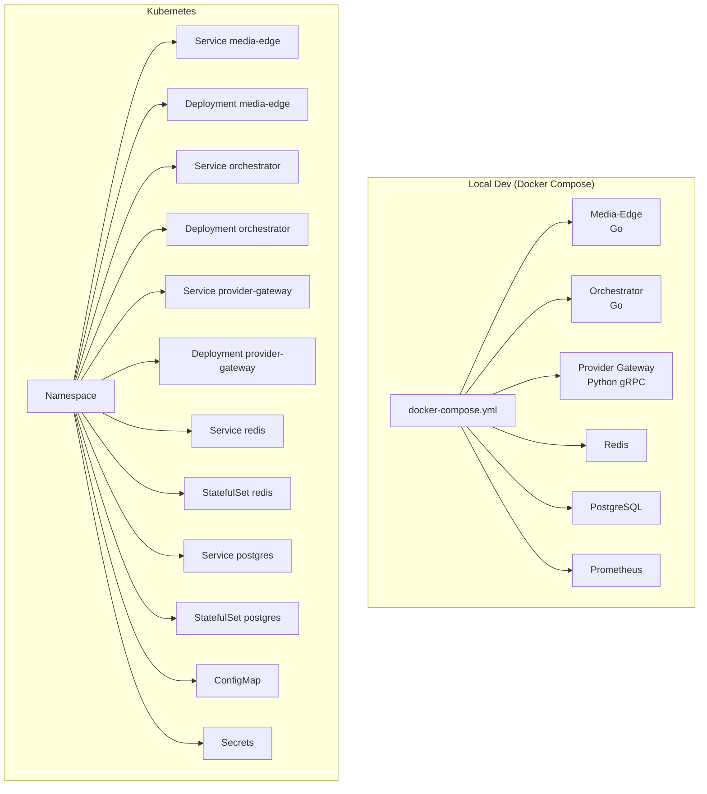
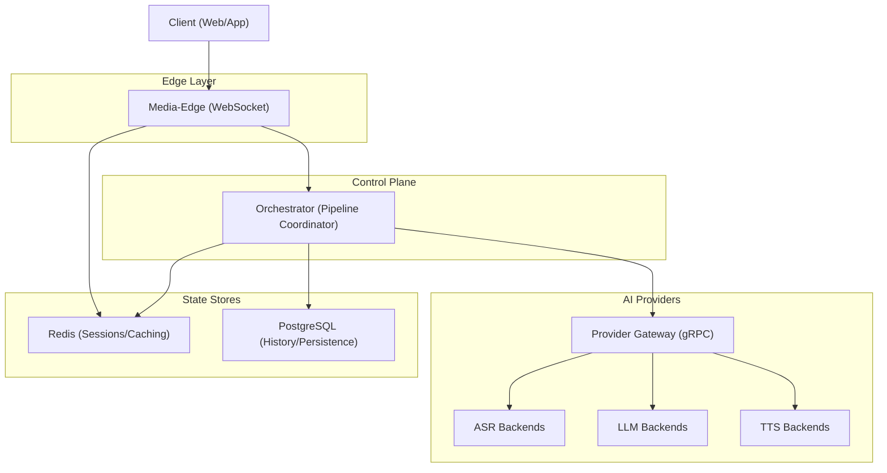
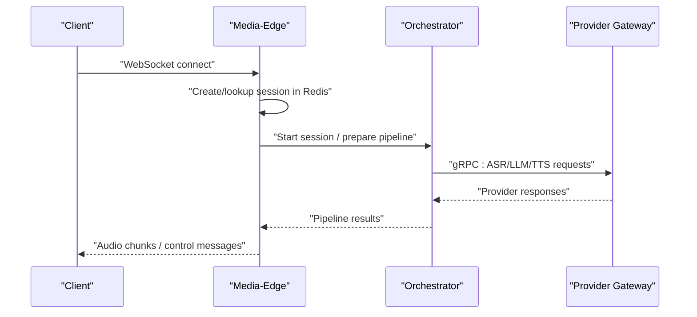
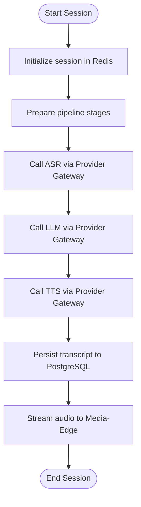
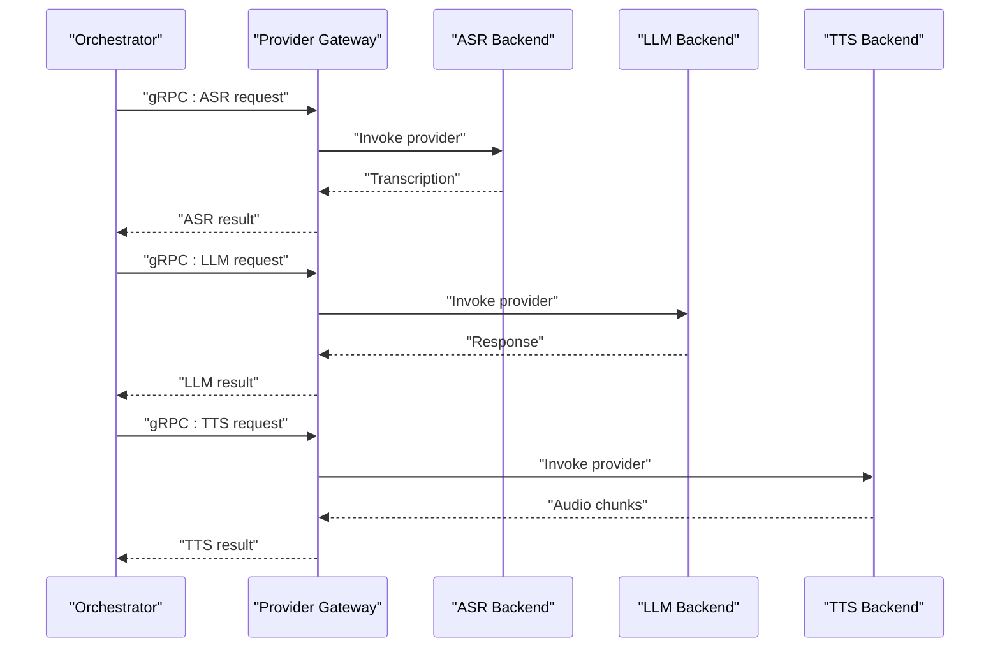
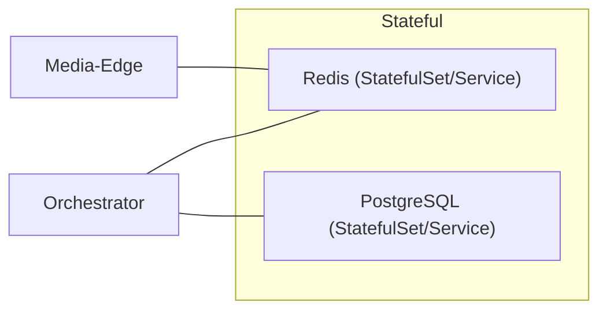
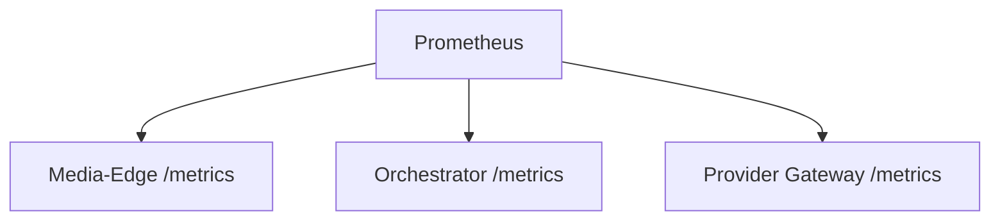
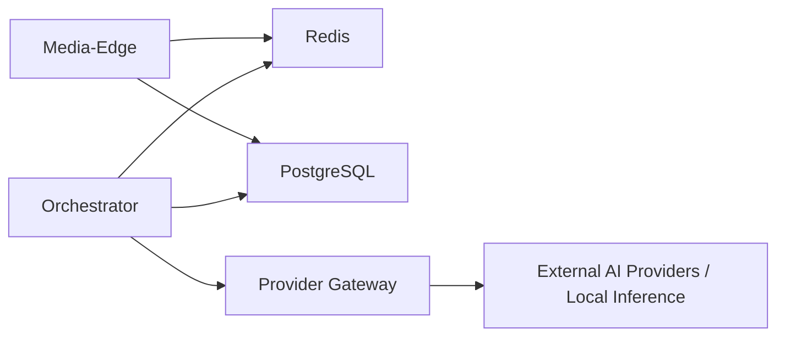
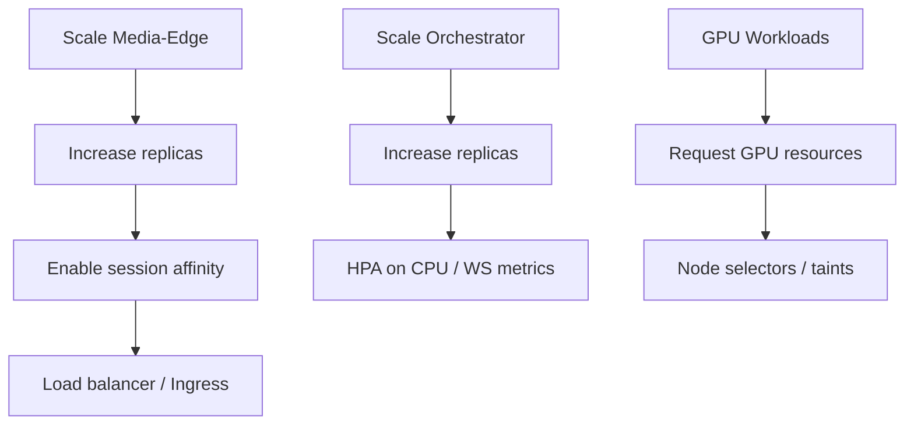

# Deployment Topology

<cite>
**Referenced Files in This Document**
- [README.md](file://README.md)
- [docs/deployment.md](file://docs/deployment.md)
- [infra/compose/docker-compose.yml](file://infra/compose/docker-compose.yml)
- [infra/docker/Dockerfile.media-edge](file://infra/docker/Dockerfile.media-edge)
- [infra/docker/Dockerfile.orchestrator](file://infra/docker/Dockerfile.orchestrator)
- [infra/docker/Dockerfile.provider-gateway](file://infra/docker/Dockerfile.provider-gateway)
- [infra/k8s/media-edge.yaml](file://infra/k8s/media-edge.yaml)
- [infra/k8s/orchestrator.yaml](file://infra/k8s/orchestrator.yaml)
- [infra/k8s/postgres.yaml](file://infra/k8s/postgres.yaml)
- [infra/k8s/redis.yaml](file://infra/k8s/redis.yaml)
- [infra/k8s/provider-gateway.yaml](file://infra/k8s/provider-gateway.yaml)
- [infra/k8s/secrets.yaml](file://infra/k8s/secrets.yaml)
- [infra/k8s/configmap.yaml](file://infra/k8s/configmap.yaml)
- [infra/prometheus/prometheus.yml](file://infra/prometheus/prometheus.yml)
- [examples/config-mock.yaml](file://examples/config-mock.yaml)
- [examples/config-cloud.yaml](file://examples/config-cloud.yaml)
- [examples/config-vllm.yaml](file://examples/config-vllm.yaml)
- [go/pkg/observability/metrics.go](file://go/pkg/observability/metrics.go)
</cite>

## Table of Contents
1. [Introduction](#introduction)
2. [Project Structure](#project-structure)
3. [Core Components](#core-components)
4. [Architecture Overview](#architecture-overview)
5. [Detailed Component Analysis](#detailed-component-analysis)
6. [Dependency Analysis](#dependency-analysis)
7. [Performance Considerations](#performance-considerations)
8. [Troubleshooting Guide](#troubleshooting-guide)
9. [Conclusion](#conclusion)
10. [Appendices](#appendices)

## Introduction
This document describes CloudApp’s deployment topology and infrastructure requirements. It explains the containerized development strategy using Docker Compose and the production-ready Kubernetes deployment model. It also documents service mesh considerations, networking patterns, inter-service communication, horizontal scaling with stateless services and shared state stores, infrastructure resource requirements (CPU, memory, GPU), environment-specific configurations, secrets management, and monitoring with Prometheus and Grafana.

## Project Structure
CloudApp is organized into:
- Go services for Media-Edge and Orchestrator
- Python Provider Gateway exposing gRPC services for ASR/LLM/TTS
- Infrastructure manifests for Docker Compose and Kubernetes
- Configuration examples for local and cloud deployments
- Observability instrumentation for metrics

**Diagram sources**
- [infra/compose/docker-compose.yml:1-164](file://infra/compose/docker-compose.yml#L1-L164)
- [infra/k8s/media-edge.yaml:1-112](file://infra/k8s/media-edge.yaml#L1-L112)
- [infra/k8s/orchestrator.yaml:1-92](file://infra/k8s/orchestrator.yaml#L1-L92)
- [infra/k8s/provider-gateway.yaml:1-108](file://infra/k8s/provider-gateway.yaml#L1-L108)
- [infra/k8s/redis.yaml:1-97](file://infra/k8s/redis.yaml#L1-L97)
- [infra/k8s/postgres.yaml:1-116](file://infra/k8s/postgres.yaml#L1-L116)
- [infra/k8s/configmap.yaml:1-60](file://infra/k8s/configmap.yaml#L1-L60)
- [infra/k8s/secrets.yaml:1-47](file://infra/k8s/secrets.yaml#L1-L47)

**Section sources**
- [README.md:47-102](file://README.md#L47-L102)
- [docs/deployment.md:7-86](file://docs/deployment.md#L7-L86)

## Core Components
- Media-Edge (Go): WebSocket gateway handling real-time audio streaming and session lifecycle. Exposes health and metrics endpoints.
- Orchestrator (Go): Pipeline coordinator managing ASR→LLM→TTS stages, state machine, and persistence.
- Provider Gateway (Python): gRPC service proxy for ASR/LLM/TTS providers with pluggable implementations.
- Redis: Session store and cache for stateless Media-Edge scaling.
- PostgreSQL: Persistent store for transcripts and session history.
- Prometheus: Metrics scraping for all services.

**Section sources**
- [README.md:5-35](file://README.md#L5-L35)
- [docs/deployment.md:123-173](file://docs/deployment.md#L123-L173)
- [go/pkg/observability/metrics.go:10-82](file://go/pkg/observability/metrics.go#L10-L82)

## Architecture Overview
CloudApp follows a stateless service design for Media-Edge and Orchestrator, with Redis-backed session stores and PostgreSQL for persistence. Inter-service communication:
- Media-Edge ↔ Orchestrator: HTTP REST endpoints for health/readiness and internal orchestration APIs
- Media-Edge → Provider Gateway: gRPC for ASR/LLM/TTS operations
- All services export Prometheus metrics for monitoring

**Diagram sources**
- [README.md:7-35](file://README.md#L7-L35)
- [docs/deployment.md:331-364](file://docs/deployment.md#L331-L364)
- [go/pkg/observability/metrics.go:77-82](file://go/pkg/observability/metrics.go#L77-L82)

## Detailed Component Analysis

### Media-Edge Deployment
- Containerization: Multi-stage Go build with non-root user and health checks.
- Ports: 8080 for HTTP/WebSocket; metrics endpoint scraped by Prometheus.
- Health checks: HTTP GET /health and /ready.
- Networking: Part of a shared bridge network in Compose; ClusterIP service in Kubernetes.
- Horizontal scaling: Stateless; requires Redis-backed session store and sticky sessions for WebSocket.

**Diagram sources**
- [docs/deployment.md:331-364](file://docs/deployment.md#L331-L364)
- [infra/docker/Dockerfile.media-edge:1-62](file://infra/docker/Dockerfile.media-edge#L1-L62)
- [infra/k8s/media-edge.yaml:1-112](file://infra/k8s/media-edge.yaml#L1-L112)

**Section sources**
- [docs/deployment.md:331-345](file://docs/deployment.md#L331-L345)
- [infra/docker/Dockerfile.media-edge:56-62](file://infra/docker/Dockerfile.media-edge#L56-L62)
- [infra/k8s/media-edge.yaml:57-72](file://infra/k8s/media-edge.yaml#L57-L72)

### Orchestrator Deployment
- Containerization: Multi-stage Go build with health checks.
- Ports: 8081 for HTTP; metrics endpoint scraped by Prometheus.
- Health checks: HTTP GET /health and /ready.
- Dependencies: Redis and PostgreSQL; gRPC address for Provider Gateway.
- Horizontal scaling: Stateless; relies on shared Redis and PostgreSQL.

**Diagram sources**
- [docs/deployment.md:359-364](file://docs/deployment.md#L359-L364)
- [infra/docker/Dockerfile.orchestrator:1-62](file://infra/docker/Dockerfile.orchestrator#L1-L62)
- [infra/k8s/orchestrator.yaml:59-74](file://infra/k8s/orchestrator.yaml#L59-L74)

**Section sources**
- [docs/deployment.md:359-357](file://docs/deployment.md#L359-L357)
- [infra/docker/Dockerfile.orchestrator:56-62](file://infra/docker/Dockerfile.orchestrator#L56-L62)
- [infra/k8s/orchestrator.yaml:59-74](file://infra/k8s/orchestrator.yaml#L59-L74)

### Provider Gateway Deployment
- Containerization: Python slim image with virtual environment and health checks.
- Ports: 50051 gRPC; 9090 metrics.
- Health checks: TCP socket to gRPC port.
- GPU scheduling: Optional GPU resource requests for local inference.

**Diagram sources**
- [docs/deployment.md:242-294](file://docs/deployment.md#L242-L294)
- [infra/docker/Dockerfile.provider-gateway:1-62](file://infra/docker/Dockerfile.provider-gateway#L1-L62)
- [infra/k8s/provider-gateway.yaml:64-77](file://infra/k8s/provider-gateway.yaml#L64-L77)

**Section sources**
- [docs/deployment.md:242-294](file://docs/deployment.md#L242-L294)
- [infra/docker/Dockerfile.provider-gateway:56-62](file://infra/docker/Dockerfile.provider-gateway#L56-L62)
- [infra/k8s/provider-gateway.yaml:64-77](file://infra/k8s/provider-gateway.yaml#L64-L77)

### State Stores: Redis and PostgreSQL
- Redis: Session store and cache; configured with persistence and memory limits.
- PostgreSQL: Persistent store for transcripts and session history; includes readiness/liveness probes.

**Diagram sources**
- [infra/k8s/redis.yaml:1-97](file://infra/k8s/redis.yaml#L1-L97)
- [infra/k8s/postgres.yaml:1-116](file://infra/k8s/postgres.yaml#L1-L116)

**Section sources**
- [infra/k8s/redis.yaml:34-66](file://infra/k8s/redis.yaml#L34-L66)
- [infra/k8s/postgres.yaml:54-77](file://infra/k8s/postgres.yaml#L54-L77)

### Monitoring and Observability
- Prometheus configuration: Scrape jobs for Media-Edge, Orchestrator, and Provider Gateway metrics endpoints.
- Metrics: Active sessions, turns, latency histograms, provider request counters, WebSocket connection gauge.
- Grafana: Dashboards can be imported from ConfigMaps.

**Diagram sources**
- [infra/prometheus/prometheus.yml:18-60](file://infra/prometheus/prometheus.yml#L18-L60)
- [go/pkg/observability/metrics.go:10-82](file://go/pkg/observability/metrics.go#L10-L82)

**Section sources**
- [docs/deployment.md:428-474](file://docs/deployment.md#L428-L474)
- [infra/prometheus/prometheus.yml:18-60](file://infra/prometheus/prometheus.yml#L18-L60)
- [go/pkg/observability/metrics.go:10-82](file://go/pkg/observability/metrics.go#L10-L82)

## Dependency Analysis
- Media-Edge depends on Redis for session state and PostgreSQL for history.
- Orchestrator depends on Redis and PostgreSQL; communicates with Provider Gateway via gRPC.
- Provider Gateway depends on external AI providers or local inference stacks (e.g., vLLM).
- All services depend on Prometheus for metrics scraping.

**Diagram sources**
- [docs/deployment.md:366-427](file://docs/deployment.md#L366-L427)
- [README.md:20-34](file://README.md#L20-L34)

**Section sources**
- [docs/deployment.md:366-427](file://docs/deployment.md#L366-L427)
- [README.md:20-34](file://README.md#L20-L34)

## Performance Considerations
- Horizontal scaling
  - Media-Edge: Stateless; scale replicas behind a load balancer requiring session affinity for WebSocket stickiness.
  - Orchestrator: Stateless; scale replicas independently.
  - Provider Gateway: Scale replicas; GPU scheduling supported for local inference.
- Resource requests and limits
  - Kubernetes manifests define baseline CPU/memory requests/limits for each service.
- GPU acceleration
  - Provider Gateway supports GPU requests; node selectors/tolerations enable scheduling on GPU nodes.
- Redis clustering
  - For high availability, use Redis Cluster or Sentinel; configure addresses accordingly.

**Diagram sources**
- [docs/deployment.md:368-427](file://docs/deployment.md#L368-L427)
- [infra/k8s/media-edge.yaml:401-413](file://infra/k8s/media-edge.yaml#L401-L413)
- [infra/k8s/orchestrator.yaml:52-58](file://infra/k8s/orchestrator.yaml#L52-L58)
- [infra/k8s/provider-gateway.yaml:62-63](file://infra/k8s/provider-gateway.yaml#L62-L63)

**Section sources**
- [docs/deployment.md:366-427](file://docs/deployment.md#L366-L427)

## Troubleshooting Guide
- Services not starting
  - Check container/service logs in Kubernetes or Docker Compose.
- Connectivity issues
  - Verify service DNS resolution and port reachability from pods.
- High latency
  - Inspect CPU/memory utilization and Prometheus metrics.
- Provider errors
  - Review Provider Gateway logs for provider-specific failures.

**Section sources**
- [docs/deployment.md:489-533](file://docs/deployment.md#L489-L533)

## Conclusion
CloudApp’s deployment topology emphasizes stateless service design with shared Redis and PostgreSQL for scalability and reliability. Docker Compose streamlines local development, while Kubernetes provides production-grade primitives for secrets, configuration, scaling, and monitoring. The architecture supports horizontal scaling, optional GPU acceleration, and robust observability via Prometheus.

## Appendices

### Environment-Specific Configurations
- Local development modes
  - Mock mode: All providers are mocked; no external keys required.
  - vLLM mode: Uses local LLM inference via vLLM; ASR via faster-whisper.
  - Cloud mode: Integrates with Google Speech and Groq.
- Configuration examples
  - [examples/config-mock.yaml:1-44](file://examples/config-mock.yaml#L1-L44)
  - [examples/config-vllm.yaml:1-31](file://examples/config-vllm.yaml#L1-L31)
  - [examples/config-cloud.yaml:1-39](file://examples/config-cloud.yaml#L1-L39)

**Section sources**
- [docs/deployment.md:9-86](file://docs/deployment.md#L9-L86)
- [examples/config-mock.yaml:1-44](file://examples/config-mock.yaml#L1-L44)
- [examples/config-vllm.yaml:1-31](file://examples/config-vllm.yaml#L1-L31)
- [examples/config-cloud.yaml:1-39](file://examples/config-cloud.yaml#L1-L39)

### Secrets Management
- Kubernetes Secrets
  - Store database credentials, API keys, and tokens.
  - Mount via secretKeyRef in deployments.
- External secret managers
  - Recommended for production: Vault, Sealed Secrets, or cloud-native solutions.

**Section sources**
- [infra/k8s/secrets.yaml:10-47](file://infra/k8s/secrets.yaml#L10-L47)
- [infra/k8s/orchestrator.yaml:46-51](file://infra/k8s/orchestrator.yaml#L46-L51)
- [infra/k8s/provider-gateway.yaml:49-54](file://infra/k8s/provider-gateway.yaml#L49-L54)

### Service Mesh and Inter-Service Communication
- Service mesh is not present in current manifests; services communicate directly via Kubernetes Services and ports.
- For advanced routing, mTLS, and traffic policies, integrate a service mesh (e.g., Istio) by adding sidecars and policy CRDs.

[No sources needed since this section provides general guidance]

### Networking Patterns and Ingress
- Media-Edge exposes WebSocket over HTTP; enable Ingress with WebSocket support for external access.
- Use session affinity for WebSocket connections to ensure stickiness.

**Section sources**
- [docs/deployment.md:203-241](file://docs/deployment.md#L203-L241)
- [docs/deployment.md:399-414](file://docs/deployment.md#L399-L414)

### Infrastructure Requirements (CPU, Memory, GPU)
- Media-Edge
  - Requests: ~100m CPU, ~128Mi memory; Limits: ~500m CPU, ~512Mi memory.
- Orchestrator
  - Requests: ~200m CPU, ~256Mi memory; Limits: ~1000m CPU, ~1Gi memory.
- Provider Gateway
  - Requests: ~250m CPU, ~512Mi memory; Limits: ~2000m CPU, ~2Gi memory.
- GPU
  - Provider Gateway supports GPU requests; schedule on GPU nodes with appropriate taints/tolerations.

**Section sources**
- [infra/k8s/media-edge.yaml:50-56](file://infra/k8s/media-edge.yaml#L50-L56)
- [infra/k8s/orchestrator.yaml:52-58](file://infra/k8s/orchestrator.yaml#L52-L58)
- [infra/k8s/provider-gateway.yaml:55-63](file://infra/k8s/provider-gateway.yaml#L55-L63)
- [docs/deployment.md:242-294](file://docs/deployment.md#L242-L294)

### Health Checks and Readiness
- Media-Edge: /health and /ready HTTP endpoints.
- Orchestrator: /health and /ready HTTP endpoints.
- Provider Gateway: gRPC health probe against port 50051.

**Section sources**
- [docs/deployment.md:331-364](file://docs/deployment.md#L331-L364)

### Monitoring Setup
- Prometheus jobs for Media-Edge, Orchestrator, and Provider Gateway metrics endpoints.
- Grafana dashboards can be provisioned via ConfigMaps.

**Section sources**
- [infra/prometheus/prometheus.yml:18-60](file://infra/prometheus/prometheus.yml#L18-L60)
- [docs/deployment.md:428-474](file://docs/deployment.md#L428-L474)