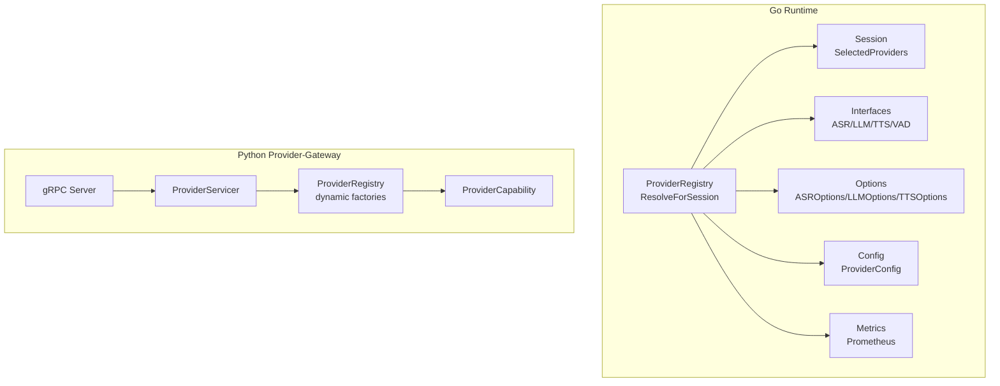
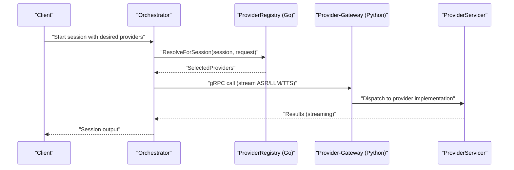
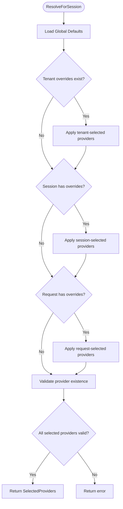
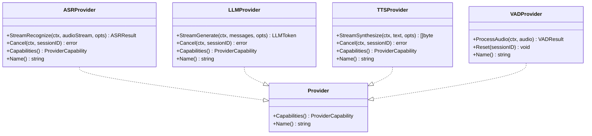
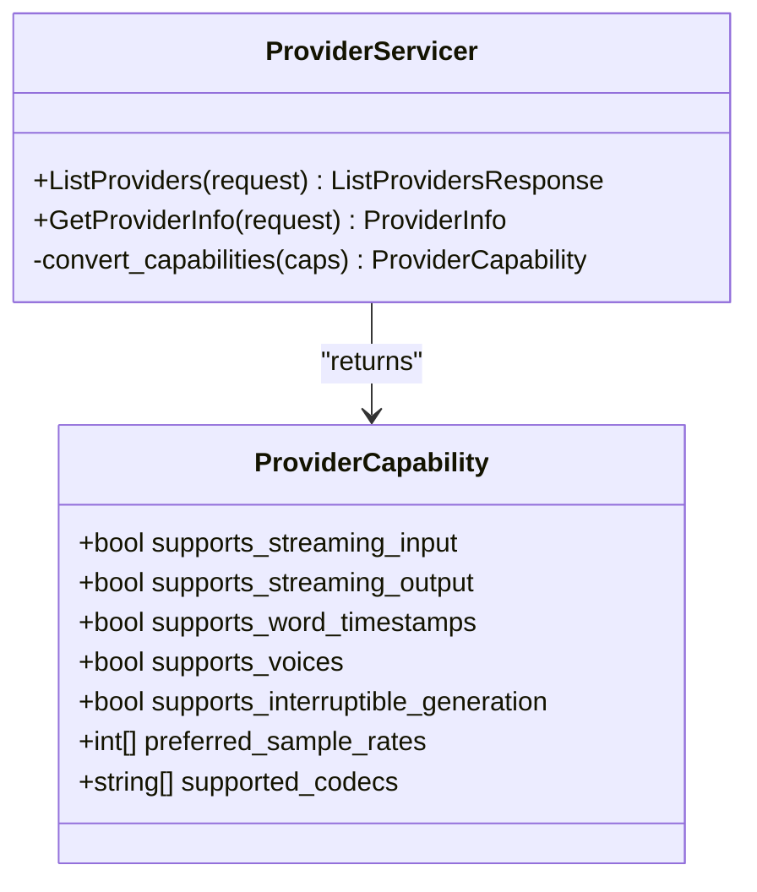
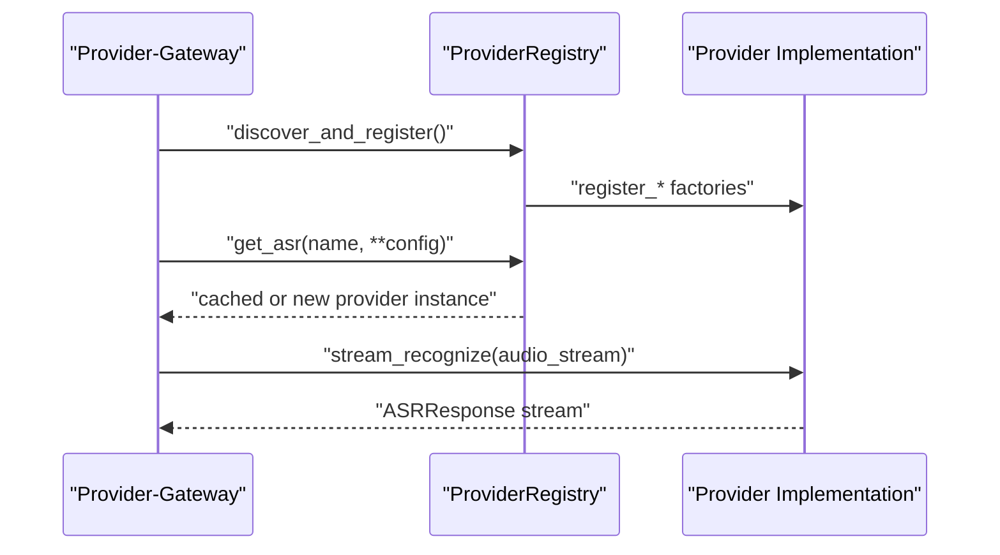
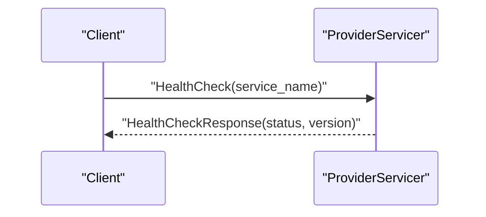
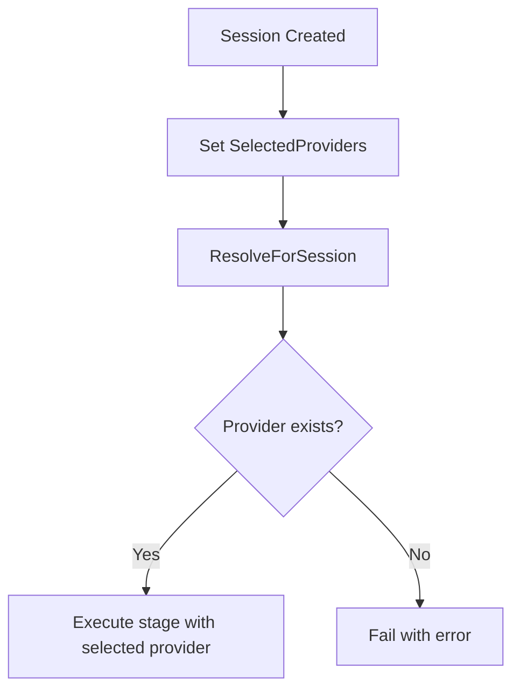
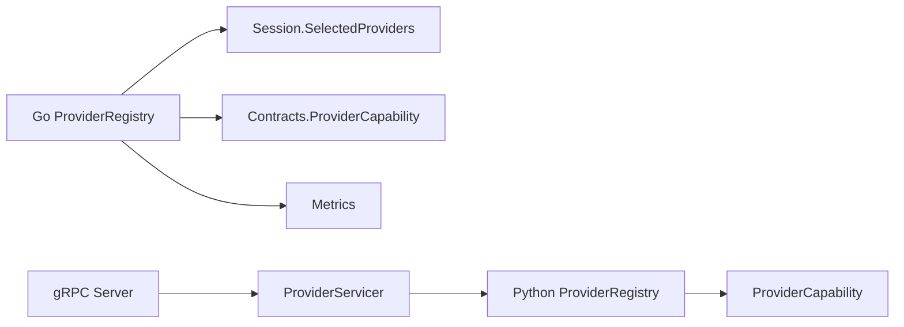

# Provider Registry & Management

<cite>
**Referenced Files in This Document**
- [registry.go](file://go/pkg/providers/registry.go)
- [interfaces.go](file://go/pkg/providers/interfaces.go)
- [options.go](file://go/pkg/providers/options.go)
- [grpc_client.go](file://go/pkg/providers/grpc_client.go)
- [provider.go](file://go/pkg/contracts/provider.go)
- [session.go](file://go/pkg/session/session.go)
- [config.go](file://go/pkg/config/config.go)
- [metrics.go](file://go/pkg/observability/metrics.go)
- [registry.py](file://py/provider_gateway/app/core/registry.py)
- [capability.py](file://py/provider_gateway/app/core/capability.py)
- [server.py](file://py/provider_gateway/app/grpc_api/server.py)
- [provider_servicer.py](file://py/provider_gateway/app/grpc_api/provider_servicer.py)
- [faster_whisper.py](file://py/provider_gateway/app/providers/asr/faster_whisper.py)
- [openai_compatible.py](file://py/provider_gateway/app/providers/llm/openai_compatible.py)
- [config-cloud.yaml](file://examples/config-cloud.yaml)
</cite>

## Table of Contents
1. [Introduction](#introduction)
2. [Project Structure](#project-structure)
3. [Core Components](#core-components)
4. [Architecture Overview](#architecture-overview)
5. [Detailed Component Analysis](#detailed-component-analysis)
6. [Dependency Analysis](#dependency-analysis)
7. [Performance Considerations](#performance-considerations)
8. [Troubleshooting Guide](#troubleshooting-guide)
9. [Conclusion](#conclusion)
10. [Appendices](#appendices)

## Introduction
This document explains the dynamic provider management system in CloudApp. It covers how providers are registered, discovered, and resolved for sessions; how the Orchestrator selects providers at runtime; and how the Provider-Gateway exposes provider capabilities and health to clients. It also documents provider interface contracts, capability descriptors, configuration options, health monitoring, and performance metrics collection.

## Project Structure
CloudApp’s provider ecosystem spans two primary systems:
- Go-based Orchestrator and runtime provider selection
- Python-based Provider-Gateway exposing providers via gRPC

**Diagram sources**
- [registry.go:14-261](file://go/pkg/providers/registry.go#L14-L261)
- [interfaces.go:21-106](file://go/pkg/providers/interfaces.go#L21-L106)
- [options.go:7-187](file://go/pkg/providers/options.go#L7-L187)
- [config.go:46-61](file://go/pkg/config/config.go#L46-L61)
- [session.go:34-40](file://go/pkg/session/session.go#L34-L40)
- [metrics.go:10-82](file://go/pkg/observability/metrics.go#L10-L82)
- [registry.py:19-286](file://py/provider_gateway/app/core/registry.py#L19-L286)
- [capability.py:7-61](file://py/provider_gateway/app/core/capability.py#L7-L61)
- [server.py:25-171](file://py/provider_gateway/app/grpc_api/server.py#L25-L171)
- [provider_servicer.py:28-190](file://py/provider_gateway/app/grpc_api/provider_servicer.py#L28-L190)

**Section sources**
- [registry.go:14-261](file://go/pkg/providers/registry.go#L14-L261)
- [registry.py:19-286](file://py/provider_gateway/app/core/registry.py#L19-L286)

## Core Components
- ProviderRegistry (Go): Manages registration and resolution of ASR/LLM/TTS/VAD providers, with tenant/session/request override logic.
- Provider interfaces (Go): Typed contracts for streaming recognition, generation, synthesis, and VAD processing.
- Options (Go): Structured configuration for provider invocations (audio formats, model params, provider-specific options).
- Provider-Gateway registry (Python): Dynamic provider discovery and factory-based instantiation with caching.
- Capability model (Python): Provider capability descriptor aligned with the proto contract.
- gRPC server/servicer (Python): Exposes provider listing, info retrieval, and health checks.
- Session model (Go): Holds per-session provider selections and runtime state.
- Config (Go): Provider defaults and per-provider configs.
- Metrics (Go): Observability counters and histograms for provider performance.

**Section sources**
- [registry.go:14-261](file://go/pkg/providers/registry.go#L14-L261)
- [interfaces.go:21-106](file://go/pkg/providers/interfaces.go#L21-L106)
- [options.go:7-187](file://go/pkg/providers/options.go#L7-L187)
- [registry.py:19-286](file://py/provider_gateway/app/core/registry.py#L19-L286)
- [capability.py:7-61](file://py/provider_gateway/app/core/capability.py#L7-L61)
- [provider_servicer.py:28-190](file://py/provider_gateway/app/grpc_api/provider_servicer.py#L28-L190)
- [session.go:34-40](file://go/pkg/session/session.go#L34-L40)
- [config.go:46-61](file://go/pkg/config/config.go#L46-L61)
- [metrics.go:10-82](file://go/pkg/observability/metrics.go#L10-L82)

## Architecture Overview
The system separates provider registration and selection (Go) from provider execution and exposure (Python). The Orchestrator resolves provider names to concrete instances and streams data to providers via either direct Go implementations or a gRPC bridge to the Provider-Gateway.

**Diagram sources**
- [registry.go:172-251](file://go/pkg/providers/registry.go#L172-L251)
- [grpc_client.go:62-95](file://go/pkg/providers/grpc_client.go#L62-L95)
- [provider_servicer.py:43-73](file://py/provider_gateway/app/grpc_api/provider_servicer.py#L43-L73)

## Detailed Component Analysis

### Provider Registration and Resolution (Go)
- Registration APIs: Separate registration for ASR, LLM, TTS, VAD.
- Resolution priority: request overrides -> session overrides -> tenant overrides -> global defaults.
- Validation: Ensures selected provider names exist before returning a selection.
- Configuration: Tenant-level overrides and global defaults are stored in-memory.

**Diagram sources**
- [registry.go:172-251](file://go/pkg/providers/registry.go#L172-L251)

**Section sources**
- [registry.go:42-116](file://go/pkg/providers/registry.go#L42-L116)
- [registry.go:172-251](file://go/pkg/providers/registry.go#L172-L251)
- [session.go:34-40](file://go/pkg/session/session.go#L34-L40)

### Provider Interfaces and Contracts
- ASRProvider: Streaming recognition with partial/final transcripts, word timestamps, and cancellation.
- LLMProvider: Streaming generation with tokens, finish reasons, usage metadata, and cancellation.
- TTSProvider: Streaming synthesis emitting audio chunks, with voice and format controls.
- VADProvider: Per-audio processing with speech start/end detection and reset semantics.
- Common Provider: Capability reporting and name identification.

**Diagram sources**
- [interfaces.go:21-106](file://go/pkg/providers/interfaces.go#L21-L106)

**Section sources**
- [interfaces.go:10-106](file://go/pkg/providers/interfaces.go#L10-L106)

### Capability Descriptors and Matching
- Capability model (Python) mirrors proto fields: streaming input/output, word timestamps, voices, interruptibility, preferred sample rates, supported codecs.
- ProviderServicer converts internal capabilities to proto messages for clients.
- Go-side gRPC client stubs expose similar capability flags for gRPC-bound providers.

**Diagram sources**
- [capability.py:7-61](file://py/provider_gateway/app/core/capability.py#L7-L61)
- [provider_servicer.py:123-140](file://py/provider_gateway/app/grpc_api/provider_servicer.py#L123-L140)

**Section sources**
- [capability.py:7-61](file://py/provider_gateway/app/core/capability.py#L7-L61)
- [provider.go:54-79](file://go/pkg/contracts/provider.go#L54-L79)

### Provider-Gateway Discovery and Execution
- Dynamic discovery: Scans provider modules and registers factories.
- Factory caching: Instances are cached keyed by provider name and configuration hash.
- Execution: Servicers dispatch to provider implementations; providers handle streaming and cancellation.

**Diagram sources**
- [registry.py:206-241](file://py/provider_gateway/app/core/registry.py#L206-L241)
- [registry.py:85-113](file://py/provider_gateway/app/core/registry.py#L85-L113)
- [faster_whisper.py:104-210](file://py/provider_gateway/app/providers/asr/faster_whisper.py#L104-L210)

**Section sources**
- [registry.py:19-286](file://py/provider_gateway/app/core/registry.py#L19-L286)
- [faster_whisper.py:15-262](file://py/provider_gateway/app/providers/asr/faster_whisper.py#L15-L262)
- [openai_compatible.py:18-288](file://py/provider_gateway/app/providers/llm/openai_compatible.py#L18-L288)

### Provider Options and Configuration
- ASROptions: Session ID, language hints, timestamps, audio format, and provider-specific options.
- LLMOptions: Model name, token limits, sampling parameters, stop sequences, system prompt, provider options.
- TTSOptions: Voice ID, speed, pitch, audio format, segment index, provider options.
- Go gRPC client config: Address, timeouts, retries; validated before dialing.

**Section sources**
- [options.go:7-187](file://go/pkg/providers/options.go#L7-L187)
- [grpc_client.go:14-33](file://go/pkg/providers/grpc_client.go#L14-L33)

### Provider Health Monitoring and Exposure
- ProviderServicer.HealthCheck returns serving status and version.
- gRPC server supports graceful shutdown and signal handling.
- Metrics capture provider request counts, durations, and error rates.

**Diagram sources**
- [provider_servicer.py:170-186](file://py/provider_gateway/app/grpc_api/provider_servicer.py#L170-L186)
- [server.py:54-129](file://py/provider_gateway/app/grpc_api/server.py#L54-L129)

**Section sources**
- [provider_servicer.py:28-190](file://py/provider_gateway/app/grpc_api/provider_servicer.py#L28-L190)
- [server.py:25-171](file://py/provider_gateway/app/grpc_api/server.py#L25-L171)
- [metrics.go:10-82](file://go/pkg/observability/metrics.go#L10-L82)

### Runtime Provider Selection and Switching
- Selection occurs per session using the priority chain: request → session → tenant → global.
- Providers are resolved by name; if a provider disappears or becomes unavailable, resolution fails early.
- Dynamic switching: To switch providers mid-session, update SelectedProviders at the session level; subsequent stages will use the newly selected provider.

**Diagram sources**
- [registry.go:172-251](file://go/pkg/providers/registry.go#L172-L251)
- [session.go:107-113](file://go/pkg/session/session.go#L107-L113)

**Section sources**
- [registry.go:172-251](file://go/pkg/providers/registry.go#L172-L251)
- [session.go:62-84](file://go/pkg/session/session.go#L62-L84)

### Provider Lifecycle Management and Resource Allocation
- Python registry caches provider instances keyed by name and configuration hash; reconfiguration invalidates cache entries.
- Provider implementations manage internal resources (e.g., HTTP clients, model loaders) and expose cancellation.
- Go gRPC client maintains a single connection per provider instance; close to release resources.

**Section sources**
- [registry.py:96-113](file://py/provider_gateway/app/core/registry.py#L96-L113)
- [openai_compatible.py:275-280](file://py/provider_gateway/app/providers/llm/openai_compatible.py#L275-L280)
- [grpc_client.go:119-125](file://go/pkg/providers/grpc_client.go#L119-L125)

## Dependency Analysis
- Go ProviderRegistry depends on session.SelectedProviders and contracts.ProviderCapability.
- Python ProviderRegistry depends on provider capability models and provider modules.
- gRPC server composes servicers and delegates to registry for provider lookup.
- Metrics are decoupled and record provider performance independently of selection logic.

**Diagram sources**
- [registry.go:14-261](file://go/pkg/providers/registry.go#L14-L261)
- [session.go:34-40](file://go/pkg/session/session.go#L34-L40)
- [provider.go:54-79](file://go/pkg/contracts/provider.go#L54-L79)
- [registry.py:19-286](file://py/provider_gateway/app/core/registry.py#L19-L286)
- [capability.py:7-61](file://py/provider_gateway/app/core/capability.py#L7-L61)
- [server.py:25-171](file://py/provider_gateway/app/grpc_api/server.py#L25-L171)
- [provider_servicer.py:28-190](file://py/provider_gateway/app/grpc_api/provider_servicer.py#L28-L190)

**Section sources**
- [registry.go:14-261](file://go/pkg/providers/registry.go#L14-L261)
- [registry.py:19-286](file://py/provider_gateway/app/core/registry.py#L19-L286)

## Performance Considerations
- Use provider capability descriptors to match runtime audio formats and streaming features to minimize conversion overhead.
- Prefer provider instances with streaming output to reduce latency.
- Monitor provider request durations and error rates via metrics to detect degraded providers.
- Tune gRPC client timeouts and retry policies to balance responsiveness and reliability.

[No sources needed since this section provides general guidance]

## Troubleshooting Guide
- Provider not found: Ensure the provider is registered and the name matches exactly; resolution fails fast if a selected provider does not exist.
- Capability mismatch: Verify provider capabilities align with session audio profiles and streaming expectations.
- Health checks failing: Confirm the Provider-Gateway is reachable and serving; check logs for startup errors.
- Metrics anomalies: Inspect provider error counters and request durations to identify hotspots.

**Section sources**
- [registry.go:234-250](file://go/pkg/providers/registry.go#L234-L250)
- [provider_servicer.py:170-186](file://py/provider_gateway/app/grpc_api/provider_servicer.py#L170-L186)
- [metrics.go:58-82](file://go/pkg/observability/metrics.go#L58-L82)

## Conclusion
CloudApp’s provider registry and gateway deliver a flexible, dynamic system for selecting and executing providers across ASR, LLM, and TTS. The Go runtime resolves providers with clear precedence and validates availability, while the Python gateway dynamically loads implementations, exposes capabilities, and handles health and streaming. Together, they support robust provider lifecycle management, performance monitoring, and seamless runtime switching.

[No sources needed since this section summarizes without analyzing specific files]

## Appendices

### Provider Registration Workflows
- Go registration: Register provider instances under ASR/LLM/TTS/VAD namespaces.
- Python discovery: Call discover_and_register to scan provider modules and register factories; use load_provider_module to add external modules dynamically.

**Section sources**
- [registry.go:42-68](file://go/pkg/providers/registry.go#L42-L68)
- [registry.py:206-241](file://py/provider_gateway/app/core/registry.py#L206-L241)
- [registry.py:242-262](file://py/provider_gateway/app/core/registry.py#L242-L262)

### Capability Matching Logic
- Match provider capabilities against session audio profiles and streaming needs.
- Use ProviderServicer to list providers and fetch detailed capabilities for informed selection.

**Section sources**
- [provider_servicer.py:43-122](file://py/provider_gateway/app/grpc_api/provider_servicer.py#L43-L122)
- [capability.py:7-61](file://py/provider_gateway/app/core/capability.py#L7-L61)

### Dynamic Provider Switching During Sessions
- Update session.SelectedProviders to change providers mid-session; subsequent stages will resolve and use the new selection.

**Section sources**
- [session.go:107-113](file://go/pkg/session/session.go#L107-L113)
- [registry.go:172-251](file://go/pkg/providers/registry.go#L172-L251)

### Configuration Options
- Global defaults and tenant overrides are configured in ProviderConfig; per-provider settings are stored under asr/llm/tts/vad maps.

**Section sources**
- [config.go:46-61](file://go/pkg/config/config.go#L46-L61)
- [config-cloud.yaml:12-31](file://examples/config-cloud.yaml#L12-L31)

### Performance Metrics Collection
- Use metrics collectors to record provider request counts, durations, and errors; Prometheus histograms track latency buckets for ASR, LLM, and TTS.

**Section sources**
- [metrics.go:10-82](file://go/pkg/observability/metrics.go#L10-L82)
- [metrics.go:149-214](file://go/pkg/observability/metrics.go#L149-L214)