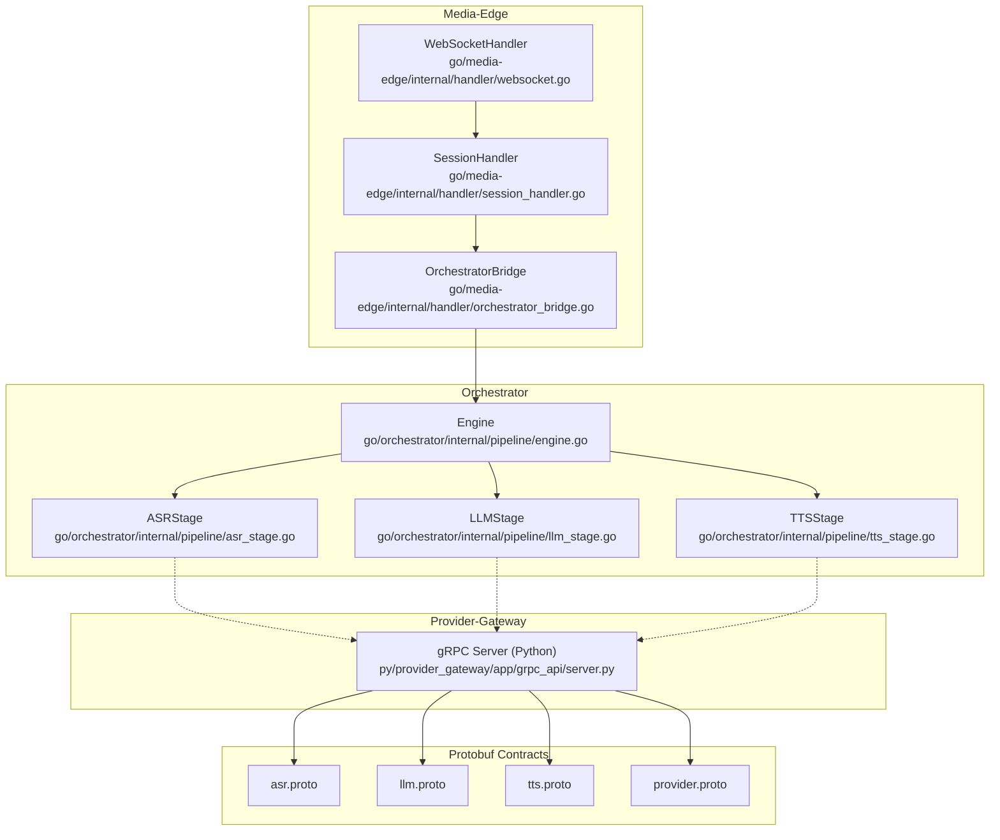
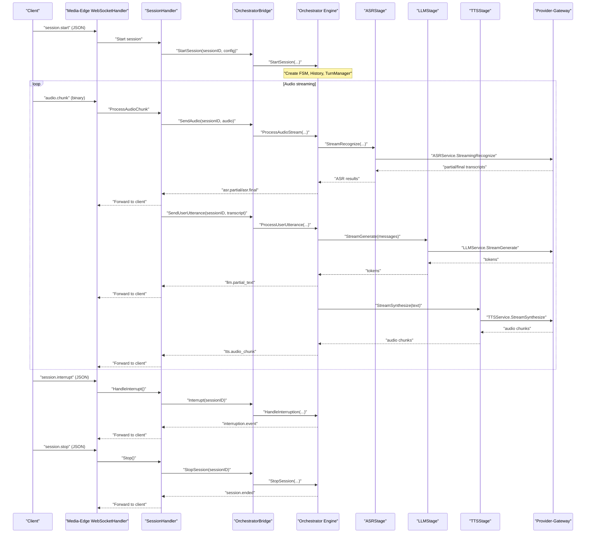
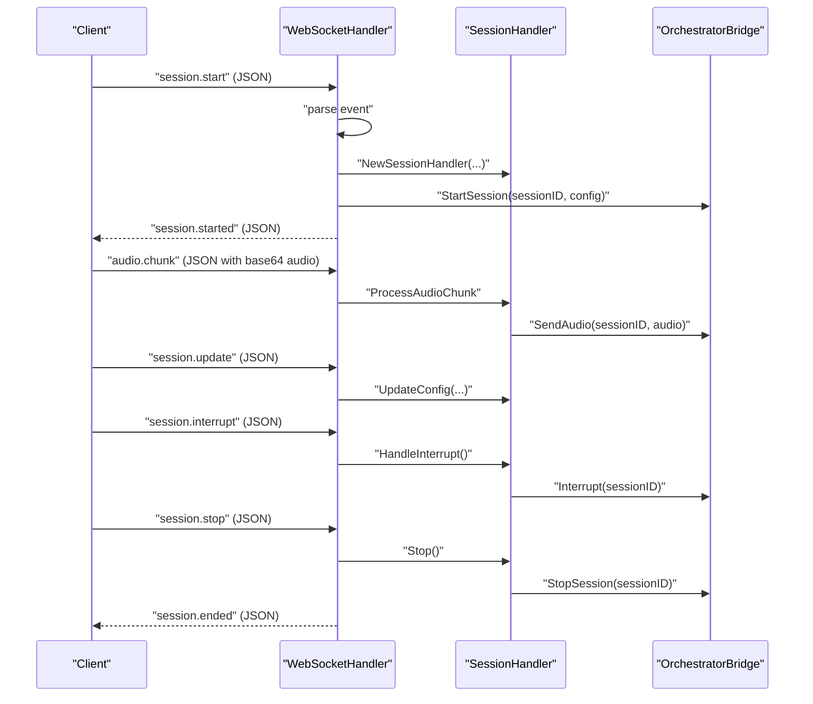
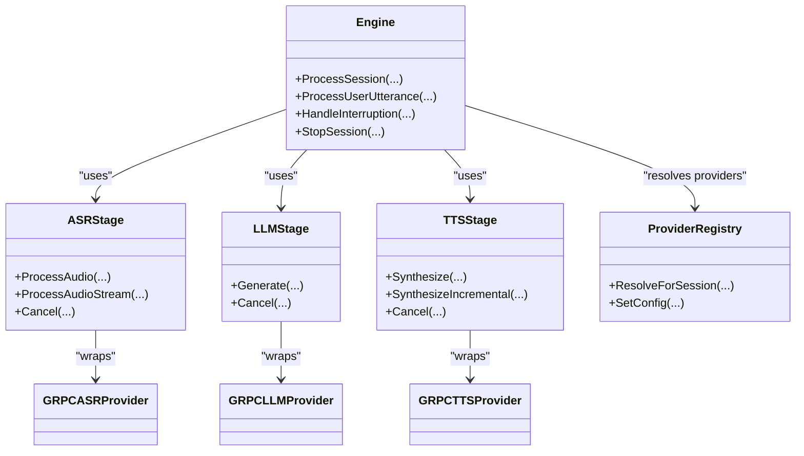
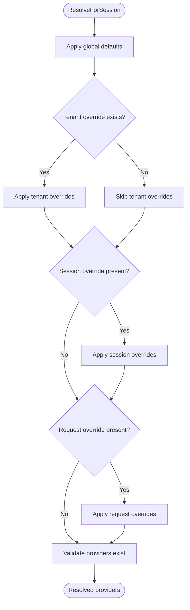
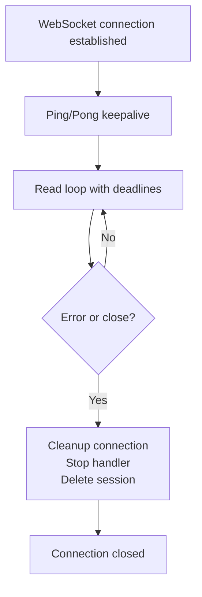
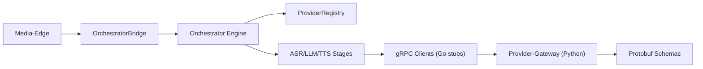

# Service Interactions

<cite>
**Referenced Files in This Document**
- [websocket.go](file://go/media-edge/internal/handler/websocket.go)
- [session_handler.go](file://go/media-edge/internal/handler/session_handler.go)
- [orchestrator_bridge.go](file://go/media-edge/internal/handler/orchestrator_bridge.go)
- [engine.go](file://go/orchestrator/internal/pipeline/engine.go)
- [asr_stage.go](file://go/orchestrator/internal/pipeline/asr_stage.go)
- [llm_stage.go](file://go/orchestrator/internal/pipeline/llm_stage.go)
- [tts_stage.go](file://go/orchestrator/internal/pipeline/tts_stage.go)
- [grpc_client.go](file://go/pkg/providers/grpc_client.go)
- [registry.go](file://go/pkg/providers/registry.go)
- [event.go](file://go/pkg/events/event.go)
- [session.go](file://go/pkg/session/session.go)
- [asr.proto](file://proto/asr.proto)
- [llm.proto](file://proto/llm.proto)
- [tts.proto](file://proto/tts.proto)
- [provider.proto](file://proto/provider.proto)
- [common.go](file://go/pkg/contracts/common.go)
</cite>

## Table of Contents
1. [Introduction](#introduction)
2. [Project Structure](#project-structure)
3. [Core Components](#core-components)
4. [Architecture Overview](#architecture-overview)
5. [Detailed Component Analysis](#detailed-component-analysis)
6. [Dependency Analysis](#dependency-analysis)
7. [Performance Considerations](#performance-considerations)
8. [Troubleshooting Guide](#troubleshooting-guide)
9. [Conclusion](#conclusion)

## Introduction
This document explains the service interaction patterns in CloudApp’s microservices architecture, focusing on:
- Real-time audio streaming and control messaging between Media-Edge and Orchestrator over WebSocket
- Cross-language gRPC-based AI processing between Orchestrator and Provider-Gateway
- Provider registry, capability discovery, and dynamic provider selection
- Request/response patterns, serialization formats, error handling, connection management, load balancing, and fault tolerance
- Shared contract definitions and Protocol Buffer schemas enabling interoperability

## Project Structure
CloudApp is organized into:
- Media-Edge: WebSocket server handling client audio and control events, bridging to Orchestrator
- Orchestrator: Core pipeline managing ASR->LLM->TTS stages, state machine, and session lifecycle
- Provider-Gateway: Python gRPC service exposing ASR/LLM/TTS providers (Go code stubs for future integration)
- Protobuf contracts: Shared schemas for gRPC APIs and internal Go mirrors

**Diagram sources**
- [websocket.go:95-129](file://go/media-edge/internal/handler/websocket.go#L95-L129)
- [session_handler.go:119-147](file://go/media-edge/internal/handler/session_handler.go#L119-L147)
- [orchestrator_bridge.go:13-32](file://go/media-edge/internal/handler/orchestrator_bridge.go#L13-L32)
- [engine.go:17-39](file://go/orchestrator/internal/pipeline/engine.go#L17-L39)
- [asr_stage.go:25-45](file://go/orchestrator/internal/pipeline/asr_stage.go#L25-L45)
- [llm_stage.go:33-56](file://go/orchestrator/internal/pipeline/llm_stage.go#L33-L56)
- [tts_stage.go:16-39](file://go/orchestrator/internal/pipeline/tts_stage.go#L16-L39)
- [asr.proto:1-53](file://proto/asr.proto#L1-L53)
- [llm.proto:1-59](file://proto/llm.proto#L1-L59)
- [tts.proto:1-45](file://proto/tts.proto#L1-L45)
- [provider.proto:1-63](file://proto/provider.proto#L1-L63)

**Section sources**
- [websocket.go:1-592](file://go/media-edge/internal/handler/websocket.go#L1-L592)
- [session_handler.go:1-540](file://go/media-edge/internal/handler/session_handler.go#L1-L540)
- [orchestrator_bridge.go:1-454](file://go/media-edge/internal/handler/orchestrator_bridge.go#L1-L454)
- [engine.go:1-510](file://go/orchestrator/internal/pipeline/engine.go#L1-L510)
- [asr_stage.go:1-313](file://go/orchestrator/internal/pipeline/asr_stage.go#L1-L313)
- [llm_stage.go:1-240](file://go/orchestrator/internal/pipeline/llm_stage.go#L1-L240)
- [tts_stage.go:1-313](file://go/orchestrator/internal/pipeline/tts_stage.go#L1-L313)
- [asr.proto:1-53](file://proto/asr.proto#L1-L53)
- [llm.proto:1-59](file://proto/llm.proto#L1-L59)
- [tts.proto:1-45](file://proto/tts.proto#L1-L45)
- [provider.proto:1-63](file://proto/provider.proto#L1-L63)

## Core Components
- Media-Edge WebSocketHandler: Accepts WebSocket connections, validates origin, manages per-connection state, and routes events to SessionHandler
- SessionHandler: Manages audio pipeline (VAD, normalization, chunking), buffers audio for ASR, forwards events to Orchestrator, and plays out TTS audio to the client
- OrchestratorBridge: Abstraction for communicating with Orchestrator; includes in-process ChannelBridge and placeholder GRPCBridge
- Orchestrator Engine: Orchestrates ASR->LLM->TTS pipeline, maintains session state, and coordinates stages
- Provider Registry: Registers and selects providers by type; supports tenant and session overrides
- gRPC Provider Clients (Go stubs): Define client interfaces for ASR/LLM/TTS; placeholders for Python provider-gateway integration
- Protobuf Contracts: Define gRPC service signatures and shared data structures

**Section sources**
- [websocket.go:22-92](file://go/media-edge/internal/handler/websocket.go#L22-L92)
- [session_handler.go:17-117](file://go/media-edge/internal/handler/session_handler.go#L17-L117)
- [orchestrator_bridge.go:13-96](file://go/media-edge/internal/handler/orchestrator_bridge.go#L13-L96)
- [engine.go:17-106](file://go/orchestrator/internal/pipeline/engine.go#L17-L106)
- [registry.go:14-40](file://go/pkg/providers/registry.go#L14-L40)
- [grpc_client.go:14-60](file://go/pkg/providers/grpc_client.go#L14-L60)
- [asr.proto:9-19](file://proto/asr.proto#L9-L19)
- [llm.proto:9-19](file://proto/llm.proto#L9-L19)
- [tts.proto:9-19](file://proto/tts.proto#L9-L19)
- [provider.proto:26-36](file://proto/provider.proto#L26-L36)

## Architecture Overview
The system uses two primary protocols:
- WebSocket (JSON events) between Media-Edge and client for real-time audio streaming and control
- gRPC between Orchestrator and Provider-Gateway for AI processing

**Diagram sources**
- [websocket.go:261-374](file://go/media-edge/internal/handler/websocket.go#L261-L374)
- [session_handler.go:176-225](file://go/media-edge/internal/handler/session_handler.go#L176-L225)
- [orchestrator_bridge.go:98-134](file://go/media-edge/internal/handler/orchestrator_bridge.go#L98-L134)
- [engine.go:108-208](file://go/orchestrator/internal/pipeline/engine.go#L108-L208)
- [asr_stage.go:164-290](file://go/orchestrator/internal/pipeline/asr_stage.go#L164-L290)
- [llm_stage.go:58-185](file://go/orchestrator/internal/pipeline/llm_stage.go#L58-L185)
- [tts_stage.go:129-236](file://go/orchestrator/internal/pipeline/tts_stage.go#L129-L236)
- [asr.proto:10-18](file://proto/asr.proto#L10-L18)
- [llm.proto:9-19](file://proto/llm.proto#L9-L19)
- [tts.proto:9-19](file://proto/tts.proto#L9-L19)

## Detailed Component Analysis

### Media-Edge WebSocket Interaction (JSON Events)
- Protocol: WebSocket over HTTP with JSON event payloads
- Supported events:
  - Client to Server: session.start, audio.chunk, session.update, session.interrupt, session.stop
  - Server to Client: session.started, vad.event, asr.partial, asr.final, llm.partial_text, tts.audio_chunk, turn.event, interruption.event, error, session.ended
- Serialization: JSON for control messages; audio is base64-encoded inside events
- Lifecycle:
  - Upgrade and register connection
  - On session.start: create Session, start SessionHandler, start bridge session
  - On audio.chunk: normalize, detect speech, accumulate for ASR, forward to Orchestrator
  - On session.update: update session configuration
  - On session.interrupt: trigger interruption handling
  - On session.stop: stop handler, delete session, send session.ended

**Diagram sources**
- [websocket.go:221-258](file://go/media-edge/internal/handler/websocket.go#L221-L258)
- [websocket.go:376-405](file://go/media-edge/internal/handler/websocket.go#L376-L405)
- [websocket.go:407-425](file://go/media-edge/internal/handler/websocket.go#L407-L425)
- [websocket.go:427-445](file://go/media-edge/internal/handler/websocket.go#L427-L445)
- [websocket.go:447-481](file://go/media-edge/internal/handler/websocket.go#L447-L481)
- [session_handler.go:176-225](file://go/media-edge/internal/handler/session_handler.go#L176-L225)
- [session_handler.go:462-473](file://go/media-edge/internal/handler/session_handler.go#L462-L473)
- [orchestrator_bridge.go:98-134](file://go/media-edge/internal/handler/orchestrator_bridge.go#L98-L134)

**Section sources**
- [event.go:14-35](file://go/pkg/events/event.go#L14-L35)
- [websocket.go:221-481](file://go/media-edge/internal/handler/websocket.go#L221-L481)
- [session_handler.go:176-473](file://go/media-edge/internal/handler/session_handler.go#L176-L473)

### Orchestrator Pipeline and Provider Integration (gRPC)
- Orchestrator Engine runs the ASR->LLM->TTS pipeline, emitting events to Media-Edge
- Stages wrap provider clients behind circuit breakers and metrics:
  - ASRStage: Streams audio to provider, emits partial/final transcripts
  - LLMStage: Streams tokens, records timings, supports cancellation
  - TTSStage: Synthesizes audio, supports incremental synthesis and cancellation
- Provider Registry resolves provider names per session with tenant/global overrides
- gRPC Provider Clients (Go stubs) define interfaces for ASR/LLM/TTS; placeholders for Python provider-gateway integration

**Diagram sources**
- [engine.go:17-106](file://go/orchestrator/internal/pipeline/engine.go#L17-L106)
- [asr_stage.go:25-45](file://go/orchestrator/internal/pipeline/asr_stage.go#L25-L45)
- [llm_stage.go:33-56](file://go/orchestrator/internal/pipeline/llm_stage.go#L33-L56)
- [tts_stage.go:16-39](file://go/orchestrator/internal/pipeline/tts_stage.go#L16-L39)
- [registry.go:14-40](file://go/pkg/providers/registry.go#L14-L40)
- [grpc_client.go:35-126](file://go/pkg/providers/grpc_client.go#L35-L126)
- [grpc_client.go:127-201](file://go/pkg/providers/grpc_client.go#L127-L201)
- [grpc_client.go:203-277](file://go/pkg/providers/grpc_client.go#L203-L277)

**Section sources**
- [engine.go:108-470](file://go/orchestrator/internal/pipeline/engine.go#L108-L470)
- [asr_stage.go:47-313](file://go/orchestrator/internal/pipeline/asr_stage.go#L47-L313)
- [llm_stage.go:58-240](file://go/orchestrator/internal/pipeline/llm_stage.go#L58-240)
- [tts_stage.go:41-313](file://go/orchestrator/internal/pipeline/tts_stage.go#L41-313)
- [registry.go:172-261](file://go/pkg/providers/registry.go#L172-L261)
- [grpc_client.go:14-288](file://go/pkg/providers/grpc_client.go#L14-L288)

### Provider Registry, Capability Discovery, and Dynamic Selection
- Registration: Providers registered by type (ASR/LLM/TTS/VAD)
- Resolution priority: request override → session override → tenant override → global defaults
- Validation: Ensures selected provider exists before use
- Capability discovery: ProviderService exposes ListProviders/GetProviderInfo/HealthCheck for management and discovery

**Diagram sources**
- [registry.go:172-251](file://go/pkg/providers/registry.go#L172-L251)
- [provider.proto:26-63](file://proto/provider.proto#L26-L63)

**Section sources**
- [registry.go:172-261](file://go/pkg/providers/registry.go#L172-L261)
- [provider.proto:26-63](file://proto/provider.proto#L26-L63)

### Connection Management, Load Balancing, and Fault Tolerance
- WebSocket:
  - Origin validation, ping/pong keepalive, read/write deadlines, per-connection buffers and channels
  - Graceful cleanup on errors or stop
- Orchestrator:
  - Circuit breakers around provider calls
  - Cancellation support for ASR/LLM/TTS
  - Interruption handling to cancel in-flight operations and resume listening
- Provider-Gateway:
  - gRPC clients configured with timeouts and retries (Go stubs)
  - Health checks and capability queries supported by ProviderService

**Diagram sources**
- [websocket.go:131-192](file://go/media-edge/internal/handler/websocket.go#L131-L192)
- [websocket.go:500-536](file://go/media-edge/internal/handler/websocket.go#L500-L536)

**Section sources**
- [websocket.go:67-91](file://go/media-edge/internal/handler/websocket.go#L67-L91)
- [websocket.go:131-192](file://go/media-edge/internal/handler/websocket.go#L131-L192)
- [websocket.go:500-536](file://go/media-edge/internal/handler/websocket.go#L500-L536)
- [asr_stage.go:292-302](file://go/orchestrator/internal/pipeline/asr_stage.go#L292-L302)
- [llm_stage.go:187-211](file://go/orchestrator/internal/pipeline/llm_stage.go#L187-L211)
- [tts_stage.go:238-258](file://go/orchestrator/internal/pipeline/tts_stage.go#L238-L258)
- [grpc_client.go:21-33](file://go/pkg/providers/grpc_client.go#L21-L33)

### Request/Response Patterns and Message Serialization
- WebSocket JSON events:
  - Control messages: session.start, session.update, session.interrupt, session.stop
  - Audio messages: audio.chunk (base64-encoded)
  - Server events: asr.partial, asr.final, llm.partial_text, tts.audio_chunk, turn.event, interruption.event, error, session.ended
- gRPC:
  - ASRService: bidirectional streaming for audio input and transcript output
  - LLMService: server streaming for token output
  - TTSService: server streaming for audio output
  - ProviderService: list/get providers, health checks
- Shared contracts:
  - SessionContext, AudioFormat, ProviderCapability, TimingMetadata, ProviderError

**Section sources**
- [event.go:80-185](file://go/pkg/events/event.go#L80-L185)
- [asr.proto:10-52](file://proto/asr.proto#L10-L52)
- [llm.proto:9-58](file://proto/llm.proto#L9-L58)
- [tts.proto:9-44](file://proto/tts.proto#L9-L44)
- [provider.proto:26-63](file://proto/provider.proto#L26-L63)
- [common.go:83-169](file://go/pkg/contracts/common.go#L83-L169)

## Dependency Analysis
- Media-Edge depends on OrchestratorBridge abstraction; in-process ChannelBridge is implemented, while GRPCBridge is a placeholder awaiting integration
- Orchestrator depends on ProviderRegistry and gRPC clients (Go stubs) to call Provider-Gateway
- Provider-Gateway exposes gRPC services defined in protobuf contracts
- Internal Go contracts mirror protobuf messages until proto generation is enabled

**Diagram sources**
- [orchestrator_bridge.go:13-96](file://go/media-edge/internal/handler/orchestrator_bridge.go#L13-L96)
- [engine.go:17-106](file://go/orchestrator/internal/pipeline/engine.go#L17-L106)
- [registry.go:14-40](file://go/pkg/providers/registry.go#L14-L40)
- [grpc_client.go:35-126](file://go/pkg/providers/grpc_client.go#L35-L126)
- [asr.proto:1-53](file://proto/asr.proto#L1-L53)
- [llm.proto:1-59](file://proto/llm.proto#L1-L59)
- [tts.proto:1-45](file://proto/tts.proto#L1-L45)
- [provider.proto:1-63](file://proto/provider.proto#L1-L63)

**Section sources**
- [orchestrator_bridge.go:351-413](file://go/media-edge/internal/handler/orchestrator_bridge.go#L351-L413)
- [engine.go:17-106](file://go/orchestrator/internal/pipeline/engine.go#L17-L106)
- [grpc_client.go:35-288](file://go/pkg/providers/grpc_client.go#L35-L288)

## Performance Considerations
- Latency tracking: Timestamps recorded at ASR/LLM/TTS boundaries; metrics emitted for TTFT and end-to-end latencies
- Incremental synthesis: TTSStage batches tokens into speakable segments to overlap generation and synthesis
- Backpressure: Channels sized to prevent unbounded memory growth; dropping oldest items when full
- Circuit breakers: Protect Orchestrator from provider failures and cascading effects
- Audio buffering: Jitter buffers and playout tracking smooth client delivery

[No sources needed since this section provides general guidance]

## Troubleshooting Guide
- WebSocket errors:
  - Unexpected close or unsupported message type; logs include error details and connection cleanup
  - Ping failure or read deadline exceeded indicates network issues or client disconnect
- Orchestrator interruptions:
  - Interruption events signal user speech during bot playback; verify VAD and playout tracking
- Provider errors:
  - ProviderError codes indicate retriable vs non-retriable failures; circuit breaker opens on sustained errors
  - gRPC client configuration includes timeouts and retry counts

**Section sources**
- [websocket.go:171-190](file://go/media-edge/internal/handler/websocket.go#L171-L190)
- [websocket.go:162-165](file://go/media-edge/internal/handler/websocket.go#L162-L165)
- [session_handler.go:292-314](file://go/media-edge/internal/handler/session_handler.go#L292-L314)
- [common.go:38-81](file://go/pkg/contracts/common.go#L38-L81)
- [grpc_client.go:21-33](file://go/pkg/providers/grpc_client.go#L21-L33)

## Conclusion
CloudApp’s service interactions combine real-time WebSocket control and audio streaming with robust gRPC-based AI processing. The Media-Edge layer focuses on client connectivity and audio pipeline orchestration, while the Orchestrator manages the ASR->LLM->TTS pipeline with strong error handling, interruption support, and provider abstraction. The shared Protocol Buffer contracts and internal Go mirrors ensure consistent cross-language communication and future extensibility.