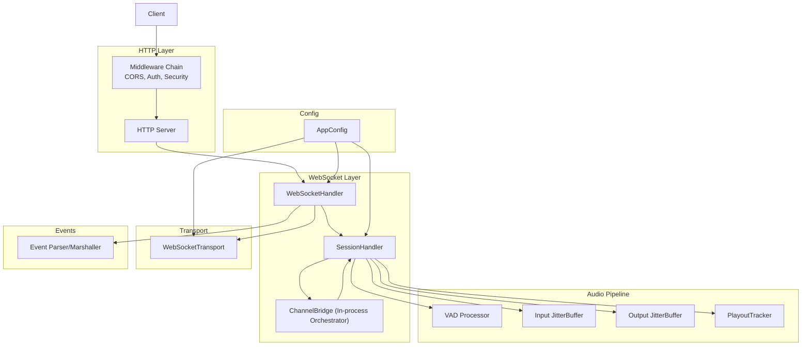
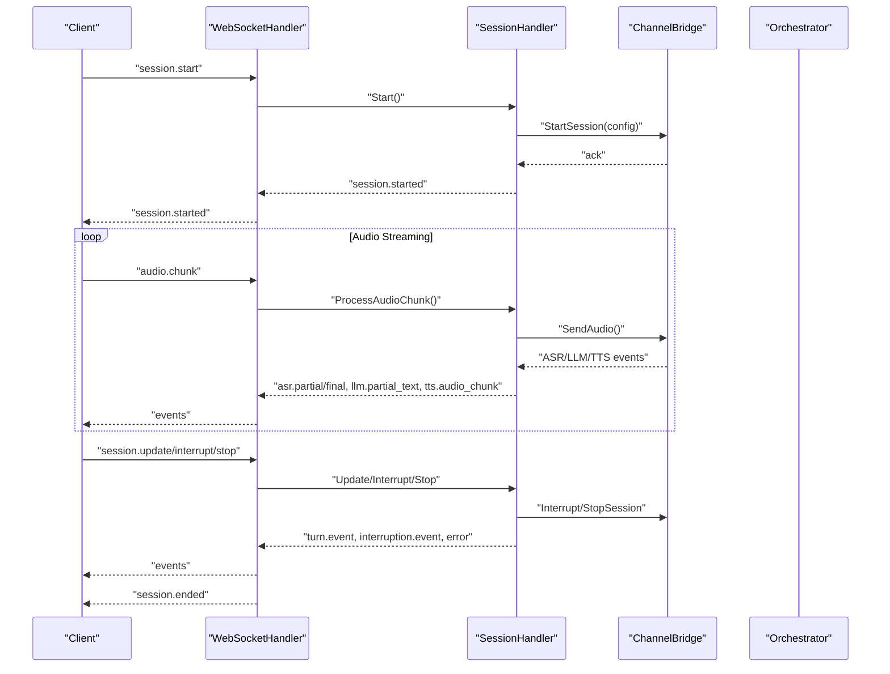
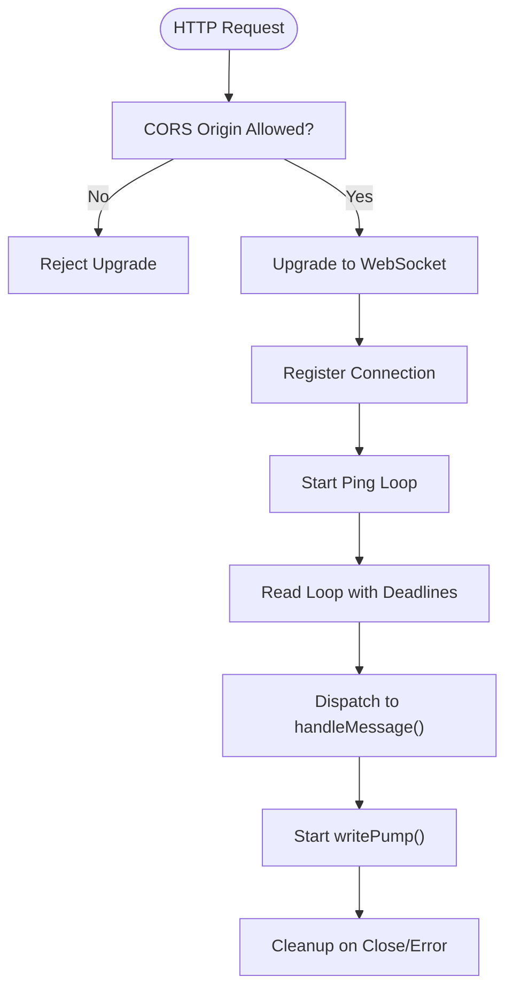
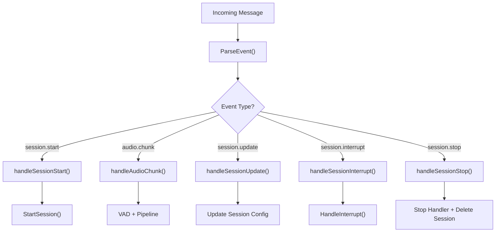
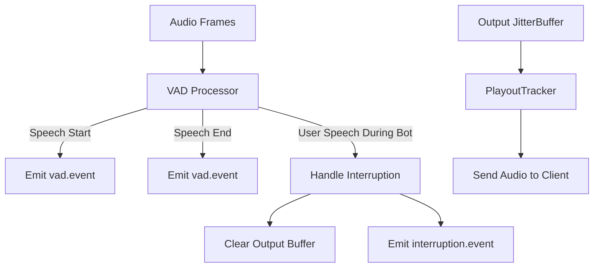
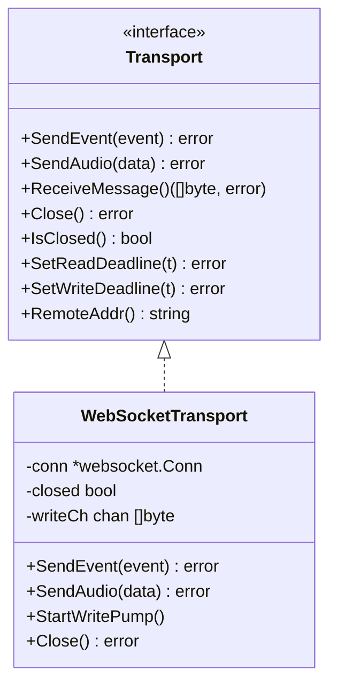
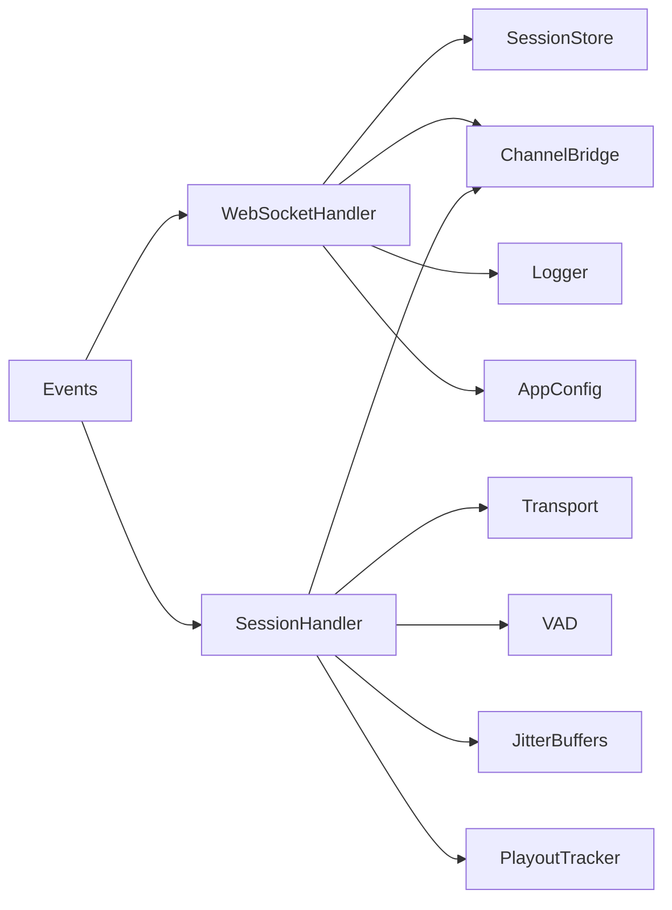

# WebSocket Communication

<cite>
**Referenced Files in This Document**
- [websocket-api.md](file://docs/websocket-api.md)
- [websocket.go](file://go/media-edge/internal/handler/websocket.go)
- [session_handler.go](file://go/media-edge/internal/handler/session_handler.go)
- [orchestrator_bridge.go](file://go/media-edge/internal/handler/orchestrator_bridge.go)
- [transport.go](file://go/media-edge/internal/transport/transport.go)
- [middleware.go](file://go/media-edge/internal/handler/middleware.go)
- [config.go](file://go/pkg/config/config.go)
- [event.go](file://go/pkg/events/event.go)
- [client.go](file://go/pkg/events/client.go)
- [server.go](file://go/pkg/events/server.go)
- [session.go](file://go/pkg/session/session.go)
- [chunk.go](file://go/pkg/audio/chunk.go)
- [playout.go](file://go/pkg/audio/playout.go)
- [main.go](file://go/media-edge/cmd/main.go)
- [config-local.yaml](file://examples/config-local.yaml)
- [ws-client.py](file://scripts/ws-client.py)
</cite>

## Table of Contents
1. [Introduction](#introduction)
2. [Project Structure](#project-structure)
3. [Core Components](#core-components)
4. [Architecture Overview](#architecture-overview)
5. [Detailed Component Analysis](#detailed-component-analysis)
6. [Dependency Analysis](#dependency-analysis)
7. [Performance Considerations](#performance-considerations)
8. [Troubleshooting Guide](#troubleshooting-guide)
9. [Conclusion](#conclusion)

## Introduction
This document describes CloudApp’s WebSocket-based real-time audio streaming architecture. It covers the WebSocket upgrade process, connection lifecycle management, bidirectional message flow between client and Media-Edge service, event-driven session orchestration, security and CORS configuration, keepalive mechanisms, graceful termination, and performance tuning. The documented events include session.start, audio.chunk, session.update, session.interrupt, session.stop, and server-side events such as session.started, vad.event, asr.partial/asr.final, llm.partial_text, tts.audio_chunk, turn.event, interruption.event, error, and session.ended.

## Project Structure
The WebSocket service is implemented in the media-edge module with supporting packages for events, audio processing, session management, and configuration. The HTTP server applies middleware for CORS, authentication, and security headers, and exposes the WebSocket endpoint.

**Diagram sources**
- [main.go:94-143](file://go/media-edge/cmd/main.go#L94-L143)
- [websocket.go:95-129](file://go/media-edge/internal/handler/websocket.go#L95-L129)
- [transport.go:44-80](file://go/media-edge/internal/transport/transport.go#L44-L80)
- [session_handler.go:17-51](file://go/media-edge/internal/handler/session_handler.go#L17-L51)
- [orchestrator_bridge.go:13-43](file://go/media-edge/internal/handler/orchestrator_bridge.go#L13-L43)
- [config.go:10-28](file://go/pkg/config/config.go#L10-L28)

**Section sources**
- [main.go:94-143](file://go/media-edge/cmd/main.go#L94-L143)
- [websocket.go:95-129](file://go/media-edge/internal/handler/websocket.go#L95-L129)
- [transport.go:44-80](file://go/media-edge/internal/transport/transport.go#L44-L80)
- [session_handler.go:17-51](file://go/media-edge/internal/handler/session_handler.go#L17-L51)
- [orchestrator_bridge.go:13-43](file://go/media-edge/internal/handler/orchestrator_bridge.go#L13-L43)
- [config.go:10-28](file://go/pkg/config/config.go#L10-L28)

## Core Components
- WebSocketHandler: Manages WebSocket upgrades, per-connection state, read/write loops, ping/pong keepalive, and dispatches messages to SessionHandler.
- SessionHandler: Implements the audio pipeline, VAD, interruption handling, orchestrator event routing, and audio playout.
- ChannelBridge: In-process bridge to the orchestrator for MVP; forwards audio, user utterances, and events.
- WebSocketTransport: Abstraction for sending JSON events and binary audio over WebSocket.
- Events: Strongly typed event parsing, marshalling, and server-defined event types.
- Config: Centralized configuration for timeouts, chunk sizes, CORS, and security.

**Section sources**
- [websocket.go:22-92](file://go/media-edge/internal/handler/websocket.go#L22-L92)
- [session_handler.go:17-51](file://go/media-edge/internal/handler/session_handler.go#L17-L51)
- [orchestrator_bridge.go:13-43](file://go/media-edge/internal/handler/orchestrator_bridge.go#L13-L43)
- [transport.go:16-42](file://go/media-edge/internal/transport/transport.go#L16-L42)
- [event.go:11-35](file://go/pkg/events/event.go#L11-L35)
- [config.go:87-94](file://go/pkg/config/config.go#L87-L94)

## Architecture Overview
The WebSocket service follows an event-driven architecture:
- Client initiates a session with session.start and begins streaming audio with audio.chunk.
- Media-Edge validates and stores session metadata, starts SessionHandler, and notifies the in-process orchestrator.
- SessionHandler runs VAD, interruption detection, and routes orchestrator events to the client.
- Audio synthesis chunks are queued and streamed to the client at a controlled rate.
- Control messages support runtime updates (session.update), manual interruptions (session.interrupt), and graceful termination (session.stop).

**Diagram sources**
- [websocket.go:260-374](file://go/media-edge/internal/handler/websocket.go#L260-L374)
- [session_handler.go:119-174](file://go/media-edge/internal/handler/session_handler.go#L119-L174)
- [orchestrator_bridge.go:98-134](file://go/media-edge/internal/handler/orchestrator_bridge.go#L98-L134)
- [websocket-api.md:502-540](file://docs/websocket-api.md#L502-L540)

## Detailed Component Analysis

### WebSocket Upgrade and Connection Lifecycle
- Upgrade: The HTTP server applies middleware and routes to WebSocketHandler, which uses a configurable Upgrader with Read/WriteBufferSize and CORS origin validation.
- Connection registration: Each connection gets a unique ID, is registered in a map, and tracked for metrics.
- Keepalive: Periodic ping frames are sent; pong handler refreshes read deadlines and last activity timestamps.
- Read/write pumps: Dedicated goroutines handle message reads and writes with deadlines and timeouts.
- Cleanup: On close or error, the connection is deregistered, handler stopped, and session removed if present.

**Diagram sources**
- [websocket.go:67-91](file://go/media-edge/internal/handler/websocket.go#L67-L91)
- [websocket.go:131-192](file://go/media-edge/internal/handler/websocket.go#L131-L192)
- [middleware.go:133-170](file://go/media-edge/internal/handler/middleware.go#L133-L170)

**Section sources**
- [websocket.go:95-129](file://go/media-edge/internal/handler/websocket.go#L95-L129)
- [websocket.go:131-192](file://go/media-edge/internal/handler/websocket.go#L131-L192)
- [middleware.go:133-170](file://go/media-edge/internal/handler/middleware.go#L133-L170)

### Message Handling and Event Dispatch
- Supported client-to-server events: session.start, audio.chunk, session.update, session.interrupt, session.stop.
- Parsing: events.ParseEvent inspects the type field and unmarshals into the appropriate event struct.
- Dispatch: handleMessage routes to dedicated handlers that update session state and interact with the orchestrator bridge.

**Diagram sources**
- [event.go:80-185](file://go/pkg/events/event.go#L80-L185)
- [websocket.go:220-258](file://go/media-edge/internal/handler/websocket.go#L220-L258)
- [websocket.go:260-481](file://go/media-edge/internal/handler/websocket.go#L260-L481)

**Section sources**
- [event.go:80-185](file://go/pkg/events/event.go#L80-L185)
- [websocket.go:220-258](file://go/media-edge/internal/handler/websocket.go#L220-L258)
- [websocket.go:260-481](file://go/media-edge/internal/handler/websocket.go#L260-L481)

### SessionHandler: Audio Pipeline and Interruption
- VAD: Detects speech start/end and emits vad.event to the client.
- Interruption: If the bot is speaking and user speech is detected, the turn is interrupted, buffers cleared, and an interruption.event is emitted.
- Orchestrator events: ASR partial/final, LLM partial text, TTS audio chunks are forwarded to the client; TTS audio is queued in output buffer.
- Playout: Audio chunks are sent to the client at ~10ms intervals; PlayoutTracker updates position and triggers callbacks.

**Diagram sources**
- [session_handler.go:227-314](file://go/media-edge/internal/handler/session_handler.go#L227-L314)
- [session_handler.go:316-403](file://go/media-edge/internal/handler/session_handler.go#L316-L403)
- [session_handler.go:405-432](file://go/media-edge/internal/handler/session_handler.go#L405-L432)
- [playout.go:9-40](file://go/pkg/audio/playout.go#L9-L40)

**Section sources**
- [session_handler.go:227-314](file://go/media-edge/internal/handler/session_handler.go#L227-L314)
- [session_handler.go:316-403](file://go/media-edge/internal/handler/session_handler.go#L316-L403)
- [session_handler.go:405-432](file://go/media-edge/internal/handler/session_handler.go#L405-L432)
- [playout.go:9-40](file://go/pkg/audio/playout.go#L9-L40)

### Transport Layer: WebSocketTransport
- Supports SendEvent (JSON) and SendAudio (binary).
- Uses a buffered write channel with a write pump goroutine to avoid blocking.
- Provides message type demultiplexing and ping/pong handling.
- Exposes deadlines and connection state for lifecycle management.

**Diagram sources**
- [transport.go:16-42](file://go/media-edge/internal/transport/transport.go#L16-L42)
- [transport.go:44-80](file://go/media-edge/internal/transport/transport.go#L44-L80)

**Section sources**
- [transport.go:82-161](file://go/media-edge/internal/transport/transport.go#L82-L161)
- [transport.go:163-204](file://go/media-edge/internal/transport/transport.go#L163-L204)

### Event Schema and Formats
- Client-to-server: session.start, audio.chunk, session.update, session.interrupt, session.stop.
- Server-to-client: session.started, vad.event, asr.partial, asr.final, llm.partial_text, tts.audio_chunk, turn.event, interruption.event, error, session.ended.
- Audio data is base64-encoded in JSON payloads; binary audio is sent via WebSocket binary frames.

**Section sources**
- [websocket-api.md:24-197](file://docs/websocket-api.md#L24-L197)
- [websocket-api.md:198-442](file://docs/websocket-api.md#L198-L442)
- [client.go:3-113](file://go/pkg/events/client.go#L3-L113)
- [server.go:7-178](file://go/pkg/events/server.go#L7-L178)

### Bidirectional Message Flow Examples
- Typical session flow includes session.start, session.started, multiple audio.chunk, vad.event, asr.partial/final, llm.partial_text, tts.audio_chunk, turn.event, and session.ended.
- Interruption flow emits interruption.event and clears output buffers.

**Section sources**
- [websocket-api.md:502-540](file://docs/websocket-api.md#L502-L540)

### Connection Security and CORS
- CORS: Origin validation enforced in WebSocketHandler upgrader and middleware; Access-Control headers set for browsers.
- Authentication: Optional API key via X-API-Key header or query param; disabled by default in example config.
- Security headers: X-Content-Type-Options, X-Frame-Options, X-XSS-Protection, Referrer-Policy applied to HTTP responses.

**Section sources**
- [websocket.go:67-84](file://go/media-edge/internal/handler/websocket.go#L67-L84)
- [middleware.go:133-170](file://go/media-edge/internal/handler/middleware.go#L133-L170)
- [middleware.go:250-263](file://go/media-edge/internal/handler/middleware.go#L250-L263)
- [config-local.yaml:35-38](file://examples/config-local.yaml#L35-L38)

### Keepalive and Graceful Termination
- Keepalive: Periodic ping frames; pong handler extends read deadline and updates last activity.
- Graceful stop: session.stop triggers handler Stop, deletes session from store, emits session.ended, and closes the connection.

**Section sources**
- [websocket.go:138-192](file://go/media-edge/internal/handler/websocket.go#L138-L192)
- [websocket.go:447-481](file://go/media-edge/internal/handler/websocket.go#L447-L481)

### Error Handling Strategies
- Message parsing errors and unsupported types are returned as error events to the client.
- Session state transitions are validated; invalid transitions produce error events.
- Transport write failures and buffer overflows are logged and handled without blocking.

**Section sources**
- [websocket.go:220-258](file://go/media-edge/internal/handler/websocket.go#L220-L258)
- [session_handler.go:392-403](file://go/media-edge/internal/handler/session_handler.go#L392-L403)
- [transport.go:106-116](file://go/media-edge/internal/transport/transport.go#L106-L116)

## Dependency Analysis
- WebSocketHandler depends on SessionStore, OrchestratorBridge, Logger, and Config.
- SessionHandler depends on Transport, OrchestratorBridge, VAD, audio buffers, and PlayoutTracker.
- Transport depends on WebSocket connection and implements the Transport interface.
- Events package provides type-safe parsing and marshalling for all WebSocket messages.

**Diagram sources**
- [websocket.go:22-92](file://go/media-edge/internal/handler/websocket.go#L22-L92)
- [session_handler.go:17-51](file://go/media-edge/internal/handler/session_handler.go#L17-L51)
- [event.go:11-35](file://go/pkg/events/event.go#L11-L35)

**Section sources**
- [websocket.go:22-92](file://go/media-edge/internal/handler/websocket.go#L22-L92)
- [session_handler.go:17-51](file://go/media-edge/internal/handler/session_handler.go#L17-L51)
- [event.go:11-35](file://go/pkg/events/event.go#L11-L35)

## Performance Considerations
- Buffer sizing:
  - Max message size enforced by Security.MaxChunkSize.
  - JitterBuffer sizes configured in SessionHandler (e.g., 100 frames) to smooth network jitter.
  - Transport write channel capacity tuned to prevent backpressure.
- Timeouts:
  - ReadTimeout and WriteTimeout from ServerConfig applied to read/write deadlines.
  - Ping interval and pong handler ensure liveness checks.
- Concurrency:
  - Separate goroutines for read loop, write pump, audio output, and event processing.
  - ChannelBridge uses bounded channels to prevent memory growth under load.
- Audio processing:
  - Fixed 10ms frame size for VAD and playout alignment.
  - PCM16 normalization and chunking reduce downstream processing overhead.

**Section sources**
- [config.go:87-94](file://go/pkg/config/config.go#L87-L94)
- [websocket.go:67-91](file://go/media-edge/internal/handler/websocket.go#L67-L91)
- [session_handler.go:82-106](file://go/media-edge/internal/handler/session_handler.go#L82-L106)
- [chunk.go:76-101](file://go/pkg/audio/chunk.go#L76-L101)
- [playout.go:26-40](file://go/pkg/audio/playout.go#L26-L40)

## Troubleshooting Guide
- Connection fails:
  - Verify CORS origin matches AllowedOrigins and Access-Control-Allow-Origin is set.
  - Check ReadTimeout/WriteTimeout and network connectivity.
- Frequent pings/pongs:
  - Ensure client supports ping/pong; adjust ping interval if needed.
- Audio choppy or delayed:
  - Tune JitterBuffer sizes and playout tick interval.
  - Validate audio profile (sample rate, channels, encoding) matches client configuration.
- Session not found or state errors:
  - Confirm session.start precedes audio.chunk and session.stop is sent to terminate.
  - Review error events for INVALID_MESSAGE, SESSION_NOT_FOUND, PROVIDER_ERROR, RATE_LIMITED, AUTHENTICATION, AUTHORIZATION, INTERNAL_ERROR.

**Section sources**
- [websocket.go:67-91](file://go/media-edge/internal/handler/websocket.go#L67-L91)
- [websocket.go:138-192](file://go/media-edge/internal/handler/websocket.go#L138-L192)
- [websocket.go:220-258](file://go/media-edge/internal/handler/websocket.go#L220-L258)
- [websocket-api.md:417-429](file://docs/websocket-api.md#L417-L429)

## Conclusion
CloudApp’s WebSocket service provides a robust, event-driven foundation for real-time audio streaming. It enforces secure, CORS-aware connections, maintains reliable keepalive, and cleanly separates concerns between transport, session handling, and audio processing. The documented message formats and lifecycle events enable predictable client integrations, while configuration-driven timeouts and buffer sizes support tunable performance across diverse environments.