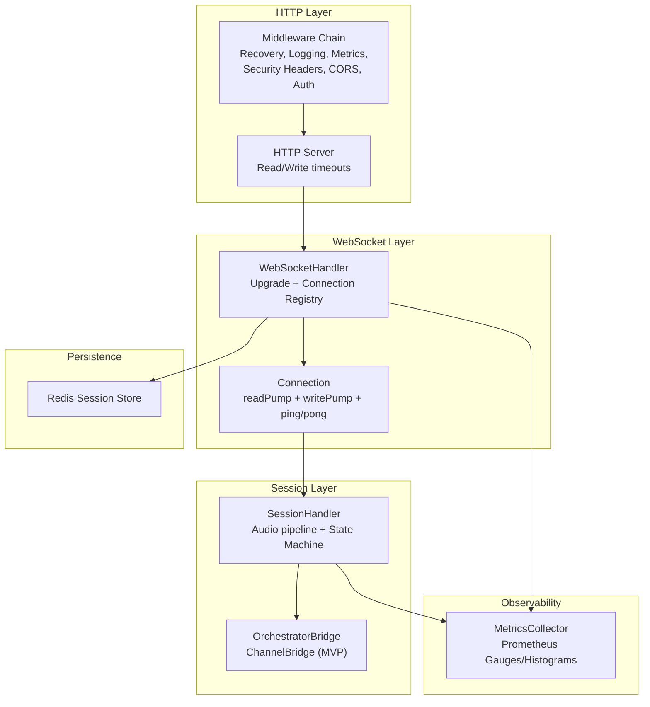
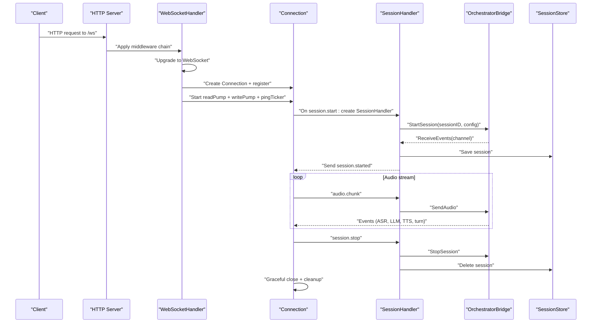
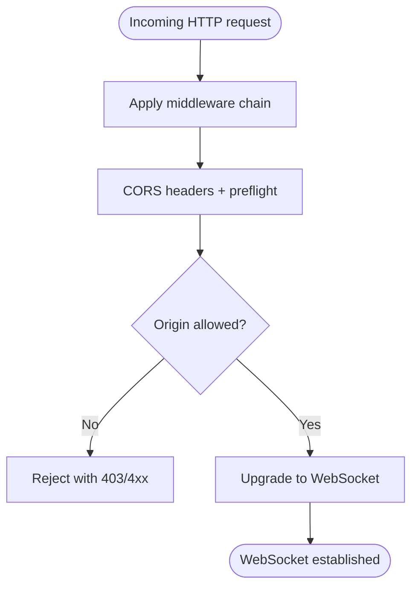
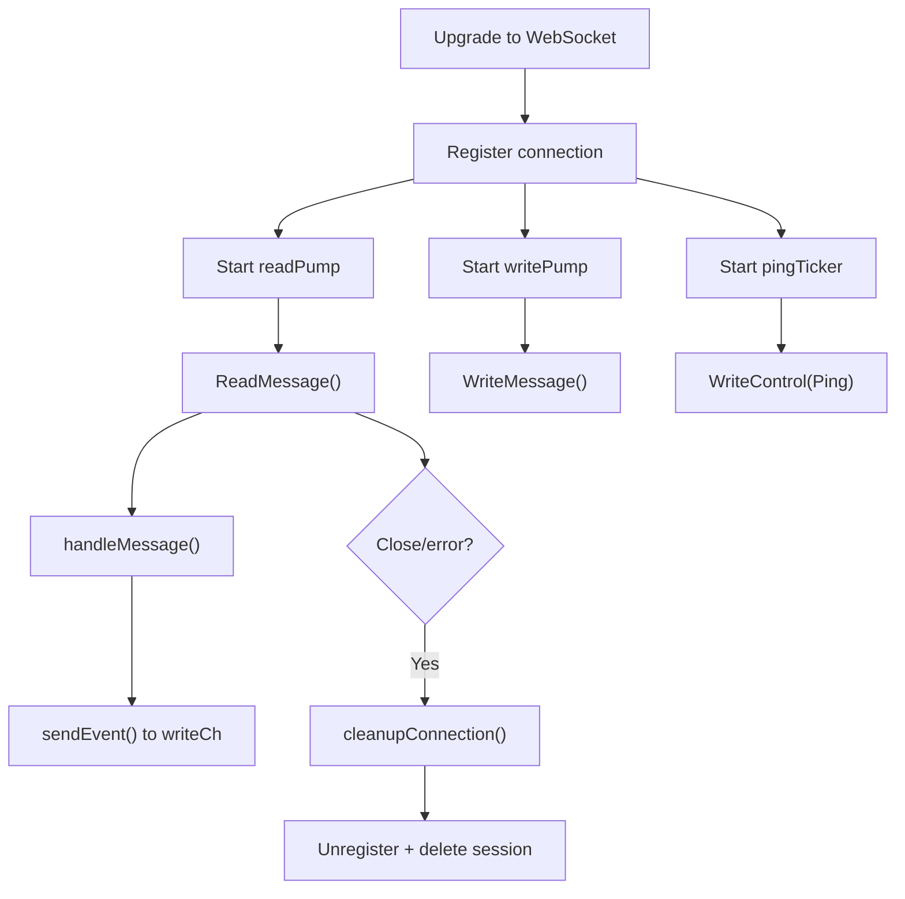
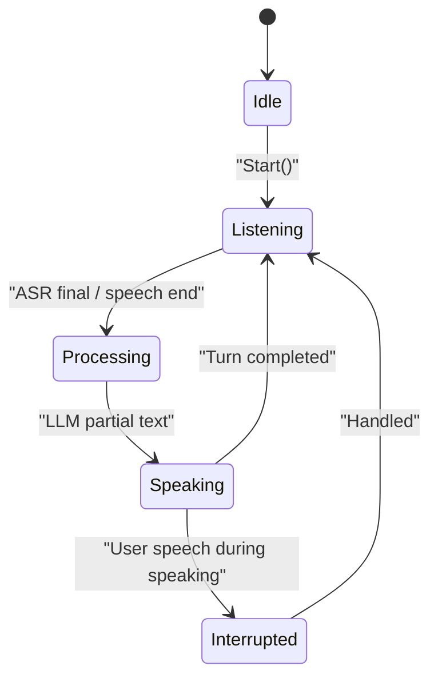
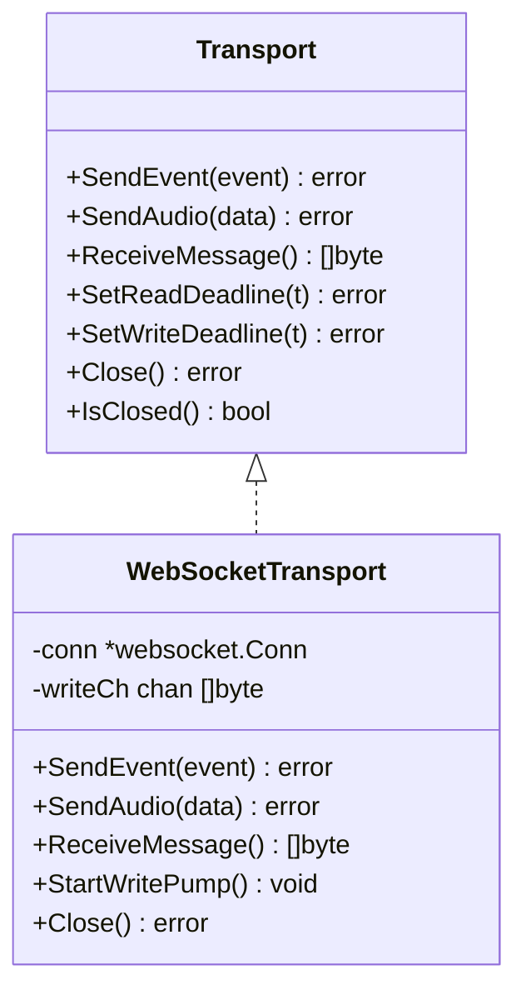
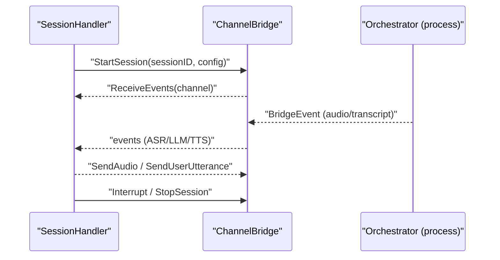
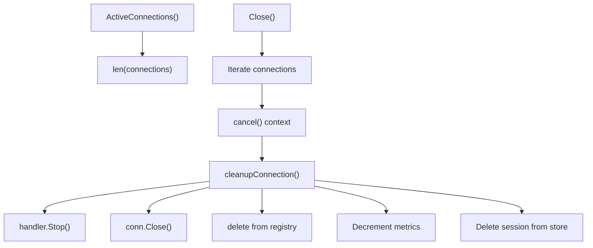
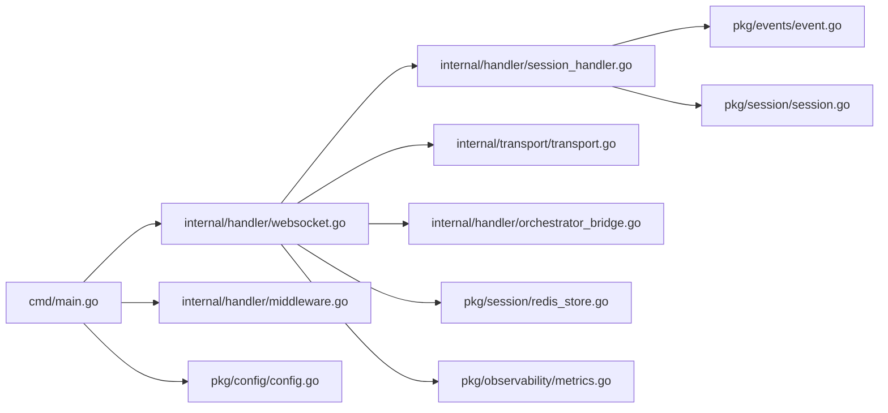

# WebSocket Connection Lifecycle

<cite>
**Referenced Files in This Document**
- [main.go](file://go/media-edge/cmd/main.go)
- [websocket.go](file://go/media-edge/internal/handler/websocket.go)
- [session_handler.go](file://go/media-edge/internal/handler/session_handler.go)
- [middleware.go](file://go/media-edge/internal/handler/middleware.go)
- [transport.go](file://go/media-edge/internal/transport/transport.go)
- [orchestrator_bridge.go](file://go/media-edge/internal/handler/orchestrator_bridge.go)
- [event.go](file://go/pkg/events/event.go)
- [session.go](file://go/pkg/session/session.go)
- [metrics.go](file://go/pkg/observability/metrics.go)
- [config.go](file://go/pkg/config/config.go)
- [redis_store.go](file://go/pkg/session/redis_store.go)
- [postgres_store.go](file://go/pkg/session/postgres_store.go)
- [websocket-api.md](file://docs/websocket-api.md)
- [implementation-notes.md](file://docs/implementation-notes.md)
</cite>

## Table of Contents
1. [Introduction](#introduction)
2. [Project Structure](#project-structure)
3. [Core Components](#core-components)
4. [Architecture Overview](#architecture-overview)
5. [Detailed Component Analysis](#detailed-component-analysis)
6. [Dependency Analysis](#dependency-analysis)
7. [Performance Considerations](#performance-considerations)
8. [Troubleshooting Guide](#troubleshooting-guide)
9. [Conclusion](#conclusion)
10. [Appendices](#appendices)

## Introduction
This document explains the complete WebSocket connection lifecycle in CloudApp’s media-edge service. It covers the HTTP upgrade to WebSocket establishment, CORS and origin validation, security checks, connection state management, ping/pong keepalive, read/write timeouts, graceful termination, metrics and monitoring, and operational guidance for scaling and recovery.

## Project Structure
The WebSocket service is implemented in the media-edge module and integrates with session management, transport abstractions, and observability. Key areas:
- HTTP server bootstrap and middleware chain
- WebSocket handler and connection lifecycle
- Session handler for audio pipeline and state transitions
- Transport abstraction for WebSocket I/O
- Orchestrator bridge for session coordination
- Events and session models
- Metrics and configuration

**Diagram sources**
- [main.go:128-143](file://go/media-edge/cmd/main.go#L128-L143)
- [websocket.go:94-129](file://go/media-edge/internal/handler/websocket.go#L94-L129)
- [session_handler.go:119-147](file://go/media-edge/internal/handler/session_handler.go#L119-L147)
- [orchestrator_bridge.go:98-134](file://go/media-edge/internal/handler/orchestrator_bridge.go#L98-L134)
- [redis_store.go:38-85](file://go/pkg/session/redis_store.go#L38-L85)
- [metrics.go:10-82](file://go/pkg/observability/metrics.go#L10-L82)

**Section sources**
- [main.go:128-143](file://go/media-edge/cmd/main.go#L128-L143)
- [websocket.go:94-129](file://go/media-edge/internal/handler/websocket.go#L94-L129)
- [session_handler.go:119-147](file://go/media-edge/internal/handler/session_handler.go#L119-L147)
- [orchestrator_bridge.go:98-134](file://go/media-edge/internal/handler/orchestrator_bridge.go#L98-L134)
- [redis_store.go:38-85](file://go/pkg/session/redis_store.go#L38-L85)
- [metrics.go:10-82](file://go/pkg/observability/metrics.go#L10-L82)

## Core Components
- WebSocketHandler: Manages HTTP upgrade, connection registry, and per-connection lifecycle.
- Connection: Encapsulates a single WebSocket connection, read/write pumps, ping/pong, and last activity tracking.
- SessionHandler: Runs the audio pipeline, VAD, playout tracking, and orchestrator integration.
- Transport: Abstraction for sending/receiving events and audio over WebSocket.
- OrchestratorBridge: Inter-service communication (ChannelBridge for MVP).
- SessionStore: Persists session metadata (Redis implementation available).
- MetricsCollector: Exposes gauges and histograms for monitoring.

**Section sources**
- [websocket.go:22-54](file://go/media-edge/internal/handler/websocket.go#L22-L54)
- [websocket.go:131-192](file://go/media-edge/internal/handler/websocket.go#L131-L192)
- [session_handler.go:17-51](file://go/media-edge/internal/handler/session_handler.go#L17-L51)
- [transport.go:16-42](file://go/media-edge/internal/transport/transport.go#L16-L42)
- [orchestrator_bridge.go:13-32](file://go/media-edge/internal/handler/orchestrator_bridge.go#L13-L32)
- [session.go:62-84](file://go/pkg/session/session.go#L62-L84)
- [metrics.go:149-214](file://go/pkg/observability/metrics.go#L149-L214)

## Architecture Overview
The WebSocket service is a stateless HTTP server that upgrades requests to WebSocket connections. Each connection is registered and managed independently, with a dedicated read/write pump and periodic ping/pong keepalive. Sessions are persisted in Redis and coordinated with an orchestrator bridge.

**Diagram sources**
- [main.go:128-143](file://go/media-edge/cmd/main.go#L128-L143)
- [websocket.go:94-129](file://go/media-edge/internal/handler/websocket.go#L94-L129)
- [websocket.go:131-192](file://go/media-edge/internal/handler/websocket.go#L131-L192)
- [session_handler.go:119-147](file://go/media-edge/internal/handler/session_handler.go#L119-L147)
- [orchestrator_bridge.go:98-134](file://go/media-edge/internal/handler/orchestrator_bridge.go#L98-L134)
- [redis_store.go:61-85](file://go/pkg/session/redis_store.go#L61-L85)

## Detailed Component Analysis

### HTTP Upgrade and CORS/Origin Validation
- The HTTP server applies a middleware chain including CORS handling and origin validation.
- The WebSocketHandler uses a gorilla websocket Upgrader with a configurable CheckOrigin function that validates against allowed origins from configuration.
- The middleware also enforces security headers and optional API key authentication.

**Diagram sources**
- [main.go:128-143](file://go/media-edge/cmd/main.go#L128-L143)
- [middleware.go:133-170](file://go/media-edge/internal/handler/middleware.go#L133-L170)
- [websocket.go:67-84](file://go/media-edge/internal/handler/websocket.go#L67-L84)

**Section sources**
- [main.go:128-143](file://go/media-edge/cmd/main.go#L128-L143)
- [middleware.go:133-170](file://go/media-edge/internal/handler/middleware.go#L133-L170)
- [websocket.go:67-84](file://go/media-edge/internal/handler/websocket.go#L67-L84)

### Connection Lifecycle Management
- On successful upgrade, a Connection object is created with a write channel, read/write deadlines, and last activity tracking.
- A read pump continuously reads messages and delegates to message handling.
- A write pump drains the write channel to send events to the client.
- A ping ticker periodically sends ping frames; pong handler refreshes read deadlines and updates last activity.
- On context cancellation or unexpected close, cleanup removes the connection, stops the handler, closes the socket, and deletes session state.

**Diagram sources**
- [websocket.go:94-129](file://go/media-edge/internal/handler/websocket.go#L94-L129)
- [websocket.go:131-192](file://go/media-edge/internal/handler/websocket.go#L131-L192)
- [websocket.go:194-218](file://go/media-edge/internal/handler/websocket.go#L194-L218)
- [websocket.go:500-536](file://go/media-edge/internal/handler/websocket.go#L500-L536)

**Section sources**
- [websocket.go:94-129](file://go/media-edge/internal/handler/websocket.go#L94-L129)
- [websocket.go:131-192](file://go/media-edge/internal/handler/websocket.go#L131-L192)
- [websocket.go:194-218](file://go/media-edge/internal/handler/websocket.go#L194-L218)
- [websocket.go:500-536](file://go/media-edge/internal/handler/websocket.go#L500-L536)

### Session Initialization and State Transitions
- On session.start, a session is created, persisted, and a SessionHandler is instantiated with transport, VAD, audio buffers, and orchestrator channels.
- The SessionHandler transitions through states: Idle → Listening → Processing → Speaking → Listening (after completion/interruption).
- Interruption occurs when the bot is speaking and VAD detects user speech; the handler forwards interruption events and resets buffers.

**Diagram sources**
- [session_handler.go:119-147](file://go/media-edge/internal/handler/session_handler.go#L119-L147)
- [session_handler.go:227-265](file://go/media-edge/internal/handler/session_handler.go#L227-L265)
- [session_handler.go:279-314](file://go/media-edge/internal/handler/session_handler.go#L279-L314)
- [session_handler.go:334-403](file://go/media-edge/internal/handler/session_handler.go#L334-L403)

**Section sources**
- [session_handler.go:119-147](file://go/media-edge/internal/handler/session_handler.go#L119-L147)
- [session_handler.go:227-265](file://go/media-edge/internal/handler/session_handler.go#L227-L265)
- [session_handler.go:279-314](file://go/media-edge/internal/handler/session_handler.go#L279-L314)
- [session_handler.go:334-403](file://go/media-edge/internal/handler/session_handler.go#L334-L403)

### Transport Abstraction and Keepalive
- Transport interface supports SendEvent, SendAudio, ReceiveMessage, deadlines, and close semantics.
- WebSocketTransport implements the interface, with a write pump that periodically sends ping frames and writes queued messages.
- Connection uses gorilla websocket’s built-in pong handler to refresh read deadlines and track last activity.

**Diagram sources**
- [transport.go:16-42](file://go/media-edge/internal/transport/transport.go#L16-L42)
- [transport.go:44-80](file://go/media-edge/internal/transport/transport.go#L44-L80)
- [transport.go:118-161](file://go/media-edge/internal/transport/transport.go#L118-L161)

**Section sources**
- [transport.go:16-42](file://go/media-edge/internal/transport/transport.go#L16-L42)
- [transport.go:44-80](file://go/media-edge/internal/transport/transport.go#L44-L80)
- [transport.go:118-161](file://go/media-edge/internal/transport/transport.go#L118-L161)

### Orchestrator Bridge and Session Coordination
- ChannelBridge provides an in-process bridge for MVP, managing session channels and event routing.
- SessionHandler subscribes to orchestrator events and coordinates audio input/output and turn state.

**Diagram sources**
- [orchestrator_bridge.go:98-134](file://go/media-edge/internal/handler/orchestrator_bridge.go#L98-L134)
- [session_handler.go:129-140](file://go/media-edge/internal/handler/session_handler.go#L129-L140)

**Section sources**
- [orchestrator_bridge.go:98-134](file://go/media-edge/internal/handler/orchestrator_bridge.go#L98-L134)
- [session_handler.go:129-140](file://go/media-edge/internal/handler/session_handler.go#L129-L140)

### Connection Pooling, Concurrency, and Cleanup
- Connection registry is protected by a mutex; active connections tracked via a map keyed by connection ID.
- Each connection runs independent goroutines for read/write pumps and ping ticker.
- Cleanup ensures handler stop, socket close, registry removal, metrics decrement, and session deletion.

**Diagram sources**
- [websocket.go:538-553](file://go/media-edge/internal/handler/websocket.go#L538-L553)
- [websocket.go:500-536](file://go/media-edge/internal/handler/websocket.go#L500-L536)

**Section sources**
- [websocket.go:538-553](file://go/media-edge/internal/handler/websocket.go#L538-L553)
- [websocket.go:500-536](file://go/media-edge/internal/handler/websocket.go#L500-L536)

### Read/Write Timeouts and Keepalive
- Read deadline is set per loop iteration and refreshed on pong; write deadline applied before sending.
- Ping interval is 30 seconds; pong handler refreshes read deadline and updates last activity.
- Transport write pump also sends periodic ping frames and writes queued messages.

**Section sources**
- [websocket.go:135-145](file://go/media-edge/internal/handler/websocket.go#L135-L145)
- [websocket.go:160-165](file://go/media-edge/internal/handler/websocket.go#L160-L165)
- [transport.go:124-161](file://go/media-edge/internal/transport/transport.go#L124-L161)

### Graceful Termination and Error Scenarios
- Unexpected close errors are logged; cleanup is triggered to terminate the session and remove resources.
- On session.stop, handler.Stop() is invoked, session deleted from store, and session.ended event sent.
- Errors while handling messages trigger error events to the client.

**Section sources**
- [websocket.go:171-176](file://go/media-edge/internal/handler/websocket.go#L171-L176)
- [websocket.go:447-481](file://go/media-edge/internal/handler/websocket.go#L447-L481)
- [websocket.go:183-189](file://go/media-edge/internal/handler/websocket.go#L183-L189)

### Metrics Tracking and Monitoring
- Active WebSocket connections gauge incremented on upgrade, decremented on cleanup.
- Session-level metrics include active sessions, turns, latency histograms, and provider metrics.
- Prometheus metrics endpoint exposed when enabled.

**Section sources**
- [websocket.go:122-125](file://go/media-edge/internal/handler/websocket.go#L122-L125)
- [websocket.go:525-527](file://go/media-edge/internal/handler/websocket.go#L525-L527)
- [metrics.go:77-147](file://go/pkg/observability/metrics.go#L77-L147)
- [main.go:123-126](file://go/media-edge/cmd/main.go#L123-L126)

### Connection Scaling and Recovery
- The service is stateless; horizontal scaling is straightforward behind a load balancer.
- Redis-backed session store enables sharing session state across instances.
- Recommendations include enabling TLS, rate limiting, and robust client-side reconnection with exponential backoff.

**Section sources**
- [implementation-notes.md:366-383](file://docs/implementation-notes.md#L366-L383)
- [redis_store.go:38-85](file://go/pkg/session/redis_store.go#L38-L85)

## Dependency Analysis

**Diagram sources**
- [main.go:84-91](file://go/media-edge/cmd/main.go#L84-L91)
- [websocket.go:22-36](file://go/media-edge/internal/handler/websocket.go#L22-L36)
- [session_handler.go:17-51](file://go/media-edge/internal/handler/session_handler.go#L17-L51)
- [transport.go:16-42](file://go/media-edge/internal/transport/transport.go#L16-L42)
- [orchestrator_bridge.go:13-32](file://go/media-edge/internal/handler/orchestrator_bridge.go#L13-L32)
- [redis_store.go:12-36](file://go/pkg/session/redis_store.go#L12-L36)
- [metrics.go:149-214](file://go/pkg/observability/metrics.go#L149-L214)
- [event.go:80-185](file://go/pkg/events/event.go#L80-L185)
- [session.go:62-84](file://go/pkg/session/session.go#L62-L84)
- [middleware.go:133-170](file://go/media-edge/internal/handler/middleware.go#L133-L170)
- [config.go:96-120](file://go/pkg/config/config.go#L96-L120)

**Section sources**
- [main.go:84-91](file://go/media-edge/cmd/main.go#L84-L91)
- [websocket.go:22-36](file://go/media-edge/internal/handler/websocket.go#L22-L36)
- [session_handler.go:17-51](file://go/media-edge/internal/handler/session_handler.go#L17-L51)
- [transport.go:16-42](file://go/media-edge/internal/transport/transport.go#L16-L42)
- [orchestrator_bridge.go:13-32](file://go/media-edge/internal/handler/orchestrator_bridge.go#L13-L32)
- [redis_store.go:12-36](file://go/pkg/session/redis_store.go#L12-L36)
- [metrics.go:149-214](file://go/pkg/observability/metrics.go#L149-L214)
- [event.go:80-185](file://go/pkg/events/event.go#L80-L185)
- [session.go:62-84](file://go/pkg/session/session.go#L62-L84)
- [middleware.go:133-170](file://go/media-edge/internal/handler/middleware.go#L133-L170)
- [config.go:96-120](file://go/pkg/config/config.go#L96-L120)

## Performance Considerations
- Connection-level buffering: writeCh channels and jitter buffers balance throughput vs. latency.
- Keepalive: ping/pong prevents idle timeouts and detects dead peers promptly.
- Timeouts: read/write deadlines bound blocking I/O; configurable via server config.
- Metrics: use histograms for latency and counters for errors to monitor performance.

[No sources needed since this section provides general guidance]

## Troubleshooting Guide
Common issues and remedies:
- Connection drops: verify read/write timeouts and ping intervals; ensure client reconnects.
- High latency: inspect provider latencies and Redis performance; review metrics histograms.
- Audio glitches: confirm consistent sample rate/channels/encoding; validate normalization and chunk sizes.
- Memory leaks: profile with pprof/tracemalloc; check buffer growth and channel backpressure.

**Section sources**
- [implementation-notes.md:384-402](file://docs/implementation-notes.md#L384-L402)
- [metrics.go:23-56](file://go/pkg/observability/metrics.go#L23-L56)

## Conclusion
CloudApp’s WebSocket service provides a robust, observable, and scalable foundation for real-time voice interactions. The design emphasizes clear separation of concerns, strong observability, and pragmatic MVP implementations that are production-ready with minimal enhancements.

[No sources needed since this section summarizes without analyzing specific files]

## Appendices

### Configuration Reference (relevant fields)
- Server: host, port, ws_path, read_timeout, write_timeout, max_connections
- Security: max_session_duration, max_chunk_size, auth_enabled, auth_token, allowed_origins
- Observability: log_level, log_format, metrics_port, enable_metrics

**Section sources**
- [config.go:20-28](file://go/pkg/config/config.go#L20-L28)
- [config.go:87-94](file://go/pkg/config/config.go#L87-L94)
- [config.go:77-85](file://go/pkg/config/config.go#L77-L85)

### Example Flows and API Details
- WebSocket API reference, message formats, and example flows are documented in the project docs.

**Section sources**
- [websocket-api.md:1-622](file://docs/websocket-api.md#L1-L622)