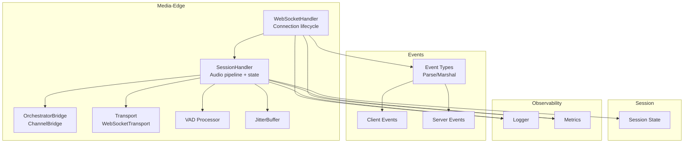
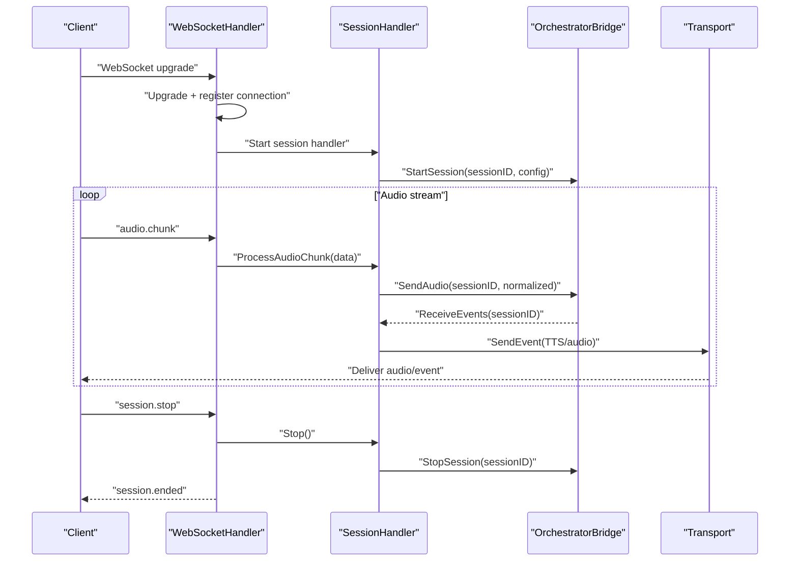
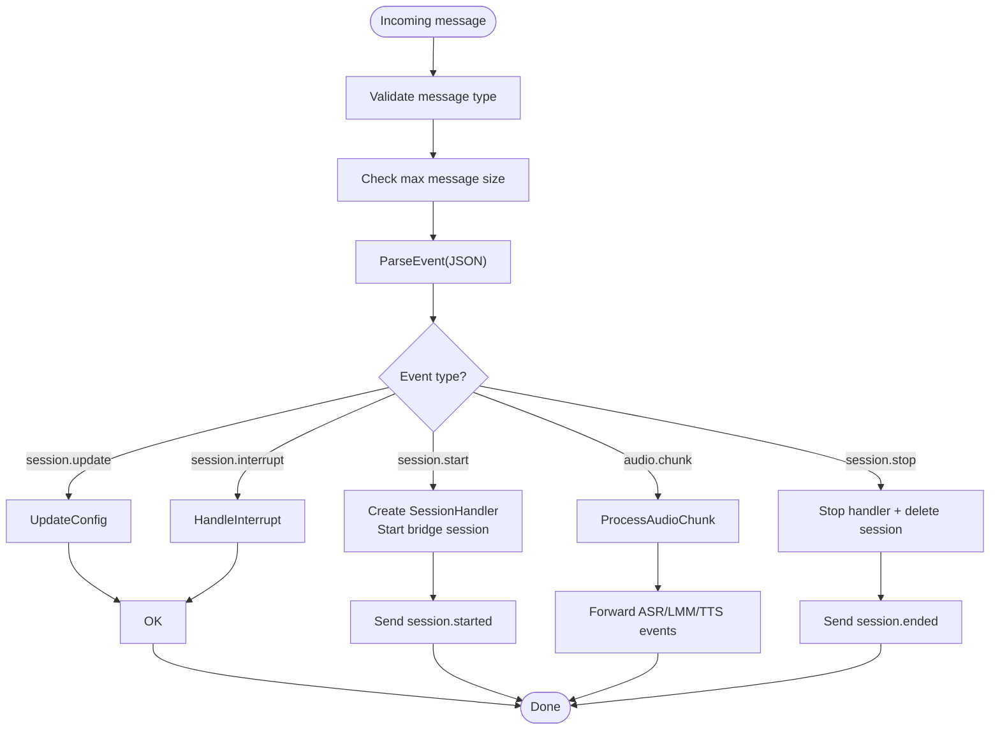
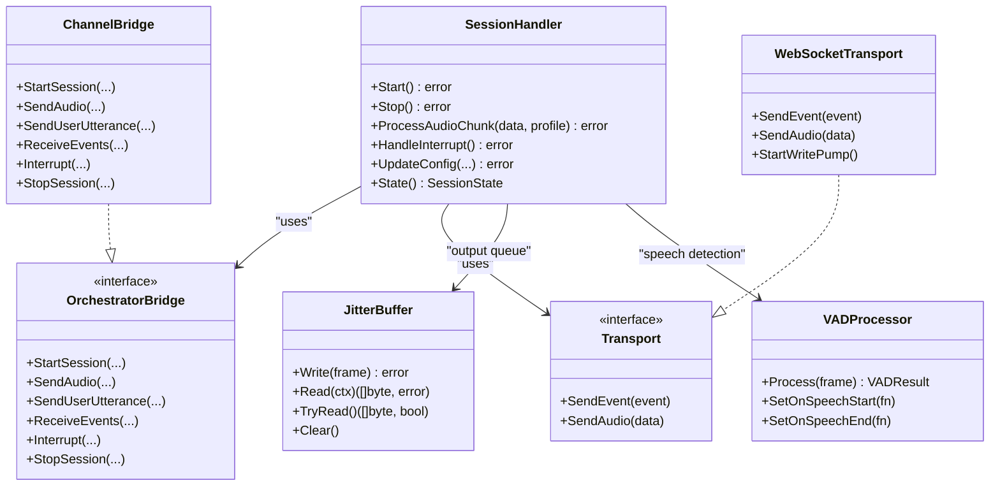
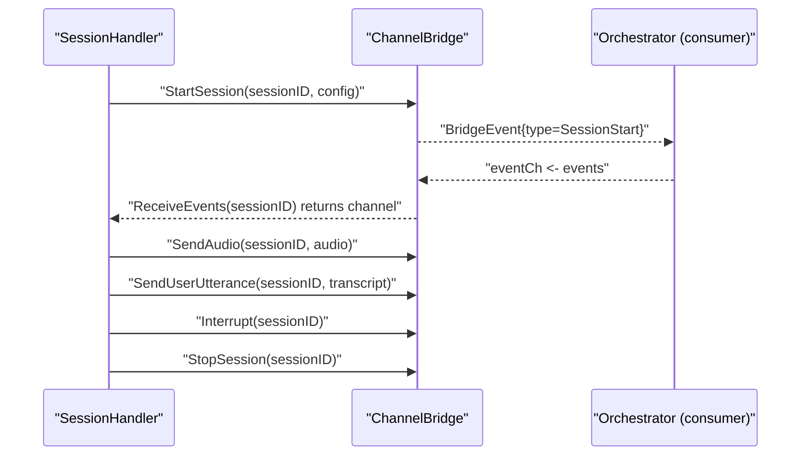
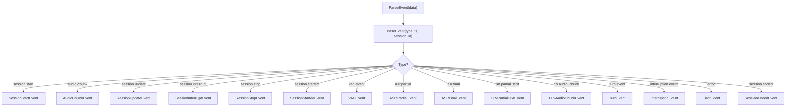
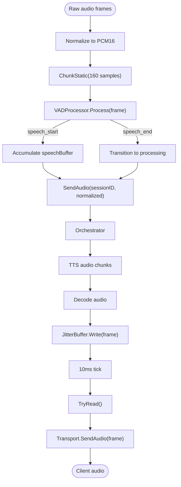
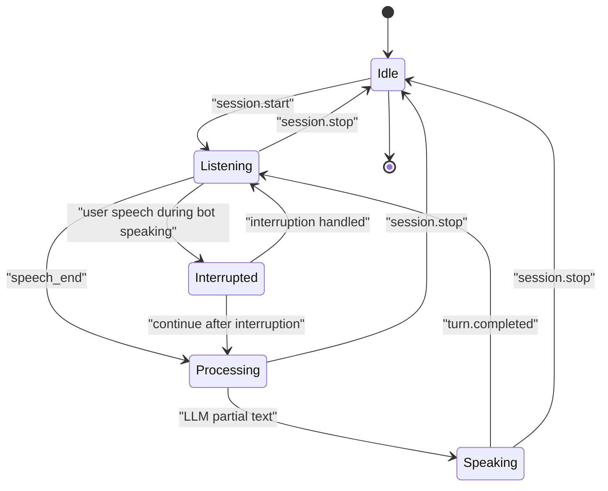
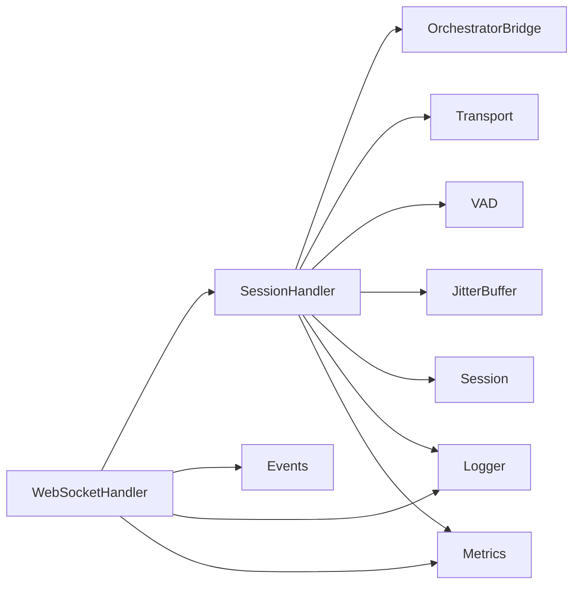

# WebSocket Event Handling

<cite>
**Referenced Files in This Document**
- [websocket.go](file://go/media-edge/internal/handler/websocket.go)
- [session_handler.go](file://go/media-edge/internal/handler/session_handler.go)
- [orchestrator_bridge.go](file://go/media-edge/internal/handler/orchestrator_bridge.go)
- [event.go](file://go/pkg/events/event.go)
- [client.go](file://go/pkg/events/client.go)
- [server.go](file://go/pkg/events/server.go)
- [transport.go](file://go/media-edge/internal/transport/transport.go)
- [vad.go](file://go/media-edge/internal/vad/vad.go)
- [buffer.go](file://go/pkg/audio/buffer.go)
- [chunk.go](file://go/pkg/audio/chunk.go)
- [session.go](file://go/pkg/session/session.go)
- [state.go](file://go/pkg/session/state.go)
- [logger.go](file://go/pkg/observability/logger.go)
- [metrics.go](file://go/pkg/observability/metrics.go)
- [main.go](file://go/media-edge/cmd/main.go)
</cite>

## Table of Contents
1. [Introduction](#introduction)
2. [Project Structure](#project-structure)
3. [Core Components](#core-components)
4. [Architecture Overview](#architecture-overview)
5. [Detailed Component Analysis](#detailed-component-analysis)
6. [Dependency Analysis](#dependency-analysis)
7. [Performance Considerations](#performance-considerations)
8. [Troubleshooting Guide](#troubleshooting-guide)
9. [Conclusion](#conclusion)

## Introduction
This document explains the WebSocket event handling architecture powering CloudApp’s real-time audio system. It covers the event-driven message processing pipeline, including event parsing, validation, routing, and execution. It documents the handler architecture with dedicated handlers for session management, audio processing, and control commands, along with error handling, queuing mechanisms, and asynchronous processing patterns. It also details integration with SessionHandler for conversation state and OrchestratorBridge for backend coordination, and provides examples of event processing workflows, failure recovery, and performance monitoring.

## Project Structure
The WebSocket event handling spans several packages:
- Media-edge handler: WebSocket upgrade, connection lifecycle, event routing, and transport abstraction
- Events: Strongly typed event models for client-server communication
- Session: Conversation state and session metadata
- Audio utilities: Buffers, chunking, and VAD
- Observability: Logging and metrics
- Orchestrator bridge: In-process bridge to coordinate with backend services

**Diagram sources**
- [websocket.go:22-92](file://go/media-edge/internal/handler/websocket.go#L22-L92)
- [session_handler.go:17-117](file://go/media-edge/internal/handler/session_handler.go#L17-L117)
- [orchestrator_bridge.go:13-58](file://go/media-edge/internal/handler/orchestrator_bridge.go#L13-L58)
- [transport.go:16-80](file://go/media-edge/internal/transport/transport.go#L16-L80)
- [vad.go:68-103](file://go/media-edge/internal/vad/vad.go#L68-L103)
- [buffer.go:16-37](file://go/pkg/audio/buffer.go#L16-L37)
- [event.go:11-185](file://go/pkg/events/event.go#L11-L185)
- [client.go:3-113](file://go/pkg/events/client.go#L3-L113)
- [server.go:7-178](file://go/pkg/events/server.go#L7-L178)
- [session.go:62-84](file://go/pkg/session/session.go#L62-L84)
- [logger.go:13-59](file://go/pkg/observability/logger.go#L13-L59)
- [metrics.go:10-82](file://go/pkg/observability/metrics.go#L10-L82)

**Section sources**
- [websocket.go:1-129](file://go/media-edge/internal/handler/websocket.go#L1-L129)
- [event.go:1-185](file://go/pkg/events/event.go#L1-L185)
- [session_handler.go:1-117](file://go/media-edge/internal/handler/session_handler.go#L1-L117)
- [transport.go:1-80](file://go/media-edge/internal/transport/transport.go#L1-L80)
- [vad.go:1-103](file://go/media-edge/internal/vad/vad.go#L1-L103)
- [buffer.go:1-37](file://go/pkg/audio/buffer.go#L1-L37)
- [session.go:1-84](file://go/pkg/session/session.go#L1-L84)
- [logger.go:1-59](file://go/pkg/observability/logger.go#L1-L59)
- [metrics.go:1-82](file://go/pkg/observability/metrics.go#L1-L82)

## Core Components
- WebSocketHandler: Manages WebSocket upgrade, connection lifecycle, read/write pumps, and routes parsed events to session-specific handlers.
- SessionHandler: Owns the audio pipeline, VAD, buffers, and orchestrator integration; maintains session state and forwards events to the client.
- OrchestratorBridge: Defines the interface for backend coordination; ChannelBridge implements in-process communication for MVP.
- Transport: Abstraction for sending events and audio frames to the client; WebSocketTransport implements the transport for WebSocket.
- VAD: Energy-based voice activity detection with state transitions and callbacks.
- JitterBuffer: Thread-safe audio queue with backpressure and notifications.
- Events: Strongly typed event models for client and server, with parsing and marshalling helpers.
- Session: Conversation state, runtime flags, and metadata.
- Observability: Structured logging and Prometheus metrics.

**Section sources**
- [websocket.go:22-92](file://go/media-edge/internal/handler/websocket.go#L22-L92)
- [session_handler.go:17-117](file://go/media-edge/internal/handler/session_handler.go#L17-L117)
- [orchestrator_bridge.go:13-58](file://go/media-edge/internal/handler/orchestrator_bridge.go#L13-L58)
- [transport.go:16-80](file://go/media-edge/internal/transport/transport.go#L16-L80)
- [vad.go:68-103](file://go/media-edge/internal/vad/vad.go#L68-L103)
- [buffer.go:16-37](file://go/pkg/audio/buffer.go#L16-L37)
- [event.go:11-185](file://go/pkg/events/event.go#L11-L185)
- [session.go:62-84](file://go/pkg/session/session.go#L62-L84)
- [logger.go:13-59](file://go/pkg/observability/logger.go#L13-L59)
- [metrics.go:10-82](file://go/pkg/observability/metrics.go#L10-L82)

## Architecture Overview
The system is event-driven. Incoming WebSocket messages are parsed into typed events, routed by WebSocketHandler to SessionHandler, which executes audio processing, VAD detection, and orchestrator coordination. Outbound events and audio are delivered via Transport to the client. Observability integrates logging and metrics across components.

**Diagram sources**
- [websocket.go:95-129](file://go/media-edge/internal/handler/websocket.go#L95-L129)
- [websocket.go:260-374](file://go/media-edge/internal/handler/websocket.go#L260-L374)
- [session_handler.go:119-147](file://go/media-edge/internal/handler/session_handler.go#L119-L147)
- [session_handler.go:176-225](file://go/media-edge/internal/handler/session_handler.go#L176-L225)
- [orchestrator_bridge.go:98-134](file://go/media-edge/internal/handler/orchestrator_bridge.go#L98-L134)
- [transport.go:82-95](file://go/media-edge/internal/transport/transport.go#L82-L95)

## Detailed Component Analysis

### WebSocketHandler: Connection Lifecycle and Event Routing
- Connection lifecycle: Upgrade, ping/pong handling, read deadlines, write pump, and cleanup.
- Event routing: Parses JSON events, validates message type and size, and dispatches to session-specific handlers.
- Session management: Creates SessionHandler on session.start, wires transport, and coordinates with OrchestratorBridge.
- Error handling: On parse or handler errors, sends error events to the client and logs warnings.

**Diagram sources**
- [websocket.go:221-258](file://go/media-edge/internal/handler/websocket.go#L221-L258)
- [websocket.go:260-374](file://go/media-edge/internal/handler/websocket.go#L260-L374)
- [websocket.go:376-405](file://go/media-edge/internal/handler/websocket.go#L376-L405)
- [websocket.go:407-425](file://go/media-edge/internal/handler/websocket.go#L407-L425)
- [websocket.go:427-445](file://go/media-edge/internal/handler/websocket.go#L427-L445)
- [websocket.go:447-481](file://go/media-edge/internal/handler/websocket.go#L447-L481)

**Section sources**
- [websocket.go:94-192](file://go/media-edge/internal/handler/websocket.go#L94-L192)
- [websocket.go:221-258](file://go/media-edge/internal/handler/websocket.go#L221-L258)
- [websocket.go:260-374](file://go/media-edge/internal/handler/websocket.go#L260-L374)
- [websocket.go:376-481](file://go/media-edge/internal/handler/websocket.go#L376-L481)

### SessionHandler: Audio Pipeline, State, and Orchestrator Coordination
- Audio pipeline: Normalization, chunking, VAD, speech accumulation, and playout tracking.
- Orchestrator integration: Receives events, forwards to client, sends user utterances, and handles interruptions.
- State management: Enforces state transitions and tracks bot speaking/interrupted flags.
- Output delivery: Uses JitterBuffer and Transport to deliver audio frames at 10ms intervals.

**Diagram sources**
- [session_handler.go:17-117](file://go/media-edge/internal/handler/session_handler.go#L17-L117)
- [orchestrator_bridge.go:13-58](file://go/media-edge/internal/handler/orchestrator_bridge.go#L13-L58)
- [orchestrator_bridge.go:45-134](file://go/media-edge/internal/handler/orchestrator_bridge.go#L45-L134)
- [transport.go:16-80](file://go/media-edge/internal/transport/transport.go#L16-L80)
- [transport.go:44-80](file://go/media-edge/internal/transport/transport.go#L44-L80)
- [buffer.go:16-37](file://go/pkg/audio/buffer.go#L16-L37)
- [vad.go:305-345](file://go/media-edge/internal/vad/vad.go#L305-L345)

**Section sources**
- [session_handler.go:119-174](file://go/media-edge/internal/handler/session_handler.go#L119-L174)
- [session_handler.go:176-225](file://go/media-edge/internal/handler/session_handler.go#L176-L225)
- [session_handler.go:316-403](file://go/media-edge/internal/handler/session_handler.go#L316-L403)
- [session_handler.go:405-432](file://go/media-edge/internal/handler/session_handler.go#L405-L432)
- [session_handler.go:462-473](file://go/media-edge/internal/handler/session_handler.go#L462-L473)
- [session_handler.go:475-515](file://go/media-edge/internal/handler/session_handler.go#L475-L515)

### OrchestratorBridge: In-Process Coordination
- Interface defines session lifecycle and event streaming to/from orchestrator.
- ChannelBridge implements in-process channels for MVP; supports session channels, event forwarding, and backpressure handling.

**Diagram sources**
- [orchestrator_bridge.go:13-58](file://go/media-edge/internal/handler/orchestrator_bridge.go#L13-L58)
- [orchestrator_bridge.go:98-134](file://go/media-edge/internal/handler/orchestrator_bridge.go#L98-L134)
- [orchestrator_bridge.go:202-213](file://go/media-edge/internal/handler/orchestrator_bridge.go#L202-L213)
- [orchestrator_bridge.go:136-175](file://go/media-edge/internal/handler/orchestrator_bridge.go#L136-L175)
- [orchestrator_bridge.go:177-200](file://go/media-edge/internal/handler/orchestrator_bridge.go#L177-L200)
- [orchestrator_bridge.go:215-240](file://go/media-edge/internal/handler/orchestrator_bridge.go#L215-L240)
- [orchestrator_bridge.go:242-267](file://go/media-edge/internal/handler/orchestrator_bridge.go#L242-L267)

**Section sources**
- [orchestrator_bridge.go:13-58](file://go/media-edge/internal/handler/orchestrator_bridge.go#L13-L58)
- [orchestrator_bridge.go:98-134](file://go/media-edge/internal/handler/orchestrator_bridge.go#L98-L134)
- [orchestrator_bridge.go:136-175](file://go/media-edge/internal/handler/orchestrator_bridge.go#L136-L175)
- [orchestrator_bridge.go:177-200](file://go/media-edge/internal/handler/orchestrator_bridge.go#L177-L200)
- [orchestrator_bridge.go:202-213](file://go/media-edge/internal/handler/orchestrator_bridge.go#L202-L213)
- [orchestrator_bridge.go:215-240](file://go/media-edge/internal/handler/orchestrator_bridge.go#L215-L240)
- [orchestrator_bridge.go:242-267](file://go/media-edge/internal/handler/orchestrator_bridge.go#L242-L267)

### Events: Parsing, Validation, and Delivery
- Event parsing: ParseEvent inspects the base event type and unmarshals into the correct concrete type.
- Client events: session.start, audio.chunk, session.update, session.interrupt, session.stop.
- Server events: session.started, vad.event, asr.partial/final, llm.partial_text, tts.audio_chunk, turn.event, interruption.event, error, session.ended.
- Transport: Transport.SendEvent marshals and queues JSON events; Transport.SendAudio writes binary audio.

**Diagram sources**
- [event.go:80-185](file://go/pkg/events/event.go#L80-L185)
- [client.go:3-113](file://go/pkg/events/client.go#L3-L113)
- [server.go:7-178](file://go/pkg/events/server.go#L7-L178)
- [transport.go:82-95](file://go/media-edge/internal/transport/transport.go#L82-L95)

**Section sources**
- [event.go:80-185](file://go/pkg/events/event.go#L80-L185)
- [client.go:3-113](file://go/pkg/events/client.go#L3-L113)
- [server.go:7-178](file://go/pkg/events/server.go#L7-L178)
- [transport.go:82-95](file://go/media-edge/internal/transport/transport.go#L82-L95)

### Audio Processing: VAD, Chunking, and Jitter Buffering
- VAD: Energy-based detector with configurable thresholds and hangover; state machine transitions trigger callbacks.
- Chunking: Fixed-frame splitting for consistent processing windows.
- JitterBuffer: Thread-safe queue with backpressure, notifications, and timeouts; used for output audio delivery.

**Diagram sources**
- [session_handler.go:176-225](file://go/media-edge/internal/handler/session_handler.go#L176-L225)
- [vad.go:105-197](file://go/media-edge/internal/vad/vad.go#L105-L197)
- [chunk.go:76-101](file://go/pkg/audio/chunk.go#L76-L101)
- [buffer.go:39-110](file://go/pkg/audio/buffer.go#L39-L110)
- [session_handler.go:405-432](file://go/media-edge/internal/handler/session_handler.go#L405-L432)

**Section sources**
- [vad.go:105-197](file://go/media-edge/internal/vad/vad.go#L105-L197)
- [chunk.go:76-101](file://go/pkg/audio/chunk.go#L76-L101)
- [buffer.go:39-110](file://go/pkg/audio/buffer.go#L39-L110)
- [session_handler.go:405-432](file://go/media-edge/internal/handler/session_handler.go#L405-L432)

### Session State Management and Turn Tracking
- Session state machine enforces valid transitions among idle, listening, processing, speaking, and interrupted.
- SessionHandler updates runtime flags (botSpeaking, interrupted) and forwards turn events to the client.
- PlayoutTracker advances position as frames are delivered; used for interruption and turn completion signaling.

**Diagram sources**
- [state.go:8-76](file://go/pkg/session/state.go#L8-L76)
- [session_handler.go:279-314](file://go/media-edge/internal/handler/session_handler.go#L279-L314)
- [session_handler.go:379-391](file://go/media-edge/internal/handler/session_handler.go#L379-L391)

**Section sources**
- [state.go:8-76](file://go/pkg/session/state.go#L8-L76)
- [session_handler.go:279-314](file://go/media-edge/internal/handler/session_handler.go#L279-L314)
- [session_handler.go:379-391](file://go/media-edge/internal/handler/session_handler.go#L379-L391)

### Transport and Connection Handling
- WebSocketTransport abstracts sending JSON events and binary audio; uses a write pump with ping/pong and backpressure.
- WebSocketHandler manages read deadlines, pong handling, and write pump concurrency; maintains connection registry and metrics.

**Section sources**
- [transport.go:82-161](file://go/media-edge/internal/transport/transport.go#L82-L161)
- [websocket.go:131-192](file://go/media-edge/internal/handler/websocket.go#L131-L192)
- [websocket.go:194-218](file://go/media-edge/internal/handler/websocket.go#L194-L218)

### Observability: Logging and Metrics
- Logger provides structured logging with session and trace context.
- Metrics expose gauges and histograms for sessions, turns, latency, and provider performance.

**Section sources**
- [logger.go:85-123](file://go/pkg/observability/logger.go#L85-L123)
- [metrics.go:10-82](file://go/pkg/observability/metrics.go#L10-L82)
- [websocket.go:122-125](file://go/media-edge/internal/handler/websocket.go#L122-L125)
- [session_handler.go:141-142](file://go/media-edge/internal/handler/session_handler.go#L141-L142)

## Dependency Analysis
The following diagram highlights key dependencies and coupling:

**Diagram sources**
- [websocket.go:22-92](file://go/media-edge/internal/handler/websocket.go#L22-L92)
- [session_handler.go:17-117](file://go/media-edge/internal/handler/session_handler.go#L17-L117)
- [orchestrator_bridge.go:13-58](file://go/media-edge/internal/handler/orchestrator_bridge.go#L13-L58)
- [transport.go:16-80](file://go/media-edge/internal/transport/transport.go#L16-L80)
- [vad.go:68-103](file://go/media-edge/internal/vad/vad.go#L68-L103)
- [buffer.go:16-37](file://go/pkg/audio/buffer.go#L16-L37)
- [session.go:62-84](file://go/pkg/session/session.go#L62-L84)
- [logger.go:13-59](file://go/pkg/observability/logger.go#L13-L59)
- [metrics.go:10-82](file://go/pkg/observability/metrics.go#L10-L82)

**Section sources**
- [websocket.go:22-92](file://go/media-edge/internal/handler/websocket.go#L22-L92)
- [session_handler.go:17-117](file://go/media-edge/internal/handler/session_handler.go#L17-L117)
- [orchestrator_bridge.go:13-58](file://go/media-edge/internal/handler/orchestrator_bridge.go#L13-L58)
- [transport.go:16-80](file://go/media-edge/internal/transport/transport.go#L16-L80)
- [vad.go:68-103](file://go/media-edge/internal/vad/vad.go#L68-L103)
- [buffer.go:16-37](file://go/pkg/audio/buffer.go#L16-L37)
- [session.go:62-84](file://go/pkg/session/session.go#L62-L84)
- [logger.go:13-59](file://go/pkg/observability/logger.go#L13-L59)
- [metrics.go:10-82](file://go/pkg/observability/metrics.go#L10-L82)

## Performance Considerations
- Backpressure and buffering: JitterBuffer prevents overrun; ChannelBridge drops oldest items on overflow; Transport write pump drops messages on full channel.
- Latency: 10ms tick for audio output; VAD uses 10ms frames; metrics track ASR/LLM/TTS latencies and end-to-end TTFA.
- Concurrency: Goroutines for read loop, write pump, event processing, and audio output; mutex-protected state and buffers.
- Throughput: Max message size limits and chunk sizes prevent oversized payloads; ping/pong keep-alive avoids stale connections.

[No sources needed since this section provides general guidance]

## Troubleshooting Guide
Common issues and recovery steps:
- Unsupported message type or oversized payload: WebSocketHandler rejects and logs; client should resend properly formatted text JSON.
- Unknown event type: Parser error; ensure client uses supported event names.
- No active session: Handlers return “no active session” when processing audio/update/interrupt; client must start a session first.
- Session already started: Prevents duplicate session creation; client should reuse session ID or stop previous session.
- Transport/channel full: Transport drops messages; reduce event frequency or increase buffer sizes.
- Orchestrator errors: SessionHandler forwards error events; inspect logs and metrics for provider errors.
- Connection cleanup: On unexpected close or errors, cleanup path cancels contexts, closes handlers, and deletes sessions.

**Section sources**
- [websocket.go:221-236](file://go/media-edge/internal/handler/websocket.go#L221-L236)
- [websocket.go:265-267](file://go/media-edge/internal/handler/websocket.go#L265-L267)
- [websocket.go:382-384](file://go/media-edge/internal/handler/websocket.go#L382-L384)
- [transport.go:106-115](file://go/media-edge/internal/transport/transport.go#L106-L115)
- [session_handler.go:392-398](file://go/media-edge/internal/handler/session_handler.go#L392-L398)
- [websocket.go:500-536](file://go/media-edge/internal/handler/websocket.go#L500-L536)

## Conclusion
CloudApp’s WebSocket event handling architecture is designed around a robust, event-driven pipeline with clear separation of concerns. WebSocketHandler manages connections and routes events; SessionHandler orchestrates audio processing, VAD, and state transitions; OrchestratorBridge coordinates with backend services; Transport abstracts client delivery; and Observability ensures visibility. The system employs buffering, backpressure, and structured logging/metrics to maintain reliability and performance under real-time audio workloads.