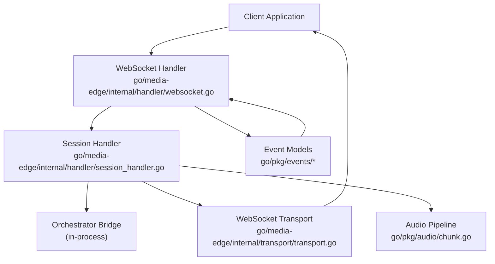
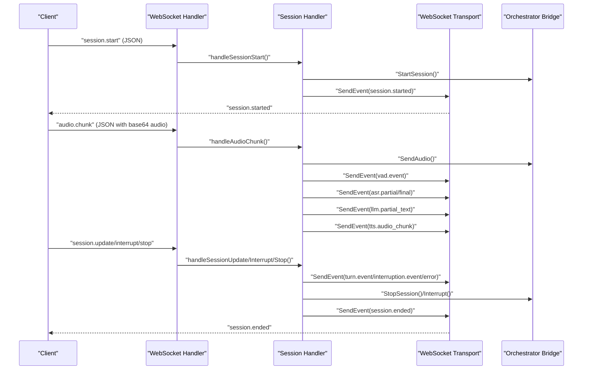
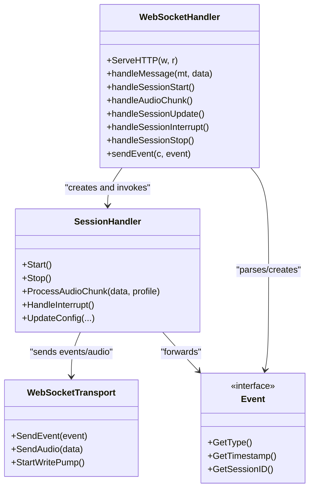

# WebSocket Message Formats

<cite>
**Referenced Files in This Document**
- [websocket-api.md](file://docs/websocket-api.md)
- [websocket.go](file://go/media-edge/internal/handler/websocket.go)
- [session_handler.go](file://go/media-edge/internal/handler/session_handler.go)
- [transport.go](file://go/media-edge/internal/transport/transport.go)
- [event.go](file://go/pkg/events/event.go)
- [client.go](file://go/pkg/events/client.go)
- [server.go](file://go/pkg/events/server.go)
- [chunk.go](file://go/pkg/audio/chunk.go)
- [config.go](file://go/pkg/config/config.go)
- [main.go](file://go/media-edge/cmd/main.go)
</cite>

## Table of Contents
1. [Introduction](#introduction)
2. [Project Structure](#project-structure)
3. [Core Components](#core-components)
4. [Architecture Overview](#architecture-overview)
5. [Detailed Component Analysis](#detailed-component-analysis)
6. [Dependency Analysis](#dependency-analysis)
7. [Performance Considerations](#performance-considerations)
8. [Troubleshooting Guide](#troubleshooting-guide)
9. [Conclusion](#conclusion)

## Introduction
This document specifies the WebSocket message formats used by CloudApp’s real-time audio streaming system. It covers the JSON event structure for session.start, audio.chunk, session.update, session.interrupt, and session.stop, along with the bidirectional message flow between clients and the Media-Edge service. It also documents audio data encoding, metadata transmission, validation rules, error handling, protocol compliance, ordering guarantees, duplicate detection, and recovery strategies.

## Project Structure
The WebSocket API is defined in documentation and implemented in Go modules:
- Client-to-server events are parsed and routed in the WebSocket handler.
- The session handler orchestrates audio processing, VAD, and integration with the orchestration bridge.
- Transport abstraction handles WebSocket message framing and delivery.
- Event models define the JSON schema for all messages.
- Configuration governs limits, timeouts, and security.

**Diagram sources**
- [websocket.go:95-192](file://go/media-edge/internal/handler/websocket.go#L95-L192)
- [session_handler.go:119-147](file://go/media-edge/internal/handler/session_handler.go#L119-L147)
- [transport.go:44-161](file://go/media-edge/internal/transport/transport.go#L44-L161)
- [event.go:80-185](file://go/pkg/events/event.go#L80-L185)
- [chunk.go:7-101](file://go/pkg/audio/chunk.go#L7-L101)

**Section sources**
- [websocket-api.md:1-622](file://docs/websocket-api.md#L1-L622)
- [websocket.go:1-592](file://go/media-edge/internal/handler/websocket.go#L1-L592)
- [session_handler.go:1-540](file://go/media-edge/internal/handler/session_handler.go#L1-L540)
- [transport.go:1-332](file://go/media-edge/internal/transport/transport.go#L1-L332)
- [event.go:1-210](file://go/pkg/events/event.go#L1-L210)
- [chunk.go:1-230](file://go/pkg/audio/chunk.go#L1-L230)

## Core Components
- WebSocket handler: Upgrades HTTP to WebSocket, validates origin, enforces message size limits, parses JSON events, and routes to session handler.
- Session handler: Manages audio pipeline, VAD, interruption, and event forwarding to client via transport.
- Transport: Encapsulates WebSocket message framing (text JSON vs. binary audio), write pump, ping/pong, deadlines, and close semantics.
- Event models: Strongly typed structs for client and server events, with JSON marshaling/unmarshaling and base event fields.
- Audio pipeline: Normalization, chunking, jitter buffering, and playout tracking for reliable audio delivery.

**Section sources**
- [websocket.go:220-258](file://go/media-edge/internal/handler/websocket.go#L220-L258)
- [session_handler.go:17-117](file://go/media-edge/internal/handler/session_handler.go#L17-L117)
- [transport.go:16-42](file://go/media-edge/internal/transport/transport.go#L16-L42)
- [event.go:37-78](file://go/pkg/events/event.go#L37-L78)
- [chunk.go:7-101](file://go/pkg/audio/chunk.go#L7-L101)

## Architecture Overview
The Media-Edge service exposes a WebSocket endpoint. Clients send control and audio messages; the server responds with status, VAD events, ASR/LMM/TTS outputs, and session lifecycle notifications.

**Diagram sources**
- [websocket.go:260-374](file://go/media-edge/internal/handler/websocket.go#L260-L374)
- [websocket.go:376-481](file://go/media-edge/internal/handler/websocket.go#L376-L481)
- [session_handler.go:316-403](file://go/media-edge/internal/handler/session_handler.go#L316-L403)
- [transport.go:82-95](file://go/media-edge/internal/transport/transport.go#L82-L95)
- [server.go:7-23](file://go/pkg/events/server.go#L7-L23)

## Detailed Component Analysis

### Client-to-Server Events

#### session.start
- Purpose: Initiate a new voice session with audio, voice, provider, and model configuration.
- Required fields:
  - type: "session.start"
  - audio_profile: sample_rate, channels, encoding
- Optional fields:
  - voice_profile, system_prompt, model_options, providers, tenant_id, timestamp
- Validation:
  - audio_profile.encoding must be one of pcm16, opus, g711_ulaw, g711_alaw.
  - audio_profile.sample_rate and channels must match client hardware expectations.
- Behavior:
  - Generates session_id if omitted.
  - Creates session state, persists to store, starts session handler, and bridges to orchestrator.
  - Responds with session.started.

**Section sources**
- [websocket-api.md:26-61](file://docs/websocket-api.md#L26-L61)
- [client.go:3-19](file://go/pkg/events/client.go#L3-L19)
- [websocket.go:260-374](file://go/media-edge/internal/handler/websocket.go#L260-L374)
- [server.go:7-23](file://go/pkg/events/server.go#L7-L23)

#### audio.chunk
- Purpose: Stream client audio to the server.
- Required fields:
  - type: "audio.chunk"
  - session_id
  - audio_data (base64-encoded PCM16)
- Optional fields:
  - is_final, timestamp
- Audio format:
  - PCM16, signed 16-bit little-endian.
  - Must match audio_profile from session.start.
  - Recommended chunk size: 10–100 ms (e.g., 160–1600 samples at 16 kHz).
- Processing:
  - Decoded from base64, normalized, chunked into 10 ms frames, passed to VAD and orchestrator.

**Section sources**
- [websocket-api.md:87-118](file://docs/websocket-api.md#L87-L118)
- [client.go:52-71](file://go/pkg/events/client.go#L52-L71)
- [websocket.go:376-405](file://go/media-edge/internal/handler/websocket.go#L376-L405)
- [session_handler.go:176-225](file://go/media-edge/internal/handler/session_handler.go#L176-L225)
- [chunk.go:76-101](file://go/pkg/audio/chunk.go#L76-L101)

#### session.update
- Purpose: Dynamically update session configuration mid-conversation.
- Fields:
  - type: "session.update"
  - session_id
  - system_prompt, voice_profile, model_options, providers (all optional)
- Behavior:
  - Updates runtime configuration in session state and propagates to orchestrator.

**Section sources**
- [websocket-api.md:119-140](file://docs/websocket-api.md#L119-L140)
- [client.go:72-86](file://go/pkg/events/client.go#L72-L86)
- [websocket.go:407-425](file://go/media-edge/internal/handler/websocket.go#L407-L425)
- [session_handler.go:475-515](file://go/media-edge/internal/handler/session_handler.go#L475-L515)

#### session.interrupt
- Purpose: Manually interrupt the current assistant response.
- Fields:
  - type: "session.interrupt"
  - session_id
  - reason (optional)
- Behavior:
  - Triggers interruption in the audio pipeline and orchestrator.
  - Emits interruption.event to client.

**Section sources**
- [websocket-api.md:154-166](file://docs/websocket-api.md#L154-L166)
- [client.go:88-99](file://go/pkg/events/client.go#L88-L99)
- [websocket.go:427-445](file://go/media-edge/internal/handler/websocket.go#L427-L445)
- [session_handler.go:279-314](file://go/media-edge/internal/handler/session_handler.go#L279-L314)

#### session.stop
- Purpose: End the session.
- Fields:
  - type: "session.stop"
  - session_id
  - reason (optional)
- Behavior:
  - Stops session handler, deletes session from store, and sends session.ended.

**Section sources**
- [websocket-api.md:176-187](file://docs/websocket-api.md#L176-L187)
- [client.go:101-112](file://go/pkg/events/client.go#L101-L112)
- [websocket.go:447-481](file://go/media-edge/internal/handler/websocket.go#L447-L481)
- [server.go:164-177](file://go/pkg/events/server.go#L164-L177)

### Server-to-Client Events

#### session.started
- Emitted after successful session.start.
- Includes audio_profile and server_time.

**Section sources**
- [websocket-api.md:200-216](file://docs/websocket-api.md#L200-L216)
- [server.go:7-23](file://go/pkg/events/server.go#L7-L23)
- [websocket.go:367-370](file://go/media-edge/internal/handler/websocket.go#L367-L370)

#### vad.event
- Speech activity detection events.
- Values: speech_start, speech_end with optional confidence and position (ms).

**Section sources**
- [websocket-api.md:218-242](file://docs/websocket-api.md#L218-L242)
- [server.go:25-39](file://go/pkg/events/server.go#L25-L39)
- [session_handler.go:227-265](file://go/media-edge/internal/handler/session_handler.go#L227-L265)

#### asr.partial and asr.final
- Partial and final transcription results with optional language and confidence.
- Final may include word_timestamps.

**Section sources**
- [websocket-api.md:248-285](file://docs/websocket-api.md#L248-L285)
- [server.go:41-72](file://go/pkg/events/server.go#L41-L72)
- [session_handler.go:334-353](file://go/media-edge/internal/handler/session_handler.go#L334-L353)

#### llm.partial_text
- Streaming assistant text with is_complete flag.

**Section sources**
- [websocket-api.md:287-309](file://docs/websocket-api.md#L287-L309)
- [server.go:74-87](file://go/pkg/events/server.go#L74-L87)
- [session_handler.go:354-364](file://go/media-edge/internal/handler/session_handler.go#L354-L364)

#### tts.audio_chunk
- Base64-encoded PCM16 audio chunks with segment_index and is_final.

**Section sources**
- [websocket-api.md:311-335](file://docs/websocket-api.md#L311-L335)
- [server.go:89-110](file://go/pkg/events/server.go#L89-L110)
- [session_handler.go:366-378](file://go/media-edge/internal/handler/session_handler.go#L366-L378)

#### turn.event
- Turn state transitions: assistant started/completed/cancelled.

**Section sources**
- [websocket-api.md:345-369](file://docs/websocket-api.md#L345-L369)
- [server.go:112-129](file://go/pkg/events/server.go#L112-L129)
- [session_handler.go:379-390](file://go/media-edge/internal/handler/session_handler.go#L379-L390)

#### interruption.event
- Indicates interruption occurred with reason, spoken_text, unspoken_text, and playout_position_ms.

**Section sources**
- [websocket-api.md:376-390](file://docs/websocket-api.md#L376-L390)
- [server.go:130-145](file://go/pkg/events/server.go#L130-L145)
- [session_handler.go:279-314](file://go/media-edge/internal/handler/session_handler.go#L279-L314)

#### error
- Error event with code, message, and optional details.

**Section sources**
- [websocket-api.md:401-415](file://docs/websocket-api.md#L401-L415)
- [server.go:147-162](file://go/pkg/events/server.go#L147-L162)
- [websocket.go:183-189](file://go/media-edge/internal/handler/websocket.go#L183-L189)

#### session.ended
- Sent when a session ends with reason and duration_ms.

**Section sources**
- [websocket-api.md:430-442](file://docs/websocket-api.md#L430-L442)
- [server.go:164-177](file://go/pkg/events/server.go#L164-L177)
- [websocket.go:471-474](file://go/media-edge/internal/handler/websocket.go#L471-L474)

### Message Validation Rules and Protocol Compliance
- Message types:
  - Client -> Server: session.start, audio.chunk, session.update, session.interrupt, session.stop.
  - Server -> Client: session.started, vad.event, asr.partial, asr.final, llm.partial_text, tts.audio_chunk, turn.event, interruption.event, error, session.ended.
- JSON format:
  - All messages are JSON with a type field.
  - Audio fields are base64-encoded strings for textual JSON messages.
- Size limits:
  - Max message size enforced by configuration.
- Origin and auth:
  - Allowed origins validated during upgrade.
  - Optional Authorization header support per configuration.
- Timeouts:
  - Read/write timeouts applied to WebSocket reads/writes.
- Ping/Pong:
  - Periodic ping/pong keepalive with read deadline extension on pong.

**Section sources**
- [websocket-api.md:20-22](file://docs/websocket-api.md#L20-L22)
- [websocket.go:67-84](file://go/media-edge/internal/handler/websocket.go#L67-L84)
- [websocket.go:135-145](file://go/media-edge/internal/handler/websocket.go#L135-L145)
- [config.go:87-94](file://go/pkg/config/config.go#L87-L94)
- [config.go:237-249](file://go/pkg/config/config.go#L237-L249)

### Audio Data Encoding and Metadata Transmission
- Encoding:
  - PCM16 (signed 16-bit little-endian) for audio.chunk and tts.audio_chunk.
- Metadata:
  - audio_profile in session.start defines sample_rate, channels, encoding.
  - tts.audio_chunk includes segment_index and is_final.
  - vad.event includes confidence and position (ms).
  - asr.final may include word_timestamps.
- Transport:
  - JSON control messages are text.
  - Binary audio chunks are sent as WebSocket binary frames via transport.

**Section sources**
- [websocket-api.md:113-118](file://docs/websocket-api.md#L113-L118)
- [websocket-api.md:337-344](file://docs/websocket-api.md#L337-L344)
- [websocket-api.md:244-247](file://docs/websocket-api.md#L244-L247)
- [websocket-api.md:275-284](file://docs/websocket-api.md#L275-L284)
- [transport.go:92-95](file://go/media-edge/internal/transport/transport.go#L92-L95)

### Message Ordering Guarantees, Duplicate Detection, and Recovery
- Ordering:
  - audio.chunk messages are processed in order; VAD and pipeline stages maintain temporal coherence.
  - tts.audio_chunk includes segment_index to aid client-side reassembly.
- Duplicate detection:
  - No explicit sequence numbering or duplicate suppression is implemented in the referenced code.
  - Clients may implement application-level deduplication if needed.
- Recovery:
  - On errors, the server sends an error event and logs the issue.
  - The session handler attempts graceful shutdown and cleanup.
  - Transport write channel drops messages if full; clients should resend on demand.

**Section sources**
- [websocket-api.md:337-344](file://docs/websocket-api.md#L337-L344)
- [websocket.go:183-189](file://go/media-edge/internal/handler/websocket.go#L183-L189)
- [session_handler.go:366-378](file://go/media-edge/internal/handler/session_handler.go#L366-L378)
- [transport.go:106-116](file://go/media-edge/internal/transport/transport.go#L106-L116)

### Example Payloads
- session.start
  - See [websocket-api.md:30-61](file://docs/websocket-api.md#L30-L61)
- audio.chunk
  - See [websocket-api.md:91-100](file://docs/websocket-api.md#L91-L100)
- session.update
  - See [websocket-api.md:123-140](file://docs/websocket-api.md#L123-L140)
- session.interrupt
  - See [websocket-api.md:158-165](file://docs/websocket-api.md#L158-L165)
- session.stop
  - See [websocket-api.md:180-187](file://docs/websocket-api.md#L180-L187)
- session.started
  - See [websocket-api.md:204-216](file://docs/websocket-api.md#L204-L216)
- vad.event
  - See [websocket-api.md:222-242](file://docs/websocket-api.md#L222-L242)
- asr.partial
  - See [websocket-api.md:252-261](file://docs/websocket-api.md#L252-L261)
- asr.final
  - See [websocket-api.md:267-285](file://docs/websocket-api.md#L267-L285)
- llm.partial_text
  - See [websocket-api.md:291-309](file://docs/websocket-api.md#L291-L309)
- tts.audio_chunk
  - See [websocket-api.md:315-335](file://docs/websocket-api.md#L315-L335)
- turn.event
  - See [websocket-api.md:349-369](file://docs/websocket-api.md#L349-L369)
- interruption.event
  - See [websocket-api.md:380-390](file://docs/websocket-api.md#L380-L390)
- error
  - See [websocket-api.md:405-415](file://docs/websocket-api.md#L405-L415)
- session.ended
  - See [websocket-api.md:434-442](file://docs/websocket-api.md#L434-L442)

## Dependency Analysis

**Diagram sources**
- [websocket.go:220-258](file://go/media-edge/internal/handler/websocket.go#L220-L258)
- [session_handler.go:119-147](file://go/media-edge/internal/handler/session_handler.go#L119-L147)
- [transport.go:82-95](file://go/media-edge/internal/transport/transport.go#L82-L95)
- [event.go:58-78](file://go/pkg/events/event.go#L58-L78)

**Section sources**
- [websocket.go:220-258](file://go/media-edge/internal/handler/websocket.go#L220-L258)
- [session_handler.go:316-403](file://go/media-edge/internal/handler/session_handler.go#L316-L403)
- [transport.go:82-95](file://go/media-edge/internal/transport/transport.go#L82-L95)
- [event.go:80-185](file://go/pkg/events/event.go#L80-L185)

## Performance Considerations
- Audio chunk sizing: 10–100 ms recommended to balance latency and bandwidth.
- Jitter buffers: Input/output buffers mitigate network jitter and device timing variations.
- Write pump: Asynchronous writes with backpressure prevent blocking; oversized messages are rejected.
- Timeouts: Read/write deadlines ensure responsiveness under idle or stalled connections.
- Metrics: Expose connection counts and durations for monitoring.

[No sources needed since this section provides general guidance]

## Troubleshooting Guide
- Connection refused or CORS errors:
  - Verify allowed origins and server host/port configuration.
- Message too large:
  - Reduce payload size or increase max chunk size in configuration.
- Unsupported message type:
  - Ensure only text messages carry JSON events; binary audio must be sent via transport’s binary method.
- Session not found or no active session:
  - Ensure session.start precedes audio.chunk and session.stop follows completion.
- Audio not playing:
  - Confirm audio_profile matches between client and server; verify PCM16 encoding and sample rate.
- Frequent errors:
  - Inspect error events for provider/service issues; check orchestrator bridge connectivity.

**Section sources**
- [websocket.go:227-230](file://go/media-edge/internal/handler/websocket.go#L227-L230)
- [websocket.go:223-225](file://go/media-edge/internal/handler/websocket.go#L223-L225)
- [websocket.go:448-456](file://go/media-edge/internal/handler/websocket.go#L448-L456)
- [transport.go:106-116](file://go/media-edge/internal/transport/transport.go#L106-L116)
- [config.go:237-249](file://go/pkg/config/config.go#L237-L249)

## Conclusion
CloudApp’s WebSocket API defines a robust, extensible protocol for real-time audio streaming. Client messages control session lifecycle and configuration, while server messages deliver audio, transcription, synthesis, and state transitions. The implementation enforces size limits, validates origins, and provides structured error reporting. Clients should align audio encoding and rates with session.start, manage retries for dropped messages, and handle interruption events to support natural conversation flow.