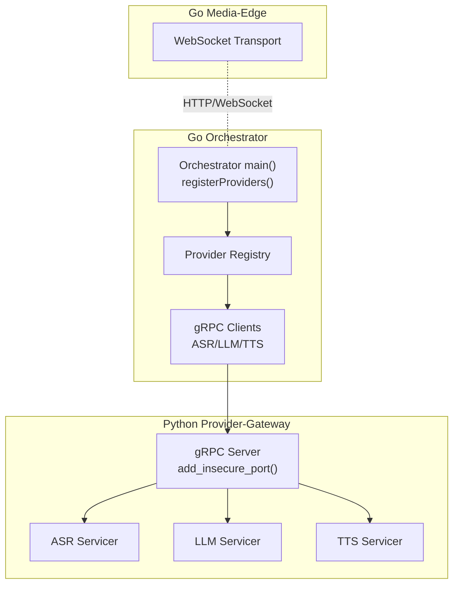
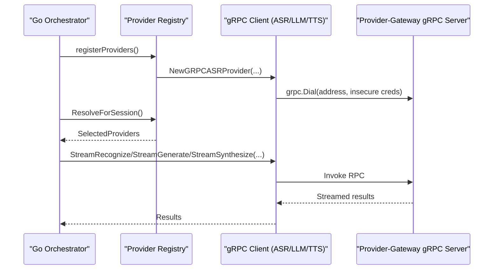
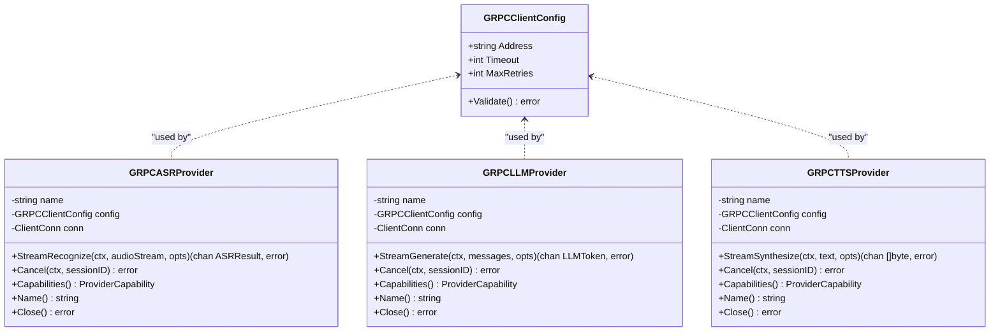
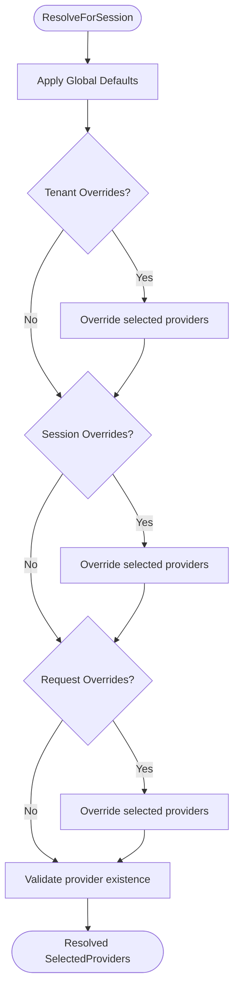
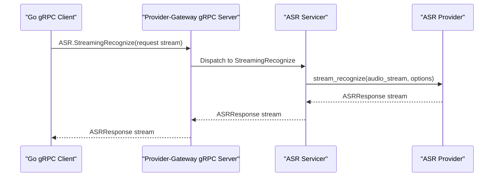
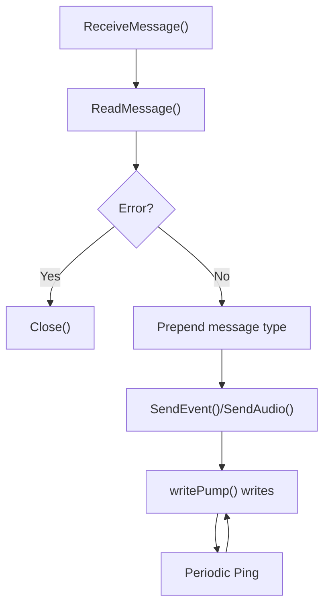
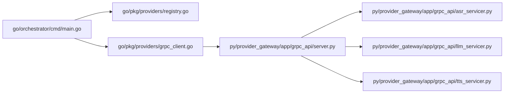

# Connection Management & Security

<cite>
**Referenced Files in This Document**
- [grpc_client.go](file://go/pkg/providers/grpc_client.go)
- [options.go](file://go/pkg/providers/options.go)
- [interfaces.go](file://go/pkg/providers/interfaces.go)
- [registry.go](file://go/pkg/providers/registry.go)
- [server.py](file://py/provider_gateway/app/grpc_api/server.py)
- [asr_servicer.py](file://py/provider_gateway/app/grpc_api/asr_servicer.py)
- [llm_servicer.py](file://py/provider_gateway/app/grpc_api/llm_servicer.py)
- [tts_servicer.py](file://py/provider_gateway/app/grpc_api/tts_servicer.py)
- [main.go](file://go/orchestrator/cmd/main.go)
- [transport.go](file://go/media-edge/internal/transport/transport.go)
- [metrics.go](file://go/pkg/observability/metrics.go)
- [config.go](file://go/pkg/config/config.go)
- [defaults.go](file://go/pkg/config/defaults.go)
- [provider-gateway.yaml](file://infra/k8s/provider-gateway.yaml)
- [config-cloud.yaml](file://examples/config-cloud.yaml)
</cite>

## Table of Contents
1. [Introduction](#introduction)
2. [Project Structure](#project-structure)
3. [Core Components](#core-components)
4. [Architecture Overview](#architecture-overview)
5. [Detailed Component Analysis](#detailed-component-analysis)
6. [Dependency Analysis](#dependency-analysis)
7. [Performance Considerations](#performance-considerations)
8. [Troubleshooting Guide](#troubleshooting-guide)
9. [Conclusion](#conclusion)

## Introduction
This document explains gRPC connection management and security for inter-service communication in the CloudApp system. It covers connection establishment, authentication, TLS configuration, connection pooling, keepalive, recovery, security best practices, monitoring, and troubleshooting. The focus is on the Go orchestrator’s gRPC client configuration and the Python provider-gateway’s gRPC server setup, along with supporting transport and observability components.

## Project Structure
The system comprises:
- Go orchestrator that registers and invokes gRPC providers via a local provider-gateway.
- Python provider-gateway exposing ASR, LLM, and TTS services over gRPC.
- Go media-edge service using WebSocket transport for client connections.
- Observability and configuration layers for metrics, logging, and runtime settings.

**Diagram sources**
- [main.go:195-257](file://go/orchestrator/cmd/main.go#L195-L257)
- [grpc_client.go:14-60](file://go/pkg/providers/grpc_client.go#L14-L60)
- [server.py:54-89](file://py/provider_gateway/app/grpc_api/server.py#L54-L89)
- [asr_servicer.py:42-122](file://py/provider_gateway/app/grpc_api/asr_servicer.py#L42-L122)
- [llm_servicer.py:38-101](file://py/provider_gateway/app/grpc_api/llm_servicer.py#L38-L101)
- [tts_servicer.py:41-100](file://py/provider_gateway/app/grpc_api/tts_servicer.py#L41-L100)
- [transport.go:44-80](file://go/media-edge/internal/transport/transport.go#L44-L80)

**Section sources**
- [main.go:195-257](file://go/orchestrator/cmd/main.go#L195-L257)
- [grpc_client.go:14-60](file://go/pkg/providers/grpc_client.go#L14-L60)
- [server.py:54-89](file://py/provider_gateway/app/grpc_api/server.py#L54-L89)

## Core Components
- gRPC client configuration and lifecycle in Go:
  - GRPCClientConfig defines address, timeout, and retry count.
  - Dial uses insecure transport credentials for MVP.
  - Providers expose streaming methods and cancellation.
- Provider registry:
  - Registers and resolves providers per session with tenant overrides.
- Python provider-gateway:
  - gRPC server binds to an insecure port and exposes ASR/LLM/TTS services.
  - Servicers handle streaming RPCs and session cancellation.
- Transport:
  - WebSocket transport for media-edge client connections with write pump and ping intervals.
- Observability:
  - Metrics for provider latency and throughput; gauges for active sessions and connections.

**Section sources**
- [grpc_client.go:14-60](file://go/pkg/providers/grpc_client.go#L14-L60)
- [interfaces.go:21-76](file://go/pkg/providers/interfaces.go#L21-L76)
- [registry.go:14-40](file://go/pkg/providers/registry.go#L14-L40)
- [server.py:54-89](file://py/provider_gateway/app/grpc_api/server.py#L54-L89)
- [asr_servicer.py:42-122](file://py/provider_gateway/app/grpc_api/asr_servicer.py#L42-L122)
- [llm_servicer.py:38-101](file://py/provider_gateway/app/grpc_api/llm_servicer.py#L38-L101)
- [tts_servicer.py:41-100](file://py/provider_gateway/app/grpc_api/tts_servicer.py#L41-L100)
- [transport.go:44-80](file://go/media-edge/internal/transport/transport.go#L44-L80)
- [metrics.go:10-82](file://go/pkg/observability/metrics.go#L10-L82)

## Architecture Overview
The orchestrator initializes gRPC clients pointing to the provider-gateway address, registers them in the provider registry, and uses them during session orchestration. The provider-gateway runs a gRPC server that accepts bidirectional or server-streaming RPCs and forwards them to provider implementations.

**Diagram sources**
- [main.go:195-257](file://go/orchestrator/cmd/main.go#L195-L257)
- [grpc_client.go:44-60](file://go/pkg/providers/grpc_client.go#L44-L60)
- [server.py:54-89](file://py/provider_gateway/app/grpc_api/server.py#L54-L89)
- [asr_servicer.py:42-122](file://py/provider_gateway/app/grpc_api/asr_servicer.py#L42-L122)
- [llm_servicer.py:38-101](file://py/provider_gateway/app/grpc_api/llm_servicer.py#L38-L101)
- [tts_servicer.py:41-100](file://py/provider_gateway/app/grpc_api/tts_servicer.py#L41-L100)

## Detailed Component Analysis

### gRPC Client Configuration and Lifecycle (Go)
- Configuration:
  - Address: target provider-gateway endpoint.
  - Timeout: per-request timeout in seconds.
  - MaxRetries: retry attempts for transient failures.
- Validation ensures defaults for missing fields.
- Connection establishment:
  - grpc.Dial with insecure transport credentials.
  - Connections are held per provider instance.
- Streaming and cancellation:
  - Providers expose streaming methods returning channels.
  - Cancel methods are placeholders pending generated client bindings.
- Resource cleanup:
  - Close method on providers closes the underlying grpc.ClientConn.

**Diagram sources**
- [grpc_client.go:14-60](file://go/pkg/providers/grpc_client.go#L14-L60)
- [grpc_client.go:35-125](file://go/pkg/providers/grpc_client.go#L35-L125)
- [grpc_client.go:127-201](file://go/pkg/providers/grpc_client.go#L127-L201)
- [grpc_client.go:203-277](file://go/pkg/providers/grpc_client.go#L203-L277)

**Section sources**
- [grpc_client.go:14-60](file://go/pkg/providers/grpc_client.go#L14-L60)
- [grpc_client.go:44-60](file://go/pkg/providers/grpc_client.go#L44-L60)
- [grpc_client.go:136-151](file://go/pkg/providers/grpc_client.go#L136-L151)
- [grpc_client.go:212-227](file://go/pkg/providers/grpc_client.go#L212-L227)
- [grpc_client.go:280-287](file://go/pkg/providers/grpc_client.go#L280-L287)

### Provider Registration and Resolution (Go)
- ProviderRegistry maintains in-memory maps of providers and supports:
  - Register methods for ASR/LLM/TTS/VAD.
  - Lookup by name with error handling.
  - Resolution prioritizing request-level, session-level, tenant-level, and global defaults.
- Used by orchestrator to select providers per session.

**Diagram sources**
- [registry.go:172-251](file://go/pkg/providers/registry.go#L172-L251)

**Section sources**
- [registry.go:14-40](file://go/pkg/providers/registry.go#L14-L40)
- [registry.go:172-251](file://go/pkg/providers/registry.go#L172-L251)

### Provider-Gateway gRPC Server (Python)
- gRPC server:
  - Creates grpc.aio.server with thread pool workers.
  - Adds servicers for ASR, LLM, TTS, and Provider services.
  - Binds to an insecure port for MVP.
- Servicers:
  - Handle streaming RPCs, extract session context, convert models, and stream responses.
  - Track active sessions for cancellation support.
- Cancellation:
  - Cancel RPCs delegate to provider implementations via registry.

**Diagram sources**
- [server.py:54-89](file://py/provider_gateway/app/grpc_api/server.py#L54-L89)
- [asr_servicer.py:42-122](file://py/provider_gateway/app/grpc_api/asr_servicer.py#L42-L122)

**Section sources**
- [server.py:54-89](file://py/provider_gateway/app/grpc_api/server.py#L54-L89)
- [asr_servicer.py:42-122](file://py/provider_gateway/app/grpc_api/asr_servicer.py#L42-L122)
- [llm_servicer.py:38-101](file://py/provider_gateway/app/grpc_api/llm_servicer.py#L38-L101)
- [tts_servicer.py:41-100](file://py/provider_gateway/app/grpc_api/tts_servicer.py#L41-L100)

### Transport Layer (Go Media-Edge)
- WebSocketTransport:
  - Manages write pump with periodic ping and write deadlines.
  - Provides send/receive helpers and safe close semantics.
- Upgrader configuration allows origin checks and buffer sizing.

**Diagram sources**
- [transport.go:170-186](file://go/media-edge/internal/transport/transport.go#L170-L186)
- [transport.go:124-161](file://go/media-edge/internal/transport/transport.go#L124-L161)

**Section sources**
- [transport.go:44-80](file://go/media-edge/internal/transport/transport.go#L44-L80)
- [transport.go:124-161](file://go/media-edge/internal/transport/transport.go#L124-L161)
- [transport.go:233-250](file://go/media-edge/internal/transport/transport.go#L233-L250)

### Observability and Metrics
- Metrics exposed include:
  - Provider request counters and durations.
  - Latency histograms for ASR, LLM (TTFT), TTS (first chunk), and end-to-end TTFA.
  - Active sessions and WebSocket connections.
- These metrics are recorded around provider invocations and transport operations.

**Section sources**
- [metrics.go:10-82](file://go/pkg/observability/metrics.go#L10-L82)
- [metrics.go:149-214](file://go/pkg/observability/metrics.go#L149-L214)

## Dependency Analysis
- Orchestrator depends on:
  - Provider registry for selecting providers.
  - gRPC clients for invoking provider services.
- gRPC clients depend on:
  - Provider-gateway address resolved from environment.
  - Insecure transport credentials.
- Provider-gateway depends on:
  - Provider implementations via registry.
  - Telemetry for metrics and tracing.

**Diagram sources**
- [main.go:195-257](file://go/orchestrator/cmd/main.go#L195-L257)
- [grpc_client.go:14-60](file://go/pkg/providers/grpc_client.go#L14-L60)
- [server.py:54-89](file://py/provider_gateway/app/grpc_api/server.py#L54-L89)
- [asr_servicer.py:42-122](file://py/provider_gateway/app/grpc_api/asr_servicer.py#L42-L122)
- [llm_servicer.py:38-101](file://py/provider_gateway/app/grpc_api/llm_servicer.py#L38-L101)
- [tts_servicer.py:41-100](file://py/provider_gateway/app/grpc_api/tts_servicer.py#L41-L100)

**Section sources**
- [main.go:195-257](file://go/orchestrator/cmd/main.go#L195-L257)
- [grpc_client.go:14-60](file://go/pkg/providers/grpc_client.go#L14-L60)
- [server.py:54-89](file://py/provider_gateway/app/grpc_api/server.py#L54-L89)

## Performance Considerations
- Connection pooling:
  - Current Go clients create one ClientConn per provider instance. For high concurrency, consider reusing a single long-lived ClientConn with appropriate balancer and dial options.
- Keepalive:
  - Enable gRPC keepalive settings (time, short/long idle, permit without calls) on both client and server for robustness under NAT and proxies.
- Backoff and retries:
  - Introduce exponential backoff and jitter for transient failures; respect MaxRetries and Timeout per request.
- Throughput tuning:
  - Increase gRPC server worker threads and tune message size limits.
  - Use batching where appropriate in provider implementations.
- Load balancing:
  - Deploy multiple provider-gateway replicas behind a service and configure client-side round-robin or grpclb.
- Latency reduction:
  - Minimize serialization overhead; compress only large payloads.
  - Use server-side compression judiciously.

[No sources needed since this section provides general guidance]

## Troubleshooting Guide
Common issues and remedies:
- Connection refused or dial failures:
  - Verify provider-gateway address and port; ensure environment variable is set.
  - Confirm provider-gateway is reachable from orchestrator.
- Insecure transport warnings:
  - For production, replace insecure credentials with TLS-enabled credentials and configure certificates.
- Timeouts:
  - Adjust GRPCClientConfig.Timeout and ensure provider-gateway can process requests within budget.
- Excessive write backlog:
  - Inspect WebSocketTransport write channel capacity and backpressure; consider dropping late messages or buffering more aggressively.
- Cancellation not working:
  - Ensure session context is propagated and provider implementations support cancellation.
- Metrics missing:
  - Confirm observability endpoints are enabled and scraped by Prometheus.

**Section sources**
- [main.go:201-209](file://go/orchestrator/cmd/main.go#L201-L209)
- [grpc_client.go:22-33](file://go/pkg/providers/grpc_client.go#L22-L33)
- [transport.go:106-116](file://go/media-edge/internal/transport/transport.go#L106-L116)
- [metrics.go:204-214](file://go/pkg/observability/metrics.go#L204-L214)

## Security Considerations

### Authentication and Authorization
- Current configuration:
  - gRPC uses insecure transport in both client and server.
  - HTTP-level auth is controlled by security config and middleware.
- Recommendations:
  - Enable mutual TLS (mTLS) on both client and server with certificate authorities.
  - Enforce per-request authorization using JWT or API keys at the provider-gateway.
  - Restrict allowed origins and enforce CORS policies.

**Section sources**
- [grpc_client.go:50-53](file://go/pkg/providers/grpc_client.go#L50-L53)
- [server.py:84-85](file://py/provider_gateway/app/grpc_api/server.py#L84-L85)
- [config.go:87-94](file://go/pkg/config/config.go#L87-L94)
- [defaults.go:106-117](file://go/pkg/config/defaults.go#L106-L117)

### TLS Configuration Options
- Client:
  - Replace insecure credentials with TLS credentials and configure CA, cert/key, and server name override.
- Server:
  - Bind to TLS port and provide certificate and private key.
- Kubernetes:
  - Mount TLS secrets and configure probes accordingly.

**Section sources**
- [server.py:84-85](file://py/provider_gateway/app/grpc_api/server.py#L84-L85)
- [provider-gateway.yaml:34-40](file://infra/k8s/provider-gateway.yaml#L34-L40)
- [provider-gateway.yaml:64-77](file://infra/k8s/provider-gateway.yaml#L64-L77)

### Credential Management
- Store sensitive keys (e.g., API keys, credentials) in secrets management and mount as files or environment variables.
- Limit scope of credentials to least privilege and rotate regularly.

**Section sources**
- [config-cloud.yaml:16-30](file://examples/config-cloud.yaml#L16-L30)
- [provider-gateway.yaml:48-54](file://infra/k8s/provider-gateway.yaml#L48-L54)

### Network Isolation and Access Control
- Place services in the same network or secure VPC with firewall rules.
- Use Kubernetes NetworkPolicies to restrict ingress/egress.
- Segment provider-gateway for high-risk providers.

**Section sources**
- [provider-gateway.yaml:96-107](file://infra/k8s/provider-gateway.yaml#L96-L107)

## Monitoring and Observability
- Metrics:
  - Provider request counts, durations, and latency histograms.
  - Active sessions and WebSocket connections.
- Tracing:
  - Enable OpenTelemetry exporter endpoints and propagate trace context.
- Health and readiness:
  - Implement readiness checks against upstream dependencies.

**Section sources**
- [metrics.go:10-82](file://go/pkg/observability/metrics.go#L10-L82)
- [main.go:106-121](file://go/media-edge/cmd/main.go#L106-L121)
- [main.go:132-145](file://go/orchestrator/cmd/main.go#L132-L145)

## Operational Guidance

### Connection Establishment and Recovery
- Establish a single persistent ClientConn per provider and reuse it.
- Implement retry with backoff for transient errors; respect per-call timeouts.
- On connection failure, attempt reconnect and re-resolve provider selection.

**Section sources**
- [grpc_client.go:44-60](file://go/pkg/providers/grpc_client.go#L44-L60)
- [grpc_client.go:136-151](file://go/pkg/providers/grpc_client.go#L136-L151)
- [grpc_client.go:212-227](file://go/pkg/providers/grpc_client.go#L212-L227)

### Keepalive and Idle Behavior
- Configure keepalive time/idle and permit without calls on both sides.
- Tune server-side keepalive to detect dead peers promptly.

**Section sources**
- [server.py:57-63](file://py/provider_gateway/app/grpc_api/server.py#L57-L63)

### Load Balancing
- Use gRPC load balancers or external service mesh for multiple provider-gateway replicas.
- Ensure sticky sessions only when required; otherwise distribute across instances.

**Section sources**
- [provider-gateway.yaml:14-15](file://infra/k8s/provider-gateway.yaml#L14-L15)

## Conclusion
The current implementation uses insecure gRPC for MVP. For production, adopt TLS with mTLS, enforce authorization, and harden network boundaries. Optimize connection reuse, apply keepalive and backoff, and instrument comprehensive metrics and tracing. Align configuration defaults with security and performance best practices, and validate readiness and health endpoints across services.