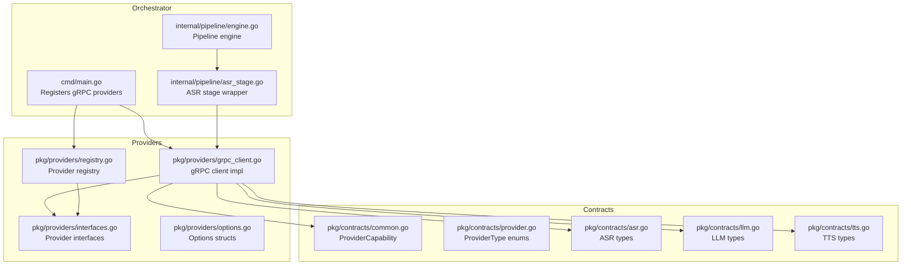
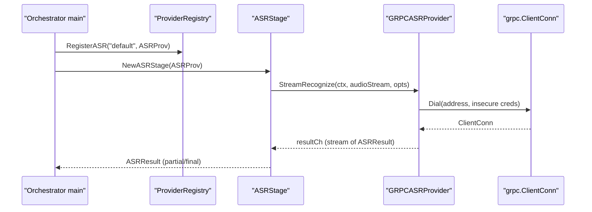
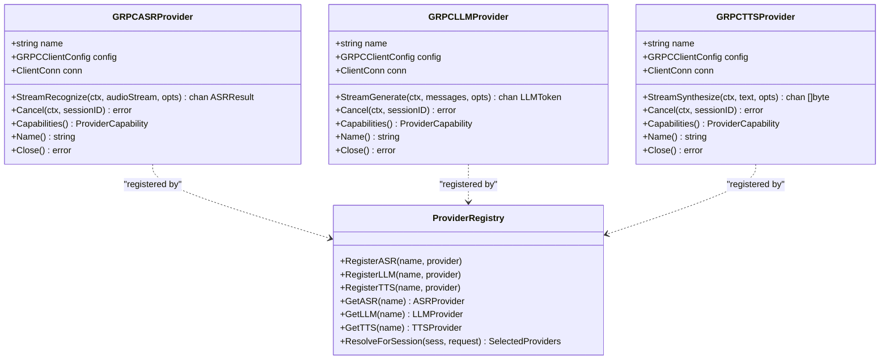

# gRPC Client Implementation

<cite>
**Referenced Files in This Document**
- [grpc_client.go](file://go/pkg/providers/grpc_client.go)
- [interfaces.go](file://go/pkg/providers/interfaces.go)
- [options.go](file://go/pkg/providers/options.go)
- [registry.go](file://go/pkg/providers/registry.go)
- [provider.go](file://go/pkg/contracts/provider.go)
- [common.go](file://go/pkg/contracts/common.go)
- [asr.go](file://go/pkg/contracts/asr.go)
- [llm.go](file://go/pkg/contracts/llm.go)
- [tts.go](file://go/pkg/contracts/tts.go)
- [main.go](file://go/orchestrator/cmd/main.go)
- [engine.go](file://go/orchestrator/internal/pipeline/engine.go)
- [asr_stage.go](file://go/orchestrator/internal/pipeline/asr_stage.go)
- [config.go](file://go/pkg/config/config.go)
</cite>

## Table of Contents
1. [Introduction](#introduction)
2. [Project Structure](#project-structure)
3. [Core Components](#core-components)
4. [Architecture Overview](#architecture-overview)
5. [Detailed Component Analysis](#detailed-component-analysis)
6. [Dependency Analysis](#dependency-analysis)
7. [Performance Considerations](#performance-considerations)
8. [Troubleshooting Guide](#troubleshooting-guide)
9. [Conclusion](#conclusion)

## Introduction
This document explains the Go gRPC client implementation used by the Orchestrator to communicate with the Provider-Gateway. It covers client configuration, connection management, retry logic, provider interface implementations (GRPCASRProvider, GRPCLLMProvider, GRPCTTSProvider), streaming method signatures, capability declarations, lifecycle management, error handling, graceful shutdown, and performance optimization techniques such as timeouts and connection reuse. Practical examples demonstrate initialization, invocation patterns, and cleanup.

## Project Structure
The gRPC client lives under the providers package and integrates with the Orchestrator’s pipeline and registry. The Orchestrator loads configuration, registers gRPC providers against the Provider-Gateway, and orchestrates the ASR → LLM → TTS pipeline.

**Diagram sources**
- [main.go:195-257](file://go/orchestrator/cmd/main.go#L195-L257)
- [engine.go:70-106](file://go/orchestrator/internal/pipeline/engine.go#L70-L106)
- [asr_stage.go:33-45](file://go/orchestrator/internal/pipeline/asr_stage.go#L33-L45)
- [grpc_client.go:14-288](file://go/pkg/providers/grpc_client.go#L14-L288)
- [interfaces.go:21-76](file://go/pkg/providers/interfaces.go#L21-L76)
- [options.go:7-188](file://go/pkg/providers/options.go#L7-L188)
- [registry.go:14-40](file://go/pkg/providers/registry.go#L14-L40)
- [common.go:130-139](file://go/pkg/contracts/common.go#L130-L139)
- [provider.go:3-28](file://go/pkg/contracts/provider.go#L3-L28)
- [asr.go:3-29](file://go/pkg/contracts/asr.go#L3-L29)
- [llm.go:16-35](file://go/pkg/contracts/llm.go#L16-L35)
- [tts.go:3-21](file://go/pkg/contracts/tts.go#L3-L21)

**Section sources**
- [main.go:195-257](file://go/orchestrator/cmd/main.go#L195-L257)
- [grpc_client.go:14-288](file://go/pkg/providers/grpc_client.go#L14-L288)
- [interfaces.go:21-76](file://go/pkg/providers/interfaces.go#L21-L76)
- [options.go:7-188](file://go/pkg/providers/options.go#L7-L188)
- [registry.go:14-40](file://go/pkg/providers/registry.go#L14-L40)
- [common.go:130-139](file://go/pkg/contracts/common.go#L130-L139)
- [provider.go:3-28](file://go/pkg/contracts/provider.go#L3-L28)
- [asr.go:3-29](file://go/pkg/contracts/asr.go#L3-L29)
- [llm.go:16-35](file://go/pkg/contracts/llm.go#L16-L35)
- [tts.go:3-21](file://go/pkg/contracts/tts.go#L3-L21)

## Core Components
- GRPCClientConfig: Holds connection parameters for gRPC clients.
- GRPCASRProvider, GRPCLLMProvider, GRPCTTSProvider: Provider implementations backed by gRPC connections.
- Provider interfaces: ASRProvider, LLMProvider, TTSProvider define streaming method signatures and capabilities.
- Options: ASROptions, LLMOptions, TTSOptions encapsulate provider-specific configuration.
- Registry: ProviderRegistry manages registration and selection of providers per session.

Key behaviors:
- Connection creation uses insecure transport credentials and stores a grpc.ClientConn per provider instance.
- Streaming methods return channels for incremental results.
- Capabilities describe streaming support, preferred sample rates, supported codecs, and interruptibility.

**Section sources**
- [grpc_client.go:14-125](file://go/pkg/providers/grpc_client.go#L14-L125)
- [grpc_client.go:127-201](file://go/pkg/providers/grpc_client.go#L127-L201)
- [grpc_client.go:203-277](file://go/pkg/providers/grpc_client.go#L203-L277)
- [interfaces.go:21-76](file://go/pkg/providers/interfaces.go#L21-L76)
- [options.go:7-188](file://go/pkg/providers/options.go#L7-L188)
- [registry.go:14-40](file://go/pkg/providers/registry.go#L14-L40)

## Architecture Overview
The Orchestrator initializes gRPC providers pointing to the Provider-Gateway, registers them in the registry, and uses them within pipeline stages. The pipeline stages wrap providers with circuit breakers and metrics, and coordinate streaming across ASR, LLM, and TTS.

**Diagram sources**
- [main.go:210-221](file://go/orchestrator/cmd/main.go#L210-L221)
- [registry.go:42-47](file://go/pkg/providers/registry.go#L42-L47)
- [asr_stage.go:68-84](file://go/orchestrator/internal/pipeline/asr_stage.go#L68-L84)
- [grpc_client.go:62-95](file://go/pkg/providers/grpc_client.go#L62-L95)

**Section sources**
- [main.go:210-221](file://go/orchestrator/cmd/main.go#L210-L221)
- [registry.go:42-47](file://go/pkg/providers/registry.go#L42-L47)
- [asr_stage.go:68-84](file://go/orchestrator/internal/pipeline/asr_stage.go#L68-L84)
- [grpc_client.go:62-95](file://go/pkg/providers/grpc_client.go#L62-L95)

## Detailed Component Analysis

### gRPC Client Configuration and Validation
- GRPCClientConfig fields: Address, Timeout (seconds), MaxRetries.
- Validate ensures non-empty Address and reasonable defaults for Timeout and MaxRetries.
- Current implementation does not apply MaxRetries to connection logic; see Retry Logic section.

Practical example (initialization):
- See [main.go:210-215](file://go/orchestrator/cmd/main.go#L210-L215) for constructing ASR config and [main.go:216](file://go/orchestrator/cmd/main.go#L216) for provider creation.

**Section sources**
- [grpc_client.go:14-33](file://go/pkg/providers/grpc_client.go#L14-L33)
- [main.go:210-215](file://go/orchestrator/cmd/main.go#L210-L215)

### Provider Interfaces and Capabilities
- ASRProvider: StreamRecognize returns chan ASRResult; Cancel supports interruption; Capabilities declares streaming input/output, word timestamps, preferred sample rates, and supported codecs.
- LLMProvider: StreamGenerate returns chan LLMToken; Cancel supports interruption; Capabilities declares streaming input/output and interruptible generation.
- TTSProvider: StreamSynthesize returns chan []byte; Cancel supports interruption; Capabilities declares streaming input/output, voices, preferred sample rates, and supported codecs.

Capabilities examples:
- ASR: [grpc_client.go:103-112](file://go/pkg/providers/grpc_client.go#L103-L112)
- LLM: [grpc_client.go:181-188](file://go/pkg/providers/grpc_client.go#L181-L188)
- TTS: [grpc_client.go:255-264](file://go/pkg/providers/grpc_client.go#L255-L264)

**Section sources**
- [interfaces.go:21-76](file://go/pkg/providers/interfaces.go#L21-L76)
- [grpc_client.go:103-112](file://go/pkg/providers/grpc_client.go#L103-L112)
- [grpc_client.go:181-188](file://go/pkg/providers/grpc_client.go#L181-L188)
- [grpc_client.go:255-264](file://go/pkg/providers/grpc_client.go#L255-L264)

### gRPC Provider Implementations
- GRPCASRProvider: Stores name, config, and grpc.ClientConn; NewGRPCASRProvider dials the Address with insecure credentials; StreamRecognize stub returns partial/final results; Cancel is a placeholder; Close closes the connection.
- GRPCLLMProvider: Similar pattern for text generation; StreamGenerate stub returns a completion token; Cancel is a placeholder; Close closes the connection.
- GRPCTTSProvider: Similar pattern for audio synthesis; StreamSynthesize stub emits silence frames; Cancel is a placeholder; Close closes the connection.

Stub behavior highlights:
- StreamRecognize emits a partial result per incoming audio chunk and a final result upon completion.
- StreamGenerate emits a single token stub.
- StreamSynthesize emits a silence frame stub.

Connection lifecycle:
- Creation: [grpc_client.go:50](file://go/pkg/providers/grpc_client.go#L50), [grpc_client.go:141](file://go/pkg/providers/grpc_client.go#L141), [grpc_client.go:217](file://go/pkg/providers/grpc_client.go#L217)
- Closing: [grpc_client.go:119-125](file://go/pkg/providers/grpc_client.go#L119-L125), [grpc_client.go:195-201](file://go/pkg/providers/grpc_client.go#L195-L201), [grpc_client.go:271-277](file://go/pkg/providers/grpc_client.go#L271-L277)

**Section sources**
- [grpc_client.go:35-125](file://go/pkg/providers/grpc_client.go#L35-L125)
- [grpc_client.go:127-201](file://go/pkg/providers/grpc_client.go#L127-L201)
- [grpc_client.go:203-277](file://go/pkg/providers/grpc_client.go#L203-L277)

### Streaming Method Signatures and Invocation Patterns
- ASR: StreamRecognize(ctx, chan []byte, ASROptions) -> chan ASRResult
- LLM: StreamGenerate(ctx, []ChatMessage, LLMOptions) -> chan LLMToken
- TTS: StreamSynthesize(ctx, string, TTSOptions) -> chan []byte

Pipeline usage:
- Engine constructs providers and stages, then invokes streaming methods with context propagation and buffered channels.
- Example invocations:
  - ASR: [engine.go:157-158](file://go/orchestrator/internal/pipeline/engine.go#L157-L158)
  - LLM: [engine.go:246-253](file://go/orchestrator/internal/pipeline/engine.go#L246-L253)
  - TTS incremental: [engine.go:267-276](file://go/orchestrator/internal/pipeline/engine.go#L267-L276)

ASR stage forwarding:
- [asr_stage.go:166-289](file://go/orchestrator/internal/pipeline/asr_stage.go#L166-L289) shows how ProcessAudioStream forwards audio chunks to the provider and converts results.

**Section sources**
- [interfaces.go:21-76](file://go/pkg/providers/interfaces.go#L21-L76)
- [engine.go:157-158](file://go/orchestrator/internal/pipeline/engine.go#L157-L158)
- [engine.go:246-253](file://go/orchestrator/internal/pipeline/engine.go#L246-L253)
- [engine.go:267-276](file://go/orchestrator/internal/pipeline/engine.go#L267-L276)
- [asr_stage.go:166-289](file://go/orchestrator/internal/pipeline/asr_stage.go#L166-L289)

### Provider Registration and Resolution
- ProviderRegistry maintains maps for ASR, LLM, TTS, and VAD providers and supports registration and retrieval by name.
- ResolveForSession applies priority order: request overrides > session overrides > tenant overrides > global defaults, then validates provider availability.

Registration example:
- [main.go:216](file://go/orchestrator/cmd/main.go#L216), [main.go:233](file://go/orchestrator/cmd/main.go#L233), [main.go:246](file://go/orchestrator/cmd/main.go#L246)

Resolution example:
- [registry.go:174-251](file://go/pkg/providers/registry.go#L174-L251)

**Section sources**
- [registry.go:42-104](file://go/pkg/providers/registry.go#L42-L104)
- [registry.go:174-251](file://go/pkg/providers/registry.go#L174-L251)
- [main.go:216](file://go/orchestrator/cmd/main.go#L216)
- [main.go:233](file://go/orchestrator/cmd/main.go#L233)
- [main.go:246](file://go/orchestrator/cmd/main.go#L246)

### Connection Lifecycle Management and Graceful Shutdown
- Connection creation occurs during provider construction using grpc.Dial with insecure credentials.
- Close() on each provider closes the underlying grpc.ClientConn.
- Orchestrator’s main function demonstrates graceful shutdown:
  - Captures OS signals
  - Shuts down HTTP server with timeout
  - Closes persistence connections

Graceful shutdown example:
- [main.go:166-192](file://go/orchestrator/cmd/main.go#L166-L192)

**Section sources**
- [grpc_client.go:50](file://go/pkg/providers/grpc_client.go#L50)
- [grpc_client.go:119-125](file://go/pkg/providers/grpc_client.go#L119-L125)
- [grpc_client.go:195-201](file://go/pkg/providers/grpc_client.go#L195-L201)
- [grpc_client.go:271-277](file://go/pkg/providers/grpc_client.go#L271-L277)
- [main.go:166-192](file://go/orchestrator/cmd/main.go#L166-L192)

### Error Handling Strategies
- Provider methods return errors for invalid configurations and connection failures.
- Provider interfaces include an Error field in result structs to propagate provider-side errors.
- Pipeline stages record metrics and handle circuit breaker errors.

Examples:
- Config validation: [grpc_client.go:22-33](file://go/pkg/providers/grpc_client.go#L22-L33)
- Connection failure: [grpc_client.go:51](file://go/pkg/providers/grpc_client.go#L51)
- Provider result error: [interfaces.go:10-19](file://go/pkg/providers/interfaces.go#L10-L19), [asr_stage.go:120-128](file://go/orchestrator/internal/pipeline/asr_stage.go#L120-L128)

**Section sources**
- [grpc_client.go:22-33](file://go/pkg/providers/grpc_client.go#L22-L33)
- [grpc_client.go:51](file://go/pkg/providers/grpc_client.go#L51)
- [interfaces.go:10-19](file://go/pkg/providers/interfaces.go#L10-L19)
- [asr_stage.go:120-128](file://go/orchestrator/internal/pipeline/asr_stage.go#L120-L128)

### Retry Logic Implementation
- GRPCClientConfig exposes MaxRetries but the current implementation does not apply retries to connection or RPC calls.
- The circuit breaker in pipeline stages can protect downstream calls and short-circuit failures.

Recommendation:
- Integrate grpc_retry interceptors or exponential backoff around grpc.Dial or per-RPC calls for production resilience.

**Section sources**
- [grpc_client.go:18](file://go/pkg/providers/grpc_client.go#L18)
- [asr_stage.go:72-84](file://go/orchestrator/internal/pipeline/asr_stage.go#L72-L84)

### Practical Examples

#### Client Initialization
- Construct GRPCClientConfig and call NewGRPCASRProvider/NewGRPCLLMProvider/NewGRPCTTSProvider.
- Register providers in ProviderRegistry and set defaults.

References:
- [main.go:210-247](file://go/orchestrator/cmd/main.go#L210-L247)

#### Method Invocation Patterns
- ASR streaming: [asr_stage.go:166-289](file://go/orchestrator/internal/pipeline/asr_stage.go#L166-L289)
- LLM streaming: [engine.go:246-253](file://go/orchestrator/internal/pipeline/engine.go#L246-L253)
- TTS incremental: [engine.go:267-276](file://go/orchestrator/internal/pipeline/engine.go#L267-L276)

#### Resource Cleanup
- Close provider connections: [grpc_client.go:119-125](file://go/pkg/providers/grpc_client.go#L119-L125), [grpc_client.go:195-201](file://go/pkg/providers/grpc_client.go#L195-L201), [grpc_client.go:271-277](file://go/pkg/providers/grpc_client.go#L271-L277)
- Orchestrator shutdown: [main.go:166-192](file://go/orchestrator/cmd/main.go#L166-L192)

**Section sources**
- [main.go:210-247](file://go/orchestrator/cmd/main.go#L210-L247)
- [asr_stage.go:166-289](file://go/orchestrator/internal/pipeline/asr_stage.go#L166-L289)
- [engine.go:246-253](file://go/orchestrator/internal/pipeline/engine.go#L246-L253)
- [engine.go:267-276](file://go/orchestrator/internal/pipeline/engine.go#L267-L276)
- [grpc_client.go:119-125](file://go/pkg/providers/grpc_client.go#L119-L125)
- [grpc_client.go:195-201](file://go/pkg/providers/grpc_client.go#L195-L201)
- [grpc_client.go:271-277](file://go/pkg/providers/grpc_client.go#L271-L277)
- [main.go:166-192](file://go/orchestrator/cmd/main.go#L166-L192)

## Dependency Analysis
The gRPC client depends on:
- gRPC library for transport and connection management.
- Contracts for provider capability definitions and streaming types.
- Pipeline stages for wrapping providers with circuit breakers and metrics.

**Diagram sources**
- [grpc_client.go:35-277](file://go/pkg/providers/grpc_client.go#L35-L277)
- [registry.go:42-104](file://go/pkg/providers/registry.go#L42-L104)

**Section sources**
- [grpc_client.go:35-277](file://go/pkg/providers/grpc_client.go#L35-L277)
- [registry.go:42-104](file://go/pkg/providers/registry.go#L42-L104)

## Performance Considerations
- Timeouts: Configure GRPCClientConfig.Timeout to bound request durations. The current implementation does not attach a dialer timeout; consider adding grpc.DialOption for timeout if needed.
- Channel buffering: Buffered channels (size 10) are used in stub implementations; tune sizes based on throughput and latency targets.
- Connection reuse: One grpc.ClientConn per provider instance is reused across calls; ensure long-lived connections for reduced overhead.
- Circuit breakers: Pipeline stages wrap providers with circuit breakers to prevent cascading failures under load.
- Metrics and tracing: The pipeline records latencies and errors; integrate Prometheus metrics and OpenTelemetry for observability.

[No sources needed since this section provides general guidance]

## Troubleshooting Guide
Common issues and remedies:
- Connection failures: Verify PROVIDER_GATEWAY_ADDRESS and network reachability; inspect error logs during grpc.Dial.
- Invalid configuration: Ensure Address is set and Timeout/MaxRetries are positive; Validate() sets defaults.
- Provider errors: Check ASRResult/LLMToken/TTS audio errors; pipeline stages emit and continue on provider errors.
- Interrupt handling: Use stage Cancel methods to cancel in-flight operations; ensure session context cancellation propagates.

**Section sources**
- [grpc_client.go:22-33](file://go/pkg/providers/grpc_client.go#L22-L33)
- [grpc_client.go:51](file://go/pkg/providers/grpc_client.go#L51)
- [asr_stage.go:120-128](file://go/orchestrator/internal/pipeline/asr_stage.go#L120-L128)
- [engine.go:400-412](file://go/orchestrator/internal/pipeline/engine.go#L400-L412)

## Conclusion
The gRPC client implementation provides a clean abstraction over the Provider-Gateway for ASR, LLM, and TTS services. While current implementations are stubs, the interfaces, configuration, and lifecycle management are ready for integration with generated gRPC clients. The Orchestrator composes these providers through a registry and pipeline stages, enabling streaming, cancellation, and observability. For production, add retry logic, connection pooling, explicit dial timeouts, and robust error handling aligned with ProviderError semantics.