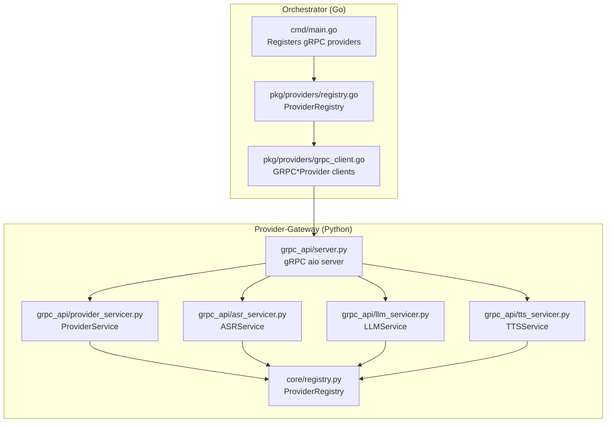
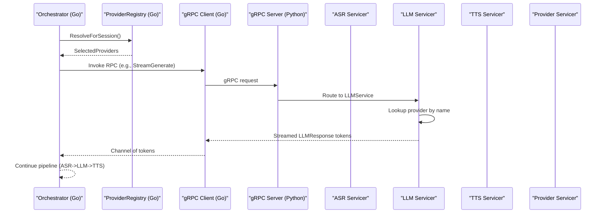
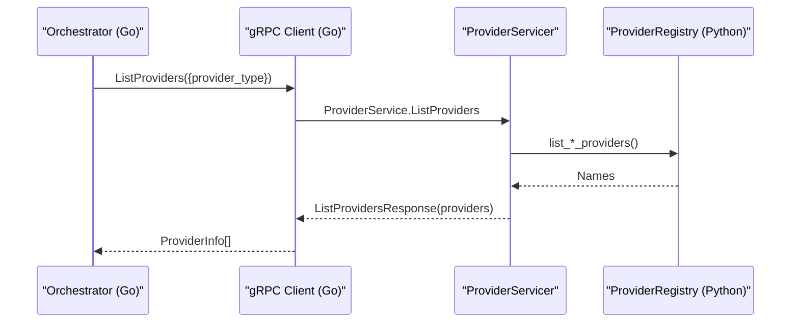
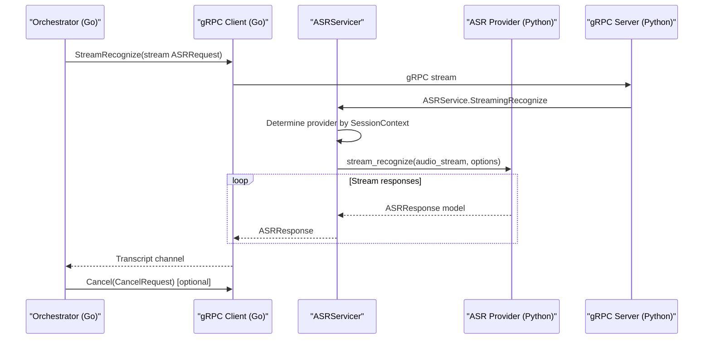
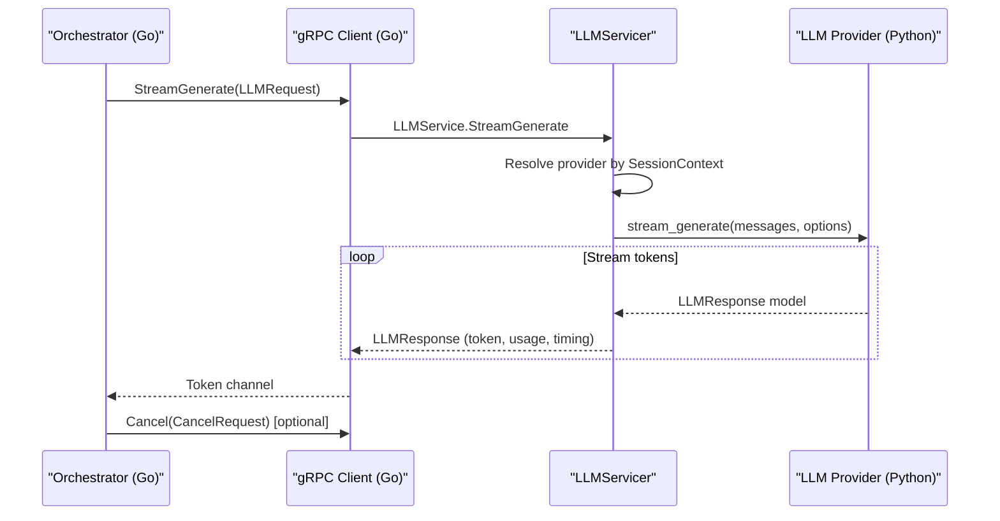
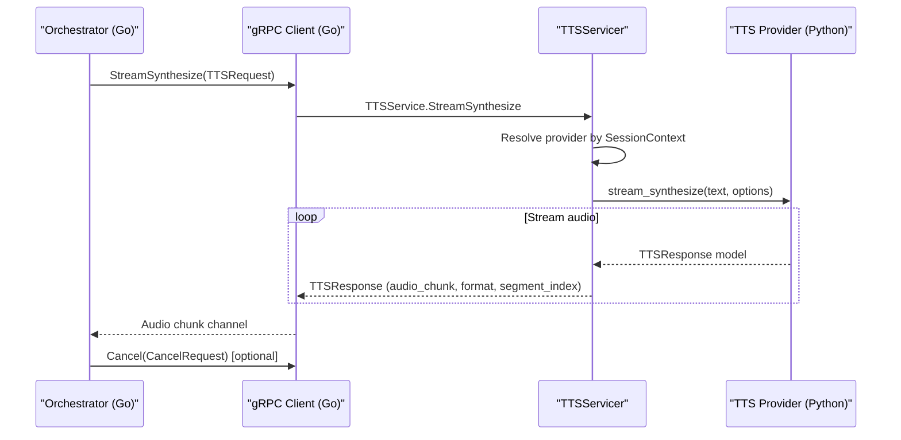
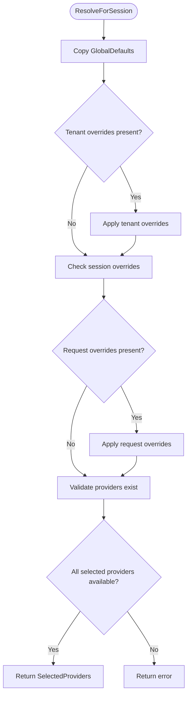
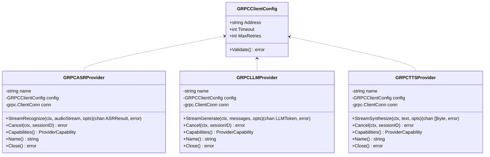
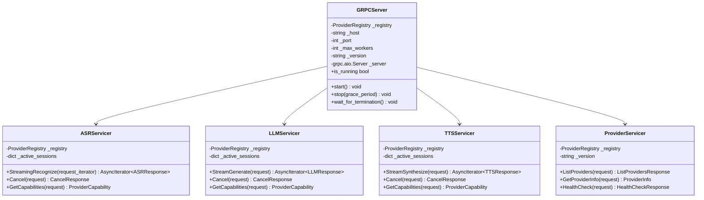
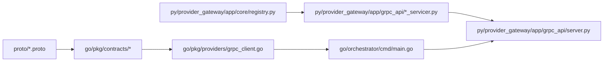

# gRPC Communication

<cite>
**Referenced Files in This Document**
- [provider.proto](file://proto/provider.proto)
- [asr.proto](file://proto/asr.proto)
- [llm.proto](file://proto/llm.proto)
- [tts.proto](file://proto/tts.proto)
- [common.proto](file://proto/common.proto)
- [grpc_client.go](file://go/pkg/providers/grpc_client.go)
- [registry.go](file://go/pkg/providers/registry.go)
- [provider.go](file://go/pkg/contracts/provider.go)
- [common.go](file://go/pkg/contracts/common.go)
- [main.go (Orchestrator)](file://go/orchestrator/cmd/main.go)
- [main.go (Media Edge)](file://go/media-edge/cmd/main.go)
- [server.py (Provider Gateway)](file://py/provider_gateway/app/grpc_api/server.py)
- [provider_servicer.py](file://py/provider_gateway/app/grpc_api/provider_servicer.py)
- [asr_servicer.py](file://py/provider_gateway/app/grpc_api/asr_servicer.py)
- [llm_servicer.py](file://py/provider_gateway/app/grpc_api/llm_servicer.py)
- [tts_servicer.py](file://py/provider_gateway/app/grpc_api/tts_servicer.py)
- [registry.py (Python)](file://py/provider_gateway/app/core/registry.py)
</cite>

## Table of Contents
1. [Introduction](#introduction)
2. [Project Structure](#project-structure)
3. [Core Components](#core-components)
4. [Architecture Overview](#architecture-overview)
5. [Detailed Component Analysis](#detailed-component-analysis)
6. [Dependency Analysis](#dependency-analysis)
7. [Performance Considerations](#performance-considerations)
8. [Troubleshooting Guide](#troubleshooting-guide)
9. [Conclusion](#conclusion)

## Introduction
This document explains the gRPC-based inter-service messaging between the Orchestrator and the Provider-Gateway. It covers the service definitions, method signatures, and message protocols for AI provider communication (ASR, LLM, TTS). It documents the provider registration and capability negotiation mechanisms, dynamic provider selection, and outlines the Go client implementation and Python provider server implementation. It also includes concrete examples of method calls, request/response schemas, streaming RPC patterns, and strategies for performance optimization, connection pooling, and fault tolerance.

## Project Structure
The gRPC communication spans two services:
- Provider-Gateway (Python): Exposes gRPC services for ASR, LLM, TTS, and Provider discovery.
- Orchestrator (Go): Registers gRPC clients to the Provider-Gateway and selects providers per session.

**Diagram sources**
- [main.go (Orchestrator):195-257](file://go/orchestrator/cmd/main.go#L195-L257)
- [registry.go:14-40](file://go/pkg/providers/registry.go#L14-L40)
- [grpc_client.go:14-60](file://go/pkg/providers/grpc_client.go#L14-L60)
- [server.py (Provider Gateway):25-86](file://py/provider_gateway/app/grpc_api/server.py#L25-L86)
- [provider_servicer.py:28-187](file://py/provider_gateway/app/grpc_api/provider_servicer.py#L28-L187)
- [asr_servicer.py:28-236](file://py/provider_gateway/app/grpc_api/asr_servicer.py#L28-L236)
- [llm_servicer.py:24-215](file://py/provider_gateway/app/grpc_api/llm_servicer.py#L24-L215)
- [tts_servicer.py:27-225](file://py/provider_gateway/app/grpc_api/tts_servicer.py#L27-L225)
- [registry.py (Python):19-241](file://py/provider_gateway/app/core/registry.py#L19-L241)

**Section sources**
- [main.go (Orchestrator):195-257](file://go/orchestrator/cmd/main.go#L195-L257)
- [grpc_client.go:14-60](file://go/pkg/providers/grpc_client.go#L14-L60)
- [server.py (Provider Gateway):25-86](file://py/provider_gateway/app/grpc_api/server.py#L25-L86)
- [provider_servicer.py:28-187](file://py/provider_gateway/app/grpc_api/provider_servicer.py#L28-L187)
- [asr_servicer.py:28-236](file://py/provider_gateway/app/grpc_api/asr_servicer.py#L28-L236)
- [llm_servicer.py:24-215](file://py/provider_gateway/app/grpc_api/llm_servicer.py#L24-L215)
- [tts_servicer.py:27-225](file://py/provider_gateway/app/grpc_api/tts_servicer.py#L27-L225)
- [registry.py (Python):19-241](file://py/provider_gateway/app/core/registry.py#L19-L241)

## Core Components
- Protocol Buffers define the canonical message schemas and RPC contracts for ASR, LLM, TTS, and Provider management.
- Provider-Gateway exposes asynchronous gRPC services and a Provider discovery service.
- Orchestrator registers gRPC clients pointing to Provider-Gateway and resolves providers per session.

Key elements:
- Provider types and status enums, ProviderService for discovery and health.
- ASR bidirectional streaming, LLM server-streaming, TTS server-streaming, plus cancellation and capability queries.
- Go-side gRPC client stubs and provider registry with resolution logic.
- Python-side gRPC server wiring and per-service servicers.

**Section sources**
- [provider.proto:10-62](file://proto/provider.proto#L10-L62)
- [asr.proto:10-52](file://proto/asr.proto#L10-L52)
- [llm.proto:10-58](file://proto/llm.proto#L10-L58)
- [tts.proto:10-44](file://proto/tts.proto#L10-L44)
- [grpc_client.go:14-125](file://go/pkg/providers/grpc_client.go#L14-L125)
- [registry.go:166-251](file://go/pkg/providers/registry.go#L166-L251)
- [server.py (Provider Gateway):54-86](file://py/provider_gateway/app/grpc_api/server.py#L54-L86)

## Architecture Overview
The Orchestrator connects to Provider-Gateway over gRPC. Provider-Gateway maintains a registry of provider implementations and routes requests to them. The ProviderService enables discovery and capability queries, while ASR/LLM/TTS services expose streaming and cancellation semantics.

**Diagram sources**
- [main.go (Orchestrator):195-257](file://go/orchestrator/cmd/main.go#L195-L257)
- [registry.go:172-251](file://go/pkg/providers/registry.go#L172-L251)
- [grpc_client.go:135-173](file://go/pkg/providers/grpc_client.go#L135-L173)
- [server.py (Provider Gateway):54-86](file://py/provider_gateway/app/grpc_api/server.py#L54-L86)
- [llm_servicer.py:38-101](file://py/provider_gateway/app/grpc_api/llm_servicer.py#L38-L101)

**Section sources**
- [main.go (Orchestrator):195-257](file://go/orchestrator/cmd/main.go#L195-L257)
- [registry.go:172-251](file://go/pkg/providers/registry.go#L172-L251)
- [grpc_client.go:135-173](file://go/pkg/providers/grpc_client.go#L135-L173)
- [server.py (Provider Gateway):54-86](file://py/provider_gateway/app/grpc_api/server.py#L54-L86)
- [llm_servicer.py:38-101](file://py/provider_gateway/app/grpc_api/llm_servicer.py#L38-L101)

## Detailed Component Analysis

### Provider Discovery and Capability Negotiation
Provider-Gateway exposes ProviderService with:
- ListProviders: Filter providers by type and return ProviderInfo with capabilities and status.
- GetProviderInfo: Retrieve detailed info for a named provider.
- HealthCheck: Confirm service availability.

Provider-Gateway converts internal capability models to protobuf ProviderCapability and populates ProviderInfo with metadata and status.

**Diagram sources**
- [provider.proto:27-62](file://proto/provider.proto#L27-L62)
- [provider_servicer.py:43-121](file://py/provider_gateway/app/grpc_api/provider_servicer.py#L43-L121)
- [registry.py (Python):170-180](file://py/provider_gateway/app/core/registry.py#L170-L180)

**Section sources**
- [provider.proto:27-62](file://proto/provider.proto#L27-L62)
- [provider_servicer.py:43-121](file://py/provider_gateway/app/grpc_api/provider_servicer.py#L43-L121)
- [registry.py (Python):170-180](file://py/provider_gateway/app/core/registry.py#L170-L180)

### ASR Streaming Recognition
ASRService.StreamingRecognize is a bidirectional stream:
- First request carries SessionContext and audio format hints.
- Orchestrator sends a stream of ASRRequest with audio chunks and is_final flags.
- Provider-Gateway streams ASRResponse with transcripts, timestamps, and timing metadata.

Cancellation is supported via ASRService.Cancel with SessionContext.

**Diagram sources**
- [asr.proto:10-52](file://proto/asr.proto#L10-L52)
- [asr_servicer.py:42-122](file://py/provider_gateway/app/grpc_api/asr_servicer.py#L42-L122)
- [grpc_client.go:62-101](file://go/pkg/providers/grpc_client.go#L62-L101)

**Section sources**
- [asr.proto:10-52](file://proto/asr.proto#L10-L52)
- [asr_servicer.py:42-122](file://py/provider_gateway/app/grpc_api/asr_servicer.py#L42-L122)
- [grpc_client.go:62-101](file://go/pkg/providers/grpc_client.go#L62-L101)

### LLM Streaming Generation
LLMService.StreamGenerate is server-streaming:
- Orchestrator sends LLMRequest with messages, generation parameters, and provider options.
- Provider-Gateway streams LLMResponse tokens until completion or cancellation.

**Diagram sources**
- [llm.proto:10-58](file://proto/llm.proto#L10-L58)
- [llm_servicer.py:38-101](file://py/provider_gateway/app/grpc_api/llm_servicer.py#L38-L101)
- [grpc_client.go:153-180](file://go/pkg/providers/grpc_client.go#L153-L180)

**Section sources**
- [llm.proto:10-58](file://proto/llm.proto#L10-L58)
- [llm_servicer.py:38-101](file://py/provider_gateway/app/grpc_api/llm_servicer.py#L38-L101)
- [grpc_client.go:153-180](file://go/pkg/providers/grpc_client.go#L153-L180)

### TTS Streaming Synthesis
TTSService.StreamSynthesize is server-streaming:
- Orchestrator sends TTSRequest with text, voice, audio format, and provider options.
- Provider-Gateway streams TTSResponse audio chunks.

**Diagram sources**
- [tts.proto:10-44](file://proto/tts.proto#L10-L44)
- [tts_servicer.py:41-100](file://py/provider_gateway/app/grpc_api/tts_servicer.py#L41-L100)
- [grpc_client.go:229-253](file://go/pkg/providers/grpc_client.go#L229-L253)

**Section sources**
- [tts.proto:10-44](file://proto/tts.proto#L10-L44)
- [tts_servicer.py:41-100](file://py/provider_gateway/app/grpc_api/tts_servicer.py#L41-L100)
- [grpc_client.go:229-253](file://go/pkg/providers/grpc_client.go#L229-L253)

### Provider Registration and Dynamic Selection
- Orchestrator registers gRPC provider clients with ProviderRegistry and sets default selections.
- ProviderRegistry.ResolveForSession applies priority: request overrides > session overrides > tenant overrides > global defaults, then validates provider availability.

**Diagram sources**
- [registry.go:172-251](file://go/pkg/providers/registry.go#L172-L251)
- [main.go (Orchestrator):249-257](file://go/orchestrator/cmd/main.go#L249-L257)

**Section sources**
- [registry.go:172-251](file://go/pkg/providers/registry.go#L172-L251)
- [main.go (Orchestrator):249-257](file://go/orchestrator/cmd/main.go#L249-L257)

### Go gRPC Client Implementation
- GRPCClientConfig encapsulates address, timeout, and retries.
- NewGRPCASRProvider/NewGRPCLLMProvider/NewGRPCTTSProvider establish insecure gRPC connections to Provider-Gateway.
- StreamRecognize/StreamGenerate/StreamSynthesize are stubbed; they should use generated gRPC clients to send/receive streaming messages and handle cancellation.
- Capabilities() returns provider capability flags mirrored from the protobuf capability model.

**Diagram sources**
- [grpc_client.go:14-277](file://go/pkg/providers/grpc_client.go#L14-L277)

**Section sources**
- [grpc_client.go:14-277](file://go/pkg/providers/grpc_client.go#L14-L277)

### Python Provider Server Implementation
- GRPCServer constructs an asyncio gRPC server with thread pool workers and registers ASR, LLM, TTS, and Provider services.
- ASRServicer/LLMServicer/TTSServicer implement streaming RPCs, convert between internal models and protobuf messages, track active sessions, and handle cancellation.
- ProviderServicer lists providers, retrieves info, and reports health.

**Diagram sources**
- [server.py (Provider Gateway):25-134](file://py/provider_gateway/app/grpc_api/server.py#L25-L134)
- [asr_servicer.py:28-236](file://py/provider_gateway/app/grpc_api/asr_servicer.py#L28-L236)
- [llm_servicer.py:24-215](file://py/provider_gateway/app/grpc_api/llm_servicer.py#L24-L215)
- [tts_servicer.py:27-225](file://py/provider_gateway/app/grpc_api/tts_servicer.py#L27-L225)
- [provider_servicer.py:28-187](file://py/provider_gateway/app/grpc_api/provider_servicer.py#L28-L187)

**Section sources**
- [server.py (Provider Gateway):25-134](file://py/provider_gateway/app/grpc_api/server.py#L25-L134)
- [asr_servicer.py:28-236](file://py/provider_gateway/app/grpc_api/asr_servicer.py#L28-L236)
- [llm_servicer.py:24-215](file://py/provider_gateway/app/grpc_api/llm_servicer.py#L24-L215)
- [tts_servicer.py:27-225](file://py/provider_gateway/app/grpc_api/tts_servicer.py#L27-L225)
- [provider_servicer.py:28-187](file://py/provider_gateway/app/grpc_api/provider_servicer.py#L28-L187)

## Dependency Analysis
- Protobuf definitions define the canonical contracts for all services.
- Go Orchestrator depends on ProviderRegistry and gRPC client stubs to invoke Provider-Gateway.
- Provider-Gateway depends on Python ProviderRegistry to resolve provider implementations and capability models.

**Diagram sources**
- [provider.proto:1-63](file://proto/provider.proto#L1-L63)
- [asr.proto:1-53](file://proto/asr.proto#L1-L53)
- [llm.proto:1-59](file://proto/llm.proto#L1-L59)
- [tts.proto:1-45](file://proto/tts.proto#L1-L45)
- [common.proto](file://proto/common.proto)
- [grpc_client.go:1-288](file://go/pkg/providers/grpc_client.go#L1-L288)
- [registry.go:1-262](file://go/pkg/providers/registry.go#L1-L262)
- [main.go (Orchestrator):1-258](file://go/orchestrator/cmd/main.go#L1-L258)
- [registry.py (Python):1-287](file://py/provider_gateway/app/core/registry.py#L1-L287)
- [server.py (Provider Gateway):1-171](file://py/provider_gateway/app/grpc_api/server.py#L1-L171)
- [provider_servicer.py:1-190](file://py/provider_gateway/app/grpc_api/provider_servicer.py#L1-L190)
- [asr_servicer.py:1-239](file://py/provider_gateway/app/grpc_api/asr_servicer.py#L1-L239)
- [llm_servicer.py:1-218](file://py/provider_gateway/app/grpc_api/llm_servicer.py#L1-L218)
- [tts_servicer.py:1-228](file://py/provider_gateway/app/grpc_api/tts_servicer.py#L1-L228)

**Section sources**
- [provider.proto:1-63](file://proto/provider.proto#L1-L63)
- [asr.proto:1-53](file://proto/asr.proto#L1-L53)
- [llm.proto:1-59](file://proto/llm.proto#L1-L59)
- [tts.proto:1-45](file://proto/tts.proto#L1-L45)
- [common.proto](file://proto/common.proto)
- [grpc_client.go:1-288](file://go/pkg/providers/grpc_client.go#L1-L288)
- [registry.go:1-262](file://go/pkg/providers/registry.go#L1-L262)
- [main.go (Orchestrator):1-258](file://go/orchestrator/cmd/main.go#L1-L258)
- [registry.py (Python):1-287](file://py/provider_gateway/app/core/registry.py#L1-L287)
- [server.py (Provider Gateway):1-171](file://py/provider_gateway/app/grpc_api/server.py#L1-L171)
- [provider_servicer.py:1-190](file://py/provider_gateway/app/grpc_api/provider_servicer.py#L1-L190)
- [asr_servicer.py:1-239](file://py/provider_gateway/app/grpc_api/asr_servicer.py#L1-L239)
- [llm_servicer.py:1-218](file://py/provider_gateway/app/grpc_api/llm_servicer.py#L1-L218)
- [tts_servicer.py:1-228](file://py/provider_gateway/app/grpc_api/tts_servicer.py#L1-L228)

## Performance Considerations
- Message size limits: The Python gRPC server sets maximum send/receive message lengths to 50 MB to accommodate larger payloads.
- Worker threads: The Python server uses a configurable thread pool to handle concurrent requests.
- Streaming: Prefer server-streaming or bidirectional streaming to reduce latency and memory overhead compared to unary calls.
- Connection lifecycle: The Go gRPC client establishes a persistent connection per provider; consider reusing connections and implementing keepalive for reliability.
- Backpressure: Channels in Go clients should buffer appropriately to avoid blocking the producer goroutines during streaming.
- Cancellation: Implement cancellation to abort long-running operations and free resources promptly.

[No sources needed since this section provides general guidance]

## Troubleshooting Guide
- Provider not found: Provider-Gateway raises explicit provider errors when a requested provider name is missing; verify provider registration and names.
- Capability mismatches: Use GetCapabilities to validate provider support for streaming, voices, codecs, and sample rates before sending requests.
- Cancellation acknowledgments: Cancel requests return an acknowledgment; if not acknowledged, check active session tracking and provider cancel implementation.
- Health checks: Use ProviderService.HealthCheck to confirm service readiness and version.
- Logging and telemetry: Python servicers log errors and record telemetry; inspect logs for normalized error codes and spans.

**Section sources**
- [asr_servicer.py:112-118](file://py/provider_gateway/app/grpc_api/asr_servicer.py#L112-L118)
- [llm_servicer.py:97-101](file://py/provider_gateway/app/grpc_api/llm_servicer.py#L97-L101)
- [tts_servicer.py](file://py/provider_gateway/app/grpc_api/tts_servicer.py-L101)
- [provider_servicer.py:170-186](file://py/provider_gateway/app/grpc_api/provider_servicer.py#L170-L186)

## Conclusion
The gRPC architecture cleanly separates concerns between the Orchestrator and Provider-Gateway. Protobuf contracts define robust RPCs for ASR, LLM, and TTS with streaming and cancellation semantics. Provider-Gateway’s registry and servicers enable dynamic provider selection and capability negotiation. The Go client stubs outline the integration points for invoking Provider-Gateway services, while the Python server demonstrates streaming, cancellation, and health management. By leveraging streaming, capability checks, and structured error handling, the system supports scalable, fault-tolerant distributed AI processing.