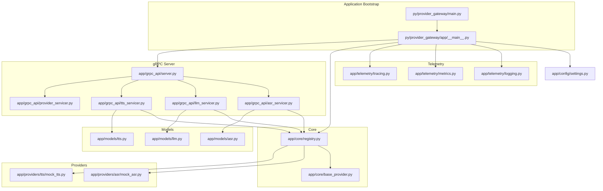
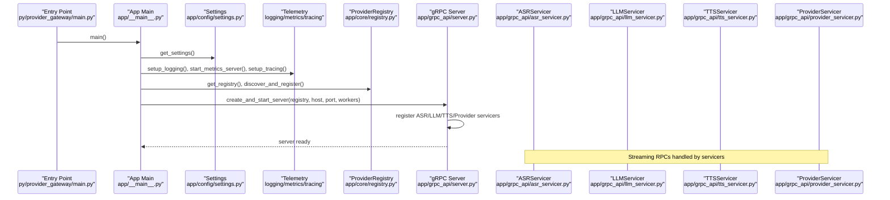
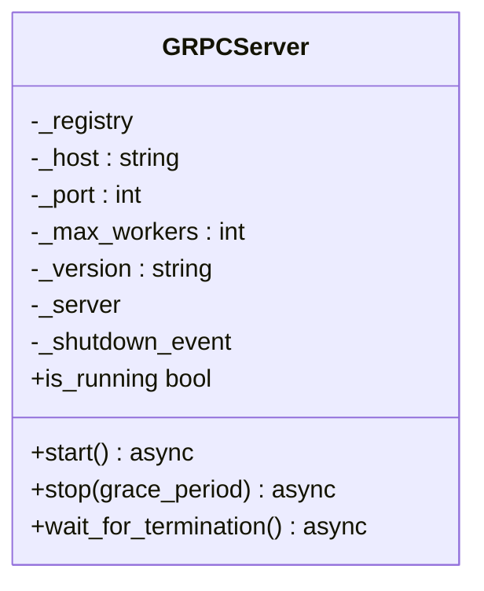
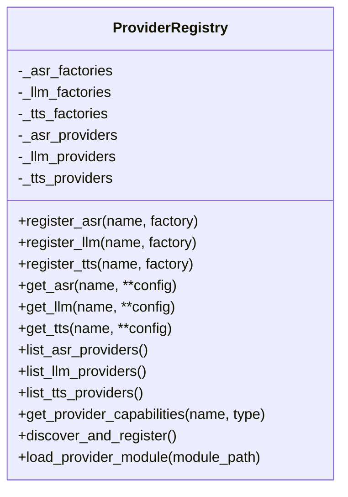
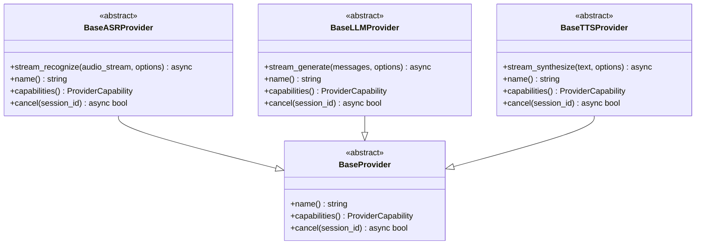
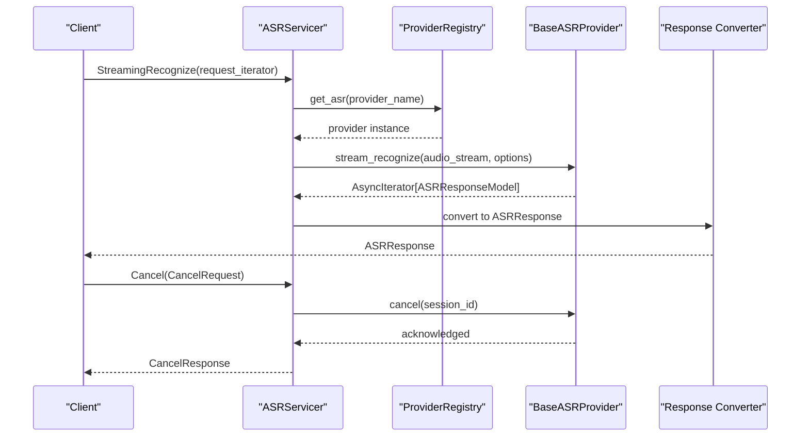
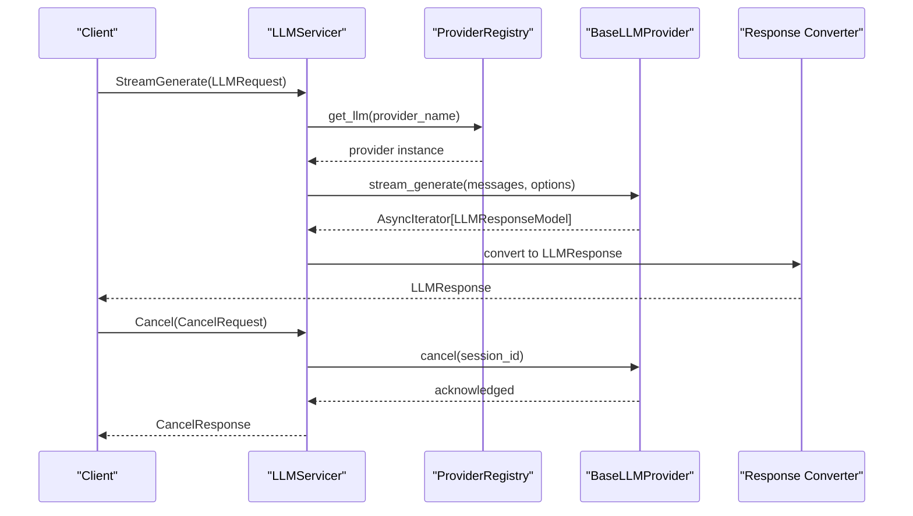
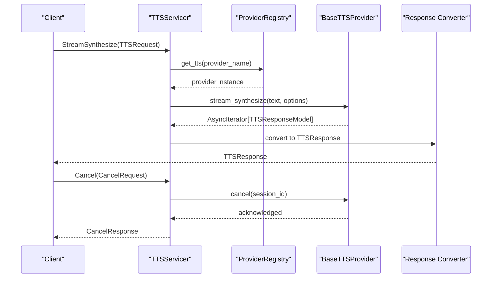
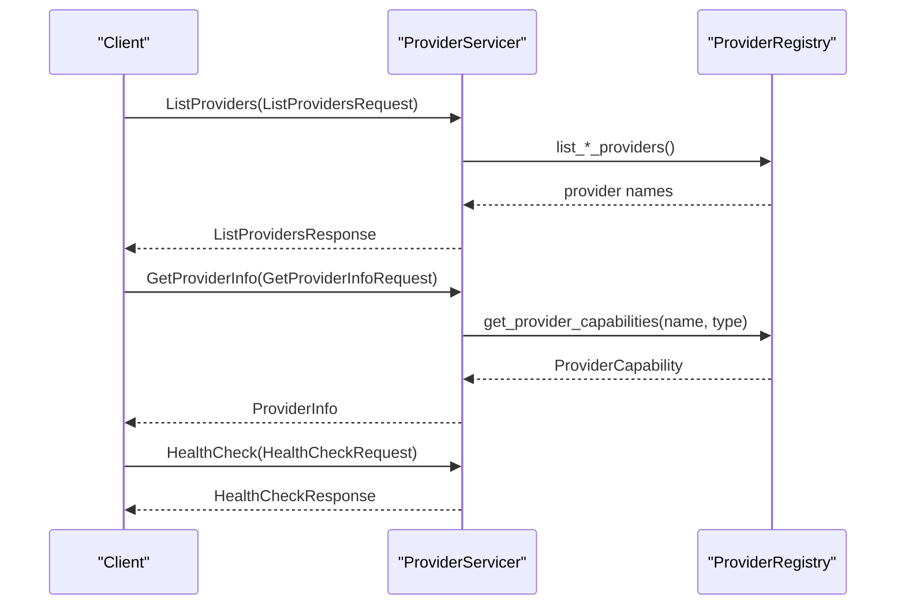
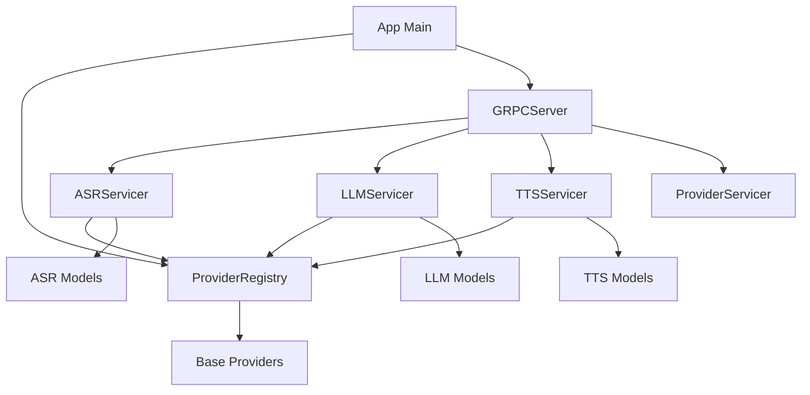

# gRPC Server Implementation

<cite>
**Referenced Files in This Document**
- [main.py](file://py/provider_gateway/main.py)
- [app/__main__.py](file://py/provider_gateway/app/__main__.py)
- [grpc_api/server.py](file://py/provider_gateway/app/grpc_api/server.py)
- [grpc_api/asr_servicer.py](file://py/provider_gateway/app/grpc_api/asr_servicer.py)
- [grpc_api/llm_servicer.py](file://py/provider_gateway/app/grpc_api/llm_servicer.py)
- [grpc_api/tts_servicer.py](file://py/provider_gateway/app/grpc_api/tts_servicer.py)
- [grpc_api/provider_servicer.py](file://py/provider_gateway/app/grpc_api/provider_servicer.py)
- [core/registry.py](file://py/provider_gateway/app/core/registry.py)
- [core/base_provider.py](file://py/provider_gateway/app/core/base_provider.py)
- [models/asr.py](file://py/provider_gateway/app/models/asr.py)
- [models/llm.py](file://py/provider_gateway/app/models/llm.py)
- [models/tts.py](file://py/provider_gateway/app/models/tts.py)
- [providers/asr/mock_asr.py](file://py/provider_gateway/app/providers/asr/mock_asr.py)
- [providers/tts/mock_tts.py](file://py/provider_gateway/app/providers/tts/mock_tts.py)
- [config/settings.py](file://py/provider_gateway/app/config/settings.py)
- [telemetry/logging.py](file://py/provider_gateway/app/telemetry/logging.py)
- [telemetry/metrics.py](file://py/provider_gateway/app/telemetry/metrics.py)
- [telemetry/tracing.py](file://py/provider_gateway/app/telemetry/tracing.py)
</cite>

## Table of Contents
1. [Introduction](#introduction)
2. [Project Structure](#project-structure)
3. [Core Components](#core-components)
4. [Architecture Overview](#architecture-overview)
5. [Detailed Component Analysis](#detailed-component-analysis)
6. [Dependency Analysis](#dependency-analysis)
7. [Performance Considerations](#performance-considerations)
8. [Troubleshooting Guide](#troubleshooting-guide)
9. [Conclusion](#conclusion)
10. [Appendices](#appendices)

## Introduction
This document describes the Python gRPC server implementation that exposes AI services (ASR, LLM, TTS) to the Orchestrator. It covers the server startup process, service registration, gRPC server configuration, provider gateway role, streaming RPC handlers, request processing logic, error handling, logging integration, health checks, and operational guidance for configuration, provider registration, debugging, scalability, and concurrent request handling.

## Project Structure
The provider gateway is implemented in Python under the py/provider_gateway package. The key areas are:
- Entry points and lifecycle: main entry and application bootstrap
- gRPC server and servicers: ASR, LLM, TTS, and Provider services
- Provider registry and base provider interfaces
- Models for requests/responses
- Providers (mock implementations included)
- Configuration and telemetry (logging, metrics, tracing)

**Diagram sources**
- [main.py:1-13](file://py/provider_gateway/main.py#L1-L13)
- [app/__main__.py:1-80](file://py/provider_gateway/app/__main__.py#L1-L80)
- [grpc_api/server.py:1-171](file://py/provider_gateway/app/grpc_api/server.py#L1-L171)
- [grpc_api/asr_servicer.py:1-239](file://py/provider_gateway/app/grpc_api/asr_servicer.py#L1-L239)
- [grpc_api/llm_servicer.py:1-218](file://py/provider_gateway/app/grpc_api/llm_servicer.py#L1-L218)
- [grpc_api/tts_servicer.py:1-228](file://py/provider_gateway/app/grpc_api/tts_servicer.py#L1-L228)
- [grpc_api/provider_servicer.py:1-190](file://py/provider_gateway/app/grpc_api/provider_servicer.py#L1-L190)
- [core/registry.py:1-287](file://py/provider_gateway/app/core/registry.py#L1-L287)
- [core/base_provider.py:1-177](file://py/provider_gateway/app/core/base_provider.py#L1-L177)
- [models/asr.py:1-65](file://py/provider_gateway/app/models/asr.py#L1-L65)
- [models/llm.py:1-78](file://py/provider_gateway/app/models/llm.py#L1-L78)
- [models/tts.py:1-56](file://py/provider_gateway/app/models/tts.py#L1-L56)
- [providers/asr/mock_asr.py:1-221](file://py/provider_gateway/app/providers/asr/mock_asr.py#L1-L221)
- [providers/tts/mock_tts.py:1-206](file://py/provider_gateway/app/providers/tts/mock_tts.py#L1-L206)
- [config/settings.py:1-161](file://py/provider_gateway/app/config/settings.py#L1-L161)
- [telemetry/logging.py:1-145](file://py/provider_gateway/app/telemetry/logging.py#L1-L145)
- [telemetry/metrics.py:1-107](file://py/provider_gateway/app/telemetry/metrics.py#L1-L107)
- [telemetry/tracing.py:1-152](file://py/provider_gateway/app/telemetry/tracing.py#L1-L152)

**Section sources**
- [main.py:1-13](file://py/provider_gateway/main.py#L1-L13)
- [app/__main__.py:1-80](file://py/provider_gateway/app/__main__.py#L1-L80)
- [grpc_api/server.py:1-171](file://py/provider_gateway/app/grpc_api/server.py#L1-L171)

## Core Components
- gRPC Server: Creates and manages an asynchronous gRPC server with configurable host/port, worker threads, and service registration.
- Servicers: ASR, LLM, TTS, and Provider services implement the gRPC interfaces and translate between gRPC messages and internal provider models.
- Registry: Central provider registry supporting dynamic registration, caching, and discovery of ASR/LLM/TTS providers.
- Base Providers: Abstract interfaces that define streaming recognition/generation/synthesis and cancellation semantics.
- Models: Typed Pydantic models for requests and responses across ASR, LLM, and TTS.
- Telemetry: Structured logging, Prometheus metrics, and OpenTelemetry tracing.

**Section sources**
- [grpc_api/server.py:25-171](file://py/provider_gateway/app/grpc_api/server.py#L25-L171)
- [grpc_api/asr_servicer.py:28-239](file://py/provider_gateway/app/grpc_api/asr_servicer.py#L28-L239)
- [grpc_api/llm_servicer.py:24-218](file://py/provider_gateway/app/grpc_api/llm_servicer.py#L24-L218)
- [grpc_api/tts_servicer.py:27-228](file://py/provider_gateway/app/grpc_api/tts_servicer.py#L27-L228)
- [grpc_api/provider_servicer.py:28-190](file://py/provider_gateway/app/grpc_api/provider_servicer.py#L28-L190)
- [core/registry.py:19-287](file://py/provider_gateway/app/core/registry.py#L19-L287)
- [core/base_provider.py:12-177](file://py/provider_gateway/app/core/base_provider.py#L12-L177)
- [models/asr.py:18-65](file://py/provider_gateway/app/models/asr.py#L18-L65)
- [models/llm.py:10-78](file://py/provider_gateway/app/models/llm.py#L10-L78)
- [models/tts.py:10-56](file://py/provider_gateway/app/models/tts.py#L10-L56)
- [telemetry/logging.py:89-145](file://py/provider_gateway/app/telemetry/logging.py#L89-L145)
- [telemetry/metrics.py:1-107](file://py/provider_gateway/app/telemetry/metrics.py#L1-L107)
- [telemetry/tracing.py:17-152](file://py/provider_gateway/app/telemetry/tracing.py#L17-L152)

## Architecture Overview
The provider gateway boots, loads configuration, initializes telemetry, discovers providers, and starts the gRPC server. The server registers four services: ASR, LLM, TTS, and Provider. Each servicer translates gRPC requests into internal models, delegates to a provider via the registry, streams provider responses back to clients, and records telemetry.

**Diagram sources**
- [main.py:1-13](file://py/provider_gateway/main.py#L1-L13)
- [app/__main__.py:15-72](file://py/provider_gateway/app/__main__.py#L15-L72)
- [config/settings.py:53-161](file://py/provider_gateway/app/config/settings.py#L53-L161)
- [telemetry/logging.py:89-145](file://py/provider_gateway/app/telemetry/logging.py#L89-L145)
- [telemetry/metrics.py:85-107](file://py/provider_gateway/app/telemetry/metrics.py#L85-L107)
- [telemetry/tracing.py:17-52](file://py/provider_gateway/app/telemetry/tracing.py#L17-L52)
- [core/registry.py:206-241](file://py/provider_gateway/app/core/registry.py#L206-L241)
- [grpc_api/server.py:54-90](file://py/provider_gateway/app/grpc_api/server.py#L54-L90)

## Detailed Component Analysis

### gRPC Server Startup and Configuration
- Initializes an asynchronous gRPC server with a configurable ThreadPoolExecutor for concurrency.
- Registers ASR, LLM, TTS, and Provider services.
- Adds an insecure port and logs startup.
- Sets up signal handlers for graceful shutdown.
- Exposes a wait-for-termination mechanism.

**Diagram sources**
- [grpc_api/server.py:25-171](file://py/provider_gateway/app/grpc_api/server.py#L25-L171)

**Section sources**
- [grpc_api/server.py:54-134](file://py/provider_gateway/app/grpc_api/server.py#L54-L134)

### Provider Registry and Discovery
- Maintains factories and cached instances for ASR, LLM, and TTS providers.
- Provides thread-safe lookup with caching keyed by provider name and configuration hash.
- Discovers built-in providers by importing provider modules and invoking their registration functions.
- Supports dynamic module loading.

**Diagram sources**
- [core/registry.py:19-287](file://py/provider_gateway/app/core/registry.py#L19-L287)

**Section sources**
- [core/registry.py:85-169](file://py/provider_gateway/app/core/registry.py#L85-L169)
- [core/registry.py:206-241](file://py/provider_gateway/app/core/registry.py#L206-L241)

### Base Provider Interfaces
- Defines abstract base classes for ASR, LLM, and TTS providers with streaming methods and cancellation.
- Ensures consistent capability reporting and provider identity.

**Diagram sources**
- [core/base_provider.py:12-177](file://py/provider_gateway/app/core/base_provider.py#L12-L177)

**Section sources**
- [core/base_provider.py:39-169](file://py/provider_gateway/app/core/base_provider.py#L39-L169)

### ASR Servicer
- Implements bidirectional streaming for audio input and transcript output.
- Extracts session/provider from the first request, validates provider existence, and tracks active sessions.
- Converts gRPC requests to internal ASROptions and streams provider responses, converting back to gRPC responses.
- Supports cancellation and capability queries.

**Diagram sources**
- [grpc_api/asr_servicer.py:42-122](file://py/provider_gateway/app/grpc_api/asr_servicer.py#L42-L122)
- [grpc_api/asr_servicer.py:174-205](file://py/provider_gateway/app/grpc_api/asr_servicer.py#L174-L205)
- [grpc_api/asr_servicer.py:207-235](file://py/provider_gateway/app/grpc_api/asr_servicer.py#L207-L235)

**Section sources**
- [grpc_api/asr_servicer.py:42-122](file://py/provider_gateway/app/grpc_api/asr_servicer.py#L42-L122)
- [grpc_api/asr_servicer.py:174-235](file://py/provider_gateway/app/grpc_api/asr_servicer.py#L174-L235)
- [models/asr.py:18-65](file://py/provider_gateway/app/models/asr.py#L18-L65)

### LLM Servicer
- Implements server-streaming for prompt input and token output.
- Builds ChatMessage list and LLMOptions from gRPC request.
- Streams provider tokens and converts to LLMResponse.

**Diagram sources**
- [grpc_api/llm_servicer.py:38-105](file://py/provider_gateway/app/grpc_api/llm_servicer.py#L38-L105)
- [grpc_api/llm_servicer.py:153-184](file://py/provider_gateway/app/grpc_api/llm_servicer.py#L153-L184)
- [grpc_api/llm_servicer.py:186-215](file://py/provider_gateway/app/grpc_api/llm_servicer.py#L186-L215)

**Section sources**
- [grpc_api/llm_servicer.py:38-105](file://py/provider_gateway/app/grpc_api/llm_servicer.py#L38-L105)
- [grpc_api/llm_servicer.py:153-215](file://py/provider_gateway/app/grpc_api/llm_servicer.py#L153-L215)
- [models/llm.py:25-78](file://py/provider_gateway/app/models/llm.py#L25-L78)

### TTS Servicer
- Implements server-streaming for text input and audio output.
- Converts gRPC TTSRequest to internal TTSOptions and streams audio chunks.

**Diagram sources**
- [grpc_api/tts_servicer.py:41-100](file://py/provider_gateway/app/grpc_api/tts_servicer.py#L41-L100)
- [grpc_api/tts_servicer.py:163-194](file://py/provider_gateway/app/grpc_api/tts_servicer.py#L163-L194)
- [grpc_api/tts_servicer.py:196-224](file://py/provider_gateway/app/grpc_api/tts_servicer.py#L196-L224)

**Section sources**
- [grpc_api/tts_servicer.py:41-100](file://py/provider_gateway/app/grpc_api/tts_servicer.py#L41-L100)
- [grpc_api/tts_servicer.py:163-224](file://py/provider_gateway/app/grpc_api/tts_servicer.py#L163-L224)
- [models/tts.py:10-56](file://py/provider_gateway/app/models/tts.py#L10-L56)

### Provider Service (Discovery and Health)
- Lists providers by type and returns capabilities.
- Retrieves detailed provider info and performs health checks.

**Diagram sources**
- [grpc_api/provider_servicer.py:43-186](file://py/provider_gateway/app/grpc_api/provider_servicer.py#L43-L186)

**Section sources**
- [grpc_api/provider_servicer.py:43-186](file://py/provider_gateway/app/grpc_api/provider_servicer.py#L43-L186)

### Mock Providers
- MockASRProvider: Deterministic partial transcripts followed by a final transcript with word timestamps.
- MockTTSProvider: Generates PCM16 sine wave audio chunks with configurable delay.

These are useful for testing and development and demonstrate cancellation and capability reporting.

**Section sources**
- [providers/asr/mock_asr.py:16-221](file://py/provider_gateway/app/providers/asr/mock_asr.py#L16-L221)
- [providers/tts/mock_tts.py:17-206](file://py/provider_gateway/app/providers/tts/mock_tts.py#L17-L206)

## Dependency Analysis
The servicers depend on the registry for provider lookup, and providers implement the base interfaces. Telemetry integrates via logging, metrics, and tracing modules.

**Diagram sources**
- [grpc_api/asr_servicer.py:28-41](file://py/provider_gateway/app/grpc_api/asr_servicer.py#L28-L41)
- [grpc_api/llm_servicer.py:24-36](file://py/provider_gateway/app/grpc_api/llm_servicer.py#L24-L36)
- [grpc_api/tts_servicer.py:27-40](file://py/provider_gateway/app/grpc_api/tts_servicer.py#L27-L40)
- [core/registry.py:85-169](file://py/provider_gateway/app/core/registry.py#L85-L169)
- [core/base_provider.py:39-169](file://py/provider_gateway/app/core/base_provider.py#L39-L169)
- [models/asr.py:18-65](file://py/provider_gateway/app/models/asr.py#L18-L65)
- [models/llm.py:25-78](file://py/provider_gateway/app/models/llm.py#L25-L78)
- [models/tts.py:10-56](file://py/provider_gateway/app/models/tts.py#L10-L56)
- [app/__main__.py:44-62](file://py/provider_gateway/app/__main__.py#L44-L62)
- [grpc_api/server.py:66-81](file://py/provider_gateway/app/grpc_api/server.py#L66-L81)

**Section sources**
- [grpc_api/asr_servicer.py:28-41](file://py/provider_gateway/app/grpc_api/asr_servicer.py#L28-L41)
- [grpc_api/llm_servicer.py:24-36](file://py/provider_gateway/app/grpc_api/llm_servicer.py#L24-L36)
- [grpc_api/tts_servicer.py:27-40](file://py/provider_gateway/app/grpc_api/tts_servicer.py#L27-L40)
- [core/registry.py:85-169](file://py/provider_gateway/app/core/registry.py#L85-L169)

## Performance Considerations
- Concurrency: The server uses a ThreadPoolExecutor to handle concurrent requests. Tune max_workers according to CPU-bound vs I/O-bound provider characteristics.
- Message sizes: gRPC limits are configured to support larger payloads (up to ~50 MB).
- Streaming: Streaming RPCs minimize latency by yielding partial results; ensure providers implement efficient streaming.
- Metrics: Prometheus counters track requests, durations, and errors per provider type.
- Cancellation: Providers should honor cancellation promptly to free resources.

[No sources needed since this section provides general guidance]

## Troubleshooting Guide
- Logging: Structured JSON logging is enabled; configure log level via settings. Third-party libraries are suppressed to reduce noise.
- Metrics: Prometheus metrics are exposed; verify counters increment for each provider type.
- Tracing: OpenTelemetry tracing can be enabled by setting the OTLP endpoint; spans are created around provider calls.
- Health checks: Provider service exposes a health endpoint returning SERVING status.
- Debugging: Use the mock providers for local testing; they demonstrate cancellation and capability reporting.

**Section sources**
- [telemetry/logging.py:89-145](file://py/provider_gateway/app/telemetry/logging.py#L89-L145)
- [telemetry/metrics.py:85-107](file://py/provider_gateway/app/telemetry/metrics.py#L85-L107)
- [telemetry/tracing.py:17-52](file://py/provider_gateway/app/telemetry/tracing.py#L17-L52)
- [grpc_api/provider_servicer.py:170-186](file://py/provider_gateway/app/grpc_api/provider_servicer.py#L170-L186)
- [providers/asr/mock_asr.py:200-213](file://py/provider_gateway/app/providers/asr/mock_asr.py#L200-L213)
- [providers/tts/mock_tts.py:185-198](file://py/provider_gateway/app/providers/tts/mock_tts.py#L185-L198)

## Conclusion
The provider gateway offers a robust, extensible foundation for exposing AI services over gRPC. It cleanly separates concerns between the gRPC interface, provider registry, and provider implementations, while integrating telemetry and health checks. The mock providers simplify development and testing, and the architecture supports scaling through configurable concurrency and streaming-first design.

[No sources needed since this section summarizes without analyzing specific files]

## Appendices

### Server Configuration Examples
- Environment variables and YAML configuration are supported. See settings loading and validation.
- Example keys include server host/port/max_workers, telemetry log level/metrics port/OTEL endpoint, and provider defaults/configs.

**Section sources**
- [config/settings.py:53-161](file://py/provider_gateway/app/config/settings.py#L53-L161)

### Provider Registration
- Built-in providers are auto-discovered by importing provider modules and calling their registration functions.
- Providers can be dynamically loaded by module path.

**Section sources**
- [core/registry.py:206-241](file://py/provider_gateway/app/core/registry.py#L206-L241)
- [core/registry.py:242-262](file://py/provider_gateway/app/core/registry.py#L242-L262)

### Debugging Techniques
- Enable JSON logging and adjust log level.
- Start metrics server and scrape Prometheus endpoints.
- Enable tracing with OTLP exporter for distributed traces.
- Use mock providers to validate request/response flows and cancellation.

**Section sources**
- [telemetry/logging.py:89-145](file://py/provider_gateway/app/telemetry/logging.py#L89-L145)
- [telemetry/metrics.py:85-107](file://py/provider_gateway/app/telemetry/metrics.py#L85-L107)
- [telemetry/tracing.py:17-52](file://py/provider_gateway/app/telemetry/tracing.py#L17-L52)
- [providers/asr/mock_asr.py:16-221](file://py/provider_gateway/app/providers/asr/mock_asr.py#L16-L221)
- [providers/tts/mock_tts.py:17-206](file://py/provider_gateway/app/providers/tts/mock_tts.py#L17-L206)

### Scalability and Concurrent Request Handling
- Increase max_workers to improve throughput for I/O-bound providers.
- Monitor provider_requests_total and provider_request_duration_seconds metrics.
- Ensure providers implement efficient streaming and cancellation.

**Section sources**
- [grpc_api/server.py:57-63](file://py/provider_gateway/app/grpc_api/server.py#L57-L63)
- [telemetry/metrics.py:8-28](file://py/provider_gateway/app/telemetry/metrics.py#L8-L28)