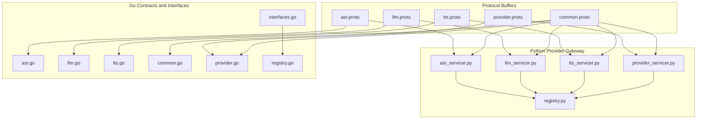
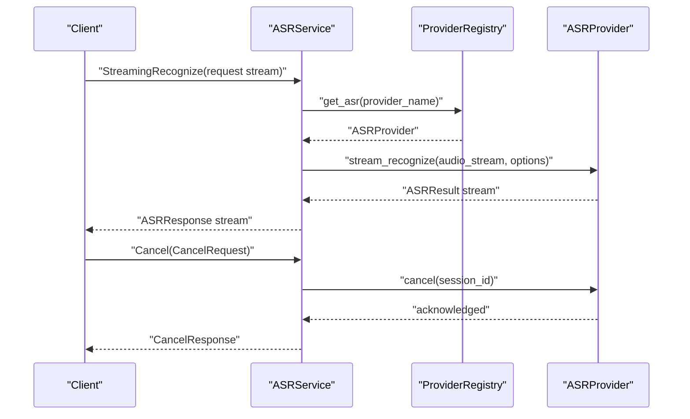
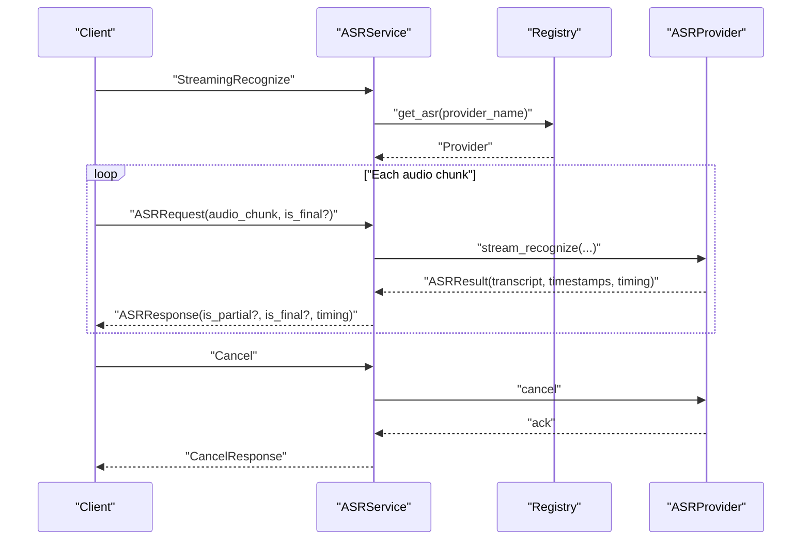
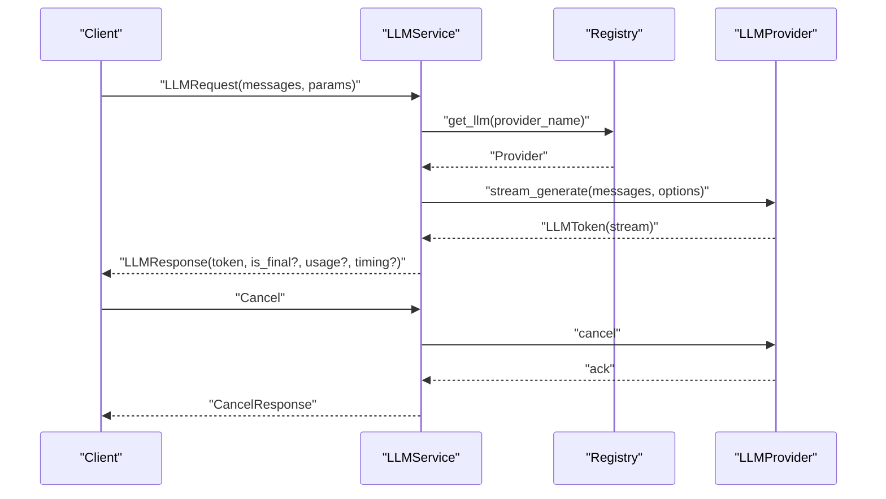
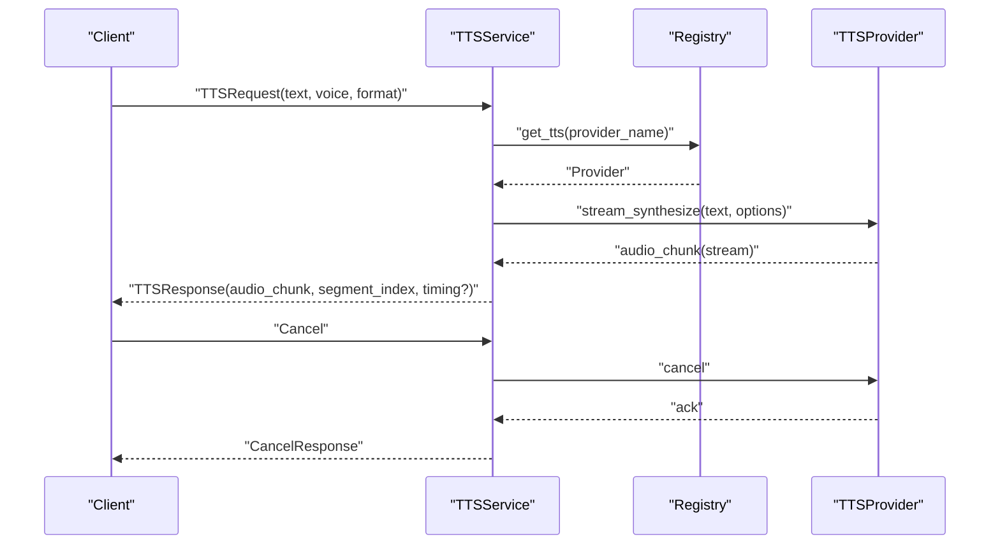
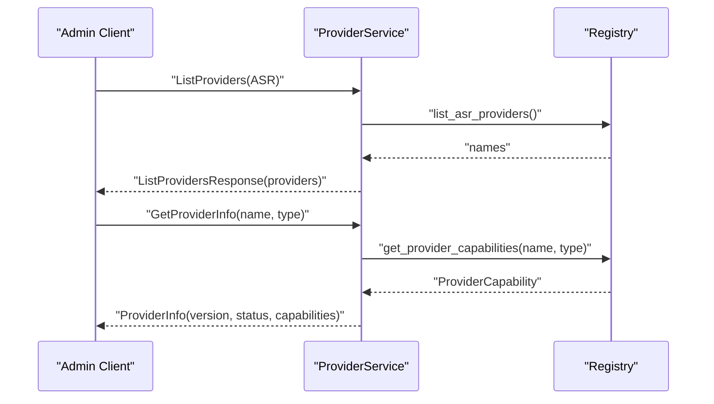
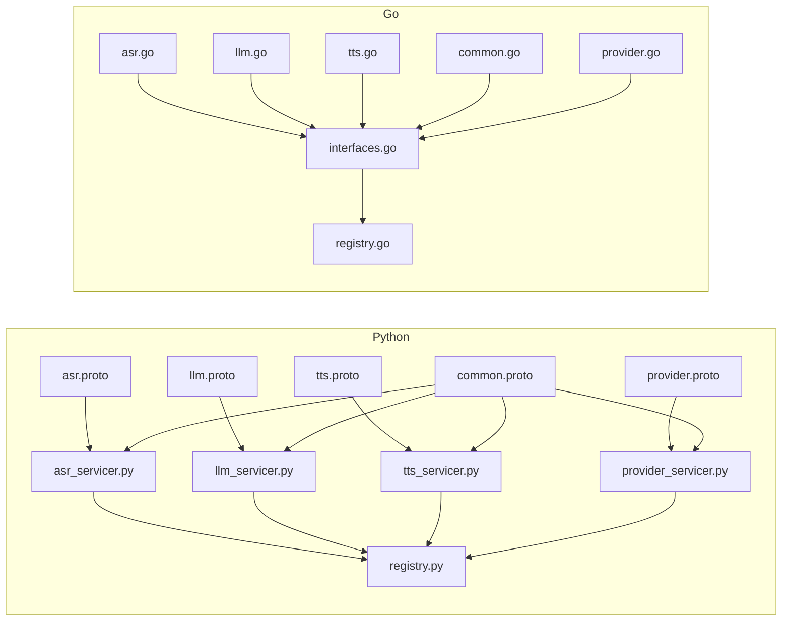

# gRPC Service Definitions

<cite>
**Referenced Files in This Document**
- [asr.proto](file://proto/asr.proto)
- [llm.proto](file://proto/llm.proto)
- [tts.proto](file://proto/tts.proto)
- [provider.proto](file://proto/provider.proto)
- [common.proto](file://proto/common.proto)
- [asr.go](file://go/pkg/contracts/asr.go)
- [llm.go](file://go/pkg/contracts/llm.go)
- [tts.go](file://go/pkg/contracts/tts.go)
- [common.go](file://go/pkg/contracts/common.go)
- [provider.go](file://go/pkg/contracts/provider.go)
- [interfaces.go](file://go/pkg/providers/interfaces.go)
- [registry.go](file://go/pkg/providers/registry.go)
- [asr_servicer.py](file://py/provider_gateway/app/grpc_api/asr_servicer.py)
- [llm_servicer.py](file://py/provider_gateway/app/grpc_api/llm_servicer.py)
- [tts_servicer.py](file://py/provider_gateway/app/grpc_api/tts_servicer.py)
- [provider_servicer.py](file://py/provider_gateway/app/grpc_api/provider_servicer.py)
- [registry.py](file://py/provider_gateway/app/core/registry.py)
</cite>

## Table of Contents
1. [Introduction](#introduction)
2. [Project Structure](#project-structure)
3. [Core Components](#core-components)
4. [Architecture Overview](#architecture-overview)
5. [Detailed Component Analysis](#detailed-component-analysis)
6. [Dependency Analysis](#dependency-analysis)
7. [Performance Considerations](#performance-considerations)
8. [Troubleshooting Guide](#troubleshooting-guide)
9. [Conclusion](#conclusion)

## Introduction
This document describes the gRPC service definitions used by CloudApp’s provider gateway for Automatic Speech Recognition (ASR), Large Language Model (LLM), and Text-to-Speech (TTS) providers. It covers the Protocol Buffer service contracts, method signatures, request/response message structures, streaming RPC patterns, provider registration and capability negotiation, and shared common data types. It also explains service interface design principles, versioning strategy, backward compatibility considerations, and performance implications of different message types and streaming approaches.

## Project Structure
The gRPC contracts are defined in Protocol Buffer files under the proto directory. The Python provider gateway implements the gRPC services and delegates to provider backends via a registry. The Go codebase defines internal contracts mirroring the protobuf messages and exposes provider interfaces and registries used by the orchestrator and media edge.

**Diagram sources**
- [asr.proto:1-53](file://proto/asr.proto#L1-L53)
- [llm.proto:1-59](file://proto/llm.proto#L1-L59)
- [tts.proto:1-45](file://proto/tts.proto#L1-L45)
- [provider.proto:1-63](file://proto/provider.proto#L1-L63)
- [common.proto:1-110](file://proto/common.proto#L1-L110)
- [asr_servicer.py:1-239](file://py/provider_gateway/app/grpc_api/asr_servicer.py#L1-L239)
- [llm_servicer.py:1-218](file://py/provider_gateway/app/grpc_api/llm_servicer.py#L1-L218)
- [tts_servicer.py:1-228](file://py/provider_gateway/app/grpc_api/tts_servicer.py#L1-L228)
- [provider_servicer.py:1-190](file://py/provider_gateway/app/grpc_api/provider_servicer.py#L1-L190)
- [registry.py:1-287](file://py/provider_gateway/app/core/registry.py#L1-L287)
- [asr.go:1-35](file://go/pkg/contracts/asr.go#L1-L35)
- [llm.go:1-36](file://go/pkg/contracts/llm.go#L1-L36)
- [tts.go:1-22](file://go/pkg/contracts/tts.go#L1-L22)
- [common.go:1-169](file://go/pkg/contracts/common.go#L1-L169)
- [provider.go:1-79](file://go/pkg/contracts/provider.go#L1-L79)
- [interfaces.go:1-107](file://go/pkg/providers/interfaces.go#L1-L107)
- [registry.go:1-262](file://go/pkg/providers/registry.go#L1-L262)

**Section sources**
- [asr.proto:1-53](file://proto/asr.proto#L1-L53)
- [llm.proto:1-59](file://proto/llm.proto#L1-L59)
- [tts.proto:1-45](file://proto/tts.proto#L1-L45)
- [provider.proto:1-63](file://proto/provider.proto#L1-L63)
- [common.proto:1-110](file://proto/common.proto#L1-L110)
- [asr_servicer.py:1-239](file://py/provider_gateway/app/grpc_api/asr_servicer.py#L1-L239)
- [llm_servicer.py:1-218](file://py/provider_gateway/app/grpc_api/llm_servicer.py#L1-L218)
- [tts_servicer.py:1-228](file://py/provider_gateway/app/grpc_api/tts_servicer.py#L1-L228)
- [provider_servicer.py:1-190](file://py/provider_gateway/app/grpc_api/provider_servicer.py#L1-L190)
- [registry.py:1-287](file://py/provider_gateway/app/core/registry.py#L1-L287)
- [asr.go:1-35](file://go/pkg/contracts/asr.go#L1-L35)
- [llm.go:1-36](file://go/pkg/contracts/llm.go#L1-L36)
- [tts.go:1-22](file://go/pkg/contracts/tts.go#L1-L22)
- [common.go:1-169](file://go/pkg/contracts/common.go#L1-L169)
- [provider.go:1-79](file://go/pkg/contracts/provider.go#L1-L79)
- [interfaces.go:1-107](file://go/pkg/providers/interfaces.go#L1-L107)
- [registry.go:1-262](file://go/pkg/providers/registry.go#L1-L262)

## Core Components
- ASRService: Bidirectional streaming for audio input and transcript output; supports cancellation and capability queries.
- LLMService: Server streaming for prompt input and token output; supports cancellation and capability queries.
- TTSService: Server streaming for text input and audio output; supports cancellation and capability queries.
- ProviderService: Provider management and discovery; lists providers by type, returns provider info, and health checks.

Shared common types:
- SessionContext: Cross-service session identifiers and metadata.
- AudioFormat and AudioEncoding: Audio format specifications.
- ProviderCapability: Capability flags and preferences exposed by providers.
- ProviderError, CancelRequest/CancelResponse, TimingMetadata, HealthCheck messages.

**Section sources**
- [asr.proto:10-19](file://proto/asr.proto#L10-L19)
- [llm.proto:10-19](file://proto/llm.proto#L10-L19)
- [tts.proto:10-19](file://proto/tts.proto#L10-L19)
- [provider.proto:27-36](file://proto/provider.proto#L27-L36)
- [common.proto:33-110](file://proto/common.proto#L33-L110)

## Architecture Overview
The provider gateway exposes gRPC services that accept standardized requests and return standardized responses. Each service delegates to a provider backend resolved via a registry. Providers implement a common interface and expose capabilities that inform negotiation and routing decisions.

**Diagram sources**
- [asr.proto:10-19](file://proto/asr.proto#L10-L19)
- [asr_servicer.py:42-122](file://py/provider_gateway/app/grpc_api/asr_servicer.py#L42-L122)
- [registry.py:85-113](file://py/provider_gateway/app/core/registry.py#L85-L113)
- [interfaces.go:21-35](file://go/pkg/providers/interfaces.go#L21-L35)

**Section sources**
- [asr.proto:10-19](file://proto/asr.proto#L10-L19)
- [asr_servicer.py:1-239](file://py/provider_gateway/app/grpc_api/asr_servicer.py#L1-L239)
- [registry.py:1-287](file://py/provider_gateway/app/core/registry.py#L1-L287)
- [interfaces.go:1-107](file://go/pkg/providers/interfaces.go#L1-L107)

## Detailed Component Analysis

### ASR Service Contract
- Service: ASRService
- Methods:
  - StreamingRecognize(stream ASRRequest) returns (stream ASRResponse): Bidirectional streaming for audio chunks and transcript updates.
  - Cancel(CancelRequest) returns (CancelResponse): Cancels ongoing recognition.
  - GetCapabilities(CapabilityRequest) returns (ProviderCapability): Negotiates provider capabilities.
- Request: ASRRequest includes SessionContext, audio_chunk, AudioFormat, language_hint, and is_final.
- Response: ASRResponse includes SessionContext, transcript, is_partial, is_final, confidence, language, word_timestamps, and TimingMetadata.

Implementation highlights:
- The Python servicer extracts session and provider name from the first request, resolves the provider from the registry, streams audio chunks, and yields transcript responses.
- WordTimestamps and TimingMetadata are mapped from internal models to protobuf messages.

**Diagram sources**
- [asr.proto:10-19](file://proto/asr.proto#L10-L19)
- [asr.proto:26-52](file://proto/asr.proto#L26-L52)
- [asr_servicer.py:42-122](file://py/provider_gateway/app/grpc_api/asr_servicer.py#L42-L122)
- [registry.py:85-113](file://py/provider_gateway/app/core/registry.py#L85-L113)

**Section sources**
- [asr.proto:10-19](file://proto/asr.proto#L10-L19)
- [asr.proto:26-52](file://proto/asr.proto#L26-L52)
- [asr.go:3-29](file://go/pkg/contracts/asr.go#L3-L29)
- [asr_servicer.py:1-239](file://py/provider_gateway/app/grpc_api/asr_servicer.py#L1-L239)

### LLM Service Contract
- Service: LLMService
- Methods:
  - StreamGenerate(LLMRequest) returns (stream LLMResponse): Server streaming for chat messages and token stream.
  - Cancel(CancelRequest) returns (CancelResponse): Cancels ongoing generation.
  - GetCapabilities(CapabilityRequest) returns (ProviderCapability): Negotiates provider capabilities.
- Request: LLMRequest includes SessionContext, repeated ChatMessage, generation parameters (max_tokens, temperature, top_p), stop_sequences, and provider_options.
- Response: LLMResponse includes SessionContext, token, is_final, finish_reason, UsageMetadata, and TimingMetadata.

Implementation highlights:
- The servicer converts ChatMessage arrays and options, streams tokens from the provider, and constructs UsageMetadata and TimingMetadata for responses.

**Diagram sources**
- [llm.proto:10-19](file://proto/llm.proto#L10-L19)
- [llm.proto:39-58](file://proto/llm.proto#L39-L58)
- [llm_servicer.py:38-101](file://py/provider_gateway/app/grpc_api/llm_servicer.py#L38-L101)
- [registry.py:114-141](file://py/provider_gateway/app/core/registry.py#L114-L141)

**Section sources**
- [llm.proto:10-19](file://proto/llm.proto#L10-L19)
- [llm.proto:39-58](file://proto/llm.proto#L39-L58)
- [llm.go:16-35](file://go/pkg/contracts/llm.go#L16-L35)
- [llm_servicer.py:1-218](file://py/provider_gateway/app/grpc_api/llm_servicer.py#L1-L218)

### TTS Service Contract
- Service: TTSService
- Methods:
  - StreamSynthesize(TTSRequest) returns (stream TTSResponse): Server streaming for text and audio chunks.
  - Cancel(CancelRequest) returns (CancelResponse): Cancels ongoing synthesis.
  - GetCapabilities(CapabilityRequest) returns (ProviderCapability): Negotiates provider capabilities.
- Request: TTSRequest includes SessionContext, text, voice_id, AudioFormat, segment_index, and provider_options.
- Response: TTSResponse includes SessionContext, audio_chunk, AudioFormat, segment_index, is_final, and TimingMetadata.

Implementation highlights:
- The servicer resolves the provider, builds TTS options including AudioFormat, streams audio chunks, and maps timing metadata.

**Diagram sources**
- [tts.proto:10-19](file://proto/tts.proto#L10-L19)
- [tts.proto:26-44](file://proto/tts.proto#L26-L44)
- [tts_servicer.py:41-100](file://py/provider_gateway/app/grpc_api/tts_servicer.py#L41-L100)
- [registry.py:142-169](file://py/provider_gateway/app/core/registry.py#L142-L169)

**Section sources**
- [tts.proto:10-19](file://proto/tts.proto#L10-L19)
- [tts.proto:26-44](file://proto/tts.proto#L26-L44)
- [tts.go:3-21](file://go/pkg/contracts/tts.go#L3-L21)
- [tts_servicer.py:1-228](file://py/provider_gateway/app/grpc_api/tts_servicer.py#L1-L228)

### Provider Registration and Discovery
- ProviderService:
  - ListProviders(ListProvidersRequest) returns (ListProvidersResponse): Lists providers filtered by ProviderType.
  - GetProviderInfo(GetProviderInfoRequest) returns (ProviderInfo): Returns detailed provider info including capabilities and status.
  - HealthCheck(HealthCheckRequest) returns (HealthCheckResponse): Reports serving status and version.
- ProviderInfo includes name, type, version, ProviderCapability, status, and metadata.
- ProviderType and ProviderStatus enums define provider categories and availability.

Implementation highlights:
- The Python ProviderServicer maps proto enums to internal capabilities, aggregates providers across types, and returns versioned responses.
- The registry caches provider instances keyed by name and configuration hash.

**Diagram sources**
- [provider.proto:27-36](file://proto/provider.proto#L27-L36)
- [provider.proto:44-56](file://proto/provider.proto#L44-L56)
- [provider_servicer.py:43-168](file://py/provider_gateway/app/grpc_api/provider_servicer.py#L43-L168)
- [registry.py:170-205](file://py/provider_gateway/app/core/registry.py#L170-L205)

**Section sources**
- [provider.proto:27-36](file://proto/provider.proto#L27-L36)
- [provider.proto:44-62](file://proto/provider.proto#L44-L62)
- [provider.go:54-79](file://go/pkg/contracts/provider.go#L54-L79)
- [provider_servicer.py:1-190](file://py/provider_gateway/app/grpc_api/provider_servicer.py#L1-L190)
- [registry.py:1-287](file://py/provider_gateway/app/core/registry.py#L1-L287)

### Common Data Types and Shared Contracts
- SessionContext: session_id, turn_id, generation_id, tenant_id, trace_id, timestamps, options, provider_name, model_name.
- AudioFormat: sample_rate, channels, AudioEncoding enum.
- AudioEncoding: PCM16, OPUS, G711_ULAW, G711_ALAW.
- ProviderCapability: streaming input/output flags, word timestamps support, voices support, interruptible generation, preferred sample rates, supported codecs.
- ProviderError: error code, message, provider_name, retriable flag, details.
- CancelRequest/CancelResponse: session context and reason for cancellation, acknowledgment and generation_id.
- TimingMetadata: start_time, end_time, duration_ms.
- HealthCheck: ServingStatus enum (UNKNOWN, SERVING, NOT_SERVING, SERVICE_UNKNOWN), service_name, version.

Go internal contracts mirror protobuf structures for internal processing and JSON marshaling.

**Section sources**
- [common.proto:9-110](file://proto/common.proto#L9-L110)
- [common.go:83-169](file://go/pkg/contracts/common.go#L83-L169)

### Service Interface Design Principles and Versioning
- Consistent cross-service SessionContext ensures traceability and correlation across ASR, LLM, and TTS.
- Standardized CancelRequest/CancelResponse enables uniform cancellation semantics.
- ProviderCapability flags enable capability negotiation and graceful fallbacks.
- ProviderService exposes HealthCheckResponse with version field for service versioning.
- Backward compatibility is preserved by optional fields and default values in protobuf messages.

Versioning strategy:
- ProviderService reports version in HealthCheckResponse.
- ProviderInfo includes version per provider listing.
- Capability flags allow providers to advertise support for optional features without breaking existing clients.

**Section sources**
- [common.proto:33-110](file://proto/common.proto#L33-L110)
- [provider.proto:86-102](file://proto/provider.proto#L86-L102)
- [provider_servicer.py:170-186](file://py/provider_gateway/app/grpc_api/provider_servicer.py#L170-L186)

## Dependency Analysis
The Python provider gateway depends on generated protobuf stubs and internal models. The Go contracts and interfaces define provider capabilities and registry resolution used by the orchestrator and media edge.

**Diagram sources**
- [asr.proto:1-53](file://proto/asr.proto#L1-L53)
- [llm.proto:1-59](file://proto/llm.proto#L1-L59)
- [tts.proto:1-45](file://proto/tts.proto#L1-L45)
- [provider.proto:1-63](file://proto/provider.proto#L1-L63)
- [common.proto:1-110](file://proto/common.proto#L1-L110)
- [asr_servicer.py:1-239](file://py/provider_gateway/app/grpc_api/asr_servicer.py#L1-L239)
- [llm_servicer.py:1-218](file://py/provider_gateway/app/grpc_api/llm_servicer.py#L1-L218)
- [tts_servicer.py:1-228](file://py/provider_gateway/app/grpc_api/tts_servicer.py#L1-L228)
- [provider_servicer.py:1-190](file://py/provider_gateway/app/grpc_api/provider_servicer.py#L1-L190)
- [registry.py:1-287](file://py/provider_gateway/app/core/registry.py#L1-L287)
- [asr.go:1-35](file://go/pkg/contracts/asr.go#L1-L35)
- [llm.go:1-36](file://go/pkg/contracts/llm.go#L1-L36)
- [tts.go:1-22](file://go/pkg/contracts/tts.go#L1-L22)
- [common.go:1-169](file://go/pkg/contracts/common.go#L1-L169)
- [provider.go:1-79](file://go/pkg/contracts/provider.go#L1-L79)
- [interfaces.go:1-107](file://go/pkg/providers/interfaces.go#L1-L107)
- [registry.go:1-262](file://go/pkg/providers/registry.go#L1-L262)

**Section sources**
- [asr.proto:1-53](file://proto/asr.proto#L1-L53)
- [llm.proto:1-59](file://proto/llm.proto#L1-L59)
- [tts.proto:1-45](file://proto/tts.proto#L1-L45)
- [provider.proto:1-63](file://proto/provider.proto#L1-L63)
- [common.proto:1-110](file://proto/common.proto#L1-L110)
- [asr_servicer.py:1-239](file://py/provider_gateway/app/grpc_api/asr_servicer.py#L1-L239)
- [llm_servicer.py:1-218](file://py/provider_gateway/app/grpc_api/llm_servicer.py#L1-L218)
- [tts_servicer.py:1-228](file://py/provider_gateway/app/grpc_api/tts_servicer.py#L1-L228)
- [provider_servicer.py:1-190](file://py/provider_gateway/app/grpc_api/provider_servicer.py#L1-L190)
- [registry.py:1-287](file://py/provider_gateway/app/core/registry.py#L1-L287)
- [interfaces.go:1-107](file://go/pkg/providers/interfaces.go#L1-L107)
- [registry.go:1-262](file://go/pkg/providers/registry.go#L1-L262)

## Performance Considerations
- Streaming RPCs:
  - ASRService.StreamingRecognize and TTSService.StreamSynthesize use server or bidirectional streaming to minimize latency and memory footprint by emitting results incrementally.
  - LLMService.StreamGenerate uses server streaming to deliver tokens progressively, reducing time-to-first-token and enabling early termination.
- Message sizes:
  - ASRRequest.audio_chunk and TTSResponse.audio_chunk carry binary payloads; choose appropriate AudioFormat to balance quality and bandwidth.
  - LLMRequest supports stop_sequences and max_tokens to bound response size.
- Timing and telemetry:
  - TimingMetadata and UsageMetadata help measure performance and cost; use them to tune provider options and detect regressions.
- Capability negotiation:
  - ProviderCapability flags guide clients to select providers that support streaming input/output and interruptible generation, improving responsiveness and resource utilization.

[No sources needed since this section provides general guidance]

## Troubleshooting Guide
Common error handling patterns:
- ProviderError encapsulates provider-specific errors with retriable flag and details for diagnostics.
- CancelRequest/CancelResponse enables explicit cancellation signaling; ensure session_id and generation_id are propagated consistently.
- HealthCheckResponse indicates service availability and version; use it to verify provider gateway health.

Operational tips:
- Verify provider registration and capability negotiation via ProviderService.GetProviderInfo and GetCapabilities.
- Monitor streaming RPCs for abrupt terminations; implement retries with exponential backoff for retriable ProviderError codes.
- Validate SessionContext fields across services to ensure end-to-end traceability.

**Section sources**
- [common.proto:54-61](file://proto/common.proto#L54-L61)
- [common.proto:63-73](file://proto/common.proto#L63-L73)
- [common.proto:86-102](file://proto/common.proto#L86-L102)
- [provider_servicer.py:170-186](file://py/provider_gateway/app/grpc_api/provider_servicer.py#L170-L186)

## Conclusion
CloudApp’s gRPC service definitions provide a consistent, capability-driven contract for ASR, LLM, and TTS providers. The shared SessionContext, standardized cancellation, and capability negotiation enable flexible provider selection and robust integrations. The Python provider gateway implements these contracts with streaming RPCs and a registry-based provider resolution, while the Go contracts and interfaces formalize provider capabilities and registry behavior. Versioning via ProviderService and capability flags support backward compatibility and progressive feature adoption.