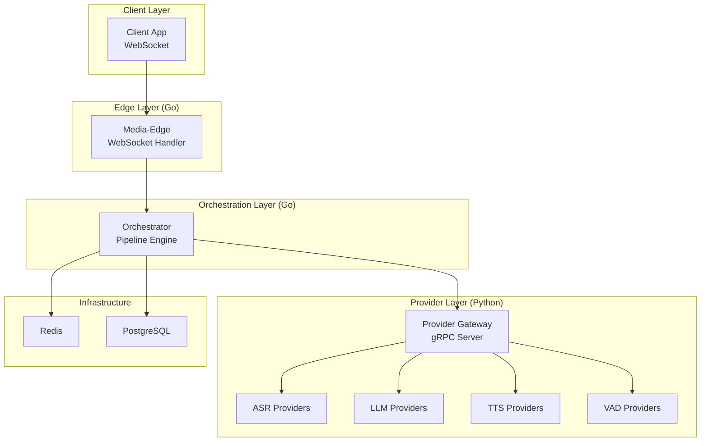
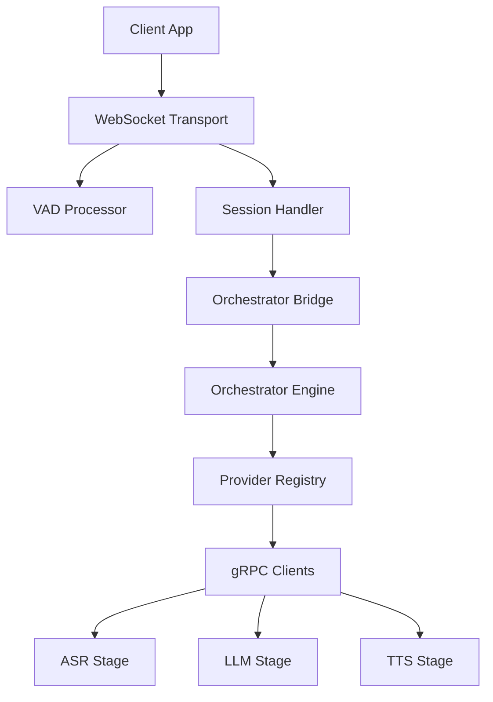
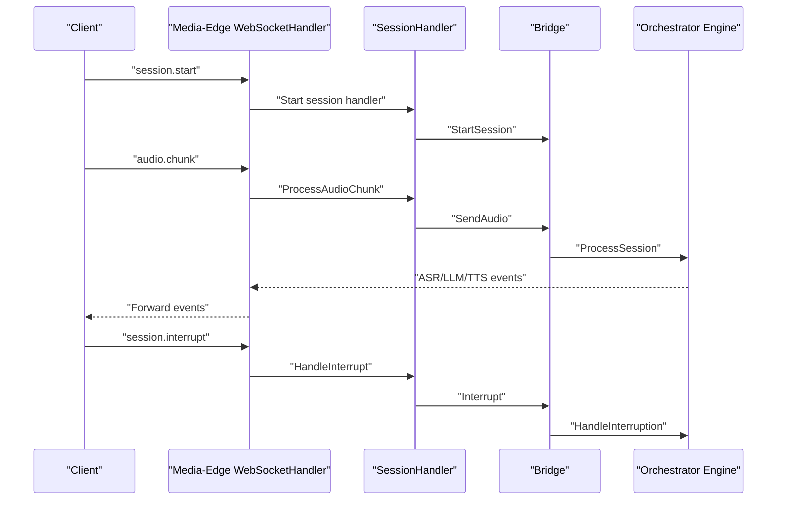
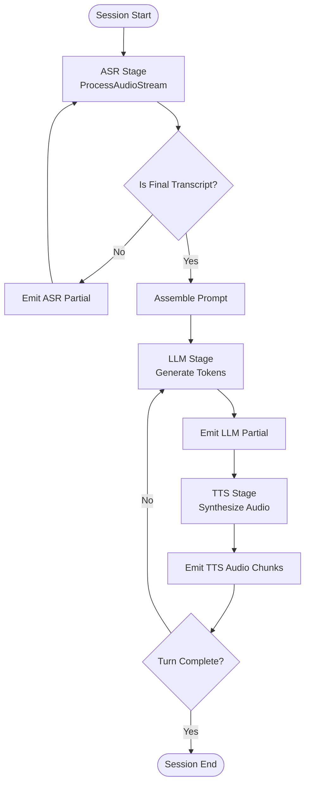
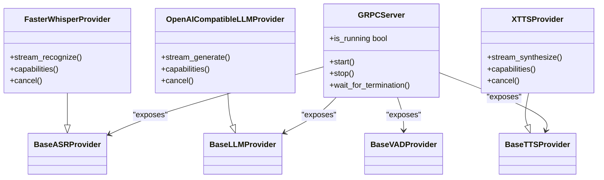
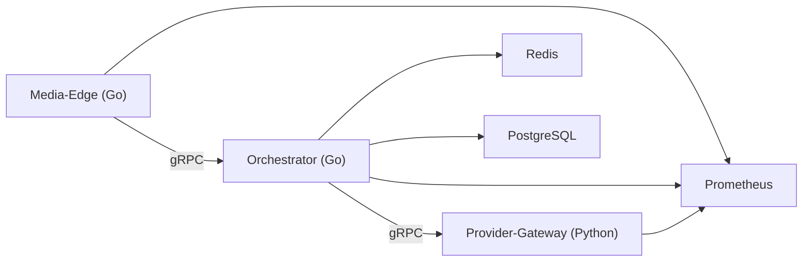

# System Overview

<cite>
**Referenced Files in This Document**
- [README.md](file://README.md)
- [go/media-edge/cmd/main.go](file://go/media-edge/cmd/main.go)
- [go/media-edge/internal/handler/websocket.go](file://go/media-edge/internal/handler/websocket.go)
- [go/media-edge/internal/handler/session_handler.go](file://go/media-edge/internal/handler/session_handler.go)
- [go/orchestrator/cmd/main.go](file://go/orchestrator/cmd/main.go)
- [go/orchestrator/internal/pipeline/engine.go](file://go/orchestrator/internal/pipeline/engine.go)
- [go/pkg/config/config.go](file://go/pkg/config/config.go)
- [go/pkg/providers/registry.go](file://go/pkg/providers/registry.go)
- [py/provider_gateway/main.py](file://py/provider_gateway/main.py)
- [py/provider_gateway/app/grpc_api/server.py](file://py/provider_gateway/app/grpc_api/server.py)
- [py/provider_gateway/app/providers/asr/faster_whisper.py](file://py/provider_gateway/app/providers/asr/faster_whisper.py)
- [py/provider_gateway/app/providers/llm/openai_compatible.py](file://py/provider_gateway/app/providers/llm/openai_compatible.py)
- [py/provider_gateway/app/providers/tts/xtts.py](file://py/provider_gateway/app/providers/tts/xtts.py)
- [infra/k8s/media-edge.yaml](file://infra/k8s/media-edge.yaml)
- [infra/k8s/orchestrator.yaml](file://infra/k8s/orchestrator.yaml)
</cite>

## Table of Contents
1. [Introduction](#introduction)
2. [Project Structure](#project-structure)
3. [Core Components](#core-components)
4. [Architecture Overview](#architecture-overview)
5. [Detailed Component Analysis](#detailed-component-analysis)
6. [Dependency Analysis](#dependency-analysis)
7. [Performance Considerations](#performance-considerations)
8. [Troubleshooting Guide](#troubleshooting-guide)
9. [Conclusion](#conclusion)

## Introduction
CloudApp is a production-grade, real-time voice conversation platform built with Go and Python. It delivers low-latency, bidirectional audio streaming over WebSocket, supports barge-in interruptions, and provides a pluggable AI provider architecture. The system is designed around a three-tier microservices architecture:
- Media-Edge (Go): WebSocket gateway responsible for real-time audio ingestion, VAD, interruption handling, and client event delivery.
- Orchestrator (Go): Pipeline coordinator that manages the ASR → LLM → TTS workflow, session state machine, and turn management.
- Provider-Gateway (Python): gRPC service exposing ASR, LLM, and TTS providers to the Orchestrator.

The system emphasizes real-time processing, pluggable providers, and horizontal scalability, with observability, multi-tenancy, and robust session lifecycle management.

## Project Structure
The repository is organized into:
- go/: Core services (Media-Edge, Orchestrator) and shared libraries (audio processing, config, providers, session, events, observability).
- py/provider_gateway/: Python-based provider gateway implementing gRPC services for ASR, LLM, TTS, and VAD providers.
- proto/: Protocol Buffer definitions for provider contracts.
- infra/: Kubernetes manifests and Docker configurations for deployment.
- examples/: Sample configurations for mock and cloud/local providers.
- docs/: Architectural and operational documentation.

**Diagram sources**
- [README.md:5-35](file://README.md#L5-L35)
- [go/media-edge/cmd/main.go:30-180](file://go/media-edge/cmd/main.go#L30-L180)
- [go/orchestrator/cmd/main.go:26-193](file://go/orchestrator/cmd/main.go#L26-L193)
- [py/provider_gateway/app/grpc_api/server.py:25-134](file://py/provider_gateway/app/grpc_api/server.py#L25-L134)

**Section sources**
- [README.md:47-102](file://README.md#L47-L102)

## Core Components
- Media-Edge (Go)
  - Purpose: WebSocket gateway for real-time audio ingestion, VAD, interruption handling, and client event delivery.
  - Responsibilities: Upgrade HTTP to WebSocket, manage per-connection state, normalize and chunk audio, detect speech, forward audio to Orchestrator, and stream events to the client.
  - Key entry point: [go/media-edge/cmd/main.go:30-180](file://go/media-edge/cmd/main.go#L30-L180)
  - WebSocket handler: [go/media-edge/internal/handler/websocket.go:94-192](file://go/media-edge/internal/handler/websocket.go#L94-L192)
  - Session handler: [go/media-edge/internal/handler/session_handler.go:119-174](file://go/media-edge/internal/handler/session_handler.go#L119-L174)

- Orchestrator (Go)
  - Purpose: Coordinates the ASR → LLM → TTS pipeline, maintains session state machine, and manages turns.
  - Responsibilities: Manage active sessions, run ASR stage, assemble prompts, run LLM generation, drive incremental TTS, handle interruptions, and emit events.
  - Entry point: [go/orchestrator/cmd/main.go:26-193](file://go/orchestrator/cmd/main.go#L26-L193)
  - Engine: [go/orchestrator/internal/pipeline/engine.go:108-208](file://go/orchestrator/internal/pipeline/engine.go#L108-L208)

- Provider-Gateway (Python)
  - Purpose: Exposes ASR, LLM, TTS, and VAD providers via gRPC to the Orchestrator.
  - Responsibilities: Host provider implementations, serve gRPC endpoints, handle streaming, cancellation, and provider capabilities.
  - Entry point: [py/provider_gateway/main.py:1-13](file://py/provider_gateway/main.py#L1-L13)
  - gRPC server: [py/provider_gateway/app/grpc_api/server.py:25-134](file://py/provider_gateway/app/grpc_api/server.py#L25-L134)
  - Example providers: [py/provider_gateway/app/providers/asr/faster_whisper.py:104-218](file://py/provider_gateway/app/providers/asr/faster_whisper.py#L104-L218), [py/provider_gateway/app/providers/llm/openai_compatible.py:87-237](file://py/provider_gateway/app/providers/llm/openai_compatible.py#L87-L237), [py/provider_gateway/app/providers/tts/xtts.py:57-97](file://py/provider_gateway/app/providers/tts/xtts.py#L57-L97)

**Section sources**
- [README.md:5-35](file://README.md#L5-L35)
- [go/media-edge/cmd/main.go:30-180](file://go/media-edge/cmd/main.go#L30-L180)
- [go/orchestrator/cmd/main.go:26-193](file://go/orchestrator/cmd/main.go#L26-L193)
- [py/provider_gateway/main.py:1-13](file://py/provider_gateway/main.py#L1-L13)
- [py/provider_gateway/app/grpc_api/server.py:25-134](file://py/provider_gateway/app/grpc_api/server.py#L25-L134)

## Architecture Overview
The system enforces a strict separation of concerns:
- Media-Edge focuses on real-time audio transport and client interaction.
- Orchestrator owns the pipeline orchestration and session state.
- Provider-Gateway encapsulates AI providers behind a unified gRPC interface.

**Diagram sources**
- [go/media-edge/internal/handler/websocket.go:220-258](file://go/media-edge/internal/handler/websocket.go#L220-L258)
- [go/media-edge/internal/handler/session_handler.go:119-174](file://go/media-edge/internal/handler/session_handler.go#L119-L174)
- [go/orchestrator/internal/pipeline/engine.go:17-106](file://go/orchestrator/internal/pipeline/engine.go#L17-L106)
- [go/pkg/providers/registry.go:14-40](file://go/pkg/providers/registry.go#L14-L40)

## Detailed Component Analysis

### Media-Edge: WebSocket Gateway
Media-Edge is the real-time ingress for client audio and control messages. It:
- Upgrades HTTP to WebSocket, applies CORS/security middleware, and exposes health/readiness/metrics endpoints.
- Manages per-connection state, normalizes audio, detects speech via VAD, and forwards audio to the Orchestrator.
- Streams events to the client (ASR partial/final, LLM partial text, TTS audio chunks, turn transitions, interruptions).

**Diagram sources**
- [go/media-edge/internal/handler/websocket.go:260-374](file://go/media-edge/internal/handler/websocket.go#L260-L374)
- [go/media-edge/internal/handler/session_handler.go:176-225](file://go/media-edge/internal/handler/session_handler.go#L176-L225)
- [go/orchestrator/internal/pipeline/engine.go:108-208](file://go/orchestrator/internal/pipeline/engine.go#L108-L208)

**Section sources**
- [go/media-edge/cmd/main.go:94-180](file://go/media-edge/cmd/main.go#L94-L180)
- [go/media-edge/internal/handler/websocket.go:94-192](file://go/media-edge/internal/handler/websocket.go#L94-L192)
- [go/media-edge/internal/handler/session_handler.go:119-174](file://go/media-edge/internal/handler/session_handler.go#L119-L174)

### Orchestrator: Pipeline Orchestration
The Orchestrator coordinates the end-to-end pipeline:
- Creates and manages session contexts, FSM transitions, and turn state.
- Runs ASR stage to produce transcripts, assembles prompts, runs LLM generation, and drives incremental TTS.
- Handles interruptions by cancelling active generations and committing only spoken text to history.

**Diagram sources**
- [go/orchestrator/internal/pipeline/engine.go:108-208](file://go/orchestrator/internal/pipeline/engine.go#L108-L208)
- [go/orchestrator/internal/pipeline/engine.go:210-375](file://go/orchestrator/internal/pipeline/engine.go#L210-L375)

**Section sources**
- [go/orchestrator/cmd/main.go:108-120](file://go/orchestrator/cmd/main.go#L108-L120)
- [go/orchestrator/internal/pipeline/engine.go:17-106](file://go/orchestrator/internal/pipeline/engine.go#L17-L106)

### Provider-Gateway: Pluggable AI Providers
The Provider-Gateway exposes providers via gRPC to the Orchestrator:
- Provides ASR, LLM, TTS, and VAD services.
- Implements provider capabilities, streaming, cancellation, and error handling.
- Example providers include Faster Whisper (ASR), OpenAI-compatible (LLM), and XTTS (TTS).

**Diagram sources**
- [py/provider_gateway/app/grpc_api/server.py:25-134](file://py/provider_gateway/app/grpc_api/server.py#L25-L134)
- [py/provider_gateway/app/providers/asr/faster_whisper.py:15-102](file://py/provider_gateway/app/providers/asr/faster_whisper.py#L15-L102)
- [py/provider_gateway/app/providers/llm/openai_compatible.py:18-85](file://py/provider_gateway/app/providers/llm/openai_compatible.py#L18-L85)
- [py/provider_gateway/app/providers/tts/xtts.py:14-55](file://py/provider_gateway/app/providers/tts/xtts.py#L14-L55)

**Section sources**
- [py/provider_gateway/main.py:1-13](file://py/provider_gateway/main.py#L1-L13)
- [py/provider_gateway/app/grpc_api/server.py:25-134](file://py/provider_gateway/app/grpc_api/server.py#L25-L134)
- [py/provider_gateway/app/providers/asr/faster_whisper.py:104-218](file://py/provider_gateway/app/providers/asr/faster_whisper.py#L104-L218)
- [py/provider_gateway/app/providers/llm/openai_compatible.py:87-237](file://py/provider_gateway/app/providers/llm/openai_compatible.py#L87-L237)
- [py/provider_gateway/app/providers/tts/xtts.py:57-97](file://py/provider_gateway/app/providers/tts/xtts.py#L57-L97)

## Dependency Analysis
- Technology Choices
  - Go for core services (Media-Edge, Orchestrator): prioritizes concurrency, low-latency event loops, and efficient HTTP/WebSocket handling.
  - Python for providers: flexibility to integrate diverse AI libraries and frameworks (e.g., faster-whisper, httpx, Coqui XTTS).
- Inter-service Communication
  - Media-Edge ↔ Orchestrator: in-process bridge pattern in MVP; in production, this will likely be a message bus or RPC channel.
  - Orchestrator ↔ Provider-Gateway: gRPC for typed, streaming, cancellable provider calls.
- Persistence and Observability
  - Redis for session state and caching; PostgreSQL for durable persistence.
  - Prometheus metrics and OpenTelemetry tracing enabled across services.

**Diagram sources**
- [go/media-edge/cmd/main.go:80-82](file://go/media-edge/cmd/main.go#L80-L82)
- [go/orchestrator/cmd/main.go:100-106](file://go/orchestrator/cmd/main.go#L100-L106)
- [py/provider_gateway/app/grpc_api/server.py:66-81](file://py/provider_gateway/app/grpc_api/server.py#L66-L81)

**Section sources**
- [go/pkg/config/config.go:9-18](file://go/pkg/config/config.go#L9-L18)
- [go/pkg/providers/registry.go:14-40](file://go/pkg/providers/registry.go#L14-L40)

## Performance Considerations
- Real-time audio processing
  - Media-Edge normalizes and chunks audio to fixed frames, applies VAD, and forwards audio asynchronously to minimize latency.
  - Orchestrator uses concurrent LLM token streaming and incremental TTS to reduce time-to-first-audio.
- Scalability
  - Stateless Media-Edge pods scale horizontally behind a load balancer; session state is stored in Redis.
  - Provider-Gateway scales independently; Orchestrator can spawn multiple pipeline workers per session.
- Latency instrumentation
  - Timestamp tracking and metrics capture key moments (ASR final, LLM first token, TTS first chunk, interruption stop) to monitor end-to-end latency.

[No sources needed since this section provides general guidance]

## Troubleshooting Guide
- Health and Readiness
  - Media-Edge: /health and /ready endpoints expose service status; verify probes in Kubernetes manifests.
  - Orchestrator: /health and /ready endpoints check Redis connectivity.
- Provider Connectivity
  - Ensure PROVIDER_GATEWAY_ADDRESS is set in Orchestrator and reachable from the cluster.
  - Verify gRPC server is listening on the configured port and max message sizes are sufficient.
- Session Lifecycle
  - Confirm session state transitions align with expected FSM events; check for interruptions and partial/ final events.
- Metrics and Tracing
  - Prometheus scraping endpoints are annotated in Kubernetes manifests; verify scrape targets and dashboards.

**Section sources**
- [go/media-edge/cmd/main.go:99-121](file://go/media-edge/cmd/main.go#L99-L121)
- [go/orchestrator/cmd/main.go:125-145](file://go/orchestrator/cmd/main.go#L125-L145)
- [infra/k8s/media-edge.yaml:57-72](file://infra/k8s/media-edge.yaml#L57-L72)
- [infra/k8s/orchestrator.yaml:59-74](file://infra/k8s/orchestrator.yaml#L59-L74)

## Conclusion
CloudApp’s three-tier microservices architecture cleanly separates real-time transport, orchestration, and AI provider concerns. Go’s strengths in concurrency and networking power the Media-Edge and Orchestrator, while Python’s flexibility enables rapid integration of diverse AI providers. The result is a scalable, observable, and pluggable platform optimized for low-latency, interruption-enabled voice conversations.