# Audio Buffering & Chunking

<cite>
**Referenced Files in This Document**
- [buffer.go](file://go/pkg/audio/buffer.go)
- [chunk.go](file://go/pkg/audio/chunk.go)
- [format.go](file://go/pkg/audio/format.go)
- [playout.go](file://go/pkg/audio/playout.go)
- [resample.go](file://go/pkg/audio/resample.go)
- [audio_test.go](file://go/pkg/audio/audio_test.go)
- [common.go](file://go/pkg/contracts/common.go)
- [asr.go](file://go/pkg/contracts/asr.go)
- [tts.go](file://go/pkg/contracts/tts.go)
- [engine.go](file://go/orchestrator/internal/pipeline/engine.go)
- [asr_stage.go](file://go/orchestrator/internal/pipeline/asr_stage.go)
- [tts_stage.go](file://go/orchestrator/internal/pipeline/tts_stage.go)
</cite>

## Table of Contents
1. [Introduction](#introduction)
2. [Project Structure](#project-structure)
3. [Core Components](#core-components)
4. [Architecture Overview](#architecture-overview)
5. [Detailed Component Analysis](#detailed-component-analysis)
6. [Dependency Analysis](#dependency-analysis)
7. [Performance Considerations](#performance-considerations)
8. [Troubleshooting Guide](#troubleshooting-guide)
9. [Conclusion](#conclusion)

## Introduction
This document explains CloudApp’s audio buffering and chunking mechanisms used in real-time audio processing. It covers buffer initialization, chunk allocation, memory optimization, frame-based processing, buffer boundary handling, size calculations based on audio profiles, overflow prevention, underflow handling, circular buffer implementations, and synchronization across processing stages. Practical examples illustrate buffer operations, chunk extraction, and latency/performance trade-offs.

## Project Structure
The audio pipeline spans several packages:
- Buffering and chunking utilities live in the audio package.
- Contracts define shared types for audio formats and provider messages.
- The orchestrator pipeline integrates audio processing stages (ASR, LLM, TTS) with buffering and playout tracking.

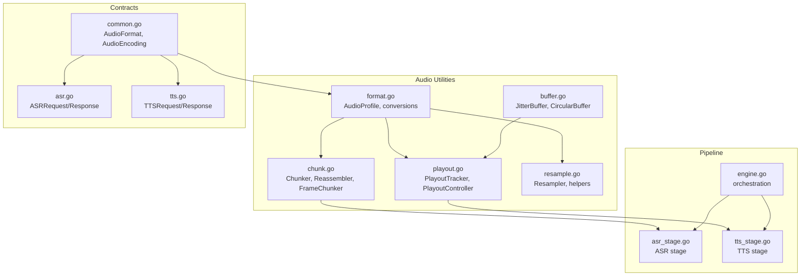

**Diagram sources**
- [format.go:11-140](file://go/pkg/audio/format.go#L11-L140)
- [chunk.go:7-230](file://go/pkg/audio/chunk.go#L7-L230)
- [buffer.go:16-334](file://go/pkg/audio/buffer.go#L16-L334)
- [playout.go:9-383](file://go/pkg/audio/playout.go#L9-L383)
- [resample.go:8-173](file://go/pkg/audio/resample.go#L8-L173)
- [common.go:98-102](file://go/pkg/contracts/common.go#L98-L102)
- [asr.go:3-29](file://go/pkg/contracts/asr.go#L3-L29)
- [tts.go:3-21](file://go/pkg/contracts/tts.go#L3-L21)
- [engine.go](file://go/orchestrator/internal/pipeline/engine.go)
- [asr_stage.go](file://go/orchestrator/internal/pipeline/asr_stage.go)
- [tts_stage.go](file://go/orchestrator/internal/pipeline/tts_stage.go)

**Section sources**
- [format.go:11-140](file://go/pkg/audio/format.go#L11-L140)
- [chunk.go:7-230](file://go/pkg/audio/chunk.go#L7-L230)
- [buffer.go:16-334](file://go/pkg/audio/buffer.go#L16-L334)
- [playout.go:9-383](file://go/pkg/audio/playout.go#L9-L383)
- [resample.go:8-173](file://go/pkg/audio/resample.go#L8-L173)
- [common.go:98-102](file://go/pkg/contracts/common.go#L98-L102)
- [asr.go:3-29](file://go/pkg/contracts/asr.go#L3-L29)
- [tts.go:3-21](file://go/pkg/contracts/tts.go#L3-L21)

## Core Components
- AudioProfile: Defines sample rate, channels, encoding, and frame size; computes bytes-per-sample/frame and conversions between bytes/duration.
- Chunker: Accumulates incoming audio bytes and emits fixed-size frames via callbacks; supports flushing partial frames.
- Reassembler: Reorders out-of-order chunks by sequence number and emits contiguous data.
- JitterBuffer: Thread-safe FIFO buffer with backpressure, notifications, and stats; prevents overflow and handles closure.
- CircularBuffer: Fixed-size ring buffer for continuous streaming with overwrite-on-full semantics.
- PlayoutController: Integrates JitterBuffer with PlayoutTracker to track playback progress and detect underruns.
- Resampler: Provides linear interpolation resampling between common rates; placeholder for higher-quality sinc resampling.

**Section sources**
- [format.go:11-140](file://go/pkg/audio/format.go#L11-L140)
- [chunk.go:7-230](file://go/pkg/audio/chunk.go#L7-L230)
- [buffer.go:16-334](file://go/pkg/audio/buffer.go#L16-L334)
- [playout.go:299-383](file://go/pkg/audio/playout.go#L299-L383)
- [resample.go:8-173](file://go/pkg/audio/resample.go#L8-L173)

## Architecture Overview
Real-time audio flows through the pipeline as follows:
- Incoming audio is chunked into fixed-size frames based on the configured AudioProfile.
- Frames are enqueued into a JitterBuffer for downstream processing.
- A PlayoutController coordinates playback, tracking bytes and notifying underruns.
- Optional resampling aligns audio to internal canonical rates.
- Outbound audio is reassembled and streamed to clients.

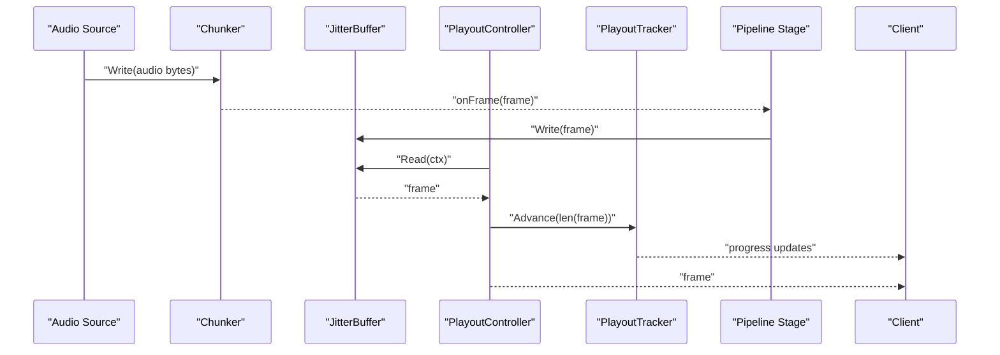

**Diagram sources**
- [chunk.go:23-40](file://go/pkg/audio/chunk.go#L23-L40)
- [buffer.go:39-95](file://go/pkg/audio/buffer.go#L39-L95)
- [playout.go:307-382](file://go/pkg/audio/playout.go#L307-L382)

## Detailed Component Analysis

### Audio Profiles and Frame Size Calculations
- AudioProfile encapsulates sample rate, channels, encoding, and frame size in samples.
- Bytes-per-sample depends on encoding; Bytes-per-frame = FrameSize × Channels × Bytes-per-sample.
- DurationFromBytes and BytesFromDuration convert between byte counts and durations.
- Canonical and standard profiles (internal, telephony, WebRTC) define typical 10 ms frames.

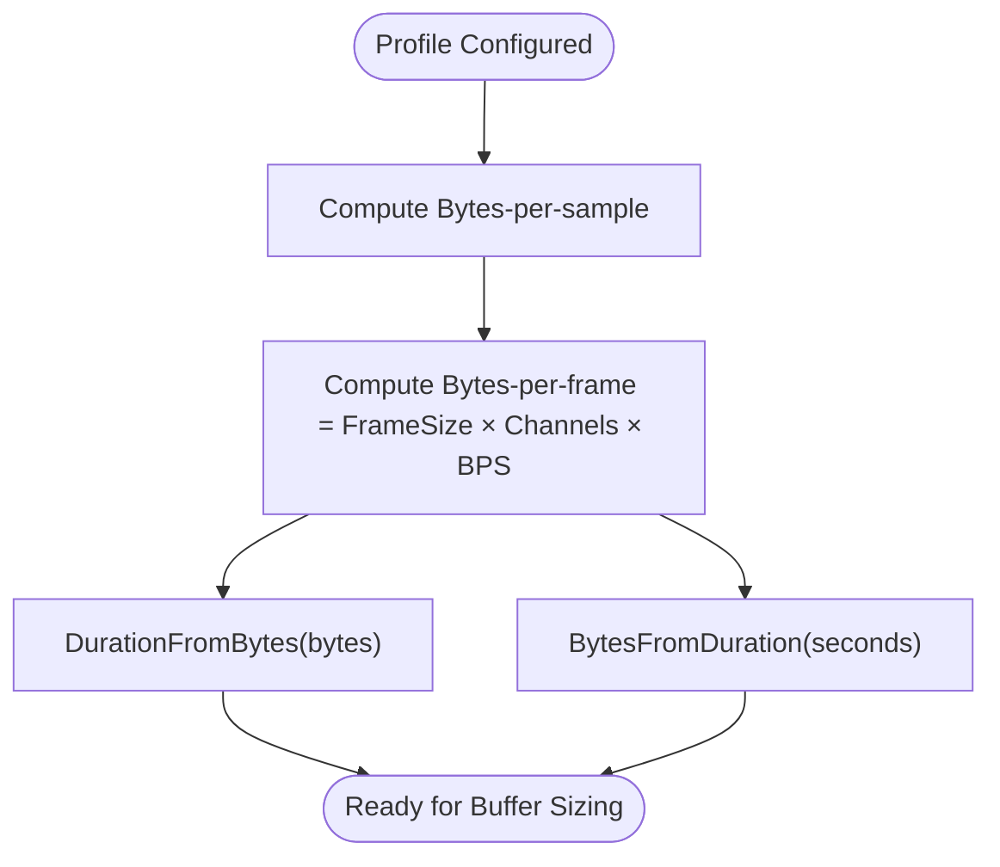

**Diagram sources**
- [format.go:19-49](file://go/pkg/audio/format.go#L19-L49)

**Section sources**
- [format.go:11-140](file://go/pkg/audio/format.go#L11-L140)
- [audio_test.go:504-628](file://go/pkg/audio/audio_test.go#L504-L628)

### Chunk Allocation and Frame-Based Processing
- Chunker accumulates bytes and emits complete frames; remaining partial data can be flushed.
- Static chunking produces fixed-size frames without retaining state.
- FrameChunker wraps Chunker with an AudioProfile-derived frame size.

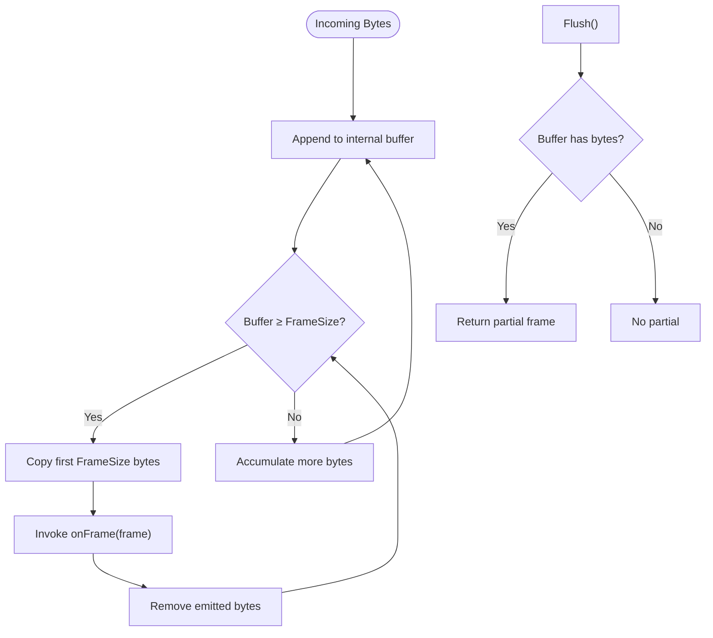

**Diagram sources**
- [chunk.go:23-53](file://go/pkg/audio/chunk.go#L23-L53)
- [chunk.go:76-101](file://go/pkg/audio/chunk.go#L76-L101)
- [chunk.go:192-230](file://go/pkg/audio/chunk.go#L192-L230)

**Section sources**
- [chunk.go:7-230](file://go/pkg/audio/chunk.go#L7-L230)
- [audio_test.go:107-218](file://go/pkg/audio/audio_test.go#L107-L218)

### Buffer Initialization and Backpressure (JitterBuffer)
- JitterBuffer stores frames as byte slices with a maximum capacity.
- Write blocks or returns an error when full; Read waits for data or context cancellation.
- TryRead provides non-blocking reads; Peek inspects the oldest frame without removal.
- Stats expose frame count, total bytes, capacity, and state flags.

```mermaid
classDiagram
class JitterBuffer {
-mu : RWMutex
-buffer : [][]byte
-maxSize : int
-closed : bool
-notifyCh : chan struct{}
-readTimeout : time.Duration
+Write(frame []byte) error
+Read(ctx) ([]byte, error)
+TryRead() ([]byte, bool)
+Peek() ([]byte, bool)
+Len() int
+IsFull() bool
+Available() int
+Close() void
+IsClosed() bool
+Clear() void
+SetReadTimeout(timeout)
+Stats() BufferStats
}
class BufferedAudioWriter {
-buffer : JitterBuffer
+Write([]byte) (int, error)
}
class BufferedAudioReader {
-buffer : JitterBuffer
-ctx : context.Context
+Read([]byte) (int, error)
}
BufferedAudioWriter --> JitterBuffer : "wraps"
BufferedAudioReader --> JitterBuffer : "wraps"
```

**Diagram sources**
- [buffer.go:16-251](file://go/pkg/audio/buffer.go#L16-L251)

**Section sources**
- [buffer.go:16-334](file://go/pkg/audio/buffer.go#L16-L334)
- [audio_test.go:220-390](file://go/pkg/audio/audio_test.go#L220-L390)

### Circular Buffer Implementation
- CircularBuffer maintains read/write positions and a count within a fixed-size array.
- Write overwrites the oldest byte when full; Read consumes bytes in order.
- Useful for continuous capture/playout streams where recent data is prioritized.

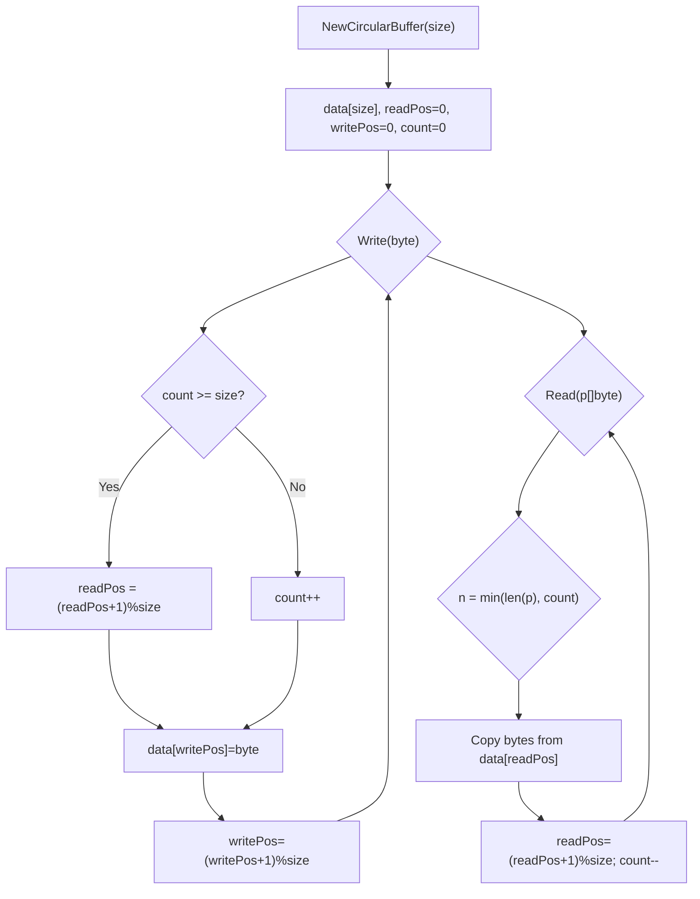

**Diagram sources**
- [buffer.go:252-334](file://go/pkg/audio/buffer.go#L252-L334)

**Section sources**
- [buffer.go:252-334](file://go/pkg/audio/buffer.go#L252-L334)

### Buffer Boundary Handling and Overflow Prevention
- JitterBuffer prevents overflow by rejecting writes when at capacity and signaling via notification channel.
- On close, pending frames remain readable until drained; subsequent reads yield closed-buffer errors.
- TryRead avoids blocking and returns false when empty.

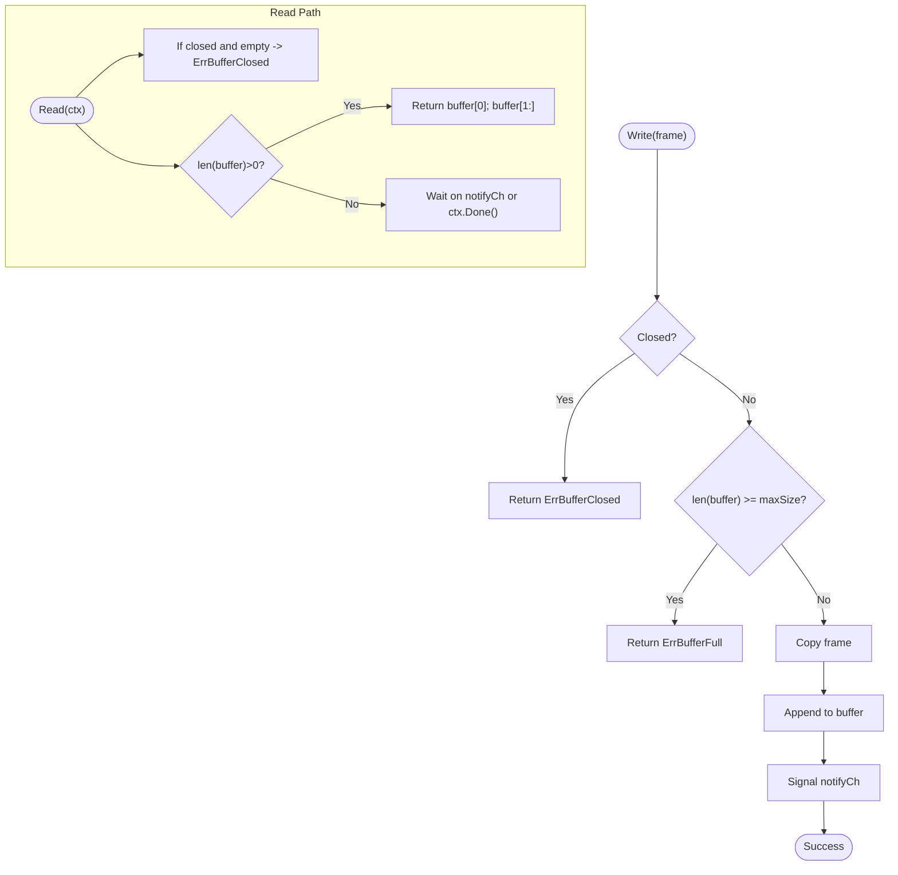

**Diagram sources**
- [buffer.go:39-95](file://go/pkg/audio/buffer.go#L39-L95)

**Section sources**
- [buffer.go:39-95](file://go/pkg/audio/buffer.go#L39-L95)
- [audio_test.go:299-343](file://go/pkg/audio/audio_test.go#L299-L343)

### Underflow Handling and Playout Synchronization
- PlayoutController integrates JitterBuffer with PlayoutTracker to track bytes sent and derive position/remaining time.
- Underrun detection occurs when Read returns a closed-buffer error; optional callback invoked.
- TryRead triggers underrun callback when no frame is available.

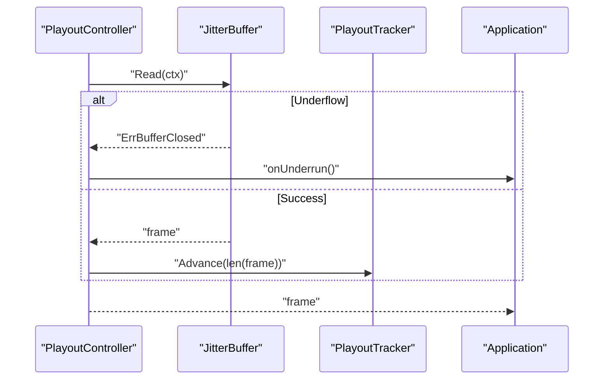

**Diagram sources**
- [playout.go:307-382](file://go/pkg/audio/playout.go#L307-L382)

**Section sources**
- [playout.go:299-383](file://go/pkg/audio/playout.go#L299-L383)
- [audio_test.go:392-502](file://go/pkg/audio/audio_test.go#L392-L502)

### Reassembly Across Out-of-Order Chunks
- Reassembler buffers chunks keyed by sequence number and emits them when in-order.
- When the buffer is full, it advances the expected sequence to prevent stalls.
- Supports resetting and inspection of buffered count and expected sequence.

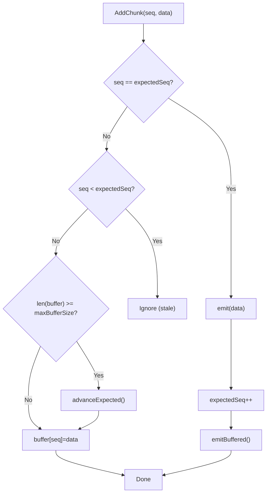

**Diagram sources**
- [chunk.go:124-190](file://go/pkg/audio/chunk.go#L124-L190)

**Section sources**
- [chunk.go:103-190](file://go/pkg/audio/chunk.go#L103-L190)

### Resampling for Low-Latency Alignment
- LinearResampler converts between common sample rates using linear interpolation.
- Helper functions resample 8k→16k, 48k→16k, and inverses.
- SincResampler is a placeholder for higher-quality resampling.

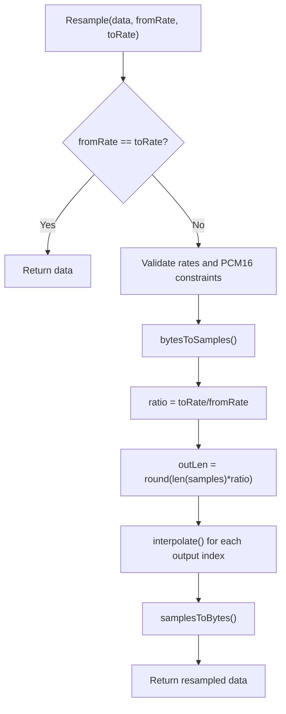

**Diagram sources**
- [resample.go:26-103](file://go/pkg/audio/resample.go#L26-L103)

**Section sources**
- [resample.go:8-173](file://go/pkg/audio/resample.go#L8-L173)
- [audio_test.go:12-105](file://go/pkg/audio/audio_test.go#L12-L105)

### Pipeline Integration Examples
- The orchestrator pipeline stages consume and produce audio frames aligned with AudioFormat and AudioProfile.
- ASR and TTS stages exchange audio chunks and transcripts; internal formats are canonicalized for processing.
- Session-level metadata and provider selections influence buffer sizing and resampling choices.

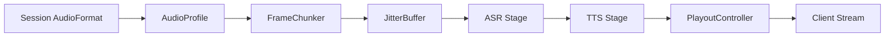

**Diagram sources**
- [common.go:98-102](file://go/pkg/contracts/common.go#L98-L102)
- [asr.go:3-29](file://go/pkg/contracts/asr.go#L3-L29)
- [tts.go:3-21](file://go/pkg/contracts/tts.go#L3-L21)
- [engine.go](file://go/orchestrator/internal/pipeline/engine.go)
- [asr_stage.go](file://go/orchestrator/internal/pipeline/asr_stage.go)
- [tts_stage.go](file://go/orchestrator/internal/pipeline/tts_stage.go)

## Dependency Analysis
- AudioProfile depends on contracts.AudioFormat and AudioEncoding for serialization and interoperability.
- Chunker and FrameChunker depend on AudioProfile for frame size computation.
- JitterBuffer and PlayoutController coordinate around frame boundaries and buffer capacity.
- Resampler operates on PCM16 byte arrays and is used to align sample rates before downstream processing.

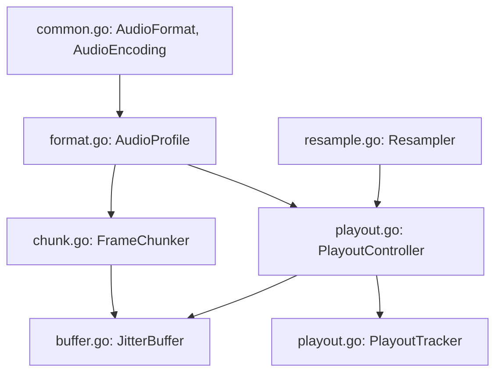

**Diagram sources**
- [common.go:98-102](file://go/pkg/contracts/common.go#L98-L102)
- [format.go:11-140](file://go/pkg/audio/format.go#L11-L140)
- [chunk.go:192-230](file://go/pkg/audio/chunk.go#L192-L230)
- [buffer.go:16-334](file://go/pkg/audio/buffer.go#L16-L334)
- [playout.go:299-383](file://go/pkg/audio/playout.go#L299-L383)
- [resample.go:8-173](file://go/pkg/audio/resample.go#L8-L173)

**Section sources**
- [common.go:98-102](file://go/pkg/contracts/common.go#L98-L102)
- [format.go:11-140](file://go/pkg/audio/format.go#L11-L140)
- [chunk.go:192-230](file://go/pkg/audio/chunk.go#L192-L230)
- [buffer.go:16-334](file://go/pkg/audio/buffer.go#L16-L334)
- [playout.go:299-383](file://go/pkg/audio/playout.go#L299-L383)
- [resample.go:8-173](file://go/pkg/audio/resample.go#L8-L173)

## Performance Considerations
- Latency vs. stability: Smaller JitterBuffer reduces latency but increases risk of underflow; larger buffers improve resilience against bursty input.
- Frame size: Shorter frames (e.g., 10 ms) reduce latency but increase CPU overhead; longer frames reduce overhead but increase delay.
- Encoding choice: G.711 reduces bandwidth but may increase CPU cost compared to PCM16; OPUS requires codec resources.
- Resampling: Prefer minimal resampling by aligning upstream formats to canonical rates; avoid repeated conversions.
- Memory: CircularBuffer minimizes allocations for continuous streams; JitterBuffer copies frames to prevent external mutation.
- Backpressure: Use TryRead for non-blocking paths; monitor Available() and buffer stats to tune capacity.

[No sources needed since this section provides general guidance]

## Troubleshooting Guide
- Buffer full errors: Increase JitterBuffer capacity or slow down input; verify producer backpressure.
- Buffer closed errors: Ensure Close() is called only after draining; handle ErrBufferClosed gracefully.
- Underflows: Reduce downstream processing delays; increase buffer size; implement underrun callbacks to pause rendering.
- Partial frames: Use Flush() to emit remaining bytes; ensure downstream expects partial frames.
- Reordering stalls: Adjust Reassembler max buffer size and confirm sequence numbering correctness.
- Resampling artifacts: Use supported rates; consider higher-quality resampling when available.

**Section sources**
- [buffer.go:39-95](file://go/pkg/audio/buffer.go#L39-L95)
- [playout.go:307-382](file://go/pkg/audio/playout.go#L307-L382)
- [chunk.go:42-53](file://go/pkg/audio/chunk.go#L42-L53)
- [chunk.go:124-190](file://go/pkg/audio/chunk.go#L124-L190)
- [resample.go:26-103](file://go/pkg/audio/resample.go#L26-L103)

## Conclusion
CloudApp’s audio buffering and chunking stack provides robust, low-latency primitives for real-time voice sessions. By combining fixed-size frame processing, thread-safe jitter buffers, playout tracking, and optional resampling, the system balances responsiveness and reliability. Proper buffer sizing, frame alignment, and awareness of overflow/underflow conditions enable predictable performance across diverse use cases.