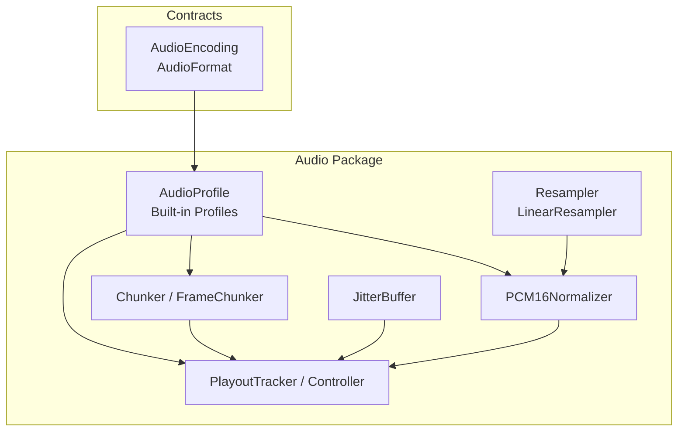
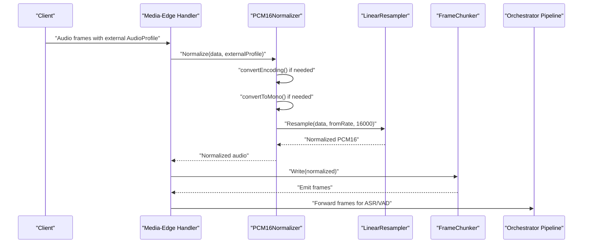
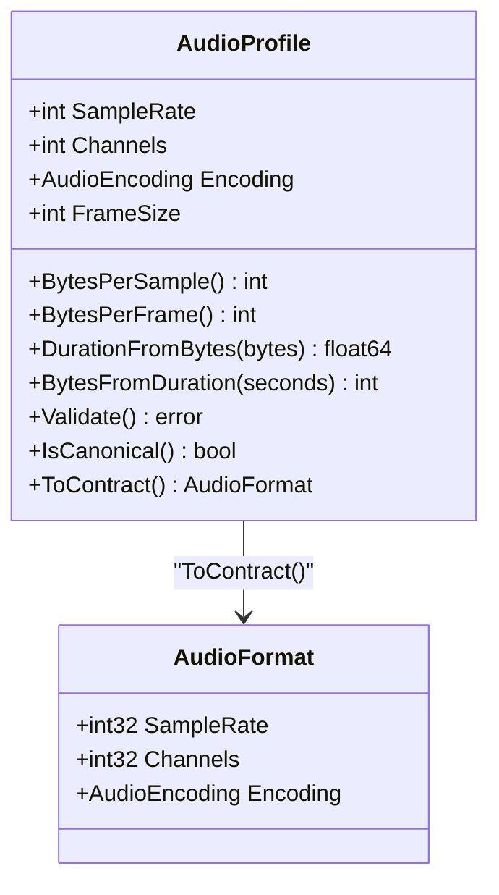
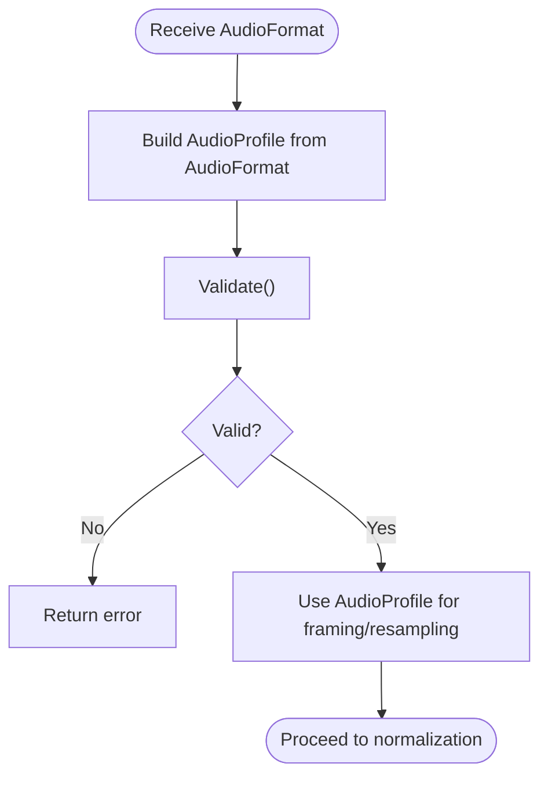
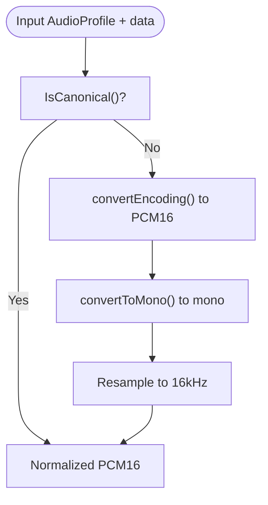
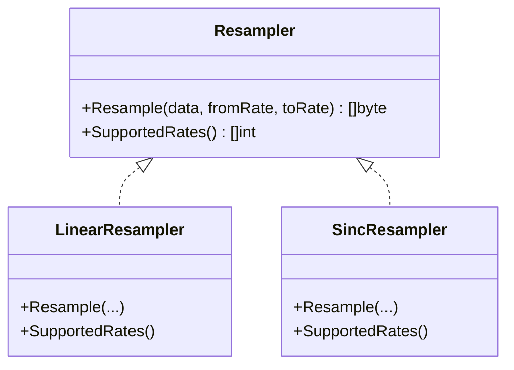
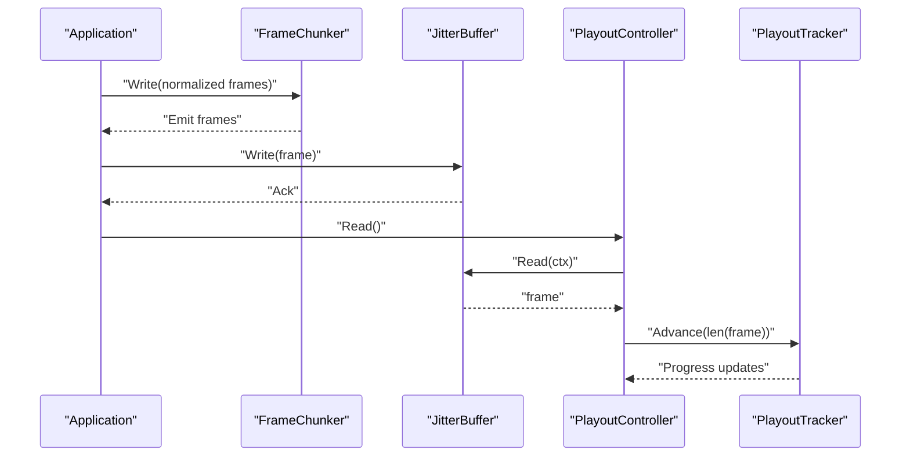
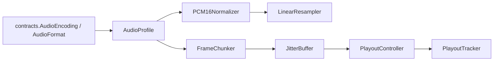

# Audio Format Conversion

<cite>
**Referenced Files in This Document**
- [format.go](file://go/pkg/audio/format.go)
- [common.go](file://go/pkg/contracts/common.go)
- [resample.go](file://go/pkg/audio/resample.go)
- [chunk.go](file://go/pkg/audio/chunk.go)
- [buffer.go](file://go/pkg/audio/buffer.go)
- [normalize.go](file://go/pkg/audio/normalize.go)
- [playout.go](file://go/pkg/audio/playout.go)
- [audio_test.go](file://go/pkg/audio/audio_test.go)
- [README.md](file://README.md)
</cite>

## Table of Contents
1. [Introduction](#introduction)
2. [Project Structure](#project-structure)
3. [Core Components](#core-components)
4. [Architecture Overview](#architecture-overview)
5. [Detailed Component Analysis](#detailed-component-analysis)
6. [Dependency Analysis](#dependency-analysis)
7. [Performance Considerations](#performance-considerations)
8. [Troubleshooting Guide](#troubleshooting-guide)
9. [Conclusion](#conclusion)

## Introduction
This document explains audio format conversion and profile management in CloudApp. It focuses on the AudioProfile struct and its role in defining audio characteristics, the canonical internal format used for ASR and VAD processing, built-in profiles, conversion functions between internal and external formats, audio encoding types and their byte-per-sample calculations, and practical workflows for validation, creation, and conversion. It also covers quality and performance implications of different format choices.

## Project Structure
The audio subsystem resides under go/pkg/audio and integrates with contracts for shared types. The key modules are:
- format.go: Defines AudioProfile, built-in profiles, and conversion helpers
- contracts/common.go: Declares AudioEncoding and AudioFormat types used for inter-service contracts
- resample.go: Provides resampling utilities and resamplers
- chunk.go: Frames audio into fixed-size chunks and reassembles
- buffer.go: Implements jitter buffering and related utilities
- normalize.go: Converts arbitrary inputs to the canonical internal format
- playout.go: Tracks playout progress and manages playback buffers

**Diagram sources**
- [format.go:11-121](file://go/pkg/audio/format.go#L11-L121)
- [common.go:11-102](file://go/pkg/contracts/common.go#L11-L102)
- [resample.go:8-66](file://go/pkg/audio/resample.go#L8-L66)
- [normalize.go:10-85](file://go/pkg/audio/normalize.go#L10-L85)
- [chunk.go:7-230](file://go/pkg/audio/chunk.go#L7-L230)
- [buffer.go:16-198](file://go/pkg/audio/buffer.go#L16-L198)
- [playout.go:9-383](file://go/pkg/audio/playout.go#L9-L383)

**Section sources**
- [README.md:47-102](file://README.md#L47-L102)
- [format.go:11-121](file://go/pkg/audio/format.go#L11-L121)
- [common.go:11-102](file://go/pkg/contracts/common.go#L11-L102)

## Core Components
- AudioProfile: Encapsulates sample rate, channels, encoding, and frame size; provides helpers for bytes-per-sample/frame, duration calculations, validation, and canonical detection.
- Built-in profiles: InternalProfile (canonical 16kHz mono PCM16), TelephonyProfile (16kHz mono PCM16), Telephony8kProfile (8kHz mono PCM16), WebRTCProfile (48kHz mono PCM16).
- Conversion helpers: ToContract() and ProfileFromContract() bridge internal AudioProfile to/from the contract AudioFormat.
- Encoding types: PCM16, G711 μ-law, G711 A-law, plus OPUS in contracts.
- Normalization: PCM16Normalizer converts arbitrary inputs to canonical format (PCM16 16kHz mono), handling encoding conversion, channel downmix, and resampling.
- Resampling: LinearResampler and convenience functions for common transitions.
- Framing and buffering: Chunker/FrameChunker, JitterBuffer, and PlayoutTracker/Controller.

**Section sources**
- [format.go:11-121](file://go/pkg/audio/format.go#L11-L121)
- [common.go:11-36](file://go/pkg/contracts/common.go#L11-L36)
- [normalize.go:19-85](file://go/pkg/audio/normalize.go#L19-L85)
- [resample.go:8-66](file://go/pkg/audio/resample.go#L8-L66)
- [chunk.go:7-230](file://go/pkg/audio/chunk.go#L7-L230)
- [buffer.go:16-198](file://go/pkg/audio/buffer.go#L16-L198)
- [playout.go:9-383](file://go/pkg/audio/playout.go#L9-L383)

## Architecture Overview
The audio pipeline converts external audio into the internal canonical format for ASR/VAD processing, then streams normalized frames downstream. Normalization handles encoding conversion (e.g., G.711 to PCM16), channel downmix to mono, and resampling to 16 kHz. Framing utilities split and reassemble audio into fixed-size frames. Playback tracking monitors playout progress and integrates with jitter buffering.

**Diagram sources**
- [normalize.go:31-74](file://go/pkg/audio/normalize.go#L31-L74)
- [resample.go:26-61](file://go/pkg/audio/resample.go#L26-L61)
- [chunk.go:192-229](file://go/pkg/audio/chunk.go#L192-L229)

## Detailed Component Analysis

### AudioProfile and Built-in Profiles
- Role: Defines audio characteristics and provides helpers for conversions and validations.
- Canonical internal format: 16kHz mono PCM16 with 10ms frames (160 samples).
- Built-in profiles:
  - InternalProfile: Canonical 16kHz mono PCM16
  - TelephonyProfile: 16kHz mono PCM16 (telephony quality)
  - Telephony8kProfile: 8kHz mono PCM16 (legacy telephony)
  - WebRTCProfile: 48kHz mono PCM16 (high quality)
- Helpers:
  - BytesPerSample(): returns 2 for PCM16, 1 for G.711 variants
  - BytesPerFrame(): samples × channels × bytes-per-sample
  - DurationFromBytes()/BytesFromDuration(): conversions using sample rate and channels
  - Validate(): validates sample rate and channels, auto-sets 10ms frame size if missing
  - IsCanonical(): compares against canonical profile
  - ToContract()/ProfileFromContract(): marshal/unmarshal to/from contract AudioFormat

**Diagram sources**
- [format.go:11-121](file://go/pkg/audio/format.go#L11-L121)
- [common.go:97-102](file://go/pkg/contracts/common.go#L97-L102)

**Section sources**
- [format.go:11-121](file://go/pkg/audio/format.go#L11-L121)
- [common.go:11-36](file://go/pkg/contracts/common.go#L11-L36)
- [audio_test.go:504-563](file://go/pkg/audio/audio_test.go#L504-L563)

### Audio Encoding Types and Byte-per-Sample
- PCM16: 2 bytes per sample
- G711 μ-law / A-law: 1 byte per sample
- Default behavior: If unknown encoding, defaults to 2 bytes per sample

Practical implications:
- Bandwidth and CPU cost increase with higher sample rates and channels.
- G.711 reduces bandwidth but loses fidelity; normalization converts to PCM16 for processing.

**Section sources**
- [format.go:19-29](file://go/pkg/audio/format.go#L19-L29)
- [normalize.go:87-110](file://go/pkg/audio/normalize.go#L87-L110)
- [audio_test.go:565-588](file://go/pkg/audio/audio_test.go#L565-L588)

### Conversion Between Internal and External Formats
- ToContract(): converts AudioProfile to contract AudioFormat (removes FrameSize)
- ProfileFromContract(): constructs AudioProfile from AudioFormat with 10ms default frame size
- Typical usage: Clients send AudioFormat; internal code stores AudioProfile; downstream processing uses canonical format

**Diagram sources**
- [format.go:113-121](file://go/pkg/audio/format.go#L113-L121)
- [format.go:51-63](file://go/pkg/audio/format.go#L51-L63)

**Section sources**
- [format.go:104-121](file://go/pkg/audio/format.go#L104-L121)
- [audio_test.go:630-671](file://go/pkg/audio/audio_test.go#L630-L671)

### Normalization Workflow (External → Canonical)
Normalization ensures downstream ASR/VAD receive consistent PCM16 16kHz mono audio:
1. Validate source profile
2. If not canonical:
   - Convert encoding to PCM16 (G.711 → PCM16)
   - Downmix channels to mono
   - Resample to 16 kHz using LinearResampler
3. Output normalized PCM16

**Diagram sources**
- [normalize.go:31-74](file://go/pkg/audio/normalize.go#L31-L74)
- [normalize.go:87-136](file://go/pkg/audio/normalize.go#L87-L136)
- [resample.go:26-61](file://go/pkg/audio/resample.go#L26-L61)

**Section sources**
- [normalize.go:19-85](file://go/pkg/audio/normalize.go#L19-L85)
- [normalize.go:101-136](file://go/pkg/audio/normalize.go#L101-L136)
- [resample.go:17-66](file://go/pkg/audio/resample.go#L17-L66)

### Resampling Utilities
- Resampler interface and LinearResampler implement simple linear interpolation
- Convenience functions:
  - Resample8kTo16k
  - Resample48kTo16k
  - Resample16kTo8k
  - Resample16kTo48k
- Notes:
  - LinearResampler requires even-length PCM16 data
  - SincResampler is a placeholder for future improvements

**Diagram sources**
- [resample.go:8-66](file://go/pkg/audio/resample.go#L8-L66)
- [resample.go:129-154](file://go/pkg/audio/resample.go#L129-L154)

**Section sources**
- [resample.go:17-127](file://go/pkg/audio/resample.go#L17-L127)
- [audio_test.go:12-60](file://go/pkg/audio/audio_test.go#L12-L60)

### Framing and Buffering
- Chunker: Fixed-size frame splitting with callbacks; supports flush/reset
- FrameChunker: Wraps Chunker using AudioProfile.BytesPerFrame()
- Static chunking: ChunkStatic returns frames and partial frame
- JitterBuffer: Thread-safe FIFO with backpressure, notifications, and stats
- PlayoutTracker/Controller: Track playback progress, manage buffers, pause/resume, and callbacks

**Diagram sources**
- [chunk.go:192-229](file://go/pkg/audio/chunk.go#L192-L229)
- [buffer.go:39-95](file://go/pkg/audio/buffer.go#L39-L95)
- [playout.go:307-383](file://go/pkg/audio/playout.go#L307-L383)

**Section sources**
- [chunk.go:7-101](file://go/pkg/audio/chunk.go#L7-L101)
- [chunk.go:192-230](file://go/pkg/audio/chunk.go#L192-L230)
- [buffer.go:16-198](file://go/pkg/audio/buffer.go#L16-L198)
- [playout.go:9-383](file://go/pkg/audio/playout.go#L9-L383)

## Dependency Analysis
- AudioProfile depends on contracts.AudioEncoding and contracts.AudioFormat for serialization.
- PCM16Normalizer depends on Resampler and contracts.AudioEncoding for conversions.
- FrameChunker depends on AudioProfile for frame size calculation.
- PlayoutController composes JitterBuffer and PlayoutTracker and depends on AudioProfile for rate/channel semantics.

**Diagram sources**
- [format.go:11-121](file://go/pkg/audio/format.go#L11-L121)
- [common.go:11-102](file://go/pkg/contracts/common.go#L11-L102)
- [normalize.go:19-85](file://go/pkg/audio/normalize.go#L19-L85)
- [chunk.go:192-229](file://go/pkg/audio/chunk.go#L192-L229)
- [buffer.go:16-198](file://go/pkg/audio/buffer.go#L16-L198)
- [playout.go:299-383](file://go/pkg/audio/playout.go#L299-L383)

**Section sources**
- [format.go:11-121](file://go/pkg/audio/format.go#L11-L121)
- [normalize.go:19-85](file://go/pkg/audio/normalize.go#L19-L85)
- [chunk.go:192-229](file://go/pkg/audio/chunk.go#L192-L229)
- [buffer.go:16-198](file://go/pkg/audio/buffer.go#L16-L198)
- [playout.go:299-383](file://go/pkg/audio/playout.go#L299-L383)

## Performance Considerations
- Sample rate and channels directly impact CPU and memory:
  - Higher sample rates increase compute and bandwidth
  - Stereo increases memory and CPU compared to mono
- Encoding choice:
  - G.711 reduces bandwidth but introduces loss; normalization incurs conversion overhead
  - PCM16 is CPU-friendly for ASR/VAD but larger bandwidth footprint
- Resampling:
  - Linear interpolation is lightweight but not high fidelity; consider SincResampler for future upgrades
  - Avoid unnecessary resampling by aligning input to canonical format early
- Framing:
  - 10ms frames balance latency and overhead; adjust only if required by providers
- Buffering:
  - Tune JitterBuffer size to absorb network jitter without excessive latency
  - Monitor buffer stats to detect backpressure and underruns

[No sources needed since this section provides general guidance]

## Troubleshooting Guide
Common issues and resolutions:
- Invalid profile validation:
  - Symptoms: Validation errors for sample rate or channels, or missing frame size
  - Resolution: Ensure positive sample rate and channels; frame size defaults to 10ms if omitted
- Odd-length PCM16 data:
  - Symptoms: Resampling errors indicating odd-length input
  - Resolution: Ensure PCM16 data length is even (2 bytes per sample)
- Buffer full/underrun:
  - Symptoms: ErrBufferFull or underrun callbacks
  - Resolution: Increase buffer size, slow producer, or handle TryRead/Read with context cancellation
- Unsupported encoding conversion:
  - Symptoms: Errors converting between encodings
  - Resolution: Ensure input encoding is supported (PCM16/G.711); normalize to canonical before downstream processing

**Section sources**
- [format.go:51-63](file://go/pkg/audio/format.go#L51-L63)
- [resample.go:32-38](file://go/pkg/audio/resample.go#L32-L38)
- [buffer.go:39-65](file://go/pkg/audio/buffer.go#L39-L65)
- [normalize.go:87-110](file://go/pkg/audio/normalize.go#L87-L110)
- [playout.go:320-351](file://go/pkg/audio/playout.go#L320-L351)

## Conclusion
CloudApp’s audio subsystem centers on a canonical internal format (16kHz mono PCM16) to simplify ASR/VAD processing. AudioProfile encapsulates format metadata and provides robust helpers for conversions and validations. PCM16Normalizer ensures inputs are normalized to canonical format, while resampling and framing utilities enable efficient processing. Proper selection of sample rate, channels, and encoding balances quality and performance, and judicious tuning of buffers and frame sizes yields responsive real-time audio.