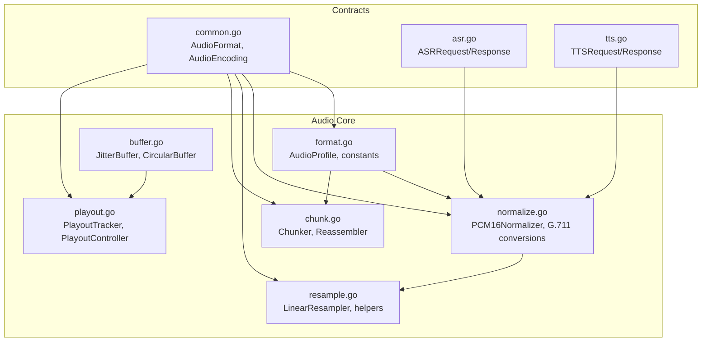
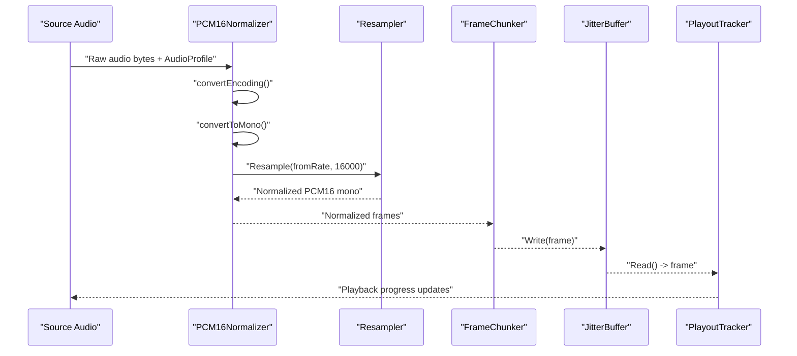
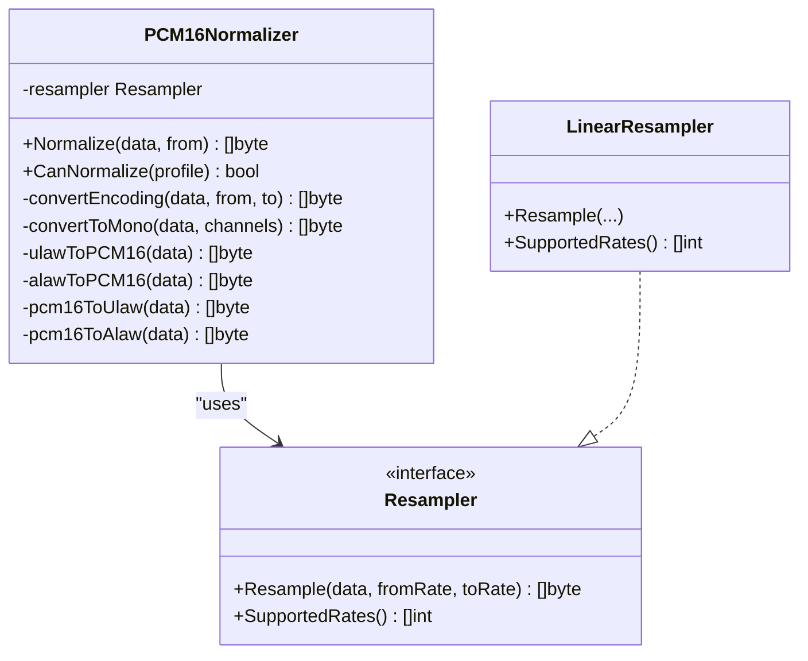
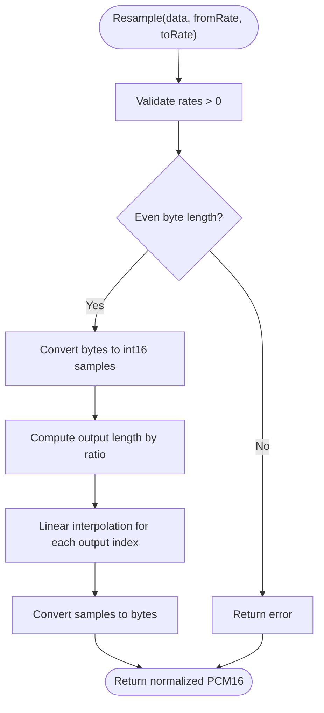
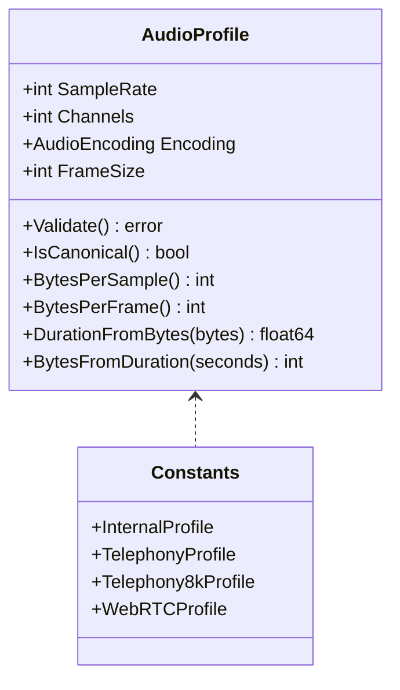
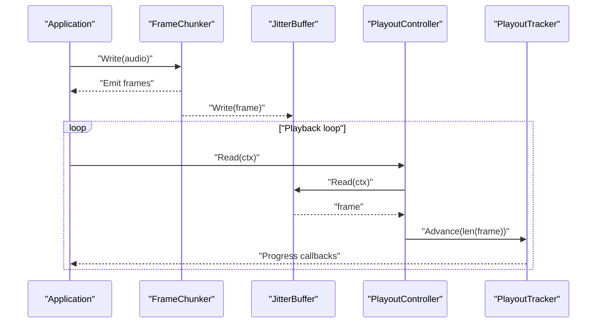
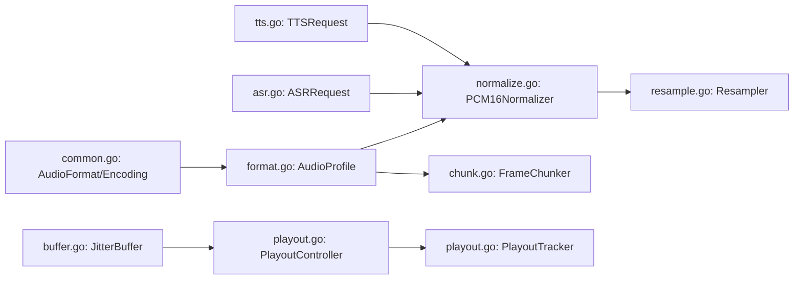

# Audio Normalization & Quality Control

<cite>
**Referenced Files in This Document**
- [normalize.go](file://go/pkg/audio/normalize.go)
- [resample.go](file://go/pkg/audio/resample.go)
- [format.go](file://go/pkg/audio/format.go)
- [chunk.go](file://go/pkg/audio/chunk.go)
- [buffer.go](file://go/pkg/audio/buffer.go)
- [playout.go](file://go/pkg/audio/playout.go)
- [audio_test.go](file://go/pkg/audio/audio_test.go)
- [common.go](file://go/pkg/contracts/common.go)
- [asr.go](file://go/pkg/contracts/asr.go)
- [tts.go](file://go/pkg/contracts/tts.go)
</cite>

## Table of Contents
1. [Introduction](#introduction)
2. [Project Structure](#project-structure)
3. [Core Components](#core-components)
4. [Architecture Overview](#architecture-overview)
5. [Detailed Component Analysis](#detailed-component-analysis)
6. [Dependency Analysis](#dependency-analysis)
7. [Performance Considerations](#performance-considerations)
8. [Troubleshooting Guide](#troubleshooting-guide)
9. [Conclusion](#conclusion)
10. [Appendices](#appendices)

## Introduction
This document explains the audio normalization and quality control mechanisms in CloudApp. It covers:
- Normalization algorithms: encoding conversion, channel downmixing, and resampling to a canonical format
- Resampling functionality for converting between sample rates
- Quality control measures: clipping prevention, volume-aware calculations, and dBFS/RMS utilities
- Integration in the audio processing pipeline: pre-processing to canonical format and post-processing for playout
- Practical workflows, parameters, and quality assessment methods
- Impact on ASR accuracy, TTS naturalness, and system performance
- Best practices and edge-case handling for maintaining audio fidelity

## Project Structure
The audio subsystem resides under go/pkg/audio and is composed of:
- Normalization and resampling logic
- Audio profiles and constants
- Framing, buffering, and playout tracking
- Tests validating behavior and edge cases

**Diagram sources**
- [format.go:11-140](file://go/pkg/audio/format.go#L11-L140)
- [normalize.go:10-85](file://go/pkg/audio/normalize.go#L10-L85)
- [resample.go:8-66](file://go/pkg/audio/resample.go#L8-L66)
- [chunk.go:7-230](file://go/pkg/audio/chunk.go#L7-L230)
- [buffer.go:16-334](file://go/pkg/audio/buffer.go#L16-L334)
- [playout.go:9-383](file://go/pkg/audio/playout.go#L9-L383)
- [common.go:11-102](file://go/pkg/contracts/common.go#L11-L102)
- [asr.go:3-29](file://go/pkg/contracts/asr.go#L3-L29)
- [tts.go:3-21](file://go/pkg/contracts/tts.go#L3-L21)

**Section sources**
- [format.go:11-140](file://go/pkg/audio/format.go#L11-L140)
- [normalize.go:10-85](file://go/pkg/audio/normalize.go#L10-L85)
- [resample.go:8-66](file://go/pkg/audio/resample.go#L8-L66)
- [chunk.go:7-230](file://go/pkg/audio/chunk.go#L7-L230)
- [buffer.go:16-334](file://go/pkg/audio/buffer.go#L16-L334)
- [playout.go:9-383](file://go/pkg/audio/playout.go#L9-L383)
- [common.go:11-102](file://go/pkg/contracts/common.go#L11-L102)
- [asr.go:3-29](file://go/pkg/contracts/asr.go#L3-L29)
- [tts.go:3-21](file://go/pkg/contracts/tts.go#L3-L21)

## Core Components
- AudioProfile: encapsulates sample rate, channels, encoding, and frame size; includes validation and canonical constants
- PCM16Normalizer: converts arbitrary input to canonical PCM16 mono at 16 kHz via encoding conversion, channel downmix, and resampling
- Resampler: resamples PCM16 audio; LinearResampler implements simple linear interpolation; SincResampler is a placeholder
- Chunker/Reassembler: splits and reassembles audio into fixed-size frames for streaming
- JitterBuffer/CircularBuffer: thread-safe buffering with backpressure and circular overwrite semantics
- PlayoutTracker/PlayoutController: tracks and controls playout progress and buffering

Key capabilities:
- Normalization supports PCM16, G.711 u-law, and A-law encodings within 8–48 kHz
- Resampling supports common rates and uses linear interpolation
- Utility functions for RMS and dBFS enable quality checks
- Framing and buffering integrate with playout tracking

**Section sources**
- [format.go:11-140](file://go/pkg/audio/format.go#L11-L140)
- [normalize.go:10-85](file://go/pkg/audio/normalize.go#L10-L85)
- [resample.go:8-66](file://go/pkg/audio/resample.go#L8-L66)
- [chunk.go:7-230](file://go/pkg/audio/chunk.go#L7-L230)
- [buffer.go:16-334](file://go/pkg/audio/buffer.go#L16-L334)
- [playout.go:9-383](file://go/pkg/audio/playout.go#L9-L383)

## Architecture Overview
The audio pipeline transforms incoming audio into a canonical format for downstream systems (ASR/TTS) and ensures smooth playout.

**Diagram sources**
- [normalize.go:31-74](file://go/pkg/audio/normalize.go#L31-L74)
- [resample.go:26-61](file://go/pkg/audio/resample.go#L26-L61)
- [chunk.go:192-230](file://go/pkg/audio/chunk.go#L192-L230)
- [buffer.go:39-95](file://go/pkg/audio/buffer.go#L39-L95)
- [playout.go:307-383](file://go/pkg/audio/playout.go#L307-L383)

## Detailed Component Analysis

### PCM16 Normalizer
Responsibilities:
- Validate input profile
- Convert non-PCM16 encodings to PCM16 using G.711 decode tables
- Downmix multi-channel to mono by averaging
- Resample to canonical 16 kHz

Quality controls:
- Clamping utilities prevent overflow during arithmetic
- dBFS and RMS helpers support loudness and clipping diagnostics

**Diagram sources**
- [normalize.go:19-85](file://go/pkg/audio/normalize.go#L19-L85)
- [resample.go:8-24](file://go/pkg/audio/resample.go#L8-L24)

**Section sources**
- [normalize.go:31-74](file://go/pkg/audio/normalize.go#L31-L74)
- [normalize.go:87-178](file://go/pkg/audio/normalize.go#L87-L178)
- [normalize.go:317-351](file://go/pkg/audio/normalize.go#L317-L351)

### Resampling
Capabilities:
- Linear interpolation resampling for PCM16
- Supported rates include 8k, 16k, 22.05k, 44.1k, 48k
- Helper functions for common conversions (8k→16k, 16k→8k, 48k→16k)

Implementation notes:
- Input validation for sample rate and even byte length
- Ratio-based output length calculation
- Interpolation at fractional positions

**Diagram sources**
- [resample.go:26-61](file://go/pkg/audio/resample.go#L26-L61)
- [resample.go:68-84](file://go/pkg/audio/resample.go#L68-L84)

**Section sources**
- [resample.go:26-61](file://go/pkg/audio/resample.go#L26-L61)
- [resample.go:63-66](file://go/pkg/audio/resample.go#L63-L66)
- [resample.go:105-127](file://go/pkg/audio/resample.go#L105-L127)

### Audio Profiles and Constants
- Canonical internal format: 16 kHz, mono, PCM16
- Telephony and legacy profiles for compatibility
- Utilities to compute bytes per frame, duration, and parse sample rates

**Diagram sources**
- [format.go:11-140](file://go/pkg/audio/format.go#L11-L140)

**Section sources**
- [format.go:51-63](file://go/pkg/audio/format.go#L51-L63)
- [format.go:97-102](file://go/pkg/audio/format.go#L97-L102)
- [format.go:123-140](file://go/pkg/audio/format.go#L123-L140)

### Framing, Buffering, and Playout
- Chunker splits raw audio into fixed-size frames; Reassembler reorders out-of-order chunks
- JitterBuffer provides thread-safe buffering with backpressure and notifications
- PlayoutTracker computes position and progress; PlayoutController coordinates buffering and callbacks

**Diagram sources**
- [chunk.go:192-230](file://go/pkg/audio/chunk.go#L192-L230)
- [buffer.go:39-95](file://go/pkg/audio/buffer.go#L39-L95)
- [playout.go:307-383](file://go/pkg/audio/playout.go#L307-L383)

**Section sources**
- [chunk.go:23-53](file://go/pkg/audio/chunk.go#L23-L53)
- [chunk.go:103-190](file://go/pkg/audio/chunk.go#L103-L190)
- [buffer.go:39-179](file://go/pkg/audio/buffer.go#L39-L179)
- [playout.go:99-226](file://go/pkg/audio/playout.go#L99-L226)

## Dependency Analysis
- Normalizer depends on Resampler and AudioProfile
- Contracts define AudioFormat and AudioEncoding used across the system
- Pipeline components (ASR/TTS) consume normalized audio and frame metadata

**Diagram sources**
- [common.go:97-102](file://go/pkg/contracts/common.go#L97-L102)
- [format.go:11-140](file://go/pkg/audio/format.go#L11-L140)
- [normalize.go:19-85](file://go/pkg/audio/normalize.go#L19-L85)
- [resample.go:8-66](file://go/pkg/audio/resample.go#L8-L66)
- [chunk.go:192-230](file://go/pkg/audio/chunk.go#L192-L230)
- [buffer.go:39-95](file://go/pkg/audio/buffer.go#L39-L95)
- [playout.go:307-383](file://go/pkg/audio/playout.go#L307-L383)
- [asr.go:3-10](file://go/pkg/contracts/asr.go#L3-L10)
- [tts.go:3-11](file://go/pkg/contracts/tts.go#L3-L11)

**Section sources**
- [common.go:97-102](file://go/pkg/contracts/common.go#L97-L102)
- [asr.go:3-10](file://go/pkg/contracts/asr.go#L3-L10)
- [tts.go:3-11](file://go/pkg/contracts/tts.go#L3-L11)

## Performance Considerations
- Linear interpolation resampling is computationally efficient but lower fidelity than sinc-based methods; consider SincResampler for future enhancements
- Downmixing averages across channels; for perceptually weighted results, consider applying frequency-weighting before averaging
- JitterBuffer sizing affects latency and robustness; tune max size to network conditions
- Frame size impacts latency and CPU usage; 10 ms frames (160 samples at 16 kHz) balance responsiveness and overhead
- dBFS/RMS computations are O(n); cache or batch where appropriate for real-time workloads

[No sources needed since this section provides general guidance]

## Troubleshooting Guide
Common issues and resolutions:
- Invalid or unsupported input profile: ensure SampleRate and Channels are positive; validate via AudioProfile.Validate
- Encoding conversion failures: verify input encoding is supported (PCM16, G.711 u-law/A-law)
- Channel mismatch: multi-channel inputs are downmixed; confirm expected mono output
- Resampling errors: ensure even byte length for PCM16; verify fromRate/toRate are positive
- Buffering stalls: monitor JitterBuffer stats; adjust buffer size and backpressure handling
- Playout underruns: configure onUnderrun callbacks; ensure steady upstream throughput

Validation and tests:
- Resampling correctness and edge cases covered by unit tests
- Framing and buffering behavior verified by dedicated tests
- Audio profile calculations validated by unit tests

**Section sources**
- [format.go:51-63](file://go/pkg/audio/format.go#L51-L63)
- [normalize.go:32-40](file://go/pkg/audio/normalize.go#L32-L40)
- [resample.go:32-38](file://go/pkg/audio/resample.go#L32-L38)
- [audio_test.go:12-105](file://go/pkg/audio/audio_test.go#L12-L105)
- [audio_test.go:220-297](file://go/pkg/audio/audio_test.go#L220-L297)
- [audio_test.go:392-453](file://go/pkg/audio/audio_test.go#L392-L453)

## Conclusion
CloudApp’s audio pipeline establishes a canonical PCM16 mono format at 16 kHz, ensuring consistent processing for ASR and TTS. Normalization handles encoding conversion, channel downmixing, and resampling with clear quality controls. Framing, buffering, and playout tracking provide robust streaming behavior. While linear interpolation is sufficient for MVP, upgrading to high-quality resampling and adding perceptual weighting will improve fidelity for ASR accuracy and TTS naturalness.

[No sources needed since this section summarizes without analyzing specific files]

## Appendices

### Practical Workflows and Parameters
- Normalization workflow:
  - Input: raw audio bytes and AudioProfile
  - Steps: encoding conversion → channel downmix → resampling to 16 kHz
  - Output: normalized PCM16 mono frames
- Resampling parameters:
  - Supported rates: 8k, 16k, 22.05k, 44.1k, 48k
  - Helpers: 8k→16k, 16k→8k, 48k→16k
- Quality assessment:
  - Compute RMS and dBFS to detect clipping and loudness anomalies
  - Monitor playout progress and buffer stats to detect underruns

**Section sources**
- [normalize.go:31-74](file://go/pkg/audio/normalize.go#L31-L74)
- [resample.go:63-66](file://go/pkg/audio/resample.go#L63-L66)
- [resample.go:105-127](file://go/pkg/audio/resample.go#L105-L127)
- [normalize.go:328-351](file://go/pkg/audio/normalize.go#L328-L351)
- [playout.go:199-226](file://go/pkg/audio/playout.go#L199-L226)
- [buffer.go:181-198](file://go/pkg/audio/buffer.go#L181-L198)

### Impact on ASR Accuracy, TTS Naturalness, and Performance
- ASR accuracy: canonical 16 kHz mono PCM16 improves model alignment and reduces artifacts
- TTS naturalness: consistent sample rate and mono channel reduce synthesis distortions
- Performance: linear resampling and 10 ms frames optimize throughput; tune buffer sizes for latency targets

[No sources needed since this section provides general guidance]

### Best Practices and Edge Cases
- Best practices:
  - Always validate AudioProfile before normalization
  - Prefer 16 kHz mono PCM16 for internal processing
  - Use dBFS/RMS to detect and mitigate clipping
  - Size JitterBuffer to tolerate network jitter
- Edge cases:
  - Odd-length PCM16 input fails resampling; pad or drop last byte as appropriate
  - Multi-channel inputs are downmixed; verify expected mono output
  - Very low/high sample rates require careful resampling; ensure supported rates

**Section sources**
- [format.go:51-63](file://go/pkg/audio/format.go#L51-L63)
- [resample.go:32-38](file://go/pkg/audio/resample.go#L32-L38)
- [normalize.go:112-136](file://go/pkg/audio/normalize.go#L112-L136)
- [audio_test.go:96-105](file://go/pkg/audio/audio_test.go#L96-L105)