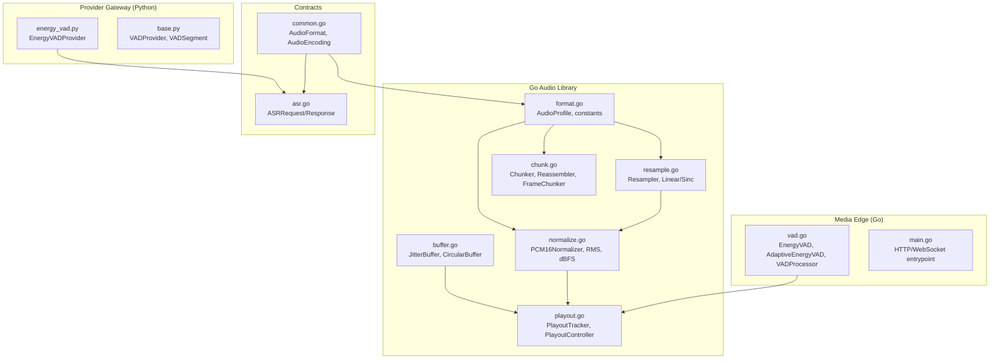
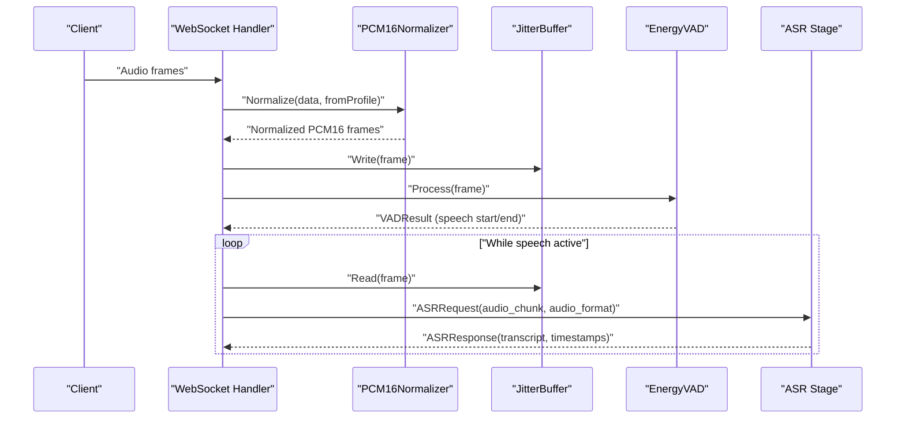
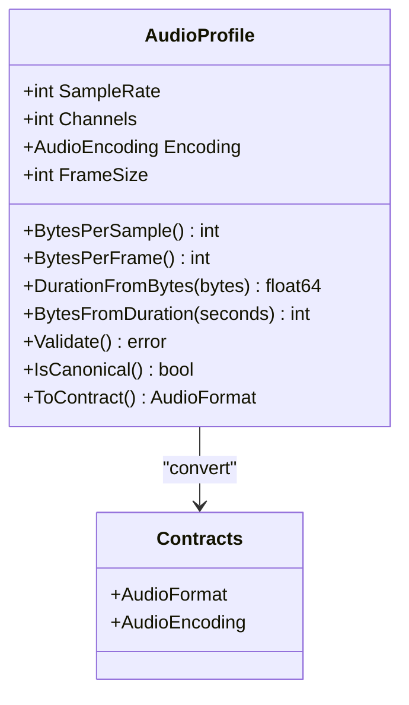
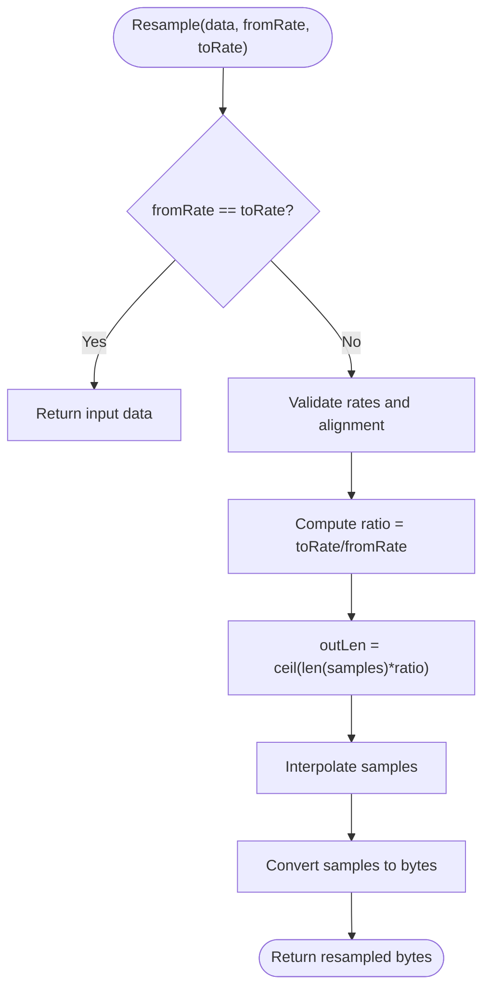
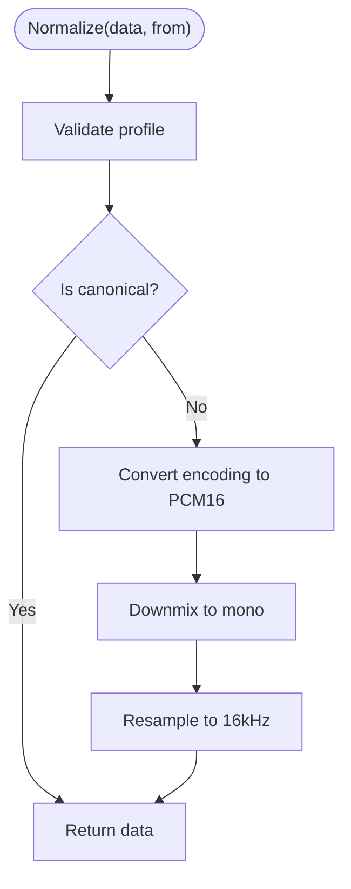
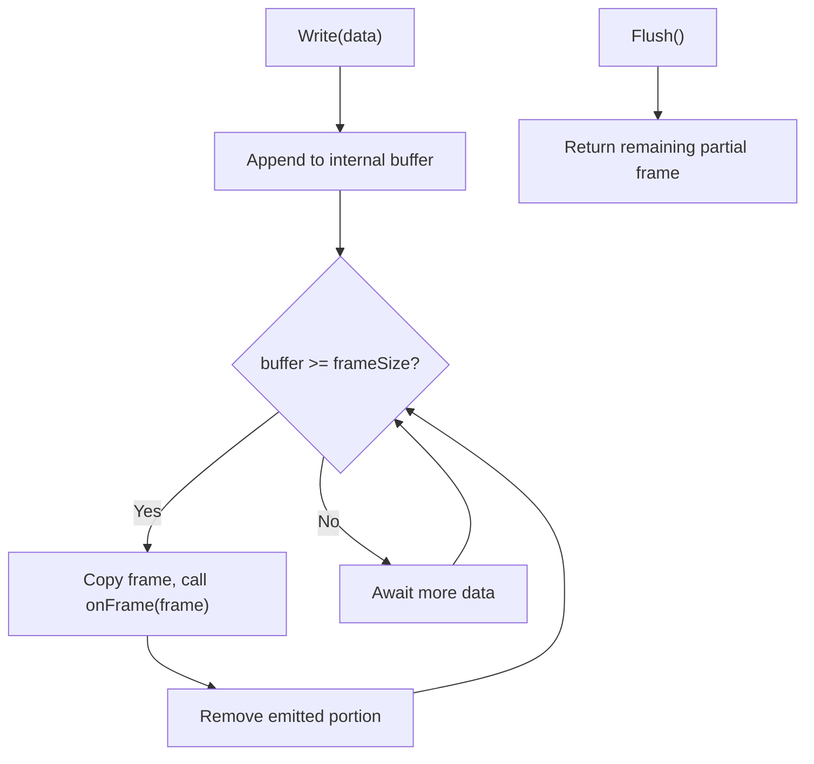
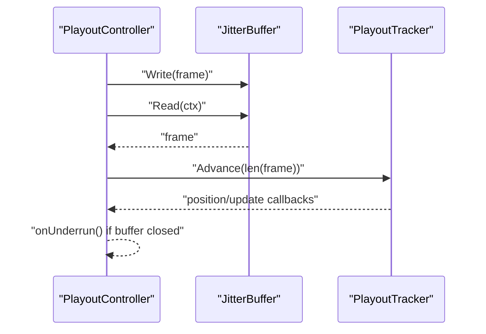
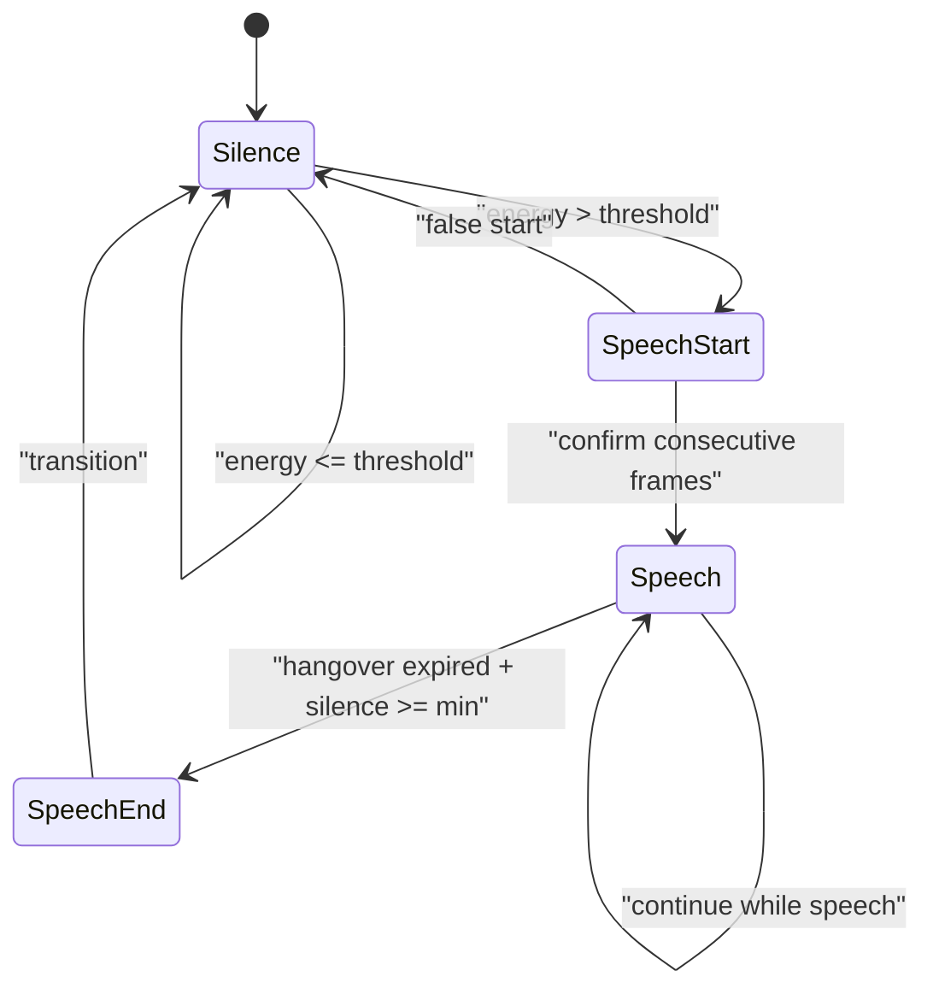
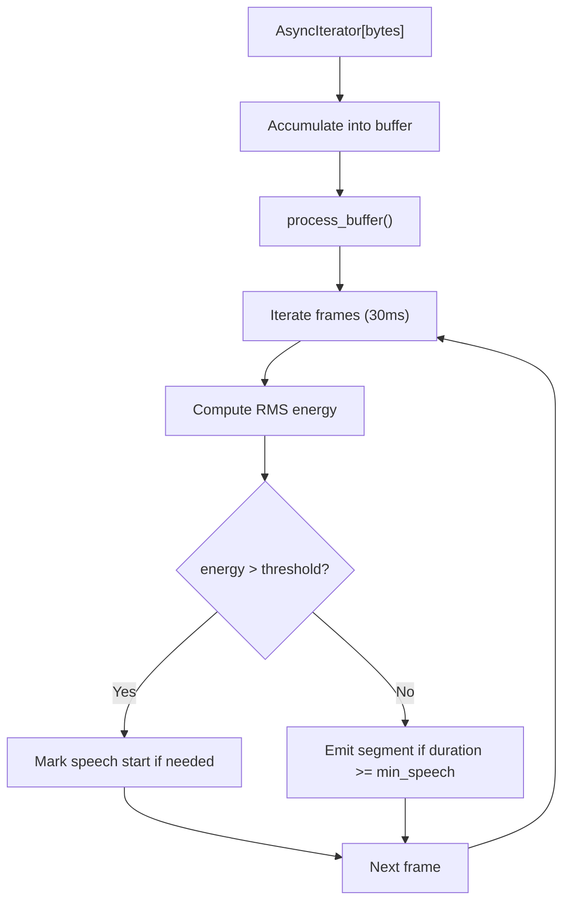
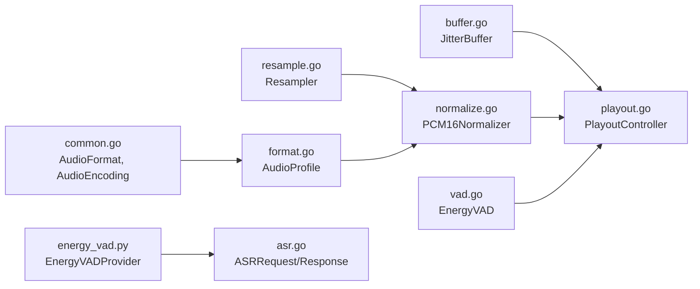

# Audio Processing

<cite>
**Referenced Files in This Document**
- [format.go](file://go/pkg/audio/format.go)
- [resample.go](file://go/pkg/audio/resample.go)
- [buffer.go](file://go/pkg/audio/buffer.go)
- [chunk.go](file://go/pkg/audio/chunk.go)
- [normalize.go](file://go/pkg/audio/normalize.go)
- [playout.go](file://go/pkg/audio/playout.go)
- [vad.go](file://go/media-edge/internal/vad/vad.go)
- [energy_vad.py](file://py/provider_gateway/app/providers/vad/energy_vad.py)
- [base.py](file://py/provider_gateway/app/providers/vad/base.py)
- [common.go](file://go/pkg/contracts/common.go)
- [asr.go](file://go/pkg/contracts/asr.go)
- [audio_test.go](file://go/pkg/audio/audio_test.go)
- [main.go](file://go/media-edge/cmd/main.go)
</cite>

## Table of Contents
1. [Introduction](#introduction)
2. [Project Structure](#project-structure)
3. [Core Components](#core-components)
4. [Architecture Overview](#architecture-overview)
5. [Detailed Component Analysis](#detailed-component-analysis)
6. [Dependency Analysis](#dependency-analysis)
7. [Performance Considerations](#performance-considerations)
8. [Troubleshooting Guide](#troubleshooting-guide)
9. [Conclusion](#conclusion)
10. [Appendices](#appendices)

## Introduction
This document explains CloudApp’s audio processing pipeline with a focus on real-time audio format conversion, resampling, buffering, and voice activity detection (VAD). It covers PCM format handling, sample rate conversion, audio normalization, jitter buffer management, chunking/reassembly, playout tracking, and VAD integration using both Go-based energy detection and Python-based energy detection. It also provides practical workflows, performance tuning guidance, and integration patterns across providers.

## Project Structure
The audio processing capabilities are primarily implemented in the Go package go/pkg/audio and integrated with the media-edge service and provider gateway (Python). Contracts define cross-language audio formats and provider capabilities.



**Diagram sources**
- [format.go:11-140](file://go/pkg/audio/format.go#L11-L140)
- [resample.go:8-173](file://go/pkg/audio/resample.go#L8-L173)
- [buffer.go:16-334](file://go/pkg/audio/buffer.go#L16-L334)
- [chunk.go:7-230](file://go/pkg/audio/chunk.go#L7-L230)
- [normalize.go:10-352](file://go/pkg/audio/normalize.go#L10-L352)
- [playout.go:9-383](file://go/pkg/audio/playout.go#L9-L383)
- [vad.go:10-373](file://go/media-edge/internal/vad/vad.go#L10-L373)
- [energy_vad.py:14-179](file://py/provider_gateway/app/providers/vad/energy_vad.py#L14-L179)
- [base.py:8-66](file://py/provider_gateway/app/providers/vad/base.py#L8-L66)
- [common.go:11-102](file://go/pkg/contracts/common.go#L11-L102)
- [asr.go:3-35](file://go/pkg/contracts/asr.go#L3-L35)
- [main.go:30-180](file://go/media-edge/cmd/main.go#L30-L180)

**Section sources**
- [format.go:1-140](file://go/pkg/audio/format.go#L1-L140)
- [resample.go:1-173](file://go/pkg/audio/resample.go#L1-L173)
- [buffer.go:1-334](file://go/pkg/audio/buffer.go#L1-L334)
- [chunk.go:1-230](file://go/pkg/audio/chunk.go#L1-L230)
- [normalize.go:1-352](file://go/pkg/audio/normalize.go#L1-L352)
- [playout.go:1-383](file://go/pkg/audio/playout.go#L1-L383)
- [vad.go:1-373](file://go/media-edge/internal/vad/vad.go#L1-L373)
- [energy_vad.py:1-179](file://py/provider_gateway/app/providers/vad/energy_vad.py#L1-L179)
- [base.py:1-66](file://py/provider_gateway/app/providers/vad/base.py#L1-L66)
- [common.go:1-169](file://go/pkg/contracts/common.go#L1-L169)
- [asr.go:1-35](file://go/pkg/contracts/asr.go#L1-L35)
- [main.go:1-293](file://go/media-edge/cmd/main.go#L1-L293)

## Core Components
- AudioProfile and format utilities define canonical and standard profiles, frame sizing, and conversions to/from contracts.
- Resampler supports linear interpolation resampling and placeholders for higher-quality sinc resampling.
- Normalizer converts arbitrary inputs to the internal canonical PCM16 16 kHz mono format, handling encoding, channel, and sample-rate transformations.
- Buffering: JitterBuffer provides thread-safe framed buffering with backpressure and notifications; CircularBuffer offers fixed-size overwrite behavior.
- Chunking: Chunker splits streams into fixed-size frames; Reassembler reorders out-of-order frames; FrameChunker binds to AudioProfile.
- Playout: PlayoutTracker tracks playback progress; PlayoutController coordinates buffering and playout with underrun callbacks.
- VAD: Energy-based detectors in Go and Python provide speech/silence decisions with configurable thresholds and hysteresis.

**Section sources**
- [format.go:11-140](file://go/pkg/audio/format.go#L11-L140)
- [resample.go:8-173](file://go/pkg/audio/resample.go#L8-L173)
- [normalize.go:10-352](file://go/pkg/audio/normalize.go#L10-L352)
- [buffer.go:16-334](file://go/pkg/audio/buffer.go#L16-L334)
- [chunk.go:7-230](file://go/pkg/audio/chunk.go#L7-L230)
- [playout.go:9-383](file://go/pkg/audio/playout.go#L9-L383)
- [vad.go:68-373](file://go/media-edge/internal/vad/vad.go#L68-L373)
- [energy_vad.py:14-179](file://py/provider_gateway/app/providers/vad/energy_vad.py#L14-L179)

## Architecture Overview
The media-edge service exposes a WebSocket endpoint and integrates audio processing utilities for real-time sessions. Audio from clients is normalized to canonical format, optionally chunked, passed through VAD, and streamed to downstream stages (ASR/TTS). Playout tracking ensures accurate timing feedback.



**Diagram sources**
- [normalize.go:31-74](file://go/pkg/audio/normalize.go#L31-L74)
- [buffer.go:39-95](file://go/pkg/audio/buffer.go#L39-L95)
- [vad.go:105-197](file://go/media-edge/internal/vad/vad.go#L105-L197)
- [asr.go:3-10](file://go/pkg/contracts/asr.go#L3-L10)

## Detailed Component Analysis

### Audio Profiles and Format Handling
- Defines canonical and standard profiles (internal 16 kHz mono PCM16), helpers for bytes-per-sample/frame, duration/size conversions, and validation.
- Provides conversion to/from contract types and parsing of common sample rate strings.



**Diagram sources**
- [format.go:11-140](file://go/pkg/audio/format.go#L11-L140)
- [common.go:98-102](file://go/pkg/contracts/common.go#L98-L102)

**Section sources**
- [format.go:11-140](file://go/pkg/audio/format.go#L11-L140)
- [common.go:98-102](file://go/pkg/contracts/common.go#L98-L102)

### Resampling
- LinearResampler implements simple linear interpolation for rate conversion; SincResampler is a placeholder with fallback to linear.
- Convenience functions cover common conversions (8k→16k, 16k→8k, 48k→16k, 16k→48k).



**Diagram sources**
- [resample.go:26-61](file://go/pkg/audio/resample.go#L26-L61)

**Section sources**
- [resample.go:8-173](file://go/pkg/audio/resample.go#L8-L173)

### Normalization Pipeline
- Converts arbitrary inputs to canonical PCM16 mono 16 kHz via encoding conversion, channel downmix, and resampling.
- Includes RMS calculation and dBFS helpers.



**Diagram sources**
- [normalize.go:31-74](file://go/pkg/audio/normalize.go#L31-L74)

**Section sources**
- [normalize.go:10-352](file://go/pkg/audio/normalize.go#L10-L352)

### Buffer Management
- JitterBuffer: thread-safe FIFO with backpressure, notification signaling, timeouts, and stats.
- CircularBuffer: fixed-size ring buffer with overwrite behavior for continuous capture scenarios.
- BufferedAudioReader/Writer wrap buffers for io.Reader/io.Writer compatibility.

```mermaid
classDiagram
class JitterBuffer {
-[]byte[] buffer
-int maxSize
-bool closed
-chan struct{} notifyCh
-time.Duration readTimeout
+Write(frame) error
+Read(ctx) ([]byte, error)
+TryRead() ([]byte, bool)
+Peek() ([]byte, bool)
+Len() int
+IsFull() bool
+Available() int
+Close()
+IsClosed() bool
+Clear()
+SetReadTimeout(d)
+Stats() BufferStats
}
class CircularBuffer {
-byte[] data
-int size
-int readPos
-int writePos
-int count
+Write(p) int
+Read(p) int
+Len() int
+Available() int
+Reset()
}
```

**Diagram sources**
- [buffer.go:16-334](file://go/pkg/audio/buffer.go#L16-L334)

**Section sources**
- [buffer.go:16-334](file://go/pkg/audio/buffer.go#L16-L334)

### Chunking and Reassembly
- Chunker splits incoming data into fixed-size frames and invokes a callback for each complete frame.
- Reassembler accepts out-of-order frames by sequence number and emits them in order, with a bounded buffer and expected-sequence advancement.
- FrameChunker binds chunking to an AudioProfile for frame-size correctness.



**Diagram sources**
- [chunk.go:23-53](file://go/pkg/audio/chunk.go#L23-L53)

**Section sources**
- [chunk.go:7-230](file://go/pkg/audio/chunk.go#L7-L230)

### Playout Tracking and Control
- PlayoutTracker computes position/duration from bytes sent, supports pause/resume, completion callbacks, and stats.
- PlayoutController combines a JitterBuffer with a PlayoutTracker and exposes Read/TryRead with underrun callbacks.



**Diagram sources**
- [playout.go:300-383](file://go/pkg/audio/playout.go#L300-L383)

**Section sources**
- [playout.go:9-383](file://go/pkg/audio/playout.go#L9-L383)

### VAD Implementation
- Go-based EnergyVAD: state machine with silence/speech-start/speech/speech-end states, configurable thresholds, minimum durations, and hangover frames.
- AdaptiveEnergyVAD: adapts threshold based on noise estimate during silence.
- VADProcessor: wraps a detector and triggers callbacks on speech start/end with duration measurement.



**Diagram sources**
- [vad.go:13-197](file://go/media-edge/internal/vad/vad.go#L13-L197)

**Section sources**
- [vad.go:68-373](file://go/media-edge/internal/vad/vad.go#L68-L373)

### Python-based Energy VAD
- EnergyVADProvider implements a streaming energy-based detector compatible with provider gateway patterns, yielding VAD segments with start/end samples and confidence.



**Diagram sources**
- [energy_vad.py:45-146](file://py/provider_gateway/app/providers/vad/energy_vad.py#L45-L146)

**Section sources**
- [energy_vad.py:14-179](file://py/provider_gateway/app/providers/vad/energy_vad.py#L14-L179)
- [base.py:8-66](file://py/provider_gateway/app/providers/vad/base.py#L8-L66)

## Dependency Analysis
- AudioProfile depends on contracts for encoding and format definitions.
- Normalizer depends on Resampler and contracts.
- PlayoutController composes JitterBuffer and PlayoutTracker.
- VAD components operate independently but integrate with the pipeline via callbacks and frame boundaries.
- Provider gateway VAD is decoupled from media-edge and targets provider gateway APIs.



**Diagram sources**
- [common.go:98-102](file://go/pkg/contracts/common.go#L98-L102)
- [format.go:11-140](file://go/pkg/audio/format.go#L11-L140)
- [resample.go:8-173](file://go/pkg/audio/resample.go#L8-L173)
- [normalize.go:10-352](file://go/pkg/audio/normalize.go#L10-L352)
- [buffer.go:16-334](file://go/pkg/audio/buffer.go#L16-L334)
- [playout.go:299-383](file://go/pkg/audio/playout.go#L299-L383)
- [vad.go:68-373](file://go/media-edge/internal/vad/vad.go#L68-L373)
- [energy_vad.py:14-179](file://py/provider_gateway/app/providers/vad/energy_vad.py#L14-L179)
- [asr.go:3-29](file://go/pkg/contracts/asr.go#L3-L29)

**Section sources**
- [common.go:1-169](file://go/pkg/contracts/common.go#L1-L169)
- [format.go:1-140](file://go/pkg/audio/format.go#L1-L140)
- [resample.go:1-173](file://go/pkg/audio/resample.go#L1-L173)
- [normalize.go:1-352](file://go/pkg/audio/normalize.go#L1-L352)
- [buffer.go:1-334](file://go/pkg/audio/buffer.go#L1-L334)
- [playout.go:1-383](file://go/pkg/audio/playout.go#L1-L383)
- [vad.go:1-373](file://go/media-edge/internal/vad/vad.go#L1-L373)
- [energy_vad.py:1-179](file://py/provider_gateway/app/providers/vad/energy_vad.py#L1-L179)
- [asr.go:1-35](file://go/pkg/contracts/asr.go#L1-L35)

## Performance Considerations
- Latency
  - Frame size: smaller frames reduce latency but increase CPU overhead. The default 10 ms frames balance responsiveness and efficiency.
  - JitterBuffer depth: tune for network variability; larger depths smooth bursty delivery but add delay.
  - VAD thresholds: lower thresholds trigger earlier, reducing latency but increasing false positives; adjust based on environment.
- Throughput
  - Prefer linear resampling for simplicity; consider sinc resampling for higher fidelity when CPU allows.
  - Downmix stereo to mono to halve bandwidth and processing cost.
- Quality
  - Normalize to canonical 16 kHz PCM16 for downstream ASR/VAD stability.
  - Use adaptive thresholds in noisy environments to improve robustness.
- Backpressure
  - Monitor buffer stats and apply dynamic pacing to prevent underruns or overflows.

[No sources needed since this section provides general guidance]

## Troubleshooting Guide
- Buffer errors
  - ErrBufferFull indicates the jitter buffer reached capacity; reduce upstream frame rate or increase buffer size.
  - ErrBufferClosed occurs when reading from a closed buffer; ensure proper lifecycle management.
- Resampling issues
  - Odd-length PCM16 data fails; ensure even byte lengths for 16-bit samples.
  - Zero or invalid rates cause errors; validate sample rates before resampling.
- VAD sensitivity
  - Too low threshold: frequent false starts; too high: missed detections. Adjust thresholds and minimum durations.
  - Hangover frames: tune to avoid premature speech ends in quiet pauses.
- Playout tracking
  - If progress callbacks are not invoked, verify Advance is called and callbacks are registered.
  - Paused state prevents progress updates; call Resume to continue.

**Section sources**
- [buffer.go:10-15](file://go/pkg/audio/buffer.go#L10-L15)
- [resample.go:32-38](file://go/pkg/audio/resample.go#L32-L38)
- [vad.go:56-66](file://go/media-edge/internal/vad/vad.go#L56-L66)
- [playout.go:140-152](file://go/pkg/audio/playout.go#L140-L152)

## Conclusion
CloudApp’s audio pipeline centers on a canonical PCM16 16 kHz mono format, robust buffering, precise chunking, and configurable VAD. The Go-based utilities provide efficient real-time processing, while the Python provider gateway offers an extensible VAD provider. Proper tuning of frame sizes, buffer depths, and VAD thresholds yields low-latency, high-quality audio across diverse providers and environments.

[No sources needed since this section summarizes without analyzing specific files]

## Appendices

### Example Workflows

- Real-time ASR pipeline
  - Receive audio frames via WebSocket.
  - Normalize to canonical format.
  - Feed frames into VAD; collect speech segments.
  - Send ASRRequest chunks to ASR stage; accumulate transcripts.
  - Track playout progress and handle underruns.

- Provider Gateway VAD
  - Stream audio chunks to EnergyVADProvider.
  - Iterate VAD segments and forward to downstream stages.

- Performance tuning by profile
  - Telephony 8 kHz: use 8k→16k resampling when needed; keep small frames for latency.
  - Telephony 16 kHz: default canonical; moderate jitter buffer depth.
  - WebRTC 48 kHz: downmix to mono; resample to 16 kHz for ASR; larger frames for throughput.

**Section sources**
- [format.go:65-95](file://go/pkg/audio/format.go#L65-L95)
- [normalize.go:31-74](file://go/pkg/audio/normalize.go#L31-L74)
- [vad.go:56-66](file://go/media-edge/internal/vad/vad.go#L56-L66)
- [energy_vad.py:45-146](file://py/provider_gateway/app/providers/vad/energy_vad.py#L45-L146)

### Utility Functions Reference
- AudioProfile helpers: bytes-per-sample/frame, duration/size conversions, validation.
- Resampling: linear interpolation and convenience converters.
- Normalization: encoding/channel/rate conversions plus RMS and dBFS.
- Buffering: jitter and circular buffers with stats and notifications.
- Playout: position tracking, progress, and underrun handling.

**Section sources**
- [format.go:19-49](file://go/pkg/audio/format.go#L19-L49)
- [resample.go:26-61](file://go/pkg/audio/resample.go#L26-L61)
- [normalize.go:311-352](file://go/pkg/audio/normalize.go#L311-L352)
- [buffer.go:182-198](file://go/pkg/audio/buffer.go#L182-L198)
- [playout.go:212-226](file://go/pkg/audio/playout.go#L212-L226)