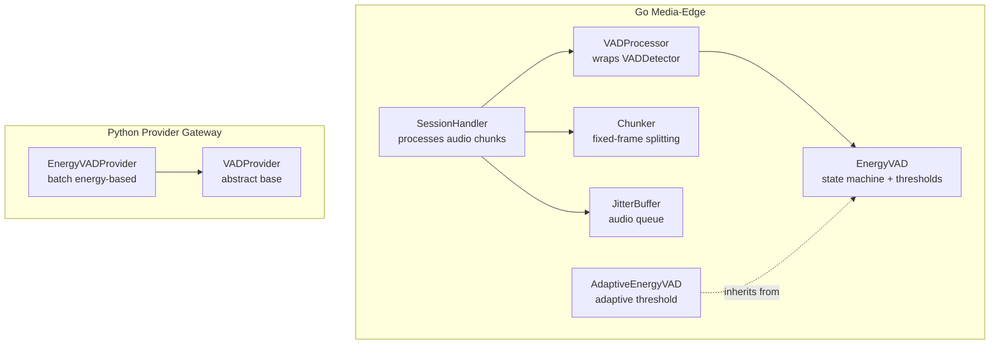
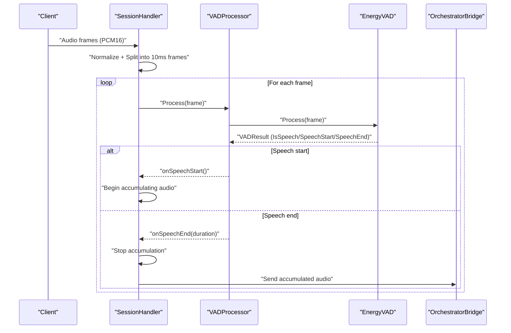
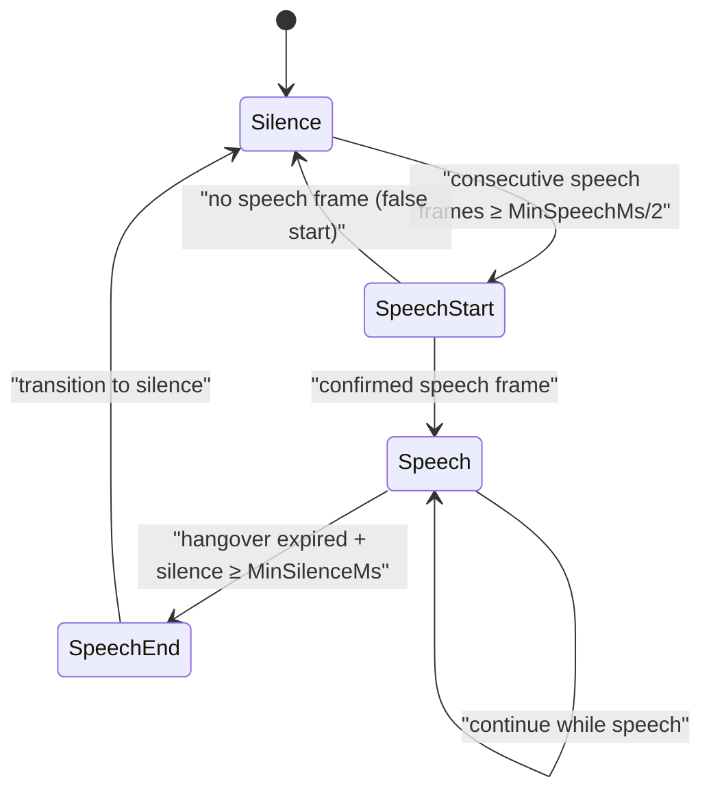
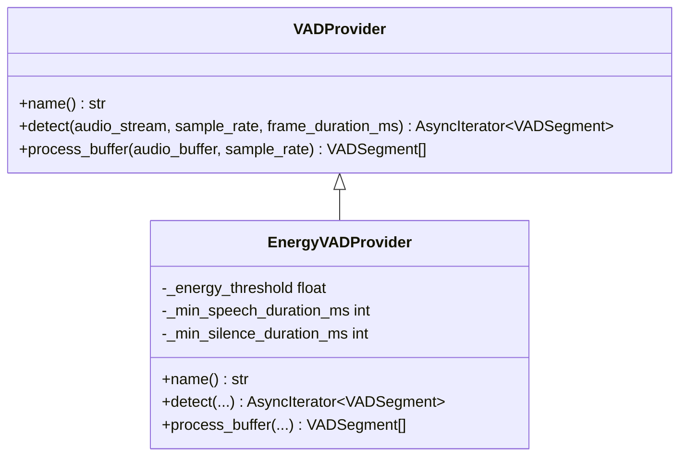
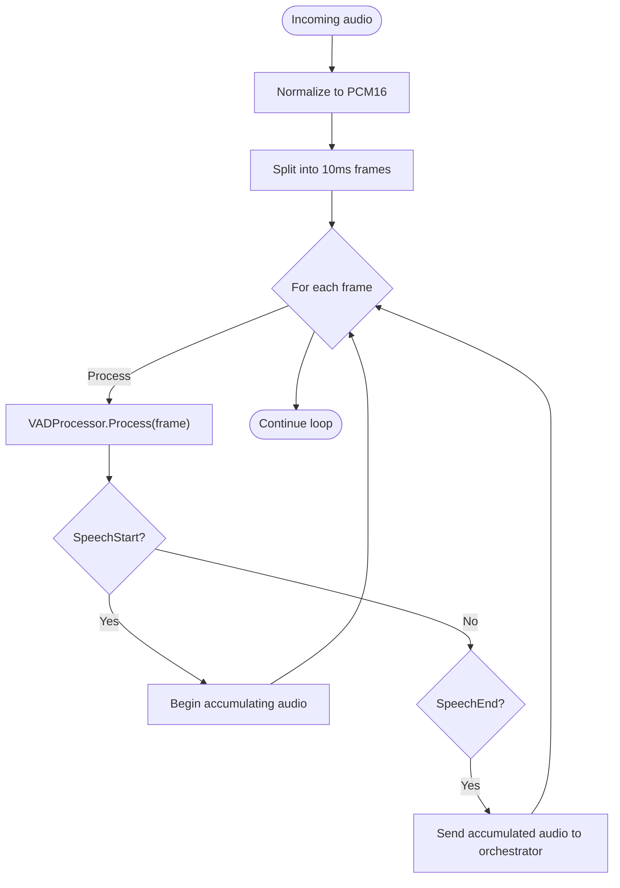
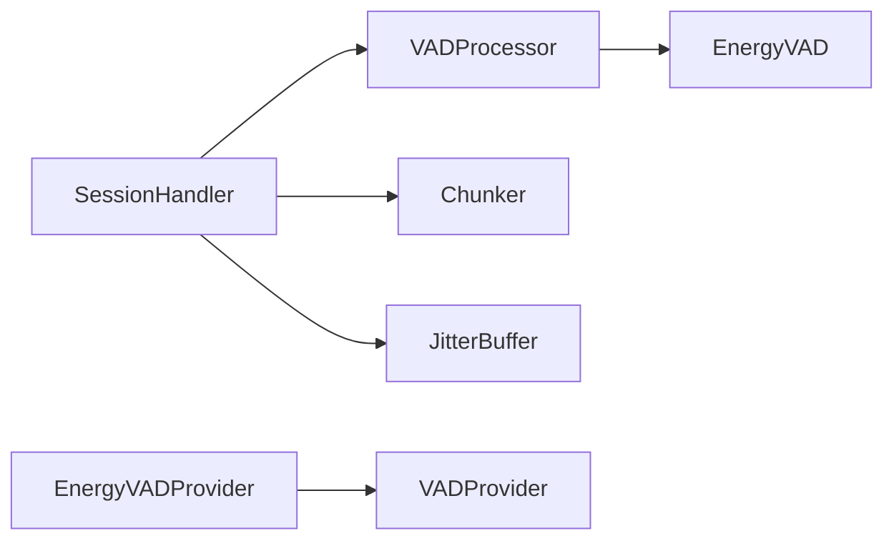

# Voice Activity Detection (VAD)

<cite>
**Referenced Files in This Document**
- [vad.go](file://go/media-edge/internal/vad/vad.go)
- [session_handler.go](file://go/media-edge/internal/handler/session_handler.go)
- [chunk.go](file://go/pkg/audio/chunk.go)
- [format.go](file://go/pkg/audio/format.go)
- [buffer.go](file://go/pkg/audio/buffer.go)
- [config.go](file://go/pkg/config/config.go)
- [defaults.go](file://go/pkg/config/defaults.go)
- [main.go](file://go/media-edge/cmd/main.go)
- [energy_vad.py](file://py/provider_gateway/app/providers/vad/energy_vad.py)
- [base.py](file://py/provider_gateway/app/providers/vad/base.py)
- [session.go](file://go/pkg/session/session.go)
</cite>

## Table of Contents
1. [Introduction](#introduction)
2. [Project Structure](#project-structure)
3. [Core Components](#core-components)
4. [Architecture Overview](#architecture-overview)
5. [Detailed Component Analysis](#detailed-component-analysis)
6. [Dependency Analysis](#dependency-analysis)
7. [Performance Considerations](#performance-considerations)
8. [Troubleshooting Guide](#troubleshooting-guide)
9. [Conclusion](#conclusion)

## Introduction
This document describes the Voice Activity Detection (VAD) implementation in CloudApp’s audio processing pipeline. It covers the dual VAD approach:
- Go-based VAD for real-time processing within the media-edge service.
- Python-based energy-based VAD provider for integration with external provider gateways.

It documents the VAD interface design and base class implementation for extensible VAD providers, details the energy-based VAD algorithm (threshold detection, silence suppression, and speech segment identification), and explains configuration parameters, sensitivity settings, and adaptation strategies. Practical integration examples, speech start/end detection workflows, and VAD state management are included, along with performance optimization guidance for real-time processing, latency considerations, and accuracy tuning across diverse audio environments.

## Project Structure
The VAD implementation spans two primary areas:
- Real-time VAD in Go (media-edge): energy-based VAD with state machine, adaptive threshold support, and a processor wrapper for callbacks.
- Provider VAD in Python (provider_gateway): a base interface and an energy-based provider for batch-style detection.

**Diagram sources**
- [session_handler.go:64-117](file://go/media-edge/internal/handler/session_handler.go#L64-L117)
- [vad.go:305-373](file://go/media-edge/internal/vad/vad.go#L305-L373)
- [vad.go:80-103](file://go/media-edge/internal/vad/vad.go#L80-L103)
- [vad.go:263-303](file://go/media-edge/internal/vad/vad.go#L263-L303)
- [chunk.go:7-43](file://go/pkg/audio/chunk.go#L7-L43)
- [buffer.go:16-37](file://go/pkg/audio/buffer.go#L16-L37)
- [base.py:18-65](file://py/provider_gateway/app/providers/vad/base.py#L18-L65)
- [energy_vad.py:14-179](file://py/provider_gateway/app/providers/vad/energy_vad.py#L14-L179)

**Section sources**
- [session_handler.go:64-117](file://go/media-edge/internal/handler/session_handler.go#L64-L117)
- [vad.go:80-103](file://go/media-edge/internal/vad/vad.go#L80-L103)
- [vad.go:305-373](file://go/media-edge/internal/vad/vad.go#L305-L373)
- [chunk.go:7-43](file://go/pkg/audio/chunk.go#L7-L43)
- [buffer.go:16-37](file://go/pkg/audio/buffer.go#L16-L37)
- [base.py:18-65](file://py/provider_gateway/app/providers/vad/base.py#L18-L65)
- [energy_vad.py:14-179](file://py/provider_gateway/app/providers/vad/energy_vad.py#L14-L179)

## Core Components
- VAD interface and detector:
  - VADDetector defines Process, Reset, and State.
  - EnergyVAD implements a state machine with thresholds and hangover logic.
  - AdaptiveEnergyVAD extends EnergyVAD with noise-floor estimation and adaptive threshold.
  - VADProcessor wraps a detector to expose callbacks for speech start/end and track durations.

- Go real-time pipeline integration:
  - SessionHandler constructs an EnergyVAD with a VADConfig, wraps it in VADProcessor, and processes 10 ms PCM16 frames.
  - Speech start/end toggles state and accumulates audio for downstream ASR.

- Python provider integration:
  - VADProvider defines async detect and process_buffer methods.
  - EnergyVADProvider implements energy-based detection with configurable thresholds and durations.

**Section sources**
- [vad.go:68-78](file://go/media-edge/internal/vad/vad.go#L68-L78)
- [vad.go:80-103](file://go/media-edge/internal/vad/vad.go#L80-L103)
- [vad.go:263-303](file://go/media-edge/internal/vad/vad.go#L263-L303)
- [vad.go:305-373](file://go/media-edge/internal/vad/vad.go#L305-L373)
- [session_handler.go:68-111](file://go/media-edge/internal/handler/session_handler.go#L68-L111)
- [session_handler.go:176-225](file://go/media-edge/internal/handler/session_handler.go#L176-L225)
- [base.py:18-65](file://py/provider_gateway/app/providers/vad/base.py#L18-L65)
- [energy_vad.py:14-179](file://py/provider_gateway/app/providers/vad/energy_vad.py#L14-L179)

## Architecture Overview
The VAD sits at the boundary of raw audio input and downstream ASR. In the media-edge service, audio is normalized and split into 10 ms frames. Each frame is passed through the VAD detector. On speech start, the system begins accumulating audio; on speech end, it transitions to processing and forwards the accumulated audio to the orchestrator.

**Diagram sources**
- [session_handler.go:176-225](file://go/media-edge/internal/handler/session_handler.go#L176-L225)
- [vad.go:321-345](file://go/media-edge/internal/vad/vad.go#L321-L345)
- [vad.go:105-197](file://go/media-edge/internal/vad/vad.go#L105-L197)

## Detailed Component Analysis

### Go VAD Implementation
- VADState and VADResult define state transitions and detection outputs.
- VADConfig encapsulates thresholds, durations, frame size, and sample rate.
- EnergyVAD state machine:
  - Silence → SpeechStart (after sufficient consecutive speech frames) → Speech → SpeechEnd (after hangover and minimum silence).
  - Hangover prevents premature end during short silence bursts.
- AdaptiveEnergyVAD:
  - Estimates noise floor during silence and adapts threshold dynamically.
- VADProcessor:
  - Wraps a detector and exposes callbacks for speech start/end.
  - Tracks speech duration for end-of-speech reporting.

**Diagram sources**
- [vad.go:10-34](file://go/media-edge/internal/vad/vad.go#L10-L34)
- [vad.go:125-197](file://go/media-edge/internal/vad/vad.go#L125-L197)

**Section sources**
- [vad.go:10-34](file://go/media-edge/internal/vad/vad.go#L10-L34)
- [vad.go:46-66](file://go/media-edge/internal/vad/vad.go#L46-L66)
- [vad.go:105-197](file://go/media-edge/internal/vad/vad.go#L105-L197)
- [vad.go:263-303](file://go/media-edge/internal/vad/vad.go#L263-L303)
- [vad.go:305-373](file://go/media-edge/internal/vad/vad.go#L305-L373)

### Python VAD Provider Interface
- VADProvider defines:
  - name(): provider identifier.
  - detect(): async generator of VADSegment over an audio stream.
  - process_buffer(): batch processing returning VADSegment list.
- VADSegment carries start/end sample indices, is_speech flag, and confidence.

**Diagram sources**
- [base.py:18-65](file://py/provider_gateway/app/providers/vad/base.py#L18-L65)
- [energy_vad.py:14-179](file://py/provider_gateway/app/providers/vad/energy_vad.py#L14-L179)

**Section sources**
- [base.py:18-65](file://py/provider_gateway/app/providers/vad/base.py#L18-L65)
- [energy_vad.py:14-179](file://py/provider_gateway/app/providers/vad/energy_vad.py#L14-L179)

### Real-Time Pipeline Integration (Go)
- SessionHandler constructs:
  - VADProcessor with EnergyVAD configured via VADConfig.
  - PCM16Normalizer and Chunker for 10 ms frames.
  - JitterBuffer queues for input/output audio.
- Audio processing loop:
  - Normalizes incoming audio.
  - Splits into frames using ChunkStatic.
  - For each frame, calls VADProcessor.Process and reacts to SpeechStart/SpeechEnd.
  - On speech end, transitions to processing and sends audio to orchestrator.

**Diagram sources**
- [session_handler.go:176-225](file://go/media-edge/internal/handler/session_handler.go#L176-L225)
- [chunk.go:76-101](file://go/pkg/audio/chunk.go#L76-L101)

**Section sources**
- [session_handler.go:68-111](file://go/media-edge/internal/handler/session_handler.go#L68-L111)
- [session_handler.go:176-225](file://go/media-edge/internal/handler/session_handler.go#L176-L225)
- [chunk.go:76-101](file://go/pkg/audio/chunk.go#L76-L101)

### Configuration and Sensitivity Tuning
- VADConfig fields:
  - Threshold: energy threshold for speech detection.
  - MinSpeechMs: minimum duration to confirm speech start.
  - MinSilenceMs: minimum silence duration to end speech.
  - HangoverFrames: frames to continue after energy drops below threshold.
  - FrameSizeMs: frame duration in milliseconds.
  - SampleRate: sampling frequency in Hz.
- Defaults:
  - Threshold ≈ -36 dBFS, MinSpeechMs = 200 ms, MinSilenceMs = 300 ms, HangoverFrames = 5 (10 ms frames), FrameSizeMs = 10 ms, SampleRate = 16 kHz.
- AdaptiveEnergyVAD:
  - Uses noiseEstimate and adaptationRate to adjust threshold dynamically during silence.

Practical tuning tips:
- Increase Threshold for noisy environments to reduce false positives.
- Decrease MinSpeechMs for responsive wake-up; increase for robustness against noise.
- Adjust MinSilenceMs to avoid early termination in conversational speech.
- Use AdaptiveEnergyVAD for varying background noise conditions.

**Section sources**
- [vad.go:46-66](file://go/media-edge/internal/vad/vad.go#L46-L66)
- [vad.go:263-303](file://go/media-edge/internal/vad/vad.go#L263-L303)

### Provider Integration (Python)
- The Python provider implements VADProvider and yields VADSegment entries.
- Typical usage pattern:
  - Collect audio chunks into a buffer.
  - Call process_buffer to obtain segments.
  - Yield segments asynchronously for integration with provider gateways.

**Section sources**
- [base.py:18-65](file://py/provider_gateway/app/providers/vad/base.py#L18-L65)
- [energy_vad.py:45-72](file://py/provider_gateway/app/providers/vad/energy_vad.py#L45-L72)
- [energy_vad.py:73-146](file://py/provider_gateway/app/providers/vad/energy_vad.py#L73-L146)

## Dependency Analysis
- Go media-edge depends on:
  - vad package for VAD logic.
  - audio package for normalization, chunking, buffering, and playout tracking.
  - session package for runtime state and provider selection.
- Python provider_gateway depends on:
  - app.providers.vad.* for VAD provider interface and implementation.

**Diagram sources**
- [session_handler.go:68-111](file://go/media-edge/internal/handler/session_handler.go#L68-L111)
- [vad.go:305-373](file://go/media-edge/internal/vad/vad.go#L305-L373)
- [chunk.go:7-43](file://go/pkg/audio/chunk.go#L7-L43)
- [buffer.go:16-37](file://go/pkg/audio/buffer.go#L16-L37)
- [energy_vad.py:14-179](file://py/provider_gateway/app/providers/vad/energy_vad.py#L14-L179)
- [base.py:18-65](file://py/provider_gateway/app/providers/vad/base.py#L18-L65)

**Section sources**
- [session_handler.go:68-111](file://go/media-edge/internal/handler/session_handler.go#L68-L111)
- [vad.go:305-373](file://go/media-edge/internal/vad/vad.go#L305-L373)
- [chunk.go:7-43](file://go/pkg/audio/chunk.go#L7-L43)
- [buffer.go:16-37](file://go/pkg/audio/buffer.go#L16-L37)
- [energy_vad.py:14-179](file://py/provider_gateway/app/providers/vad/energy_vad.py#L14-L179)
- [base.py:18-65](file://py/provider_gateway/app/providers/vad/base.py#L18-L65)

## Performance Considerations
- Latency:
  - FrameSizeMs = 10 ms balances responsiveness and CPU cost.
  - HangoverFrames prevents premature end but adds perceived latency; tune based on speech characteristics.
- Throughput:
  - Energy calculation is O(N) per frame; keep frame size small for real-time.
  - Use chunking and jitter buffers to smooth bursty input.
- Accuracy:
  - Threshold and min durations should reflect target speaker and environment.
  - AdaptiveEnergyVAD helps maintain accuracy under varying noise floors.
- Memory:
  - VADProcessor maintains minimal state; buffers are bounded by jitter buffer sizes.

[No sources needed since this section provides general guidance]

## Troubleshooting Guide
- Symptoms and causes:
  - Frequent false starts: lower Threshold or increase MinSpeechMs.
  - Missed starts: raise Threshold or decrease MinSpeechMs.
  - Premature ends: increase MinSilenceMs or HangoverFrames.
  - Drifting threshold: enable AdaptiveEnergyVAD or periodically recalibrate Threshold.
- Diagnostics:
  - Inspect VADResult fields (IsSpeech, SpeechStart, SpeechEnd) and timestamps.
  - Monitor speech duration reported by onSpeechEnd callback.
  - Verify audio normalization and frame sizes match expectations.

**Section sources**
- [vad.go:105-197](file://go/media-edge/internal/vad/vad.go#L105-L197)
- [vad.go:321-345](file://go/media-edge/internal/vad/vad.go#L321-L345)

## Conclusion
CloudApp’s VAD implementation combines a robust Go-based energy detector with a flexible Python provider interface. The Go implementation offers real-time, low-latency detection with configurable thresholds and adaptive behavior, while the Python provider enables integration with external systems. Together, they support accurate speech start/end detection, efficient audio accumulation, and reliable session state transitions across diverse audio environments.