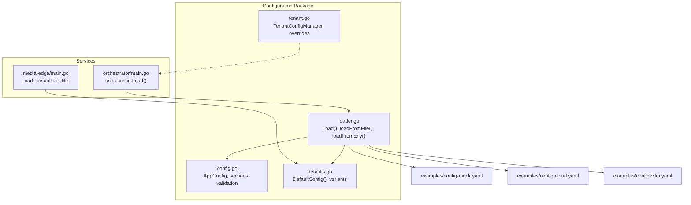
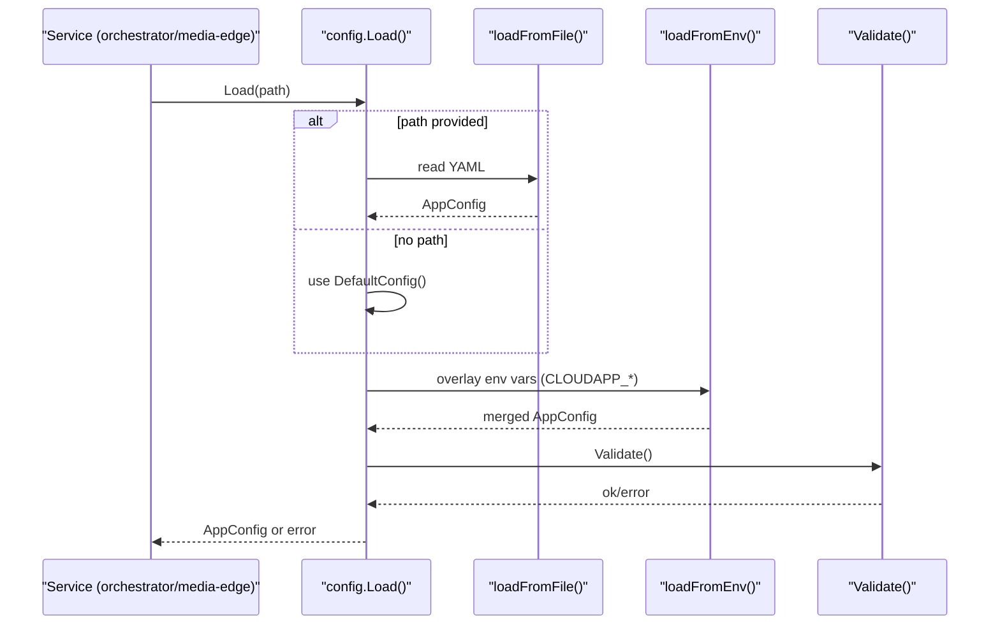
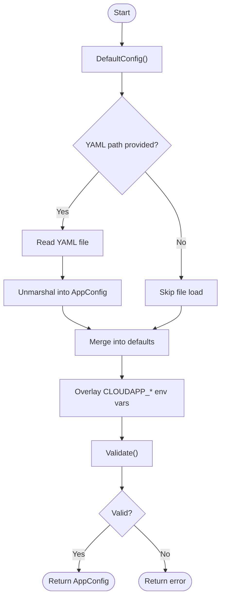
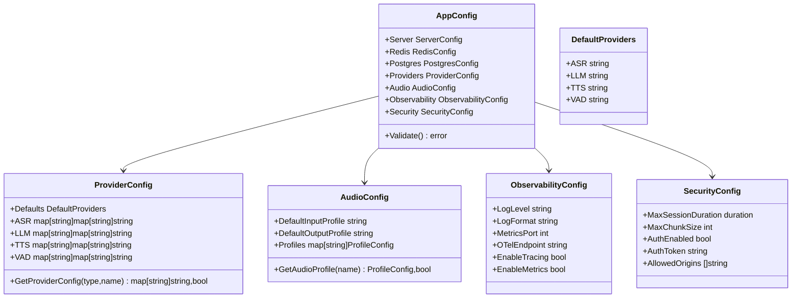
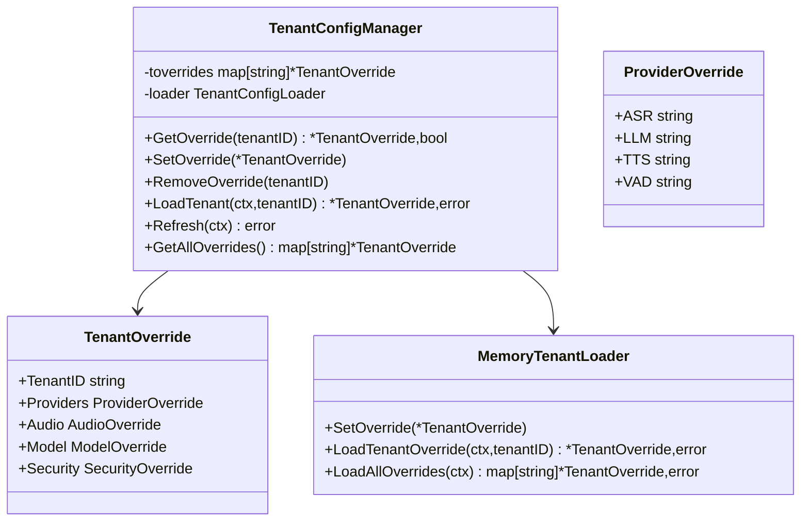
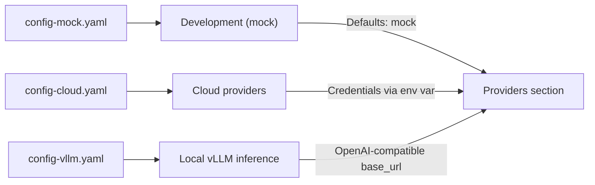
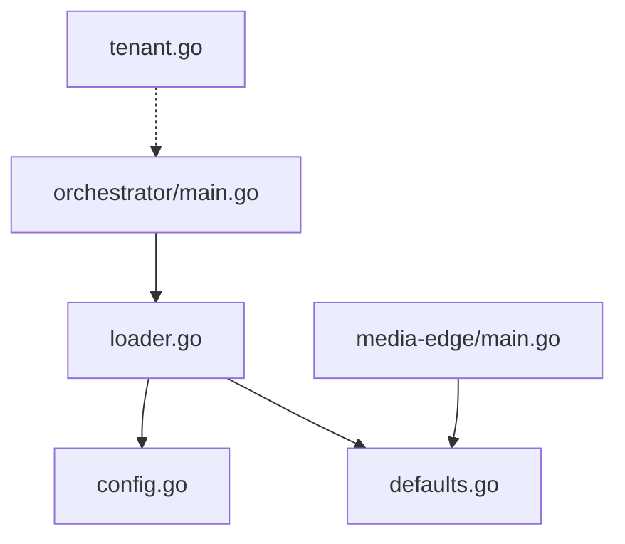

# Configuration Management

<cite>
**Referenced Files in This Document**
- [config.go](file://go/pkg/config/config.go)
- [loader.go](file://go/pkg/config/loader.go)
- [defaults.go](file://go/pkg/config/defaults.go)
- [tenant.go](file://go/pkg/config/tenant.go)
- [config_test.go](file://go/pkg/config/config_test.go)
- [config-reference.md](file://docs/config-reference.md)
- [config-mock.yaml](file://examples/config-mock.yaml)
- [config-cloud.yaml](file://examples/config-cloud.yaml)
- [config-vllm.yaml](file://examples/config-vllm.yaml)
- [main.go (orchestrator)](file://go/orchestrator/cmd/main.go)
- [main.go (media-edge)](file://go/media-edge/cmd/main.go)
</cite>

## Table of Contents
1. [Introduction](#introduction)
2. [Project Structure](#project-structure)
3. [Core Components](#core-components)
4. [Architecture Overview](#architecture-overview)
5. [Detailed Component Analysis](#detailed-component-analysis)
6. [Dependency Analysis](#dependency-analysis)
7. [Performance Considerations](#performance-considerations)
8. [Troubleshooting Guide](#troubleshooting-guide)
9. [Conclusion](#conclusion)
10. [Appendices](#appendices)

## Introduction
This document explains CloudApp’s configuration management system with a focus on YAML-based configuration loading, environment-specific overrides, and multi-tenant configuration support. It covers the configuration loading and validation process, environment variable precedence, tenant-based provider selection and session isolation, and practical examples drawn from the included example configurations. It also documents the configuration schema, supported parameters, and best practices for production deployments.

## Project Structure
CloudApp’s configuration system is implemented in Go under the package github.com/parlona/cloudapp/pkg/config. Services consume configuration via a loader that merges defaults, file-based YAML, and environment variable overrides, then validates the final configuration before use.

**Diagram sources**
- [config.go:9-276](file://go/pkg/config/config.go#L9-L276)
- [loader.go:14-82](file://go/pkg/config/loader.go#L14-L82)
- [defaults.go:7-118](file://go/pkg/config/defaults.go#L7-L118)
- [tenant.go:46-201](file://go/pkg/config/tenant.go#L46-L201)
- [main.go (orchestrator):37-42](file://go/orchestrator/cmd/main.go#L37-L42)
- [main.go (media-edge):183-199](file://go/media-edge/cmd/main.go#L183-L199)
- [config-mock.yaml:1-44](file://examples/config-mock.yaml#L1-L44)
- [config-cloud.yaml:1-39](file://examples/config-cloud.yaml#L1-L39)
- [config-vllm.yaml:1-31](file://examples/config-vllm.yaml#L1-L31)

**Section sources**
- [config.go:9-276](file://go/pkg/config/config.go#L9-L276)
- [loader.go:14-82](file://go/pkg/config/loader.go#L14-L82)
- [defaults.go:7-118](file://go/pkg/config/defaults.go#L7-L118)
- [tenant.go:46-201](file://go/pkg/config/tenant.go#L46-L201)
- [config-reference.md:1-454](file://docs/config-reference.md#L1-L454)
- [config-mock.yaml:1-44](file://examples/config-mock.yaml#L1-L44)
- [config-cloud.yaml:1-39](file://examples/config-cloud.yaml#L1-L39)
- [config-vllm.yaml:1-31](file://examples/config-vllm.yaml#L1-L31)
- [main.go (orchestrator):37-42](file://go/orchestrator/cmd/main.go#L37-L42)
- [main.go (media-edge):183-199](file://go/media-edge/cmd/main.go#L183-L199)

## Core Components
- AppConfig: Root configuration holding all sections (server, redis, postgres, providers, audio, observability, security).
- Loader: Loads defaults, merges YAML file, overlays environment variables, and validates.
- Defaults: Provides sensible defaults and environment-optimized presets (local dev, mock mode, production).
- TenantConfigManager: Manages per-tenant overrides for providers, audio profiles, model parameters, and security settings.

Key behaviors:
- YAML file loading unmarshals into AppConfig.
- Environment variables are parsed and applied to the loaded configuration.
- Validation ensures required fields are present and normalized.
- Tenant overrides provide per-tenant provider selection and session isolation.

**Section sources**
- [config.go:9-276](file://go/pkg/config/config.go#L9-L276)
- [loader.go:14-82](file://go/pkg/config/loader.go#L14-L82)
- [defaults.go:7-118](file://go/pkg/config/defaults.go#L7-L118)
- [tenant.go:46-201](file://go/pkg/config/tenant.go#L46-L201)

## Architecture Overview
The configuration lifecycle is consistent across services: load defaults, optionally overlay YAML, overlay environment variables, validate, and use.

**Diagram sources**
- [loader.go:14-82](file://go/pkg/config/loader.go#L14-L82)
- [defaults.go:7-118](file://go/pkg/config/defaults.go#L7-L118)
- [config.go:96-120](file://go/pkg/config/config.go#L96-L120)
- [main.go (orchestrator):37-42](file://go/orchestrator/cmd/main.go#L37-L42)

## Detailed Component Analysis

### YAML Loading and Environment Overrides
- File loading: Reads and parses YAML into AppConfig.
- Environment overlay: Applies CLOUDAPP_* variables with underscore-separated nested keys. Numeric and boolean values are parsed appropriately.
- Precedence: Environment variables override YAML values; both override defaults.

**Diagram sources**
- [loader.go:14-82](file://go/pkg/config/loader.go#L14-L82)
- [defaults.go:7-118](file://go/pkg/config/defaults.go#L7-L118)
- [config.go:96-120](file://go/pkg/config/config.go#L96-L120)

**Section sources**
- [loader.go:14-82](file://go/pkg/config/loader.go#L14-L82)
- [config_test.go:207-313](file://go/pkg/config/config_test.go#L207-L313)

### Configuration Schema and Validation
- AppConfig includes typed sections for server, redis, postgres, providers, audio, observability, and security.
- Validation normalizes missing or invalid values to safe defaults and enforces basic constraints.
- Provider configuration supports default providers and provider-specific parameters.

**Diagram sources**
- [config.go:9-276](file://go/pkg/config/config.go#L9-L276)

**Section sources**
- [config.go:9-276](file://go/pkg/config/config.go#L9-L276)
- [config-reference.md:424-435](file://docs/config-reference.md#L424-L435)

### Multi-Tenant Configuration Support
- TenantConfigManager stores per-tenant overrides and exposes thread-safe getters/setters.
- Overrides include provider selection (ASR/LLM/TTS/VAD), audio profiles, model parameters, and security settings.
- In-memory loader is provided for testing; database loaders are stubbed for future implementation.

**Diagram sources**
- [tenant.go:46-201](file://go/pkg/config/tenant.go#L46-L201)

**Section sources**
- [tenant.go:46-201](file://go/pkg/config/tenant.go#L46-L201)
- [config_test.go:315-423](file://go/pkg/config/config_test.go#L315-L423)

### Example Configurations and Deployment Scenarios
- Development (mock): Minimal providers for local iteration.
- Cloud providers: Uses managed ASR/LLM/TTS with credentials and environment variables.
- Local vLLM inference: Points LLM to a locally running OpenAI-compatible server.

**Diagram sources**
- [config-mock.yaml:1-44](file://examples/config-mock.yaml#L1-L44)
- [config-cloud.yaml:1-39](file://examples/config-cloud.yaml#L1-L39)
- [config-vllm.yaml:1-31](file://examples/config-vllm.yaml#L1-L31)

**Section sources**
- [config-mock.yaml:1-44](file://examples/config-mock.yaml#L1-L44)
- [config-cloud.yaml:1-39](file://examples/config-cloud.yaml#L1-L39)
- [config-vllm.yaml:1-31](file://examples/config-vllm.yaml#L1-L31)
- [config-reference.md:338-423](file://docs/config-reference.md#L338-L423)

### Runtime Configuration Updates and Error Handling
- YAML and environment overrides are processed at startup; there is no built-in hot-reload mechanism in the loader.
- Validation errors and environment parsing errors are surfaced during Load().
- Services handle configuration failures early and exit with informative messages.

Practical guidance:
- Prefer environment variable overrides for containerized deployments.
- Keep YAML minimal and rely on defaults; override only what is necessary.
- Validate configuration changes in CI using the same loader path.

**Section sources**
- [loader.go:14-82](file://go/pkg/config/loader.go#L14-L82)
- [config.go:96-120](file://go/pkg/config/config.go#L96-L120)
- [main.go (orchestrator):37-42](file://go/orchestrator/cmd/main.go#L37-L42)
- [main.go (media-edge):183-199](file://go/media-edge/cmd/main.go#L183-L199)

## Dependency Analysis
Configuration dependencies are straightforward: services depend on the loader and defaults, while the loader depends on the configuration structs and YAML parser.

**Diagram sources**
- [loader.go:14-82](file://go/pkg/config/loader.go#L14-L82)
- [defaults.go:7-118](file://go/pkg/config/defaults.go#L7-L118)
- [config.go:9-276](file://go/pkg/config/config.go#L9-L276)
- [tenant.go:46-201](file://go/pkg/config/tenant.go#L46-L201)
- [main.go (orchestrator):37-42](file://go/orchestrator/cmd/main.go#L37-L42)
- [main.go (media-edge):183-199](file://go/media-edge/cmd/main.go#L183-L199)

**Section sources**
- [loader.go:14-82](file://go/pkg/config/loader.go#L14-L82)
- [defaults.go:7-118](file://go/pkg/config/defaults.go#L7-L118)
- [config.go:9-276](file://go/pkg/config/config.go#L9-L276)
- [tenant.go:46-201](file://go/pkg/config/tenant.go#L46-L201)
- [main.go (orchestrator):37-42](file://go/orchestrator/cmd/main.go#L37-L42)
- [main.go (media-edge):183-199](file://go/media-edge/cmd/main.go#L183-L199)

## Performance Considerations
- Configuration loading occurs once at startup; keep YAML concise and avoid unnecessary nesting.
- Environment variable parsing is linear in the number of variables; prefer grouping related settings under CLOUDAPP_*.
- Validation is lightweight but essential—avoid repeated re-validation in steady-state.

## Troubleshooting Guide
Common issues and resolutions:
- Invalid YAML: Ensure the file parses correctly; the loader reports parse errors.
- Unknown environment variables: Only CLOUDAPP_* variables with proper underscore-separated keys are applied.
- Validation failures: Fix missing or out-of-range values; defaults are applied automatically during validation.
- Tenant not found: Memory loader returns an error if a tenant override is not present.

Operational tips:
- Use LocalDevConfig or ProductionConfig presets to align defaults with environment.
- Validate environment variables with a dry-run of the loader in CI.

**Section sources**
- [loader.go:59-82](file://go/pkg/config/loader.go#L59-L82)
- [config.go:96-249](file://go/pkg/config/config.go#L96-L249)
- [config_test.go:378-423](file://go/pkg/config/config_test.go#L378-L423)

## Conclusion
CloudApp’s configuration system combines YAML-driven declarative configuration with environment variable overrides and robust validation. The tenant override subsystem enables per-tenant provider selection and session isolation. By leveraging the provided defaults, loader, and examples, teams can confidently deploy and operate CloudApp across development, staging, and production environments.

## Appendices

### Configuration Loading and Precedence
- File location resolution: CLI flag, environment variable, or embedded defaults.
- Precedence order: Environment variables override YAML, which overrides defaults.
- Validation runs after merging to ensure correctness.

**Section sources**
- [config-reference.md:7-46](file://docs/config-reference.md#L7-L46)
- [loader.go:14-82](file://go/pkg/config/loader.go#L14-L82)
- [config.go:96-120](file://go/pkg/config/config.go#L96-L120)

### Example Scenarios and Best Practices
- Development: Use config-mock.yaml with LocalDevConfig preset.
- Production: Use config-cloud.yaml with ProductionConfig preset and secure environment variables.
- Local vLLM: Use config-vllm.yaml with openai_compatible pointing to a local server.

**Section sources**
- [config-reference.md:338-423](file://docs/config-reference.md#L338-L423)
- [config-mock.yaml:1-44](file://examples/config-mock.yaml#L1-L44)
- [config-cloud.yaml:1-39](file://examples/config-cloud.yaml#L1-L39)
- [config-vllm.yaml:1-31](file://examples/config-vllm.yaml#L1-L31)
- [defaults.go:85-118](file://go/pkg/config/defaults.go#L85-L118)