# Benchmarking Suite

<cite>
**Referenced Files in This Document**
- [main.go](file://go/bench/cmd/main.go)
- [dataset.go](file://go/bench/internal/dataset/dataset.go)
- [report.go](file://go/bench/internal/report/report.go)
- [asr_bench.go](file://go/bench/internal/runner/asr_bench.go)
- [llm_bench.go](file://go/bench/internal/runner/llm_bench.go)
- [tts_bench.go](file://go/bench/internal/runner/tts_bench.go)
- [chain_bench.go](file://go/bench/internal/runner/chain_bench.go)
- [grpc_client.go](file://go/pkg/providers/grpc_client.go)
- [settings.py](file://py/provider_gateway/app/config/settings.py)
- [config-cloud.yaml](file://examples/config-cloud.yaml)
- [config-local.yaml](file://examples/config-local.yaml)
- [sample-transcript.json](file://examples/sample-transcript.json)
</cite>

## Table of Contents
1. [Introduction](#introduction)
2. [Project Structure](#project-structure)
3. [Core Components](#core-components)
4. [Architecture Overview](#architecture-overview)
5. [Detailed Component Analysis](#detailed-component-analysis)
6. [Dependency Analysis](#dependency-analysis)
7. [Performance Considerations](#performance-considerations)
8. [Troubleshooting Guide](#troubleshooting-guide)
9. [Conclusion](#conclusion)

## Introduction
This document describes the CloudApp Benchmarking Suite, a Go-based tool for measuring latency and performance of ASR, LLM, and TTS providers integrated through a gRPC gateway. It supports standalone benchmarks for each stage and end-to-end chain measurements, with configurable warmup, pacing, chunking, and output formats (JSON, CSV, Markdown). The suite is designed to evaluate provider performance under realistic conditions while remaining portable across different provider backends.

## Project Structure
The benchmarking suite is organized into distinct packages that handle input datasets, benchmark runners, reporting, and CLI orchestration. Supporting components include provider gateway configuration and example configurations.

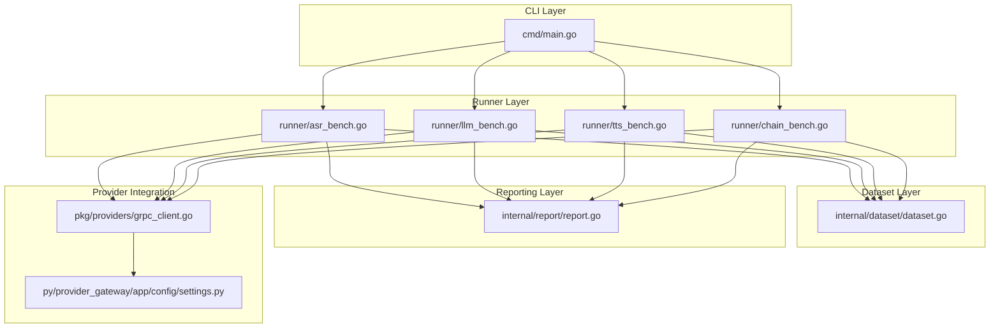

**Diagram sources**
- [main.go:70-95](file://go/bench/cmd/main.go#L70-L95)
- [asr_bench.go:14-50](file://go/bench/internal/runner/asr_bench.go#L14-L50)
- [llm_bench.go:14-47](file://go/bench/internal/runner/llm_bench.go#L14-L47)
- [tts_bench.go:13-48](file://go/bench/internal/runner/tts_bench.go#L13-L48)
- [chain_bench.go:15-74](file://go/bench/internal/runner/chain_bench.go#L15-L74)
- [dataset.go:12-118](file://go/bench/internal/dataset/dataset.go#L12-L118)
- [report.go:11-77](file://go/bench/internal/report/report.go#L11-L77)
- [grpc_client.go:35-60](file://go/pkg/providers/grpc_client.go#L35-L60)
- [settings.py:53-68](file://py/provider_gateway/app/config/settings.py#L53-L68)

**Section sources**
- [main.go:22-68](file://go/bench/cmd/main.go#L22-L68)
- [dataset.go:12-118](file://go/bench/internal/dataset/dataset.go#L12-L118)
- [report.go:63-77](file://go/bench/internal/report/report.go#L63-L77)
- [asr_bench.go:14-50](file://go/bench/internal/runner/asr_bench.go#L14-L50)
- [llm_bench.go:14-47](file://go/bench/internal/runner/llm_bench.go#L14-L47)
- [tts_bench.go:13-48](file://go/bench/internal/runner/tts_bench.go#L13-L48)
- [chain_bench.go:15-74](file://go/bench/internal/runner/chain_bench.go#L15-L74)
- [grpc_client.go:35-60](file://go/pkg/providers/grpc_client.go#L35-L60)
- [settings.py:53-68](file://py/provider_gateway/app/config/settings.py#L53-L68)

## Core Components
- CLI Entrypoint: Parses flags, dispatches commands, and orchestrates benchmark runs. Supports asr, llm, tts, and chain modes with extensive configuration options for iterations, warmup, pacing, chunking, and output formats.
- Dataset Loader: Reads WAV and raw PCM16 audio, and text/prompt files for LLM/TTS benchmarks. Provides metadata such as duration, sample rate, and channels.
- Runner Modules: Implement stage-specific benchmark logic with streaming support, timing measurement, and optional pacing. Each runner encapsulates warmup handling, iteration delays, and result collection.
- Reporting Engine: Aggregates per-iteration results into summaries with percentiles (p50, p95, p99), mean values, min/max, and stage-specific metrics (tokens/sec for LLM, RTF for TTS).
- Provider Integration: gRPC client wrappers for ASR, LLM, and TTS providers, configured with timeouts and connection handling. These clients integrate with the Python provider gateway.

Key responsibilities:
- Timing: Captures start, first-output, and end timestamps to compute TTFT (time to first token/output) and total latency.
- Streaming: Streams audio chunks for ASR and consumes token/audio streams for LLM/TTS to measure streaming responsiveness.
- Pacing: Optional real-time pacing for ASR to simulate live audio ingestion.
- Warmup: Discards initial runs to stabilize provider caches and warm-up resources.
- Output: Produces JSON, CSV, and Markdown reports with detailed iteration results and summary statistics.

**Section sources**
- [main.go:97-127](file://go/bench/cmd/main.go#L97-L127)
- [dataset.go:12-118](file://go/bench/internal/dataset/dataset.go#L12-L118)
- [report.go:11-77](file://go/bench/internal/report/report.go#L11-L77)
- [asr_bench.go:52-75](file://go/bench/internal/runner/asr_bench.go#L52-L75)
- [llm_bench.go:49-84](file://go/bench/internal/runner/llm_bench.go#L49-L84)
- [tts_bench.go:51-74](file://go/bench/internal/runner/tts_bench.go#L51-L74)
- [chain_bench.go:88-113](file://go/bench/internal/runner/chain_bench.go#L88-L113)
- [grpc_client.go:35-60](file://go/pkg/providers/grpc_client.go#L35-L60)

## Architecture Overview
The benchmarking suite follows a layered architecture:
- CLI layer parses user input and invokes appropriate runners.
- Runner layer executes benchmarks against providers using streaming APIs.
- Dataset layer supplies inputs and metadata.
- Reporting layer aggregates and formats results.
- Provider integration layer connects to the provider gateway via gRPC.

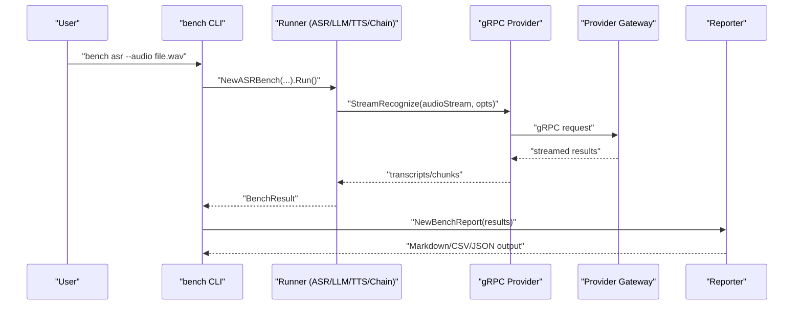

**Diagram sources**
- [main.go:308-358](file://go/bench/cmd/main.go#L308-L358)
- [asr_bench.go:52-75](file://go/bench/internal/runner/asr_bench.go#L52-L75)
- [grpc_client.go:62-95](file://go/pkg/providers/grpc_client.go#L62-L95)
- [report.go:70-77](file://go/bench/internal/report/report.go#L70-L77)

**Section sources**
- [main.go:70-95](file://go/bench/cmd/main.go#L70-L95)
- [asr_bench.go:52-75](file://go/bench/internal/runner/asr_bench.go#L52-L75)
- [grpc_client.go:35-60](file://go/pkg/providers/grpc_client.go#L35-L60)
- [report.go:63-77](file://go/bench/internal/report/report.go#L63-L77)

## Detailed Component Analysis

### CLI and Command Dispatch
The CLI supports four commands:
- asr: Benchmarks audio transcription with optional pacing and chunking.
- llm: Benchmarks text generation with system prompts and sampling parameters.
- tts: Benchmarks speech synthesis with voice selection and speed control.
- chain: Runs end-to-end ASR->LLM->TTS with shared session IDs and timing.

Command-line flags include gateway address, iteration counts, warmup, delay intervals, and output formats. The dispatcher validates arguments and delegates to the appropriate runner.

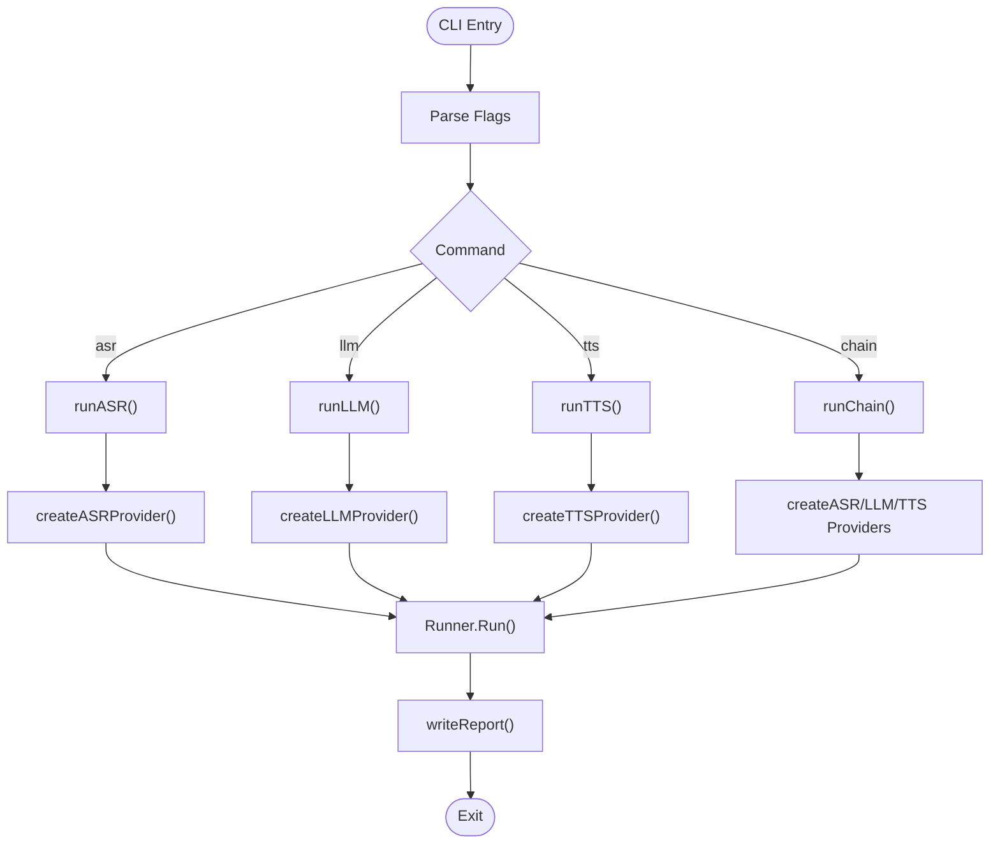

**Diagram sources**
- [main.go:70-95](file://go/bench/cmd/main.go#L70-L95)
- [main.go:308-358](file://go/bench/cmd/main.go#L308-L358)
- [main.go:360-427](file://go/bench/cmd/main.go#L360-L427)
- [main.go:429-494](file://go/bench/cmd/main.go#L429-L494)
- [main.go:496-599](file://go/bench/cmd/main.go#L496-L599)

**Section sources**
- [main.go:22-68](file://go/bench/cmd/main.go#L22-L68)
- [main.go:97-127](file://go/bench/cmd/main.go#L97-L127)
- [main.go:308-358](file://go/bench/cmd/main.go#L308-L358)
- [main.go:360-427](file://go/bench/cmd/main.go#L360-L427)
- [main.go:429-494](file://go/bench/cmd/main.go#L429-L494)
- [main.go:496-599](file://go/bench/cmd/main.go#L496-L599)

### ASR Benchmark Runner
The ASR runner streams audio in configurable chunks, optionally paced to real-time. It measures TTFT from session start to first transcript and records total duration. Warmup iterations are discarded, and optional delays separate runs.

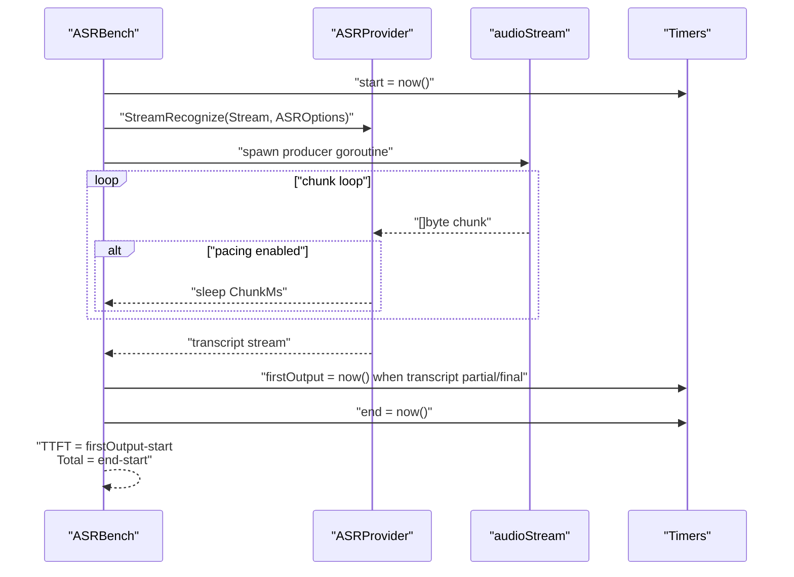

**Diagram sources**
- [asr_bench.go:77-163](file://go/bench/internal/runner/asr_bench.go#L77-L163)
- [dataset.go:12-118](file://go/bench/internal/dataset/dataset.go#L12-L118)

**Section sources**
- [asr_bench.go:14-50](file://go/bench/internal/runner/asr_bench.go#L14-L50)
- [asr_bench.go:52-75](file://go/bench/internal/runner/asr_bench.go#L52-L75)
- [asr_bench.go:77-163](file://go/bench/internal/runner/asr_bench.go#L77-L163)
- [dataset.go:12-118](file://go/bench/internal/dataset/dataset.go#L12-L118)

### LLM Benchmark Runner
The LLM runner constructs chat messages (with optional system prompt), streams tokens, and computes tokens-per-second. It captures TTFT on first token and total latency.

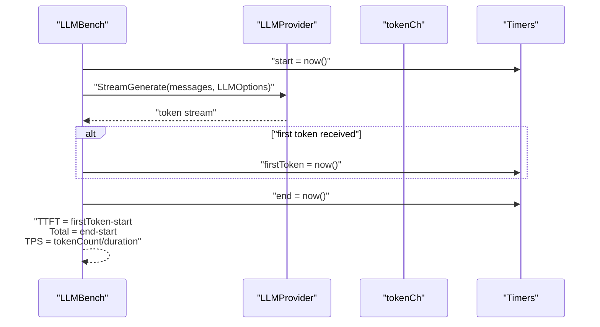

**Diagram sources**
- [llm_bench.go:86-153](file://go/bench/internal/runner/llm_bench.go#L86-L153)

**Section sources**
- [llm_bench.go:14-47](file://go/bench/internal/runner/llm_bench.go#L14-L47)
- [llm_bench.go:49-84](file://go/bench/internal/runner/llm_bench.go#L49-L84)
- [llm_bench.go:86-153](file://go/bench/internal/runner/llm_bench.go#L86-L153)

### TTS Benchmark Runner
The TTS runner streams synthesized audio, measures TTFT on first chunk, and computes real-time factor (RTF) based on audio duration vs. synthesis time.

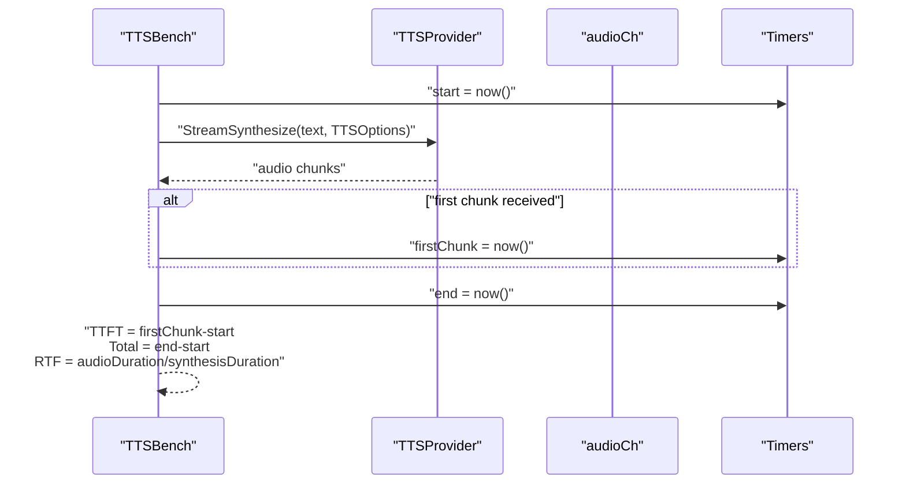

**Diagram sources**
- [tts_bench.go:76-136](file://go/bench/internal/runner/tts_bench.go#L76-L136)

**Section sources**
- [tts_bench.go:13-48](file://go/bench/internal/runner/tts_bench.go#L13-L48)
- [tts_bench.go:51-74](file://go/bench/internal/runner/tts_bench.go#L51-L74)
- [tts_bench.go:76-136](file://go/bench/internal/runner/tts_bench.go#L76-L136)

### Chain Benchmark Runner
The chain runner orchestrates end-to-end execution across ASR, LLM, and TTS. It maintains a shared session ID and computes per-stage timings plus total end-to-end latency and TTFA (time to first audio).

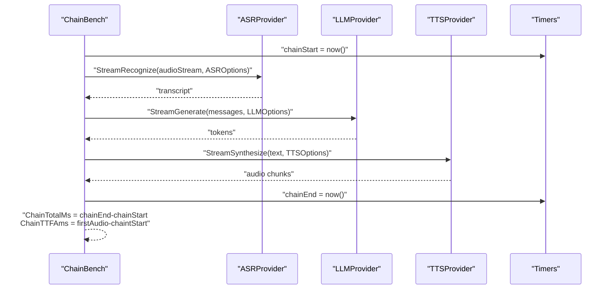

**Diagram sources**
- [chain_bench.go:88-113](file://go/bench/internal/runner/chain_bench.go#L88-L113)
- [chain_bench.go:115-324](file://go/bench/internal/runner/chain_bench.go#L115-L324)

**Section sources**
- [chain_bench.go:15-74](file://go/bench/internal/runner/chain_bench.go#L15-L74)
- [chain_bench.go:88-113](file://go/bench/internal/runner/chain_bench.go#L88-L113)
- [chain_bench.go:115-324](file://go/bench/internal/runner/chain_bench.go#L115-L324)

### Dataset Loading
The dataset package handles:
- Audio: WAV parsing with PCM16 extraction and raw PCM16 loading with assumed 16kHz mono.
- Prompts: Text files with one prompt per line, skipping comments.
- Texts: Text files with one synthesis sample per line, skipping comments.
- Silence: Generation of PCM16 silence for testing.

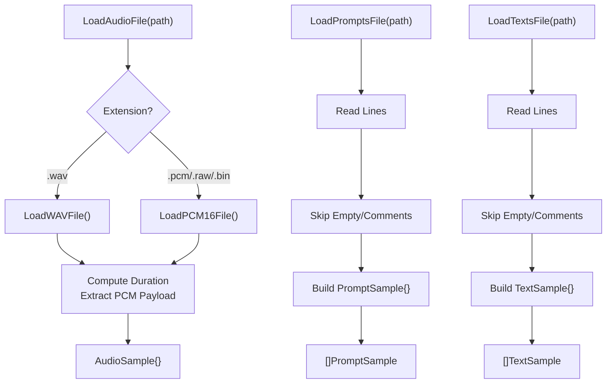

**Diagram sources**
- [dataset.go:107-118](file://go/bench/internal/dataset/dataset.go#L107-L118)
- [dataset.go:41-105](file://go/bench/internal/dataset/dataset.go#L41-L105)
- [dataset.go:127-153](file://go/bench/internal/dataset/dataset.go#L127-L153)
- [dataset.go:161-184](file://go/bench/internal/dataset/dataset.go#L161-L184)

**Section sources**
- [dataset.go:12-118](file://go/bench/internal/dataset/dataset.go#L12-L118)
- [dataset.go:120-184](file://go/bench/internal/dataset/dataset.go#L120-L184)

### Reporting and Statistics
The reporting module aggregates results by stage and provider, computing:
- Iterations and error counts
- Percentiles: p50, p95, p99 for TTFT and total latency
- Means and extremes
- Stage-specific metrics: tokens/sec (LLM), RTF (TTS)

It also formats outputs as Markdown tables and CSV.

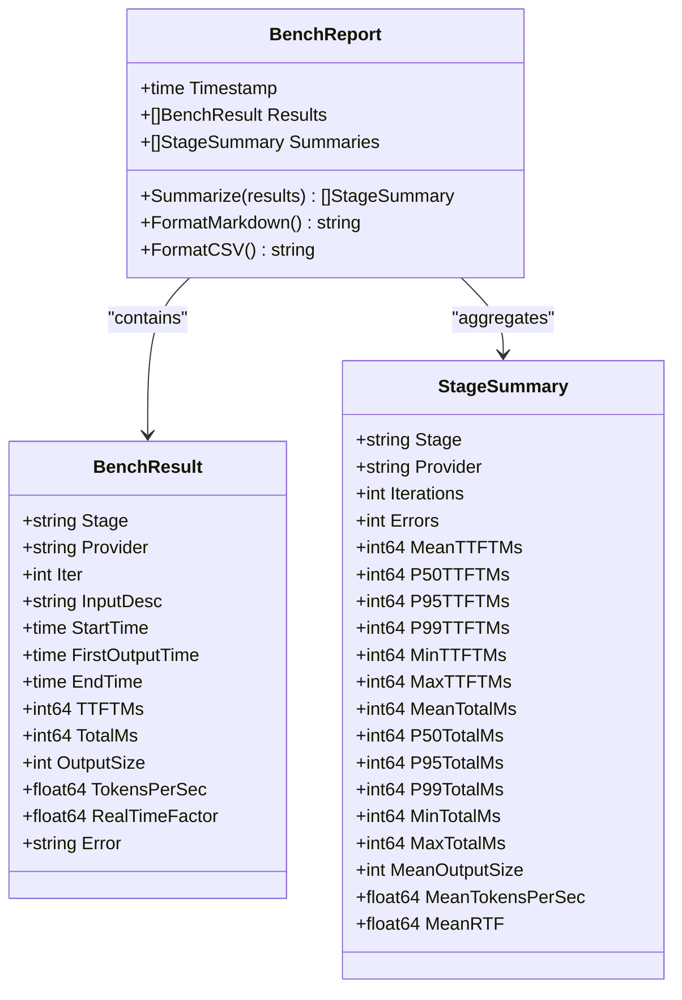

**Diagram sources**
- [report.go:11-77](file://go/bench/internal/report/report.go#L11-L77)
- [report.go:79-159](file://go/bench/internal/report/report.go#L79-L159)
- [report.go:223-279](file://go/bench/internal/report/report.go#L223-L279)

**Section sources**
- [report.go:63-77](file://go/bench/internal/report/report.go#L63-L77)
- [report.go:79-159](file://go/bench/internal/report/report.go#L79-L159)
- [report.go:223-279](file://go/bench/internal/report/report.go#L223-L279)

### Provider Integration and Gateway Configuration
The benchmark suite communicates with providers via gRPC clients configured with timeouts and retry policies. The Python provider gateway defines server and provider configurations, including default providers and environment overrides.

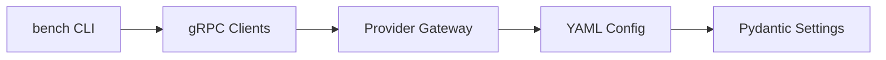

**Diagram sources**
- [grpc_client.go:14-33](file://go/pkg/providers/grpc_client.go#L14-L33)
- [grpc_client.go:44-60](file://go/pkg/providers/grpc_client.go#L44-L60)
- [settings.py:53-68](file://py/provider_gateway/app/config/settings.py#L53-L68)
- [config-cloud.yaml:1-39](file://examples/config-cloud.yaml#L1-L39)
- [config-local.yaml:1-38](file://examples/config-local.yaml#L1-L38)

**Section sources**
- [grpc_client.go:14-33](file://go/pkg/providers/grpc_client.go#L14-L33)
- [grpc_client.go:44-60](file://go/pkg/providers/grpc_client.go#L44-L60)
- [settings.py:53-68](file://py/provider_gateway/app/config/settings.py#L53-L68)
- [config-cloud.yaml:1-39](file://examples/config-cloud.yaml#L1-L39)
- [config-local.yaml:1-38](file://examples/config-local.yaml#L1-L38)

## Dependency Analysis
The benchmark suite exhibits clean separation of concerns:
- CLI depends on runners and reporters.
- Runners depend on providers and dataset loaders.
- Providers depend on gRPC clients and the gateway.
- Reporters depend on statistical utilities.

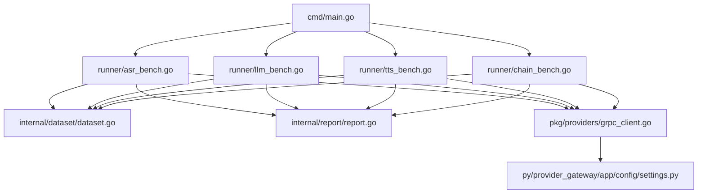

**Diagram sources**
- [main.go:70-95](file://go/bench/cmd/main.go#L70-L95)
- [asr_bench.go:14-50](file://go/bench/internal/runner/asr_bench.go#L14-L50)
- [llm_bench.go:14-47](file://go/bench/internal/runner/llm_bench.go#L14-L47)
- [tts_bench.go:13-48](file://go/bench/internal/runner/tts_bench.go#L13-L48)
- [chain_bench.go:15-74](file://go/bench/internal/runner/chain_bench.go#L15-L74)
- [dataset.go:12-118](file://go/bench/internal/dataset/dataset.go#L12-L118)
- [report.go:63-77](file://go/bench/internal/report/report.go#L63-L77)
- [grpc_client.go:35-60](file://go/pkg/providers/grpc_client.go#L35-L60)
- [settings.py:53-68](file://py/provider_gateway/app/config/settings.py#L53-L68)

**Section sources**
- [main.go:70-95](file://go/bench/cmd/main.go#L70-L95)
- [asr_bench.go:14-50](file://go/bench/internal/runner/asr_bench.go#L14-L50)
- [llm_bench.go:14-47](file://go/bench/internal/runner/llm_bench.go#L14-L47)
- [tts_bench.go:13-48](file://go/bench/internal/runner/tts_bench.go#L13-L48)
- [chain_bench.go:15-74](file://go/bench/internal/runner/chain_bench.go#L15-L74)
- [dataset.go:12-118](file://go/bench/internal/dataset/dataset.go#L12-L118)
- [report.go:63-77](file://go/bench/internal/report/report.go#L63-L77)
- [grpc_client.go:35-60](file://go/pkg/providers/grpc_client.go#L35-L60)
- [settings.py:53-68](file://py/provider_gateway/app/config/settings.py#L53-L68)

## Performance Considerations
- Warmup: Use warmup iterations to mitigate cold starts and cache warming effects.
- Pacing: Enable ASR pacing to simulate real-time audio ingestion and assess latency under constrained throughput.
- Chunk Size: Tune chunk size to balance responsiveness and overhead; smaller chunks reduce TTFT but increase protocol overhead.
- Delays: Introduce inter-run delays to avoid resource contention and stabilize measurements.
- Output Formats: Prefer CSV for bulk analysis and Markdown for quick inspection.
- Provider Configuration: Align provider settings (model, temperature, voice) with intended workload characteristics.

## Troubleshooting Guide
Common issues and resolutions:
- Provider connection failures: Verify gateway address and network connectivity; ensure the provider gateway is running and reachable.
- Empty transcripts or responses: Confirm audio quality and language hints; check provider capabilities and model availability.
- Timeout errors: Increase timeout values in provider configuration; reduce concurrency or adjust chunk sizes.
- Missing input files: Validate paths for audio, prompts, and texts; ensure files are readable and formatted correctly.
- Unexpected errors in reports: Inspect error fields in CSV/Markdown outputs; correlate with provider logs and gateway telemetry.

Operational tips:
- Use quiet mode for concise summaries during automated runs.
- Generate JSON reports for programmatic analysis and dashboards.
- Monitor provider gateway metrics and logs for anomalies.

**Section sources**
- [main.go:267-306](file://go/bench/cmd/main.go#L267-L306)
- [report.go:223-279](file://go/bench/internal/report/report.go#L223-L279)
- [grpc_client.go:21-33](file://go/pkg/providers/grpc_client.go#L21-L33)

## Conclusion
The CloudApp Benchmarking Suite provides a robust framework for evaluating ASR, LLM, TTS, and end-to-end chain performance. Its modular design, comprehensive timing instrumentation, and flexible configuration enable accurate and repeatable measurements across diverse provider backends. By leveraging warmup, pacing, and structured reporting, teams can derive actionable insights into provider latency characteristics and optimize system behavior accordingly.