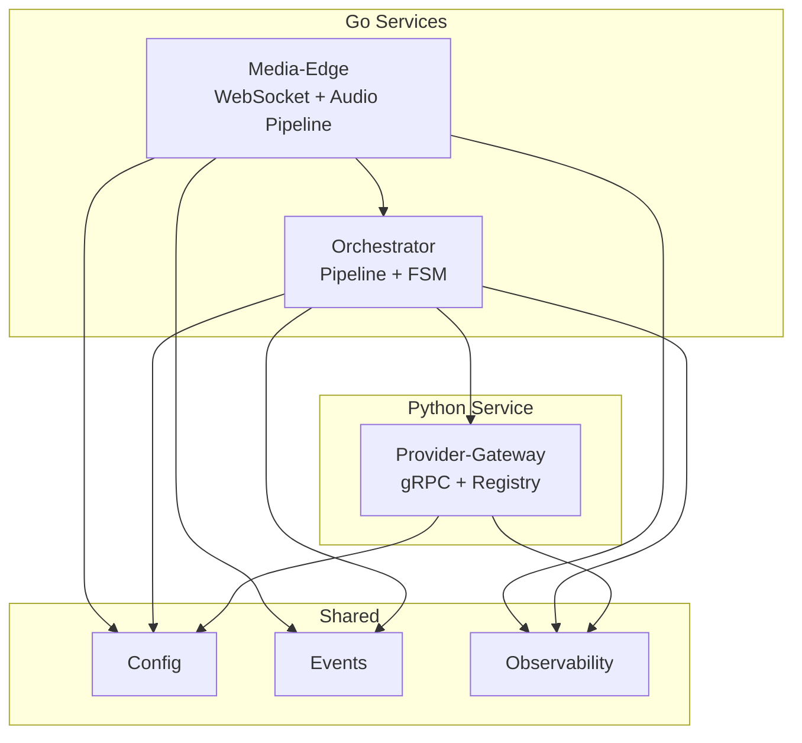
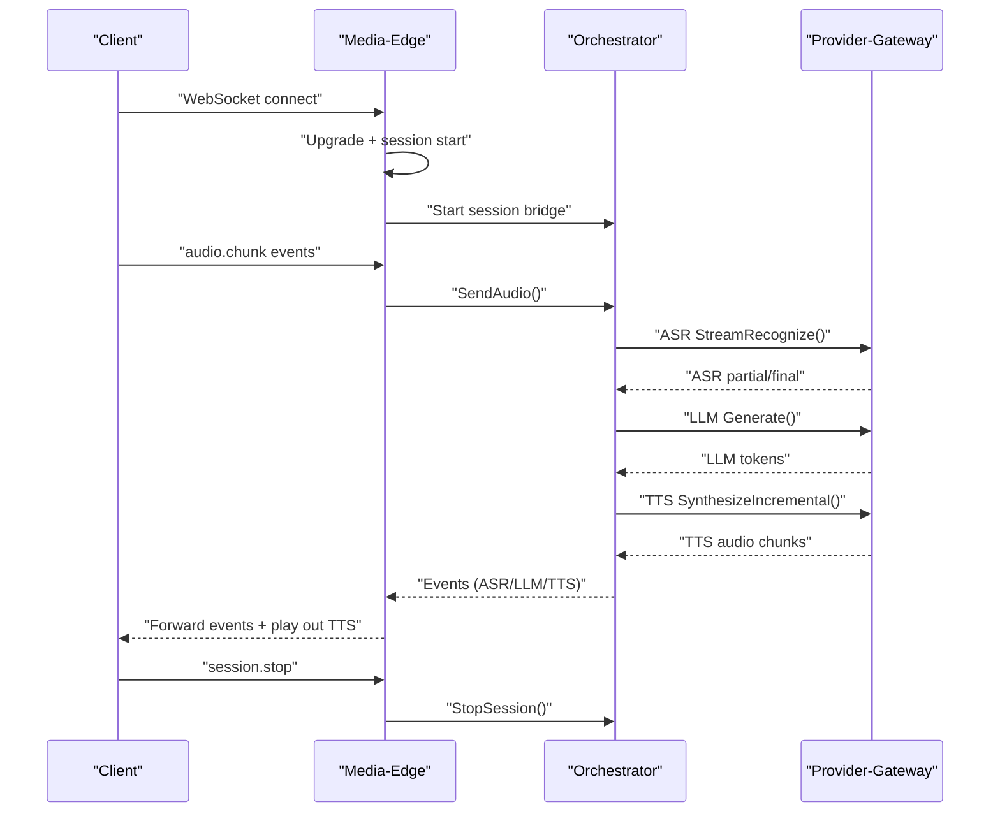
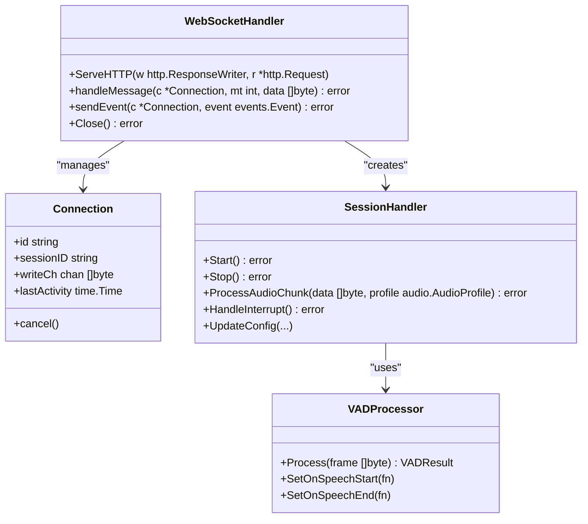
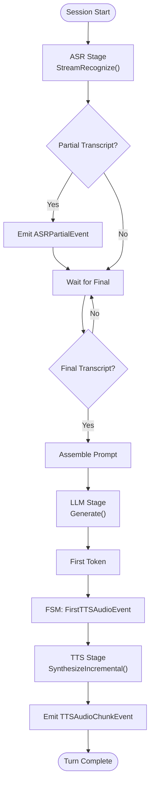
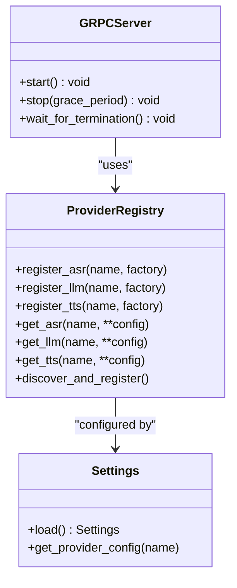
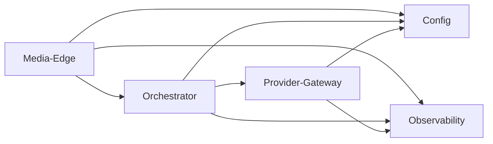

# Core Services

<cite>
**Referenced Files in This Document**
- [go/media-edge/cmd/main.go](file://go/media-edge/cmd/main.go)
- [go/media-edge/internal/handler/websocket.go](file://go/media-edge/internal/handler/websocket.go)
- [go/media-edge/internal/handler/session_handler.go](file://go/media-edge/internal/handler/session_handler.go)
- [go/media-edge/internal/handler/middleware.go](file://go/media-edge/internal/handler/middleware.go)
- [go/media-edge/internal/vad/vad.go](file://go/media-edge/internal/vad/vad.go)
- [go/orchestrator/cmd/main.go](file://go/orchestrator/cmd/main.go)
- [go/orchestrator/internal/pipeline/engine.go](file://go/orchestrator/internal/pipeline/engine.go)
- [go/orchestrator/internal/pipeline/asr_stage.go](file://go/orchestrator/internal/pipeline/asr_stage.go)
- [go/orchestrator/internal/statemachine/fsm.go](file://go/orchestrator/internal/statemachine/fsm.go)
- [go/pkg/config/config.go](file://go/pkg/config/config.go)
- [py/provider_gateway/main.py](file://py/provider_gateway/main.py)
- [py/provider_gateway/app/__main__.py](file://py/provider_gateway/app/__main__.py)
- [py/provider_gateway/app/grpc_api/server.py](file://py/provider_gateway/app/grpc_api/server.py)
- [py/provider_gateway/app/config/settings.py](file://py/provider_gateway/app/config/settings.py)
- [py/provider_gateway/app/core/registry.py](file://py/provider_gateway/app/core/registry.py)
</cite>

## Table of Contents
1. [Introduction](#introduction)
2. [Project Structure](#project-structure)
3. [Core Components](#core-components)
4. [Architecture Overview](#architecture-overview)
5. [Detailed Component Analysis](#detailed-component-analysis)
6. [Dependency Analysis](#dependency-analysis)
7. [Performance Considerations](#performance-considerations)
8. [Troubleshooting Guide](#troubleshooting-guide)
9. [Conclusion](#conclusion)

## Introduction
This document explains CloudApp’s core microservices with a focus on three principal services:
- Media-Edge: Real-time audio ingestion, VAD-driven speech segmentation, and WebSocket orchestration.
- Orchestrator: Session state management, pipeline coordination (ASR → LLM → TTS), and provider orchestration.
- Provider-Gateway: Python-based gRPC provider framework exposing ASR, LLM, and TTS services.

It covers responsibilities, entry points, internal architecture, implementation details, configuration options, usage patterns, error handling strategies, performance considerations, and operational aspects such as lifecycle and health checks.

## Project Structure
CloudApp is organized into:
- Go-based services (Media-Edge and Orchestrator) under go/.
- Python-based Provider-Gateway under py/provider_gateway/.
- Shared packages under go/pkg/, protocol buffers under proto/, and infrastructure under infra/.

**Diagram sources**
- [go/media-edge/cmd/main.go:30-180](file://go/media-edge/cmd/main.go#L30-L180)
- [go/orchestrator/cmd/main.go:26-193](file://go/orchestrator/cmd/main.go#L26-L193)
- [py/provider_gateway/app/__main__.py:15-72](file://py/provider_gateway/app/__main__.py#L15-L72)

**Section sources**
- [go/media-edge/cmd/main.go:30-180](file://go/media-edge/cmd/main.go#L30-L180)
- [go/orchestrator/cmd/main.go:26-193](file://go/orchestrator/cmd/main.go#L26-L193)
- [py/provider_gateway/app/__main__.py:15-72](file://py/provider_gateway/app/__main__.py#L15-L72)

## Core Components
- Media-Edge
  - Entry point: HTTP server with WebSocket upgrade and health/readiness endpoints.
  - Responsibilities: WebSocket handling, audio normalization/chunking, VAD integration, session lifecycle, and event forwarding to Orchestrator.
- Orchestrator
  - Entry point: HTTP server with health/readiness and metrics endpoints.
  - Responsibilities: Session state machine, pipeline orchestration, provider registry, and turn management.
- Provider-Gateway
  - Entry point: Async gRPC server initialization and graceful shutdown.
  - Responsibilities: Provider registry, capability exposure, and gRPC service endpoints for ASR/LLM/TTS.

**Section sources**
- [go/media-edge/cmd/main.go:30-180](file://go/media-edge/cmd/main.go#L30-L180)
- [go/orchestrator/cmd/main.go:26-193](file://go/orchestrator/cmd/main.go#L26-L193)
- [py/provider_gateway/app/__main__.py:15-72](file://py/provider_gateway/app/__main__.py#L15-L72)

## Architecture Overview
High-level interaction among services:
- Clients connect to Media-Edge via WebSocket.
- Media-Edge normalizes audio, runs VAD, and forwards audio to Orchestrator.
- Orchestrator coordinates ASR → LLM → TTS via provider registry and emits events.
- Provider-Gateway exposes provider implementations over gRPC for Orchestrator to consume.

**Diagram sources**
- [go/media-edge/internal/handler/websocket.go:261-374](file://go/media-edge/internal/handler/websocket.go#L261-L374)
- [go/media-edge/internal/handler/session_handler.go:176-225](file://go/media-edge/internal/handler/session_handler.go#L176-L225)
- [go/orchestrator/internal/pipeline/engine.go:108-208](file://go/orchestrator/internal/pipeline/engine.go#L108-L208)
- [go/orchestrator/internal/pipeline/asr_stage.go:47-162](file://go/orchestrator/internal/pipeline/asr_stage.go#L47-L162)
- [py/provider_gateway/app/grpc_api/server.py:54-90](file://py/provider_gateway/app/grpc_api/server.py#L54-L90)

## Detailed Component Analysis

### Media-Edge Service
Responsibilities:
- WebSocket upgrade and per-connection lifecycle management.
- Audio normalization, chunking, and jitter buffering.
- VAD-based speech detection and interruption handling.
- Session creation/update/stop and event forwarding to Orchestrator.
- Health/readiness endpoints and Prometheus metrics.

Entry points:
- HTTP server with chained middleware and endpoints:
  - WebSocket path configured in config.
  - /health and /ready endpoints.
  - /metrics endpoint when enabled.

WebSocket handling:
- Upgrades HTTP to WebSocket, enforces allowed origins, and maintains active connections map.
- Reads messages with deadlines, writes via a buffered channel, and pings periodically.
- Parses JSON events and routes to appropriate handlers.

Audio processing pipeline:
- Normalizes incoming PCM to canonical format.
- Splits into 10 ms frames at 16 kHz.
- VAD processor triggers speech start/end events and accumulates audio for ASR.
- On interruption (user speaks while bot is speaking), clears output buffer and transitions state.

VAD integration:
- Energy-based VAD with configurable thresholds and hangover.
- Adaptive variant adjusts threshold based on noise floor.
- Callbacks for speech start/end durations.

Session lifecycle:
- Creates session on session.start, stores it, and starts session handler.
- Updates configuration on session.update.
- Stops on session.stop, deletes session, and closes connection.

Error handling:
- Panic recovery middleware returns 500 and logs stack traces.
- Unsupported message types and oversized messages are rejected.
- Write failures and unexpected close errors are logged and connection closed.

Operational aspects:
- Graceful shutdown drains connections and closes stores.
- Health endpoint returns OK; readiness checks Redis connectivity in Orchestrator.

**Diagram sources**
- [go/media-edge/internal/handler/websocket.go:22-92](file://go/media-edge/internal/handler/websocket.go#L22-L92)
- [go/media-edge/internal/handler/session_handler.go:17-51](file://go/media-edge/internal/handler/session_handler.go#L17-L51)
- [go/media-edge/internal/vad/vad.go:305-345](file://go/media-edge/internal/vad/vad.go#L305-L345)

**Section sources**
- [go/media-edge/cmd/main.go:94-180](file://go/media-edge/cmd/main.go#L94-L180)
- [go/media-edge/internal/handler/websocket.go:94-192](file://go/media-edge/internal/handler/websocket.go#L94-L192)
- [go/media-edge/internal/handler/session_handler.go:119-174](file://go/media-edge/internal/handler/session_handler.go#L119-L174)
- [go/media-edge/internal/handler/middleware.go:27-131](file://go/media-edge/internal/handler/middleware.go#L27-L131)
- [go/media-edge/internal/vad/vad.go:105-197](file://go/media-edge/internal/vad/vad.go#L105-L197)

### Orchestrator Service
Responsibilities:
- Manages session state machine and turn lifecycle.
- Coordinates ASR → LLM → TTS pipeline with concurrency and incremental delivery.
- Registers and invokes providers via gRPC through Provider-Gateway.
- Tracks timestamps and emits turn/state events.

Entry points:
- HTTP server with /health, /ready, and /metrics endpoints.
- Connects to Redis for persistence and readiness checks.

Pipeline coordination:
- ProcessSession streams audio to ASR stage and emits partial/final transcripts.
- On final transcript, builds prompts, starts LLM generation, and begins incremental TTS.
- Concurrency: LLM tokens and TTS audio streams are processed independently until completion.

Session state management:
- SessionFSM defines valid transitions and emits turn events.
- TurnManager tracks generated tokens and supports interruption and commit semantics.

Provider orchestration:
- Provider registry is populated by connecting to Provider-Gateway address.
- ASR/LLM/TTS providers are registered with timeouts and retries.

**Diagram sources**
- [go/orchestrator/internal/pipeline/engine.go:108-208](file://go/orchestrator/internal/pipeline/engine.go#L108-L208)
- [go/orchestrator/internal/pipeline/asr_stage.go:47-162](file://go/orchestrator/internal/pipeline/asr_stage.go#L47-L162)
- [go/orchestrator/internal/statemachine/fsm.go:101-161](file://go/orchestrator/internal/statemachine/fsm.go#L101-L161)

**Section sources**
- [go/orchestrator/cmd/main.go:122-193](file://go/orchestrator/cmd/main.go#L122-L193)
- [go/orchestrator/internal/pipeline/engine.go:17-106](file://go/orchestrator/internal/pipeline/engine.go#L17-L106)
- [go/orchestrator/internal/pipeline/engine.go:108-375](file://go/orchestrator/internal/pipeline/engine.go#L108-L375)
- [go/orchestrator/internal/pipeline/asr_stage.go:47-162](file://go/orchestrator/internal/pipeline/asr_stage.go#L47-L162)
- [go/orchestrator/internal/statemachine/fsm.go:44-92](file://go/orchestrator/internal/statemachine/fsm.go#L44-L92)

### Provider-Gateway Service
Responsibilities:
- Exposes gRPC services for ASR, LLM, and TTS.
- Provides provider registry with dynamic discovery and caching.
- Initializes telemetry (logging, metrics, tracing) and starts the async gRPC server.

Entry points:
- Python entry point delegates to async main.
- Async main loads settings, initializes telemetry, discovers providers, and starts gRPC server.

gRPC service exposure:
- Creates grpc.aio.server with thread pool and max message sizes.
- Adds ASRService, LLMService, TTSService, and ProviderService servicers.
- Binds to host/port and sets up signal handlers for graceful shutdown.

Provider framework:
- ProviderRegistry caches provider instances keyed by name and config hash.
- Supports dynamic module loading and built-in provider discovery.
- Capability queries supported by providers.

**Diagram sources**
- [py/provider_gateway/app/grpc_api/server.py:25-134](file://py/provider_gateway/app/grpc_api/server.py#L25-L134)
- [py/provider_gateway/app/core/registry.py:19-241](file://py/provider_gateway/app/core/registry.py#L19-L241)
- [py/provider_gateway/app/config/settings.py:53-125](file://py/provider_gateway/app/config/settings.py#L53-L125)

**Section sources**
- [py/provider_gateway/main.py:7-13](file://py/provider_gateway/main.py#L7-L13)
- [py/provider_gateway/app/__main__.py:15-72](file://py/provider_gateway/app/__main__.py#L15-L72)
- [py/provider_gateway/app/grpc_api/server.py:54-90](file://py/provider_gateway/app/grpc_api/server.py#L54-L90)
- [py/provider_gateway/app/core/registry.py:85-169](file://py/provider_gateway/app/core/registry.py#L85-L169)
- [py/provider_gateway/app/config/settings.py:114-125](file://py/provider_gateway/app/config/settings.py#L114-L125)

## Dependency Analysis
- Media-Edge depends on:
  - Session store abstraction (placeholder in MVP).
  - Orchestrator bridge for in-process session coordination.
  - VAD and audio utilities for processing.
  - Observability for logging, metrics, and tracing.
- Orchestrator depends on:
  - Redis for persistence and readiness checks.
  - Provider registry connected to Provider-Gateway.
  - Session store and persistence abstractions.
  - Pipeline stages (ASR/LLM/TTS) with circuit breakers.
- Provider-Gateway depends on:
  - ProviderRegistry for provider lifecycle.
  - gRPC server implementation for service exposure.
  - Settings for configuration and environment overrides.

**Diagram sources**
- [go/media-edge/cmd/main.go:74-82](file://go/media-edge/cmd/main.go#L74-L82)
- [go/orchestrator/cmd/main.go:89-106](file://go/orchestrator/cmd/main.go#L89-L106)
- [py/provider_gateway/app/grpc_api/server.py:54-90](file://py/provider_gateway/app/grpc_api/server.py#L54-L90)

**Section sources**
- [go/media-edge/cmd/main.go:74-82](file://go/media-edge/cmd/main.go#L74-L82)
- [go/orchestrator/cmd/main.go:89-106](file://go/orchestrator/cmd/main.go#L89-L106)
- [py/provider_gateway/app/grpc_api/server.py:54-90](file://py/provider_gateway/app/grpc_api/server.py#L54-L90)

## Performance Considerations
- Media-Edge
  - Jitter buffers and 10 ms frame processing balance latency and throughput.
  - VAD hangover prevents premature speech end detection.
  - Buffered write channel decouples event emission from network writes.
  - Metrics and tracing enable monitoring of latency and error rates.
- Orchestrator
  - Concurrency between LLM token and TTS audio streams reduces end-to-end latency.
  - Circuit breakers protect downstream providers from cascading failures.
  - Timestamp tracking enables detailed latency analysis across stages.
- Provider-Gateway
  - Thread pool sizing impacts throughput; adjust max_workers according to workload.
  - Max message sizes configured to support larger payloads.
  - Provider caching avoids repeated instantiation overhead.

[No sources needed since this section provides general guidance]

## Troubleshooting Guide
Common issues and strategies:
- WebSocket upgrade failures
  - Validate allowed origins and CORS headers.
  - Check Read/Write timeouts and ping/pong handling.
- Audio pipeline stalls
  - Verify VAD thresholds and frame sizes.
  - Inspect jitter buffer capacity and output playout progress.
- Orchestrator readiness
  - Confirm Redis connectivity and key prefix configuration.
  - Monitor circuit breaker state for providers.
- Provider-Gateway shutdown
  - Ensure signal handlers are registered and server.stop is awaited.
  - Check provider discovery logs for missing modules.

Operational endpoints:
- Media-Edge: /health returns OK; /ready checks dependencies; /metrics exposes Prometheus metrics.
- Orchestrator: /health returns healthy; /ready checks Redis; /metrics exposes Prometheus metrics.

**Section sources**
- [go/media-edge/internal/handler/websocket.go:96-129](file://go/media-edge/internal/handler/websocket.go#L96-L129)
- [go/media-edge/internal/handler/middleware.go:27-131](file://go/media-edge/internal/handler/middleware.go#L27-L131)
- [go/orchestrator/cmd/main.go:125-145](file://go/orchestrator/cmd/main.go#L125-L145)
- [py/provider_gateway/app/grpc_api/server.py:104-129](file://py/provider_gateway/app/grpc_api/server.py#L104-L129)

## Conclusion
CloudApp’s core services form a cohesive real-time conversational AI platform:
- Media-Edge focuses on robust audio ingestion and VAD-driven segmentation.
- Orchestrator coordinates the end-to-end pipeline with precise state management and provider orchestration.
- Provider-Gateway offers a flexible, extensible framework for integrating diverse providers over gRPC.

The documented entry points, internal architectures, configuration options, and operational patterns provide a practical foundation for deploying, tuning, and maintaining these services.