# Audio Transport Layer

<cite>
**Referenced Files in This Document**
- [chunk.go](file://go/pkg/audio/chunk.go)
- [buffer.go](file://go/pkg/audio/buffer.go)
- [format.go](file://go/pkg/audio/format.go)
- [resample.go](file://go/pkg/audio/resample.go)
- [normalize.go](file://go/pkg/audio/normalize.go)
- [playout.go](file://go/pkg/audio/playout.go)
- [transport.go](file://go/media-edge/internal/transport/transport.go)
- [websocket.go](file://go/media-edge/internal/handler/websocket.go)
- [session_handler.go](file://go/media-edge/internal/handler/session_handler.go)
- [event.go](file://go/pkg/events/event.go)
- [common.go](file://go/pkg/contracts/common.go)
- [config.go](file://go/pkg/config/config.go)
- [audio_test.go](file://go/pkg/audio/audio_test.go)
</cite>

## Table of Contents
1. [Introduction](#introduction)
2. [Project Structure](#project-structure)
3. [Core Components](#core-components)
4. [Architecture Overview](#architecture-overview)
5. [Detailed Component Analysis](#detailed-component-analysis)
6. [Dependency Analysis](#dependency-analysis)
7. [Performance Considerations](#performance-considerations)
8. [Troubleshooting Guide](#troubleshooting-guide)
9. [Conclusion](#conclusion)

## Introduction
This document explains the audio transport layer responsible for real-time audio streaming and format conversion in the system. It covers:
- Audio chunking and buffering strategies
- Format negotiation between client and server
- Transport protocol for audio frames (WebSocket)
- Chunk size optimization, timing synchronization, and error recovery
- Audio format conversion pipeline (encodings, sample rates, channel conversion)
- Configuration options for audio quality, latency, and bandwidth adaptation
- Examples of audio frame protocols, chunk boundaries, and stream termination signals
- Performance optimization techniques including adaptive bitrate and compression strategies

## Project Structure
The audio transport layer spans several packages:
- Audio processing utilities: chunking, buffering, format profiles, normalization, resampling, playout tracking
- Transport abstraction: WebSocket transport for real-time audio streaming
- Handler: WebSocket handler and session handler orchestrate audio lifecycle
- Events: WebSocket event types for control and audio data exchange
- Contracts: internal audio format and provider type definitions
- Config: audio quality and security settings

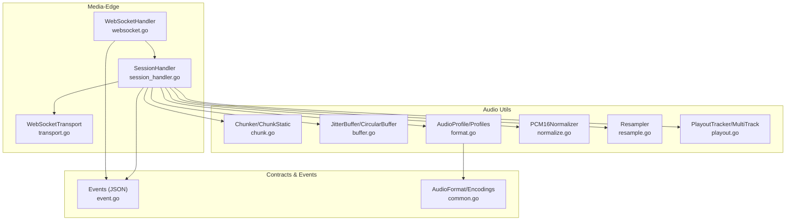

**Diagram sources**
- [websocket.go:1-592](file://go/media-edge/internal/handler/websocket.go#L1-L592)
- [session_handler.go:1-540](file://go/media-edge/internal/handler/session_handler.go#L1-L540)
- [transport.go:1-332](file://go/media-edge/internal/transport/transport.go#L1-L332)
- [chunk.go:1-230](file://go/pkg/audio/chunk.go#L1-L230)
- [buffer.go:1-334](file://go/pkg/audio/buffer.go#L1-L334)
- [format.go:1-140](file://go/pkg/audio/format.go#L1-L140)
- [normalize.go:1-352](file://go/pkg/audio/normalize.go#L1-L352)
- [resample.go:1-173](file://go/pkg/audio/resample.go#L1-L173)
- [playout.go:1-383](file://go/pkg/audio/playout.go#L1-L383)
- [event.go:1-210](file://go/pkg/events/event.go#L1-L210)
- [common.go:1-169](file://go/pkg/contracts/common.go#L1-L169)

**Section sources**
- [websocket.go:1-592](file://go/media-edge/internal/handler/websocket.go#L1-L592)
- [session_handler.go:1-540](file://go/media-edge/internal/handler/session_handler.go#L1-L540)
- [transport.go:1-332](file://go/media-edge/internal/transport/transport.go#L1-L332)
- [chunk.go:1-230](file://go/pkg/audio/chunk.go#L1-L230)
- [buffer.go:1-334](file://go/pkg/audio/buffer.go#L1-L334)
- [format.go:1-140](file://go/pkg/audio/format.go#L1-L140)
- [normalize.go:1-352](file://go/pkg/audio/normalize.go#L1-L352)
- [resample.go:1-173](file://go/pkg/audio/resample.go#L1-L173)
- [playout.go:1-383](file://go/pkg/audio/playout.go#L1-L383)
- [event.go:1-210](file://go/pkg/events/event.go#L1-L210)
- [common.go:1-169](file://go/pkg/contracts/common.go#L1-L169)

## Core Components
- Audio chunking and framing: Fixed-size frame splitting with partial-frame handling
- Buffers: Jitter buffer for backpressure and circular buffer for overwrite behavior
- Format profiles: Canonical and preset profiles with bytes-per-sample/frame calculations
- Normalization: Encoding conversion, channel downmix, and resampling to canonical format
- Resampling: Linear interpolation resampler with configurable supported rates
- Playout tracking: Byte-level progress tracking and completion callbacks
- Transport: WebSocket transport abstraction with ping/pong, deadlines, and write pump
- Handler: WebSocket handler for session lifecycle and SessionHandler for audio pipeline orchestration
- Events: JSON-based event protocol for control and audio data exchange

**Section sources**
- [chunk.go:1-230](file://go/pkg/audio/chunk.go#L1-L230)
- [buffer.go:1-334](file://go/pkg/audio/buffer.go#L1-L334)
- [format.go:1-140](file://go/pkg/audio/format.go#L1-L140)
- [normalize.go:1-352](file://go/pkg/audio/normalize.go#L1-L352)
- [resample.go:1-173](file://go/pkg/audio/resample.go#L1-L173)
- [playout.go:1-383](file://go/pkg/audio/playout.go#L1-L383)
- [transport.go:1-332](file://go/media-edge/internal/transport/transport.go#L1-L332)
- [websocket.go:1-592](file://go/media-edge/internal/handler/websocket.go#L1-L592)
- [session_handler.go:1-540](file://go/media-edge/internal/handler/session_handler.go#L1-L540)
- [event.go:1-210](file://go/pkg/events/event.go#L1-L210)

## Architecture Overview
The audio transport layer integrates WebSocket transport with audio processing and session orchestration:

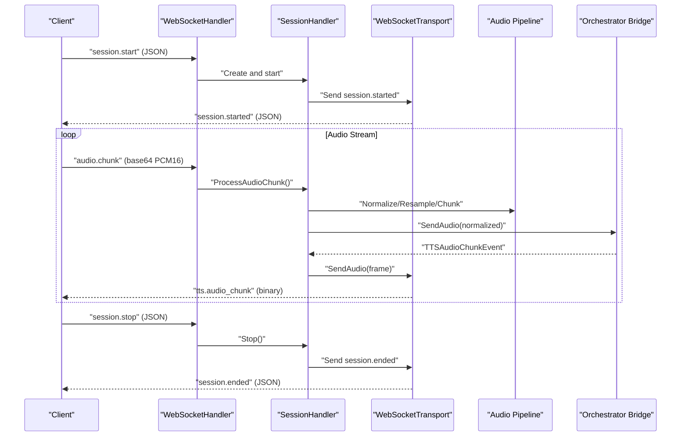

**Diagram sources**
- [websocket.go:220-481](file://go/media-edge/internal/handler/websocket.go#L220-L481)
- [session_handler.go:176-225](file://go/media-edge/internal/handler/session_handler.go#L176-L225)
- [transport.go:82-116](file://go/media-edge/internal/transport/transport.go#L82-L116)
- [event.go:15-35](file://go/pkg/events/event.go#L15-L35)

## Detailed Component Analysis

### Audio Chunking Mechanism
- Chunker: Maintains a sliding buffer and emits fixed-size frames, invoking a callback for each complete frame
- ChunkStatic: Stateless chunking returning complete frames and a partial remainder
- FrameChunker: Convenience wrapper using an AudioProfile-derived frame size

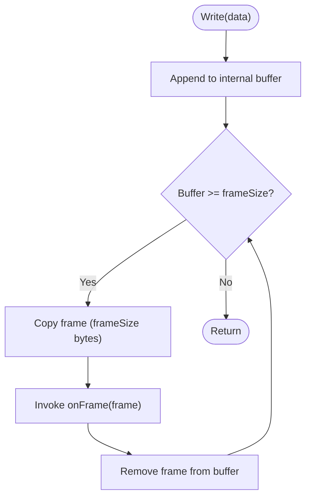

**Diagram sources**
- [chunk.go:23-40](file://go/pkg/audio/chunk.go#L23-L40)

**Section sources**
- [chunk.go:7-101](file://go/pkg/audio/chunk.go#L7-L101)
- [audio_test.go:107-185](file://go/pkg/audio/audio_test.go#L107-L185)

### Buffering Strategies
- JitterBuffer: Thread-safe FIFO with backpressure, read/write timeouts, and stats
- CircularBuffer: Overwrite mode for high-throughput scenarios
- BufferedAudioReader/Writer: io.Reader/io.Writer wrappers around JitterBuffer

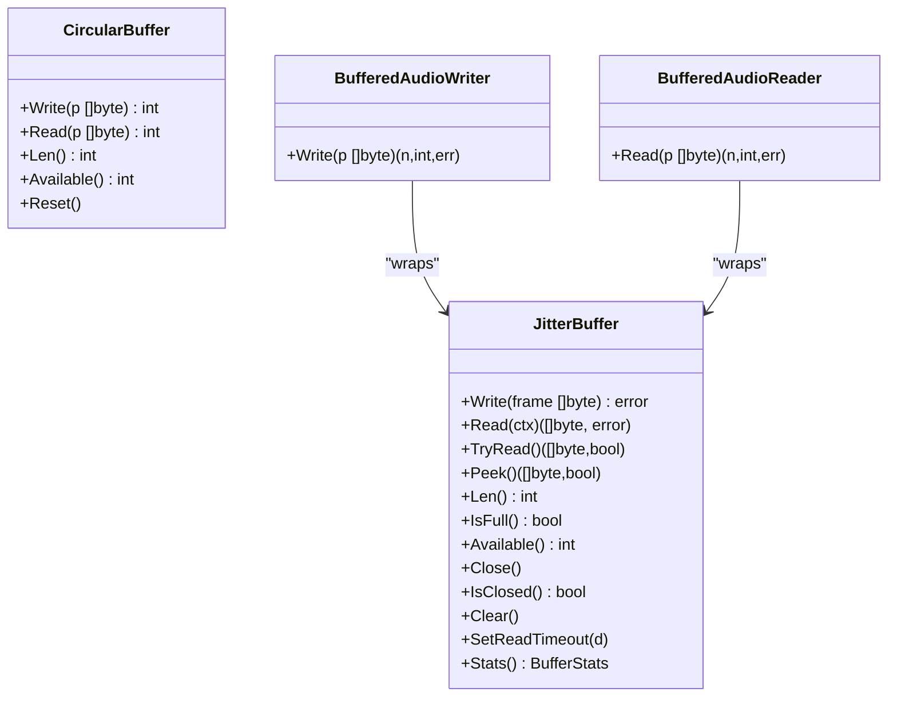

**Diagram sources**
- [buffer.go:16-334](file://go/pkg/audio/buffer.go#L16-L334)

**Section sources**
- [buffer.go:16-198](file://go/pkg/audio/buffer.go#L16-L198)
- [audio_test.go:220-343](file://go/pkg/audio/audio_test.go#L220-L343)

### Audio Format Profiles and Negotiation
- AudioProfile: Defines sample rate, channels, encoding, and frame size
- Canonical and preset profiles (internal, telephony, WebRTC)
- Conversion helpers: BytesPerSample, BytesPerFrame, DurationFromBytes, BytesFromDuration
- Negotiation: Client sends audio_profile in session.start; server stores and uses for normalization

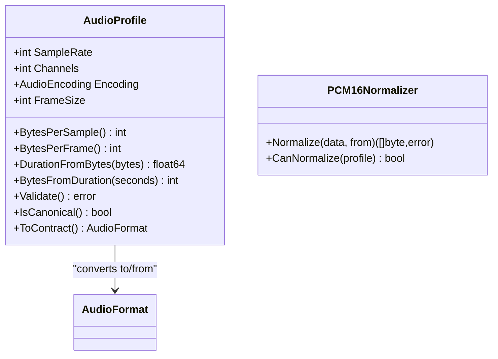

**Diagram sources**
- [format.go:11-121](file://go/pkg/audio/format.go#L11-L121)
- [normalize.go:19-85](file://go/pkg/audio/normalize.go#L19-L85)
- [common.go:97-102](file://go/pkg/contracts/common.go#L97-L102)

**Section sources**
- [format.go:11-140](file://go/pkg/audio/format.go#L11-L140)
- [websocket.go:260-374](file://go/media-edge/internal/handler/websocket.go#L260-L374)

### Audio Format Conversion Pipeline
- Encoding conversion: G.711 u-law/A-law to/from PCM16
- Channel conversion: Multi-channel to mono averaging
- Resampling: Linear interpolation to target sample rate
- Canonicalization: Normalize to internal profile (16kHz, mono, PCM16)

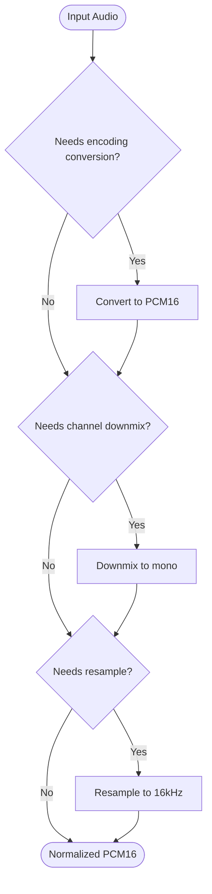

**Diagram sources**
- [normalize.go:31-74](file://go/pkg/audio/normalize.go#L31-L74)
- [resample.go:26-61](file://go/pkg/audio/resample.go#L26-L61)

**Section sources**
- [normalize.go:19-352](file://go/pkg/audio/normalize.go#L19-L352)
- [resample.go:8-173](file://go/pkg/audio/resample.go#L8-L173)
- [session_handler.go:176-225](file://go/media-edge/internal/handler/session_handler.go#L176-L225)

### Transport Protocol for Audio Frames
- WebSocket transport: Binary audio frames and JSON events
- Message types: Text (JSON), Binary (audio), Ping/Pong for keepalive
- Backpressure: Channel-based write pump with overflow handling
- Deadlines: Read/write deadlines enforced by transport

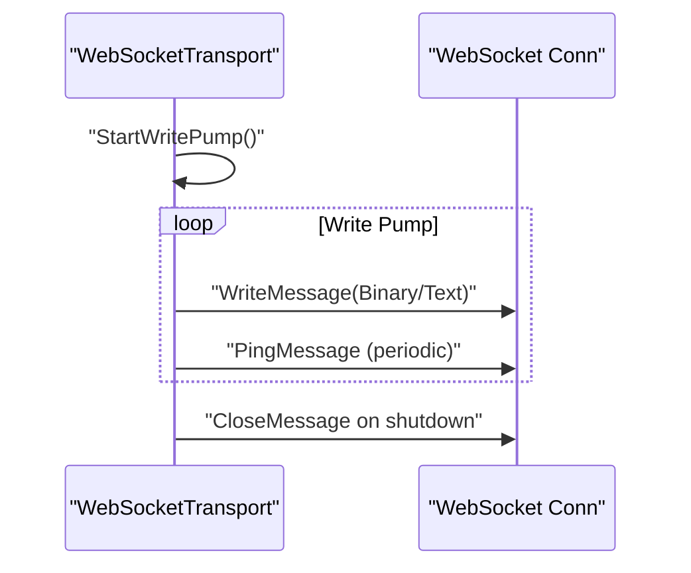

**Diagram sources**
- [transport.go:118-168](file://go/media-edge/internal/transport/transport.go#L118-L168)
- [transport.go:265-280](file://go/media-edge/internal/transport/transport.go#L265-L280)

**Section sources**
- [transport.go:16-42](file://go/media-edge/internal/transport/transport.go#L16-L42)
- [transport.go:44-332](file://go/media-edge/internal/transport/transport.go#L44-L332)

### Timing Synchronization and Playout Tracking
- PlayoutTracker: Tracks bytes sent, calculates position/duration, completion callbacks
- MultiTrackPlayout: Manages multiple concurrent audio tracks
- SessionHandler drives playout at 10ms intervals and updates active turn cursor

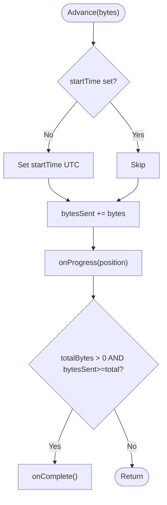

**Diagram sources**
- [playout.go:49-73](file://go/pkg/audio/playout.go#L49-L73)

**Section sources**
- [playout.go:9-226](file://go/pkg/audio/playout.go#L9-L226)
- [session_handler.go:405-432](file://go/media-edge/internal/handler/session_handler.go#L405-L432)

### Error Recovery and Stream Termination
- WebSocketHandler: Validates message types, enforces max chunk size, handles ping/pong, and closes gracefully
- SessionHandler: Stops buffers, cancels context, and notifies orchestrator on stop
- Transport: Closes connection with CloseMessage and logs unexpected closures

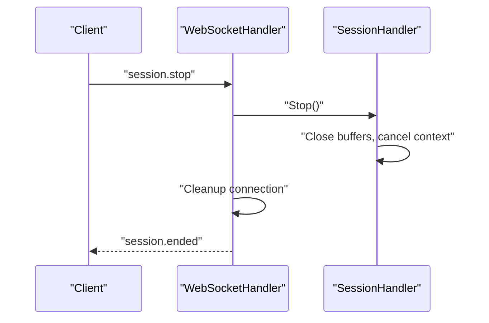

**Diagram sources**
- [websocket.go:447-481](file://go/media-edge/internal/handler/websocket.go#L447-L481)
- [session_handler.go:149-174](file://go/media-edge/internal/handler/session_handler.go#L149-L174)
- [transport.go:163-168](file://go/media-edge/internal/transport/transport.go#L163-L168)

**Section sources**
- [websocket.go:131-192](file://go/media-edge/internal/handler/websocket.go#L131-L192)
- [websocket.go:483-536](file://go/media-edge/internal/handler/websocket.go#L483-L536)

### Configuration Options
- AudioConfig: Default input/output profiles and named profiles
- SecurityConfig: Max chunk size and allowed origins
- ServerConfig: Read/write timeouts and WebSocket path

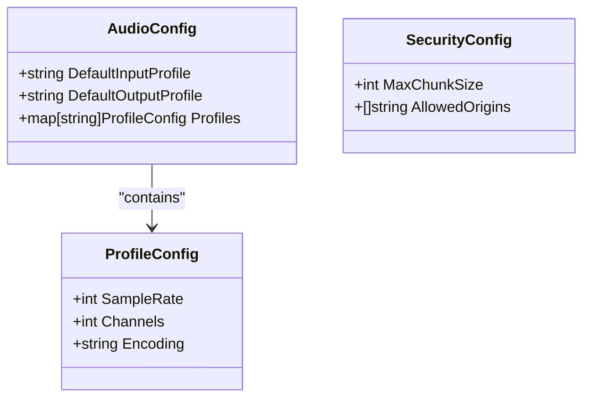

**Diagram sources**
- [config.go:63-76](file://go/pkg/config/config.go#L63-L76)
- [config.go:191-218](file://go/pkg/config/config.go#L191-L218)

**Section sources**
- [config.go:63-94](file://go/pkg/config/config.go#L63-L94)
- [config.go:191-249](file://go/pkg/config/config.go#L191-L249)

## Dependency Analysis
- WebSocketHandler depends on SessionHandler, Transport, and Events
- SessionHandler depends on Transport, Audio utils, and Orchestrator bridge
- Audio utils depend on contracts for format definitions
- Transport depends on WebSocket library and goroutines for write pump

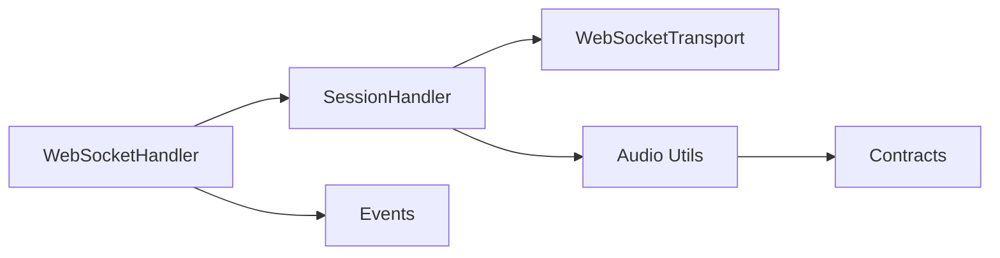

**Diagram sources**
- [websocket.go:22-36](file://go/media-edge/internal/handler/websocket.go#L22-L36)
- [session_handler.go:17-51](file://go/media-edge/internal/handler/session_handler.go#L17-L51)
- [transport.go:16-42](file://go/media-edge/internal/transport/transport.go#L16-L42)
- [format.go:5-9](file://go/pkg/audio/format.go#L5-L9)
- [event.go:11-35](file://go/pkg/events/event.go#L11-L35)

**Section sources**
- [websocket.go:22-36](file://go/media-edge/internal/handler/websocket.go#L22-L36)
- [session_handler.go:17-51](file://go/media-edge/internal/handler/session_handler.go#L17-L51)
- [transport.go:16-42](file://go/media-edge/internal/transport/transport.go#L16-L42)

## Performance Considerations
- Chunk size optimization: 10ms frames (160 samples at 16kHz) balance latency and CPU overhead
- Backpressure: JitterBuffer prevents producer from overwhelming consumer; monitor Available() and IsFull()
- Latency targets: 10ms playout tick in SessionHandler; adjust for network RTT
- Bandwidth adaptation: Use lower sample rates (e.g., 8kHz) or mono for constrained networks
- Compression: Prefer PCM16 for CPU efficiency; G.711 reduces bandwidth but adds conversion cost
- Adaptive bitrate: Downscale sample rate/resolution on transport errors or buffer underruns

[No sources needed since this section provides general guidance]

## Troubleshooting Guide
Common issues and remedies:
- Buffer full/underrun: Monitor JitterBuffer stats; increase buffer size or reduce input rate
- Invalid sample rates or odd-length PCM16: Validate resampler inputs; ensure even byte length
- Chunk boundary misalignment: Use ChunkStatic or Chunker with correct frameSize derived from AudioProfile
- WebSocket write failures: Check write channel capacity and transport write pump; enforce WriteTimeout
- Session not active: Ensure session.start was received and SessionHandler is running

**Section sources**
- [buffer.go:10-15](file://go/pkg/audio/buffer.go#L10-L15)
- [resample.go:32-38](file://go/pkg/audio/resample.go#L32-L38)
- [chunk.go:77-101](file://go/pkg/audio/chunk.go#L77-L101)
- [transport.go:106-116](file://go/media-edge/internal/transport/transport.go#L106-L116)
- [websocket.go:170-192](file://go/media-edge/internal/handler/websocket.go#L170-L192)

## Conclusion
The audio transport layer combines robust chunking, buffering, and normalization with a reliable WebSocket transport to deliver low-latency, high-quality real-time audio. By tuning chunk sizes, buffer capacities, and sample rates, and by leveraging the provided playout tracking and error-handling mechanisms, the system achieves predictable performance across diverse network conditions.