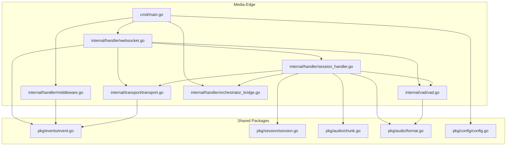
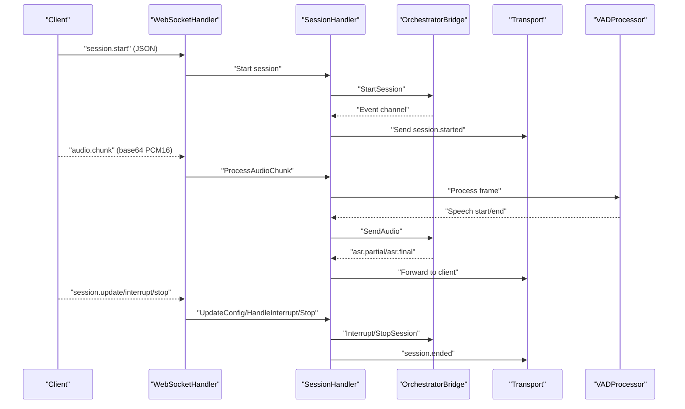
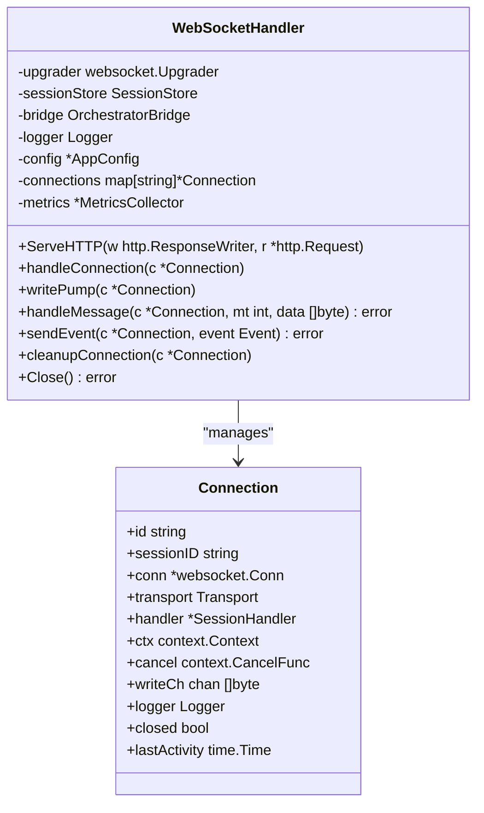
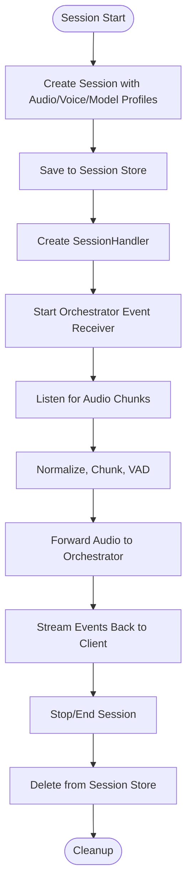
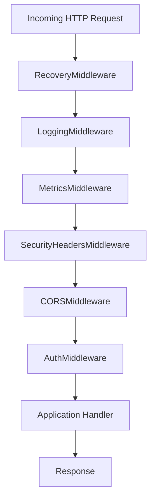
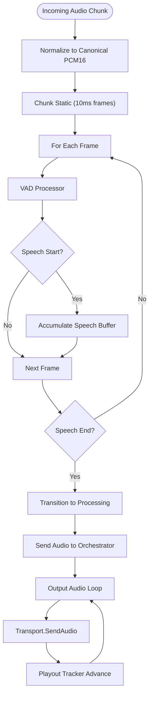
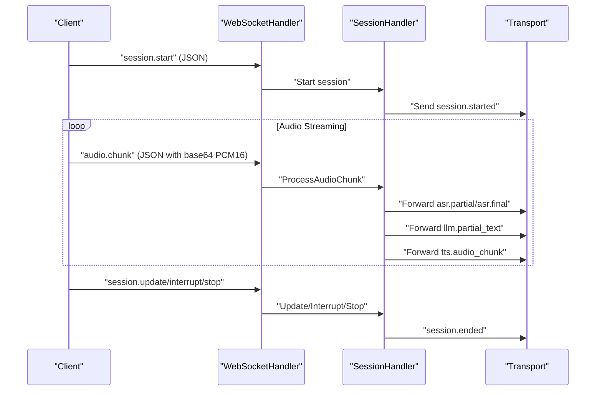
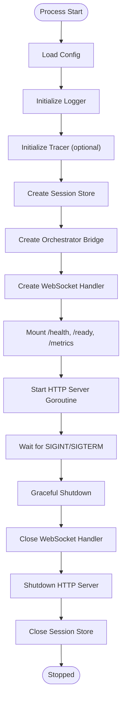
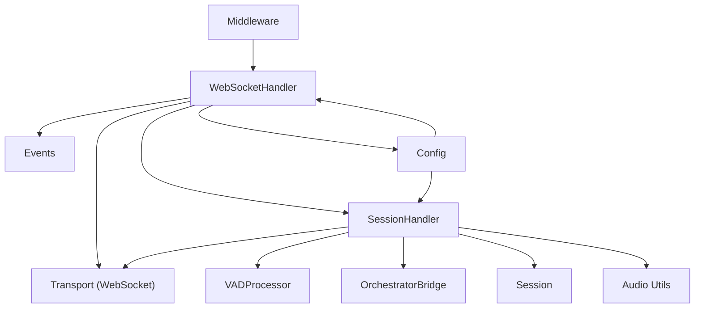

# Media-Edge Service

<cite>
**Referenced Files in This Document**
- [main.go](file://go/media-edge/cmd/main.go)
- [websocket.go](file://go/media-edge/internal/handler/websocket.go)
- [session_handler.go](file://go/media-edge/internal/handler/session_handler.go)
- [middleware.go](file://go/media-edge/internal/handler/middleware.go)
- [transport.go](file://go/media-edge/internal/transport/transport.go)
- [vad.go](file://go/media-edge/internal/vad/vad.go)
- [orchestrator_bridge.go](file://go/media-edge/internal/handler/orchestrator_bridge.go)
- [config.go](file://go/pkg/config/config.go)
- [event.go](file://go/pkg/events/event.go)
- [session.go](file://go/pkg/session/session.go)
- [chunk.go](file://go/pkg/audio/chunk.go)
- [format.go](file://go/pkg/audio/format.go)
- [websocket-api.md](file://docs/websocket-api.md)
- [config-cloud.yaml](file://examples/config-cloud.yaml)
</cite>

## Table of Contents
1. [Introduction](#introduction)
2. [Project Structure](#project-structure)
3. [Core Components](#core-components)
4. [Architecture Overview](#architecture-overview)
5. [Detailed Component Analysis](#detailed-component-analysis)
6. [Dependency Analysis](#dependency-analysis)
7. [Performance Considerations](#performance-considerations)
8. [Troubleshooting Guide](#troubleshooting-guide)
9. [Conclusion](#conclusion)
10. [Appendices](#appendices)

## Introduction
The Media-Edge service is the client-facing entry point for real-time voice interactions over WebSocket. It manages WebSocket connections, streams audio data, integrates Voice Activity Detection (VAD), and coordinates with the orchestration pipeline to deliver end-to-end conversational AI experiences. The service exposes a WebSocket API for session control and audio streaming, along with REST endpoints for health and readiness probes and optional metrics exposure.

## Project Structure
The Media-Edge module is organized around a clear separation of concerns:
- Entry point initializes configuration, logging, tracing, session store, orchestrator bridge, and HTTP server with middleware.
- Handler package implements WebSocket upgrade, connection lifecycle, session management, and event routing.
- Transport abstraction encapsulates WebSocket message sending/receiving and audio delivery.
- VAD module provides energy-based voice activity detection with configurable thresholds and state transitions.
- Orchestrator bridge defines the interface for communicating with the orchestration pipeline (channel-based bridge for MVP).
- Audio utilities provide format conversion, chunking, and playout tracking.
- Events define the message protocol exchanged over WebSocket.
- Configuration models define server, security, observability, and audio settings.



**Diagram sources**
- [main.go:30-180](file://go/media-edge/cmd/main.go#L30-L180)
- [websocket.go:22-92](file://go/media-edge/internal/handler/websocket.go#L22-L92)
- [session_handler.go:17-117](file://go/media-edge/internal/handler/session_handler.go#L17-L117)
- [middleware.go:14-25](file://go/media-edge/internal/handler/middleware.go#L14-L25)
- [transport.go:16-42](file://go/media-edge/internal/transport/transport.go#L16-L42)
- [vad.go:68-78](file://go/media-edge/internal/vad/vad.go#L68-L78)
- [orchestrator_bridge.go:13-32](file://go/media-edge/internal/handler/orchestrator_bridge.go#L13-L32)
- [event.go:11-35](file://go/pkg/events/event.go#L11-L35)
- [session.go:61-84](file://go/pkg/session/session.go#L61-L84)
- [chunk.go:7-21](file://go/pkg/audio/chunk.go#L7-L21)
- [format.go:11-17](file://go/pkg/audio/format.go#L11-L17)
- [config.go:9-18](file://go/pkg/config/config.go#L9-L18)

**Section sources**
- [main.go:30-180](file://go/media-edge/cmd/main.go#L30-L180)
- [websocket.go:22-92](file://go/media-edge/internal/handler/websocket.go#L22-L92)
- [session_handler.go:17-117](file://go/media-edge/internal/handler/session_handler.go#L17-L117)
- [middleware.go:14-25](file://go/media-edge/internal/handler/middleware.go#L14-L25)
- [transport.go:16-42](file://go/media-edge/internal/transport/transport.go#L16-L42)
- [vad.go:68-78](file://go/media-edge/internal/vad/vad.go#L68-L78)
- [orchestrator_bridge.go:13-32](file://go/media-edge/internal/handler/orchestrator_bridge.go#L13-L32)
- [event.go:11-35](file://go/pkg/events/event.go#L11-L35)
- [session.go:61-84](file://go/pkg/session/session.go#L61-L84)
- [chunk.go:7-21](file://go/pkg/audio/chunk.go#L7-L21)
- [format.go:11-17](file://go/pkg/audio/format.go#L11-L17)
- [config.go:9-18](file://go/pkg/config/config.go#L9-L18)

## Core Components
- WebSocketHandler: Manages WebSocket upgrades, connection lifecycle, message parsing, and dispatches events to session handlers. Implements connection pooling, write pumps, ping/pong keepalive, and graceful cleanup.
- SessionHandler: Orchestrates audio processing pipeline including normalization, VAD, chunking, ASR/TTS integration, playout tracking, and state transitions.
- Transport: Abstraction for WebSocket transport with event and audio message sending, write pump, and connection lifecycle.
- VADProcessor: Energy-based voice activity detection with configurable thresholds, minimum speech/silence durations, and hangover frames.
- OrchestratorBridge: Interface for communication with the orchestration pipeline; MVP uses an in-process channel bridge.
- Middleware: Composable HTTP middleware stack for logging, recovery, metrics, security headers, CORS, request ID, timeouts, and authentication.
- Configuration: Centralized configuration for server, security, observability, audio profiles, and provider defaults.
- Events: Strongly typed WebSocket message protocol for session control and streaming feedback.
- Audio Utilities: Audio profile definitions, chunking, and format conversion helpers.

**Section sources**
- [websocket.go:22-92](file://go/media-edge/internal/handler/websocket.go#L22-L92)
- [session_handler.go:17-117](file://go/media-edge/internal/handler/session_handler.go#L17-L117)
- [transport.go:16-42](file://go/media-edge/internal/transport/transport.go#L16-L42)
- [vad.go:68-78](file://go/media-edge/internal/vad/vad.go#L68-L78)
- [orchestrator_bridge.go:13-32](file://go/media-edge/internal/handler/orchestrator_bridge.go#L13-L32)
- [middleware.go:14-25](file://go/media-edge/internal/handler/middleware.go#L14-L25)
- [config.go:9-18](file://go/pkg/config/config.go#L9-L18)
- [event.go:11-35](file://go/pkg/events/event.go#L11-L35)
- [chunk.go:7-21](file://go/pkg/audio/chunk.go#L7-L21)
- [format.go:11-17](file://go/pkg/audio/format.go#L11-L17)

## Architecture Overview
The Media-Edge service is a WebSocket-first API gateway that:
- Accepts WebSocket connections and enforces CORS and origin policies.
- Parses JSON control messages and base64-encoded audio chunks.
- Normalizes incoming audio to a canonical format, performs VAD, and forwards audio to the orchestrator.
- Streams back ASR partial/final transcripts, LLM streaming tokens, and synthesized audio chunks.
- Manages session state and lifecycle, including interruptions and graceful termination.



**Diagram sources**
- [websocket.go:261-374](file://go/media-edge/internal/handler/websocket.go#L261-L374)
- [session_handler.go:176-225](file://go/media-edge/internal/handler/session_handler.go#L176-L225)
- [orchestrator_bridge.go:98-134](file://go/media-edge/internal/handler/orchestrator_bridge.go#L98-L134)
- [transport.go:82-95](file://go/media-edge/internal/transport/transport.go#L82-L95)
- [vad.go:105-197](file://go/media-edge/internal/vad/vad.go#L105-L197)

## Detailed Component Analysis

### WebSocket Handler Implementation
The WebSocket handler is responsible for:
- Upgrading HTTP requests to WebSocket with origin validation and buffer sizing.
- Managing active connections, write pumps, ping/pong keepalive, and read deadlines.
- Parsing JSON events, enforcing message size limits, and dispatching to session handlers.
- Sending structured events to clients and handling connection cleanup.



**Diagram sources**
- [websocket.go:22-54](file://go/media-edge/internal/handler/websocket.go#L22-L54)
- [websocket.go:94-129](file://go/media-edge/internal/handler/websocket.go#L94-L129)
- [websocket.go:131-192](file://go/media-edge/internal/handler/websocket.go#L131-L192)
- [websocket.go:194-218](file://go/media-edge/internal/handler/websocket.go#L194-L218)
- [websocket.go:220-258](file://go/media-edge/internal/handler/websocket.go#L220-L258)
- [websocket.go:483-498](file://go/media-edge/internal/handler/websocket.go#L483-L498)
- [websocket.go:500-536](file://go/media-edge/internal/handler/websocket.go#L500-L536)

**Section sources**
- [websocket.go:22-92](file://go/media-edge/internal/handler/websocket.go#L22-L92)
- [websocket.go:94-129](file://go/media-edge/internal/handler/websocket.go#L94-L129)
- [websocket.go:131-192](file://go/media-edge/internal/handler/websocket.go#L131-L192)
- [websocket.go:194-218](file://go/media-edge/internal/handler/websocket.go#L194-L218)
- [websocket.go:220-258](file://go/media-edge/internal/handler/websocket.go#L220-L258)
- [websocket.go:483-498](file://go/media-edge/internal/handler/websocket.go#L483-L498)
- [websocket.go:500-536](file://go/media-edge/internal/handler/websocket.go#L500-L536)

### Session Management Through Redis
The service uses a session store abstraction to persist session metadata and state. The current implementation provides a placeholder in-memory store suitable for MVP. Production deployments should integrate a Redis-backed store.



**Diagram sources**
- [websocket.go:261-374](file://go/media-edge/internal/handler/websocket.go#L261-L374)
- [session_handler.go:119-147](file://go/media-edge/internal/handler/session_handler.go#L119-L147)
- [session_handler.go:149-174](file://go/media-edge/internal/handler/session_handler.go#L149-L174)
- [session.go:61-84](file://go/pkg/session/session.go#L61-L84)

**Section sources**
- [websocket.go:261-374](file://go/media-edge/internal/handler/websocket.go#L261-L374)
- [session_handler.go:119-147](file://go/media-edge/internal/handler/session_handler.go#L119-L147)
- [session_handler.go:149-174](file://go/media-edge/internal/handler/session_handler.go#L149-L174)
- [session.go:61-84](file://go/pkg/session/session.go#L61-L84)

### Middleware Chain for Security, Logging, and Metrics
The HTTP server composes a middleware chain that applies:
- Panic recovery with structured logging.
- Request logging with timing and status.
- Metrics recording for provider requests and durations.
- Security headers (X-Content-Type-Options, X-Frame-Options, X-XSS-Protection, Referrer-Policy).
- CORS handling with origin validation and preflight support.
- Authentication with API key checks (header or query param).
- Request ID injection and propagation.
- Optional IP filtering and rate limiting placeholders.



**Diagram sources**
- [middleware.go:17-25](file://go/media-edge/internal/handler/middleware.go#L17-L25)
- [middleware.go:27-76](file://go/media-edge/internal/handler/middleware.go#L27-L76)
- [middleware.go:78-94](file://go/media-edge/internal/handler/middleware.go#L78-L94)
- [middleware.go:250-263](file://go/media-edge/internal/handler/middleware.go#L250-L263)
- [middleware.go:133-170](file://go/media-edge/internal/handler/middleware.go#L133-L170)
- [middleware.go:96-131](file://go/media-edge/internal/handler/middleware.go#L96-L131)

**Section sources**
- [middleware.go:17-25](file://go/media-edge/internal/handler/middleware.go#L17-L25)
- [middleware.go:27-76](file://go/media-edge/internal/handler/middleware.go#L27-L76)
- [middleware.go:78-94](file://go/media-edge/internal/handler/middleware.go#L78-L94)
- [middleware.go:250-263](file://go/media-edge/internal/handler/middleware.go#L250-L263)
- [middleware.go:133-170](file://go/media-edge/internal/handler/middleware.go#L133-L170)
- [middleware.go:96-131](file://go/media-edge/internal/handler/middleware.go#L96-L131)

### Audio Transport Layer, Chunk Processing, and Real-Time Format Conversion
The audio pipeline performs:
- Normalization to a canonical 16 kHz mono PCM16 format.
- Fixed-size frame chunking (10 ms at 16 kHz) for VAD and ASR.
- VAD state machine with configurable thresholds, minimum speech/silence durations, and hangover frames.
- Output audio playout tracking and jitter buffering for smooth playback.
- Event-driven forwarding of ASR partial/final results, LLM streaming tokens, and TTS audio chunks.



**Diagram sources**
- [session_handler.go:176-225](file://go/media-edge/internal/handler/session_handler.go#L176-L225)
- [vad.go:105-197](file://go/media-edge/internal/vad/vad.go#L105-L197)
- [transport.go:92-95](file://go/media-edge/internal/transport/transport.go#L92-L95)
- [chunk.go:76-101](file://go/pkg/audio/chunk.go#L76-L101)
- [format.go:65-71](file://go/pkg/audio/format.go#L65-L71)

**Section sources**
- [session_handler.go:176-225](file://go/media-edge/internal/handler/session_handler.go#L176-L225)
- [vad.go:105-197](file://go/media-edge/internal/vad/vad.go#L105-L197)
- [transport.go:92-95](file://go/media-edge/internal/transport/transport.go#L92-L95)
- [chunk.go:76-101](file://go/pkg/audio/chunk.go#L76-L101)
- [format.go:65-71](file://go/pkg/audio/format.go#L65-L71)

### Orchestrator Bridge (Channel-Based MVP)
The bridge provides an in-process channel-based interface for orchestrator communication. It manages session channels, audio streams, user utterances, event forwarding, and interruption signaling. This enables local development and testing without external dependencies.

```mermaid
classDiagram
class OrchestratorBridge {
<<interface>>
+StartSession(ctx, sessionID, config) error
+SendAudio(ctx, sessionID, audio) error
+SendUserUtterance(ctx, sessionID, transcript) error
+ReceiveEvents(ctx, sessionID) <-chan Event, error
+Interrupt(ctx, sessionID) error
+StopSession(ctx, sessionID) error
}
class ChannelBridge {
-sessions map[string]*SessionChannels
-eventCh chan BridgeEvent
-closed bool
+StartSession(...)
+SendAudio(...)
+SendUserUtterance(...)
+ReceiveEvents(...)
+Interrupt(...)
+StopSession(...)
+Close()
}
class SessionChannels {
+sessionID string
+audioCh chan []byte
+utteranceCh chan string
+eventCh chan events.Event
+interruptCh chan struct{}
+stopCh chan struct{}
+closed bool
}
OrchestratorBridge <|.. ChannelBridge
ChannelBridge --> SessionChannels : "owns"
```

**Diagram sources**
- [orchestrator_bridge.go:13-32](file://go/media-edge/internal/handler/orchestrator_bridge.go#L13-L32)
- [orchestrator_bridge.go:45-96](file://go/media-edge/internal/handler/orchestrator_bridge.go#L45-L96)
- [orchestrator_bridge.go:60-70](file://go/media-edge/internal/handler/orchestrator_bridge.go#L60-L70)

**Section sources**
- [orchestrator_bridge.go:13-32](file://go/media-edge/internal/handler/orchestrator_bridge.go#L13-L32)
- [orchestrator_bridge.go:45-96](file://go/media-edge/internal/handler/orchestrator_bridge.go#L45-L96)
- [orchestrator_bridge.go:60-70](file://go/media-edge/internal/handler/orchestrator_bridge.go#L60-L70)

### WebSocket Message Formats and Protocols
The WebSocket API defines a strict JSON message protocol with explicit event types for control and streaming feedback. Audio is transmitted as base64-encoded PCM16 frames.



**Diagram sources**
- [websocket-api.md:24-197](file://docs/websocket-api.md#L24-L197)
- [websocket-api.md:198-442](file://docs/websocket-api.md#L198-L442)
- [event.go:14-35](file://go/pkg/events/event.go#L14-L35)

**Section sources**
- [websocket-api.md:24-197](file://docs/websocket-api.md#L24-L197)
- [websocket-api.md:198-442](file://docs/websocket-api.md#L198-L442)
- [event.go:14-35](file://go/pkg/events/event.go#L14-L35)

### Configuration Options
The service supports extensive configuration for server behavior, security, observability, and audio profiles. Defaults are validated and applied when missing.

- Server: Host, Port, WebSocket path, read/write timeouts, max connections.
- Security: Max session duration, max chunk size, auth enable/disable, auth token, allowed origins.
- Observability: Log level/format, metrics port, OpenTelemetry endpoint, tracing enablement.
- Audio: Default input/output profiles, named profiles with sample rates, channels, and encodings.
- Providers: Default provider names and provider-specific configurations.

**Section sources**
- [config.go:20-28](file://go/pkg/config/config.go#L20-L28)
- [config.go:87-94](file://go/pkg/config/config.go#L87-L94)
- [config.go:77-85](file://go/pkg/config/config.go#L77-L85)
- [config.go:63-75](file://go/pkg/config/config.go#L63-L75)
- [config.go:96-120](file://go/pkg/config/config.go#L96-L120)
- [config.go:237-249](file://go/pkg/config/config.go#L237-L249)

### Service Lifecycle and Graceful Shutdown
The service initializes logging/tracing, creates the session store and orchestrator bridge, constructs the WebSocket handler, and mounts HTTP endpoints. It starts the HTTP server in a goroutine and listens for OS signals to perform a graceful shutdown, closing WebSocket connections, stopping the HTTP server, and cleaning up resources.



**Diagram sources**
- [main.go:30-180](file://go/media-edge/cmd/main.go#L30-L180)

**Section sources**
- [main.go:30-180](file://go/media-edge/cmd/main.go#L30-L180)

## Dependency Analysis
The Media-Edge service exhibits strong cohesion within its handler and transport packages, with clear interfaces for session management and orchestration. Dependencies are primarily internal, with shared packages providing contracts and utilities.



**Diagram sources**
- [websocket.go:22-92](file://go/media-edge/internal/handler/websocket.go#L22-L92)
- [session_handler.go:17-117](file://go/media-edge/internal/handler/session_handler.go#L17-L117)
- [transport.go:16-42](file://go/media-edge/internal/transport/transport.go#L16-L42)
- [vad.go:305-345](file://go/media-edge/internal/vad/vad.go#L305-L345)
- [orchestrator_bridge.go:13-32](file://go/media-edge/internal/handler/orchestrator_bridge.go#L13-L32)
- [event.go:11-35](file://go/pkg/events/event.go#L11-L35)
- [session.go:61-84](file://go/pkg/session/session.go#L61-L84)
- [config.go:9-18](file://go/pkg/config/config.go#L9-L18)

**Section sources**
- [websocket.go:22-92](file://go/media-edge/internal/handler/websocket.go#L22-L92)
- [session_handler.go:17-117](file://go/media-edge/internal/handler/session_handler.go#L17-L117)
- [transport.go:16-42](file://go/media-edge/internal/transport/transport.go#L16-L42)
- [vad.go:305-345](file://go/media-edge/internal/vad/vad.go#L305-L345)
- [orchestrator_bridge.go:13-32](file://go/media-edge/internal/handler/orchestrator_bridge.go#L13-L32)
- [event.go:11-35](file://go/pkg/events/event.go#L11-L35)
- [session.go:61-84](file://go/pkg/session/session.go#L61-L84)
- [config.go:9-18](file://go/pkg/config/config.go#L9-L18)

## Performance Considerations
- Connection and message size limits: Enforced via WebSocket upgrader buffers and security configuration.
- Audio chunk sizes: 10–100 ms frames at 16 kHz are recommended for responsive VAD and ASR.
- Jitter buffers: Input and output buffers mitigate jitter and backpressure.
- VAD thresholds and hangover: Tunable parameters balance responsiveness and stability.
- Metrics and tracing: Enable observability to monitor latency, throughput, and error rates.
- Concurrency: Goroutines for write pumps, event processing, and audio output ensure non-blocking operation.

[No sources needed since this section provides general guidance]

## Troubleshooting Guide
Common issues and strategies:
- WebSocket upgrade failures: Verify allowed origins and CORS headers; check server read/write timeouts.
- Message parsing errors: Validate JSON structure and event types; ensure audio_data is base64-encoded PCM16.
- Session not found: Confirm session IDs match between client and server; ensure session.start precedes audio.chunk.
- Authentication failures: Provide X-API-Key header or api_key query parameter when auth is enabled.
- VAD misbehavior: Adjust thresholds, minimum speech/silence durations, and frame sizes in VAD configuration.
- Audio artifacts: Normalize input to canonical PCM16; verify sample rate and channel count alignment.
- Memory pressure: Monitor jitter buffer sizes and adjust channel capacities; consider backpressure on event channels.

**Section sources**
- [websocket.go:96-101](file://go/media-edge/internal/handler/websocket.go#L96-L101)
- [websocket.go:232-236](file://go/media-edge/internal/handler/websocket.go#L232-L236)
- [websocket.go:318-320](file://go/media-edge/internal/handler/websocket.go#L318-L320)
- [middleware.go:96-131](file://go/media-edge/internal/handler/middleware.go#L96-L131)
- [vad.go:56-66](file://go/media-edge/internal/vad/vad.go#L56-L66)
- [session_handler.go:176-225](file://go/media-edge/internal/handler/session_handler.go#L176-L225)

## Conclusion
The Media-Edge service provides a robust, modular foundation for real-time voice interactions over WebSocket. Its layered design separates transport, session management, audio processing, and orchestration, enabling extensibility and maintainability. With comprehensive middleware, observability, and a well-defined message protocol, it supports scalable deployments while remaining flexible for future enhancements such as Redis-backed session stores and gRPC-based orchestrator bridges.

[No sources needed since this section summarizes without analyzing specific files]

## Appendices

### Operational Monitoring Endpoints
- Health: GET /health returns service health status.
- Readiness: GET /ready indicates service readiness for traffic.
- Metrics: GET /metrics exposes Prometheus metrics when enabled.

**Section sources**
- [main.go:99-121](file://go/media-edge/cmd/main.go#L99-L121)

### Example Configuration
Example cloud configuration demonstrates server, Redis, PostgreSQL, provider defaults, observability, and security settings.

**Section sources**
- [config-cloud.yaml:1-39](file://examples/config-cloud.yaml#L1-L39)