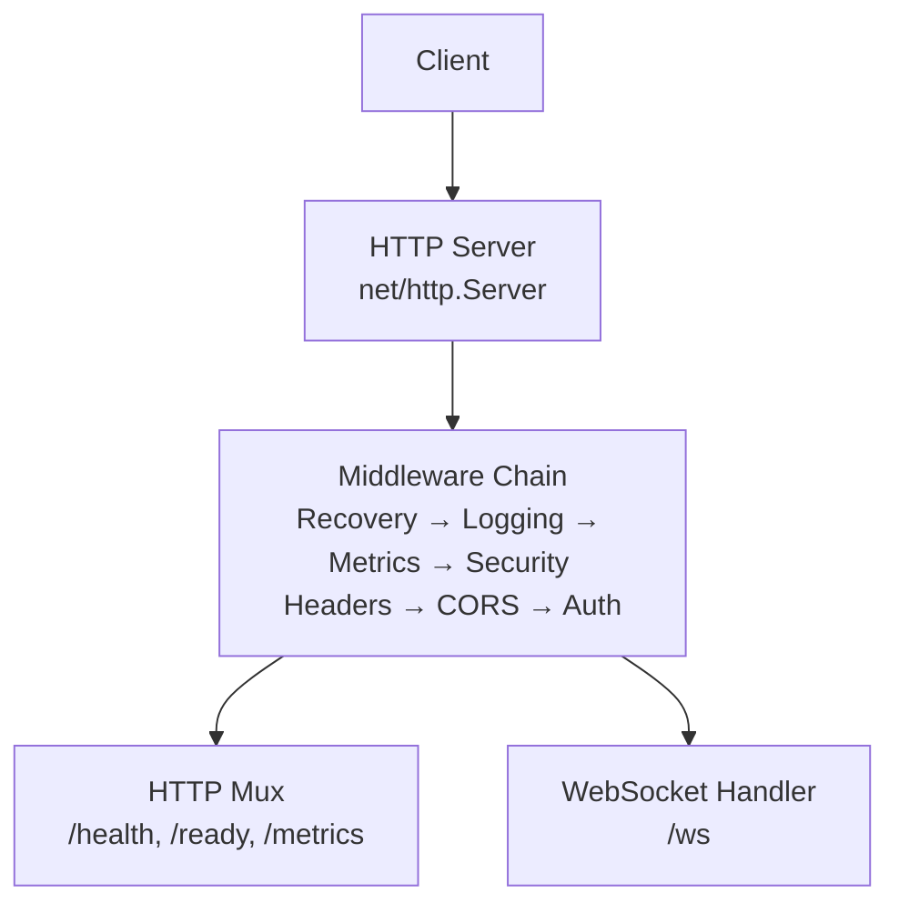
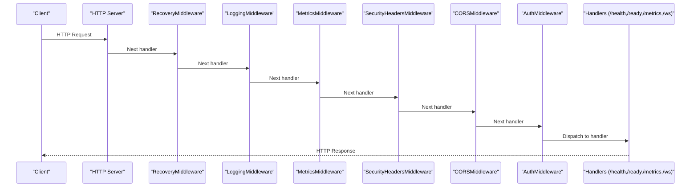
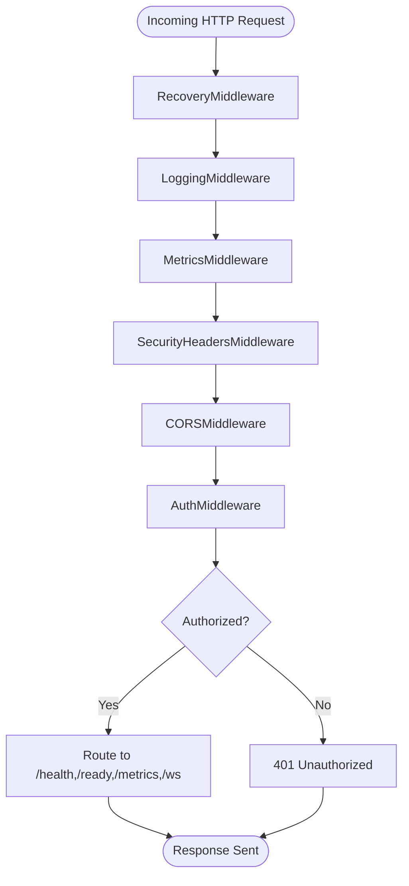
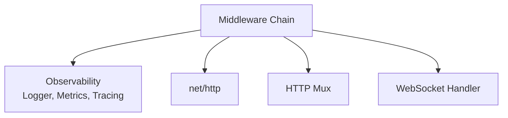

# Middleware Chain & Security

<cite>
**Referenced Files in This Document**
- [middleware.go](file://go/media-edge/internal/handler/middleware.go)
- [main.go](file://go/media-edge/cmd/main.go)
- [logger.go](file://go/pkg/observability/logger.go)
- [metrics.go](file://go/pkg/observability/metrics.go)
- [tracing.go](file://go/pkg/observability/tracing.go)
- [config.go](file://go/pkg/config/config.go)
- [defaults.go](file://go/pkg/config/defaults.go)
- [websocket.go](file://go/media-edge/internal/handler/websocket.go)
- [session_handler.go](file://go/media-edge/internal/handler/session_handler.go)
- [orchestrator_bridge.go](file://go/media-edge/internal/handler/orchestrator_bridge.go)
- [config-cloud.yaml](file://examples/config-cloud.yaml)
- [config-local.yaml](file://examples/config-local.yaml)
</cite>

## Table of Contents
1. [Introduction](#introduction)
2. [Project Structure](#project-structure)
3. [Core Components](#core-components)
4. [Architecture Overview](#architecture-overview)
5. [Detailed Component Analysis](#detailed-component-analysis)
6. [Dependency Analysis](#dependency-analysis)
7. [Performance Considerations](#performance-considerations)
8. [Troubleshooting Guide](#troubleshooting-guide)
9. [Conclusion](#conclusion)
10. [Appendices](#appendices)

## Introduction
This document explains the middleware chain implementation for request processing, security enforcement, and observability integration in the media-edge service. It covers middleware ordering, request/response transformation, error propagation, and security controls including CORS, authentication, and IP filtering. It also documents configuration options, logging levels, metrics collection scopes, and practical guidance for extending the middleware stack with custom components.

## Project Structure
The middleware chain is applied to the HTTP server in the media-edge service entry point. The chain wraps the mux and WebSocket handler, ensuring consistent cross-cutting concerns across all endpoints.

**Diagram sources**
- [main.go:128-143](file://go/media-edge/cmd/main.go#L128-L143)
- [middleware.go:17-25](file://go/media-edge/internal/handler/middleware.go#L17-L25)

**Section sources**
- [main.go:128-143](file://go/media-edge/cmd/main.go#L128-L143)
- [middleware.go:17-25](file://go/media-edge/internal/handler/middleware.go#L17-L25)

## Core Components
This section documents each middleware component, its purpose, configuration, and behavior.

- RecoveryMiddleware
  - Purpose: Catches panics and returns a standardized error response while logging stack traces.
  - Behavior: Wraps the next handler in a defer block; on panic, logs error and stack, responds with Internal Server Error.
  - Configuration: None (always active when chained).
  - Logging: Logs error, stack, path, remote address; severity depends on logger configuration.
  - Error Propagation: Converts panic into HTTP 500.

- LoggingMiddleware
  - Purpose: Logs request metadata and response status.
  - Behavior: Instruments response writer to capture status code; logs method, path, status, duration, remote address, user agent.
  - Configuration: Uses the shared logger instance.
  - Logging Levels: Info level for successful requests; adjust via logger configuration.

- MetricsMiddleware
  - Purpose: Records request metrics scoped to the media-edge HTTP transport.
  - Behavior: Measures request duration and records provider request count and duration.
  - Metrics Collected: Provider request count and duration for "media_edge" and "http".
  - Configuration: None (records globally via observability package).

- SecurityHeadersMiddleware
  - Purpose: Adds security-related response headers to reduce browser risks.
  - Headers: X-Content-Type-Options, X-Frame-Options, X-XSS-Protection, Referrer-Policy.
  - Configuration: None (hardcoded security headers).

- CORSMiddleware
  - Purpose: Handles Cross-Origin Resource Sharing for browser WebSocket clients.
  - Behavior: Validates Origin against configured allowed origins; sets allow-origin, credentials, exposed headers; handles preflight OPTIONS.
  - Configuration: Allowed origins array; supports wildcard "*" or explicit origins.
  - Notes: Also enforced at WebSocket Upgrader for /ws.

- AuthMiddleware
  - Purpose: Enforces API key authentication for non-health endpoints.
  - Mechanism: Reads X-API-Key header or api_key query parameter; compares against configured token.
  - Behavior: Skips auth if disabled or for /health and /ready endpoints; logs unauthorized attempts.
  - Configuration: auth_enabled flag and auth_token value.

- RequestIDMiddleware
  - Purpose: Generates and propagates a request ID via response header and request context.
  - Behavior: Sets X-Request-ID header; stores value in context under a dedicated key.
  - Configuration: None (auto-generated if missing).

- TimeoutMiddleware
  - Purpose: Attaches a timeout to the request context.
  - Behavior: Creates a context with timeout; passes downstream.
  - Configuration: Timeout duration.

- IPFilterMiddleware
  - Purpose: Restricts requests to allowed client IPs.
  - Behavior: Extracts client IP from X-Forwarded-For, X-Real-Ip, or RemoteAddr; blocks if not in allowed list.
  - Configuration: Array of allowed IPs.

- RateLimitMiddleware
  - Status: Placeholder for MVP; currently no-op.
  - Recommendation: Use a robust rate limiter library in production.

**Section sources**
- [middleware.go:54-76](file://go/media-edge/internal/handler/middleware.go#L54-L76)
- [middleware.go:27-52](file://go/media-edge/internal/handler/middleware.go#L27-L52)
- [middleware.go:78-94](file://go/media-edge/internal/handler/middleware.go#L78-L94)
- [middleware.go:250-263](file://go/media-edge/internal/handler/middleware.go#L250-L263)
- [middleware.go:133-170](file://go/media-edge/internal/handler/middleware.go#L133-L170)
- [middleware.go:96-131](file://go/media-edge/internal/handler/middleware.go#L96-L131)
- [middleware.go:172-189](file://go/media-edge/internal/handler/middleware.go#L172-L189)
- [middleware.go:191-201](file://go/media-edge/internal/handler/middleware.go#L191-L201)
- [middleware.go:265-297](file://go/media-edge/internal/handler/middleware.go#L265-L297)
- [middleware.go:320-328](file://go/media-edge/internal/handler/middleware.go#L320-L328)

## Architecture Overview
The middleware chain is constructed around the HTTP mux and WebSocket handler. The chain ensures that all HTTP traffic benefits from consistent logging, metrics, security headers, CORS handling, and authentication. The WebSocket handler duplicates CORS and origin checks at the upgrade layer to protect WebSocket endpoints.

**Diagram sources**
- [main.go:128-143](file://go/media-edge/cmd/main.go#L128-L143)
- [middleware.go:17-25](file://go/media-edge/internal/handler/middleware.go#L17-L25)

**Section sources**
- [main.go:128-143](file://go/media-edge/cmd/main.go#L128-L143)
- [websocket.go:64-91](file://go/media-edge/internal/handler/websocket.go#L64-L91)

## Detailed Component Analysis

### Middleware Execution Order and Transformation
- Order: Recovery → Logging → Metrics → Security Headers → CORS → Auth.
- Transformation:
  - ResponseWriter wrapper captures status code for logging and metrics.
  - RequestID is injected into response headers and request context.
  - CORS headers are set conditionally based on Origin and method.
  - Authentication validates API key and short-circuits unauthorized requests.

**Diagram sources**
- [main.go:128-143](file://go/media-edge/cmd/main.go#L128-L143)
- [middleware.go:54-76](file://go/media-edge/internal/handler/middleware.go#L54-L76)
- [middleware.go:27-52](file://go/media-edge/internal/handler/middleware.go#L27-L52)
- [middleware.go:78-94](file://go/media-edge/internal/handler/middleware.go#L78-L94)
- [middleware.go:250-263](file://go/media-edge/internal/handler/middleware.go#L250-L263)
- [middleware.go:133-170](file://go/media-edge/internal/handler/middleware.go#L133-L170)
- [middleware.go:96-131](file://go/media-edge/internal/handler/middleware.go#L96-L131)

**Section sources**
- [main.go:128-143](file://go/media-edge/cmd/main.go#L128-L143)
- [middleware.go:17-25](file://go/media-edge/internal/handler/middleware.go#L17-L25)

### Security Middleware Implementation
- CORS Policy Enforcement
  - Origin validation against allowedOrigins; supports wildcard.
  - Sets Access-Control-Allow-Origin/Credentials/Methods/Headers/Expose-Headers.
  - Handles preflight OPTIONS with 200 OK.
  - WebSocket Upgrader mirrors origin checks for /ws.

- Authentication Token Validation
  - Optional; controlled by auth_enabled.
  - Skips for /health and /ready.
  - Accepts X-API-Key header or api_key query parameter.
  - Logs unauthorized attempts and responds with 401.

- IP Filtering
  - Extracts client IP from X-Forwarded-For, X-Real-Ip, or RemoteAddr.
  - Blocks requests if not in allowed list; responds with 403.

- Rate Limiting
  - Placeholder; no-op in MVP. Recommended implementation uses a token bucket or leaky bucket algorithm.

**Section sources**
- [middleware.go:133-170](file://go/media-edge/internal/handler/middleware.go#L133-L170)
- [middleware.go:96-131](file://go/media-edge/internal/handler/middleware.go#L96-L131)
- [middleware.go:265-297](file://go/media-edge/internal/handler/middleware.go#L265-L297)
- [middleware.go:320-328](file://go/media-edge/internal/handler/middleware.go#L320-L328)
- [websocket.go:64-91](file://go/media-edge/internal/handler/websocket.go#L64-L91)

### Observability Integration
- Logging
  - Structured logging via Logger with fields for request context.
  - Levels: debug/info/warn/error; configurable via config.
  - Context enrichment: request ID, session ID, trace ID.

- Metrics
  - HTTP request count and duration recorded per provider/type.
  - Media-edge HTTP metrics tracked centrally.

- Tracing
  - Optional OpenTelemetry tracer initialization.
  - Spans and attributes supported; not used in middleware chain but available for downstream components.

**Section sources**
- [logger.go:18-83](file://go/pkg/observability/logger.go#L18-L83)
- [metrics.go:10-82](file://go/pkg/observability/metrics.go#L10-L82)
- [tracing.go:19-63](file://go/pkg/observability/tracing.go#L19-L63)
- [main.go:40-71](file://go/media-edge/cmd/main.go#L40-L71)

### Configuration Options
- Server
  - Host, Port, WSPath, ReadTimeout, WriteTimeout, MaxConnections.

- Security
  - AuthEnabled, AuthToken, AllowedOrigins, MaxSessionDuration, MaxChunkSize.

- Observability
  - LogLevel, LogFormat, MetricsPort, OTelEndpoint, EnableTracing, EnableMetrics.

- Examples
  - Cloud and local configs demonstrate enabling/disabling auth and setting provider defaults.

**Section sources**
- [config.go:20-94](file://go/pkg/config/config.go#L20-L94)
- [defaults.go:7-82](file://go/pkg/config/defaults.go#L7-L82)
- [config-cloud.yaml:1-39](file://examples/config-cloud.yaml#L1-L39)
- [config-local.yaml:1-38](file://examples/config-local.yaml#L1-L38)

### Custom Middleware Development
- Pattern: Define a function that takes an http.Handler and returns an http.Handler.
- Chain construction: Use the provided Chain function to compose middlewares.
- Best practices:
  - Always wrap next.ServeHTTP last.
  - Capture status codes via a ResponseWriter wrapper when needed.
  - Use observability.Logger for consistent logging.
  - Respect configuration flags (e.g., auth_enabled).

**Section sources**
- [middleware.go:14](file://go/media-edge/internal/handler/middleware.go#L14)
- [middleware.go:17-25](file://go/media-edge/internal/handler/middleware.go#L17-L25)

### Debugging Techniques
- Increase log level for development to debug middleware behavior.
- Inspect request IDs in logs to trace a request across the chain.
- Verify CORS headers in browser dev tools for WebSocket upgrades.
- Monitor /metrics endpoint for request rates and durations.
- Use tracing exporter endpoint if enabled.

**Section sources**
- [logger.go:61-83](file://go/pkg/observability/logger.go#L61-L83)
- [main.go:124-126](file://go/media-edge/cmd/main.go#L124-L126)
- [tracing.go:347-358](file://go/pkg/observability/tracing.go#L347-L358)

## Dependency Analysis
The middleware chain depends on the observability package for logging and metrics, and integrates with the HTTP mux and WebSocket handler.

**Diagram sources**
- [middleware.go:11](file://go/media-edge/internal/handler/middleware.go#L11)
- [logger.go:13-16](file://go/pkg/observability/logger.go#L13-L16)
- [metrics.go:10-82](file://go/pkg/observability/metrics.go#L10-L82)
- [main.go:128-143](file://go/media-edge/cmd/main.go#L128-L143)

**Section sources**
- [middleware.go:11](file://go/media-edge/internal/handler/middleware.go#L11)
- [logger.go:13-16](file://go/pkg/observability/logger.go#L13-L16)
- [metrics.go:10-82](file://go/pkg/observability/metrics.go#L10-L82)
- [main.go:128-143](file://go/media-edge/cmd/main.go#L128-L143)

## Performance Considerations
- Middleware overhead: Each middleware adds CPU time; keep logic minimal and avoid allocations in hot paths.
- ResponseWriter wrapper: Used to capture status code; ensure it is only used where needed.
- Logging: Structured logging is efficient; avoid excessive field cardinality.
- Metrics: Histograms and counters are fast; prefer appropriate bucket sizes.
- CORS preflight: OPTIONS requests short-circuit the chain; ensure allowedOrigins is configured to minimize mismatches.
- Auth: Header parsing is O(1); keep token length reasonable.
- IP filter: Linear scan over allowed IPs; keep allowed list small or use CIDR-based matching in production.

[No sources needed since this section provides general guidance]

## Troubleshooting Guide
- 500 Internal Server Errors
  - Cause: Panic in request handling.
  - Action: Check logs for error and stack; RecoveryMiddleware will log stack and return 500.

- 401 Unauthorized
  - Cause: Missing or invalid API key; auth enabled; not /health or /ready.
  - Action: Verify X-API-Key header or api_key query parameter matches configured token.

- 403 Forbidden (IP Filter)
  - Cause: Client IP not in allowed list.
  - Action: Add IP to allowed list or adjust network configuration.

- CORS Issues
  - Cause: Origin not allowed or missing; preflight not handled.
  - Action: Configure AllowedOrigins; ensure preflight OPTIONS returns 200.

- Slow Requests
  - Action: Review metrics for request duration; check downstream orchestration latency.

**Section sources**
- [middleware.go:54-76](file://go/media-edge/internal/handler/middleware.go#L54-L76)
- [middleware.go:96-131](file://go/media-edge/internal/handler/middleware.go#L96-L131)
- [middleware.go:265-297](file://go/media-edge/internal/handler/middleware.go#L265-L297)
- [middleware.go:133-170](file://go/media-edge/internal/handler/middleware.go#L133-L170)

## Conclusion
The middleware chain provides a robust foundation for request processing, security, and observability in the media-edge service. By enforcing CORS, authentication, and IP filtering early, and capturing logs and metrics consistently, the system achieves predictable behavior and strong operational visibility. Extending the chain with custom middleware follows a clear pattern, and production hardening should focus on rate limiting, secure defaults, and performance tuning.

[No sources needed since this section summarizes without analyzing specific files]

## Appendices

### Middleware Chain Construction
- Recovery → Logging → Metrics → Security Headers → CORS → Auth
- Applied to both HTTP mux endpoints and WebSocket handler.

**Section sources**
- [main.go:128-143](file://go/media-edge/cmd/main.go#L128-L143)

### Example Configurations
- Cloud config enables auth and demonstrates provider configuration.
- Local config disables auth for development.

**Section sources**
- [config-cloud.yaml:1-39](file://examples/config-cloud.yaml#L1-L39)
- [config-local.yaml:1-38](file://examples/config-local.yaml#L1-L38)