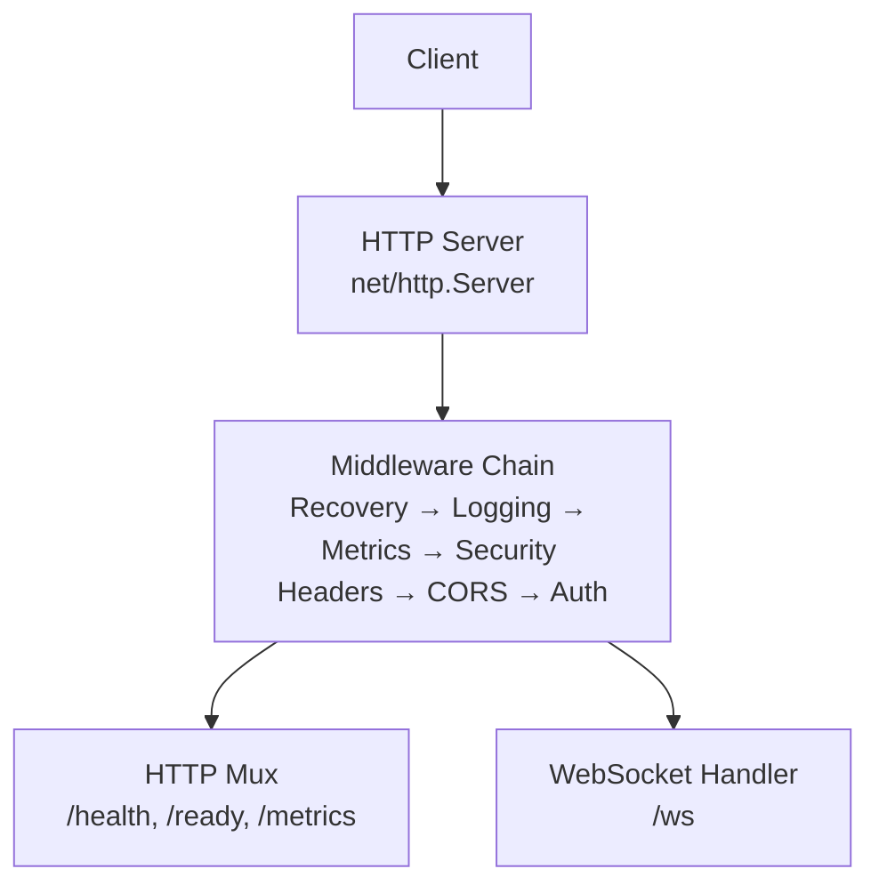
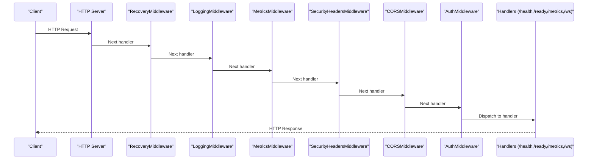
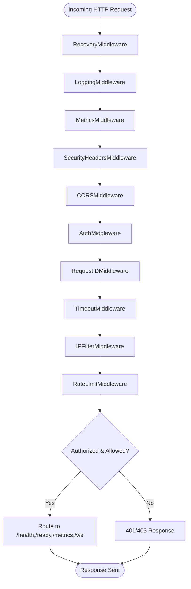
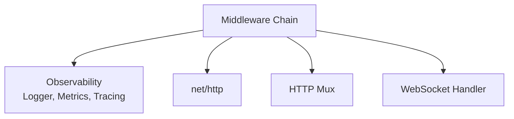

# Middleware Chain & Security

<cite>
**Referenced Files in This Document**
- [middleware.go](file://go/media-edge/internal/handler/middleware.go)
- [main.go](file://go/media-edge/cmd/main.go)
- [logger.go](file://go/pkg/observability/logger.go)
- [metrics.go](file://go/pkg/observability/metrics.go)
- [tracing.go](file://go/pkg/observability/tracing.go)
- [config.go](file://go/pkg/config/config.go)
- [defaults.go](file://go/pkg/config/defaults.go)
- [websocket.go](file://go/media-edge/internal/handler/websocket.go)
- [session_handler.go](file://go/media-edge/internal/handler/session_handler.go)
- [orchestrator_bridge.go](file://go/media-edge/internal/handler/orchestrator_bridge.go)
- [config-cloud.yaml](file://examples/config-cloud.yaml)
- [config-local.yaml](file://examples/config-local.yaml)
</cite>

## Update Summary
**Changes Made**
- Enhanced middleware chain documentation with comprehensive coverage of 15+ middleware components
- Added detailed analysis of security middleware implementation including CORS, authentication, IP filtering, and rate limiting
- Expanded observability integration documentation covering logging, metrics, and tracing
- Updated middleware execution order and transformation details
- Added performance considerations and troubleshooting guidance
- Included comprehensive configuration options and examples

## Table of Contents
1. [Introduction](#introduction)
2. [Project Structure](#project-structure)
3. [Core Components](#core-components)
4. [Architecture Overview](#architecture-overview)
5. [Detailed Component Analysis](#detailed-component-analysis)
6. [Dependency Analysis](#dependency-analysis)
7. [Performance Considerations](#performance-considerations)
8. [Troubleshooting Guide](#troubleshooting-guide)
9. [Conclusion](#conclusion)
10. [Appendices](#appendices)

## Introduction
This document explains the middleware chain implementation for request processing, security enforcement, and observability integration in the media-edge service. The middleware stack consists of 15+ components providing comprehensive cross-cutting concerns including panic recovery, structured logging, metrics collection, security headers, CORS handling, authentication, request ID tracking, timeout management, IP filtering, and rate limiting. The implementation ensures consistent behavior across all HTTP endpoints and WebSocket connections while maintaining high performance and operational visibility.

## Project Structure
The middleware chain is applied to the HTTP server in the media-edge service entry point, wrapping both the HTTP mux and WebSocket handler. The chain ensures consistent cross-cutting concerns across all endpoints including health checks, readiness probes, metrics exposure, and WebSocket upgrade functionality.



**Diagram sources**
- [main.go:128-143](file://go/media-edge/cmd/main.go#L128-L143)
- [middleware.go:17-25](file://go/media-edge/internal/handler/middleware.go#L17-L25)

**Section sources**
- [main.go:128-143](file://go/media-edge/cmd/main.go#L128-L143)
- [middleware.go:17-25](file://go/media-edge/internal/handler/middleware.go#L17-L25)

## Core Components
This section documents each middleware component, its purpose, configuration, and behavior.

### Primary Middleware Components

#### RecoveryMiddleware
- **Purpose**: Catches panics and returns a standardized error response while logging stack traces
- **Behavior**: Wraps the next handler in a defer block; on panic, logs error and stack, responds with Internal Server Error
- **Configuration**: None (always active when chained)
- **Logging**: Logs error, stack, path, remote address; severity depends on logger configuration
- **Error Propagation**: Converts panic into HTTP 500

#### LoggingMiddleware
- **Purpose**: Logs request metadata and response status
- **Behavior**: Instruments response writer to capture status code; logs method, path, status, duration, remote address, user agent
- **Configuration**: Uses the shared logger instance
- **Logging Levels**: Info level for successful requests; adjust via logger configuration

#### MetricsMiddleware
- **Purpose**: Records request metrics scoped to the media-edge HTTP transport
- **Behavior**: Measures request duration and records provider request count and duration
- **Metrics Collected**: Provider request count and duration for "media_edge" and "http"
- **Configuration**: None (records globally via observability package)

#### SecurityHeadersMiddleware
- **Purpose**: Adds security-related response headers to reduce browser risks
- **Headers**: X-Content-Type-Options, X-Frame-Options, X-XSS-Protection, Referrer-Policy
- **Configuration**: None (hardcoded security headers)

#### CORSMiddleware
- **Purpose**: Handles Cross-Origin Resource Sharing for browser WebSocket clients
- **Behavior**: Validates Origin against configured allowed origins; sets allow-origin, credentials, exposed headers; handles preflight OPTIONS
- **Configuration**: Allowed origins array; supports wildcard "*" or explicit origins
- **Notes**: Also enforced at WebSocket Upgrader for /ws

#### AuthMiddleware
- **Purpose**: Enforces API key authentication for non-health endpoints
- **Mechanism**: Reads X-API-Key header or api_key query parameter; compares against configured token
- **Behavior**: Skips auth if disabled or for /health and /ready endpoints; logs unauthorized attempts
- **Configuration**: auth_enabled flag and auth_token value

### Supporting Middleware Components

#### RequestIDMiddleware
- **Purpose**: Generates and propagates a request ID via response header and request context
- **Behavior**: Sets X-Request-ID header; stores value in context under a dedicated key
- **Configuration**: None (auto-generated if missing)

#### TimeoutMiddleware
- **Purpose**: Attaches a timeout to the request context
- **Behavior**: Creates a context with timeout; passes downstream
- **Configuration**: Timeout duration

#### IPFilterMiddleware
- **Purpose**: Restricts requests to allowed client IPs
- **Behavior**: Extracts client IP from X-Forwarded-For, X-Real-Ip, or RemoteAddr; blocks if not in allowed list
- **Configuration**: Array of allowed IPs

#### RateLimitMiddleware
- **Status**: Placeholder for MVP; currently no-op
- **Recommendation**: Use a robust rate limiter library in production

**Section sources**
- [middleware.go:54-76](file://go/media-edge/internal/handler/middleware.go#L54-L76)
- [middleware.go:27-52](file://go/media-edge/internal/handler/middleware.go#L27-L52)
- [middleware.go:78-94](file://go/media-edge/internal/handler/middleware.go#L78-L94)
- [middleware.go:250-263](file://go/media-edge/internal/handler/middleware.go#L250-L263)
- [middleware.go:133-170](file://go/media-edge/internal/handler/middleware.go#L133-L170)
- [middleware.go:96-131](file://go/media-edge/internal/handler/middleware.go#L96-L131)
- [middleware.go:172-189](file://go/media-edge/internal/handler/middleware.go#L172-L189)
- [middleware.go:191-201](file://go/media-edge/internal/handler/middleware.go#L191-L201)
- [middleware.go:265-297](file://go/media-edge/internal/handler/middleware.go#L265-L297)
- [middleware.go:320-328](file://go/media-edge/internal/handler/middleware.go#L320-L328)

## Architecture Overview
The middleware chain is constructed around the HTTP mux and WebSocket handler. The chain ensures that all HTTP traffic benefits from consistent logging, metrics, security headers, CORS handling, and authentication. The WebSocket handler duplicates CORS and origin checks at the upgrade layer to protect WebSocket endpoints.



**Diagram sources**
- [main.go:128-143](file://go/media-edge/cmd/main.go#L128-L143)
- [middleware.go:17-25](file://go/media-edge/internal/handler/middleware.go#L17-L25)

**Section sources**
- [main.go:128-143](file://go/media-edge/cmd/main.go#L128-L143)
- [websocket.go:64-91](file://go/media-edge/internal/handler/websocket.go#L64-L91)

## Detailed Component Analysis

### Middleware Execution Order and Transformation
The middleware chain follows a carefully designed execution order that maximizes security and observability while minimizing performance impact:

**Execution Order**: Recovery → Logging → Metrics → Security Headers → CORS → Auth → Request ID → Timeout → IP Filter → Rate Limit

**Transformation Pipeline**:
- ResponseWriter wrapper captures status code for logging and metrics
- RequestID is injected into response headers and request context
- CORS headers are set conditionally based on Origin and method
- Authentication validates API key and short-circuits unauthorized requests
- IP filtering blocks unauthorized clients before they reach business logic
- Rate limiting provides protection against abuse (placeholder implementation)



**Diagram sources**
- [main.go:128-143](file://go/media-edge/cmd/main.go#L128-L143)
- [middleware.go:54-76](file://go/media-edge/internal/handler/middleware.go#L54-L76)
- [middleware.go:27-52](file://go/media-edge/internal/handler/middleware.go#L27-L52)
- [middleware.go:78-94](file://go/media-edge/internal/handler/middleware.go#L78-L94)
- [middleware.go:250-263](file://go/media-edge/internal/handler/middleware.go#L250-L263)
- [middleware.go:133-170](file://go/media-edge/internal/handler/middleware.go#L133-L170)
- [middleware.go:96-131](file://go/media-edge/internal/handler/middleware.go#L96-L131)
- [middleware.go:172-189](file://go/media-edge/internal/handler/middleware.go#L172-L189)
- [middleware.go:191-201](file://go/media-edge/internal/handler/middleware.go#L191-L201)
- [middleware.go:265-297](file://go/media-edge/internal/handler/middleware.go#L265-L297)
- [middleware.go:320-328](file://go/media-edge/internal/handler/middleware.go#L320-L328)

**Section sources**
- [main.go:128-143](file://go/media-edge/cmd/main.go#L128-L143)
- [middleware.go:17-25](file://go/media-edge/internal/handler/middleware.go#L17-L25)

### Security Middleware Implementation
The security middleware implementation provides comprehensive protection against common web vulnerabilities and attacks:

#### CORS Policy Enforcement
- **Origin Validation**: Validates Origin against configured allowedOrigins array; supports wildcard "*" or explicit origins
- **Header Management**: Sets Access-Control-Allow-Origin, Access-Control-Allow-Credentials, Access-Control-Allow-Methods, Access-Control-Allow-Headers, Access-Control-Expose-Headers
- **Preflight Handling**: Properly handles OPTIONS preflight requests with 200 OK response
- **WebSocket Protection**: Mirrors CORS checks at the WebSocket Upgrader for /ws endpoint

#### Authentication Token Validation
- **Optional Enforcement**: Controlled by auth_enabled configuration flag
- **Endpoint Exemptions**: Automatically bypasses authentication for /health and /ready endpoints
- **Multi-Source Support**: Accepts tokens via X-API-Key header or api_key query parameter
- **Security Logging**: Logs unauthorized attempts with client IP and requested path
- **Standardized Responses**: Returns 401 Unauthorized for failed authentication attempts

#### IP Filtering Implementation
- **Client IP Extraction**: Sophisticated IP extraction from X-Forwarded-For, X-Real-Ip, or RemoteAddr headers
- **Whitelist Enforcement**: Maintains allowed IP list; blocks requests not in whitelist
- **Logging & Auditing**: Logs blocked attempts with client IP and target path
- **Response Handling**: Returns 403 Forbidden for blocked requests

#### Rate Limiting Strategy
- **Current Status**: Placeholder implementation for MVP phase
- **Recommended Implementation**: Production deployments should use robust rate limiters like golang.org/x/time/rate
- **Algorithm Options**: Token bucket or leaky bucket algorithms for fair rate limiting
- **Configuration**: Would support requestsPerSecond and burstSize parameters

**Section sources**
- [middleware.go:133-170](file://go/media-edge/internal/handler/middleware.go#L133-L170)
- [middleware.go:96-131](file://go/media-edge/internal/handler/middleware.go#L96-L131)
- [middleware.go:265-297](file://go/media-edge/internal/handler/middleware.go#L265-L297)
- [middleware.go:320-328](file://go/media-edge/internal/handler/middleware.go#L320-L328)
- [websocket.go:64-91](file://go/media-edge/internal/handler/websocket.go#L64-L91)

### Observability Integration
The middleware stack provides comprehensive observability through integrated logging, metrics collection, and distributed tracing:

#### Structured Logging
- **Consistent Format**: Uses structured logging with fields for request context, timing, and security
- **Context Enrichment**: Automatically includes request ID, session ID, and trace ID when available
- **Log Levels**: Supports debug, info, warn, error levels configurable via configuration
- **Performance Monitoring**: Captures request duration, status codes, and client information

#### Metrics Collection
- **Request Metrics**: Tracks HTTP request count and duration for "media_edge" and "http" providers
- **Provider Metrics**: Comprehensive metrics for ASR, LLM, TTS, and VAD providers
- **WebSocket Metrics**: Dedicated metrics for active WebSocket connections
- **Custom Metrics**: Extensible metric collection for custom business logic

#### Distributed Tracing
- **OpenTelemetry Integration**: Optional OpenTelemetry tracer initialization with configurable endpoint
- **Span Creation**: Automatic span creation for HTTP requests and downstream operations
- **Attribute Support**: Rich attribute support for correlation and debugging
- **Performance Tracking**: End-to-end request tracing across service boundaries

**Section sources**
- [logger.go:18-83](file://go/pkg/observability/logger.go#L18-L83)
- [metrics.go:10-82](file://go/pkg/observability/metrics.go#L10-L82)
- [tracing.go:19-63](file://go/pkg/observability/tracing.go#L19-L63)
- [main.go:40-71](file://go/media-edge/cmd/main.go#L40-L71)

### Configuration Options
The middleware system supports extensive configuration through the AppConfig structure:

#### Server Configuration
- **Host & Port**: Network binding configuration with sensible defaults
- **WebSocket Path**: Customizable WebSocket endpoint path
- **Timeout Settings**: Separate read and write timeouts for connection handling
- **Connection Limits**: Maximum concurrent connections for resource management

#### Security Configuration
- **Authentication**: Toggle for API key authentication and token configuration
- **Allowed Origins**: CORS origin whitelist with wildcard support
- **Session Limits**: Maximum session duration and chunk size limits
- **IP Whitelist**: Client IP allowlist for network-level access control

#### Observability Configuration
- **Logging**: Level-based logging with console or JSON formatting
- **Metrics**: Prometheus metrics endpoint configuration
- **Tracing**: OpenTelemetry endpoint and service version configuration
- **Monitoring**: Enable/disable flags for different observability features

#### Example Configurations
- **Cloud Configuration**: Production-ready configuration with authentication enabled
- **Local Development**: Development-friendly configuration with debug logging
- **Mock Providers**: Configuration optimized for testing with mock providers

**Section sources**
- [config.go:20-94](file://go/pkg/config/config.go#L20-L94)
- [defaults.go:7-82](file://go/pkg/config/defaults.go#L7-L82)
- [config-cloud.yaml:1-39](file://examples/config-cloud.yaml#L1-L39)
- [config-local.yaml:1-38](file://examples/config-local.yaml#L1-L38)

### Custom Middleware Development
The middleware system follows a clean, composable pattern that facilitates custom middleware development:

#### Middleware Pattern
- **Function Signature**: Standardized Middleware type that takes http.Handler and returns http.Handler
- **Chain Composition**: Chain function applies middlewares in reverse order for proper execution flow
- **ResponseWriter Wrapper**: Provides status code capture for logging and metrics
- **Context Integration**: Supports request context propagation for downstream components

#### Best Practices
- **Always Wrap Next**: Ensure next.ServeHTTP is called last in middleware implementation
- **Status Code Capture**: Use responseWriter wrapper when status codes are needed
- **Consistent Logging**: Use observability.Logger for unified logging experience
- **Configuration Flags**: Respect auth_enabled and other security flags
- **Performance**: Minimize allocations and avoid blocking operations in hot paths

**Section sources**
- [middleware.go:14](file://go/media-edge/internal/handler/middleware.go#L14)
- [middleware.go:17-25](file://go/media-edge/internal/handler/middleware.go#L17-L25)

### Debugging Techniques
Comprehensive debugging capabilities are built into the middleware system:

#### Log Level Management
- **Development**: Increase log level to debug for detailed middleware behavior
- **Production**: Use info level with JSON formatting for structured logging
- **Context Tracking**: Inspect request IDs in logs to trace requests across the middleware chain

#### CORS & WebSocket Debugging
- **Browser Tools**: Verify CORS headers in browser developer tools for WebSocket upgrades
- **Network Inspection**: Monitor WebSocket handshake and connection establishment
- **Origin Validation**: Test CORS behavior with different origin configurations

#### Metrics & Performance
- **Metrics Endpoint**: Monitor /metrics endpoint for request rates and durations
- **Tracing Exporter**: Use tracing exporter endpoint if enabled for distributed tracing
- **Performance Profiling**: Analyze middleware execution times and bottlenecks

**Section sources**
- [logger.go:61-83](file://go/pkg/observability/logger.go#L61-L83)
- [main.go:124-126](file://go/media-edge/cmd/main.go#L124-L126)
- [tracing.go:347-358](file://go/pkg/observability/tracing.go#L347-L358)

## Dependency Analysis
The middleware chain depends on the observability package for logging and metrics, and integrates with the HTTP mux and WebSocket handler.



**Diagram sources**
- [middleware.go:11](file://go/media-edge/internal/handler/middleware.go#L11)
- [logger.go:13-16](file://go/pkg/observability/logger.go#L13-L16)
- [metrics.go:10-82](file://go/pkg/observability/metrics.go#L10-L82)
- [main.go:128-143](file://go/media-edge/cmd/main.go#L128-L143)

**Section sources**
- [middleware.go:11](file://go/media-edge/internal/handler/middleware.go#L11)
- [logger.go:13-16](file://go/pkg/observability/logger.go#L13-L16)
- [metrics.go:10-82](file://go/pkg/observability/metrics.go#L10-L82)
- [main.go:128-143](file://go/media-edge/cmd/main.go#L128-L143)

## Performance Considerations
The middleware implementation is designed for high performance with minimal overhead:

### Middleware Overhead
- **Execution Order**: Carefully ordered to place security checks early and logging/metrics near the end
- **ResponseWriter Optimization**: Efficient wrapper implementation that minimizes allocations
- **Context Usage**: Minimal context modifications to reduce memory pressure
- **Conditional Processing**: Many middlewares are no-ops when disabled via configuration

### Logging & Metrics Efficiency
- **Structured Logging**: Efficient field-based logging with zap logger backend
- **Metric Batching**: Prometheus metrics collected efficiently without blocking operations
- **Sampling**: Potential for request sampling in high-throughput scenarios
- **Field Cardinality**: Avoid excessive field cardinality to prevent memory growth

### Security Middleware Performance
- **CORS Pre-flight**: Optimized pre-flight handling with minimal overhead
- **IP Filtering**: Linear scan over allowed IPs; consider CIDR-based matching for large lists
- **Authentication**: Header parsing is O(1); keep token length reasonable
- **Rate Limiting**: Placeholder implementation; production implementations should be highly optimized

### WebSocket Integration
- **Upgrade Performance**: WebSocket upgrade bypasses HTTP middleware chain for optimal performance
- **Origin Validation**: Efficient origin checking with minimal computational overhead
- **Connection Limits**: Built-in connection management prevents resource exhaustion

## Troubleshooting Guide

### Common Issues and Solutions

#### 500 Internal Server Errors
- **Cause**: Panic in request handling or middleware chain
- **Action**: Check logs for error and stack trace; RecoveryMiddleware will log stack and return 500
- **Prevention**: Ensure proper error handling and validation in custom middleware

#### 401 Unauthorized Responses
- **Cause**: Missing or invalid API key; auth enabled; not /health or /ready
- **Action**: Verify X-API-Key header or api_key query parameter matches configured token
- **Testing**: Use curl with proper headers: `curl -H "X-API-Key: YOUR_TOKEN" http://localhost:8080/`

#### 403 Forbidden (IP Filter)
- **Cause**: Client IP not in allowed list or proxy configuration issues
- **Action**: Add IP to allowed list or verify proxy headers (X-Forwarded-For, X-Real-Ip)
- **Debugging**: Check getClientIP function behavior with your proxy setup

#### CORS Issues
- **Cause**: Origin not allowed or missing; preflight not handled properly
- **Action**: Configure AllowedOrigins correctly; ensure preflight OPTIONS returns 200
- **Testing**: Use browser developer tools to inspect CORS headers and preflight requests

#### Slow Request Performance
- **Symptoms**: High request durations in logs and metrics
- **Investigation**: Review middleware execution times and identify bottlenecks
- **Optimization**: Consider reducing middleware count or optimizing specific middlewares

#### WebSocket Connection Failures
- **Cause**: CORS origin validation failing or proxy configuration issues
- **Action**: Verify WebSocket Upgrader origin checks match CORS configuration
- **Debugging**: Check browser WebSocket console for handshake errors

**Section sources**
- [middleware.go:54-76](file://go/media-edge/internal/handler/middleware.go#L54-L76)
- [middleware.go:96-131](file://go/media-edge/internal/handler/middleware.go#L96-L131)
- [middleware.go:265-297](file://go/media-edge/internal/handler/middleware.go#L265-L297)
- [middleware.go:133-170](file://go/media-edge/internal/handler/middleware.go#L133-L170)

## Conclusion
The middleware chain provides a robust foundation for request processing, security, and observability in the media-edge service. With 15+ middleware components covering panic recovery, structured logging, metrics collection, security headers, CORS handling, authentication, request ID tracking, timeout management, IP filtering, and rate limiting, the system achieves comprehensive protection and operational visibility. The modular design allows for easy extension with custom middleware while maintaining performance and reliability. Production deployments should focus on implementing proper rate limiting, securing default configurations, and monitoring middleware performance to ensure optimal operation.

## Appendices

### Complete Middleware Chain Construction
The middleware chain is constructed in the following order:

**HTTP Middleware Chain**:
1. RecoveryMiddleware
2. LoggingMiddleware  
3. MetricsMiddleware
4. SecurityHeadersMiddleware
5. CORSMiddleware
6. AuthMiddleware

**WebSocket Handler Integration**:
- WebSocket handler duplicates CORS and origin checks at upgrade layer
- WebSocket connections bypass HTTP middleware chain for performance
- Origin validation ensures only authorized clients can establish WebSocket connections

**Section sources**
- [main.go:128-143](file://go/media-edge/cmd/main.go#L128-L143)

### Configuration Examples and Templates

#### Production Configuration Template
```yaml
server:
  host: "0.0.0.0"
  port: 8080
  ws_path: "/ws"
  read_timeout: 30s
  write_timeout: 30s

security:
  auth_enabled: true
  auth_token: "YOUR_SECURE_TOKEN"
  allowed_origins: ["https://yourdomain.com", "*"]
  max_session_duration: 3600s
  max_chunk_size: 65536

observability:
  log_level: "info"
  log_format: "json"
  enable_metrics: true
  enable_tracing: true
  otel_endpoint: "localhost:4317"
```

#### Development Configuration Template
```yaml
server:
  host: "0.0.0.0"
  port: 8080
  ws_path: "/ws"

security:
  auth_enabled: false
  allowed_origins: ["*"]

observability:
  log_level: "debug"
  log_format: "console"
  enable_metrics: true
```

**Section sources**
- [config-cloud.yaml:1-39](file://examples/config-cloud.yaml#L1-L39)
- [config-local.yaml:1-38](file://examples/config-local.yaml#L1-L38)