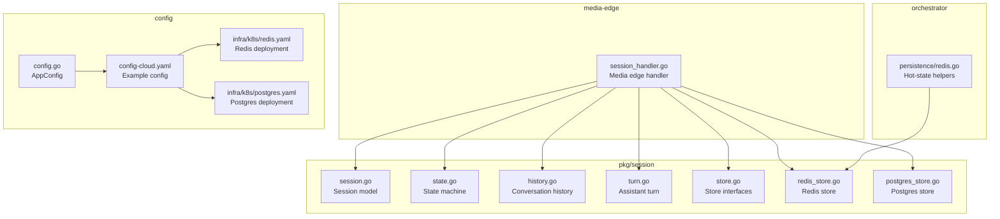
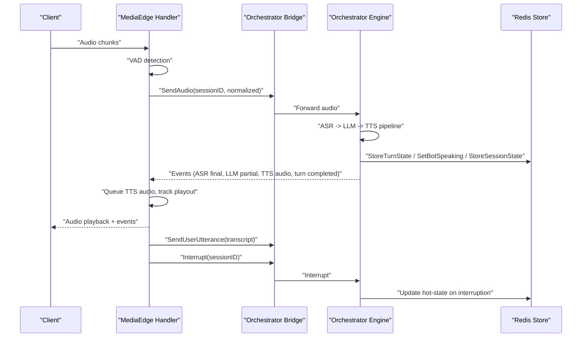
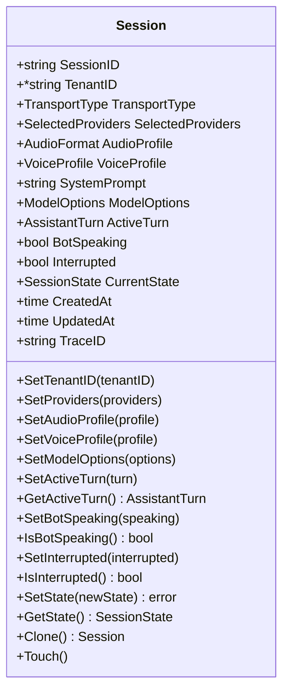
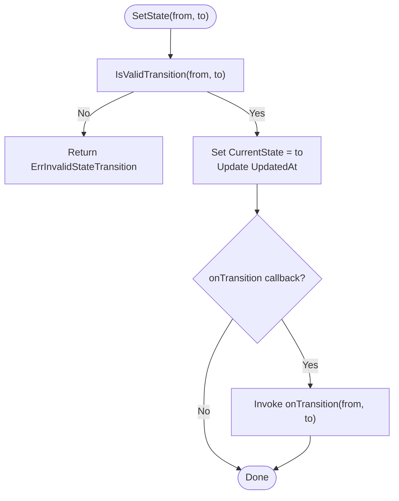
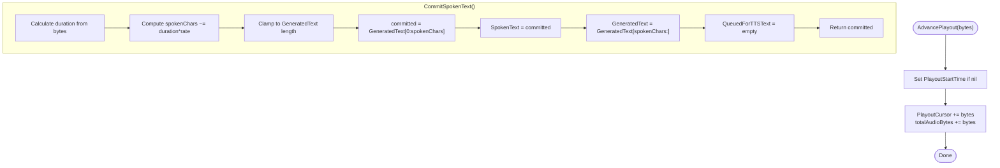
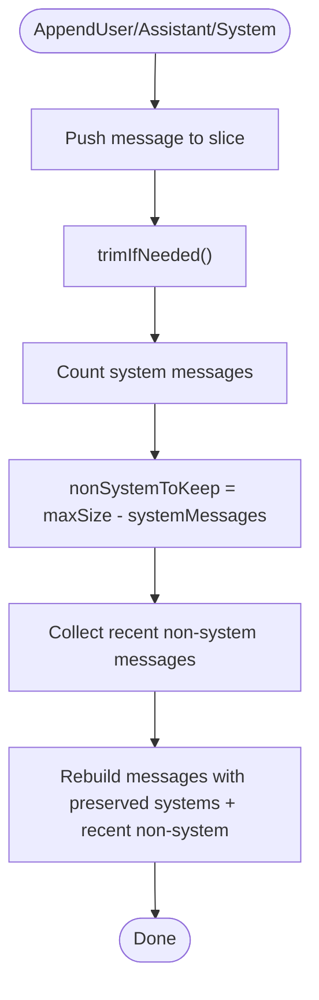
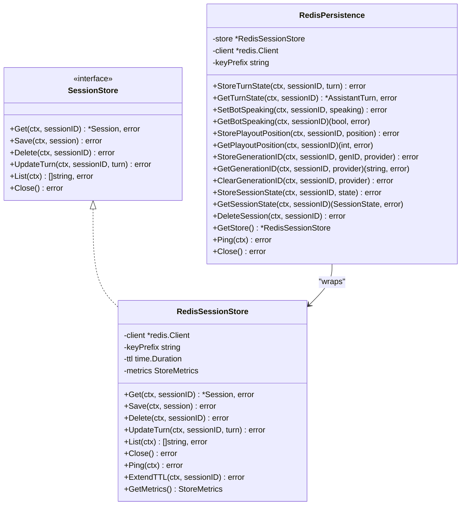
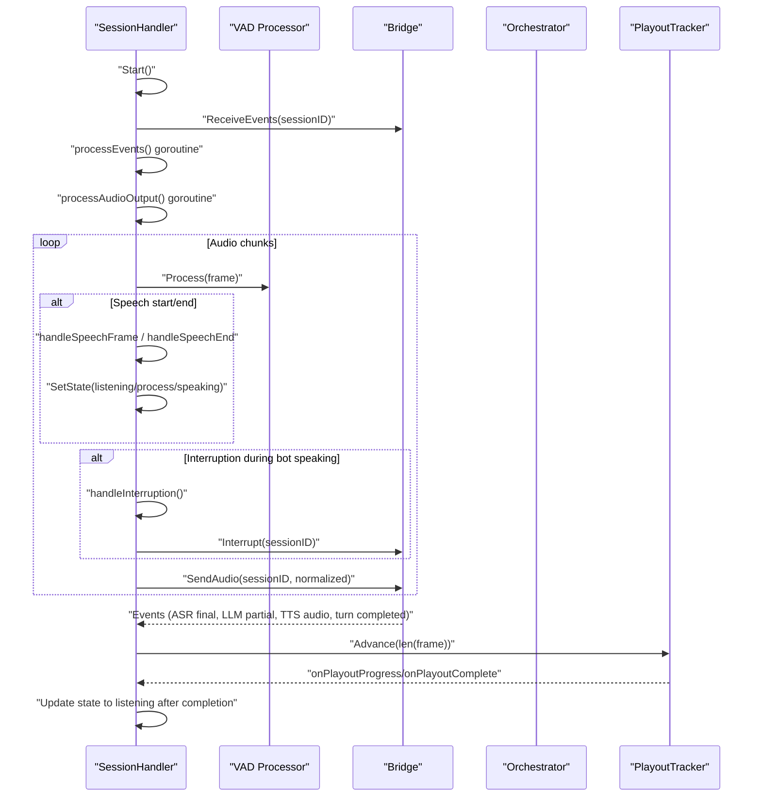
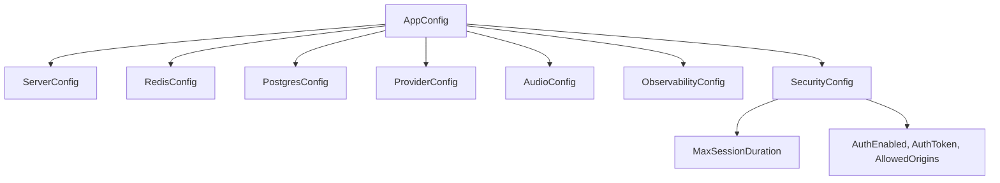
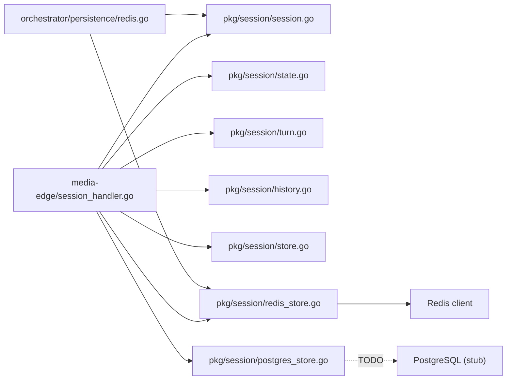

# Session Management

<cite>
**Referenced Files in This Document**
- [session.go](file://go/pkg/session/session.go)
- [store.go](file://go/pkg/session/store.go)
- [state.go](file://go/pkg/session/state.go)
- [history.go](file://go/pkg/session/history.go)
- [turn.go](file://go/pkg/session/turn.go)
- [redis_store.go](file://go/pkg/session/redis_store.go)
- [postgres_store.go](file://go/pkg/session/postgres_store.go)
- [config.go](file://go/pkg/config/config.go)
- [session_handler.go](file://go/media-edge/internal/handler/session_handler.go)
- [redis.go](file://go/orchestrator/internal/persistence/redis.go)
- [session_test.go](file://go/pkg/session/session_test.go)
- [config-cloud.yaml](file://examples/config-cloud.yaml)
- [redis.yaml](file://infra/k8s/redis.yaml)
- [postgres.yaml](file://infra/k8s/postgres.yaml)
</cite>

## Table of Contents
1. [Introduction](#introduction)
2. [Project Structure](#project-structure)
3. [Core Components](#core-components)
4. [Architecture Overview](#architecture-overview)
5. [Detailed Component Analysis](#detailed-component-analysis)
6. [Dependency Analysis](#dependency-analysis)
7. [Performance Considerations](#performance-considerations)
8. [Troubleshooting Guide](#troubleshooting-guide)
9. [Conclusion](#conclusion)
10. [Appendices](#appendices)

## Introduction
This document provides a comprehensive guide to session management in the system, focusing on the client session lifecycle and state persistence. It explains how sessions are created, validated, and cleaned up, including session ID generation and uniqueness guarantees. It documents the session store abstraction, the in-memory placeholder implementation, and Redis integration plans. It also details session state tracking, conversation context preservation, and turn-based interaction management. Configuration options for session timeout, storage backends, and cleanup policies are covered, along with examples of session operations, state transitions, and error handling scenarios. Finally, it addresses session scaling considerations, distributed session management, and session data encryption requirements.

## Project Structure
The session management subsystem spans multiple packages:
- Core session model and state machine live under go/pkg/session.
- Storage interfaces and Redis/PostgreSQL implementations are in go/pkg/session.
- Media edge integrates session handling into the audio pipeline.
- Orchestrator persistence provides Redis-backed hot-state helpers.
- Configuration is defined in go/pkg/config and example YAMLs are in examples and infra/k8s.

**Diagram sources**
- [session.go:1-249](file://go/pkg/session/session.go#L1-L249)
- [state.go:1-153](file://go/pkg/session/state.go#L1-L153)
- [history.go:1-233](file://go/pkg/session/history.go#L1-L233)
- [turn.go:1-230](file://go/pkg/session/turn.go#L1-L230)
- [store.go:1-114](file://go/pkg/session/store.go#L1-L114)
- [redis_store.go:1-166](file://go/pkg/session/redis_store.go#L1-L166)
- [postgres_store.go:1-93](file://go/pkg/session/postgres_store.go#L1-L93)
- [session_handler.go:1-540](file://go/media-edge/internal/handler/session_handler.go#L1-L540)
- [redis.go:1-317](file://go/orchestrator/internal/persistence/redis.go#L1-L317)
- [config.go:1-276](file://go/pkg/config/config.go#L1-L276)
- [config-cloud.yaml:1-39](file://examples/config-cloud.yaml#L1-L39)
- [redis.yaml:1-97](file://infra/k8s/redis.yaml#L1-L97)
- [postgres.yaml:1-116](file://infra/k8s/postgres.yaml#L1-L116)

**Section sources**
- [session.go:1-249](file://go/pkg/session/session.go#L1-L249)
- [store.go:1-114](file://go/pkg/session/store.go#L1-L114)
- [state.go:1-153](file://go/pkg/session/state.go#L1-L153)
- [history.go:1-233](file://go/pkg/session/history.go#L1-L233)
- [turn.go:1-230](file://go/pkg/session/turn.go#L1-L230)
- [redis_store.go:1-166](file://go/pkg/session/redis_store.go#L1-L166)
- [postgres_store.go:1-93](file://go/pkg/session/postgres_store.go#L1-L93)
- [session_handler.go:1-540](file://go/media-edge/internal/handler/session_handler.go#L1-L540)
- [redis.go:1-317](file://go/orchestrator/internal/persistence/redis.go#L1-L317)
- [config.go:1-276](file://go/pkg/config/config.go#L1-L276)
- [config-cloud.yaml:1-39](file://examples/config-cloud.yaml#L1-L39)
- [redis.yaml:1-97](file://infra/k8s/redis.yaml#L1-L97)
- [postgres.yaml:1-116](file://infra/k8s/postgres.yaml#L1-L116)

## Core Components
- Session model: Encapsulates runtime state, metadata, and thread-safe setters/getters for all fields. Includes cloning and timestamp touch semantics.
- State machine: Defines valid session states and transitions, with validation and callbacks.
- Turn management: Tracks assistant response generation, queuing for TTS, playout progress, interruptions, and commitment to history.
- Conversation history: Manages message history with trimming and prompt context building.
- Store abstraction: Defines a generic interface for session persistence with Redis and PostgreSQL placeholders.
- Redis store: Implements session persistence and hot-state helpers for orchestrator-side hot data.
- Media edge handler: Integrates audio pipeline with session state, VAD, playout tracking, and interruption handling.
- Configuration: Provides server, Redis, Postgres, providers, audio, observability, and security settings.

**Section sources**
- [session.go:62-249](file://go/pkg/session/session.go#L62-L249)
- [state.go:8-153](file://go/pkg/session/state.go#L8-L153)
- [turn.go:9-230](file://go/pkg/session/turn.go#L9-L230)
- [history.go:11-233](file://go/pkg/session/history.go#L11-L233)
- [store.go:16-114](file://go/pkg/session/store.go#L16-L114)
- [redis_store.go:12-166](file://go/pkg/session/redis_store.go#L12-L166)
- [postgres_store.go:10-93](file://go/pkg/session/postgres_store.go#L10-L93)
- [session_handler.go:17-540](file://go/media-edge/internal/handler/session_handler.go#L17-L540)
- [config.go:9-276](file://go/pkg/config/config.go#L9-L276)

## Architecture Overview
The session lifecycle spans three layers:
- Media Edge: Receives audio, runs VAD, buffers speech, forwards audio to the orchestrator, and streams TTS output back to the client. It updates session state and turn playout progress.
- Orchestrator: Manages the pipeline stages (ASR, LLM, TTS) and maintains hot-state in Redis (session state, bot speaking flag, turn state, playout position, generation IDs).
- Persistence: Stores full session data in Redis (via RedisSessionStore) and provides a PostgreSQL placeholder for durable storage.

**Diagram sources**
- [session_handler.go:176-432](file://go/media-edge/internal/handler/session_handler.go#L176-L432)
- [redis.go:38-278](file://go/orchestrator/internal/persistence/redis.go#L38-L278)
- [redis_store.go:38-144](file://go/pkg/session/redis_store.go#L38-L144)

## Detailed Component Analysis

### Session Model and Lifecycle
- Session encapsulates runtime state (active turn, bot speaking, interrupted), metadata (created/updated timestamps, trace ID), and configuration (tenant, providers, audio/profiles, model/system prompt).
- Thread-safety is ensured via RWMutex for all setters/getters and cloning.
- Timestamps are updated on mutations and explicit Touch() calls.
- State transitions are validated against a deterministic state machine.

**Diagram sources**
- [session.go:62-249](file://go/pkg/session/session.go#L62-L249)

**Section sources**
- [session.go:62-249](file://go/pkg/session/session.go#L62-L249)
- [session_test.go:10-35](file://go/pkg/session/session_test.go#L10-L35)
- [session_test.go:184-240](file://go/pkg/session/session_test.go#L184-L240)
- [session_test.go:242-276](file://go/pkg/session/session_test.go#L242-L276)
- [session_test.go:278-316](file://go/pkg/session/session_test.go#L278-L316)
- [session_test.go:318-330](file://go/pkg/session/session_test.go#L318-L330)

### State Machine and Transitions
- States: idle, listening, processing, speaking, interrupted.
- Valid transitions are enforced by a transition matrix; attempting invalid transitions returns an error.
- The state machine supports callbacks for transitions and exposes helpers to check active/processing/listening/speaking states.

**Diagram sources**
- [state.go:64-118](file://go/pkg/session/state.go#L64-L118)

**Section sources**
- [state.go:8-153](file://go/pkg/session/state.go#L8-L153)
- [session_test.go:37-70](file://go/pkg/session/session_test.go#L37-L70)

### Assistant Turn and Playout Tracking
- AssistantTurn tracks generated text, TTS queue, spoken text, interruption, and playout cursor.
- Playout cursor advances by bytes; duration estimation converts bytes to time based on sample rate and encoding.
- CommitSpokenText trims unspoken text and updates spoken text; GetCommittableText returns only what was actually spoken.
- Interruption marks the turn as interrupted and adjusts cursor.

**Diagram sources**
- [turn.go:125-166](file://go/pkg/session/turn.go#L125-L166)
- [turn.go:71-95](file://go/pkg/session/turn.go#L71-L95)
- [turn.go:108-123](file://go/pkg/session/turn.go#L108-L123)

**Section sources**
- [turn.go:9-230](file://go/pkg/session/turn.go#L9-L230)
- [session_test.go:72-135](file://go/pkg/session/session_test.go#L72-L135)
- [session_test.go:332-359](file://go/pkg/session/session_test.go#L332-L359)

### Conversation History and Prompt Context
- ConversationHistory maintains a bounded list of messages, preserving system messages while trimming oldest user/assistant entries when exceeding capacity.
- Prompt context construction includes system prompt and recent user/assistant messages, with optional cap on context size.

**Diagram sources**
- [history.go:157-198](file://go/pkg/session/history.go#L157-L198)
- [history.go:84-115](file://go/pkg/session/history.go#L84-L115)

**Section sources**
- [history.go:11-233](file://go/pkg/session/history.go#L11-L233)
- [session_test.go:137-182](file://go/pkg/session/session_test.go#L137-L182)

### Session Store Abstraction and Redis Implementation
- SessionStore interface defines Get, Save, Delete, UpdateTurn, List, and Close.
- RedisSessionStore implements the interface using JSON marshaling and Redis key composition with configurable prefixes and TTL.
- Hot-state helpers in RedisPersistence store session state, bot speaking flag, turn state, playout position, and generation IDs using Redis hashes and expirations.

**Diagram sources**
- [store.go:16-35](file://go/pkg/session/store.go#L16-L35)
- [redis_store.go:12-166](file://go/pkg/session/redis_store.go#L12-L166)
- [redis.go:13-317](file://go/orchestrator/internal/persistence/redis.go#L13-L317)

**Section sources**
- [store.go:16-114](file://go/pkg/session/store.go#L16-L114)
- [redis_store.go:12-166](file://go/pkg/session/redis_store.go#L12-L166)
- [redis.go:13-317](file://go/orchestrator/internal/persistence/redis.go#L13-L317)

### Media Edge Session Handler
- Starts in idle, transitions to listening upon Start().
- Processes audio chunks through normalization, VAD, and buffers speech for ASR.
- On speech end, transitions to processing; on LLM partial text, transitions to speaking.
- Handles interruptions during bot speech, forwarding interruption events and resetting playout.
- Streams TTS audio to client via jitter buffers and playout tracker.
- Updates session state and turn playout cursor continuously.

**Diagram sources**
- [session_handler.go:119-460](file://go/media-edge/internal/handler/session_handler.go#L119-L460)

**Section sources**
- [session_handler.go:17-540](file://go/media-edge/internal/handler/session_handler.go#L17-L540)

### Configuration Options
- AppConfig includes server, Redis, Postgres, providers, audio, observability, and security sections.
- Security config includes max session duration and auth settings.
- Example config-cloud.yaml demonstrates Redis address, Postgres DSN, and security settings.

**Diagram sources**
- [config.go:9-94](file://go/pkg/config/config.go#L9-L94)
- [config-cloud.yaml:1-39](file://examples/config-cloud.yaml#L1-L39)

**Section sources**
- [config.go:9-276](file://go/pkg/config/config.go#L9-L276)
- [config-cloud.yaml:1-39](file://examples/config-cloud.yaml#L1-L39)

## Dependency Analysis
- Media Edge depends on Session model, state machine, turn, and history for runtime orchestration.
- Orchestrator persistence depends on RedisSessionStore and uses Redis hashes for hot-state.
- RedisSessionStore depends on Redis client and JSON marshaling.
- PostgreSQL store is a placeholder with TODO comments indicating missing implementation.

**Diagram sources**
- [session_handler.go:17-540](file://go/media-edge/internal/handler/session_handler.go#L17-L540)
- [redis_store.go:12-166](file://go/pkg/session/redis_store.go#L12-L166)
- [postgres_store.go:10-93](file://go/pkg/session/postgres_store.go#L10-L93)
- [redis.go:13-317](file://go/orchestrator/internal/persistence/redis.go#L13-L317)

**Section sources**
- [session_handler.go:17-540](file://go/media-edge/internal/handler/session_handler.go#L17-L540)
- [redis_store.go:12-166](file://go/pkg/session/redis_store.go#L12-L166)
- [postgres_store.go:10-93](file://go/pkg/session/postgres_store.go#L10-L93)
- [redis.go:13-317](file://go/orchestrator/internal/persistence/redis.go#L13-L317)

## Performance Considerations
- Use Redis for hot-state and frequent reads/writes; configure appropriate key prefixes and TTLs to balance memory and freshness.
- Batch Redis operations using pipelines for turn state, playout position, and session state updates.
- Tune jitter buffers and playout tick intervals to minimize latency and buffer underruns.
- Monitor store metrics (gets, saves, deletes, update turns, errors) to detect bottlenecks.
- Consider connection pooling and timeouts for Redis and Postgres clients.

[No sources needed since this section provides general guidance]

## Troubleshooting Guide
Common issues and resolutions:
- Invalid state transition errors: Ensure state changes follow the allowed transitions matrix.
- Session not found errors: Verify session keys and prefixes; confirm Redis connectivity and key existence.
- Playout desynchronization: Check playout cursor updates and frame sizes; ensure consistent sample rates.
- Interruption handling: Confirm interruption events are forwarded and playout buffers cleared.
- Cleanup on stop: Orchestrator deletes Redis keys for a session; ensure StopSession is invoked.

**Section sources**
- [state.go:78-79](file://go/pkg/session/state.go#L78-L79)
- [redis_store.go:42-58](file://go/pkg/session/redis_store.go#L42-L58)
- [session_handler.go:279-314](file://go/media-edge/internal/handler/session_handler.go#L279-L314)
- [redis.go:280-301](file://go/orchestrator/internal/persistence/redis.go#L280-L301)

## Conclusion
The session management system provides a robust foundation for voice sessions with strong state validation, turn-based interaction tracking, and flexible storage backends. Redis is the primary hot-state store, while PostgreSQL remains a placeholder for durable persistence. The media edge and orchestrator integrate tightly around session state and turn progress, enabling responsive, interruption-aware conversations. Configuration supports operational controls such as session timeouts and security settings, and infrastructure manifests outline production-ready deployments for Redis and Postgres.

[No sources needed since this section summarizes without analyzing specific files]

## Appendices

### Session Operations and Examples
- Creating a session: Initialize with NewSession and set configuration via setters.
- Updating state: Use SetState with validation; invalid transitions return errors.
- Managing turns: Append generated text, queue for TTS, advance playout, commit spoken text, and mark interruptions.
- Conversation context: Build prompt context with system prompt and recent messages.
- Store operations: Get, Save, Delete, UpdateTurn, List, Close; Redis store supports TTL extension and metrics.

**Section sources**
- [session.go:86-208](file://go/pkg/session/session.go#L86-L208)
- [turn.go:36-166](file://go/pkg/session/turn.go#L36-L166)
- [history.go:84-115](file://go/pkg/session/history.go#L84-L115)
- [store.go:18-35](file://go/pkg/session/store.go#L18-L35)
- [redis_store.go:38-144](file://go/pkg/session/redis_store.go#L38-L144)

### Scaling and Distributed Considerations
- Horizontal scaling: Use Redis as a shared state store; ensure consistent key prefixes and TTLs across instances.
- Session affinity: Stateless design favors session data in Redis; avoid local-only state.
- Cleanup policies: Implement TTL-based eviction and periodic cleanup jobs; Orchestrator provides DeleteSession for Redis keys.
- Encryption: Encrypt sensitive fields at rest and in transit; consider TLS for Redis and Postgres connections.

**Section sources**
- [redis_store.go:156-160](file://go/pkg/session/redis_store.go#L156-L160)
- [redis.go:280-301](file://go/orchestrator/internal/persistence/redis.go#L280-L301)
- [config.go:31-36](file://go/pkg/config/config.go#L31-L36)
- [config.go:39-44](file://go/pkg/config/config.go#L39-L44)

### Deployment References
- Redis deployment manifest: Defines StatefulSet, Service, probes, and resource limits.
- Postgres deployment manifest: Defines StatefulSet, Service, environment variables, and probes.
- Example configuration: Demonstrates Redis address, Postgres DSN, and security settings.

**Section sources**
- [redis.yaml:1-97](file://infra/k8s/redis.yaml#L1-L97)
- [postgres.yaml:1-116](file://infra/k8s/postgres.yaml#L1-L116)
- [config-cloud.yaml:6-10](file://examples/config-cloud.yaml#L6-L10)
- [config-cloud.yaml:36-39](file://examples/config-cloud.yaml#L36-L39)