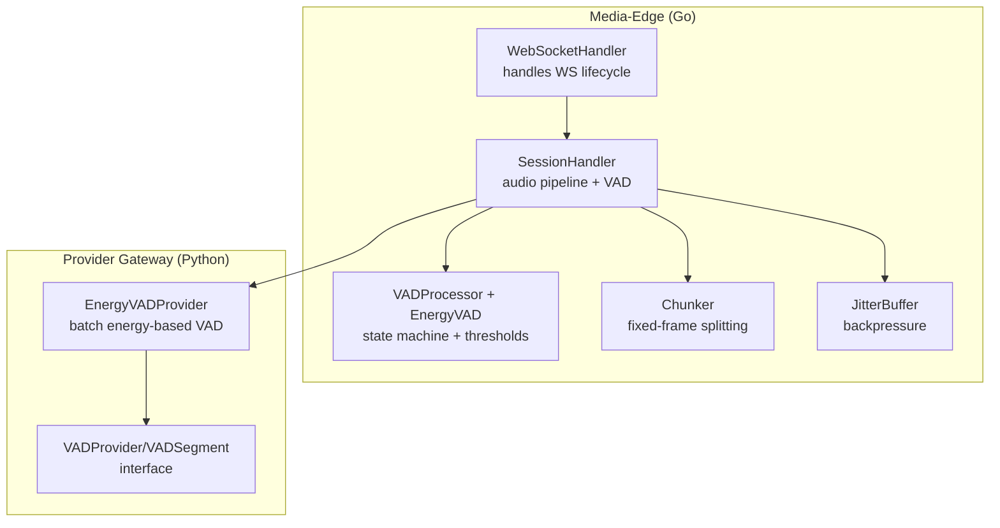
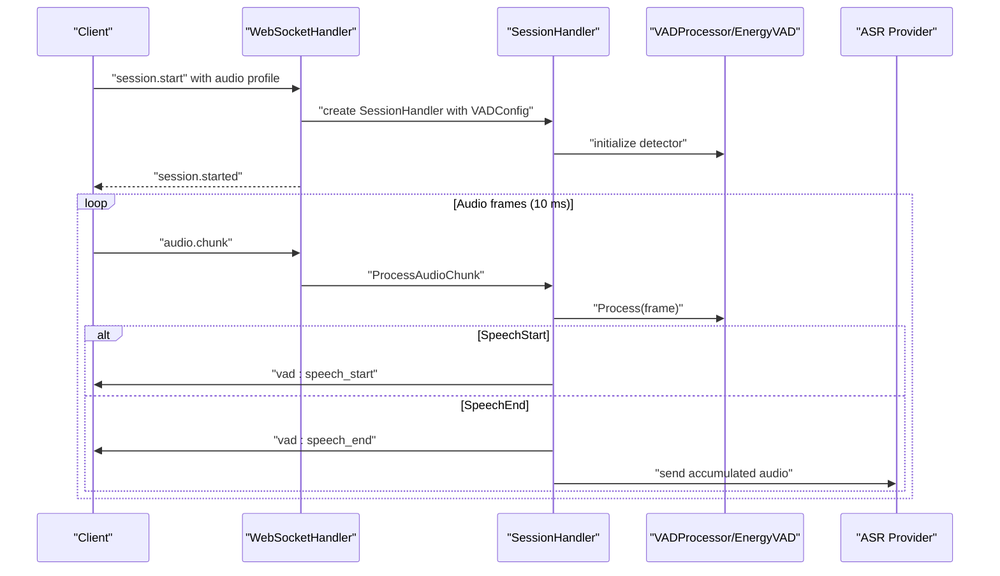
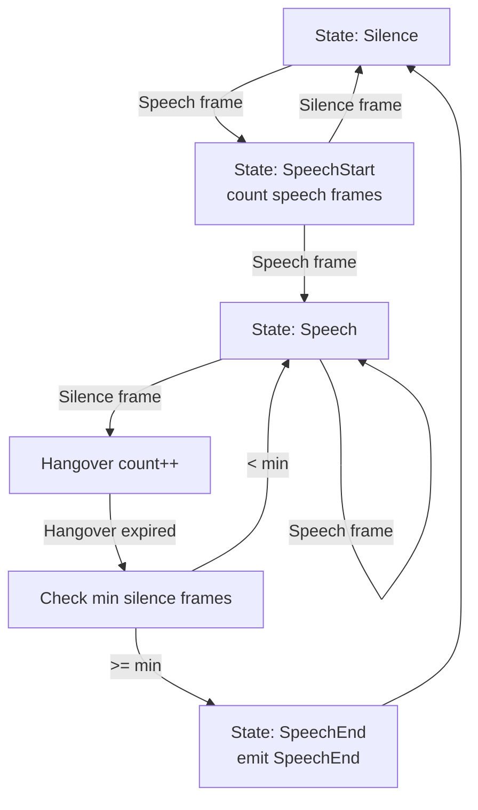
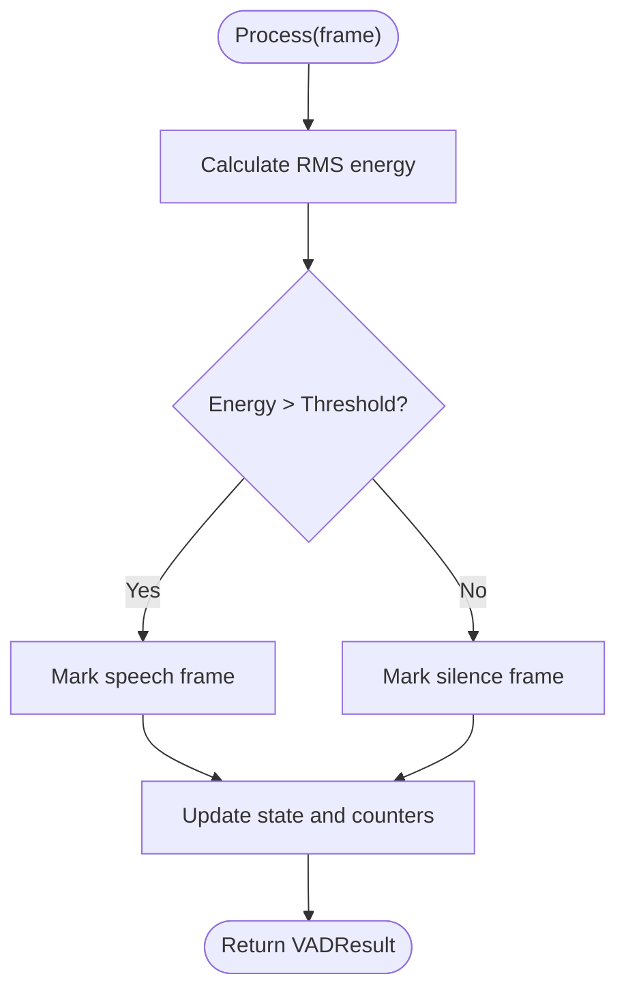
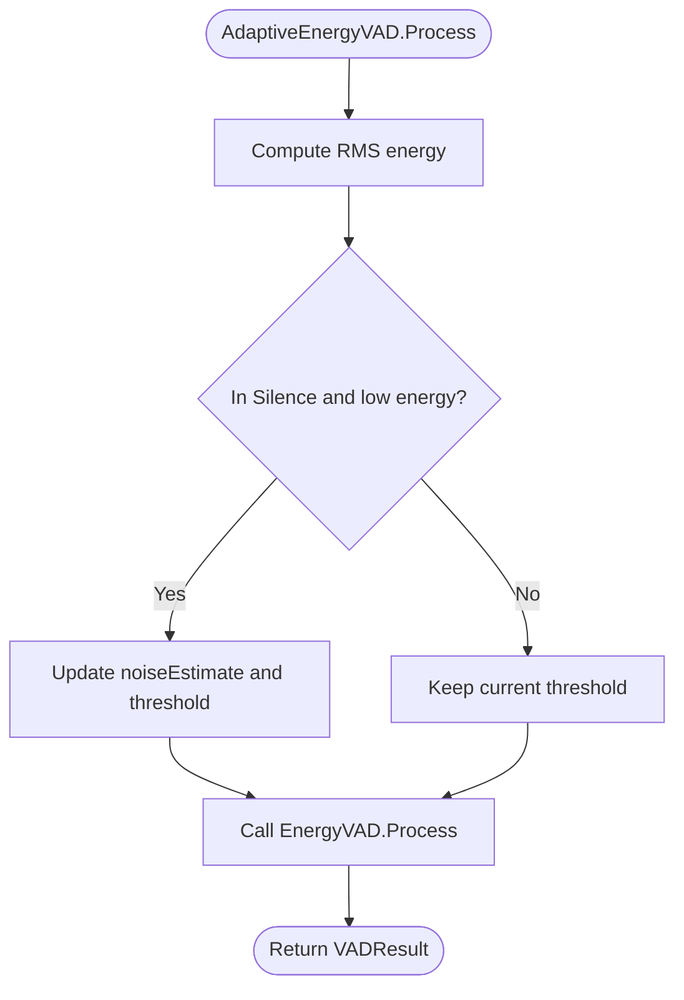
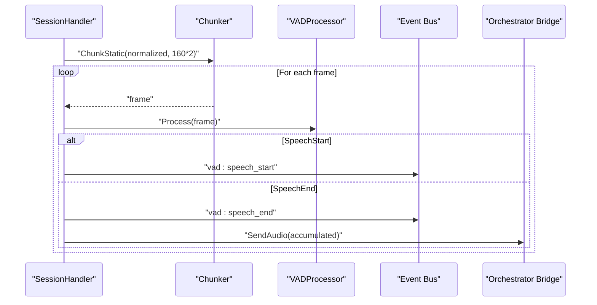
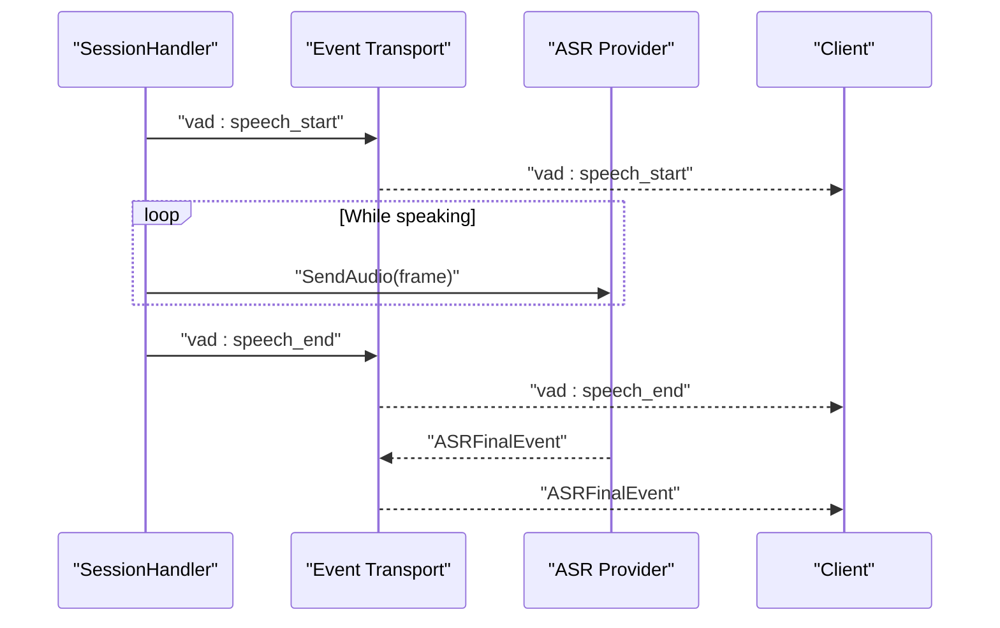
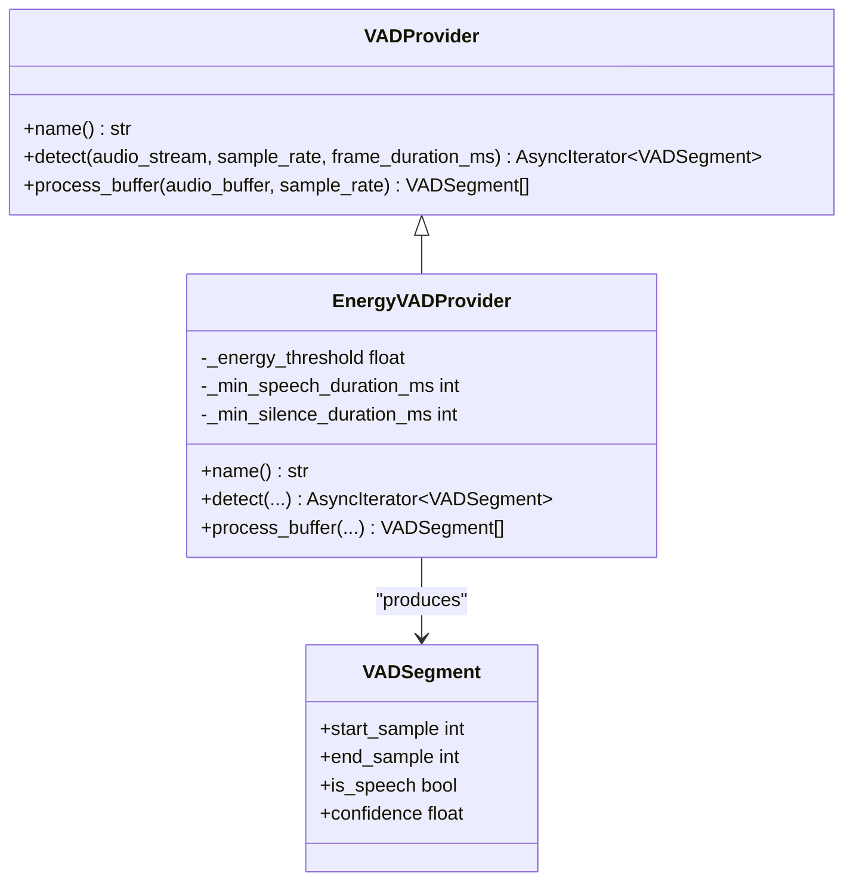
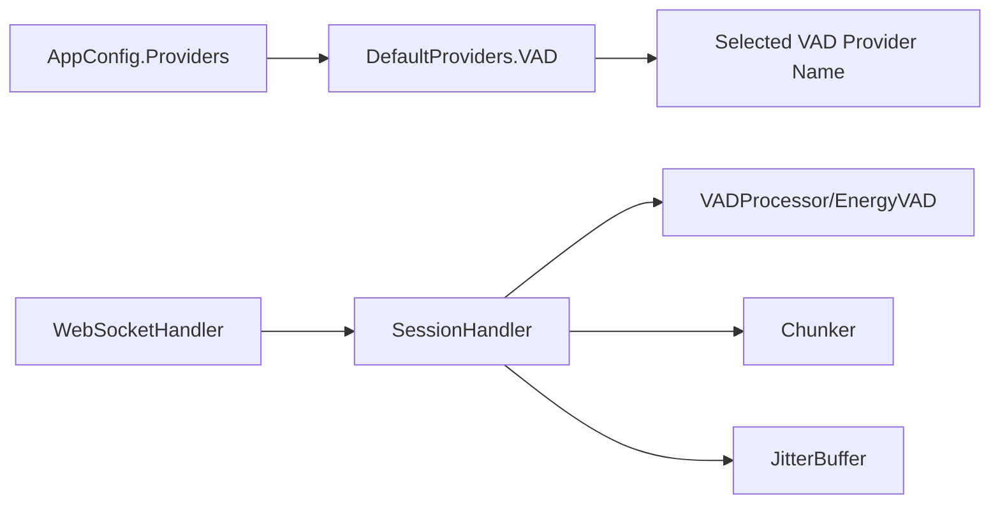

# Voice Activity Detection (VAD)

<cite>
**Referenced Files in This Document**
- [vad.go](file://go/media-edge/internal/vad/vad.go)
- [session_handler.go](file://go/media-edge/internal/handler/session_handler.go)
- [websocket.go](file://go/media-edge/internal/handler/websocket.go)
- [chunk.go](file://go/pkg/audio/chunk.go)
- [buffer.go](file://go/pkg/audio/buffer.go)
- [config.go](file://go/pkg/config/config.go)
- [defaults.go](file://go/pkg/config/defaults.go)
- [base.py](file://py/provider_gateway/app/providers/vad/base.py)
- [energy_vad.py](file://py/provider_gateway/app/providers/vad/energy_vad.py)
- [config-cloud.yaml](file://examples/config-cloud.yaml)
- [config-local.yaml](file://examples/config-local.yaml)
</cite>

## Table of Contents
1. [Introduction](#introduction)
2. [Project Structure](#project-structure)
3. [Core Components](#core-components)
4. [Architecture Overview](#architecture-overview)
5. [Detailed Component Analysis](#detailed-component-analysis)
6. [Dependency Analysis](#dependency-analysis)
7. [Performance Considerations](#performance-considerations)
8. [Troubleshooting Guide](#troubleshooting-guide)
9. [Conclusion](#conclusion)
10. [Appendices](#appendices)

## Introduction
This document describes the Voice Activity Detection (VAD) implementation used for speech boundary detection and audio segmentation in the system. It covers algorithm selection, configuration parameters, sensitivity tuning, client-server integration, confidence scoring, decision-making logic, and performance considerations. The VAD subsystem consists of:
- A Go-based media-edge VAD with energy-based detection and adaptive thresholding
- A Python provider gateway with a simple energy-based VAD provider
- A WebSocket-driven audio pipeline that segments speech and coordinates with downstream ASR providers

## Project Structure
The VAD implementation spans two primary areas:
- Media-edge (Go): Real-time VAD processing, state machine, and integration with the audio pipeline
- Provider Gateway (Python): Optional VAD provider for batch-style detection and compatibility

**Diagram sources**
- [websocket.go:260-374](file://go/media-edge/internal/handler/websocket.go#L260-L374)
- [session_handler.go:64-117](file://go/media-edge/internal/handler/session_handler.go#L64-L117)
- [vad.go:305-373](file://go/media-edge/internal/vad/vad.go#L305-L373)
- [chunk.go:14-40](file://go/pkg/audio/chunk.go#L14-L40)
- [buffer.go:26-95](file://go/pkg/audio/buffer.go#L26-L95)
- [energy_vad.py:14-146](file://py/provider_gateway/app/providers/vad/energy_vad.py#L14-L146)
- [base.py:18-65](file://py/provider_gateway/app/providers/vad/base.py#L18-L65)

**Section sources**
- [websocket.go:260-374](file://go/media-edge/internal/handler/websocket.go#L260-L374)
- [session_handler.go:64-117](file://go/media-edge/internal/handler/session_handler.go#L64-L117)
- [vad.go:305-373](file://go/media-edge/internal/vad/vad.go#L305-L373)
- [chunk.go:14-40](file://go/pkg/audio/chunk.go#L14-L40)
- [buffer.go:26-95](file://go/pkg/audio/buffer.go#L26-L95)
- [energy_vad.py:14-146](file://py/provider_gateway/app/providers/vad/energy_vad.py#L14-L146)
- [base.py:18-65](file://py/provider_gateway/app/providers/vad/base.py#L18-L65)

## Core Components
- VAD state machine and result model
  - States: Silence, SpeechStart, Speech, SpeechEnd
  - Result fields: IsSpeech, Energy, Timestamp, State, SpeechStart, SpeechEnd
- Configuration model
  - Threshold, MinSpeechMs, MinSilenceMs, HangoverFrames, FrameSizeMs, SampleRate
- Detectors
  - EnergyVAD: Fixed-threshold energy-based VAD
  - AdaptiveEnergyVAD: Noise-adaptive threshold scaling
  - VADProcessor: Wraps a detector with callbacks and speech duration tracking
- Python provider
  - EnergyVADProvider: Batch energy-based VAD with configurable thresholds and durations
  - VADSegment: Segment model with start/end indices, confidence, and label

**Section sources**
- [vad.go:10-66](file://go/media-edge/internal/vad/vad.go#L10-L66)
- [vad.go:68-78](file://go/media-edge/internal/vad/vad.go#L68-L78)
- [vad.go:80-103](file://go/media-edge/internal/vad/vad.go#L80-L103)
- [vad.go:263-303](file://go/media-edge/internal/vad/vad.go#L263-L303)
- [vad.go:305-373](file://go/media-edge/internal/vad/vad.go#L305-L373)
- [base.py:8-16](file://py/provider_gateway/app/providers/vad/base.py#L8-L16)
- [energy_vad.py:14-43](file://py/provider_gateway/app/providers/vad/energy_vad.py#L14-L43)

## Architecture Overview
The VAD sits at the media-edge, processing 10 ms PCM16 frames in real time. Speech boundaries trigger events and accumulate audio for ASR. The Python provider offers an alternative batch-style VAD for environments where streaming is not required.

**Diagram sources**
- [websocket.go:260-374](file://go/media-edge/internal/handler/websocket.go#L260-L374)
- [session_handler.go:176-225](file://go/media-edge/internal/handler/session_handler.go#L176-L225)
- [vad.go:105-197](file://go/media-edge/internal/vad/vad.go#L105-L197)

## Detailed Component Analysis

### Go VAD State Machine and Decision Logic
The Go VAD uses a finite state machine with four states and frame-level decisions:
- Silence: Transition to SpeechStart upon sufficient consecutive speech frames
- SpeechStart: Confirm speech or revert to Silence on false start
- Speech: Track speech/silence frames and apply hangover to tolerate short drops
- SpeechEnd: Transition back to Silence after minimum silence and hangover

**Diagram sources**
- [vad.go:125-194](file://go/media-edge/internal/vad/vad.go#L125-L194)

**Section sources**
- [vad.go:10-34](file://go/media-edge/internal/vad/vad.go#L10-L34)
- [vad.go:125-194](file://go/media-edge/internal/vad/vad.go#L125-L194)

### Energy-Based VAD Implementation Details
- Energy calculation: RMS over PCM16 samples
- Threshold comparison: Frame energy vs. configured threshold
- Consecutive frame counting: Enforces minimum durations for start/end transitions
- Hangover: Allows brief silence post-speech before ending

**Diagram sources**
- [vad.go:105-197](file://go/media-edge/internal/vad/vad.go#L105-L197)
- [vad.go:218-238](file://go/media-edge/internal/vad/vad.go#L218-L238)

**Section sources**
- [vad.go:105-197](file://go/media-edge/internal/vad/vad.go#L105-L197)
- [vad.go:218-238](file://go/media-edge/internal/vad/vad.go#L218-L238)

### Adaptive Threshold VAD
- Estimates noise floor during Silence
- Adapts threshold to 3x noise estimate
- Caps minimum threshold to avoid overly sensitive detection

**Diagram sources**
- [vad.go:279-303](file://go/media-edge/internal/vad/vad.go#L279-L303)

**Section sources**
- [vad.go:263-303](file://go/media-edge/internal/vad/vad.go#L263-L303)

### Audio Segmentation Workflow and Speech Boundary Detection
- Incoming audio is normalized and split into 10 ms PCM16 frames
- Each frame is processed by VAD; speech boundaries trigger events and ASR accumulation
- Interruption handling allows early termination if the bot is speaking and user speech is detected

**Diagram sources**
- [session_handler.go:176-225](file://go/media-edge/internal/handler/session_handler.go#L176-L225)
- [chunk.go:76-101](file://go/pkg/audio/chunk.go#L76-L101)

**Section sources**
- [session_handler.go:176-225](file://go/media-edge/internal/handler/session_handler.go#L176-L225)
- [chunk.go:76-101](file://go/pkg/audio/chunk.go#L76-L101)

### Client-Server Integration and Confidence Scoring
- Client receives vad:speech_start and vad:speech_end events
- Confidence scoring
  - Go VAD: Exposes Energy; confidence is implicit via energy magnitude
  - Python VAD: Provides confidence field in VADSegment (e.g., derived from energy)
- Integration with ASR providers
  - On speech_end, accumulated audio is sent to ASR for recognition
  - Partial and final ASR events are forwarded to the client

**Diagram sources**
- [session_handler.go:227-265](file://go/media-edge/internal/handler/session_handler.go#L227-L265)
- [websocket.go:376-405](file://go/media-edge/internal/handler/websocket.go#L376-L405)

**Section sources**
- [session_handler.go:227-265](file://go/media-edge/internal/handler/session_handler.go#L227-L265)
- [websocket.go:376-405](file://go/media-edge/internal/handler/websocket.go#L376-L405)

### Python Provider Gateway VAD
- EnergyVADProvider performs batch detection over PCM16 audio
- Uses configurable thresholds and durations for speech start/end
- Emits VADSegment with confidence and positional indices

**Diagram sources**
- [base.py:18-65](file://py/provider_gateway/app/providers/vad/base.py#L18-L65)
- [energy_vad.py:14-146](file://py/provider_gateway/app/providers/vad/energy_vad.py#L14-L146)

**Section sources**
- [base.py:8-16](file://py/provider_gateway/app/providers/vad/base.py#L8-L16)
- [energy_vad.py:14-146](file://py/provider_gateway/app/providers/vad/energy_vad.py#L14-L146)

## Dependency Analysis
- Configuration
  - AppConfig includes a Providers section with a VAD subsection for selecting providers
  - Defaults set VAD provider name under ProviderConfig.Defaults.VAD
- Runtime wiring
  - WebSocketHandler constructs SessionHandler with VADConfig derived from client audio profile
  - SessionHandler initializes EnergyVAD and VADProcessor, then processes audio frames

**Diagram sources**
- [config.go:46-61](file://go/pkg/config/config.go#L46-L61)
- [defaults.go:30-41](file://go/pkg/config/defaults.go#L30-L41)
- [websocket.go:322-340](file://go/media-edge/internal/handler/websocket.go#L322-L340)
- [session_handler.go:68-110](file://go/media-edge/internal/handler/session_handler.go#L68-L110)

**Section sources**
- [config.go:46-61](file://go/pkg/config/config.go#L46-L61)
- [defaults.go:30-41](file://go/pkg/config/defaults.go#L30-L41)
- [websocket.go:322-340](file://go/media-edge/internal/handler/websocket.go#L322-L340)
- [session_handler.go:68-110](file://go/media-edge/internal/handler/session_handler.go#L68-L110)

## Performance Considerations
- Frame size and sample rate
  - 10 ms frames at 16 kHz yield 160 samples/frame; PCM16 doubles byte size
  - Frame size affects latency and CPU cost; smaller frames reduce latency but increase overhead
- Throughput and buffering
  - JitterBuffer provides backpressure and bounded queues to prevent memory blow-up
  - Chunker ensures fixed-size frames for deterministic processing
- Real-time constraints
  - State machine runs per frame; keep thresholds and durations tuned to avoid oscillation
  - Adaptive threshold reduces false positives in noisy environments but adds computation
- CPU usage optimization
  - Prefer fixed-threshold EnergyVAD for lower CPU compared to adaptive variant
  - Tune MinSpeechMs and MinSilenceMs to reduce unnecessary ASR calls
  - Avoid excessive logging in hot paths; metrics collection should be offloaded or throttled

[No sources needed since this section provides general guidance]

## Troubleshooting Guide
- Symptoms: Frequent false starts or ends
  - Adjust Threshold and MinSpeechMs/MinSilenceMs
  - Consider switching to AdaptiveEnergyVAD for dynamic environments
- Symptoms: Missed speech or long delays
  - Reduce MinSpeechMs or increase sensitivity thresholds cautiously
  - Verify frame size matches audio profile (10 ms at 16 kHz)
- Symptoms: No vad events reaching client
  - Confirm WebSocket audio.chunk handling and event forwarding
  - Check SessionHandler state transitions and interruption logic
- Python provider differences
  - Batch vs. streaming: Python provider accumulates all audio before detection
  - Confidence semantics differ; align expectations with downstream ASR

**Section sources**
- [vad.go:46-66](file://go/media-edge/internal/vad/vad.go#L46-L66)
- [session_handler.go:176-225](file://go/media-edge/internal/handler/session_handler.go#L176-L225)
- [websocket.go:376-405](file://go/media-edge/internal/handler/websocket.go#L376-L405)
- [energy_vad.py:73-146](file://py/provider_gateway/app/providers/vad/energy_vad.py#L73-L146)

## Conclusion
The VAD implementation combines a robust Go-based energy detector with optional Python provider support. Its state machine and configurable thresholds enable precise speech boundary detection, while integration with the audio pipeline and ASR providers delivers a responsive, real-time experience. Tuning parameters such as thresholds, minimum durations, and frame sizes allows balancing accuracy and performance for diverse deployment scenarios.

[No sources needed since this section summarizes without analyzing specific files]

## Appendices

### Configuration Parameters Reference
- Go VADConfig
  - Threshold: Energy threshold for speech detection
  - MinSpeechMs: Minimum speech duration to confirm start
  - MinSilenceMs: Minimum silence duration to confirm end
  - HangoverFrames: Frames to continue after drop before ending
  - FrameSizeMs: Frame duration in milliseconds
  - SampleRate: Audio sample rate in Hz
- Python EnergyVADProvider
  - energy_threshold: Normalized RMS threshold (0–1)
  - min_speech_duration_ms: Minimum speech duration
  - min_silence_duration_ms: Minimum silence duration

**Section sources**
- [vad.go:46-66](file://go/media-edge/internal/vad/vad.go#L46-L66)
- [energy_vad.py:22-39](file://py/provider_gateway/app/providers/vad/energy_vad.py#L22-L39)

### Example Decision Outputs and Confidence Scores
- Go VADResult
  - IsSpeech: Boolean indicating active speech
  - Energy: RMS energy value
  - SpeechStart/SpeechEnd: Boundaries for segmentation
- Python VADSegment
  - start_sample/end_sample: Sample indices for speech region
  - is_speech: Label flag
  - confidence: Score derived from energy or model-specific logic

**Section sources**
- [vad.go:36-44](file://go/media-edge/internal/vad/vad.go#L36-L44)
- [base.py:8-16](file://py/provider_gateway/app/providers/vad/base.py#L8-L16)
- [energy_vad.py:121-144](file://py/provider_gateway/app/providers/vad/energy_vad.py#L121-L144)

### Integration with ASR Providers
- On speech_end, accumulated audio is sent to ASR for recognition
- Partial and final ASR events are forwarded to the client
- Provider selection is configured via AppConfig and defaults

**Section sources**
- [session_handler.go:227-265](file://go/media-edge/internal/handler/session_handler.go#L227-L265)
- [config.go:46-61](file://go/pkg/config/config.go#L46-L61)
- [defaults.go:30-41](file://go/pkg/config/defaults.go#L30-L41)