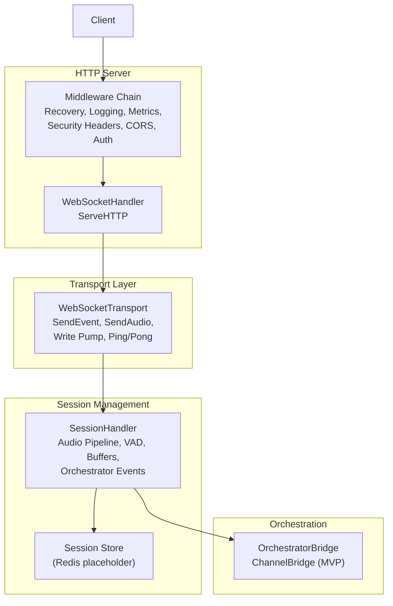
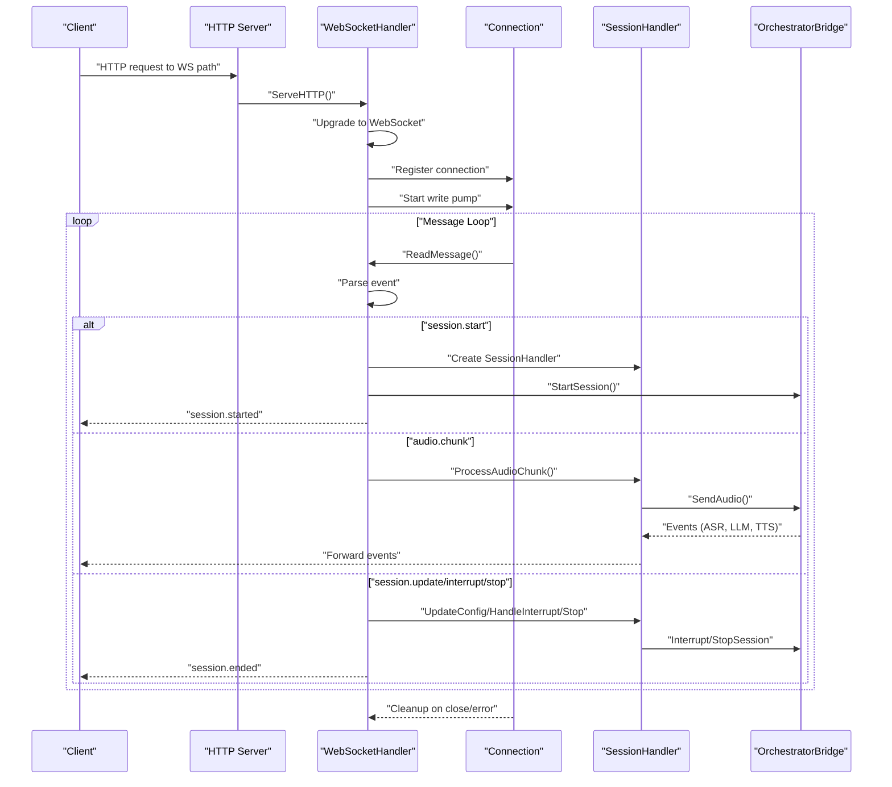
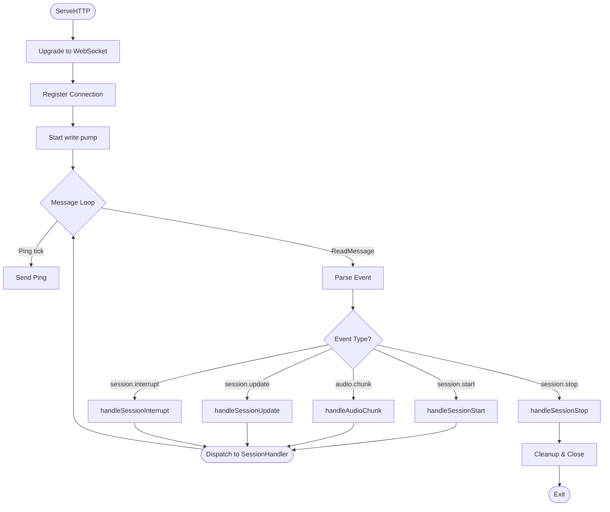
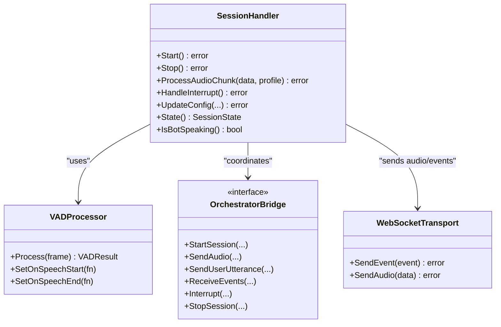
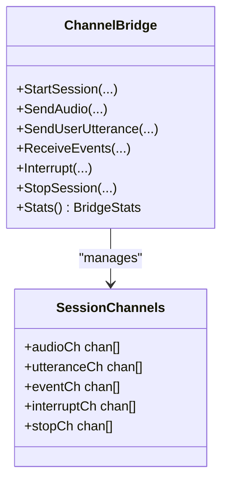
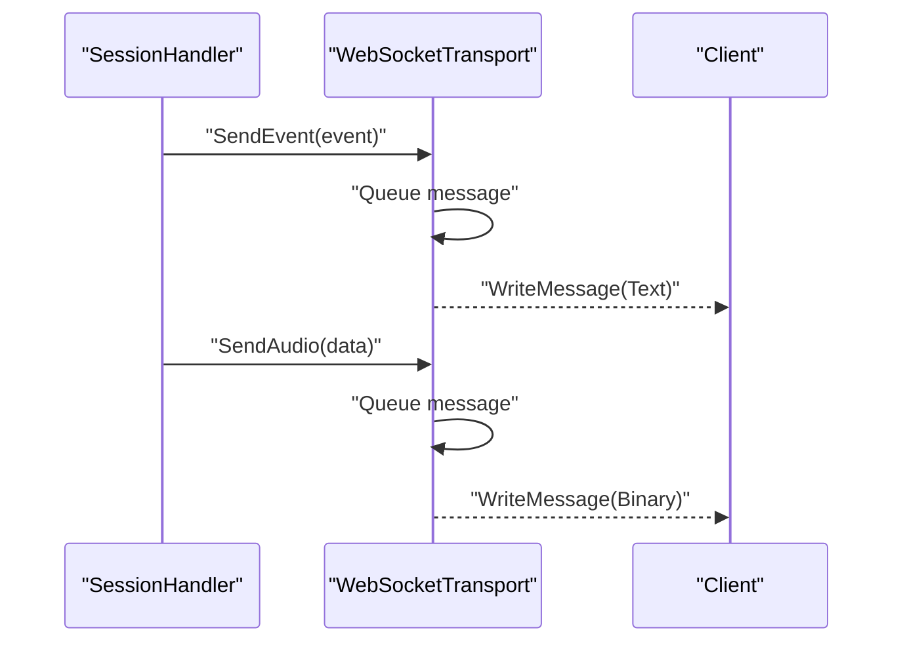
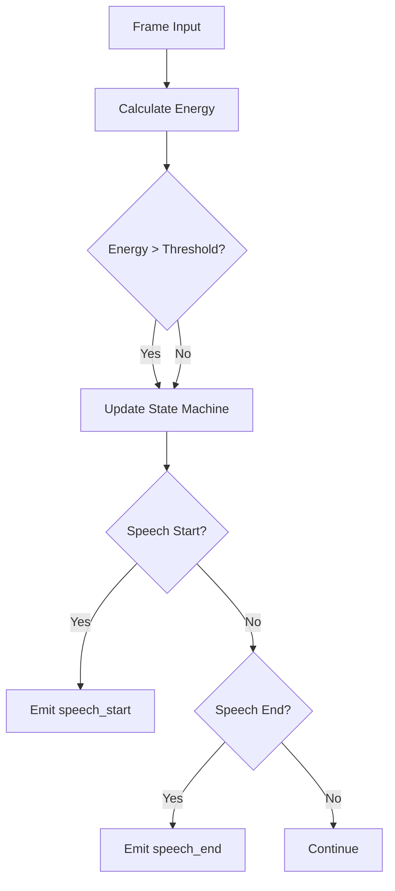
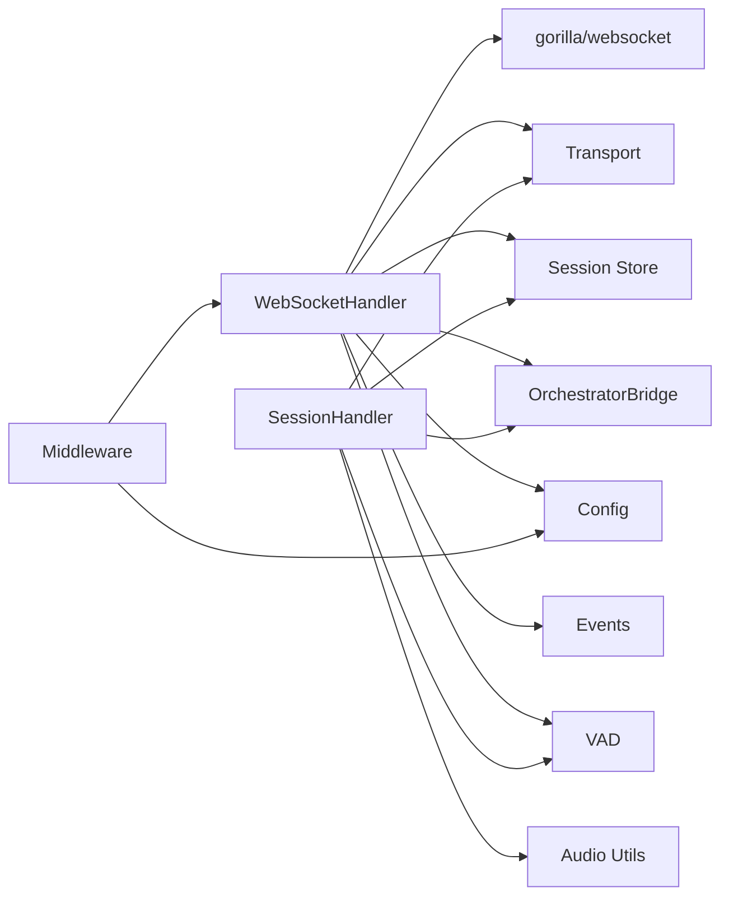

# WebSocket Handler

<cite>
**Referenced Files in This Document**
- [websocket.go](file://go/media-edge/internal/handler/websocket.go)
- [session_handler.go](file://go/media-edge/internal/handler/session_handler.go)
- [orchestrator_bridge.go](file://go/media-edge/internal/handler/orchestrator_bridge.go)
- [middleware.go](file://go/media-edge/internal/handler/middleware.go)
- [transport.go](file://go/media-edge/internal/transport/transport.go)
- [vad.go](file://go/media-edge/internal/vad/vad.go)
- [event.go](file://go/pkg/events/event.go)
- [config.go](file://go/pkg/config/config.go)
- [session.go](file://go/pkg/session/session.go)
- [main.go](file://go/media-edge/cmd/main.go)
- [websocket-api.md](file://docs/websocket-api.md)
</cite>

## Table of Contents
1. [Introduction](#introduction)
2. [Project Structure](#project-structure)
3. [Core Components](#core-components)
4. [Architecture Overview](#architecture-overview)
5. [Detailed Component Analysis](#detailed-component-analysis)
6. [Dependency Analysis](#dependency-analysis)
7. [Performance Considerations](#performance-considerations)
8. [Troubleshooting Guide](#troubleshooting-guide)
9. [Conclusion](#conclusion)

## Introduction
This document provides a comprehensive guide to the WebSocket handler implementation for real-time voice interaction protocols. It covers the WebSocket connection lifecycle, message parsing, audio frame streaming, session management, orchestration coordination, upgrade and validation procedures, error handling strategies, and security considerations such as origin validation, rate limiting placeholders, and connection timeouts. It also documents concrete message formats for audio streaming, session control, and event notifications, along with operational topics like connection pooling, concurrent connection limits, and graceful disconnection handling.

## Project Structure
The WebSocket handler resides in the media-edge service and integrates with middleware, transport, VAD, session management, and the orchestrator bridge. The HTTP server wires middleware and routes WebSocket traffic to the handler.

**Diagram sources**
- [main.go:129-143](file://go/media-edge/cmd/main.go#L129-L143)
- [websocket.go:95-129](file://go/media-edge/internal/handler/websocket.go#L95-L129)
- [transport.go:44-80](file://go/media-edge/internal/transport/transport.go#L44-L80)
- [session_handler.go:17-51](file://go/media-edge/internal/handler/session_handler.go#L17-L51)
- [orchestrator_bridge.go:45-96](file://go/media-edge/internal/handler/orchestrator_bridge.go#L45-L96)

**Section sources**
- [main.go:129-143](file://go/media-edge/cmd/main.go#L129-L143)
- [websocket.go:95-129](file://go/media-edge/internal/handler/websocket.go#L95-L129)
- [transport.go:44-80](file://go/media-edge/internal/transport/transport.go#L44-L80)
- [session_handler.go:17-51](file://go/media-edge/internal/handler/session_handler.go#L17-L51)
- [orchestrator_bridge.go:45-96](file://go/media-edge/internal/handler/orchestrator_bridge.go#L45-L96)

## Core Components
- WebSocketHandler: Manages WebSocket upgrade, connection lifecycle, message routing, and cleanup.
- Connection: Per-connection state, write channel, and metadata.
- SessionHandler: Audio pipeline, VAD processing, playout tracking, and orchestrator coordination.
- OrchestratorBridge: Communication interface to the orchestrator (ChannelBridge for MVP).
- WebSocketTransport: Transport abstraction for sending events and audio over WebSocket.
- Middleware: Security, CORS, authentication, logging, and metrics.
- VAD: Energy-based voice activity detection with configurable thresholds and state transitions.
- Events: Strongly typed JSON event parsing and serialization for client-server messaging.
- Config: Server, security, and audio configuration including max message sizes and timeouts.

**Section sources**
- [websocket.go:22-92](file://go/media-edge/internal/handler/websocket.go#L22-L92)
- [websocket.go:38-54](file://go/media-edge/internal/handler/websocket.go#L38-L54)
- [session_handler.go:17-51](file://go/media-edge/internal/handler/session_handler.go#L17-L51)
- [orchestrator_bridge.go:13-43](file://go/media-edge/internal/handler/orchestrator_bridge.go#L13-L43)
- [transport.go:16-42](file://go/media-edge/internal/transport/transport.go#L16-L42)
- [middleware.go:14-131](file://go/media-edge/internal/handler/middleware.go#L14-L131)
- [vad.go:68-103](file://go/media-edge/internal/vad/vad.go#L68-L103)
- [event.go:11-85](file://go/pkg/events/event.go#L11-L85)
- [config.go:20-94](file://go/pkg/config/config.go#L20-L94)

## Architecture Overview
The WebSocket handler acts as the entry point for real-time voice sessions. It validates and upgrades HTTP requests to WebSocket, registers connections, and spawns per-connection goroutines to handle reads, writes, pings, and message parsing. Messages are routed to session handlers, which coordinate audio processing, VAD, and orchestration with the bridge. The bridge currently uses in-process channels for MVP and will be extended to gRPC for distributed deployments.

**Diagram sources**
- [websocket.go:95-192](file://go/media-edge/internal/handler/websocket.go#L95-L192)
- [websocket.go:260-374](file://go/media-edge/internal/handler/websocket.go#L260-L374)
- [websocket.go:376-481](file://go/media-edge/internal/handler/websocket.go#L376-L481)
- [session_handler.go:119-174](file://go/media-edge/internal/handler/session_handler.go#L119-L174)
- [orchestrator_bridge.go:98-134](file://go/media-edge/internal/handler/orchestrator_bridge.go#L98-L134)

## Detailed Component Analysis

### WebSocketHandler Lifecycle and Message Parsing
- Upgrade and registration: The handler upgrades HTTP requests to WebSocket using a configurable upgrader with origin validation and buffer sizes derived from configuration. It registers the connection and starts a write pump goroutine.
- Read loop: The handler sets read deadlines, handles pings/pongs, and reads messages. It enforces message type and size limits, parses JSON events, and dispatches to specific handlers.
- Dispatch: Handlers cover session start, audio chunks, session updates, interruptions, and session stop. Errors are returned to the caller and converted to error events sent to the client.
- Cleanup: On exit or error, the handler cancels contexts, closes connections, unregisters from active connections, deletes sessions from store, and updates metrics.

**Diagram sources**
- [websocket.go:95-192](file://go/media-edge/internal/handler/websocket.go#L95-L192)
- [websocket.go:221-258](file://go/media-edge/internal/handler/websocket.go#L221-L258)
- [websocket.go:260-481](file://go/media-edge/internal/handler/websocket.go#L260-L481)

**Section sources**
- [websocket.go:95-192](file://go/media-edge/internal/handler/websocket.go#L95-L192)
- [websocket.go:221-258](file://go/media-edge/internal/handler/websocket.go#L221-L258)
- [websocket.go:260-481](file://go/media-edge/internal/handler/websocket.go#L260-L481)

### SessionHandler: Audio Pipeline, VAD, and Orchestrator Coordination
- Initialization: Creates VAD processor, PCM16 normalizer, chunker, playout tracker, jitter buffers, and sets up callbacks for VAD and playout progress.
- Audio processing: Normalizes incoming audio, splits into fixed-size frames, runs VAD, accumulates speech for ASR, and forwards audio to the bridge. Handles interruptions when the bot is speaking and user speech is detected.
- Orchestrator events: Receives events from the bridge (ASR partial/final, LLM partial text, TTS audio chunks, turn events, errors) and forwards them to the client. Updates session state accordingly.
- Audio output: Periodically drains output buffer and sends audio frames to the client via transport.
- Configuration updates: Applies runtime updates to system prompt, voice profile, model options, and provider selections.

**Diagram sources**
- [session_handler.go:17-117](file://go/media-edge/internal/handler/session_handler.go#L17-L117)
- [session_handler.go:176-225](file://go/media-edge/internal/handler/session_handler.go#L176-L225)
- [session_handler.go:316-403](file://go/media-edge/internal/handler/session_handler.go#L316-L403)
- [session_handler.go:405-432](file://go/media-edge/internal/handler/session_handler.go#L405-L432)
- [orchestrator_bridge.go:13-43](file://go/media-edge/internal/handler/orchestrator_bridge.go#L13-L43)
- [transport.go:16-42](file://go/media-edge/internal/transport/transport.go#L16-L42)

**Section sources**
- [session_handler.go:17-117](file://go/media-edge/internal/handler/session_handler.go#L17-L117)
- [session_handler.go:176-225](file://go/media-edge/internal/handler/session_handler.go#L176-L225)
- [session_handler.go:316-403](file://go/media-edge/internal/handler/session_handler.go#L316-L403)
- [session_handler.go:405-432](file://go/media-edge/internal/handler/session_handler.go#L405-L432)

### OrchestratorBridge: In-Process Channel Bridge (MVP)
- ChannelBridge maintains per-session channels for audio, user utterances, events, interrupts, and stop signals. It supports starting sessions, sending audio, forwarding user transcripts, receiving orchestrator events, triggering interruptions, and stopping sessions with cleanup.
- Stats and helpers expose active sessions and pending events, and support waiting for a session to be created.

**Diagram sources**
- [orchestrator_bridge.go:45-96](file://go/media-edge/internal/handler/orchestrator_bridge.go#L45-L96)
- [orchestrator_bridge.go:98-134](file://go/media-edge/internal/handler/orchestrator_bridge.go#L98-L134)
- [orchestrator_bridge.go:202-267](file://go/media-edge/internal/handler/orchestrator_bridge.go#L202-L267)

**Section sources**
- [orchestrator_bridge.go:45-96](file://go/media-edge/internal/handler/orchestrator_bridge.go#L45-L96)
- [orchestrator_bridge.go:98-134](file://go/media-edge/internal/handler/orchestrator_bridge.go#L98-L134)
- [orchestrator_bridge.go:202-267](file://go/media-edge/internal/handler/orchestrator_bridge.go#L202-L267)

### WebSocketTransport: Real-Time Audio Streaming
- Transport abstraction supports sending JSON events (text) and binary audio data (binary) with a buffered write channel and periodic ping.
- The write pump ensures non-blocking sends and graceful close behavior. ReceiveMessage preserves message type for downstream processing.

**Diagram sources**
- [transport.go:82-116](file://go/media-edge/internal/transport/transport.go#L82-L116)
- [transport.go:118-161](file://go/media-edge/internal/transport/transport.go#L118-L161)
- [transport.go:170-186](file://go/media-edge/internal/transport/transport.go#L170-L186)

**Section sources**
- [transport.go:82-116](file://go/media-edge/internal/transport/transport.go#L82-L116)
- [transport.go:118-161](file://go/media-edge/internal/transport/transport.go#L118-L161)
- [transport.go:170-186](file://go/media-edge/internal/transport/transport.go#L170-L186)

### VAD: Speech Detection and Interruption Handling
- Energy-based VAD with configurable thresholds, minimum speech/silence durations, and hangover frames. Processes 10ms PCM16 frames and emits state transitions.
- SessionHandler integrates VAD callbacks to detect speech start/end, accumulate audio for ASR, and trigger interruptions when the bot is speaking and user speech is detected.

**Diagram sources**
- [vad.go:105-197](file://go/media-edge/internal/vad/vad.go#L105-L197)
- [session_handler.go:227-265](file://go/media-edge/internal/handler/session_handler.go#L227-L265)

**Section sources**
- [vad.go:105-197](file://go/media-edge/internal/vad/vad.go#L105-L197)
- [session_handler.go:227-265](file://go/media-edge/internal/handler/session_handler.go#L227-L265)

### WebSocket Message Formats and Examples
- Client-to-server messages: session.start, audio.chunk, session.update, session.interrupt, session.stop.
- Server-to-client messages: session.started, vad.event, asr.partial, asr.final, llm.partial_text, tts.audio_chunk, turn.event, interruption.event, error, session.ended.
- Audio format: PCM16, sample rate and channels must match session.start’s audio_profile; chunks are 10–100ms at 16kHz.

Concrete examples and field definitions are documented in the WebSocket API reference.

**Section sources**
- [websocket-api.md:24-197](file://docs/websocket-api.md#L24-L197)
- [websocket-api.md:198-442](file://docs/websocket-api.md#L198-L442)
- [event.go:80-185](file://go/pkg/events/event.go#L80-L185)

## Dependency Analysis
- WebSocketHandler depends on:
  - Gorilla WebSocket for upgrade and messaging.
  - Transport for sending events/audio.
  - Session store for persistence.
  - OrchestratorBridge for orchestration.
  - Config for timeouts, chunk sizes, and allowed origins.
  - Events for parsing and serializing messages.
  - VAD for speech detection.
- SessionHandler depends on:
  - Transport for client communication.
  - OrchestratorBridge for pipeline events.
  - Audio utilities for normalization, chunking, and playout.
  - VAD for speech detection.
  - Session store for session state.
- Middleware provides cross-cutting concerns around security, CORS, auth, logging, and metrics.

**Diagram sources**
- [websocket.go:3-20](file://go/media-edge/internal/handler/websocket.go#L3-L20)
- [session_handler.go:3-15](file://go/media-edge/internal/handler/session_handler.go#L3-L15)
- [middleware.go:14-131](file://go/media-edge/internal/handler/middleware.go#L14-L131)

**Section sources**
- [websocket.go:3-20](file://go/media-edge/internal/handler/websocket.go#L3-L20)
- [session_handler.go:3-15](file://go/media-edge/internal/handler/session_handler.go#L3-L15)
- [middleware.go:14-131](file://go/media-edge/internal/handler/middleware.go#L14-L131)

## Performance Considerations
- Connection pooling and concurrency:
  - The handler tracks active connections and uses buffered channels for writes to avoid blocking. Consider implementing explicit connection limits via configuration and middleware hooks to enforce quotas.
  - The write pump and per-connection goroutines scale with concurrent sessions; ensure resource limits align with server capacity.
- Audio processing:
  - Fixed 10ms frames at 16kHz are used for VAD and normalization. Keep chunk sizes consistent to minimize jitter buffer overhead.
  - Jitter buffers and playout trackers smooth delivery; tune sizes for latency vs. throughput trade-offs.
- Backpressure and dropping:
  - ChannelBridge drops oldest items when full; consider adding client-side reordering and acknowledgment to reduce packet loss.
- Timeouts:
  - Read/write deadlines and ping/pong keep connections alive and responsive. Tune timeouts according to network conditions.

[No sources needed since this section provides general guidance]

## Troubleshooting Guide
- Connection upgrade failures:
  - Origin validation rejects non-allowed origins; verify AllowedOrigins configuration and client Origin header.
  - Read/Write buffer sizes must accommodate configured MaxChunkSize; mismatch can cause upgrade errors.
- Message parsing errors:
  - Unsupported message types or oversized messages are rejected; ensure clients send text JSON and respect MaxChunkSize.
  - Unknown event types produce errors; confirm event type strings match the event registry.
- Session lifecycle issues:
  - Starting a session while one is active or calling handlers without an active session returns errors; ensure session.start precedes audio.chunk and session.stop closes the session.
- Audio issues:
  - Incorrect audio format (encoding/sample rate/channels) causes normalization failures; align with audio_profile from session.start.
  - VAD misconfiguration leads to missed speech start/end; adjust thresholds and frame sizes.
- Orchestrator communication:
  - ChannelBridge full channels drop events; monitor pending events and increase buffer sizes or reduce event frequency.
- Security and rate limiting:
  - AuthMiddleware requires X-API-Key or api_key; enable auth and set token appropriately.
  - RateLimitMiddleware is a placeholder; implement a robust rate limiter in production.

**Section sources**
- [websocket.go:67-84](file://go/media-edge/internal/handler/websocket.go#L67-L84)
- [websocket.go:221-258](file://go/media-edge/internal/handler/websocket.go#L221-L258)
- [websocket.go:260-374](file://go/media-edge/internal/handler/websocket.go#L260-L374)
- [websocket.go:376-481](file://go/media-edge/internal/handler/websocket.go#L376-L481)
- [session_handler.go:176-225](file://go/media-edge/internal/handler/session_handler.go#L176-L225)
- [vad.go:56-66](file://go/media-edge/internal/vad/vad.go#L56-L66)
- [middleware.go:96-131](file://go/media-edge/internal/handler/middleware.go#L96-L131)
- [middleware.go:320-329](file://go/media-edge/internal/handler/middleware.go#L320-L329)

## Conclusion
The WebSocket handler provides a robust foundation for real-time voice interactions, with clear separation of concerns between connection management, session orchestration, audio processing, and event-driven orchestration. The current implementation uses an in-process bridge suitable for MVP and includes strong event typing, audio normalization, VAD, and transport abstractions. Production hardening should focus on connection limits, rate limiting, stricter origin validation, and transitioning the bridge to gRPC for distributed deployments.