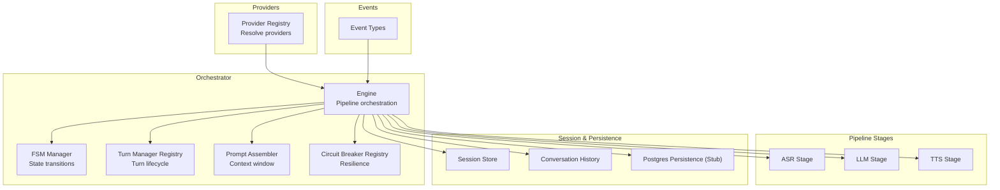
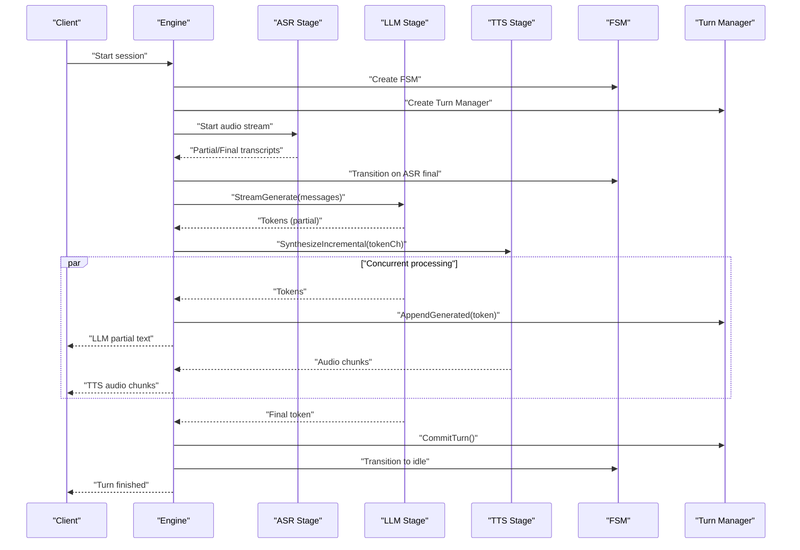
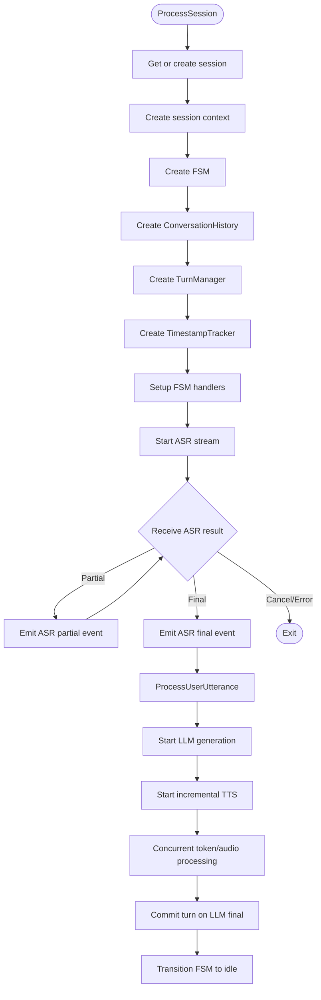
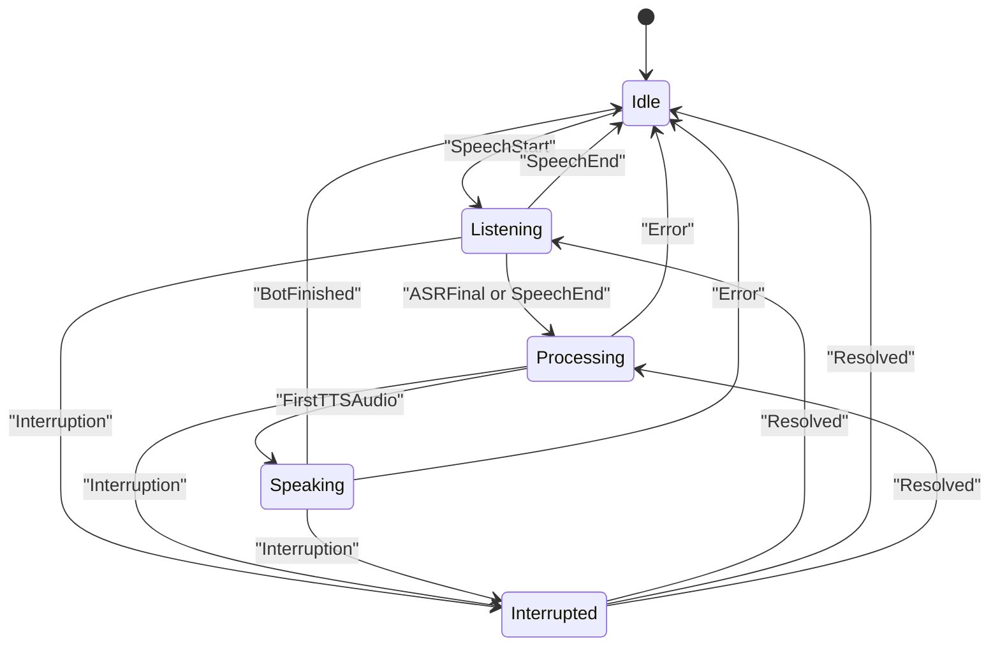
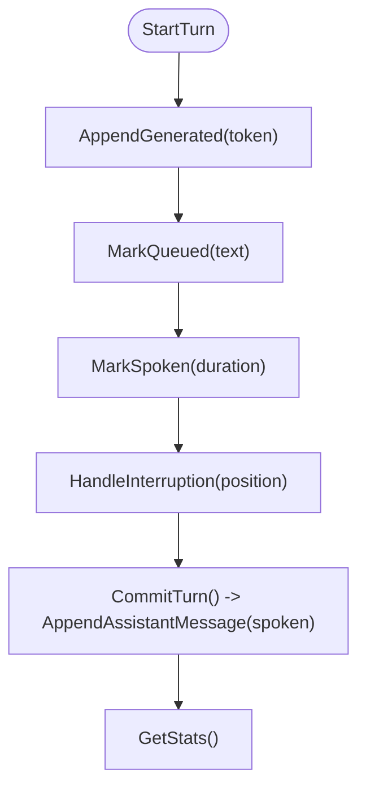
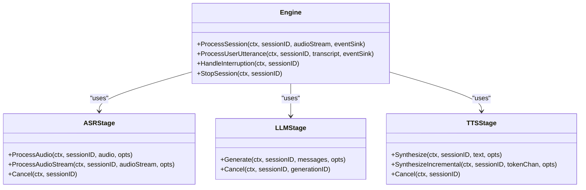
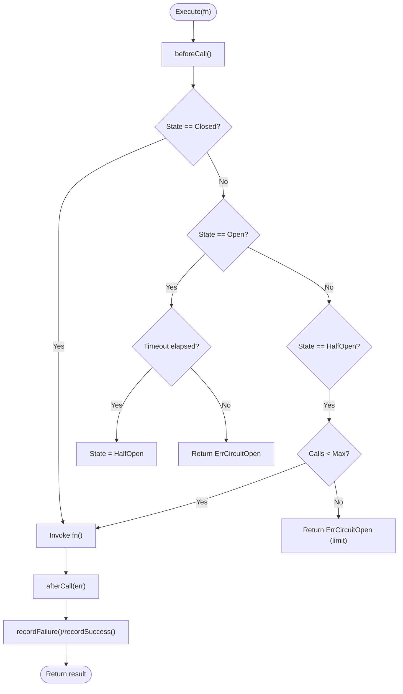
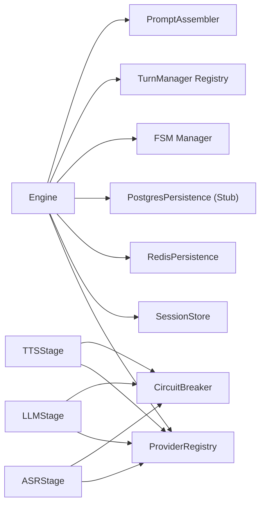

# Orchestrator Service

<cite>
**Referenced Files in This Document**
- [engine.go](file://go/orchestrator/internal/pipeline/engine.go)
- [fsm.go](file://go/orchestrator/internal/statemachine/fsm.go)
- [turn_manager.go](file://go/orchestrator/internal/statemachine/turn_manager.go)
- [asr_stage.go](file://go/orchestrator/internal/pipeline/asr_stage.go)
- [llm_stage.go](file://go/orchestrator/internal/pipeline/llm_stage.go)
- [tts_stage.go](file://go/orchestrator/internal/pipeline/tts_stage.go)
- [prompt.go](file://go/orchestrator/internal/pipeline/prompt.go)
- [circuit_breaker.go](file://go/orchestrator/internal/pipeline/circuit_breaker.go)
- [postgres.go](file://go/orchestrator/internal/persistence/postgres.go)
- [main.go](file://go/orchestrator/cmd/main.go)
- [state.go](file://go/pkg/session/state.go)
- [session.go](file://go/pkg/session/session.go)
- [history.go](file://go/pkg/session/history.go)
- [event.go](file://go/pkg/events/event.go)
- [registry.go](file://go/pkg/providers/registry.go)
</cite>

## Table of Contents
1. [Introduction](#introduction)
2. [Project Structure](#project-structure)
3. [Core Components](#core-components)
4. [Architecture Overview](#architecture-overview)
5. [Detailed Component Analysis](#detailed-component-analysis)
6. [Dependency Analysis](#dependency-analysis)
7. [Performance Considerations](#performance-considerations)
8. [Troubleshooting Guide](#troubleshooting-guide)
9. [Conclusion](#conclusion)
10. [Appendices](#appendices)

## Introduction
The Orchestrator service is the central coordinator for voice conversations, owning the session state machine and orchestrating the ASR → LLM → TTS pipeline. It manages conversation flow, turn management, interruptions, provider resilience via circuit breakers, and event-driven communication. The service maintains session state, coordinates provider stages, and ensures robustness and observability across the AI pipeline.

## Project Structure
The Orchestrator service is organized around:
- Pipeline stages (ASR, LLM, TTS) with circuit breaker integration
- Finite state machine for session flow control
- Turn manager for assistant turn lifecycle and interruption handling
- Prompt assembly for LLM context windows
- Persistence stubs for transcripts and events
- Provider registry for dynamic provider selection and resolution
- Session management and history
- Event types for WebSocket communication

**Diagram sources**
- [engine.go:17-106](file://go/orchestrator/internal/pipeline/engine.go#L17-L106)
- [fsm.go:44-92](file://go/orchestrator/internal/statemachine/fsm.go#L44-L92)
- [turn_manager.go:11-25](file://go/orchestrator/internal/statemachine/turn_manager.go#L11-L25)
- [prompt.go:8-21](file://go/orchestrator/internal/pipeline/prompt.go#L8-L21)
- [circuit_breaker.go:207-234](file://go/orchestrator/internal/pipeline/circuit_breaker.go#L207-L234)
- [asr_stage.go:25-44](file://go/orchestrator/internal/pipeline/asr_stage.go#L25-L44)
- [llm_stage.go:33-55](file://go/orchestrator/internal/pipeline/llm_stage.go#L33-L55)
- [tts_stage.go:16-39](file://go/orchestrator/internal/pipeline/tts_stage.go#L16-L39)
- [registry.go:14-40](file://go/pkg/providers/registry.go#L14-L40)
- [history.go:11-28](file://go/pkg/session/history.go#L11-L28)
- [postgres.go:13-30](file://go/orchestrator/internal/persistence/postgres.go#L13-L30)
- [event.go:11-35](file://go/pkg/events/event.go#L11-L35)

**Section sources**
- [engine.go:17-106](file://go/orchestrator/internal/pipeline/engine.go#L17-L106)
- [main.go:26-120](file://go/orchestrator/cmd/main.go#L26-L120)

## Core Components
- Engine: Central orchestrator managing session lifecycle, pipeline stages, FSM, turn manager, prompt assembly, and event emission.
- Pipeline Stages: ASR, LLM, and TTS stages wrap providers with circuit breaker protection, metrics, and cancellation support.
- Finite State Machine: Enforces valid session state transitions and emits turn events.
- Turn Manager: Tracks assistant turns, interruption handling, and commit-to-history semantics.
- Prompt Assembler: Builds LLM prompts respecting system prompts and context window limits.
- Circuit Breaker: Provides resilience against provider failures with tripping and recovery.
- Provider Registry: Resolves providers per session with tenant/global overrides.
- Session & History: Manages runtime state, conversation history, and thread-safe operations.
- Events: Defines WebSocket event types for client-server communication.

**Section sources**
- [engine.go:17-106](file://go/orchestrator/internal/pipeline/engine.go#L17-L106)
- [asr_stage.go:25-44](file://go/orchestrator/internal/pipeline/asr_stage.go#L25-L44)
- [llm_stage.go:33-55](file://go/orchestrator/internal/pipeline/llm_stage.go#L33-L55)
- [tts_stage.go:16-39](file://go/orchestrator/internal/pipeline/tts_stage.go#L16-L39)
- [fsm.go:44-92](file://go/orchestrator/internal/statemachine/fsm.go#L44-L92)
- [turn_manager.go:11-25](file://go/orchestrator/internal/statemachine/turn_manager.go#L11-L25)
- [prompt.go:8-21](file://go/orchestrator/internal/pipeline/prompt.go#L8-L21)
- [circuit_breaker.go:207-234](file://go/orchestrator/internal/pipeline/circuit_breaker.go#L207-L234)
- [registry.go:14-40](file://go/pkg/providers/registry.go#L14-L40)
- [history.go:11-28](file://go/pkg/session/history.go#L11-L28)
- [event.go:11-35](file://go/pkg/events/event.go#L11-L35)

## Architecture Overview
The Orchestrator composes a streaming ASR → LLM → TTS pipeline with:
- Real-time ASR streaming with partial and final transcripts
- Concurrent LLM token streaming and incremental TTS synthesis
- Interruption handling that cancels active generations and syntheses
- Event-driven communication to clients via WebSocket event types
- Provider resilience via circuit breakers and cancellation contexts
- Session state machine enforcing valid conversation flow

**Diagram sources**
- [engine.go:108-208](file://go/orchestrator/internal/pipeline/engine.go#L108-L208)
- [engine.go:210-375](file://go/orchestrator/internal/pipeline/engine.go#L210-L375)
- [asr_stage.go:164-290](file://go/orchestrator/internal/pipeline/asr_stage.go#L164-L290)
- [llm_stage.go:58-185](file://go/orchestrator/internal/pipeline/llm_stage.go#L58-L185)
- [tts_stage.go:129-236](file://go/orchestrator/internal/pipeline/tts_stage.go#L129-L236)
- [fsm.go:101-161](file://go/orchestrator/internal/statemachine/fsm.go#L101-L161)
- [turn_manager.go:27-130](file://go/orchestrator/internal/statemachine/turn_manager.go#L27-L130)

## Detailed Component Analysis

### Engine: Pipeline Orchestration and Session Management
- Creates and manages per-session runtime context including FSM, turn manager, history, and timestamp tracking.
- Streams audio to ASR, emits ASR partial/final events, and triggers LLM generation upon final transcripts.
- Coordinates concurrent LLM token streaming and incremental TTS synthesis, emitting events for partial text and audio chunks.
- Handles interruptions by cancelling LLM/TTS, updating turn state, committing spoken text, and transitioning FSM.
- Stops sessions cleanly, removing FSM and turn manager entries and cleaning Redis.

**Diagram sources**
- [engine.go:108-208](file://go/orchestrator/internal/pipeline/engine.go#L108-L208)
- [engine.go:210-375](file://go/orchestrator/internal/pipeline/engine.go#L210-L375)

**Section sources**
- [engine.go:17-106](file://go/orchestrator/internal/pipeline/engine.go#L17-L106)
- [engine.go:108-208](file://go/orchestrator/internal/pipeline/engine.go#L108-L208)
- [engine.go:210-375](file://go/orchestrator/internal/pipeline/engine.go#L210-L375)
- [engine.go:377-436](file://go/orchestrator/internal/pipeline/engine.go#L377-L436)
- [engine.go:438-470](file://go/orchestrator/internal/pipeline/engine.go#L438-L470)

### Finite State Machine: Conversation Flow Control
- Defines valid transitions among idle, listening, processing, speaking, and interrupted states.
- Transitions are triggered by events such as speech start/end, ASR final, first TTS audio, interruption, and bot finished.
- Emits turn events and maintains state change handlers for observability.

**Diagram sources**
- [fsm.go:44-92](file://go/orchestrator/internal/statemachine/fsm.go#L44-L92)
- [fsm.go:163-200](file://go/orchestrator/internal/statemachine/fsm.go#L163-L200)

**Section sources**
- [fsm.go:44-92](file://go/orchestrator/internal/statemachine/fsm.go#L44-L92)
- [fsm.go:101-161](file://go/orchestrator/internal/statemachine/fsm.go#L101-L161)
- [fsm.go:163-200](file://go/orchestrator/internal/statemachine/fsm.go#L163-L200)
- [state.go:8-62](file://go/pkg/session/state.go#L8-L62)

### Turn Manager: Turn Lifecycle and Interruption Handling
- Manages assistant turns with generation ID, sample rate, and buffers for generated, queued, and spoken text.
- Supports marking text queued for TTS, advancing playout position, handling interruptions, and committing only spoken text to history.
- Provides statistics and thread-safe operations for turn introspection.

**Diagram sources**
- [turn_manager.go:27-130](file://go/orchestrator/internal/statemachine/turn_manager.go#L27-L130)
- [turn_manager.go:132-221](file://go/orchestrator/internal/statemachine/turn_manager.go#L132-L221)

**Section sources**
- [turn_manager.go:11-25](file://go/orchestrator/internal/statemachine/turn_manager.go#L11-L25)
- [turn_manager.go:27-130](file://go/orchestrator/internal/statemachine/turn_manager.go#L27-L130)
- [turn_manager.go:132-221](file://go/orchestrator/internal/statemachine/turn_manager.go#L132-L221)

### Pipeline Stages: Provider Coordination and Resilience
- ASR Stage: Streams audio to provider, emits partial and final transcripts, records latency, and supports cancellation.
- LLM Stage: Streams tokens, tracks generation IDs, records first-token latency, and supports cancellation.
- TTS Stage: Synthesizes audio from text, supports incremental synthesis with sentence boundary detection, and supports cancellation.
- All stages integrate circuit breakers and metrics collection.

**Diagram sources**
- [engine.go:108-208](file://go/orchestrator/internal/pipeline/engine.go#L108-L208)
- [asr_stage.go:47-162](file://go/orchestrator/internal/pipeline/asr_stage.go#L47-L162)
- [llm_stage.go:58-185](file://go/orchestrator/internal/pipeline/llm_stage.go#L58-L185)
- [tts_stage.go:41-127](file://go/orchestrator/internal/pipeline/tts_stage.go#L41-L127)

**Section sources**
- [asr_stage.go:25-44](file://go/orchestrator/internal/pipeline/asr_stage.go#L25-L44)
- [asr_stage.go:47-162](file://go/orchestrator/internal/pipeline/asr_stage.go#L47-L162)
- [asr_stage.go:164-290](file://go/orchestrator/internal/pipeline/asr_stage.go#L164-L290)
- [llm_stage.go:33-55](file://go/orchestrator/internal/pipeline/llm_stage.go#L33-L55)
- [llm_stage.go:58-185](file://go/orchestrator/internal/pipeline/llm_stage.go#L58-L185)
- [llm_stage.go:187-240](file://go/orchestrator/internal/pipeline/llm_stage.go#L187-L240)
- [tts_stage.go:16-39](file://go/orchestrator/internal/pipeline/tts_stage.go#L16-L39)
- [tts_stage.go:41-127](file://go/orchestrator/internal/pipeline/tts_stage.go#L41-L127)
- [tts_stage.go:129-236](file://go/orchestrator/internal/pipeline/tts_stage.go#L129-L236)

### Circuit Breaker Pattern: Provider Resilience
- Implements closed/open/half-open states with failure/success counters and timeouts.
- Integrates with pipeline stages to protect provider calls and surface meaningful errors.
- Provides registry-level management for multiple providers.

**Diagram sources**
- [circuit_breaker.go:80-121](file://go/orchestrator/internal/pipeline/circuit_breaker.go#L80-L121)
- [circuit_breaker.go:123-171](file://go/orchestrator/internal/pipeline/circuit_breaker.go#L123-L171)
- [circuit_breaker.go:207-234](file://go/orchestrator/internal/pipeline/circuit_breaker.go#L207-L234)

**Section sources**
- [circuit_breaker.go:12-36](file://go/orchestrator/internal/pipeline/circuit_breaker.go#L12-L36)
- [circuit_breaker.go:38-55](file://go/orchestrator/internal/pipeline/circuit_breaker.go#L38-L55)
- [circuit_breaker.go:80-121](file://go/orchestrator/internal/pipeline/circuit_breaker.go#L80-L121)
- [circuit_breaker.go:123-171](file://go/orchestrator/internal/pipeline/circuit_breaker.go#L123-L171)
- [circuit_breaker.go:207-234](file://go/orchestrator/internal/pipeline/circuit_breaker.go#L207-L234)

### Prompt Assembly: Context Window Management
- Assembles prompts from system prompt, conversation history, and current user utterance.
- Applies context window limits while preserving system messages and recent exchanges.
- Provides token estimation and trimming utilities.

**Section sources**
- [prompt.go:8-21](file://go/orchestrator/internal/pipeline/prompt.go#L8-L21)
- [prompt.go:23-60](file://go/orchestrator/internal/pipeline/prompt.go#L23-L60)
- [prompt.go:62-104](file://go/orchestrator/internal/pipeline/prompt.go#L62-L104)
- [prompt.go:106-142](file://go/orchestrator/internal/pipeline/prompt.go#L106-L142)
- [prompt.go:144-203](file://go/orchestrator/internal/pipeline/prompt.go#L144-L203)

### Provider Selection and Resolution
- ProviderRegistry resolves providers per session with priority: request overrides → session overrides → tenant overrides → global defaults.
- Validates provider availability before returning selections.
- Registers gRPC clients for ASR, LLM, and TTS during service startup.

**Section sources**
- [registry.go:14-40](file://go/pkg/providers/registry.go#L14-L40)
- [registry.go:172-251](file://go/pkg/providers/registry.go#L172-L251)
- [main.go:195-257](file://go/orchestrator/cmd/main.go#L195-L257)

### Session State and History
- Session encapsulates runtime state, provider selections, audio and voice profiles, and model options.
- ConversationHistory enforces that only spoken text is committed to history, preventing unspoken generated text from persisting.
- Thread-safe operations and trimming logic maintain bounded memory usage.

**Section sources**
- [session.go:62-84](file://go/pkg/session/session.go#L62-L84)
- [session.go:189-201](file://go/pkg/session/session.go#L189-L201)
- [history.go:11-28](file://go/pkg/session/history.go#L11-L28)
- [history.go:30-59](file://go/pkg/session/history.go#L30-L59)
- [history.go:157-198](file://go/pkg/session/history.go#L157-L198)

### Event-Driven Communication
- Defines WebSocket event types for client-server communication including session lifecycle, ASR/TTS events, turn events, interruptions, and errors.
- Engine emits events for ASR partial/final, LLM partial text, and TTS audio chunks.

**Section sources**
- [event.go:11-35](file://go/pkg/events/event.go#L11-L35)
- [engine.go:182-200](file://go/orchestrator/internal/pipeline/engine.go#L182-L200)
- [engine.go:308-314](file://go/orchestrator/internal/pipeline/engine.go#L308-L314)
- [engine.go:349-365](file://go/orchestrator/internal/pipeline/engine.go#L349-L365)

### Persistence Strategies
- PostgreSQL persistence is currently a stub with logging; schema definition included for future implementation.
- Redis persistence is integrated for session and event storage during service initialization.

**Section sources**
- [postgres.go:13-30](file://go/orchestrator/internal/persistence/postgres.go#L13-L30)
- [postgres.go:40-115](file://go/orchestrator/internal/persistence/postgres.go#L40-L115)
- [postgres.go:149-191](file://go/orchestrator/internal/persistence/postgres.go#L149-L191)
- [main.go:88-99](file://go/orchestrator/cmd/main.go#L88-L99)

## Dependency Analysis
The Orchestrator composes multiple subsystems with clear boundaries:
- Engine depends on ProviderRegistry, SessionStore, Redis/Postgres persistence, FSM/turn manager, and prompt assembler.
- Pipeline stages depend on providers and circuit breakers; they emit events and update turn state.
- FSM and Turn Manager are session-scoped and managed centrally by the Engine.
- ProviderRegistry resolves providers with layered overrides.

**Diagram sources**
- [engine.go:17-106](file://go/orchestrator/internal/pipeline/engine.go#L17-L106)
- [asr_stage.go:25-44](file://go/orchestrator/internal/pipeline/asr_stage.go#L25-L44)
- [llm_stage.go:33-55](file://go/orchestrator/internal/pipeline/llm_stage.go#L33-L55)
- [tts_stage.go:16-39](file://go/orchestrator/internal/pipeline/tts_stage.go#L16-L39)
- [circuit_breaker.go:207-234](file://go/orchestrator/internal/pipeline/circuit_breaker.go#L207-L234)
- [registry.go:14-40](file://go/pkg/providers/registry.go#L14-L40)

**Section sources**
- [engine.go:17-106](file://go/orchestrator/internal/pipeline/engine.go#L17-L106)
- [registry.go:172-251](file://go/pkg/providers/registry.go#L172-L251)

## Performance Considerations
- Concurrency: Engine processes LLM tokens and TTS audio concurrently to minimize latency and enable overlap between stages.
- Incremental TTS: Segments text at sentence boundaries to reduce perceived latency and improve responsiveness.
- Circuit Breakers: Protect providers from cascading failures and enable quick recovery.
- Metrics and Tracing: Latency metrics for ASR, LLM, and TTS are recorded to identify bottlenecks.
- Context Window: Prompt assembly trims older messages to control token usage and cost.
- Cancellation: Early termination of LLM and TTS prevents wasted compute on interrupted turns.

[No sources needed since this section provides general guidance]

## Troubleshooting Guide
Common issues and recovery mechanisms:
- Provider Failures: Circuit breaker trips on repeated failures; monitor state and stats to diagnose provider health.
- Interruption Handling: Verify that LLM/TTS cancellations occur and only spoken text is committed to history.
- Session Cleanup: Ensure StopSession removes FSM and turn manager entries and clears Redis.
- Event Delivery: Confirm event channels are not blocking; non-blocking sends prevent deadlocks.
- Provider Resolution: Validate provider availability before use; use registry resolution with tenant/global overrides.

**Section sources**
- [circuit_breaker.go:173-198](file://go/orchestrator/internal/pipeline/circuit_breaker.go#L173-L198)
- [engine.go:377-436](file://go/orchestrator/internal/pipeline/engine.go#L377-L436)
- [engine.go:438-470](file://go/orchestrator/internal/pipeline/engine.go#L438-L470)
- [fsm.go:150-159](file://go/orchestrator/internal/statemachine/fsm.go#L150-L159)
- [registry.go:233-251](file://go/pkg/providers/registry.go#L233-L251)

## Conclusion
The Orchestrator service provides a robust, event-driven framework for voice conversation orchestration. Its modular design integrates ASR, LLM, and TTS providers with strong resilience via circuit breakers, precise state control through a finite state machine, and careful turn management that supports interruptions. With clear separation of concerns, observability hooks, and extensible provider resolution, it scales to production-grade deployments while maintaining low-latency, responsive interactions.

## Appendices

### Example Execution Flows
- ASR Final to LLM Generation: On receiving an ASR final transcript, the Engine transitions FSM to processing, builds a prompt, starts LLM generation, and begins incremental TTS synthesis concurrently.
- Interruption Handling: On interruption, the Engine cancels active LLM/TTS, computes playout position, marks interruption in the turn, commits only spoken text, and transitions FSM back to listening.

**Section sources**
- [engine.go:210-375](file://go/orchestrator/internal/pipeline/engine.go#L210-L375)
- [engine.go:377-436](file://go/orchestrator/internal/pipeline/engine.go#L377-L436)

### Provider Selection Algorithm
- Priority order: request overrides → session overrides → tenant overrides → global defaults.
- Validation ensures selected providers exist before returning.

**Section sources**
- [registry.go:172-251](file://go/pkg/providers/registry.go#L172-L251)

### Dynamic Configuration Updates
- Global defaults and tenant overrides are set via ProviderRegistry configuration.
- During session creation, providers are resolved using the registry’s ResolveForSession method.

**Section sources**
- [registry.go:253-261](file://go/pkg/providers/registry.go#L253-L261)
- [registry.go:172-251](file://go/pkg/providers/registry.go#L172-L251)

### Performance Optimization Techniques
- Overlap LLM and TTS processing to hide latency.
- Use incremental TTS segmentation to deliver early audio.
- Monitor circuit breaker stats to proactively detect provider degradation.
- Trim conversation history and apply context window limits to control token usage.

**Section sources**
- [tts_stage.go:129-236](file://go/orchestrator/internal/pipeline/tts_stage.go#L129-L236)
- [prompt.go:106-142](file://go/orchestrator/internal/pipeline/prompt.go#L106-L142)
- [circuit_breaker.go:180-189](file://go/orchestrator/internal/pipeline/circuit_breaker.go#L180-L189)