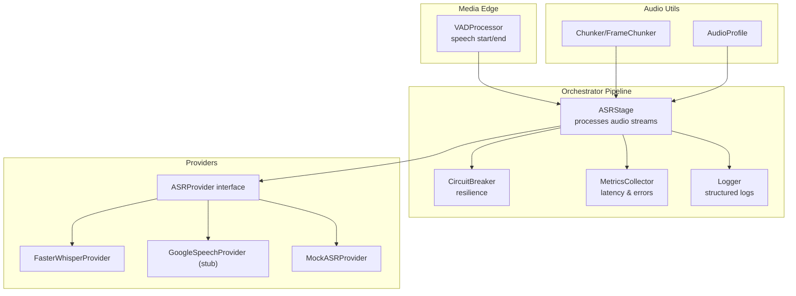
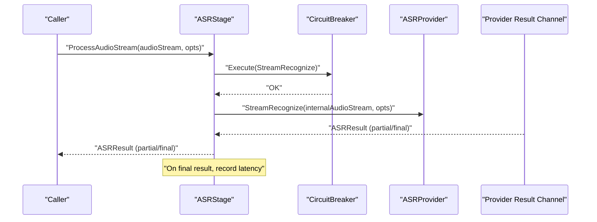
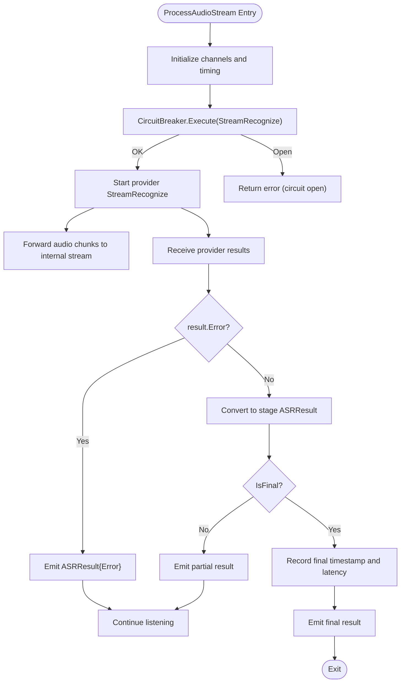
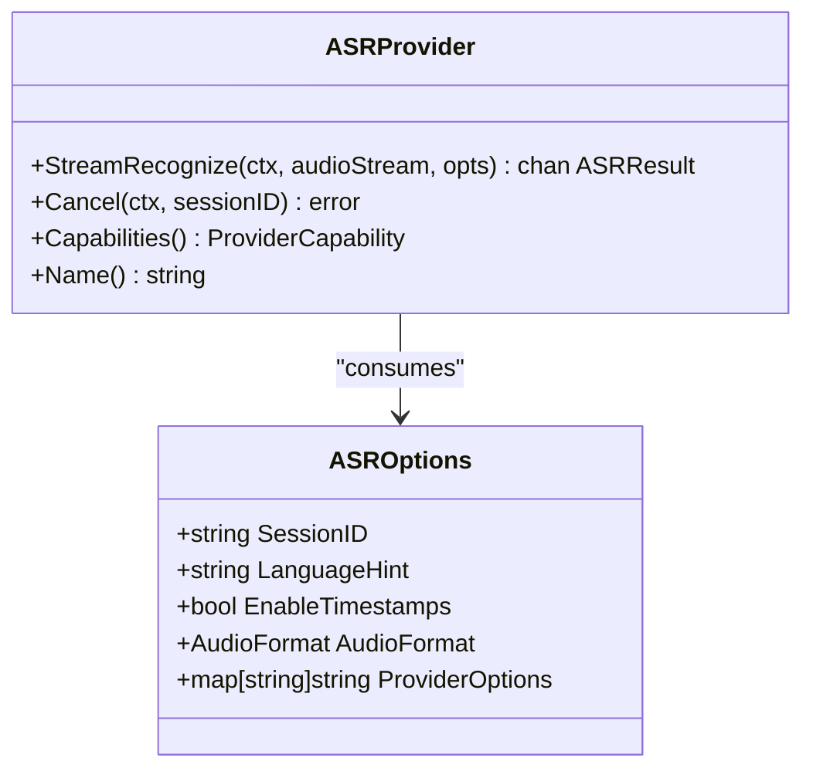
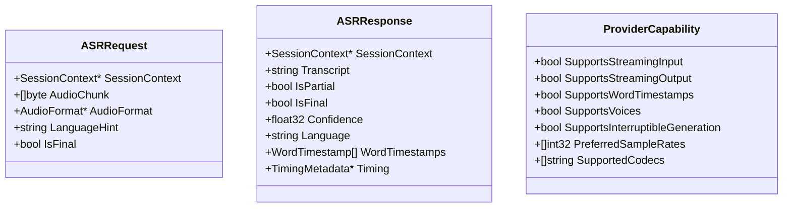
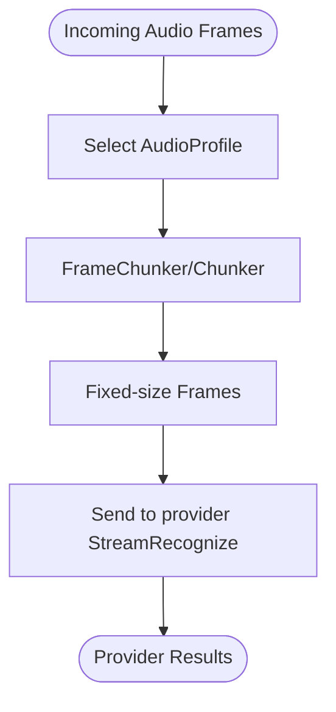
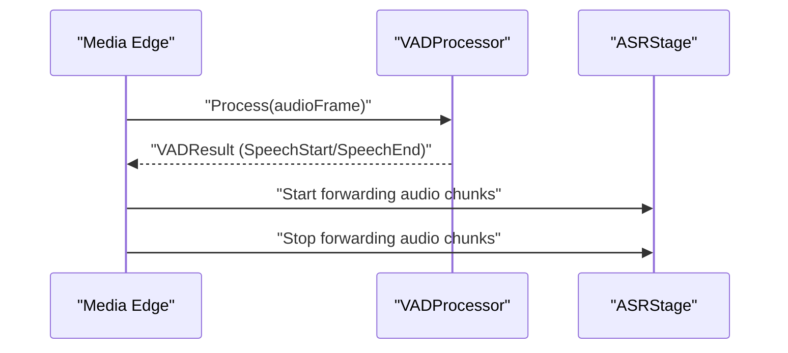
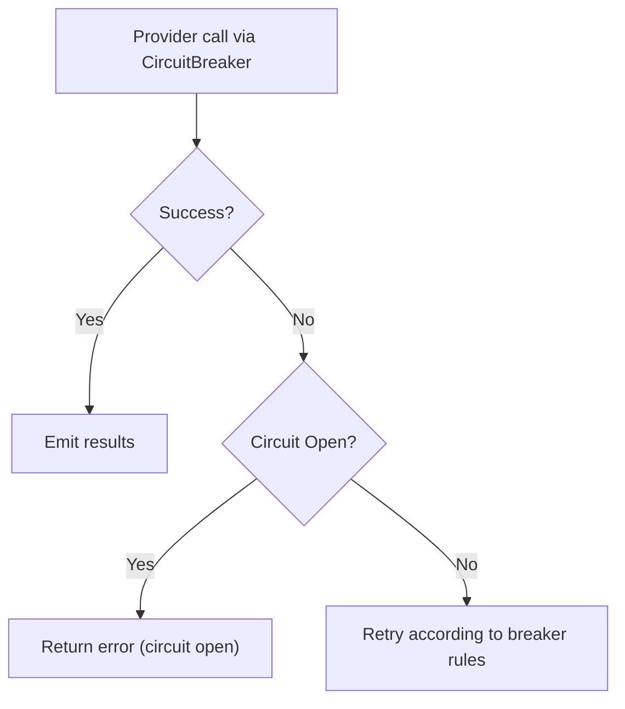
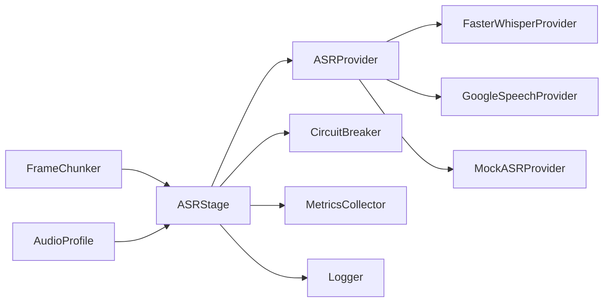

# ASR Stage

<cite>
**Referenced Files in This Document**
- [asr_stage.go](file://go/orchestrator/internal/pipeline/asr_stage.go)
- [interfaces.go](file://go/pkg/providers/interfaces.go)
- [options.go](file://go/pkg/providers/options.go)
- [asr.go](file://go/pkg/contracts/asr.go)
- [common.go](file://go/pkg/contracts/common.go)
- [circuit_breaker.go](file://go/orchestrator/internal/pipeline/circuit_breaker.go)
- [metrics.go](file://go/pkg/observability/metrics.go)
- [logger.go](file://go/pkg/observability/logger.go)
- [chunk.go](file://go/pkg/audio/chunk.go)
- [format.go](file://go/pkg/audio/format.go)
- [vad.go](file://go/media-edge/internal/vad/vad.go)
- [faster_whisper.py](file://py/provider_gateway/app/providers/asr/faster_whisper.py)
- [google_speech.py](file://py/provider_gateway/app/providers/asr/google_speech.py)
- [mock_asr.py](file://py/provider_gateway/app/providers/asr/mock_asr.py)
</cite>

## Table of Contents
1. [Introduction](#introduction)
2. [Project Structure](#project-structure)
3. [Core Components](#core-components)
4. [Architecture Overview](#architecture-overview)
5. [Detailed Component Analysis](#detailed-component-analysis)
6. [Dependency Analysis](#dependency-analysis)
7. [Performance Considerations](#performance-considerations)
8. [Troubleshooting Guide](#troubleshooting-guide)
9. [Conclusion](#conclusion)

## Introduction
This document explains the ASR Stage component responsible for automatic speech recognition in the system. It covers the streaming audio processing workflow, partial versus final transcript handling, VAD integration, provider interface and configuration, error handling, and resilience via the circuit breaker pattern. It also provides concrete examples of result processing and guidance for performance and memory management.

## Project Structure
The ASR Stage lives in the orchestrator pipeline and interacts with provider interfaces, observability utilities, and audio processing helpers. Providers are implemented in the Python provider gateway.

**Diagram sources**
- [asr_stage.go:25-313](file://go/orchestrator/internal/pipeline/asr_stage.go#L25-L313)
- [circuit_breaker.go:57-178](file://go/orchestrator/internal/pipeline/circuit_breaker.go#L57-L178)
- [interfaces.go:21-35](file://go/pkg/providers/interfaces.go#L21-L35)
- [faster_whisper.py:15-103](file://py/provider_gateway/app/providers/asr/faster_whisper.py#L15-L103)
- [google_speech.py:15-57](file://py/provider_gateway/app/providers/asr/google_speech.py#L15-L57)
- [mock_asr.py:16-77](file://py/provider_gateway/app/providers/asr/mock_asr.py#L16-L77)
- [vad.go:305-373](file://go/media-edge/internal/vad/vad.go#L305-L373)
- [chunk.go:7-230](file://go/pkg/audio/chunk.go#L7-L230)
- [format.go:11-140](file://go/pkg/audio/format.go#L11-L140)

**Section sources**
- [asr_stage.go:1-313](file://go/orchestrator/internal/pipeline/asr_stage.go#L1-L313)
- [interfaces.go:1-107](file://go/pkg/providers/interfaces.go#L1-L107)
- [options.go:7-54](file://go/pkg/providers/options.go#L7-L54)
- [asr.go:3-29](file://go/pkg/contracts/asr.go#L3-L29)
- [common.go:97-139](file://go/pkg/contracts/common.go#L97-L139)
- [circuit_breaker.go:1-257](file://go/orchestrator/internal/pipeline/circuit_breaker.go#L1-L257)
- [metrics.go:1-214](file://go/pkg/observability/metrics.go#L1-L214)
- [logger.go:1-168](file://go/pkg/observability/logger.go#L1-L168)
- [chunk.go:1-230](file://go/pkg/audio/chunk.go#L1-L230)
- [format.go:1-140](file://go/pkg/audio/format.go#L1-L140)
- [vad.go:1-373](file://go/media-edge/internal/vad/vad.go#L1-L373)

## Core Components
- ASRStage: Wraps an ASRProvider with circuit breaker, metrics, and logging. Exposes ProcessAudio and ProcessAudioStream for synchronous and streaming recognition respectively.
- ASRProvider interface: Defines StreamRecognize, Cancel, Capabilities, and Name for ASR providers.
- ASROptions: Configuration for ASR recognition including language hints, timestamps, audio format, and provider-specific options.
- Contracts: ASRRequest/ASRResponse and related types define the internal data model for transcripts, timestamps, and timing metadata.
- CircuitBreaker: Implements the circuit breaker pattern to protect provider calls and enable graceful degradation.
- Observability: MetricsCollector and Logger provide latency histograms, error counters, and structured logging.
- Audio utilities: Chunker/FrameChunker and AudioProfile support chunking and canonical format handling.
- VAD: VADProcessor detects speech start/end to integrate with media edge streaming.

**Section sources**
- [asr_stage.go:14-313](file://go/orchestrator/internal/pipeline/asr_stage.go#L14-L313)
- [interfaces.go:10-35](file://go/pkg/providers/interfaces.go#L10-L35)
- [options.go:7-54](file://go/pkg/providers/options.go#L7-L54)
- [asr.go:3-29](file://go/pkg/contracts/asr.go#L3-L29)
- [common.go:97-139](file://go/pkg/contracts/common.go#L97-L139)
- [circuit_breaker.go:57-178](file://go/orchestrator/internal/pipeline/circuit_breaker.go#L57-L178)
- [metrics.go:99-172](file://go/pkg/observability/metrics.go#L99-L172)
- [logger.go:13-133](file://go/pkg/observability/logger.go#L13-L133)
- [chunk.go:7-230](file://go/pkg/audio/chunk.go#L7-L230)
- [format.go:11-140](file://go/pkg/audio/format.go#L11-L140)
- [vad.go:305-373](file://go/media-edge/internal/vad/vad.go#L305-L373)

## Architecture Overview
The ASR Stage orchestrates streaming recognition with the following flow:
- Accepts either a single audio payload (ProcessAudio) or a continuous audio stream (ProcessAudioStream).
- Starts a provider StreamRecognize call protected by a CircuitBreaker.
- For streaming mode, forwards incoming audio chunks to the provider’s internal audio stream.
- Converts provider results to stage results, emitting partial transcripts as they arrive and final transcripts when complete.
- Records timing metadata and latency metrics upon finalization.
- Integrates with VAD to detect speech boundaries for media edge scenarios.

**Diagram sources**
- [asr_stage.go:164-290](file://go/orchestrator/internal/pipeline/asr_stage.go#L164-L290)
- [circuit_breaker.go:80-90](file://go/orchestrator/internal/pipeline/circuit_breaker.go#L80-L90)
- [interfaces.go:22-25](file://go/pkg/providers/interfaces.go#L22-L25)

## Detailed Component Analysis

### ASRStage: Streaming Recognition and Result Handling
- ProcessAudio: Sends a single audio payload to the provider and returns a channel of results. Emits partial transcripts as they arrive and stops on the first final transcript.
- ProcessAudioStream: For continuous audio streams, forwards chunks from the input channel to the provider’s internal audio stream, preserving order and emitting results as they arrive.
- Result conversion: Translates provider ASRResult into stage ASRResult, copying Transcript, IsPartial, IsFinal, Confidence, Language, and attaching timing metadata.
- Timing and metrics: Records stage start, finalization, and latency via TimestampTracker and MetricsCollector.
- Cancellation: Delegates cancellation to the provider via Cancel.

**Diagram sources**
- [asr_stage.go:164-290](file://go/orchestrator/internal/pipeline/asr_stage.go#L164-L290)

**Section sources**
- [asr_stage.go:47-162](file://go/orchestrator/internal/pipeline/asr_stage.go#L47-L162)
- [asr_stage.go:164-290](file://go/orchestrator/internal/pipeline/asr_stage.go#L164-L290)

### ASR Provider Interface and Options
- ASRProvider: StreamRecognize returns a channel of ASRResult; Cancel cancels an ongoing session; Capabilities and Name expose provider metadata.
- ASROptions: Includes SessionID, LanguageHint, EnableTimestamps, AudioFormat, and ProviderOptions for provider-specific tuning.

**Diagram sources**
- [interfaces.go:21-35](file://go/pkg/providers/interfaces.go#L21-L35)
- [options.go:7-54](file://go/pkg/providers/options.go#L7-L54)

**Section sources**
- [interfaces.go:21-35](file://go/pkg/providers/interfaces.go#L21-L35)
- [options.go:7-54](file://go/pkg/providers/options.go#L7-L54)

### Contracts and Data Models
- ASRRequest/ASRResponse define the internal representation of audio chunks, transcripts, partial/final flags, confidence, language, word timestamps, and timing metadata.
- ProviderCapability describes streaming support, word timestamps, voices, interruptibility, and preferred sample rates/codecs.

**Diagram sources**
- [asr.go:3-29](file://go/pkg/contracts/asr.go#L3-L29)
- [common.go:130-139](file://go/pkg/contracts/common.go#L130-L139)

**Section sources**
- [asr.go:3-29](file://go/pkg/contracts/asr.go#L3-L29)
- [common.go:130-139](file://go/pkg/contracts/common.go#L130-L139)

### Streaming Audio Processing Workflow
- Chunking and buffering: Audio frames are chunked using FrameChunker/Chunker to align with the provider’s expected frame size.
- Format conversion: AudioProfile defines canonical and standard profiles (e.g., 16 kHz mono PCM16). Use BytesPerFrame and conversions to maintain compatibility.
- Provider-specific optimizations: Providers advertise PreferredSampleRates and SupportedCodecs via Capabilities; choose the optimal format to minimize conversion overhead.

**Diagram sources**
- [chunk.go:192-230](file://go/pkg/audio/chunk.go#L192-L230)
- [format.go:11-140](file://go/pkg/audio/format.go#L11-L140)
- [interfaces.go:30-35](file://go/pkg/providers/interfaces.go#L30-L35)

**Section sources**
- [chunk.go:7-230](file://go/pkg/audio/chunk.go#L7-L230)
- [format.go:11-140](file://go/pkg/audio/format.go#L11-L140)
- [interfaces.go:30-35](file://go/pkg/providers/interfaces.go#L30-L35)

### VAD Integration for Real-Time Audio
- VADProcessor detects speech start and end transitions, enabling media edge services to gate audio streaming into the ASR stage.
- Typical flow: VADProcessor invokes callbacks on speech start/end; the media edge starts/stops forwarding audio chunks accordingly.

**Diagram sources**
- [vad.go:305-373](file://go/media-edge/internal/vad/vad.go#L305-L373)
- [asr_stage.go:164-290](file://go/orchestrator/internal/pipeline/asr_stage.go#L164-L290)

**Section sources**
- [vad.go:305-373](file://go/media-edge/internal/vad/vad.go#L305-L373)
- [asr_stage.go:164-290](file://go/orchestrator/internal/pipeline/asr_stage.go#L164-L290)

### Provider Implementations and Examples
- FasterWhisperProvider: Uses faster-whisper for transcription, yields partial results and a final result with word timestamps; supports cancellation.
- GoogleSpeechProvider: Stub that advertises capabilities and raises a clear error indicating missing credentials.
- MockASRProvider: Deterministic partial transcripts followed by a final transcript; useful for testing and development.

Concrete examples of result processing:
- Partial transcript emission: The stage forwards provider ASRResult with IsPartial=true as-is to the caller.
- Final transcript triggering: On IsFinal=true, the stage records finalization timing and latency, then exits the result loop.

**Section sources**
- [faster_whisper.py:104-218](file://py/provider_gateway/app/providers/asr/faster_whisper.py#L104-L218)
- [google_speech.py:59-99](file://py/provider_gateway/app/providers/asr/google_speech.py#L59-L99)
- [mock_asr.py:79-164](file://py/provider_gateway/app/providers/asr/mock_asr.py#L79-L164)
- [asr_stage.go:130-156](file://go/orchestrator/internal/pipeline/asr_stage.go#L130-L156)

### Error Handling and Resilience
- Circuit breaker: Protects provider calls. If open, returns ErrCircuitOpen; otherwise executes the call and updates state based on success/failure.
- Provider errors: When a provider result carries an Error, the stage emits ASRResult{Error} and continues listening for further results.
- Metrics: Records ASR requests, durations, and errors; latency histogram is recorded on finalization.
- Logging: Structured logs with session_id and trace_id for observability.

**Diagram sources**
- [circuit_breaker.go:80-121](file://go/orchestrator/internal/pipeline/circuit_breaker.go#L80-L121)
- [asr_stage.go:72-92](file://go/orchestrator/internal/pipeline/asr_stage.go#L72-L92)
- [metrics.go:159-172](file://go/pkg/observability/metrics.go#L159-L172)
- [logger.go:85-133](file://go/pkg/observability/logger.go#L85-L133)

**Section sources**
- [circuit_breaker.go:57-178](file://go/orchestrator/internal/pipeline/circuit_breaker.go#L57-L178)
- [asr_stage.go:72-92](file://go/orchestrator/internal/pipeline/asr_stage.go#L72-L92)
- [metrics.go:159-172](file://go/pkg/observability/metrics.go#L159-L172)
- [logger.go:85-133](file://go/pkg/observability/logger.go#L85-L133)

## Dependency Analysis
- ASRStage depends on:
  - ASRProvider interface for streaming recognition
  - CircuitBreakerRegistry for provider-scoped resilience
  - MetricsCollector for latency and error metrics
  - Logger for structured logging
  - TimestampTracker for timing metadata
- Providers implement ASRProvider and declare capabilities via ProviderCapability.
- Audio utilities depend on contracts.AudioFormat for interoperability.

**Diagram sources**
- [asr_stage.go:25-44](file://go/orchestrator/internal/pipeline/asr_stage.go#L25-L44)
- [interfaces.go:21-35](file://go/pkg/providers/interfaces.go#L21-L35)
- [faster_whisper.py:15-103](file://py/provider_gateway/app/providers/asr/faster_whisper.py#L15-L103)
- [google_speech.py:15-57](file://py/provider_gateway/app/providers/asr/google_speech.py#L15-L57)
- [mock_asr.py:16-77](file://py/provider_gateway/app/providers/asr/mock_asr.py#L16-L77)
- [chunk.go:192-230](file://go/pkg/audio/chunk.go#L192-L230)
- [format.go:11-140](file://go/pkg/audio/format.go#L11-L140)

**Section sources**
- [asr_stage.go:25-44](file://go/orchestrator/internal/pipeline/asr_stage.go#L25-L44)
- [interfaces.go:21-35](file://go/pkg/providers/interfaces.go#L21-L35)
- [chunk.go:192-230](file://go/pkg/audio/chunk.go#L192-L230)
- [format.go:11-140](file://go/pkg/audio/format.go#L11-L140)

## Performance Considerations
- Channel sizing: The stage uses buffered channels (size 10) for audio and results to smooth bursts; tune based on expected throughput and latency targets.
- Memory management:
  - Prefer streaming (ProcessAudioStream) to avoid large in-memory audio accumulation.
  - Use FrameChunker/Chunker to process audio incrementally and reduce allocations.
  - Ensure providers operate on canonical format (e.g., 16 kHz mono PCM16) to minimize conversion overhead.
- Latency:
  - Record and observe ASR latency histograms to track tail latencies.
  - Minimize context switching by keeping result processing goroutines lightweight.
- Throughput:
  - Match provider PreferredSampleRates and SupportedCodecs to incoming audio to avoid resampling and codec conversions.
  - Use VAD gating to reduce unnecessary ASR work during silence.

[No sources needed since this section provides general guidance]

## Troubleshooting Guide
- Circuit breaker open: When ErrCircuitOpen occurs, the stage returns an error and logs the event. Investigate upstream provider health and adjust thresholds.
- Provider errors: Errors from providers are emitted as ASRResult{Error}. Inspect logs and metrics for patterns (rate limiting, timeouts, unsupported formats).
- No final transcript: Verify provider capabilities and ensure the provider emits IsFinal=true. Check VAD gating to ensure speech segments are forwarded.
- Latency spikes: Review ASR latency histograms and provider request duration metrics. Consider adjusting chunk sizes or provider selection.

**Section sources**
- [circuit_breaker.go:77-121](file://go/orchestrator/internal/pipeline/circuit_breaker.go#L77-L121)
- [asr_stage.go:120-128](file://go/orchestrator/internal/pipeline/asr_stage.go#L120-L128)
- [metrics.go:99-137](file://go/pkg/observability/metrics.go#L99-L137)
- [logger.go:85-133](file://go/pkg/observability/logger.go#L85-L133)

## Conclusion
The ASR Stage provides a robust, observable, and resilient streaming recognition pipeline. By integrating VAD for speech gating, leveraging the circuit breaker for provider resilience, and exposing a clean ASRProvider interface, it supports real-time audio processing with partial and final transcript handling. Proper configuration of ASROptions, alignment with provider capabilities, and careful attention to chunking and format conversion are key to achieving low-latency, high-throughput performance.