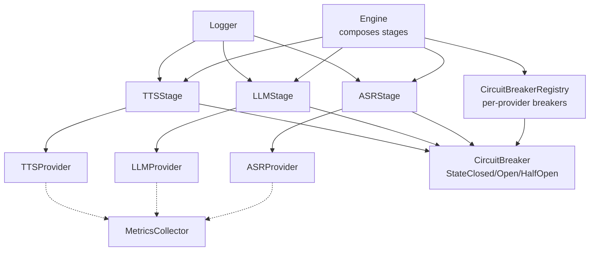
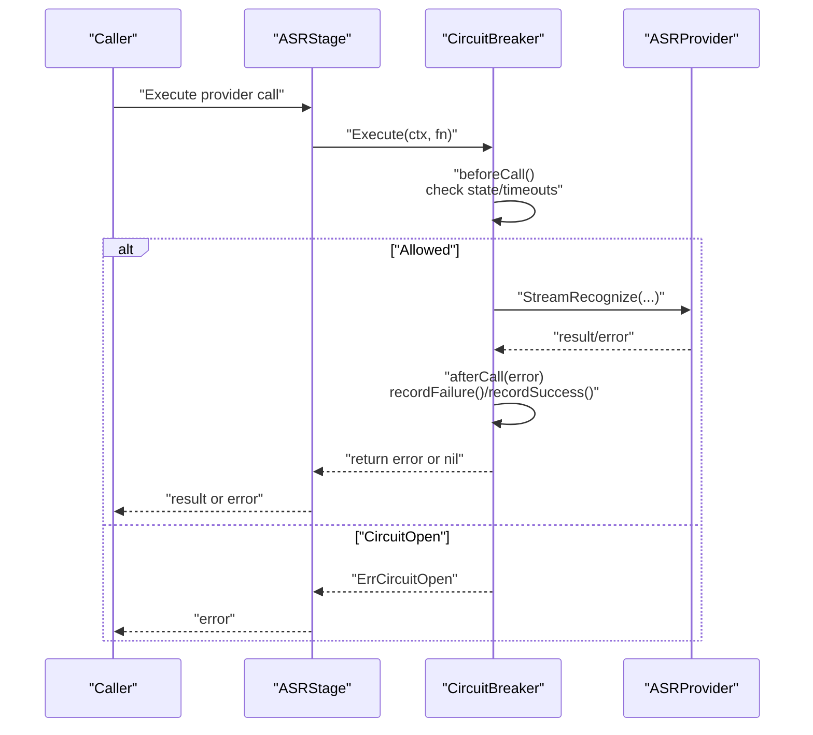
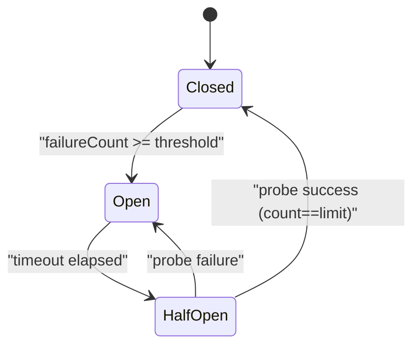
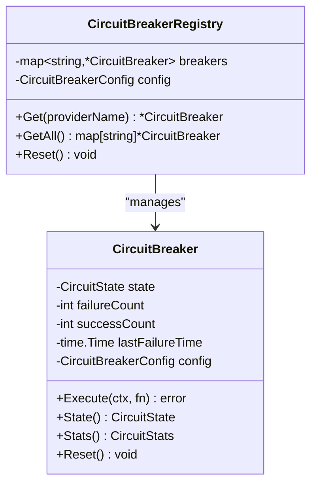
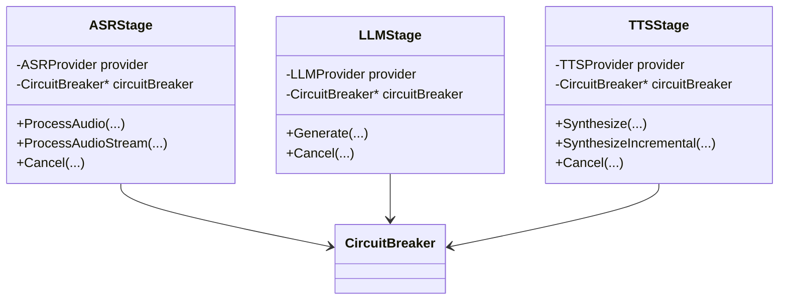
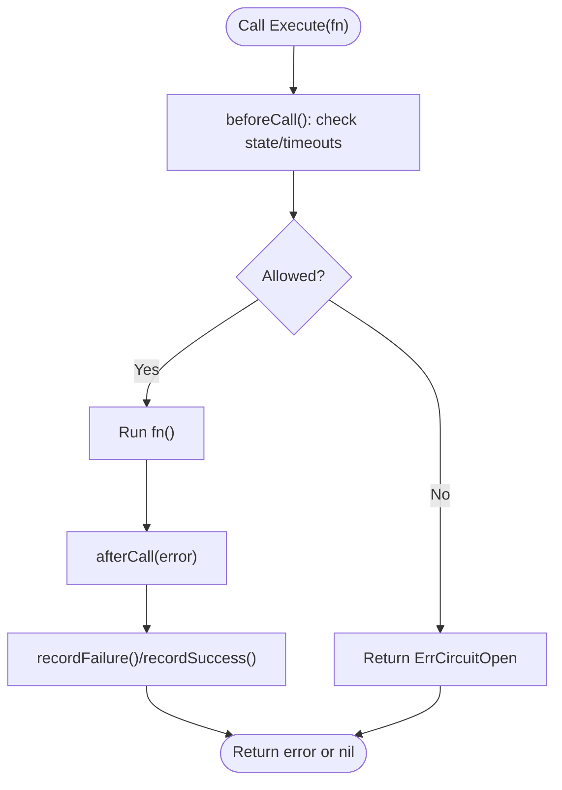
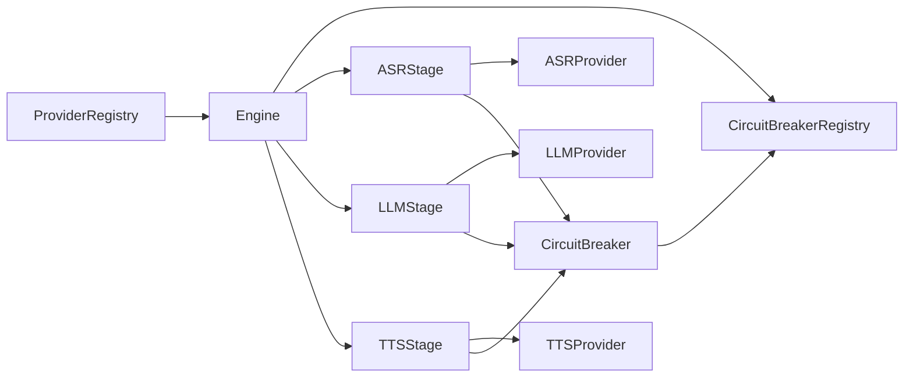

# Circuit Breaker Pattern

<cite>
**Referenced Files in This Document**
- [circuit_breaker.go](file://go/orchestrator/internal/pipeline/circuit_breaker.go)
- [circuit_breaker_test.go](file://go/orchestrator/internal/pipeline/circuit_breaker_test.go)
- [engine.go](file://go/orchestrator/internal/pipeline/engine.go)
- [asr_stage.go](file://go/orchestrator/internal/pipeline/asr_stage.go)
- [llm_stage.go](file://go/orchestrator/internal/pipeline/llm_stage.go)
- [tts_stage.go](file://go/orchestrator/internal/pipeline/tts_stage.go)
- [metrics.go](file://go/pkg/observability/metrics.go)
- [logger.go](file://go/pkg/observability/logger.go)
- [tracing.go](file://go/pkg/observability/tracing.go)
- [interfaces.go](file://go/pkg/providers/interfaces.go)
- [registry.go](file://go/pkg/providers/registry.go)
- [provider.go](file://go/pkg/contracts/provider.go)
- [asr_servicer.py](file://py/provider_gateway/app/grpc_api/asr_servicer.py)
- [llm_servicer.py](file://py/provider_gateway/app/grpc_api/llm_servicer.py)
- [tts_servicer.py](file://py/provider_gateway/app/grpc_api/tts_servicer.py)
</cite>

## Table of Contents
1. [Introduction](#introduction)
2. [Project Structure](#project-structure)
3. [Core Components](#core-components)
4. [Architecture Overview](#architecture-overview)
5. [Detailed Component Analysis](#detailed-component-analysis)
6. [Dependency Analysis](#dependency-analysis)
7. [Performance Considerations](#performance-considerations)
8. [Troubleshooting Guide](#troubleshooting-guide)
9. [Conclusion](#conclusion)
10. [Appendices](#appendices)

## Introduction
This document explains the Circuit Breaker Pattern implementation used to improve provider resilience across ASR, LLM, and TTS stages. It covers state management (closed, open, half-open), failure detection, automatic recovery, and the CircuitBreakerRegistry that manages per-provider breakers. It also documents configuration knobs, integration points, fallback and graceful degradation strategies, performance characteristics, and observability hooks.

## Project Structure
The circuit breaker lives in the orchestrator pipeline and is wired into each stage (ASR, LLM, TTS). The Engine composes stages and injects a shared CircuitBreakerRegistry. Providers are defined in Go interfaces and resolved via a ProviderRegistry. Observability is implemented with metrics, logs, and tracing.

**Diagram sources**
- [engine.go:83-105](file://go/orchestrator/internal/pipeline/engine.go#L83-L105)
- [circuit_breaker.go:207-256](file://go/orchestrator/internal/pipeline/circuit_breaker.go#L207-L256)
- [asr_stage.go:33-44](file://go/orchestrator/internal/pipeline/asr_stage.go#L33-L44)
- [llm_stage.go:44-55](file://go/orchestrator/internal/pipeline/llm_stage.go#L44-L55)
- [tts_stage.go:27-38](file://go/orchestrator/internal/pipeline/tts_stage.go#L27-L38)
- [metrics.go:149-202](file://go/pkg/observability/metrics.go#L149-L202)

**Section sources**
- [engine.go:83-105](file://go/orchestrator/internal/pipeline/engine.go#L83-L105)
- [circuit_breaker.go:207-256](file://go/orchestrator/internal/pipeline/circuit_breaker.go#L207-L256)

## Core Components
- CircuitBreaker: Encapsulates state, counters, and thresholds; exposes Execute to wrap provider calls and update state.
- CircuitBreakerConfig: Tunable parameters for failure threshold, timeout, and half-open call limits.
- CircuitBreakerRegistry: Manages a map of provider name to CircuitBreaker, sharing state across concurrent calls.
- Stage wrappers (ASRStage, LLMStage, TTSStage): Each stage holds a CircuitBreaker and a provider, invoking Execute around provider calls, recording metrics, and logging outcomes.
- Engine: Creates the registry and wires it into each stage during initialization.

Key behaviors:
- Execute(fn) checks pre-call conditions (state and timeouts), runs the function, then updates state post-call.
- State transitions:
  - Closed: normal operation; failures increment failureCount; reaching threshold moves to Open.
  - Open: reject calls immediately until timeout elapses; then move to HalfOpen.
  - HalfOpen: allow limited probe calls; success moves to Closed, failure moves back to Open.
- Stats expose current state and counts for diagnostics.

**Section sources**
- [circuit_breaker.go:12-171](file://go/orchestrator/internal/pipeline/circuit_breaker.go#L12-L171)
- [circuit_breaker.go:38-55](file://go/orchestrator/internal/pipeline/circuit_breaker.go#L38-L55)
- [circuit_breaker.go:207-256](file://go/orchestrator/internal/pipeline/circuit_breaker.go#L207-L256)
- [engine.go:41-57](file://go/orchestrator/internal/pipeline/engine.go#L41-L57)

## Architecture Overview
The pipeline stages wrap provider calls with circuit breaker protection. On failure, the breaker increments failureCount and may open the circuit. On success, it resets counters or transitions to Closed. During Open, subsequent calls fail fast. After timeout, a probe call attempts HalfOpen; success restores Closed, failure reopens.

**Diagram sources**
- [asr_stage.go:72-92](file://go/orchestrator/internal/pipeline/asr_stage.go#L72-L92)
- [circuit_breaker.go:82-133](file://go/orchestrator/internal/pipeline/circuit_breaker.go#L82-L133)

**Section sources**
- [asr_stage.go:72-92](file://go/orchestrator/internal/pipeline/asr_stage.go#L72-L92)
- [circuit_breaker.go:92-171](file://go/orchestrator/internal/pipeline/circuit_breaker.go#L92-L171)

## Detailed Component Analysis

### CircuitBreaker State Machine
States and transitions:
- Closed: normal operation; failures increase failureCount; reaching threshold opens.
- Open: reject calls; after timeout move to HalfOpen.
- HalfOpen: allow limited probe calls; success → Closed; failure → Open.

**Diagram sources**
- [circuit_breaker.go:15-22](file://go/orchestrator/internal/pipeline/circuit_breaker.go#L15-L22)
- [circuit_breaker.go:135-171](file://go/orchestrator/internal/pipeline/circuit_breaker.go#L135-L171)

**Section sources**
- [circuit_breaker.go:15-22](file://go/orchestrator/internal/pipeline/circuit_breaker.go#L15-L22)
- [circuit_breaker.go:92-171](file://go/orchestrator/internal/pipeline/circuit_breaker.go#L92-L171)

### CircuitBreakerRegistry
- One breaker per provider name.
- Thread-safe access via mutex.
- Provides Get, GetAll, and Reset for bulk operations.

**Diagram sources**
- [circuit_breaker.go:207-256](file://go/orchestrator/internal/pipeline/circuit_breaker.go#L207-L256)

**Section sources**
- [circuit_breaker.go:207-256](file://go/orchestrator/internal/pipeline/circuit_breaker.go#L207-L256)

### Stage Integration (ASR, LLM, TTS)
Each stage:
- Holds a provider and a CircuitBreaker retrieved from the registry keyed by provider name.
- Wraps provider calls with Execute, records metrics, and logs outcomes.
- Propagates ErrCircuitOpen as a distinct error to callers.

**Diagram sources**
- [asr_stage.go:25-44](file://go/orchestrator/internal/pipeline/asr_stage.go#L25-L44)
- [llm_stage.go:33-55](file://go/orchestrator/internal/pipeline/llm_stage.go#L33-L55)
- [tts_stage.go:16-38](file://go/orchestrator/internal/pipeline/tts_stage.go#L16-L38)

**Section sources**
- [asr_stage.go:25-44](file://go/orchestrator/internal/pipeline/asr_stage.go#L25-L44)
- [llm_stage.go:33-55](file://go/orchestrator/internal/pipeline/llm_stage.go#L33-L55)
- [tts_stage.go:16-38](file://go/orchestrator/internal/pipeline/tts_stage.go#L16-L38)

### Failure Detection and Propagation
- Failure detection occurs inside afterCall: any non-nil error is treated as a failure; nil is treated as success.
- ErrCircuitOpen is returned when the circuit is open; stages log and propagate this error to callers.
- Provider errors are recorded via MetricsCollector and logged via Logger.

**Diagram sources**
- [circuit_breaker.go:82-133](file://go/orchestrator/internal/pipeline/circuit_breaker.go#L82-L133)

**Section sources**
- [circuit_breaker.go:82-133](file://go/orchestrator/internal/pipeline/circuit_breaker.go#L82-L133)
- [asr_stage.go:72-92](file://go/orchestrator/internal/pipeline/asr_stage.go#L72-L92)
- [llm_stage.go:97-119](file://go/orchestrator/internal/pipeline/llm_stage.go#L97-L119)
- [tts_stage.go:67-89](file://go/orchestrator/internal/pipeline/tts_stage.go#L67-L89)

### Automatic Recovery Mechanisms
- Timeout-driven transition from Open to HalfOpen.
- HalfOpenMaxCalls limits probe concurrency; success restores Closed; failure reopens.
- Success in Closed resets failureCount.

**Section sources**
- [circuit_breaker.go:92-171](file://go/orchestrator/internal/pipeline/circuit_breaker.go#L92-L171)

### Graceful Degradation Strategies
- When ErrCircuitOpen occurs, stages return an error and optionally emit partial results upstream (e.g., ASR partial transcripts) before failing fast.
- Interruption handling cancels active LLM/TTS work and resumes listening, minimizing user impact.

**Section sources**
- [asr_stage.go:108-161](file://go/orchestrator/internal/pipeline/asr_stage.go#L108-L161)
- [llm_stage.go:120-184](file://go/orchestrator/internal/pipeline/llm_stage.go#L120-L184)
- [tts_stage.go:90-127](file://go/orchestrator/internal/pipeline/tts_stage.go#L90-L127)
- [engine.go:377-436](file://go/orchestrator/internal/pipeline/engine.go#L377-L436)

### Provider Resolution and Registry Integration
- ProviderRegistry resolves providers by type and name; Engine uses it to select default providers and feed into stages.
- CircuitBreakerRegistry is keyed by provider.Name(), aligning breaker identity with provider identity.

**Section sources**
- [registry.go:31-40](file://go/pkg/providers/registry.go#L31-L40)
- [engine.go:87-89](file://go/orchestrator/internal/pipeline/engine.go#L87-L89)
- [asr_stage.go:41](file://go/orchestrator/internal/pipeline/asr_stage.go#L41)
- [llm_stage.go:52](file://go/orchestrator/internal/pipeline/llm_stage.go#L52)
- [tts_stage.go:35](file://go/orchestrator/internal/pipeline/tts_stage.go#L35)

## Dependency Analysis
- Engine depends on ProviderRegistry and constructs CircuitBreakerRegistry, then injects it into each stage.
- Stages depend on provider interfaces and MetricsCollector/Logger.
- CircuitBreakerRegistry depends on provider names to key breakers.

**Diagram sources**
- [engine.go:83-105](file://go/orchestrator/internal/pipeline/engine.go#L83-L105)
- [asr_stage.go:33-44](file://go/orchestrator/internal/pipeline/asr_stage.go#L33-L44)
- [llm_stage.go:44-55](file://go/orchestrator/internal/pipeline/llm_stage.go#L44-L55)
- [tts_stage.go:27-38](file://go/orchestrator/internal/pipeline/tts_stage.go#L27-L38)

**Section sources**
- [engine.go:83-105](file://go/orchestrator/internal/pipeline/engine.go#L83-L105)
- [registry.go:14-23](file://go/pkg/providers/registry.go#L14-L23)

## Performance Considerations
- Overhead: Each provider call adds a small synchronization cost (mutex-protected beforeCall/afterCall). The lock scope is minimal and short-lived.
- Memory: Each provider maintains a single CircuitBreaker instance with integer counters and a timestamp. Memory footprint scales linearly with number of providers.
- Throughput: HalfOpenMaxCalls bounds concurrent probe traffic; tune based on provider capacity to avoid overload.
- Metrics: MetricsCollector records per-provider request counts and durations; ensure label cardinality remains bounded (one breaker per provider).

Recommendations:
- Tune FailureThreshold and Timeout for provider SLAs; start with defaults and adjust via monitoring.
- Use HalfOpenMaxCalls to balance recovery speed and safety.
- Monitor provider_errors_total and provider_request_duration_ms to detect unhealthy providers early.

**Section sources**
- [metrics.go:149-202](file://go/pkg/observability/metrics.go#L149-L202)
- [circuit_breaker.go:38-55](file://go/orchestrator/internal/pipeline/circuit_breaker.go#L38-L55)

## Troubleshooting Guide
Common scenarios and diagnostics:
- Frequent ErrCircuitOpen:
  - Check provider_errors_total and provider_request_duration_ms for the affected provider.
  - Review stage logs for repeated provider errors.
- Open but not transitioning to HalfOpen:
  - Verify Timeout setting and elapsed time since last failure.
- HalfOpen probe failures:
  - Confirm HalfOpenMaxCalls is appropriate; reduce if probes overwhelm the provider.
- Diagnostics:
  - Use Stats() to inspect failureCount and successCount.
  - Use Reset() to force recovery after manual intervention.

Operational tips:
- Use Logger to trace per-stage failures and cancellations.
- Use tracing spans to correlate provider calls across stages.

**Section sources**
- [circuit_breaker.go:180-189](file://go/orchestrator/internal/pipeline/circuit_breaker.go#L180-L189)
- [circuit_breaker.go:191-198](file://go/orchestrator/internal/pipeline/circuit_breaker.go#L191-L198)
- [logger.go:14-168](file://go/pkg/observability/logger.go#L14-L168)
- [tracing.go:28-100](file://go/pkg/observability/tracing.go#L28-L100)

## Conclusion
The Circuit Breaker Pattern is integrated at each stage of the ASR->LLM->TTS pipeline, providing resilient operation under provider failures. The CircuitBreakerRegistry ensures consistent state per provider, while metrics, logs, and tracing enable observability and tuning. Proper configuration of thresholds, timeouts, and probe limits yields robust behavior with graceful degradation and quick recovery.

## Appendices

### Configuration Reference
- FailureThreshold: Number of consecutive failures to open the circuit.
- Timeout: Duration to remain open before attempting recovery.
- HalfOpenMaxCalls: Maximum probe calls allowed in half-open state.

Defaults:
- FailureThreshold: 5
- Timeout: 30 seconds
- HalfOpenMaxCalls: 3

**Section sources**
- [circuit_breaker.go:38-55](file://go/orchestrator/internal/pipeline/circuit_breaker.go#L38-L55)
- [engine.go:49-56](file://go/orchestrator/internal/pipeline/engine.go#L49-L56)

### Provider Interfaces and Types
- ASRProvider, LLMProvider, TTSProvider define streaming interfaces used by stages.
- ProviderType and ProviderStatus enumerate provider categories and operational status.

**Section sources**
- [interfaces.go:21-76](file://go/pkg/providers/interfaces.go#L21-L76)
- [provider.go:3-52](file://go/pkg/contracts/provider.go#L3-L52)

### Provider Gateway Integration (Python)
- gRPC servicers resolve providers from a Python-side registry and stream results.
- Errors are normalized and recorded for observability.

**Section sources**
- [asr_servicer.py:28-122](file://py/provider_gateway/app/grpc_api/asr_servicer.py#L28-L122)
- [llm_servicer.py:24-104](file://py/provider_gateway/app/grpc_api/llm_servicer.py#L24-L104)
- [tts_servicer.py:27-109](file://py/provider_gateway/app/grpc_api/tts_servicer.py#L27-L109)