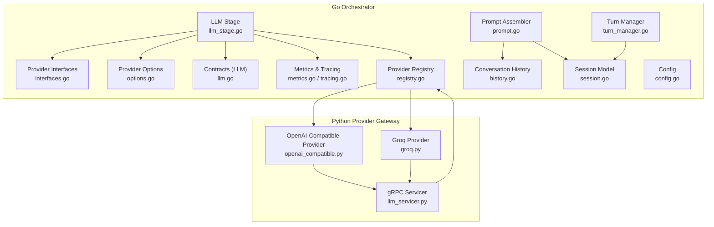
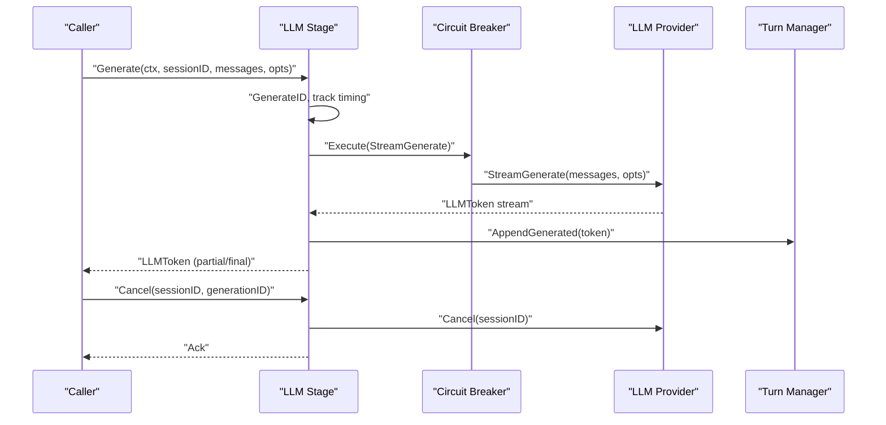
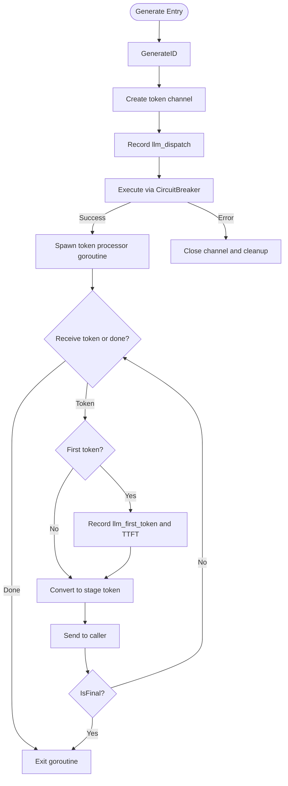
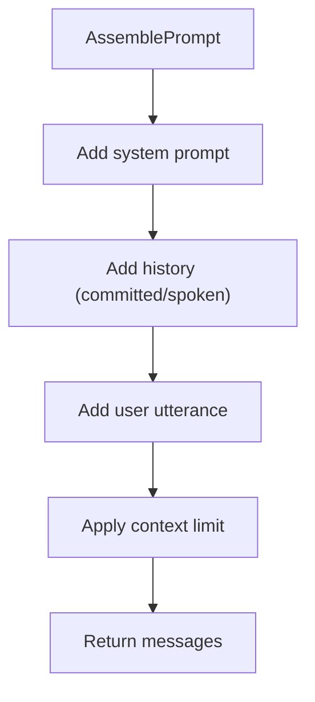
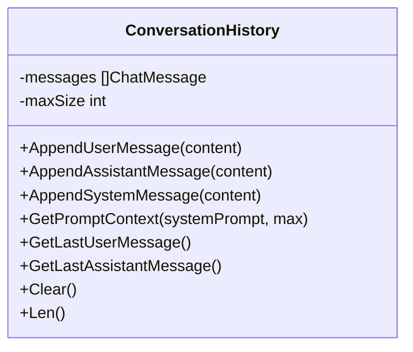
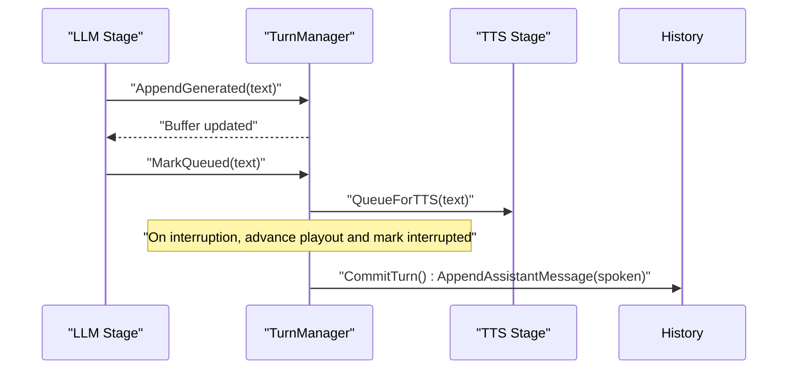
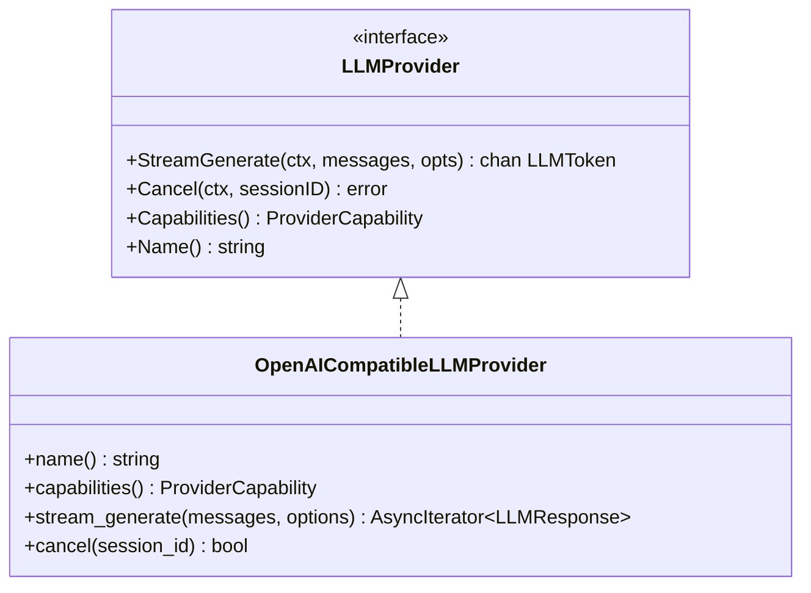
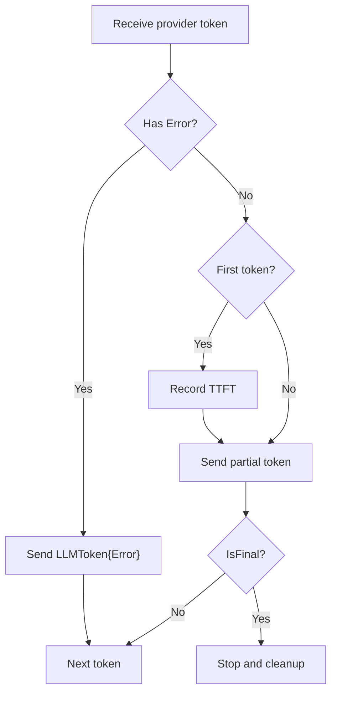
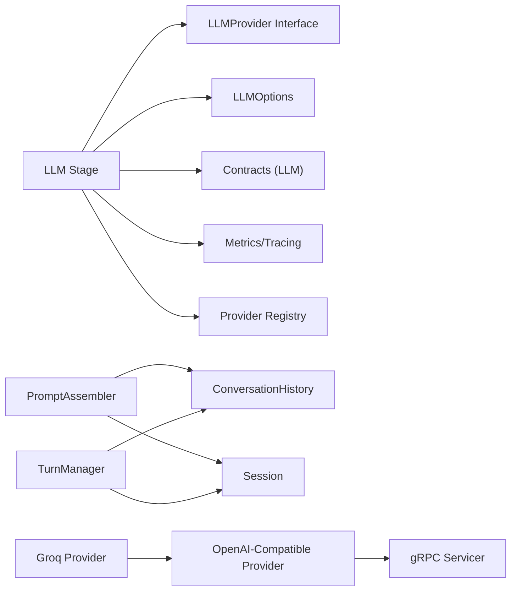

# LLM Stage

<cite>
**Referenced Files in This Document**
- [llm_stage.go](file://go/orchestrator/internal/pipeline/llm_stage.go)
- [interfaces.go](file://go/pkg/providers/interfaces.go)
- [options.go](file://go/pkg/providers/options.go)
- [llm.go](file://go/pkg/contracts/llm.go)
- [prompt.go](file://go/orchestrator/internal/pipeline/prompt.go)
- [history.go](file://go/pkg/session/history.go)
- [turn_manager.go](file://go/orchestrator/internal/statemachine/turn_manager.go)
- [session.go](file://go/pkg/session/session.go)
- [config.go](file://go/pkg/config/config.go)
- [registry.go](file://go/pkg/providers/registry.go)
- [metrics.go](file://go/pkg/observability/metrics.go)
- [tracing.go](file://go/pkg/observability/tracing.go)
- [openai_compatible.py](file://py/provider_gateway/app/providers/llm/openai_compatible.py)
- [groq.py](file://py/provider_gateway/app/providers/llm/groq.py)
- [llm_servicer.py](file://py/provider_gateway/app/grpc_api/llm_servicer.py)
</cite>

## Table of Contents
1. [Introduction](#introduction)
2. [Project Structure](#project-structure)
3. [Core Components](#core-components)
4. [Architecture Overview](#architecture-overview)
5. [Detailed Component Analysis](#detailed-component-analysis)
6. [Dependency Analysis](#dependency-analysis)
7. [Performance Considerations](#performance-considerations)
8. [Troubleshooting Guide](#troubleshooting-guide)
9. [Conclusion](#conclusion)

## Introduction
This document describes the LLM Stage component responsible for orchestrating Large Language Model inference with streaming token responses. It covers token streaming, incremental generation, context management, prompt assembly, model configuration, provider-specific optimizations, token processing workflow, cancellation, and integration with turn management and conversation history tracking. It also provides performance and resilience guidance for streaming generation.

## Project Structure
The LLM Stage lives in the orchestrator pipeline and interacts with provider interfaces, configuration, observability, and session state. Provider implementations live in the Python provider gateway and are surfaced via gRPC.

**Diagram sources**
- [llm_stage.go:1-240](file://go/orchestrator/internal/pipeline/llm_stage.go#L1-L240)
- [prompt.go:1-204](file://go/orchestrator/internal/pipeline/prompt.go#L1-L204)
- [history.go:1-233](file://go/pkg/session/history.go#L1-L233)
- [turn_manager.go:1-276](file://go/orchestrator/internal/statemachine/turn_manager.go#L1-L276)
- [interfaces.go:1-107](file://go/pkg/providers/interfaces.go#L1-L107)
- [options.go:1-188](file://go/pkg/providers/options.go#L1-L188)
- [llm.go:1-36](file://go/pkg/contracts/llm.go#L1-L36)
- [metrics.go:1-214](file://go/pkg/observability/metrics.go#L1-L214)
- [tracing.go:1-359](file://go/pkg/observability/tracing.go#L1-L359)
- [registry.go:1-262](file://go/pkg/providers/registry.go#L1-L262)
- [session.go:1-249](file://go/pkg/session/session.go#L1-L249)
- [config.go:1-276](file://go/pkg/config/config.go#L1-L276)
- [openai_compatible.py:1-288](file://py/provider_gateway/app/providers/llm/openai_compatible.py#L1-L288)
- [groq.py:1-124](file://py/provider_gateway/app/providers/llm/groq.py#L1-L124)
- [llm_servicer.py:1-218](file://py/provider_gateway/app/grpc_api/llm_servicer.py#L1-L218)

**Section sources**
- [llm_stage.go:1-240](file://go/orchestrator/internal/pipeline/llm_stage.go#L1-L240)
- [prompt.go:1-204](file://go/orchestrator/internal/pipeline/prompt.go#L1-L204)
- [history.go:1-233](file://go/pkg/session/history.go#L1-L233)
- [turn_manager.go:1-276](file://go/orchestrator/internal/statemachine/turn_manager.go#L1-L276)
- [interfaces.go:1-107](file://go/pkg/providers/interfaces.go#L1-L107)
- [options.go:1-188](file://go/pkg/providers/options.go#L1-L188)
- [llm.go:1-36](file://go/pkg/contracts/llm.go#L1-L36)
- [metrics.go:1-214](file://go/pkg/observability/metrics.go#L1-L214)
- [tracing.go:1-359](file://go/pkg/observability/tracing.go#L1-L359)
- [registry.go:1-262](file://go/pkg/providers/registry.go#L1-L262)
- [session.go:1-249](file://go/pkg/session/session.go#L1-L249)
- [config.go:1-276](file://go/pkg/config/config.go#L1-L276)
- [openai_compatible.py:1-288](file://py/provider_gateway/app/providers/llm/openai_compatible.py#L1-L288)
- [groq.py:1-124](file://py/provider_gateway/app/providers/llm/groq.py#L1-L124)
- [llm_servicer.py:1-218](file://py/provider_gateway/app/grpc_api/llm_servicer.py#L1-L218)

## Core Components
- LLM Stage: Wraps an LLM provider with circuit breaker, metrics, and cancellation. Exposes Generate and Cancel methods and streams tokens to callers.
- Provider Interface: Defines StreamGenerate and Cancel for providers, enabling pluggable LLM backends.
- Prompt Assembler: Builds conversation context from session/system prompts and history, respecting context limits.
- Conversation History: Manages committed messages and enforces size limits.
- Turn Manager: Coordinates assistant turns, incremental text buffering, queuing for TTS, and commit-once semantics.
- Provider Options: Encapsulates model configuration (temperature, top-p, max tokens, stop sequences, provider-specific options).
- Contracts: Defines ChatMessage, UsageMetadata, LLMRequest/LLMResponse structures.
- Observability: Metrics (requests, durations, errors) and tracing (timestamps, spans).
- Provider Registry: Resolves providers by name and supports tenant/global overrides.
- Session Model: Holds runtime state, selected providers, and model options.

**Section sources**
- [llm_stage.go:33-240](file://go/orchestrator/internal/pipeline/llm_stage.go#L33-L240)
- [interfaces.go:46-60](file://go/pkg/providers/interfaces.go#L46-L60)
- [prompt.go:8-142](file://go/orchestrator/internal/pipeline/prompt.go#L8-L142)
- [history.go:11-233](file://go/pkg/session/history.go#L11-L233)
- [turn_manager.go:11-276](file://go/orchestrator/internal/statemachine/turn_manager.go#L11-L276)
- [options.go:56-122](file://go/pkg/providers/options.go#L56-L122)
- [llm.go:3-36](file://go/pkg/contracts/llm.go#L3-L36)
- [metrics.go:149-214](file://go/pkg/observability/metrics.go#L149-L214)
- [tracing.go:107-184](file://go/pkg/observability/tracing.go#L107-L184)
- [registry.go:14-262](file://go/pkg/providers/registry.go#L14-L262)
- [session.go:62-84](file://go/pkg/session/session.go#L62-L84)

## Architecture Overview
The LLM Stage sits between the orchestration pipeline and provider implementations. It:
- Receives a session context and messages
- Applies prompt assembly and context limits
- Executes provider StreamGenerate under a circuit breaker
- Streams tokens, records timing, and exposes cancellation
- Integrates with turn management for incremental text and commit-once semantics

**Diagram sources**
- [llm_stage.go:58-185](file://go/orchestrator/internal/pipeline/llm_stage.go#L58-L185)
- [interfaces.go:46-60](file://go/pkg/providers/interfaces.go#L46-L60)
- [turn_manager.go:27-54](file://go/orchestrator/internal/statemachine/turn_manager.go#L27-L54)
- [openai_compatible.py:87-237](file://py/provider_gateway/app/providers/llm/openai_compatible.py#L87-L237)

## Detailed Component Analysis

### LLM Stage: Generate and Streaming Token Flow
- Generates a unique generation ID per request and stores a cancel function for cancellation.
- Creates a cancellable context and starts a goroutine to process provider tokens.
- On first emitted token, records first-token timing and TTFT metrics.
- Converts provider tokens to stage tokens and forwards them to the caller’s channel.
- Stops when a final token is received or the context is canceled.
- Cleans up active generation entries on completion or cancellation.

**Diagram sources**
- [llm_stage.go:58-185](file://go/orchestrator/internal/pipeline/llm_stage.go#L58-L185)
- [metrics.go:104-107](file://go/pkg/observability/metrics.go#L104-L107)

**Section sources**
- [llm_stage.go:58-185](file://go/orchestrator/internal/pipeline/llm_stage.go#L58-L185)
- [metrics.go:104-107](file://go/pkg/observability/metrics.go#L104-L107)

### Prompt Assembly and Context Management
- PromptAssembler builds a message list from system prompt, conversation history, and the latest user utterance.
- Enforces a maximum context window by preserving system messages and truncating older user/assistant messages.
- Provides token counting helpers and token-limit trimming utilities for preflight checks.

**Diagram sources**
- [prompt.go:23-142](file://go/orchestrator/internal/pipeline/prompt.go#L23-L142)
- [history.go:84-115](file://go/pkg/session/history.go#L84-L115)

**Section sources**
- [prompt.go:23-142](file://go/orchestrator/internal/pipeline/prompt.go#L23-L142)
- [history.go:84-115](file://go/pkg/session/history.go#L84-L115)

### Conversation History Integration
- Maintains a bounded list of messages with system messages preserved.
- Appends user/assistant messages and trims when exceeding configured size.
- Retrieves recent messages for prompt context and enforces commit-once semantics.

**Diagram sources**
- [history.go:11-198](file://go/pkg/session/history.go#L11-L198)

**Section sources**
- [history.go:11-198](file://go/pkg/session/history.go#L11-L198)

### Turn Management and Incremental Text Processing
- TurnManager coordinates assistant turns, buffering generated text and moving completed segments to TTS queue.
- Handles interruptions by advancing playout cursors and committing only spoken text to history.
- Provides stats and lifecycle helpers for active turns.

**Diagram sources**
- [turn_manager.go:27-130](file://go/orchestrator/internal/statemachine/turn_manager.go#L27-L130)
- [history.go:43-59](file://go/pkg/session/history.go#L43-L59)

**Section sources**
- [turn_manager.go:27-130](file://go/orchestrator/internal/statemachine/turn_manager.go#L27-L130)
- [history.go:43-59](file://go/pkg/session/history.go#L43-L59)

### Provider Integration and Model Configuration
- Provider interface defines StreamGenerate and Cancel, enabling interchangeable providers.
- ProviderOptions encapsulates model configuration (model name, max tokens, temperature, top-p, stop sequences, provider-specific options).
- ProviderRegistry resolves providers by name and supports tenant/global overrides.
- Python providers implement OpenAI-compatible streaming and cancellation.

**Diagram sources**
- [interfaces.go:46-60](file://go/pkg/providers/interfaces.go#L46-L60)
- [openai_compatible.py:18-86](file://py/provider_gateway/app/providers/llm/openai_compatible.py#L18-L86)

**Section sources**
- [interfaces.go:46-60](file://go/pkg/providers/interfaces.go#L46-L60)
- [options.go:56-122](file://go/pkg/providers/options.go#L56-L122)
- [registry.go:172-251](file://go/pkg/providers/registry.go#L172-L251)
- [openai_compatible.py:18-86](file://py/provider_gateway/app/providers/llm/openai_compatible.py#L18-L86)
- [groq.py:16-62](file://py/provider_gateway/app/providers/llm/groq.py#L16-L62)

### Token Processing Workflow: Partial Tokens, Final Tokens, Cancellation
- Partial tokens are forwarded immediately to the caller with IsFinal=false.
- Final tokens signal completion; the stage stops forwarding and cleans up.
- Cancellation propagates to provider via Cancel and cancels the local context.

**Diagram sources**
- [llm_stage.go:120-182](file://go/orchestrator/internal/pipeline/llm_stage.go#L120-L182)

**Section sources**
- [llm_stage.go:120-182](file://go/orchestrator/internal/pipeline/llm_stage.go#L120-L182)

### Provider-Specific Optimizations
- OpenAI-compatible provider supports interruptible generation and merges provider options into the request payload.
- Groq provider extends the compatible adapter with Groq-specific error mapping and defaults.

**Section sources**
- [openai_compatible.py:75-86](file://py/provider_gateway/app/providers/llm/openai_compatible.py#L75-L86)
- [openai_compatible.py:125-147](file://py/provider_gateway/app/providers/llm/openai_compatible.py#L125-L147)
- [groq.py:52-62](file://py/provider_gateway/app/providers/llm/groq.py#L52-L62)

### Integration with Turn Management and Conversation History
- Generated text is appended to the current assistant turn and later queued for TTS.
- Only spoken text is committed to history; unspoken generated text remains in the turn buffer.
- Interruption handling advances playout cursors and ensures commit-once semantics.

**Section sources**
- [turn_manager.go:36-130](file://go/orchestrator/internal/statemachine/turn_manager.go#L36-L130)
- [history.go:43-59](file://go/pkg/session/history.go#L43-L59)

## Dependency Analysis
- LLM Stage depends on Provider Interface, Provider Options, Contracts, Metrics, Tracing, and Provider Registry.
- PromptAssembler depends on ConversationHistory and Session model.
- Turn Manager depends on Session state and ConversationHistory.
- Python providers depend on gRPC servicer and registry.

**Diagram sources**
- [llm_stage.go:33-56](file://go/orchestrator/internal/pipeline/llm_stage.go#L33-L56)
- [prompt.go:8-21](file://go/orchestrator/internal/pipeline/prompt.go#L8-L21)
- [history.go:11-28](file://go/pkg/session/history.go#L11-L28)
- [turn_manager.go:11-25](file://go/orchestrator/internal/statemachine/turn_manager.go#L11-L25)
- [registry.go:14-40](file://go/pkg/providers/registry.go#L14-L40)
- [openai_compatible.py:18-53](file://py/provider_gateway/app/providers/llm/openai_compatible.py#L18-L53)
- [llm_servicer.py:24-36](file://py/provider_gateway/app/grpc_api/llm_servicer.py#L24-L36)

**Section sources**
- [llm_stage.go:33-56](file://go/orchestrator/internal/pipeline/llm_stage.go#L33-L56)
- [prompt.go:8-21](file://go/orchestrator/internal/pipeline/prompt.go#L8-L21)
- [history.go:11-28](file://go/pkg/session/history.go#L11-L28)
- [turn_manager.go:11-25](file://go/orchestrator/internal/statemachine/turn_manager.go#L11-L25)
- [registry.go:14-40](file://go/pkg/providers/registry.go#L14-L40)
- [openai_compatible.py:18-53](file://py/provider_gateway/app/providers/llm/openai_compatible.py#L18-L53)
- [llm_servicer.py:24-36](file://py/provider_gateway/app/grpc_api/llm_servicer.py#L24-L36)

## Performance Considerations
- Streaming: Use buffered channels sized appropriately to prevent blocking; the stage uses a small buffer for tokens.
- Memory: Limit conversation history size and context window to control memory footprint; trim oldest non-system messages when exceeding limits.
- Metrics: Record TTFT, provider request durations, and errors to detect regressions and hotspots.
- Circuit Breaker: Protect upstream providers from overload; handle open-state gracefully by returning appropriate errors.
- Tokenization: Use token-count helpers to estimate context usage; consider provider-specific tokenizers for accuracy.
- Concurrency: Keep token processing in a dedicated goroutine; ensure context cancellation is respected promptly.

[No sources needed since this section provides general guidance]

## Troubleshooting Guide
- No tokens received: Verify provider availability via registry resolution and provider capabilities.
- Slow first token: Check TTFT metrics and provider latency; inspect circuit breaker state.
- Cancellation not working: Ensure generation ID matches and provider implements cancel; confirm local cancel function is stored.
- Provider errors: Inspect provider error codes and retriable flags; leverage observability metrics and traces.
- Interrupted generation: Confirm TurnManager interruption handling and commit-once behavior.

**Section sources**
- [registry.go:172-251](file://go/pkg/providers/registry.go#L172-L251)
- [metrics.go:104-107](file://go/pkg/observability/metrics.go#L104-L107)
- [llm_stage.go:187-211](file://go/orchestrator/internal/pipeline/llm_stage.go#L187-L211)
- [openai_compatible.py:240-259](file://py/provider_gateway/app/providers/llm/openai_compatible.py#L240-L259)

## Conclusion
The LLM Stage provides a robust, observable, and cancellable streaming inference pipeline. It integrates tightly with prompt assembly, conversation history, and turn management to support incremental text processing and commit-once semantics. Provider interfaces and registries enable flexible backend selection, while metrics and tracing offer strong operational visibility. With careful attention to context limits, tokenization, and cancellation, the stage delivers responsive and resilient LLM-driven conversations.