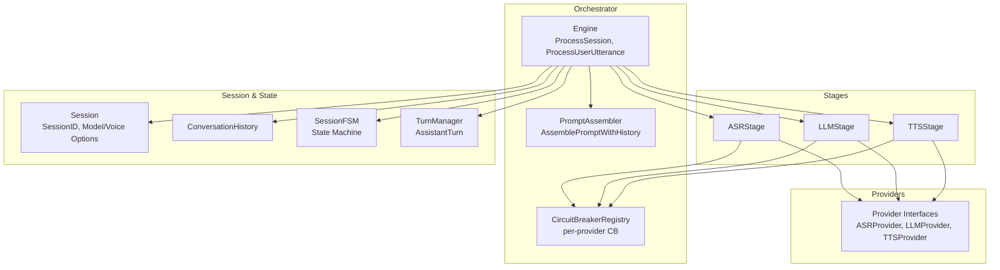
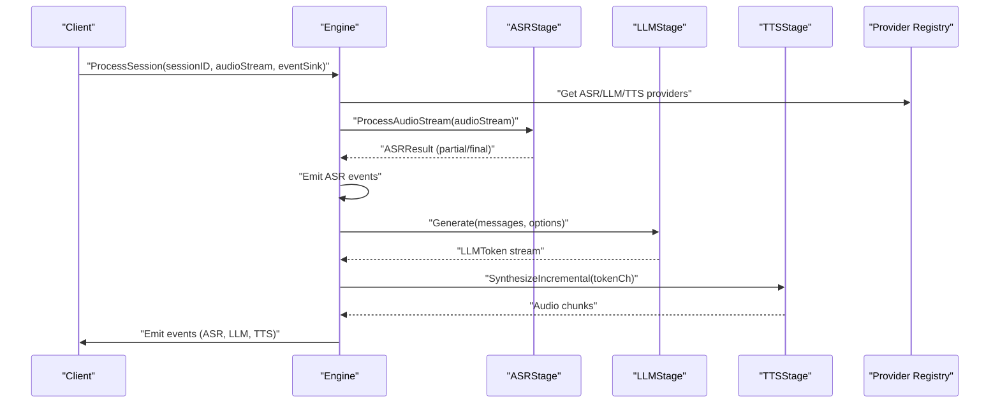
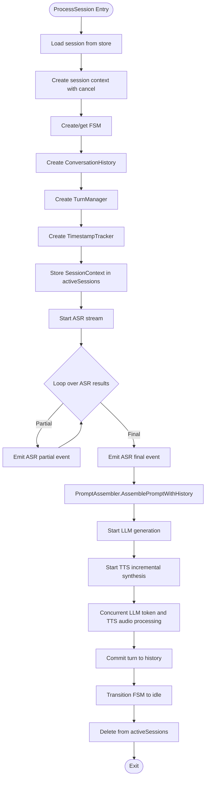
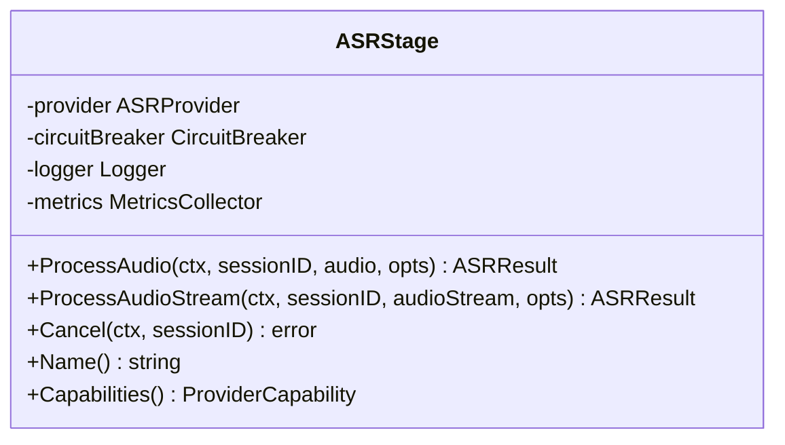
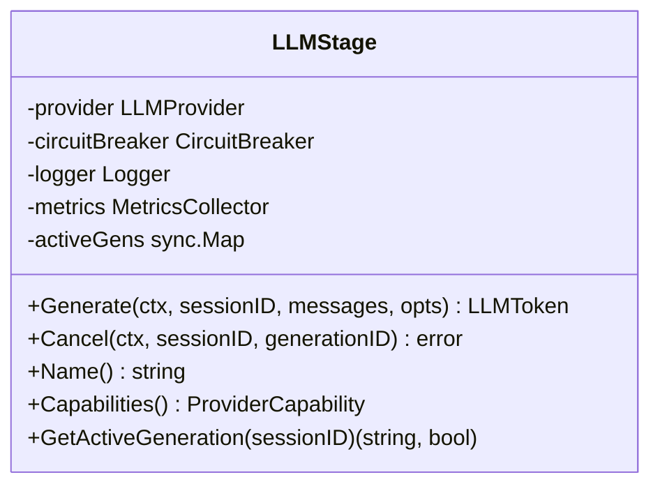
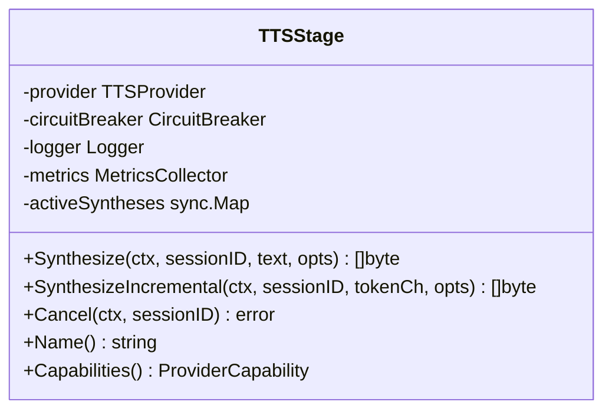
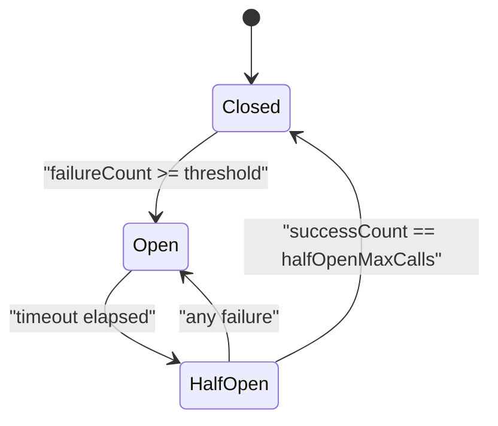
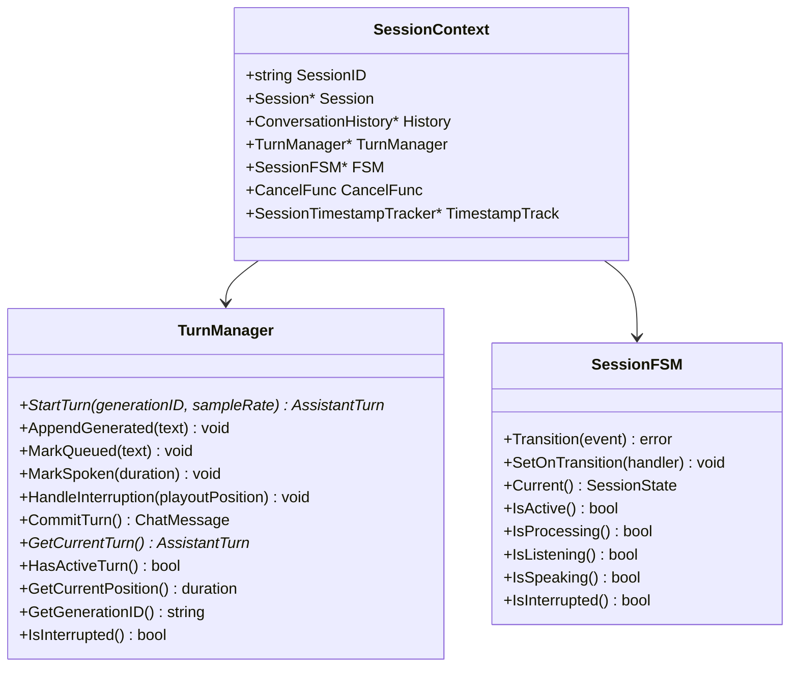
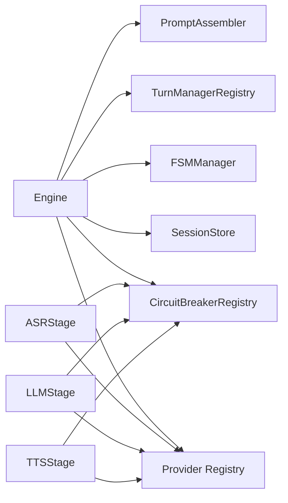

# Pipeline Engine

<cite>
**Referenced Files in This Document**
- [engine.go](file://go/orchestrator/internal/pipeline/engine.go)
- [asr_stage.go](file://go/orchestrator/internal/pipeline/asr_stage.go)
- [llm_stage.go](file://go/orchestrator/internal/pipeline/llm_stage.go)
- [tts_stage.go](file://go/orchestrator/internal/pipeline/tts_stage.go)
- [circuit_breaker.go](file://go/orchestrator/internal/pipeline/circuit_breaker.go)
- [prompt.go](file://go/orchestrator/internal/pipeline/prompt.go)
- [fsm.go](file://go/orchestrator/internal/statemachine/fsm.go)
- [turn_manager.go](file://go/orchestrator/internal/statemachine/turn_manager.go)
- [session.go](file://go/pkg/session/session.go)
- [history.go](file://go/pkg/session/history.go)
- [state.go](file://go/pkg/session/state.go)
- [interfaces.go](file://go/pkg/providers/interfaces.go)
- [engine_test.go](file://go/orchestrator/internal/pipeline/engine_test.go)
- [circuit_breaker_test.go](file://go/orchestrator/internal/pipeline/circuit_breaker_test.go)
</cite>

## Table of Contents
1. [Introduction](#introduction)
2. [Project Structure](#project-structure)
3. [Core Components](#core-components)
4. [Architecture Overview](#architecture-overview)
5. [Detailed Component Analysis](#detailed-component-analysis)
6. [Dependency Analysis](#dependency-analysis)
7. [Performance Considerations](#performance-considerations)
8. [Troubleshooting Guide](#troubleshooting-guide)
9. [Conclusion](#conclusion)

## Introduction
This document explains the Pipeline Engine responsible for orchestrating the end-to-end voice AI pipeline: ASR (Automatic Speech Recognition) -> LLM (Large Language Model) -> TTS (Text-to-Speech). It covers stage initialization, concurrent processing workflows, resource management, session lifecycle, interruption handling, and resilience via the circuit breaker pattern. It also provides concrete execution flows, concurrency patterns, and guidance for performance and scalability.

## Project Structure
The Pipeline Engine resides under the orchestrator module and integrates with provider interfaces, session management, and state machines. The key areas are:
- Pipeline orchestration and session management
- Stage implementations for ASR, LLM, and TTS
- Circuit breaker for provider resilience
- Prompt assembly and conversation history
- Session state machine and turn management

**Diagram sources**
- [engine.go:108-208](file://go/orchestrator/internal/pipeline/engine.go#L108-L208)
- [asr_stage.go:25-45](file://go/orchestrator/internal/pipeline/asr_stage.go#L25-L45)
- [llm_stage.go:33-56](file://go/orchestrator/internal/pipeline/llm_stage.go#L33-L56)
- [tts_stage.go:16-39](file://go/orchestrator/internal/pipeline/tts_stage.go#L16-L39)
- [circuit_breaker.go:207-234](file://go/orchestrator/internal/pipeline/circuit_breaker.go#L207-L234)
- [prompt.go:64-104](file://go/orchestrator/internal/pipeline/prompt.go#L64-L104)
- [fsm.go:44-92](file://go/orchestrator/internal/statemachine/fsm.go#L44-L92)
- [turn_manager.go:11-25](file://go/orchestrator/internal/statemachine/turn_manager.go#L11-L25)
- [session.go:62-84](file://go/pkg/session/session.go#L62-L84)
- [history.go:11-28](file://go/pkg/session/history.go#L11-L28)
- [interfaces.go:21-76](file://go/pkg/providers/interfaces.go#L21-L76)

**Section sources**
- [engine.go:17-106](file://go/orchestrator/internal/pipeline/engine.go#L17-L106)
- [fsm.go:44-92](file://go/orchestrator/internal/statemachine/fsm.go#L44-L92)
- [turn_manager.go:223-248](file://go/orchestrator/internal/statemachine/turn_manager.go#L223-L248)

## Core Components
- Engine: Central orchestrator managing session lifecycle, stage coordination, and resource cleanup.
- Stages: ASRStage, LLMStage, TTSStage wrap provider calls with circuit breaker protection, metrics, and cancellation support.
- Circuit Breaker: Per-provider resilience with configurable thresholds and half-open testing.
- PromptAssembler: Builds LLM prompts respecting context limits and history.
- SessionFSM and TurnManager: Enforce state transitions and manage assistant turns with interruption-aware commit semantics.
- Session and History: Provide runtime state, configuration, and conversation history management.

**Section sources**
- [engine.go:17-106](file://go/orchestrator/internal/pipeline/engine.go#L17-L106)
- [asr_stage.go:25-45](file://go/orchestrator/internal/pipeline/asr_stage.go#L25-L45)
- [llm_stage.go:33-56](file://go/orchestrator/internal/pipeline/llm_stage.go#L33-L56)
- [tts_stage.go:16-39](file://go/orchestrator/internal/pipeline/tts_stage.go#L16-L39)
- [circuit_breaker.go:57-79](file://go/orchestrator/internal/pipeline/circuit_breaker.go#L57-L79)
- [prompt.go:8-21](file://go/orchestrator/internal/pipeline/prompt.go#L8-L21)
- [fsm.go:44-92](file://go/orchestrator/internal/statemachine/fsm.go#L44-L92)
- [turn_manager.go:11-25](file://go/orchestrator/internal/statemachine/turn_manager.go#L11-L25)
- [session.go:62-84](file://go/pkg/session/session.go#L62-L84)
- [history.go:11-28](file://go/pkg/session/history.go#L11-L28)

## Architecture Overview
The Engine initializes providers via a registry, constructs stage wrappers with circuit breakers, and manages session contexts with FSM and turn tracking. The main orchestration loop streams audio to ASR, forwards final transcripts to LLM, and concurrently streams tokens to TTS for incremental synthesis.

**Diagram sources**
- [engine.go:108-208](file://go/orchestrator/internal/pipeline/engine.go#L108-L208)
- [asr_stage.go:164-290](file://go/orchestrator/internal/pipeline/asr_stage.go#L164-L290)
- [llm_stage.go:58-185](file://go/orchestrator/internal/pipeline/llm_stage.go#L58-L185)
- [tts_stage.go:129-236](file://go/orchestrator/internal/pipeline/tts_stage.go#L129-L236)

## Detailed Component Analysis

### Engine Orchestration
The Engine coordinates the entire pipeline:
- Creates session context, FSM, history, turn manager, and timestamp tracker.
- Starts ASR streaming and processes results, emitting partial and final ASR events.
- On final ASR, builds LLM messages via PromptAssembler, starts LLM generation, and concurrently streams tokens to TTS for incremental synthesis.
- Manages interruptions by cancelling LLM and TTS, updating turn state, and committing only spoken text to history.
- Provides lifecycle APIs: StopSession, GetActiveSessions, IsSessionActive.

**Diagram sources**
- [engine.go:108-208](file://go/orchestrator/internal/pipeline/engine.go#L108-L208)
- [engine.go:210-375](file://go/orchestrator/internal/pipeline/engine.go#L210-L375)
- [prompt.go:64-104](file://go/orchestrator/internal/pipeline/prompt.go#L64-L104)

**Section sources**
- [engine.go:108-208](file://go/orchestrator/internal/pipeline/engine.go#L108-L208)
- [engine.go:210-375](file://go/orchestrator/internal/pipeline/engine.go#L210-L375)
- [engine.go:377-470](file://go/orchestrator/internal/pipeline/engine.go#L377-L470)
- [engine.go:495-510](file://go/orchestrator/internal/pipeline/engine.go#L495-L510)

### ASR Stage
- Wraps an ASR provider with circuit breaker protection and metrics.
- Supports both single-shot and streaming audio recognition.
- Emits partial and final results with timing metadata.
- Provides cancellation support.

**Diagram sources**
- [asr_stage.go:25-45](file://go/orchestrator/internal/pipeline/asr_stage.go#L25-L45)
- [interfaces.go:21-35](file://go/pkg/providers/interfaces.go#L21-L35)

**Section sources**
- [asr_stage.go:47-162](file://go/orchestrator/internal/pipeline/asr_stage.go#L47-L162)
- [asr_stage.go:164-290](file://go/orchestrator/internal/pipeline/asr_stage.go#L164-L290)
- [asr_stage.go:292-302](file://go/orchestrator/internal/pipeline/asr_stage.go#L292-L302)

### LLM Stage
- Wraps an LLM provider with circuit breaker protection and metrics.
- Streams tokens with first-token TTFT recording.
- Tracks active generations for cancellation.
- Emits partial tokens and final token markers.

**Diagram sources**
- [llm_stage.go:33-56](file://go/orchestrator/internal/pipeline/llm_stage.go#L33-L56)
- [interfaces.go:46-60](file://go/pkg/providers/interfaces.go#L46-L60)

**Section sources**
- [llm_stage.go:58-185](file://go/orchestrator/internal/pipeline/llm_stage.go#L58-L185)
- [llm_stage.go:187-240](file://go/orchestrator/internal/pipeline/llm_stage.go#L187-L240)

### TTS Stage
- Wraps a TTS provider with circuit breaker protection and metrics.
- Supports incremental synthesis by batching tokens into speakable segments.
- Emits audio chunks and final marker.
- Tracks active syntheses for cancellation.

**Diagram sources**
- [tts_stage.go:16-39](file://go/orchestrator/internal/pipeline/tts_stage.go#L16-L39)
- [interfaces.go:62-76](file://go/pkg/providers/interfaces.go#L62-L76)

**Section sources**
- [tts_stage.go:41-127](file://go/orchestrator/internal/pipeline/tts_stage.go#L41-L127)
- [tts_stage.go:129-236](file://go/orchestrator/internal/pipeline/tts_stage.go#L129-L236)
- [tts_stage.go:238-258](file://go/orchestrator/internal/pipeline/tts_stage.go#L238-L258)

### Circuit Breaker Pattern
- Implements closed/open/half-open states with configurable thresholds and timeouts.
- Integrates with stages to protect provider calls.
- Provides registry to share breakers per provider name.

**Diagram sources**
- [circuit_breaker.go:12-36](file://go/orchestrator/internal/pipeline/circuit_breaker.go#L12-L36)
- [circuit_breaker.go:82-121](file://go/orchestrator/internal/pipeline/circuit_breaker.go#L82-L121)
- [circuit_breaker.go:123-171](file://go/orchestrator/internal/pipeline/circuit_breaker.go#L123-L171)

**Section sources**
- [circuit_breaker.go:57-79](file://go/orchestrator/internal/pipeline/circuit_breaker.go#L57-L79)
- [circuit_breaker.go:207-234](file://go/orchestrator/internal/pipeline/circuit_breaker.go#L207-L234)

### Session Context Management and Turn Tracking
- SessionContext stores runtime context: session, history, FSM, turn manager, cancel function, and timestamp tracker.
- TurnManager tracks assistant turns, supports interruption, and commits only spoken text to history.
- SessionFSM enforces valid state transitions and emits turn events.

**Diagram sources**
- [engine.go:59-68](file://go/orchestrator/internal/pipeline/engine.go#L59-L68)
- [turn_manager.go:11-25](file://go/orchestrator/internal/statemachine/turn_manager.go#L11-L25)
- [fsm.go:44-92](file://go/orchestrator/internal/statemachine/fsm.go#L44-L92)

**Section sources**
- [engine.go:59-68](file://go/orchestrator/internal/pipeline/engine.go#L59-L68)
- [turn_manager.go:27-130](file://go/orchestrator/internal/statemachine/turn_manager.go#L27-L130)
- [fsm.go:101-161](file://go/orchestrator/internal/statemachine/fsm.go#L101-L161)

### Prompt Assembly and History
- PromptAssembler builds chat messages with system prompt, history, and current user utterance, respecting context window limits.
- ConversationHistory maintains ordered messages and ensures only spoken assistant text is committed.

**Section sources**
- [prompt.go:64-104](file://go/orchestrator/internal/pipeline/prompt.go#L64-L104)
- [prompt.go:106-142](file://go/orchestrator/internal/pipeline/prompt.go#L106-L142)
- [history.go:30-59](file://go/pkg/session/history.go#L30-L59)
- [history.go:157-198](file://go/pkg/session/history.go#L157-L198)

### Provider Interfaces
- Defines streaming recognition, generation, and synthesis interfaces with cancellation and capability reporting.

**Section sources**
- [interfaces.go:21-76](file://go/pkg/providers/interfaces.go#L21-L76)

## Dependency Analysis
The Engine depends on:
- Provider registry for ASR/LLM/TTS resolution
- Persistence and session store for session data
- Observability for metrics and logging
- Statemachine for state transitions
- Turn manager for assistant turn lifecycle

**Diagram sources**
- [engine.go:70-106](file://go/orchestrator/internal/pipeline/engine.go#L70-L106)
- [fsm.go:309-334](file://go/orchestrator/internal/statemachine/fsm.go#L309-L334)
- [turn_manager.go:223-248](file://go/orchestrator/internal/statemachine/turn_manager.go#L223-L248)
- [circuit_breaker.go:207-234](file://go/orchestrator/internal/pipeline/circuit_breaker.go#L207-L234)

**Section sources**
- [engine.go:70-106](file://go/orchestrator/internal/pipeline/engine.go#L70-L106)
- [fsm.go:309-334](file://go/orchestrator/internal/statemachine/fsm.go#L309-L334)
- [turn_manager.go:223-248](file://go/orchestrator/internal/statemachine/turn_manager.go#L223-L248)
- [circuit_breaker.go:207-234](file://go/orchestrator/internal/pipeline/circuit_breaker.go#L207-L234)

## Performance Considerations
- Concurrency: The Engine uses goroutines and WaitGroups to process LLM tokens and TTS audio concurrently, minimizing end-to-end latency.
- Incremental TTS: Segments tokens into speakable units to overlap LLM generation and TTS synthesis.
- Channel buffering: Channels are buffered to prevent blocking during provider I/O.
- Circuit breaker: Prevents cascading failures and enables graceful degradation when providers are unhealthy.
- Metrics and timing: Timestamp trackers and metrics capture latency and throughput for observability.
- Memory: Conversation history and context windows limit memory growth; incremental synthesis avoids large intermediate buffers.

[No sources needed since this section provides general guidance]

## Troubleshooting Guide
Common issues and remedies:
- Provider failures: Circuit breaker opens; monitor state and wait for recovery or reset.
- Interruption handling: Ensure HandleInterruption is invoked to cancel LLM/TTS and commit only spoken text.
- Session lifecycle: Use StopSession to clean up FSM, turn manager, and Redis entries.
- Validation: Use tests to verify state transitions, interruption semantics, and provider switching.

**Section sources**
- [circuit_breaker.go:82-121](file://go/orchestrator/internal/pipeline/circuit_breaker.go#L82-L121)
- [engine.go:377-436](file://go/orchestrator/internal/pipeline/engine.go#L377-L436)
- [engine.go:438-470](file://go/orchestrator/internal/pipeline/engine.go#L438-L470)
- [engine_test.go:394-454](file://go/orchestrator/internal/pipeline/engine_test.go#L394-L454)
- [circuit_breaker_test.go:38-70](file://go/orchestrator/internal/pipeline/circuit_breaker_test.go#L38-L70)

## Conclusion
The Pipeline Engine provides robust orchestration of ASR, LLM, and TTS with strong resilience via circuit breakers, precise session and turn management, and efficient concurrent processing. Its modular design and clear separation of concerns enable scalability, maintainability, and graceful degradation under load or provider failures.