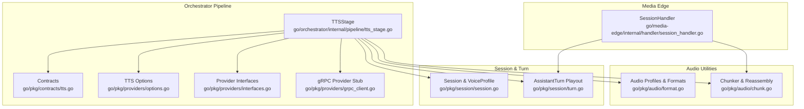
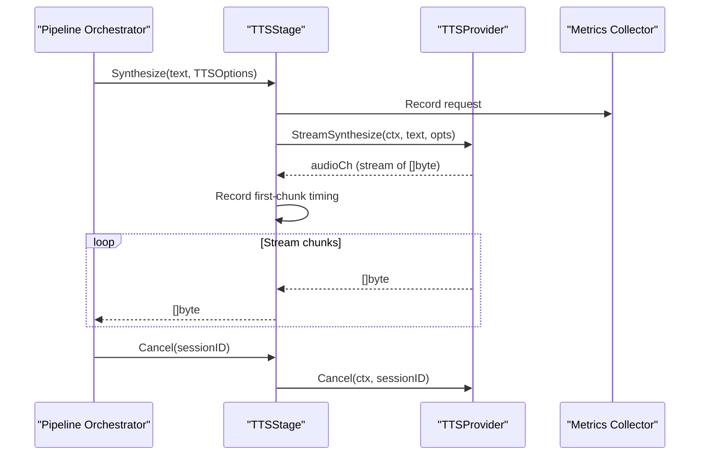
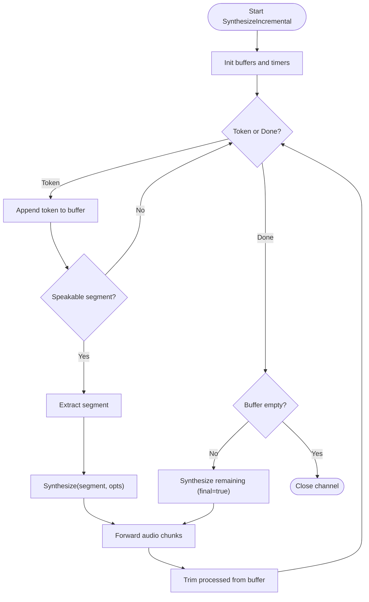
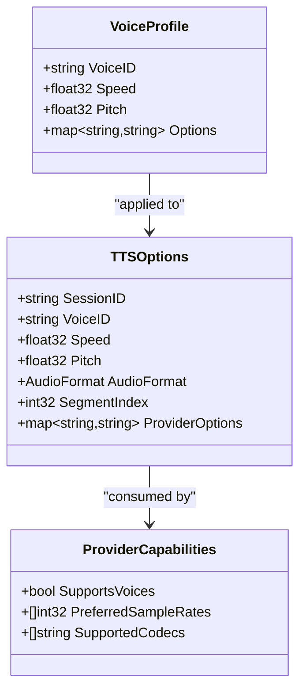
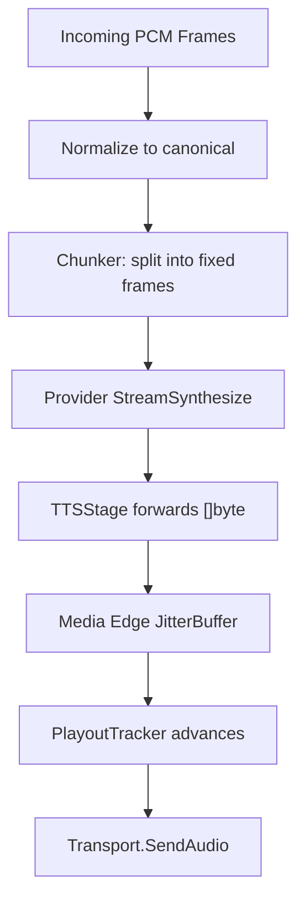
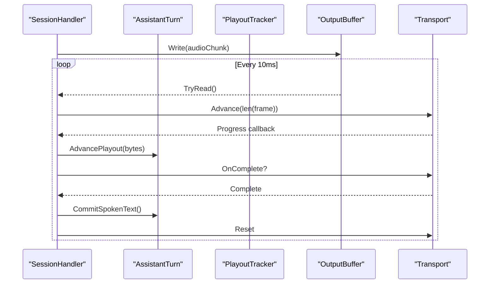
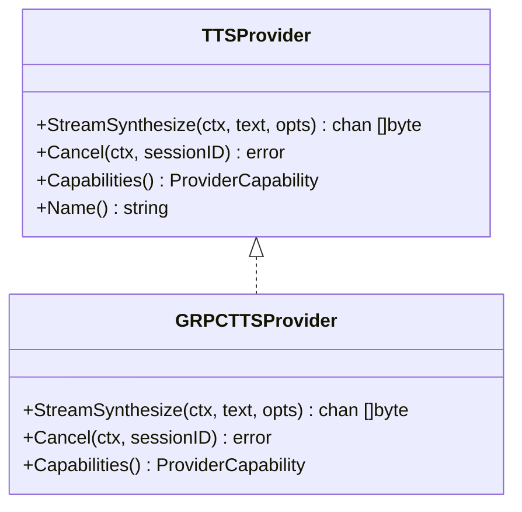
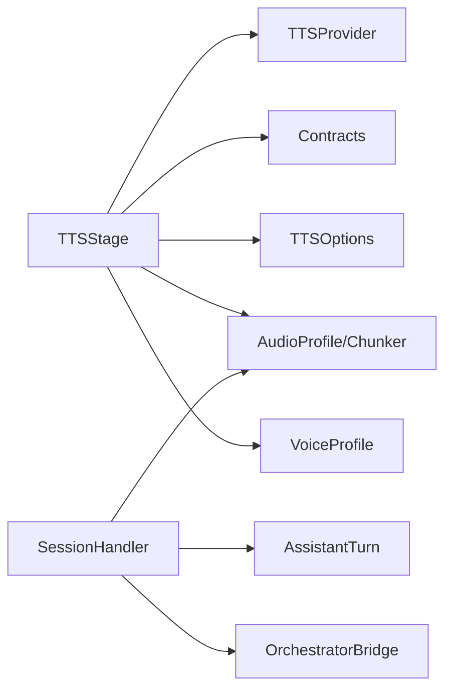

# TTS Stage

<cite>
**Referenced Files in This Document**
- [tts_stage.go](file://go/orchestrator/internal/pipeline/tts_stage.go)
- [interfaces.go](file://go/pkg/providers/interfaces.go)
- [options.go](file://go/pkg/providers/options.go)
- [tts.go](file://go/pkg/contracts/tts.go)
- [format.go](file://go/pkg/audio/format.go)
- [chunk.go](file://go/pkg/audio/chunk.go)
- [turn.go](file://go/pkg/session/turn.go)
- [session.go](file://go/pkg/session/session.go)
- [grpc_client.go](file://go/pkg/providers/grpc_client.go)
- [seed-voices.yaml](file://examples/seed-voices.yaml)
- [session_handler.go](file://go/media-edge/internal/handler/session_handler.go)
</cite>

## Table of Contents
1. [Introduction](#introduction)
2. [Project Structure](#project-structure)
3. [Core Components](#core-components)
4. [Architecture Overview](#architecture-overview)
5. [Detailed Component Analysis](#detailed-component-analysis)
6. [Dependency Analysis](#dependency-analysis)
7. [Performance Considerations](#performance-considerations)
8. [Troubleshooting Guide](#troubleshooting-guide)
9. [Conclusion](#conclusion)

## Introduction
This document explains the TTS Stage component responsible for converting text into streaming audio. It covers incremental synthesis, audio chunk generation, voice profile integration, provider-specific options, and end-to-end synthesis cancellation. It also documents the audio synthesis workflow, integration with the turn management system, and audio playout coordination.

## Project Structure
The TTS Stage lives in the orchestrator pipeline and integrates with provider abstractions, audio utilities, and session state. The media edge coordinates audio playout and turn lifecycle.

**Diagram sources**
- [tts_stage.go:16-39](file://go/orchestrator/internal/pipeline/tts_stage.go#L16-L39)
- [tts.go:3-21](file://go/pkg/contracts/tts.go#L3-L21)
- [options.go:124-187](file://go/pkg/providers/options.go#L124-L187)
- [interfaces.go:62-76](file://go/pkg/providers/interfaces.go#L62-L76)
- [grpc_client.go:203-277](file://go/pkg/providers/grpc_client.go#L203-L277)
- [format.go:11-140](file://go/pkg/audio/format.go#L11-L140)
- [chunk.go:7-230](file://go/pkg/audio/chunk.go#L7-L230)
- [session.go:42-48](file://go/pkg/session/session.go#L42-L48)
- [turn.go:9-25](file://go/pkg/session/turn.go#L9-L25)
- [session_handler.go:17-51](file://go/media-edge/internal/handler/session_handler.go#L17-L51)

**Section sources**
- [tts_stage.go:16-39](file://go/orchestrator/internal/pipeline/tts_stage.go#L16-L39)
- [session_handler.go:17-51](file://go/media-edge/internal/handler/session_handler.go#L17-L51)

## Core Components
- TTSStage: Wraps a TTSProvider with circuit breaker, metrics, and cancellation tracking. Exposes Synthesize and SynthesizeIncremental.
- TTSProvider interface: Defines StreamSynthesize and Cancel semantics for providers.
- TTSOptions: Encapsulates voice selection, speed, pitch, audio format, segment index, and provider-specific options.
- Contracts: Define TTSRequest/TTSResponse shapes including audio format and timing metadata.
- Audio utilities: AudioProfile, BytesPerFrame, and chunking/reassembly helpers.
- Session/VoiceProfile: Holds voice identity and prosody settings applied to TTSOptions.
- Media Edge SessionHandler: Coordinates audio playout, interruption, and turn lifecycle.

**Section sources**
- [tts_stage.go:16-39](file://go/orchestrator/internal/pipeline/tts_stage.go#L16-L39)
- [interfaces.go:62-76](file://go/pkg/providers/interfaces.go#L62-L76)
- [options.go:124-187](file://go/pkg/providers/options.go#L124-L187)
- [tts.go:3-21](file://go/pkg/contracts/tts.go#L3-L21)
- [format.go:11-140](file://go/pkg/audio/format.go#L11-L140)
- [session.go:42-48](file://go/pkg/session/session.go#L42-L48)
- [session_handler.go:17-51](file://go/media-edge/internal/handler/session_handler.go#L17-L51)

## Architecture Overview
The TTS Stage sits between the orchestration pipeline and provider implementations. It:
- Receives text or incremental tokens
- Applies voice and audio configuration
- Dispatches synthesis requests to the provider with circuit breaker protection
- Streams audio chunks back and records timing metrics
- Supports cancellation at both local and provider levels

**Diagram sources**
- [tts_stage.go:41-127](file://go/orchestrator/internal/pipeline/tts_stage.go#L41-L127)
- [interfaces.go:62-76](file://go/pkg/providers/interfaces.go#L62-L76)

## Detailed Component Analysis

### TTSStage: Incremental Synthesis and Streaming
- Synthesize: Creates a cancellable context, executes under circuit breaker, streams audio chunks, records dispatch and first-chunk timestamps, and forwards chunks to caller.
- SynthesizeIncremental: Buffers incoming tokens, detects speakable segments (sentence/phrase boundaries), dispatches each segment to Synthesize, and forwards audio chunks. Uses segment index and “is_final” hints for provider optimization.
- Cancel: Cancels local context and delegates to provider.

**Diagram sources**
- [tts_stage.go:129-236](file://go/orchestrator/internal/pipeline/tts_stage.go#L129-L236)

**Section sources**
- [tts_stage.go:41-127](file://go/orchestrator/internal/pipeline/tts_stage.go#L41-L127)
- [tts_stage.go:129-236](file://go/orchestrator/internal/pipeline/tts_stage.go#L129-L236)

### Voice Configuration and Provider Options
- VoiceProfile: Holds VoiceID, Speed, Pitch, and provider options. Applied to TTSOptions for each synthesis.
- TTSOptions: Includes SessionID, VoiceID, Speed, Pitch, AudioFormat, SegmentIndex, and ProviderOptions. Provider-specific keys can signal finality and other hints.
- ProviderCapabilities: Declares support for voices and preferred codecs/sample rates.

**Diagram sources**
- [session.go:42-48](file://go/pkg/session/session.go#L42-L48)
- [options.go:124-187](file://go/pkg/providers/options.go#L124-L187)
- [grpc_client.go:255-264](file://go/pkg/providers/grpc_client.go#L255-L264)

**Section sources**
- [session.go:42-48](file://go/pkg/session/session.go#L42-L48)
- [options.go:124-187](file://go/pkg/providers/options.go#L124-L187)
- [grpc_client.go:255-264](file://go/pkg/providers/grpc_client.go#L255-L264)

### Audio Format Handling and Chunking
- AudioProfile: Defines sample rate, channels, encoding, and frame size; computes bytes-per-sample/frame and conversions.
- Chunker/Reassembler: Split and reassemble audio into fixed-size frames; supports flushing and buffered reordering.
- Integration: Media Edge normalizes and chunks audio for playout; TTSStage emits raw provider frames.

**Diagram sources**
- [format.go:11-140](file://go/pkg/audio/format.go#L11-L140)
- [chunk.go:7-230](file://go/pkg/audio/chunk.go#L7-L230)
- [session_handler.go:176-225](file://go/media-edge/internal/handler/session_handler.go#L176-L225)

**Section sources**
- [format.go:11-140](file://go/pkg/audio/format.go#L11-L140)
- [chunk.go:7-230](file://go/pkg/audio/chunk.go#L7-L230)
- [session_handler.go:176-225](file://go/media-edge/internal/handler/session_handler.go#L176-L225)

### Turn Management and Audio Playout Coordination
- AssistantTurn tracks generated/queued/spoken text and playout cursor; commits spoken text and trims history accordingly.
- SessionHandler coordinates VAD, interruption, audio playout, and turn completion; updates AssistantTurn playout cursor and state transitions.

**Diagram sources**
- [turn.go:71-151](file://go/pkg/session/turn.go#L71-L151)
- [session_handler.go:405-460](file://go/media-edge/internal/handler/session_handler.go#L405-L460)

**Section sources**
- [turn.go:71-151](file://go/pkg/session/turn.go#L71-L151)
- [session_handler.go:405-460](file://go/media-edge/internal/handler/session_handler.go#L405-L460)

### Provider Integration and Resilience
- Circuit breaker: Protects provider calls and records errors/durations.
- Provider interface: StreamSynthesize returns a channel of audio bytes; Cancel requests cancellation.
- gRPC provider stub: Demonstrates expected StreamSynthesize signature and capabilities.

**Diagram sources**
- [interfaces.go:62-76](file://go/pkg/providers/interfaces.go#L62-L76)
- [grpc_client.go:203-277](file://go/pkg/providers/grpc_client.go#L203-L277)

**Section sources**
- [tts_stage.go:67-79](file://go/orchestrator/internal/pipeline/tts_stage.go#L67-L79)
- [interfaces.go:62-76](file://go/pkg/providers/interfaces.go#L62-L76)
- [grpc_client.go:203-277](file://go/pkg/providers/grpc_client.go#L203-L277)

## Dependency Analysis
- TTSStage depends on:
  - Provider interface for synthesis and cancellation
  - Contracts for request/response shapes
  - Options for voice/audio configuration
  - Audio utilities for format and chunking
  - Session/VoiceProfile for runtime voice settings
  - Metrics/logger for observability
- Media Edge depends on:
  - SessionHandler to manage playout and interruptions
  - Audio utilities for normalization and jitter buffering

**Diagram sources**
- [tts_stage.go:16-39](file://go/orchestrator/internal/pipeline/tts_stage.go#L16-L39)
- [session_handler.go:17-51](file://go/media-edge/internal/handler/session_handler.go#L17-L51)

**Section sources**
- [tts_stage.go:16-39](file://go/orchestrator/internal/pipeline/tts_stage.go#L16-L39)
- [session_handler.go:17-51](file://go/media-edge/internal/handler/session_handler.go#L17-L51)

## Performance Considerations
- Channel sizing: TTSStage uses bounded channels for audio output to prevent unbounded memory growth.
- Segment boundaries: Incremental synthesis batches tokens into speakable segments to balance latency and throughput.
- First-chunk timing: Dispatch-to-first-chunk metrics help tune provider warm-up and buffering.
- Audio frame size: Canonical 10ms frames at 16kHz minimize latency while keeping CPU overhead low.
- Jitter buffering: Media Edge output buffers absorb jitter and backpressure during playout.
- Provider resilience: Circuit breaker prevents cascading failures; cancellation short-circuits slow or stale syntheses.

[No sources needed since this section provides general guidance]

## Troubleshooting Guide
Common issues and remedies:
- No audio output:
  - Verify provider StreamSynthesize returns a non-nil channel and emits frames.
  - Confirm TTSStage forwards audio chunks and Media Edge writes to output buffer.
- Delayed first audio:
  - Check dispatch-to-first-chunk metrics; consider warming provider or adjusting segment thresholds.
- Stuttering or gaps:
  - Inspect jitter buffer behavior and playout tracker updates.
  - Ensure audio frames match the configured AudioProfile.
- Interruptions:
  - Validate SessionHandler interruption flow and AssistantTurn commit logic.
- Cancellation not working:
  - Ensure Cancel is invoked with the same sessionID and provider supports cancellation.

**Section sources**
- [tts_stage.go:238-258](file://go/orchestrator/internal/pipeline/tts_stage.go#L238-L258)
- [session_handler.go:279-314](file://go/media-edge/internal/handler/session_handler.go#L279-L314)
- [turn.go:71-151](file://go/pkg/session/turn.go#L71-L151)

## Conclusion
The TTS Stage provides robust, incremental text-to-speech synthesis with strong integration to voice profiles, audio formats, and session/turn lifecycle. Its design balances real-time responsiveness with reliability via circuit breaking, cancellation, and precise timing instrumentation. Together with Media Edge’s playout coordination, it delivers a smooth, interruption-safe audio experience.