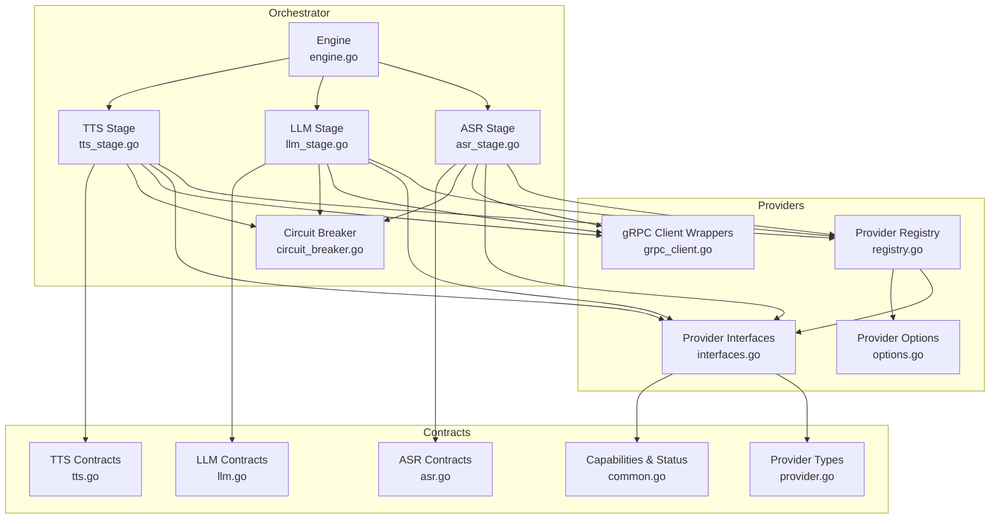
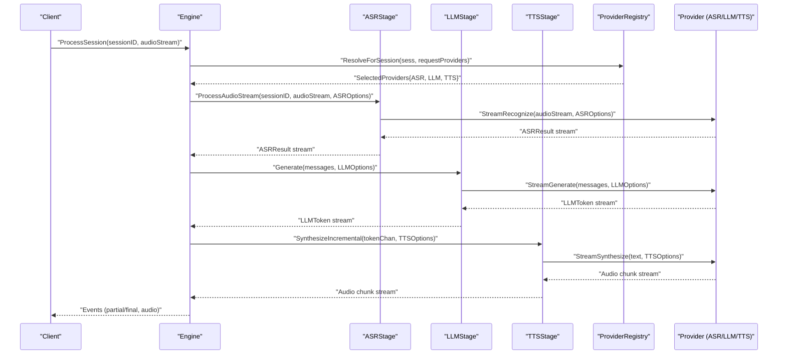
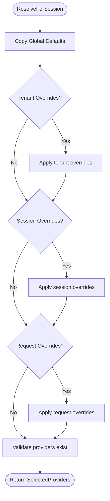
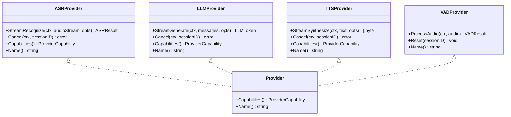
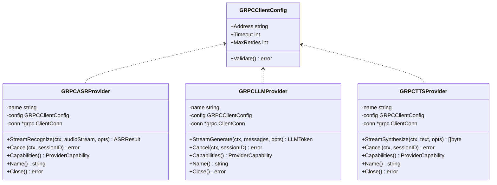
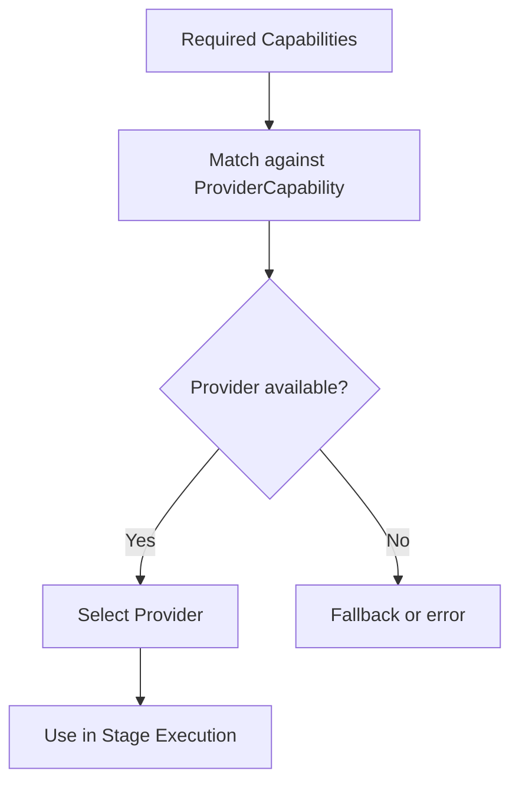
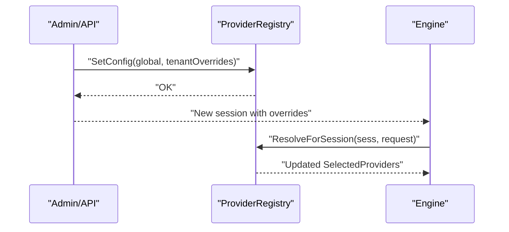
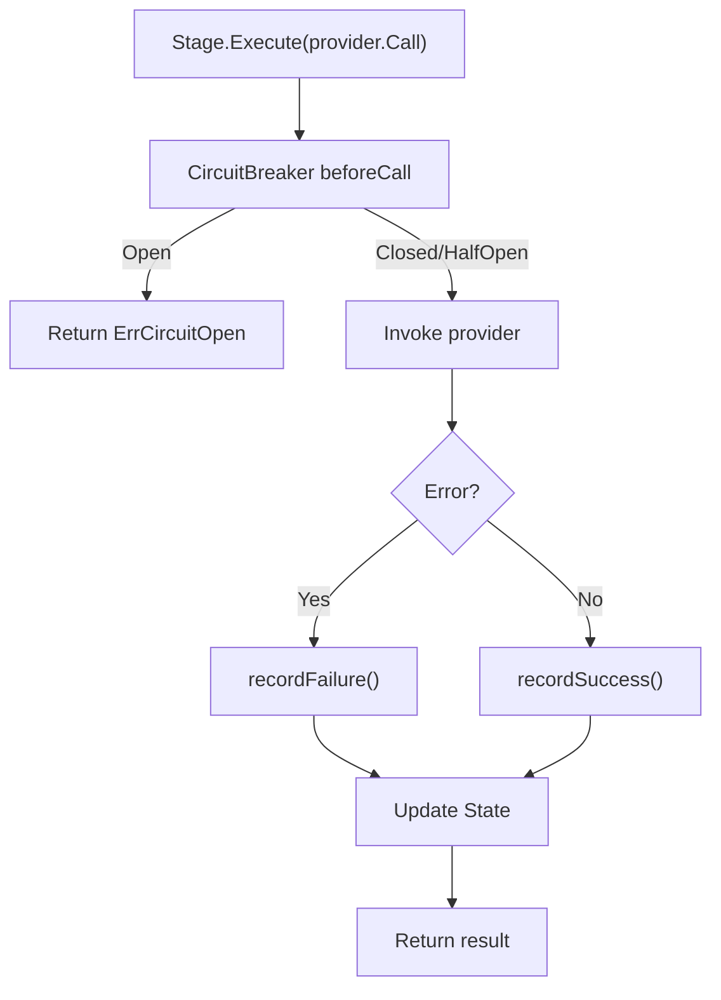
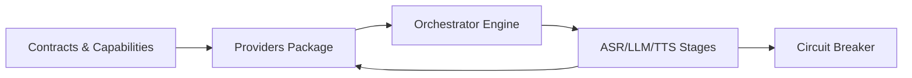

# Provider Coordination

<cite>
**Referenced Files in This Document**
- [registry.go](file://go/pkg/providers/registry.go)
- [grpc_client.go](file://go/pkg/providers/grpc_client.go)
- [interfaces.go](file://go/pkg/providers/interfaces.go)
- [options.go](file://go/pkg/providers/options.go)
- [provider.go](file://go/pkg/contracts/provider.go)
- [common.go](file://go/pkg/contracts/common.go)
- [asr.go](file://go/pkg/contracts/asr.go)
- [llm.go](file://go/pkg/contracts/llm.go)
- [tts.go](file://go/pkg/contracts/tts.go)
- [engine.go](file://go/orchestrator/internal/pipeline/engine.go)
- [asr_stage.go](file://go/orchestrator/internal/pipeline/asr_stage.go)
- [llm_stage.go](file://go/orchestrator/internal/pipeline/llm_stage.go)
- [tts_stage.go](file://go/orchestrator/internal/pipeline/tts_stage.go)
- [circuit_breaker.go](file://go/orchestrator/internal/pipeline/circuit_breaker.go)
- [session.go](file://go/pkg/session/session.go)
</cite>

## Table of Contents
1. [Introduction](#introduction)
2. [Project Structure](#project-structure)
3. [Core Components](#core-components)
4. [Architecture Overview](#architecture-overview)
5. [Detailed Component Analysis](#detailed-component-analysis)
6. [Dependency Analysis](#dependency-analysis)
7. [Performance Considerations](#performance-considerations)
8. [Troubleshooting Guide](#troubleshooting-guide)
9. [Conclusion](#conclusion)

## Introduction
This document explains Provider Coordination for integrating and managing external AI service providers (ASR, LLM, TTS, VAD) in a distributed voice orchestration system. It covers:
- The provider registry that dynamically discovers, registers, and selects providers per session
- The gRPC client abstraction enabling communication with provider gateway services
- The provider interface abstraction ensuring pluggability and consistent capabilities
- Provider capability discovery, dynamic selection, and runtime configuration updates
- Examples of registration, capability matching, and error handling
- Health monitoring, circuit breaker integration, and performance optimization

## Project Structure
Provider Coordination spans three layers:
- Contracts and Types: Shared data structures and enums for providers, capabilities, and health/status
- Providers Package: Registry, gRPC client wrappers, and provider interfaces
- Orchestrator Pipeline: Engine and stages that orchestrate ASR->LLM->TTS with circuit breakers and metrics

**Diagram sources**
- [provider.go:1-79](file://go/pkg/contracts/provider.go#L1-L79)
- [common.go:130-169](file://go/pkg/contracts/common.go#L130-L169)
- [asr.go:1-35](file://go/pkg/contracts/asr.go#L1-L35)
- [llm.go:1-36](file://go/pkg/contracts/llm.go#L1-L36)
- [tts.go:1-22](file://go/pkg/contracts/tts.go#L1-L22)
- [registry.go:14-262](file://go/pkg/providers/registry.go#L14-L262)
- [interfaces.go:21-107](file://go/pkg/providers/interfaces.go#L21-L107)
- [grpc_client.go:14-288](file://go/pkg/providers/grpc_client.go#L14-L288)
- [options.go:7-188](file://go/pkg/providers/options.go#L7-L188)
- [engine.go:17-106](file://go/orchestrator/internal/pipeline/engine.go#L17-L106)
- [asr_stage.go:25-313](file://go/orchestrator/internal/pipeline/asr_stage.go#L25-L313)
- [llm_stage.go:33-240](file://go/orchestrator/internal/pipeline/llm_stage.go#L33-L240)
- [tts_stage.go:16-313](file://go/orchestrator/internal/pipeline/tts_stage.go#L16-L313)
- [circuit_breaker.go:57-257](file://go/orchestrator/internal/pipeline/circuit_breaker.go#L57-L257)

**Section sources**
- [provider.go:1-79](file://go/pkg/contracts/provider.go#L1-L79)
- [common.go:130-169](file://go/pkg/contracts/common.go#L130-L169)
- [registry.go:14-262](file://go/pkg/providers/registry.go#L14-L262)
- [interfaces.go:21-107](file://go/pkg/providers/interfaces.go#L21-L107)
- [grpc_client.go:14-288](file://go/pkg/providers/grpc_client.go#L14-L288)
- [options.go:7-188](file://go/pkg/providers/options.go#L7-L188)
- [engine.go:17-106](file://go/orchestrator/internal/pipeline/engine.go#L17-L106)
- [asr_stage.go:25-313](file://go/orchestrator/internal/pipeline/asr_stage.go#L25-L313)
- [llm_stage.go:33-240](file://go/orchestrator/internal/pipeline/llm_stage.go#L33-L240)
- [tts_stage.go:16-313](file://go/orchestrator/internal/pipeline/tts_stage.go#L16-L313)
- [circuit_breaker.go:57-257](file://go/orchestrator/internal/pipeline/circuit_breaker.go#L57-L257)

## Core Components
- Provider Registry: Thread-safe registration and lookup of ASR/LLM/TTS/VAD providers; resolves provider selection per session with global defaults, tenant overrides, session overrides, and request overrides
- Provider Interfaces: Unified interfaces for ASR, LLM, TTS, and VAD with streaming methods, cancellation, capability reporting, and naming
- gRPC Client Wrappers: Provider implementations that wrap gRPC connections to external provider gateways; stubbed for ASR/LLM/TTS with capability metadata
- Provider Options: Typed options builders for ASR, LLM, and TTS with provider-specific options passthrough
- Contracts and Capabilities: Strongly typed provider capability descriptors, status, and health metadata
- Orchestrator Pipeline: Engine and stages that coordinate streaming pipelines with circuit breakers, metrics, and interruption handling

**Section sources**
- [registry.go:14-262](file://go/pkg/providers/registry.go#L14-L262)
- [interfaces.go:21-107](file://go/pkg/providers/interfaces.go#L21-L107)
- [grpc_client.go:14-288](file://go/pkg/providers/grpc_client.go#L14-L288)
- [options.go:7-188](file://go/pkg/providers/options.go#L7-L188)
- [provider.go:30-79](file://go/pkg/contracts/provider.go#L30-L79)
- [common.go:130-169](file://go/pkg/contracts/common.go#L130-L169)
- [engine.go:17-106](file://go/orchestrator/internal/pipeline/engine.go#L17-L106)

## Architecture Overview
Provider Coordination is orchestrated by the Engine, which delegates to typed stages for ASR, LLM, and TTS. Each stage wraps a provider with circuit breaker protection and metrics. Providers are resolved per session using the registry, which supports dynamic configuration and override precedence.

**Diagram sources**
- [engine.go:108-208](file://go/orchestrator/internal/pipeline/engine.go#L108-L208)
- [asr_stage.go:164-290](file://go/orchestrator/internal/pipeline/asr_stage.go#L164-L290)
- [llm_stage.go:58-185](file://go/orchestrator/internal/pipeline/llm_stage.go#L58-L185)
- [tts_stage.go:129-236](file://go/orchestrator/internal/pipeline/tts_stage.go#L129-L236)
- [registry.go:172-251](file://go/pkg/providers/registry.go#L172-L251)
- [interfaces.go:21-76](file://go/pkg/providers/interfaces.go#L21-L76)

## Detailed Component Analysis

### Provider Registry
- Responsibilities:
  - Register providers by type (ASR/LLM/TTS/VAD)
  - Lookup providers by name with thread-safe access
  - List registered providers per type
  - Resolve provider selection for a session with precedence: request overrides > session overrides > tenant overrides > global defaults
  - Validate that resolved providers exist at selection time
- Configuration:
  - Global defaults and tenant overrides stored as SelectedProviders
  - Thread-safe updates via SetConfig

**Diagram sources**
- [registry.go:172-251](file://go/pkg/providers/registry.go#L172-L251)

**Section sources**
- [registry.go:14-262](file://go/pkg/providers/registry.go#L14-L262)
- [session.go:34-40](file://go/pkg/session/session.go#L34-L40)

### Provider Interface Abstraction
- ASRProvider: Streaming recognition with partial/final transcripts, cancellation, capability reporting, and naming
- LLMProvider: Streaming generation with tokens, finish reasons, usage metadata, cancellation, capability reporting, and naming
- TTSProvider: Streaming synthesis with audio chunks, cancellation, capability reporting, and naming
- VADProvider: Audio processing and reset semantics
- Provider: Common capability and naming contract

**Diagram sources**
- [interfaces.go:21-107](file://go/pkg/providers/interfaces.go#L21-L107)
- [common.go:130-139](file://go/pkg/contracts/common.go#L130-L139)

**Section sources**
- [interfaces.go:21-107](file://go/pkg/providers/interfaces.go#L21-L107)
- [common.go:130-139](file://go/pkg/contracts/common.go#L130-L139)

### gRPC Client Implementation
- Purpose: Provide pluggable gRPC-backed providers for ASR, LLM, and TTS
- Features:
  - Configurable address, timeout, and retry policy
  - Validation of configuration
  - Connection lifecycle management
  - Capability metadata exposed per provider type
  - Cancellation support placeholders
- Current state: Stub implementations with capability metadata; gRPC client generation is noted as pending

**Diagram sources**
- [grpc_client.go:14-288](file://go/pkg/providers/grpc_client.go#L14-L288)

**Section sources**
- [grpc_client.go:14-288](file://go/pkg/providers/grpc_client.go#L14-L288)

### Provider Capability Discovery and Matching
- Capabilities are described via ProviderCapability with streaming support, preferred sample rates, supported codecs, and feature flags
- Engine stages and registry resolve providers based on capability compatibility and runtime selection
- Example capability profiles are embedded in gRPC provider stubs for ASR, LLM, and TTS

**Diagram sources**
- [common.go:130-139](file://go/pkg/contracts/common.go#L130-L139)
- [grpc_client.go:103-112](file://go/pkg/providers/grpc_client.go#L103-L112)
- [grpc_client.go:181-188](file://go/pkg/providers/grpc_client.go#L181-L188)
- [grpc_client.go:255-264](file://go/pkg/providers/grpc_client.go#L255-L264)

**Section sources**
- [common.go:130-139](file://go/pkg/contracts/common.go#L130-L139)
- [grpc_client.go:103-112](file://go/pkg/providers/grpc_client.go#L103-L112)
- [grpc_client.go:181-188](file://go/pkg/providers/grpc_client.go#L181-L188)
- [grpc_client.go:255-264](file://go/pkg/providers/grpc_client.go#L255-L264)

### Dynamic Provider Switching and Runtime Updates
- Provider selection precedence:
  1) Request overrides
  2) Session overrides
  3) Tenant overrides
  4) Global defaults
- Validation ensures selected providers exist before use
- Runtime updates are applied via SetConfig; subsequent sessions resolve new defaults

**Diagram sources**
- [registry.go:253-261](file://go/pkg/providers/registry.go#L253-L261)
- [registry.go:172-251](file://go/pkg/providers/registry.go#L172-L251)

**Section sources**
- [registry.go:172-261](file://go/pkg/providers/registry.go#L172-L261)
- [session.go:34-40](file://go/pkg/session/session.go#L34-L40)

### Provider Registration Examples
- Register ASR/LLM/TTS/VAD providers by name
- Retrieve providers by name for use in stages
- List registered providers per type

Practical steps:
- Create provider instances (e.g., gRPC-backed)
- Call RegisterASR/RegisterLLM/RegisterTTS/RegisterVAD on the registry
- Use GetASR/GetLLM/GetTTS/GetVAD to fetch by name
- Use ListASR/ListLLM/ListTTS/ListVAD to enumerate

**Section sources**
- [registry.go:42-164](file://go/pkg/providers/registry.go#L42-L164)

### Error Handling Strategies
- Circuit Breaker Pattern: Each stage wraps provider calls with a circuit breaker to prevent cascading failures and allow recovery
- Provider Errors: Contract-defined ProviderError with retriable flag and structured details
- Stage-level error propagation: Errors are emitted downstream and logged; partial results continue streaming when safe

**Diagram sources**
- [circuit_breaker.go:80-171](file://go/orchestrator/internal/pipeline/circuit_breaker.go#L80-L171)
- [asr_stage.go:72-92](file://go/orchestrator/internal/pipeline/asr_stage.go#L72-L92)
- [llm_stage.go:97-119](file://go/orchestrator/internal/pipeline/llm_stage.go#L97-L119)
- [tts_stage.go:67-89](file://go/orchestrator/internal/pipeline/tts_stage.go#L67-L89)

**Section sources**
- [circuit_breaker.go:57-171](file://go/orchestrator/internal/pipeline/circuit_breaker.go#L57-L171)
- [common.go:104-116](file://go/pkg/contracts/common.go#L104-L116)
- [asr_stage.go:120-128](file://go/orchestrator/internal/pipeline/asr_stage.go#L120-L128)
- [llm_stage.go:142-149](file://go/orchestrator/internal/pipeline/llm_stage.go#L142-L149)
- [tts_stage.go:107-115](file://go/orchestrator/internal/pipeline/tts_stage.go#L107-L115)

### Health Monitoring and Status
- ProviderInfo includes name, type, version, capabilities, status, and metadata
- ServingStatus and HealthCheckRequest/Response types support health checks
- Provider status can be used to filter candidates during capability matching

**Section sources**
- [provider.go:54-79](file://go/pkg/contracts/provider.go#L54-L79)
- [common.go:141-161](file://go/pkg/contracts/common.go#L141-L161)

## Dependency Analysis
Provider Coordination exhibits clean separation of concerns:
- Contracts define shared types and capabilities
- Providers package encapsulates registry, interfaces, and gRPC wrappers
- Orchestrator pipeline depends on providers and contracts, enforcing loose coupling
- Circuit breaker and metrics are integrated at stage level

**Diagram sources**
- [provider.go:1-79](file://go/pkg/contracts/provider.go#L1-L79)
- [common.go:130-169](file://go/pkg/contracts/common.go#L130-L169)
- [registry.go:14-262](file://go/pkg/providers/registry.go#L14-L262)
- [engine.go:17-106](file://go/orchestrator/internal/pipeline/engine.go#L17-L106)
- [asr_stage.go:25-45](file://go/orchestrator/internal/pipeline/asr_stage.go#L25-L45)
- [llm_stage.go:33-56](file://go/orchestrator/internal/pipeline/llm_stage.go#L33-L56)
- [tts_stage.go:16-39](file://go/orchestrator/internal/pipeline/tts_stage.go#L16-L39)
- [circuit_breaker.go:207-234](file://go/orchestrator/internal/pipeline/circuit_breaker.go#L207-L234)

**Section sources**
- [provider.go:1-79](file://go/pkg/contracts/provider.go#L1-L79)
- [common.go:130-169](file://go/pkg/contracts/common.go#L130-L169)
- [registry.go:14-262](file://go/pkg/providers/registry.go#L14-L262)
- [engine.go:17-106](file://go/orchestrator/internal/pipeline/engine.go#L17-L106)
- [asr_stage.go:25-45](file://go/orchestrator/internal/pipeline/asr_stage.go#L25-L45)
- [llm_stage.go:33-56](file://go/orchestrator/internal/pipeline/llm_stage.go#L33-L56)
- [tts_stage.go:16-39](file://go/orchestrator/internal/pipeline/tts_stage.go#L16-L39)
- [circuit_breaker.go:207-234](file://go/orchestrator/internal/pipeline/circuit_breaker.go#L207-L234)

## Performance Considerations
- Streaming-first design: All providers expose streaming APIs to minimize latency
- Incremental TTS: Segments text at natural boundaries to overlap LLM generation and TTS synthesis
- Circuit breaker thresholds: Tunable failure threshold, timeout, and half-open limits to balance resilience and recovery speed
- Metrics and timing: Per-stage metrics and timestamp tracking enable observability and optimization
- Connection lifecycle: gRPC client connections are managed per provider wrapper; consider pooling at the gateway layer for high concurrency

[No sources needed since this section provides general guidance]

## Troubleshooting Guide
Common scenarios and remedies:
- Provider not found: Verify registration and names; use List* APIs to enumerate
- Selection fails validation: Ensure resolved provider names exist; check tenant/session/request overrides
- Circuit breaker open: Inspect state and stats; adjust thresholds or allow recovery window
- Partial results with errors: Log and continue streaming; downstream logic should handle partial vs final
- Interruption handling: Confirm cancellation of LLM and TTS; ensure turn manager commits only spoken text

**Section sources**
- [registry.go:71-116](file://go/pkg/providers/registry.go#L71-L116)
- [registry.go:233-250](file://go/pkg/providers/registry.go#L233-L250)
- [circuit_breaker.go:173-198](file://go/orchestrator/internal/pipeline/circuit_breaker.go#L173-L198)
- [engine.go:377-436](file://go/orchestrator/internal/pipeline/engine.go#L377-L436)
- [asr_stage.go:120-128](file://go/orchestrator/internal/pipeline/asr_stage.go#L120-L128)
- [llm_stage.go:142-149](file://go/orchestrator/internal/pipeline/llm_stage.go#L142-L149)
- [tts_stage.go:107-115](file://go/orchestrator/internal/pipeline/tts_stage.go#L107-L115)

## Conclusion
Provider Coordination delivers a robust, pluggable framework for integrating external AI services:
- Registry-driven selection with clear precedence and validation
- Consistent provider interfaces and capability modeling
- gRPC client wrappers ready for external gateway integration
- Circuit breaker and metrics for reliability and observability
- Streaming orchestration enabling low-latency, interruptible conversational AI

Future enhancements include:
- Full gRPC client generation and connection pooling
- Health checks and dynamic provider blacklisting
- Advanced load balancing and failover policies
- Enhanced capability matching and auto-selection