# Session Lifecycle

<cite>
**Referenced Files in This Document**
- [session.go](file://go/pkg/session/session.go)
- [state.go](file://go/pkg/session/state.go)
- [history.go](file://go/pkg/session/history.go)
- [store.go](file://go/pkg/session/store.go)
- [redis_store.go](file://go/pkg/session/redis_store.go)
- [postgres_store.go](file://go/pkg/session/postgres_store.go)
- [turn.go](file://go/pkg/session/turn.go)
- [fsm.go](file://go/orchestrator/internal/statemachine/fsm.go)
- [turn_manager.go](file://go/orchestrator/internal/statemachine/turn_manager.go)
- [session_handler.go](file://go/media-edge/internal/handler/session_handler.go)
- [config.go](file://go/pkg/config/config.go)
- [session_test.go](file://go/pkg/session/session_test.go)
</cite>

## Table of Contents
1. [Introduction](#introduction)
2. [Project Structure](#project-structure)
3. [Core Components](#core-components)
4. [Architecture Overview](#architecture-overview)
5. [Detailed Component Analysis](#detailed-component-analysis)
6. [Dependency Analysis](#dependency-analysis)
7. [Performance Considerations](#performance-considerations)
8. [Troubleshooting Guide](#troubleshooting-guide)
9. [Conclusion](#conclusion)

## Introduction
This document explains the Session Lifecycle in the system, covering session creation, state transitions, conversation history management, and storage abstractions. It details how sessions move through active states (listening, processing, speaking, interrupted), how assistant turns are tracked and committed to history, and how sessions are persisted using Redis and PostgreSQL. It also covers initialization with system prompts and model configurations, runtime updates, cleanup, timeouts, concurrency, and integration points across media-edge, orchestrator, and persistence layers.

## Project Structure
The session lifecycle spans three primary areas:
- Session model and state machine in the pkg/session package
- Turn management and orchestration in the orchestrator’s statemachine package
- Media-edge handler coordinating audio pipeline and state transitions
- Storage backends for sessions and events/history in pkg/session and stubbed PostgreSQL

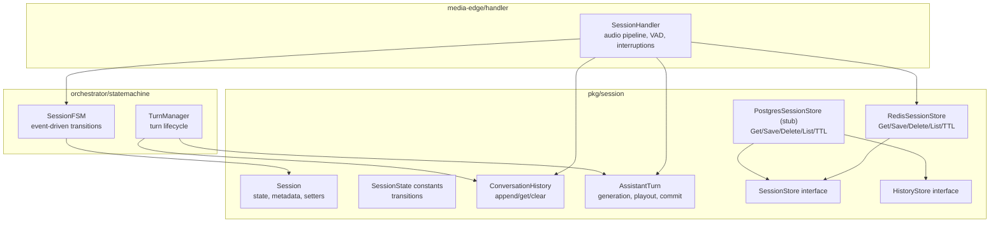

**Diagram sources**
- [session.go:62-84](file://go/pkg/session/session.go#L62-L84)
- [state.go:11-17](file://go/pkg/session/state.go#L11-L17)
- [history.go:13-17](file://go/pkg/session/history.go#L13-L17)
- [turn.go:10-25](file://go/pkg/session/turn.go#L10-L25)
- [redis_store.go:12-18](file://go/pkg/session/redis_store.go#L12-L18)
- [postgres_store.go:10-15](file://go/pkg/session/postgres_store.go#L10-L15)
- [fsm.go:44-54](file://go/orchestrator/internal/statemachine/fsm.go#L44-L54)
- [turn_manager.go:11-17](file://go/orchestrator/internal/statemachine/turn_manager.go#L11-L17)
- [session_handler.go:17-51](file://go/media-edge/internal/handler/session_handler.go#L17-L51)

**Section sources**
- [session.go:62-84](file://go/pkg/session/session.go#L62-L84)
- [state.go:11-17](file://go/pkg/session/state.go#L11-L17)
- [history.go:13-17](file://go/pkg/session/history.go#L13-L17)
- [turn.go:10-25](file://go/pkg/session/turn.go#L10-L25)
- [redis_store.go:12-18](file://go/pkg/session/redis_store.go#L12-L18)
- [postgres_store.go:10-15](file://go/pkg/session/postgres_store.go#L10-L15)
- [fsm.go:44-54](file://go/orchestrator/internal/statemachine/fsm.go#L44-L54)
- [turn_manager.go:11-17](file://go/orchestrator/internal/statemachine/turn_manager.go#L11-L17)
- [session_handler.go:17-51](file://go/media-edge/internal/handler/session_handler.go#L17-L51)

## Core Components
- Session model: encapsulates identity, transport, providers, audio/voice/model options, runtime flags (bot speaking, interrupted), active turn, and timestamps. Thread-safe setters update UpdatedAt and enforce state transitions.
- Session state model: five states (idle, listening, processing, speaking, interrupted) with explicit allowed transitions and validation.
- Assistant turn: tracks generated, queued-for-TTS, and spoken text; playout cursor and interruption state; supports commit of spoken-only text to history.
- Conversation history: thread-safe append/clear with configurable max size; preserves system messages while trimming oldest user/assistant entries.
- Storage abstraction: interface for session persistence and event/history persistence; Redis backend implemented; PostgreSQL backend stubbed.
- Orchestration state machine: event-driven finite state machine mirroring session states; handlers for enter/exit and general transitions; supports multiple sessions via a manager.
- Turn manager: orchestrates assistant turn lifecycle within a session; integrates playout progress and interruption; commits only spoken text to history.
- Media-edge session handler: drives audio pipeline, VAD, interruptions, and state transitions; coordinates with orchestrator bridge and emits events.

**Section sources**
- [session.go:62-84](file://go/pkg/session/session.go#L62-L84)
- [state.go:11-17](file://go/pkg/session/state.go#L11-L17)
- [turn.go:10-25](file://go/pkg/session/turn.go#L10-L25)
- [history.go:13-17](file://go/pkg/session/history.go#L13-L17)
- [store.go:16-35](file://go/pkg/session/store.go#L16-L35)
- [redis_store.go:12-18](file://go/pkg/session/redis_store.go#L12-L18)
- [postgres_store.go:10-15](file://go/pkg/session/postgres_store.go#L10-L15)
- [fsm.go:44-54](file://go/orchestrator/internal/statemachine/fsm.go#L44-L54)
- [turn_manager.go:11-17](file://go/orchestrator/internal/statemachine/turn_manager.go#L11-L17)
- [session_handler.go:17-51](file://go/media-edge/internal/handler/session_handler.go#L17-L51)

## Architecture Overview
The session lifecycle is orchestrated by the media-edge SessionHandler, which reacts to audio events and orchestrator events to drive state changes. The orchestrator’s SessionFSM enforces valid transitions and emits turn events. Assistant turns are managed by TurnManager, which advances playout and commits spoken text to history. Sessions are persisted via Redis (implemented) or PostgreSQL (stubbed), and configuration is loaded from YAML.

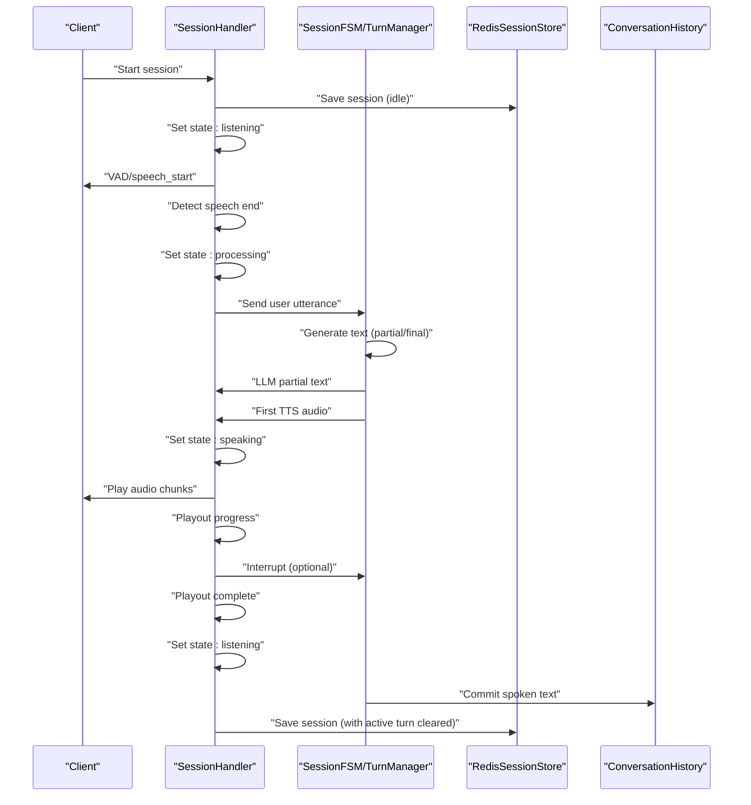

**Diagram sources**
- [session_handler.go:120-147](file://go/media-edge/internal/handler/session_handler.go#L120-L147)
- [session_handler.go:258-265](file://go/media-edge/internal/handler/session_handler.go#L258-L265)
- [session_handler.go:344-364](file://go/media-edge/internal/handler/session_handler.go#L344-L364)
- [session_handler.go:366-378](file://go/media-edge/internal/handler/session_handler.go#L366-L378)
- [session_handler.go:442-460](file://go/media-edge/internal/handler/session_handler.go#L442-L460)
- [fsm.go:101-161](file://go/orchestrator/internal/statemachine/fsm.go#L101-L161)
- [turn_manager.go:105-130](file://go/orchestrator/internal/statemachine/turn_manager.go#L105-L130)
- [redis_store.go:62-85](file://go/pkg/session/redis_store.go#L62-L85)
- [history.go:43-59](file://go/pkg/session/history.go#L43-L59)

## Detailed Component Analysis

### Session State Model and Transitions
- States: idle, listening, processing, speaking, interrupted.
- Allowed transitions are validated against a static map; attempting invalid transitions returns an error.
- Session.SetState enforces validation and updates timestamps; state machine helpers expose convenience predicates.

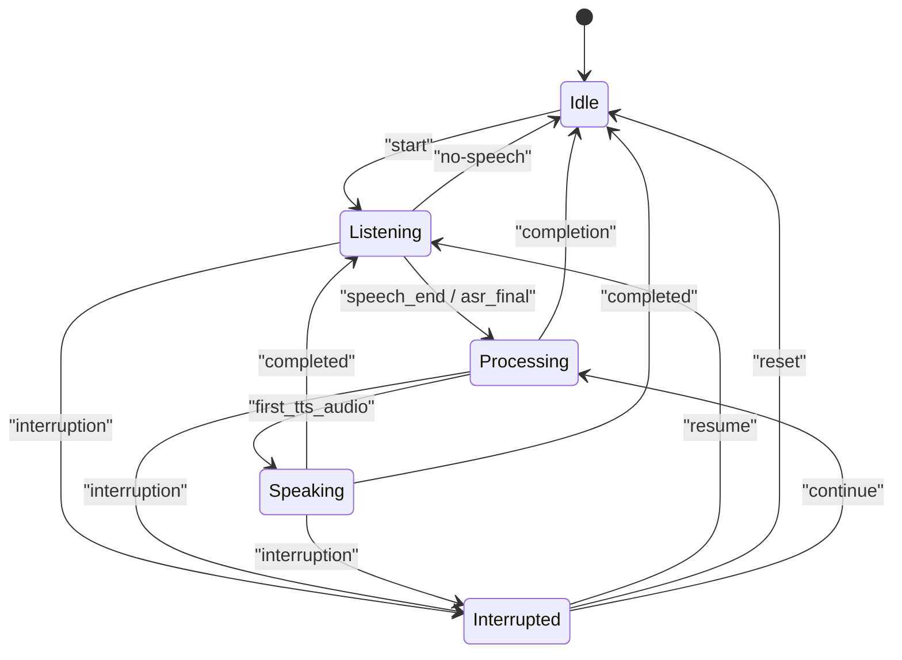

**Diagram sources**
- [state.go:37-62](file://go/pkg/session/state.go#L37-L62)
- [fsm.go:164-200](file://go/orchestrator/internal/statemachine/fsm.go#L164-L200)

**Section sources**
- [state.go:11-17](file://go/pkg/session/state.go#L11-L17)
- [state.go:37-76](file://go/pkg/session/state.go#L37-L76)
- [fsm.go:101-161](file://go/orchestrator/internal/statemachine/fsm.go#L101-L161)

### Session Initialization, Runtime Updates, and Cleanup
- Creation: NewSession initializes state to idle, sets timestamps, and assigns transport type.
- Runtime updates: SetTenantID, SetProviders, SetAudioProfile, SetVoiceProfile, SetModelOptions, SetActiveTurn, SetBotSpeaking, SetInterrupted, Touch.
- Cleanup: Stop cancels context, closes buffers, and signals orchestrator to stop; session state resets to idle.

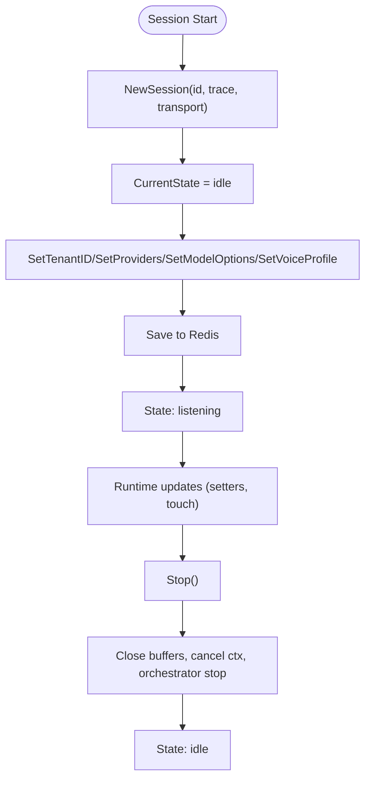

**Diagram sources**
- [session.go:87-97](file://go/pkg/session/session.go#L87-L97)
- [session.go:99-138](file://go/pkg/session/session.go#L99-L138)
- [session.go:140-208](file://go/pkg/session/session.go#L140-L208)
- [session_handler.go:149-174](file://go/media-edge/internal/handler/session_handler.go#L149-L174)

**Section sources**
- [session.go:87-97](file://go/pkg/session/session.go#L87-L97)
- [session.go:99-138](file://go/pkg/session/session.go#L99-L138)
- [session.go:140-208](file://go/pkg/session/session.go#L140-L208)
- [session_handler.go:149-174](file://go/media-edge/internal/handler/session_handler.go#L149-L174)

### Assistant Turn Lifecycle and Commitment to History
- Turn creation: NewAssistantTurn with generation ID and sample rate.
- Generation and queuing: AppendGeneratedText, QueueForTTS.
- Playout tracking: AdvancePlayout increments cursor; CurrentPosition estimates duration.
- Interruption: MarkInterrupted truncates to current playout position; GetCommittableText returns only spoken text.
- Commitment: CommitTurn appends spoken text to history and clears current turn.

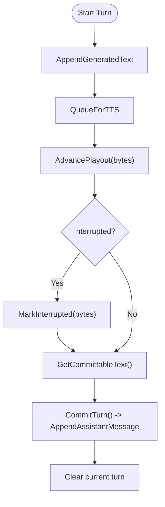

**Diagram sources**
- [turn.go:28-34](file://go/pkg/session/turn.go#L28-L34)
- [turn.go:37-48](file://go/pkg/session/turn.go#L37-L48)
- [turn.go:58-62](file://go/pkg/session/turn.go#L58-L62)
- [turn.go:125-137](file://go/pkg/session/turn.go#L125-L137)
- [turn.go:97-106](file://go/pkg/session/turn.go#L97-L106)
- [turn.go:108-123](file://go/pkg/session/turn.go#L108-L123)
- [turn_manager.go:105-130](file://go/orchestrator/internal/statemachine/turn_manager.go#L105-L130)
- [history.go:43-59](file://go/pkg/session/history.go#L43-L59)

**Section sources**
- [turn.go:28-34](file://go/pkg/session/turn.go#L28-L34)
- [turn.go:37-48](file://go/pkg/session/turn.go#L37-L48)
- [turn.go:58-62](file://go/pkg/session/turn.go#L58-L62)
- [turn.go:125-137](file://go/pkg/session/turn.go#L125-L137)
- [turn.go:97-106](file://go/pkg/session/turn.go#L97-L106)
- [turn.go:108-123](file://go/pkg/session/turn.go#L108-L123)
- [turn_manager.go:105-130](file://go/orchestrator/internal/statemachine/turn_manager.go#L105-L130)
- [history.go:43-59](file://go/pkg/session/history.go#L43-L59)

### Conversation History Management
- AppendUserMessage, AppendAssistantMessage, AppendSystemMessage maintain order and roles.
- GetPromptContext composes system prompt plus recent user/assistant messages, respecting max context size.
- Clear removes all messages; Len returns current count.
- Trimming preserves system messages while discarding oldest non-system entries when exceeding maxSize.

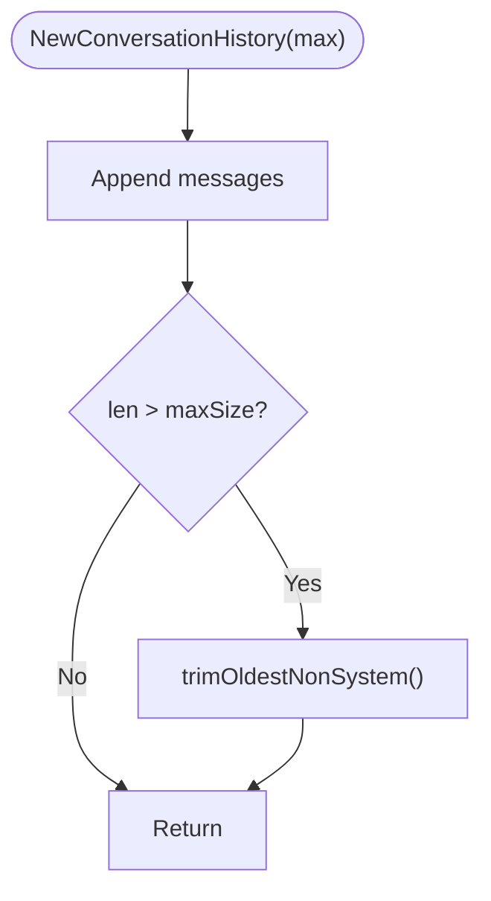

**Diagram sources**
- [history.go:19-28](file://go/pkg/session/history.go#L19-L28)
- [history.go:30-72](file://go/pkg/session/history.go#L30-L72)
- [history.go:84-115](file://go/pkg/session/history.go#L84-L115)
- [history.go:157-198](file://go/pkg/session/history.go#L157-L198)

**Section sources**
- [history.go:19-28](file://go/pkg/session/history.go#L19-L28)
- [history.go:30-72](file://go/pkg/session/history.go#L30-L72)
- [history.go:84-115](file://go/pkg/session/history.go#L84-L115)
- [history.go:157-198](file://go/pkg/session/history.go#L157-L198)

### Session Storage Abstraction and Backends
- SessionStore interface defines Get, Save, Delete, UpdateTurn, List, Close.
- RedisSessionStore implements all operations with JSON serialization, TTL, and metrics; supports List via key scanning and TTL extension.
- PostgresSessionStore is a stub with TODO comments; intended to implement durable persistence, events, history, and archival.

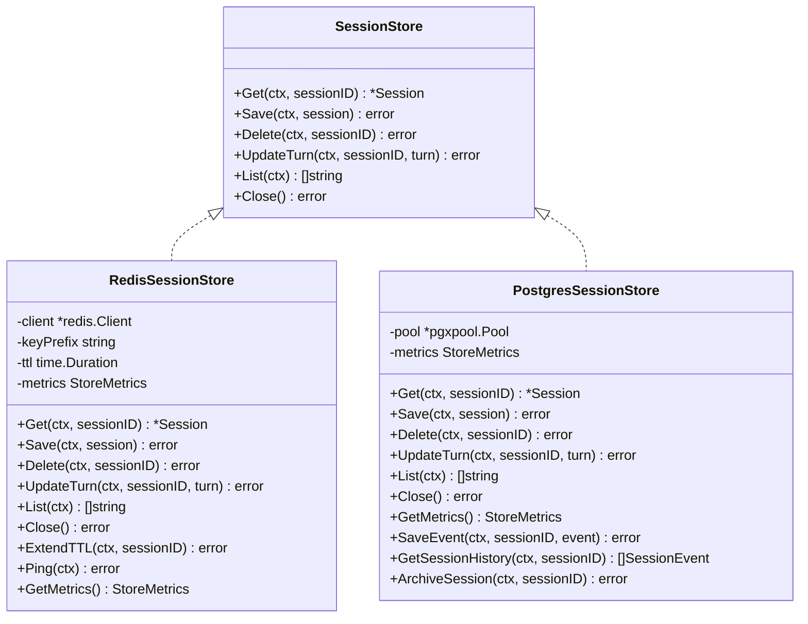

**Diagram sources**
- [store.go:16-35](file://go/pkg/session/store.go#L16-L35)
- [redis_store.go:12-18](file://go/pkg/session/redis_store.go#L12-L18)
- [postgres_store.go:10-15](file://go/pkg/session/postgres_store.go#L10-L15)

**Section sources**
- [store.go:16-35](file://go/pkg/session/store.go#L16-L35)
- [redis_store.go:12-18](file://go/pkg/session/redis_store.go#L12-L18)
- [redis_store.go:38-85](file://go/pkg/session/redis_store.go#L38-L85)
- [redis_store.go:105-144](file://go/pkg/session/redis_store.go#L105-L144)
- [postgres_store.go:10-15](file://go/pkg/session/postgres_store.go#L10-L15)
- [postgres_store.go:25-58](file://go/pkg/session/postgres_store.go#L25-L58)

### Integration with Orchestrator and Media-Edge
- SessionFSM mirrors session states and emits turn events; supports on-enter/on-exit handlers and general transition callbacks.
- TurnManager coordinates turn lifecycle, integrates playout progress and interruption, and commits spoken text to history.
- SessionHandler drives audio pipeline, VAD, interruptions, and state transitions; forwards orchestrator events to client; updates playout cursor based on audio output.

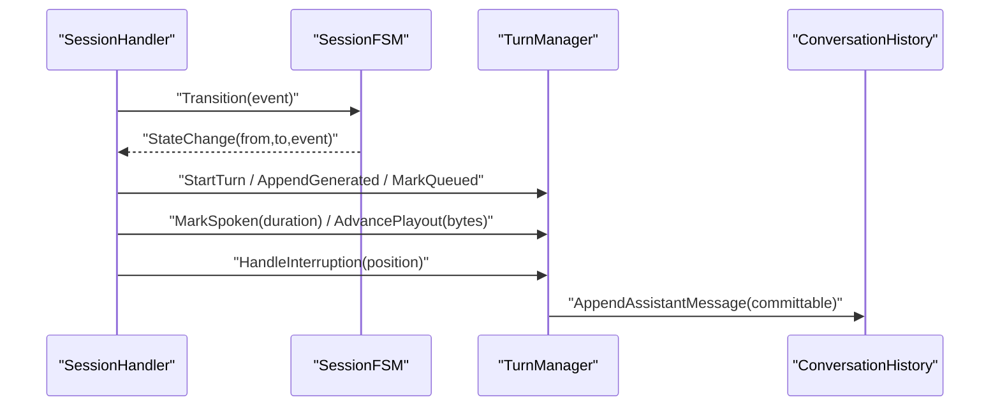

**Diagram sources**
- [fsm.go:101-161](file://go/orchestrator/internal/statemachine/fsm.go#L101-L161)
- [turn_manager.go:27-34](file://go/orchestrator/internal/statemachine/turn_manager.go#L27-L34)
- [turn_manager.go:56-84](file://go/orchestrator/internal/statemachine/turn_manager.go#L56-L84)
- [turn_manager.go:86-104](file://go/orchestrator/internal/statemachine/turn_manager.go#L86-L104)
- [turn_manager.go:105-130](file://go/orchestrator/internal/statemachine/turn_manager.go#L105-L130)
- [history.go:43-59](file://go/pkg/session/history.go#L43-L59)

**Section sources**
- [fsm.go:44-54](file://go/orchestrator/internal/statemachine/fsm.go#L44-L54)
- [fsm.go:101-161](file://go/orchestrator/internal/statemachine/fsm.go#L101-L161)
- [turn_manager.go:11-17](file://go/orchestrator/internal/statemachine/turn_manager.go#L11-L17)
- [turn_manager.go:27-34](file://go/orchestrator/internal/statemachine/turn_manager.go#L27-L34)
- [turn_manager.go:56-84](file://go/orchestrator/internal/statemachine/turn_manager.go#L56-L84)
- [turn_manager.go:86-104](file://go/orchestrator/internal/statemachine/turn_manager.go#L86-L104)
- [turn_manager.go:105-130](file://go/orchestrator/internal/statemachine/turn_manager.go#L105-L130)
- [session_handler.go:317-403](file://go/media-edge/internal/handler/session_handler.go#L317-L403)

### Session Timeout Handling and Concurrency
- Redis TTL: RedisSessionStore saves with configured TTL and exposes ExtendTTL to refresh lifetime.
- Max session limits: StoreConfig supports MaxSessions; Validate sets defaults.
- Concurrency: Session, AssistantTurn, ConversationHistory use RWMutex for thread-safe operations; Clone and GetActiveTurn return copies to prevent races.

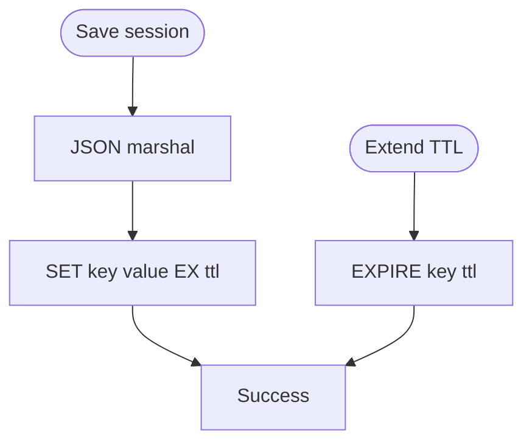

**Diagram sources**
- [redis_store.go:62-85](file://go/pkg/session/redis_store.go#L62-L85)
- [redis_store.go:156-160](file://go/pkg/session/redis_store.go#L156-L160)
- [store.go:37-57](file://go/pkg/session/store.go#L37-L57)

**Section sources**
- [redis_store.go:62-85](file://go/pkg/session/redis_store.go#L62-L85)
- [redis_store.go:156-160](file://go/pkg/session/redis_store.go#L156-L160)
- [store.go:37-57](file://go/pkg/session/store.go#L37-L57)
- [session.go:210-241](file://go/pkg/session/session.go#L210-L241)
- [turn.go:182-205](file://go/pkg/session/turn.go#L182-L205)
- [history.go:74-82](file://go/pkg/session/history.go#L74-L82)

### Configuration and Initialization Examples
- System prompts and model options: SetModelOptions updates SystemPrompt and model configuration; UpdateConfig in SessionHandler applies runtime changes.
- Provider selection: SetProviders configures ASR/LLM/TTS/VAD; VoiceProfile controls TTS speed/pitch.
- Storage configuration: AppConfig includes Redis and Postgres sections; Validate ensures defaults.

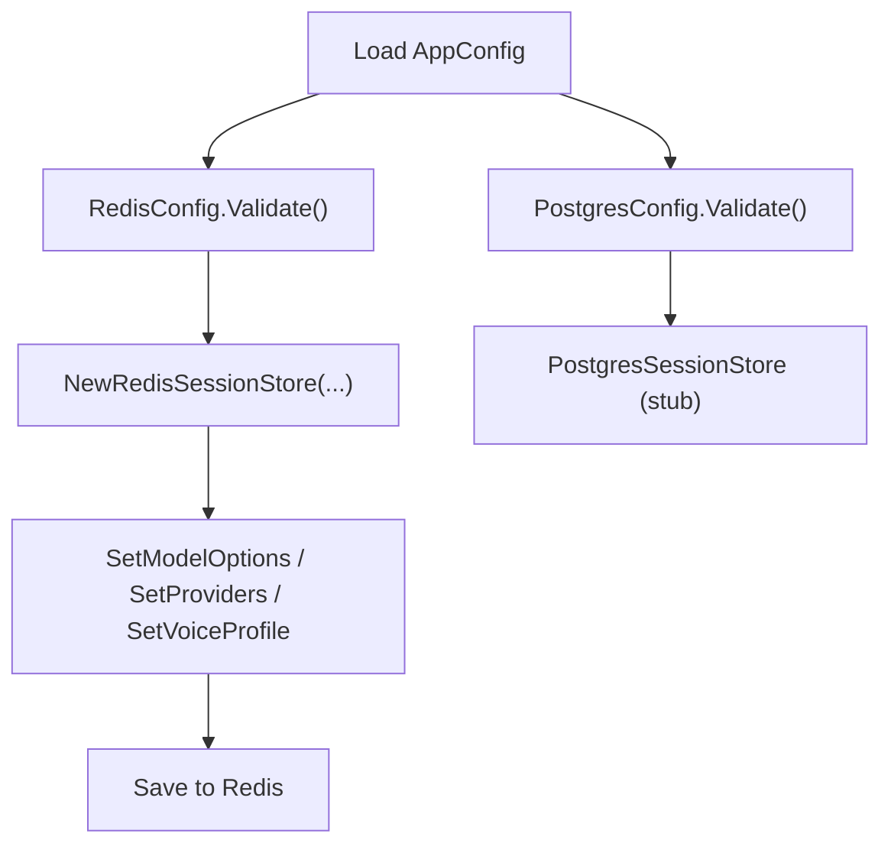

**Diagram sources**
- [config.go:30-44](file://go/pkg/config/config.go#L30-L44)
- [config.go:96-171](file://go/pkg/config/config.go#L96-L171)
- [session.go:131-138](file://go/pkg/session/session.go#L131-L138)
- [session_handler.go:476-515](file://go/media-edge/internal/handler/session_handler.go#L476-L515)
- [redis_store.go:20-36](file://go/pkg/session/redis_store.go#L20-L36)

**Section sources**
- [config.go:30-44](file://go/pkg/config/config.go#L30-L44)
- [config.go:96-171](file://go/pkg/config/config.go#L96-L171)
- [session.go:131-138](file://go/pkg/session/session.go#L131-L138)
- [session_handler.go:476-515](file://go/media-edge/internal/handler/session_handler.go#L476-L515)
- [redis_store.go:20-36](file://go/pkg/session/redis_store.go#L20-L36)

## Dependency Analysis
- SessionHandler depends on SessionFSM and TurnManager for orchestration and on RedisSessionStore for persistence.
- TurnManager depends on AssistantTurn and ConversationHistory for turn lifecycle and history.
- RedisSessionStore implements SessionStore and uses JSON serialization with TTL.
- PostgreSQL backend is currently a stub; future implementations will depend on the same interfaces.

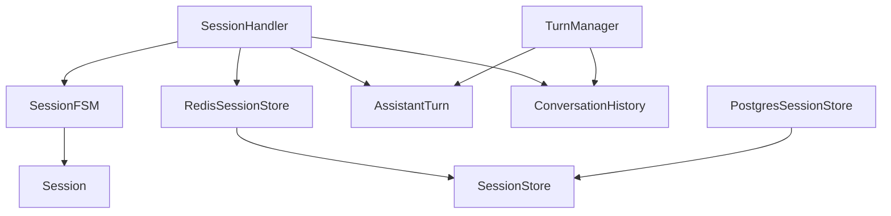

**Diagram sources**
- [session_handler.go:17-51](file://go/media-edge/internal/handler/session_handler.go#L17-L51)
- [fsm.go:44-54](file://go/orchestrator/internal/statemachine/fsm.go#L44-L54)
- [turn_manager.go:11-17](file://go/orchestrator/internal/statemachine/turn_manager.go#L11-L17)
- [redis_store.go:12-18](file://go/pkg/session/redis_store.go#L12-L18)
- [postgres_store.go:10-15](file://go/pkg/session/postgres_store.go#L10-L15)

**Section sources**
- [session_handler.go:17-51](file://go/media-edge/internal/handler/session_handler.go#L17-L51)
- [fsm.go:44-54](file://go/orchestrator/internal/statemachine/fsm.go#L44-L54)
- [turn_manager.go:11-17](file://go/orchestrator/internal/statemachine/turn_manager.go#L11-L17)
- [redis_store.go:12-18](file://go/pkg/session/redis_store.go#L12-L18)
- [postgres_store.go:10-15](file://go/pkg/session/postgres_store.go#L10-L15)

## Performance Considerations
- Use Redis for low-latency session reads/writes and TTL-based expiration; leverage ExtendTTL to keep active sessions alive.
- Limit conversation history size to reduce memory and serialization overhead; trimming preserves system messages.
- Serialize sessions as JSON; batch operations where possible to minimize network round-trips.
- Monitor StoreMetrics for Gets/Saves/Errors to detect hotspots or misconfiguration.

[No sources needed since this section provides general guidance]

## Troubleshooting Guide
- Invalid state transition errors: Attempting transitions outside the allowed set triggers an error; verify event flow and state machine wiring.
- Session not found: Redis Get returns a not-found error; confirm session keys and prefixes.
- Persistence stubs: PostgreSQL store methods return “not implemented” errors; implement or switch to Redis for development.
- Interruption handling: Ensure playout position is accurately calculated and passed to MarkInterrupted; verify CommitTurn appends only spoken text.

**Section sources**
- [state.go:78-79](file://go/pkg/session/state.go#L78-L79)
- [redis_store.go:42-58](file://go/pkg/session/redis_store.go#L42-L58)
- [postgres_store.go:27-57](file://go/pkg/session/postgres_store.go#L27-L57)
- [turn_manager.go:86-104](file://go/orchestrator/internal/statemachine/turn_manager.go#L86-L104)
- [turn_manager.go:105-130](file://go/orchestrator/internal/statemachine/turn_manager.go#L105-L130)

## Conclusion
The session lifecycle integrates a robust state model, turn management, and history handling with flexible storage backends. Redis provides efficient, short-term session persistence with TTL support, while PostgreSQL offers a path to durable storage and auditing. The media-edge and orchestrator components coordinate audio, interruptions, and state transitions, ensuring a responsive and reliable conversational experience.