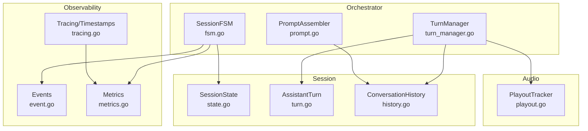
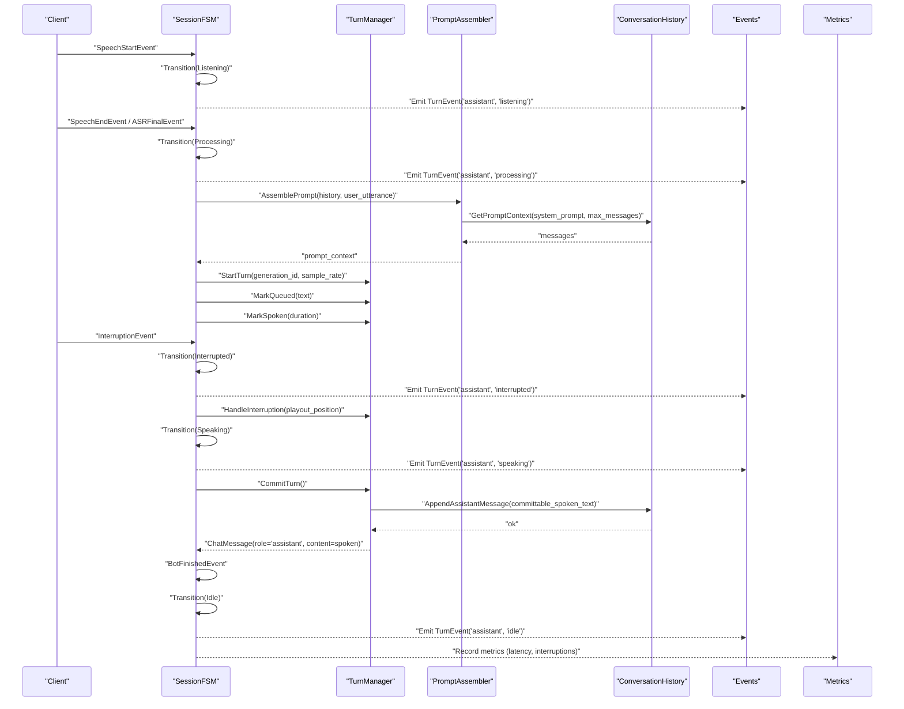
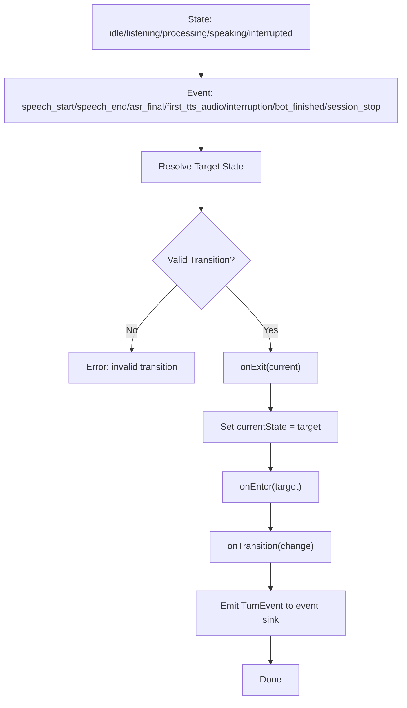
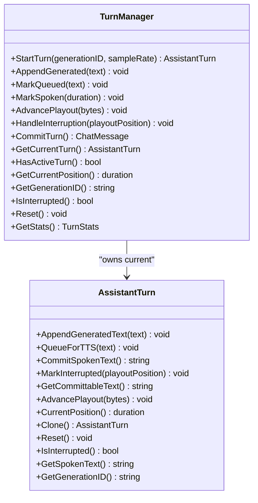
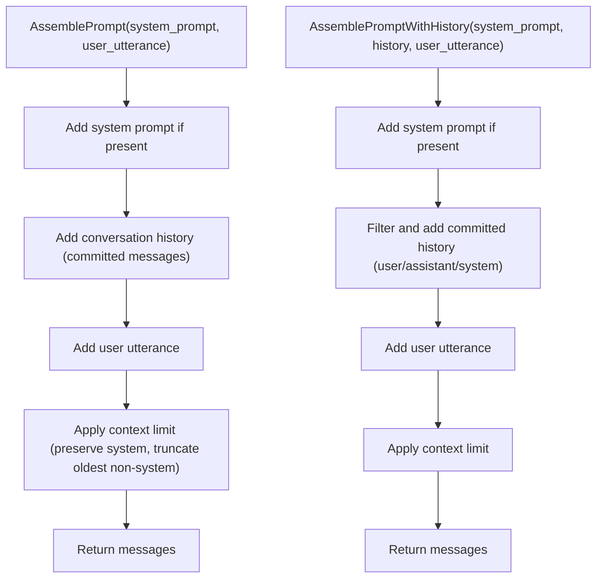
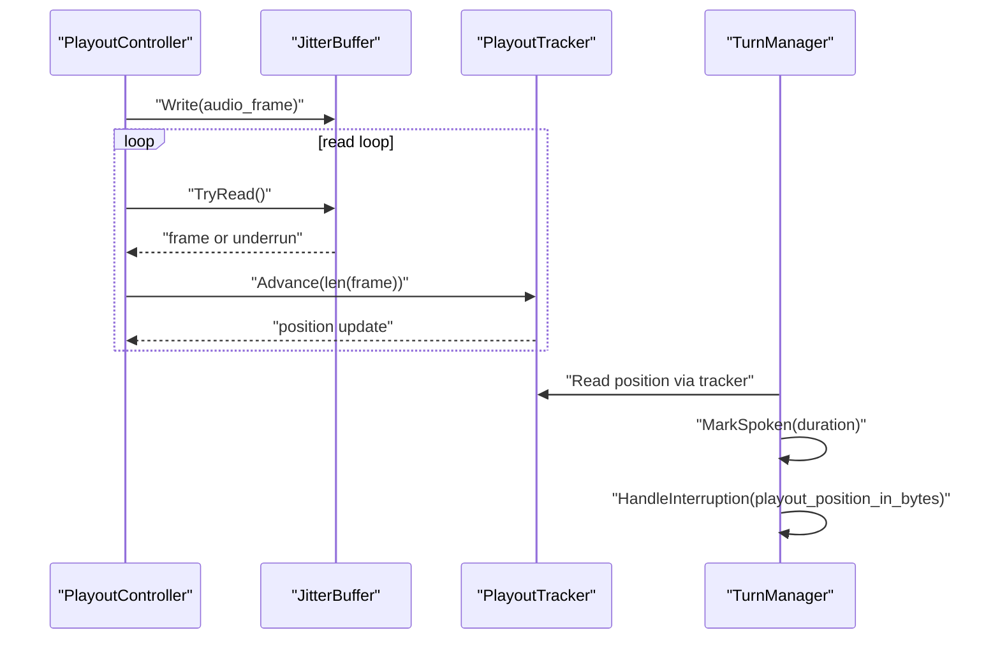
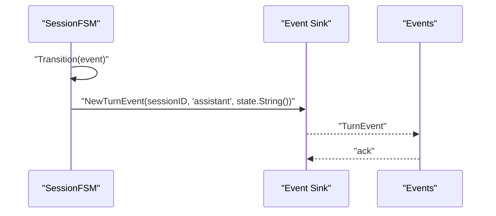
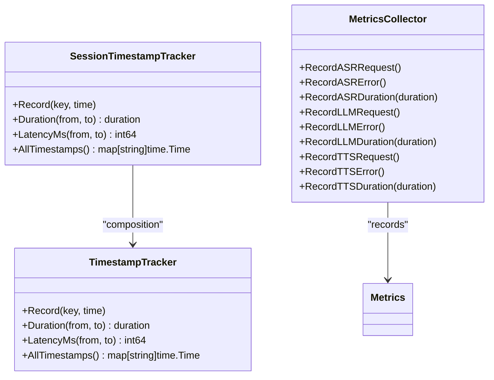
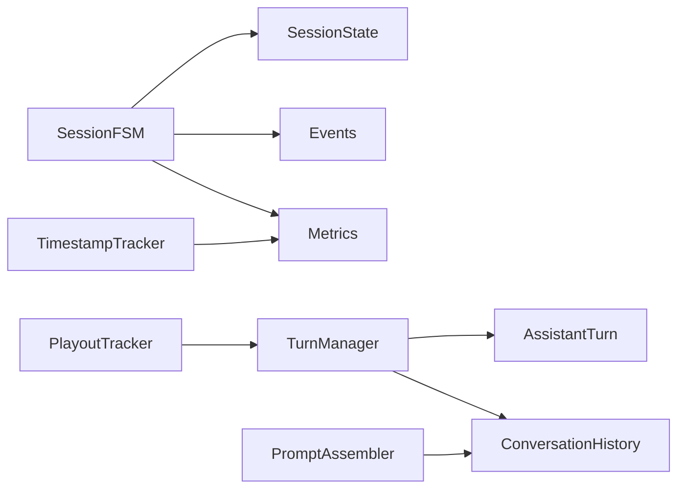

# State Management

<cite>
**Referenced Files in This Document**
- [fsm.go](file://go/orchestrator/internal/statemachine/fsm.go)
- [turn_manager.go](file://go/orchestrator/internal/statemachine/turn_manager.go)
- [state.go](file://go/pkg/session/state.go)
- [turn.go](file://go/pkg/session/turn.go)
- [history.go](file://go/pkg/session/history.go)
- [prompt.go](file://go/orchestrator/internal/pipeline/prompt.go)
- [event.go](file://go/pkg/events/event.go)
- [metrics.go](file://go/pkg/observability/metrics.go)
- [playout.go](file://go/pkg/audio/playout.go)
- [fsm_test.go](file://go/orchestrator/internal/statemachine/fsm_test.go)
- [turn_manager_test.go](file://go/orchestrator/internal/statemachine/turn_manager_test.go)
- [tracing.go](file://go/pkg/observability/tracing.go)
</cite>

## Table of Contents
1. [Introduction](#introduction)
2. [Project Structure](#project-structure)
3. [Core Components](#core-components)
4. [Architecture Overview](#architecture-overview)
5. [Detailed Component Analysis](#detailed-component-analysis)
6. [Dependency Analysis](#dependency-analysis)
7. [Performance Considerations](#performance-considerations)
8. [Troubleshooting Guide](#troubleshooting-guide)
9. [Conclusion](#conclusion)

## Introduction
This document explains the State Management system that controls conversation flow and turn-based interactions. It covers the finite state machine (FSM) that governs session states (idle, listening, processing, speaking, interrupted), the TurnManager that tracks user and assistant turns, the prompt assembly system that builds contextual prompts from conversation history and system instructions, and the integration with audio processing and observability metrics. It also documents state transition logic, event-driven state changes, and timestamp tracking for performance measurement.

## Project Structure
The state management system spans several packages:
- Orchestrator state machine and turn management live under the statemachine package.
- Session-level abstractions (states, turns, history) live under the session package.
- Prompt assembly and pipeline logic live under the pipeline package.
- Events, metrics, tracing, and audio playout utilities support cross-cutting concerns.

**Diagram sources**
- [fsm.go:44-92](file://go/orchestrator/internal/statemachine/fsm.go#L44-L92)
- [turn_manager.go:11-25](file://go/orchestrator/internal/statemachine/turn_manager.go#L11-L25)
- [prompt.go:8-21](file://go/orchestrator/internal/pipeline/prompt.go#L8-L21)
- [state.go:8-35](file://go/pkg/session/state.go#L8-L35)
- [turn.go:9-25](file://go/pkg/session/turn.go#L9-L25)
- [history.go:11-28](file://go/pkg/session/history.go#L11-L28)
- [event.go:11-35](file://go/pkg/events/event.go#L11-L35)
- [metrics.go:10-82](file://go/pkg/observability/metrics.go#L10-L82)
- [playout.go:9-24](file://go/pkg/audio/playout.go#L9-L24)
- [tracing.go:200-205](file://go/pkg/observability/tracing.go#L200-L205)

**Section sources**
- [fsm.go:44-92](file://go/orchestrator/internal/statemachine/fsm.go#L44-L92)
- [turn_manager.go:11-25](file://go/orchestrator/internal/statemachine/turn_manager.go#L11-L25)
- [prompt.go:8-21](file://go/orchestrator/internal/pipeline/prompt.go#L8-L21)
- [state.go:8-35](file://go/pkg/session/state.go#L8-L35)
- [turn.go:9-25](file://go/pkg/session/turn.go#L9-L25)
- [history.go:11-28](file://go/pkg/session/history.go#L11-L28)
- [event.go:11-35](file://go/pkg/events/event.go#L11-L35)
- [metrics.go:10-82](file://go/pkg/observability/metrics.go#L10-L82)
- [playout.go:9-24](file://go/pkg/audio/playout.go#L9-L24)
- [tracing.go:200-205](file://go/pkg/observability/tracing.go#L200-L205)

## Core Components
- SessionFSM: Implements the event-driven finite state machine with explicit transitions and lifecycle hooks. It emits turn events and integrates with observability.
- TurnManager: Tracks assistant turns, manages text queues (generated, queued for TTS, spoken), and supports interruption handling and commit semantics.
- SessionState and AssistantTurn: Enumerations and data structures that define states and turn-level playout tracking.
- ConversationHistory: Maintains the conversation context for prompt assembly and enforces commit semantics so only spoken text is persisted.
- PromptAssembler: Builds contextual prompts from system instructions and conversation history, respecting context limits.
- Events, Metrics, Tracing: Provide event emission, metrics collection, and timestamp tracking for performance measurement.

**Section sources**
- [fsm.go:44-92](file://go/orchestrator/internal/statemachine/fsm.go#L44-L92)
- [turn_manager.go:11-25](file://go/orchestrator/internal/statemachine/turn_manager.go#L11-L25)
- [state.go:8-35](file://go/pkg/session/state.go#L8-L35)
- [turn.go:9-25](file://go/pkg/session/turn.go#L9-L25)
- [history.go:11-28](file://go/pkg/session/history.go#L11-L28)
- [prompt.go:23-60](file://go/orchestrator/internal/pipeline/prompt.go#L23-L60)
- [event.go:11-35](file://go/pkg/events/event.go#L11-L35)
- [metrics.go:10-82](file://go/pkg/observability/metrics.go#L10-L82)
- [tracing.go:200-205](file://go/pkg/observability/tracing.go#L200-L205)

## Architecture Overview
The system orchestrates conversation flow across audio, ASR, LLM, and TTS stages. The FSM drives state transitions based on audio events and pipeline outcomes. The TurnManager ensures that only spoken text is committed to history, while the PromptAssembler constructs context-aware prompts from committed history and system instructions. Observability integrates via metrics and tracing.

**Diagram sources**
- [fsm.go:101-161](file://go/orchestrator/internal/statemachine/fsm.go#L101-L161)
- [turn_manager.go:28-130](file://go/orchestrator/internal/statemachine/turn_manager.go#L28-L130)
- [prompt.go:62-104](file://go/orchestrator/internal/pipeline/prompt.go#L62-L104)
- [history.go:43-59](file://go/pkg/session/history.go#L43-L59)
- [event.go:157-162](file://go/pkg/events/event.go#L157-L162)
- [metrics.go:99-122](file://go/pkg/observability/metrics.go#L99-L122)

## Detailed Component Analysis

### Finite State Machine (SessionFSM)
The SessionFSM encapsulates:
- States: idle, listening, processing, speaking, interrupted.
- Events: speech_start, speech_end/asr_final, first_tts_audio, interruption, bot_finished, session_stop.
- Transition resolution: event-driven target state determination with guard conditions based on current state.
- Validation: explicit allowed transitions table and runtime validation.
- Lifecycle hooks: on-enter, on-exit, and global transition callbacks.
- Emission: turn events to the event sink upon state change.

Key behaviors:
- Listening can be preempted by interruption from any active state.
- Processing transitions to Speaking upon first TTS audio.
- Interrupted can re-enter Listening or jump directly to Processing depending on downstream events.
- SessionStopEvent forces a reset to Idle.

**Diagram sources**
- [fsm.go:101-161](file://go/orchestrator/internal/statemachine/fsm.go#L101-L161)
- [fsm.go:163-200](file://go/orchestrator/internal/statemachine/fsm.go#L163-L200)
- [fsm.go:202-220](file://go/orchestrator/internal/statemachine/fsm.go#L202-L220)

**Section sources**
- [fsm.go:16-31](file://go/orchestrator/internal/statemachine/fsm.go#L16-L31)
- [fsm.go:62-86](file://go/orchestrator/internal/statemachine/fsm.go#L62-L86)
- [fsm.go:101-161](file://go/orchestrator/internal/statemachine/fsm.go#L101-L161)
- [fsm.go:163-200](file://go/orchestrator/internal/statemachine/fsm.go#L163-L200)
- [fsm.go:202-220](file://go/orchestrator/internal/statemachine/fsm.go#L202-L220)
- [fsm.go:222-241](file://go/orchestrator/internal/statemachine/fsm.go#L222-L241)
- [fsm.go:243-248](file://go/orchestrator/internal/statemachine/fsm.go#L243-L248)
- [fsm.go:250-284](file://go/orchestrator/internal/statemachine/fsm.go#L250-L284)
- [fsm.go:286-307](file://go/orchestrator/internal/statemachine/fsm.go#L286-L307)
- [fsm.go:309-361](file://go/orchestrator/internal/statemachine/fsm.go#L309-L361)

### TurnManager and AssistantTurn
TurnManager coordinates assistant turns:
- StartTurn initializes a new turn with a generation ID and sample rate.
- AppendGenerated and MarkQueued manage text queues.
- MarkSpoken advances playout cursor based on duration; AdvancePlayout supports direct byte increments.
- HandleInterruption marks the turn interrupted at a given position and trims unspoken text accordingly.
- CommitTurn persists only spoken_text to history and clears the current turn.
- GetStats exposes turn-level telemetry.

AssistantTurn maintains:
- GenerationID, GeneratedText, QueuedForTTSText, SpokenText.
- Playout cursor and start time for duration calculations.
- Methods to advance playout, compute durations, and commit spoken text.

**Diagram sources**
- [turn_manager.go:11-25](file://go/orchestrator/internal/statemachine/turn_manager.go#L11-L25)
- [turn_manager.go:28-130](file://go/orchestrator/internal/statemachine/turn_manager.go#L28-L130)
- [turn.go:9-25](file://go/pkg/session/turn.go#L9-L25)
- [turn.go:36-95](file://go/pkg/session/turn.go#L36-L95)
- [turn.go:97-137](file://go/pkg/session/turn.go#L97-L137)
- [turn.go:108-123](file://go/pkg/session/turn.go#L108-L123)
- [turn.go:125-151](file://go/pkg/session/turn.go#L125-L151)
- [turn.go:153-166](file://go/pkg/session/turn.go#L153-L166)
- [turn.go:168-180](file://go/pkg/session/turn.go#L168-L180)
- [turn.go:182-205](file://go/pkg/session/turn.go#L182-L205)
- [turn.go:207-215](file://go/pkg/session/turn.go#L207-L215)

**Section sources**
- [turn_manager.go:28-130](file://go/orchestrator/internal/statemachine/turn_manager.go#L28-L130)
- [turn_manager.go:105-130](file://go/orchestrator/internal/statemachine/turn_manager.go#L105-L130)
- [turn_manager.go:132-149](file://go/orchestrator/internal/statemachine/turn_manager.go#L132-L149)
- [turn_manager.go:151-161](file://go/orchestrator/internal/statemachine/turn_manager.go#L151-L161)
- [turn_manager.go:163-173](file://go/orchestrator/internal/statemachine/turn_manager.go#L163-L173)
- [turn_manager.go:175-185](file://go/orchestrator/internal/statemachine/turn_manager.go#L175-L185)
- [turn_manager.go:187-192](file://go/orchestrator/internal/statemachine/turn_manager.go#L187-L192)
- [turn_manager.go:204-221](file://go/orchestrator/internal/statemachine/turn_manager.go#L204-L221)
- [turn_manager.go:236-248](file://go/orchestrator/internal/statemachine/turn_manager.go#L236-L248)
- [turn_manager.go:250-256](file://go/orchestrator/internal/statemachine/turn_manager.go#L250-L256)
- [turn_manager.go:258-275](file://go/orchestrator/internal/statemachine/turn_manager.go#L258-L275)
- [turn.go:36-95](file://go/pkg/session/turn.go#L36-L95)
- [turn.go:97-137](file://go/pkg/session/turn.go#L97-L137)
- [turn.go:108-123](file://go/pkg/session/turn.go#L108-L123)
- [turn.go:125-151](file://go/pkg/session/turn.go#L125-L151)
- [turn.go:153-166](file://go/pkg/session/turn.go#L153-L166)
- [turn.go:168-180](file://go/pkg/session/turn.go#L168-L180)
- [turn.go:182-205](file://go/pkg/session/turn.go#L182-L205)
- [turn.go:207-215](file://go/pkg/session/turn.go#L207-L215)

### Prompt Assembly System
PromptAssembler builds context-aware prompts:
- Starts with system prompt if provided.
- Adds conversation history messages (only committed/spoken content).
- Adds the current user utterance.
- Applies context window limits by preserving system messages and truncating oldest non-system messages.
- Provides token estimation and trimming helpers.

**Diagram sources**
- [prompt.go:23-60](file://go/orchestrator/internal/pipeline/prompt.go#L23-L60)
- [prompt.go:62-104](file://go/orchestrator/internal/pipeline/prompt.go#L62-L104)
- [prompt.go:106-142](file://go/orchestrator/internal/pipeline/prompt.go#L106-L142)
- [history.go:84-115](file://go/pkg/session/history.go#L84-L115)

**Section sources**
- [prompt.go:23-60](file://go/orchestrator/internal/pipeline/prompt.go#L23-L60)
- [prompt.go:62-104](file://go/orchestrator/internal/pipeline/prompt.go#L62-L104)
- [prompt.go:106-142](file://go/orchestrator/internal/pipeline/prompt.go#L106-L142)
- [history.go:84-115](file://go/pkg/session/history.go#L84-L115)

### Audio Processing and Playout Integration
Audio playout tracking is integrated with turn progression:
- PlayoutTracker advances bytes sent and computes duration, progress, and completion.
- PlayoutController buffers audio, reads frames, and updates the tracker.
- TurnManager’s MarkSpoken and AdvancePlayout translate elapsed time and bytes into turn-level playout cursors.
- Interruption positions are calculated in bytes and applied to mark interruption.

**Diagram sources**
- [playout.go:300-383](file://go/pkg/audio/playout.go#L300-L383)
- [playout.go:29-40](file://go/pkg/audio/playout.go#L29-L40)
- [playout.go:49-73](file://go/pkg/audio/playout.go#L49-L73)
- [playout.go:75-87](file://go/pkg/audio/playout.go#L75-L87)
- [playout.go:109-131](file://go/pkg/audio/playout.go#L109-L131)
- [playout.go:177-186](file://go/pkg/audio/playout.go#L177-L186)
- [turn_manager.go:56-84](file://go/orchestrator/internal/statemachine/turn_manager.go#L56-L84)
- [turn_manager.go:86-103](file://go/orchestrator/internal/statemachine/turn_manager.go#L86-L103)

**Section sources**
- [playout.go:29-40](file://go/pkg/audio/playout.go#L29-L40)
- [playout.go:49-73](file://go/pkg/audio/playout.go#L49-L73)
- [playout.go:75-87](file://go/pkg/audio/playout.go#L75-L87)
- [playout.go:109-131](file://go/pkg/audio/playout.go#L109-L131)
- [playout.go:177-186](file://go/pkg/audio/playout.go#L177-L186)
- [playout.go:300-383](file://go/pkg/audio/playout.go#L300-L383)
- [turn_manager.go:56-84](file://go/orchestrator/internal/statemachine/turn_manager.go#L56-L84)
- [turn_manager.go:86-103](file://go/orchestrator/internal/statemachine/turn_manager.go#L86-L103)

### Event-Driven State Changes and Turn Events
- SessionFSM emits a TurnEvent on each transition, carrying session_id and target state.
- Events package defines event types for client/server communication and turn events.
- Tests demonstrate expected transitions and hook invocations.

**Diagram sources**
- [fsm.go:150-158](file://go/orchestrator/internal/statemachine/fsm.go#L150-L158)
- [event.go:157-162](file://go/pkg/events/event.go#L157-L162)

**Section sources**
- [fsm.go:150-158](file://go/orchestrator/internal/statemachine/fsm.go#L150-L158)
- [event.go:157-162](file://go/pkg/events/event.go#L157-L162)
- [fsm_test.go:109-154](file://go/orchestrator/internal/statemachine/fsm_test.go#L109-L154)

### Timestamp Tracking and Observability
- TimestampTracker and SessionTimestampTracker record key pipeline moments (VAD end, ASR final, LLM dispatch/first token, TTS dispatch/first chunk, first audio sent, interruption detected, cancel acknowledgments).
- LatencyMs helper computes millisecond latencies between tracked timestamps.
- Metrics include active sessions, turns, latency histograms, interruption stop latency, provider metrics, and WebSocket connections.

**Diagram sources**
- [tracing.go:200-205](file://go/pkg/observability/tracing.go#L200-L205)
- [tracing.go:185-198](file://go/pkg/observability/tracing.go#L185-L198)
- [tracing.go:164-171](file://go/pkg/observability/tracing.go#L164-L171)
- [metrics.go:10-82](file://go/pkg/observability/metrics.go#L10-L82)
- [metrics.go:149-214](file://go/pkg/observability/metrics.go#L149-L214)

**Section sources**
- [tracing.go:185-198](file://go/pkg/observability/tracing.go#L185-L198)
- [tracing.go:164-171](file://go/pkg/observability/tracing.go#L164-L171)
- [metrics.go:10-82](file://go/pkg/observability/metrics.go#L10-L82)
- [metrics.go:149-214](file://go/pkg/observability/metrics.go#L149-L214)

## Dependency Analysis
- SessionFSM depends on SessionState definitions and uses event sinks for turn notifications.
- TurnManager depends on AssistantTurn and ConversationHistory for turn lifecycle and persistence.
- PromptAssembler depends on ConversationHistory for building context-aware prompts.
- Metrics and tracing integrate with observability subsystems.
- Audio playout integrates with TurnManager via duration and byte-based playout tracking.

**Diagram sources**
- [fsm.go:44-54](file://go/orchestrator/internal/statemachine/fsm.go#L44-L54)
- [state.go:8-35](file://go/pkg/session/state.go#L8-L35)
- [turn_manager.go:11-17](file://go/orchestrator/internal/statemachine/turn_manager.go#L11-L17)
- [turn.go:9-25](file://go/pkg/session/turn.go#L9-L25)
- [history.go:11-28](file://go/pkg/session/history.go#L11-L28)
- [prompt.go:8-21](file://go/orchestrator/internal/pipeline/prompt.go#L8-L21)
- [playout.go:9-24](file://go/pkg/audio/playout.go#L9-L24)
- [metrics.go:10-82](file://go/pkg/observability/metrics.go#L10-L82)
- [tracing.go:200-205](file://go/pkg/observability/tracing.go#L200-L205)

**Section sources**
- [fsm.go:44-54](file://go/orchestrator/internal/statemachine/fsm.go#L44-L54)
- [state.go:8-35](file://go/pkg/session/state.go#L8-L35)
- [turn_manager.go:11-17](file://go/orchestrator/internal/statemachine/turn_manager.go#L11-L17)
- [turn.go:9-25](file://go/pkg/session/turn.go#L9-L25)
- [history.go:11-28](file://go/pkg/session/history.go#L11-L28)
- [prompt.go:8-21](file://go/orchestrator/internal/pipeline/prompt.go#L8-L21)
- [playout.go:9-24](file://go/pkg/audio/playout.go#L9-L24)
- [metrics.go:10-82](file://go/pkg/observability/metrics.go#L10-L82)
- [tracing.go:200-205](file://go/pkg/observability/tracing.go#L200-L205)

## Performance Considerations
- Metrics collectors expose latency histograms for ASR, LLM TTFT, TTS first chunk, and server TTFA, enabling targeted optimization.
- Interruption stop latency histogram helps measure responsiveness to user interjections.
- Provider metrics (requests, errors, durations) enable capacity planning and SLA monitoring.
- PlayoutTracker provides precise position tracking to correlate audio delivery with state transitions.

[No sources needed since this section provides general guidance]

## Troubleshooting Guide
Common issues and diagnostics:
- Invalid state transitions: The FSM validates transitions and returns errors for invalid combinations. Use CanTransition to probe allowed states.
- Interrupted state handling: Ensure HandleInterruption is invoked with the current playout position to trim unspoken text and mark interruption.
- Commit semantics: Only spoken_text is committed to history; verify playout cursor advancement and CommitTurn invocation.
- Event emission: Confirm event sink availability; TurnEvent emission occurs on successful transitions.
- Metrics visibility: Verify metrics exporter initialization and endpoint exposure.

**Section sources**
- [fsm.go:113-117](file://go/orchestrator/internal/statemachine/fsm.go#L113-L117)
- [fsm.go:243-248](file://go/orchestrator/internal/statemachine/fsm.go#L243-L248)
- [turn_manager.go:86-103](file://go/orchestrator/internal/statemachine/turn_manager.go#L86-L103)
- [turn_manager.go:105-130](file://go/orchestrator/internal/statemachine/turn_manager.go#L105-L130)
- [fsm.go:150-158](file://go/orchestrator/internal/statemachine/fsm.go#L150-L158)
- [metrics.go:10-82](file://go/pkg/observability/metrics.go#L10-L82)

## Conclusion
The State Management system couples a robust FSM with turn-level playout tracking and prompt construction to deliver responsive, interruption-safe conversational experiences. By enforcing strict commit semantics, integrating audio playout tracking, and exposing comprehensive observability, it enables precise performance measurement and reliable operation across ASR, LLM, and TTS stages.