# Provider Implementations

<cite>
**Referenced Files in This Document**
- [base_provider.py](file://py/provider_gateway/app/core/base_provider.py)
- [registry.py](file://py/provider_gateway/app/core/registry.py)
- [faster_whisper.py](file://py/provider_gateway/app/providers/asr/faster_whisper.py)
- [google_speech.py](file://py/provider_gateway/app/providers/asr/google_speech.py)
- [mock_asr.py](file://py/provider_gateway/app/providers/asr/mock_asr.py)
- [groq.py](file://py/provider_gateway/app/providers/llm/groq.py)
- [openai_compatible.py](file://py/provider_gateway/app/providers/llm/openai_compatible.py)
- [mock_llm.py](file://py/provider_gateway/app/providers/llm/mock_llm.py)
- [google_tts.py](file://py/provider_gateway/app/providers/tts/google_tts.py)
- [xtts.py](file://py/provider_gateway/app/providers/tts/xtts.py)
- [mock_tts.py](file://py/provider_gateway/app/providers/tts/mock_tts.py)
- [energy_vad.py](file://py/provider_gateway/app/providers/vad/energy_vad.py)
- [asr.py](file://py/provider_gateway/app/models/asr.py)
- [llm.py](file://py/provider_gateway/app/models/llm.py)
- [tts.py](file://py/provider_gateway/app/models/tts.py)
- [config-mock.yaml](file://examples/config-mock.yaml)
- [config-vllm.yaml](file://examples/config-vllm.yaml)
- [config-cloud.yaml](file://examples/config-cloud.yaml)
</cite>

## Table of Contents
1. [Introduction](#introduction)
2. [Project Structure](#project-structure)
3. [Core Components](#core-components)
4. [Architecture Overview](#architecture-overview)
5. [Detailed Component Analysis](#detailed-component-analysis)
6. [Dependency Analysis](#dependency-analysis)
7. [Performance Considerations](#performance-considerations)
8. [Troubleshooting Guide](#troubleshooting-guide)
9. [Conclusion](#conclusion)
10. [Appendices](#appendices)

## Introduction
This document explains the Provider Implementations for ASR, LLM, TTS, and VAD within the provider gateway. It covers concrete integrations with external services (Whisper, Groq, Google Speech, Google TTS), mock providers for testing, authentication handling, response processing, provider-specific configurations, and error handling/retry strategies. It also documents the provider registry and configuration patterns used across the system.

## Project Structure
Provider implementations live under the Python provider gateway package, organized by domain (ASR, LLM, TTS, VAD). Each provider adheres to a shared base interface and exposes a factory function for instantiation. Configuration is YAML-driven and selects default providers and per-provider settings.

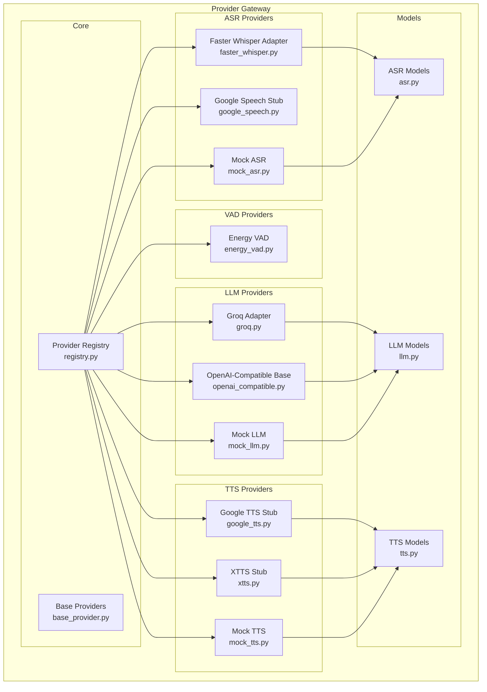

**Diagram sources**
- [base_provider.py:12-177](file://py/provider_gateway/app/core/base_provider.py#L12-L177)
- [registry.py:19-287](file://py/provider_gateway/app/core/registry.py#L19-L287)
- [faster_whisper.py:15-262](file://py/provider_gateway/app/providers/asr/faster_whisper.py#L15-L262)
- [google_speech.py:15-108](file://py/provider_gateway/app/providers/asr/google_speech.py#L15-L108)
- [mock_asr.py:16-221](file://py/provider_gateway/app/providers/asr/mock_asr.py#L16-L221)
- [groq.py:16-124](file://py/provider_gateway/app/providers/llm/groq.py#L16-L124)
- [openai_compatible.py:18-288](file://py/provider_gateway/app/providers/llm/openai_compatible.py#L18-L288)
- [mock_llm.py:15-218](file://py/provider_gateway/app/providers/llm/mock_llm.py#L15-L218)
- [google_tts.py:14-107](file://py/provider_gateway/app/providers/tts/google_tts.py#L14-L107)
- [xtts.py:14-106](file://py/provider_gateway/app/providers/tts/xtts.py#L14-L106)
- [mock_tts.py:17-206](file://py/provider_gateway/app/providers/tts/mock_tts.py#L17-L206)
- [energy_vad.py:14-179](file://py/provider_gateway/app/providers/vad/energy_vad.py#L14-L179)
- [asr.py:10-65](file://py/provider_gateway/app/models/asr.py#L10-L65)
- [llm.py:10-78](file://py/provider_gateway/app/models/llm.py#L10-L78)
- [tts.py:10-56](file://py/provider_gateway/app/models/tts.py#L10-L56)

**Section sources**
- [registry.py:206-241](file://py/provider_gateway/app/core/registry.py#L206-L241)
- [config-mock.yaml:14-30](file://examples/config-mock.yaml#L14-L30)
- [config-vllm.yaml:12-23](file://examples/config-vllm.yaml#L12-L23)
- [config-cloud.yaml:12-30](file://examples/config-cloud.yaml#L12-L30)

## Core Components
- Base Provider Interfaces define the contract for ASR, LLM, and TTS providers, including capability reporting and cancellation semantics.
- Provider Registry manages provider factories and instances, enabling dynamic loading and caching.
- Domain-specific models encapsulate request/response structures and metadata for each provider type.

Key responsibilities:
- Base Providers: enforce method contracts and capability declarations.
- Registry: register built-in providers, resolve by name, and cache instances.
- Models: define typed inputs/outputs for consistent processing across providers.

**Section sources**
- [base_provider.py:12-177](file://py/provider_gateway/app/core/base_provider.py#L12-L177)
- [registry.py:19-287](file://py/provider_gateway/app/core/registry.py#L19-L287)
- [asr.py:10-65](file://py/provider_gateway/app/models/asr.py#L10-L65)
- [llm.py:10-78](file://py/provider_gateway/app/models/llm.py#L10-L78)
- [tts.py:10-56](file://py/provider_gateway/app/models/tts.py#L10-L56)

## Architecture Overview
The provider gateway composes providers through a registry. Clients configure default providers and per-provider settings in YAML. Providers implement streaming recognition, generation, or synthesis and return structured responses with session context and timing metadata.

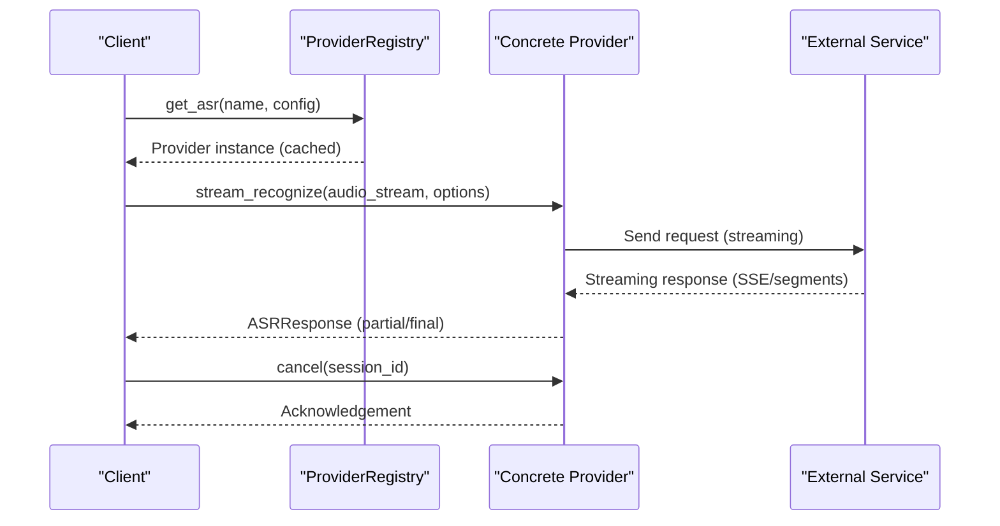

**Diagram sources**
- [registry.py:85-113](file://py/provider_gateway/app/core/registry.py#L85-L113)
- [faster_whisper.py:104-218](file://py/provider_gateway/app/providers/asr/faster_whisper.py#L104-L218)
- [openai_compatible.py:87-239](file://py/provider_gateway/app/providers/llm/openai_compatible.py#L87-L239)
- [mock_asr.py:79-164](file://py/provider_gateway/app/providers/asr/mock_asr.py#L79-L164)
- [mock_llm.py:65-176](file://py/provider_gateway/app/providers/llm/mock_llm.py#L65-L176)
- [mock_tts.py:65-155](file://py/provider_gateway/app/providers/tts/mock_tts.py#L65-L155)

## Detailed Component Analysis

### ASR Providers

#### Faster Whisper Provider
- Purpose: Local, efficient ASR using the faster-whisper library with CPU/GPU acceleration.
- Capabilities: Streaming input/output, word timestamps, interruptible generation, preferred 16 kHz PCM16.
- Implementation highlights:
  - Lazy model loading with device/compute-type selection.
  - Audio normalization and transcription in executor to avoid blocking.
  - Cancellation support via session IDs stored in a set.
  - Word timestamps extraction and confidence/language metadata.
- Configuration keys: model_size, device, compute_type, language.
- Example usage pattern: Instantiate with desired model and language; stream audio chunks; handle partial and final results.

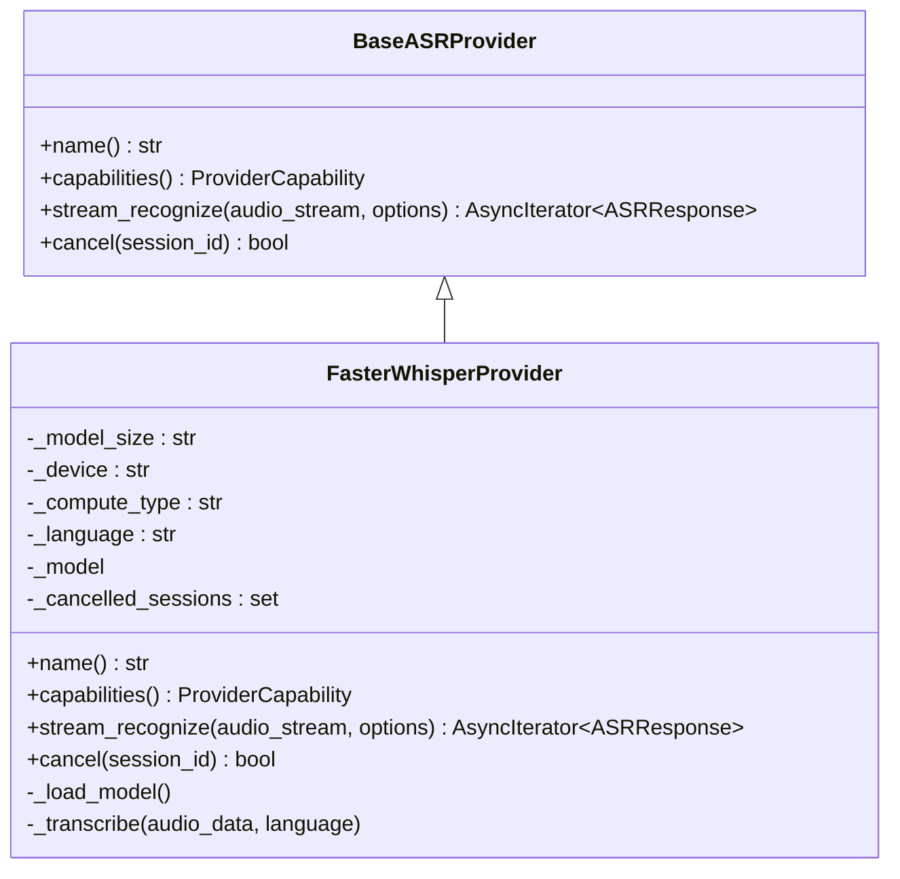

**Diagram sources**
- [base_provider.py:39-81](file://py/provider_gateway/app/core/base_provider.py#L39-L81)
- [faster_whisper.py:15-262](file://py/provider_gateway/app/providers/asr/faster_whisper.py#L15-L262)

**Section sources**
- [faster_whisper.py:15-262](file://py/provider_gateway/app/providers/asr/faster_whisper.py#L15-L262)
- [asr.py:18-65](file://py/provider_gateway/app/models/asr.py#L18-L65)
- [config-mock.yaml:18-21](file://examples/config-mock.yaml#L18-L21)

#### Google Speech Provider
- Purpose: Stub for Google Cloud Speech-to-Text. Requires credentials; raises clear exceptions if missing.
- Capabilities: Broad codec and sample-rate support; streaming input/output; word timestamps; interruptible generation.
- Implementation highlights:
  - Always raises NotImplementedError with guidance to install and configure credentials.
  - Intended as a placeholder for future integration.

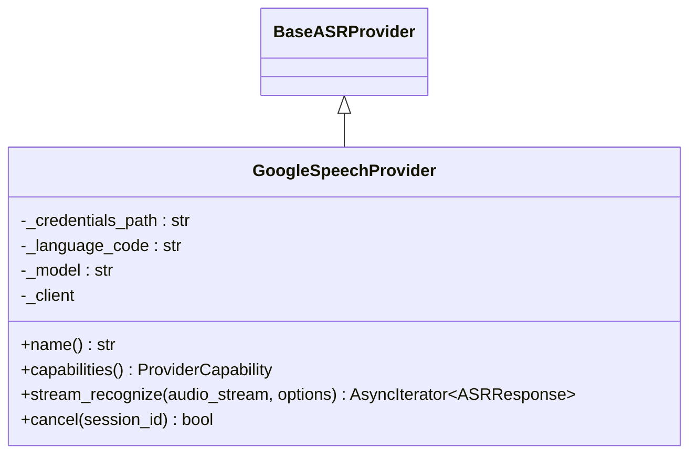

**Diagram sources**
- [base_provider.py:39-81](file://py/provider_gateway/app/core/base_provider.py#L39-L81)
- [google_speech.py:15-108](file://py/provider_gateway/app/providers/asr/google_speech.py#L15-L108)

**Section sources**
- [google_speech.py:15-108](file://py/provider_gateway/app/providers/asr/google_speech.py#L15-L108)
- [config-cloud.yaml:16-20](file://examples/config-cloud.yaml#L16-L20)

#### Mock ASR Provider
- Purpose: Deterministic, testable ASR that yields partial and final transcripts with word timestamps.
- Capabilities: Streaming input/output; interruptible generation; configurable chunk delay and confidence.
- Implementation highlights:
  - Generates partial chunks and a final transcript; simulates realistic delays.
  - Produces word timestamps based on simulated speaking rates.
  - Cancellation support via session IDs.

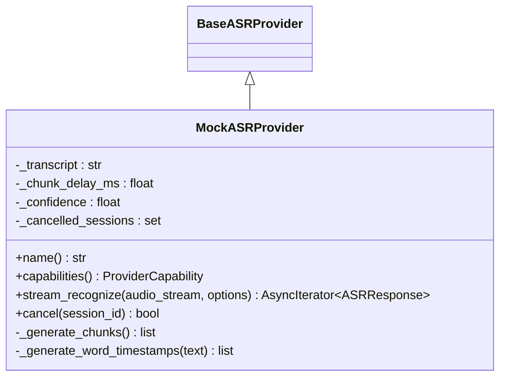

**Diagram sources**
- [base_provider.py:39-81](file://py/provider_gateway/app/core/base_provider.py#L39-L81)
- [mock_asr.py:16-221](file://py/provider_gateway/app/providers/asr/mock_asr.py#L16-L221)

**Section sources**
- [mock_asr.py:16-221](file://py/provider_gateway/app/providers/asr/mock_asr.py#L16-L221)
- [asr.py:18-65](file://py/provider_gateway/app/models/asr.py#L18-L65)
- [config-mock.yaml:18-21](file://examples/config-mock.yaml#L18-L21)

### LLM Providers

#### Groq Provider
- Purpose: Groq OpenAI-compatible endpoint with dedicated defaults and error mapping.
- Capabilities: Streaming output; interruptible generation; no streaming input.
- Implementation highlights:
  - Inherits streaming logic from OpenAI-compatible base.
  - Maps Groq-specific errors (rate limit, quota, invalid API key) to standardized provider errors with retry hints.

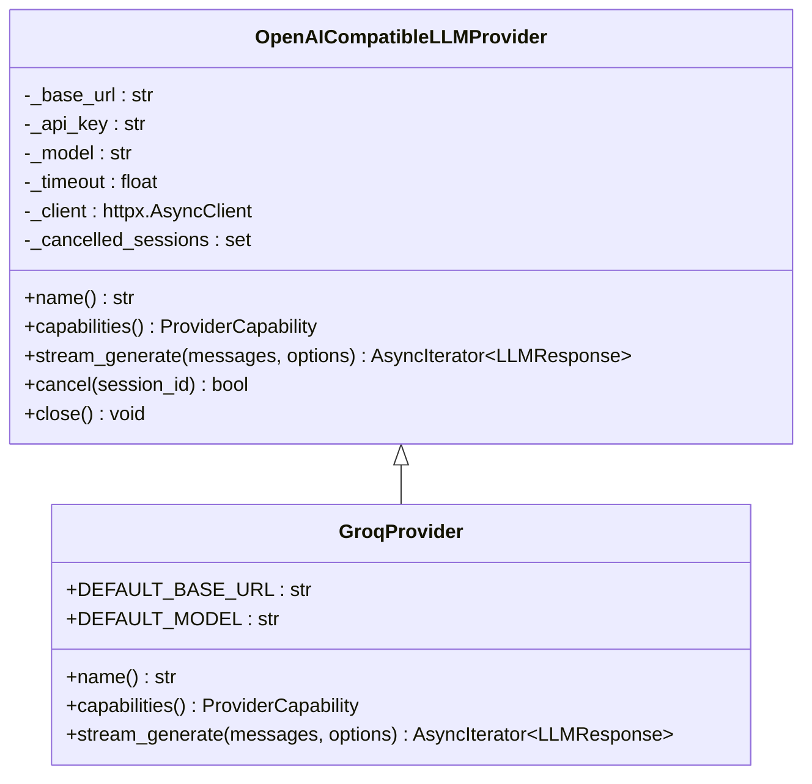

**Diagram sources**
- [openai_compatible.py:18-288](file://py/provider_gateway/app/providers/llm/openai_compatible.py#L18-L288)
- [groq.py:16-124](file://py/provider_gateway/app/providers/llm/groq.py#L16-L124)

**Section sources**
- [groq.py:16-124](file://py/provider_gateway/app/providers/llm/groq.py#L16-L124)
- [openai_compatible.py:18-288](file://py/provider_gateway/app/providers/llm/openai_compatible.py#L18-L288)
- [llm.py:25-78](file://py/provider_gateway/app/models/llm.py#L25-L78)
- [config-vllm.yaml:16-23](file://examples/config-vllm.yaml#L16-L23)

#### OpenAI-Compatible Base
- Purpose: Shared implementation for OpenAI-style APIs supporting streaming SSE responses.
- Implementation highlights:
  - Builds JSON payloads from ChatMessage lists; adds optional parameters (max_tokens, temperature, top_p, stop).
  - Parses SSE lines, extracts deltas and usage; handles connection and timeout errors.
  - Supports cancellation mid-stream.

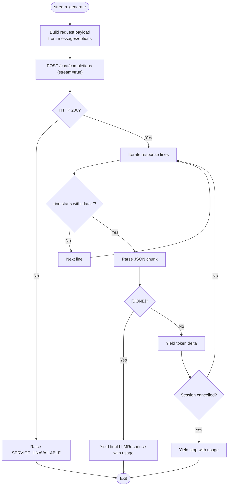

**Diagram sources**
- [openai_compatible.py:87-239](file://py/provider_gateway/app/providers/llm/openai_compatible.py#L87-L239)

**Section sources**
- [openai_compatible.py:87-239](file://py/provider_gateway/app/providers/llm/openai_compatible.py#L87-L239)
- [llm.py:25-78](file://py/provider_gateway/app/models/llm.py#L25-L78)

#### Mock LLM Provider
- Purpose: Deterministic, testable LLM that streams tokens with configurable delays and chunk sizes.
- Implementation highlights:
  - Tokenizes by words; yields chunks with configurable token count and inter-token delay.
  - Emits usage metadata on final chunk; supports cancellation.

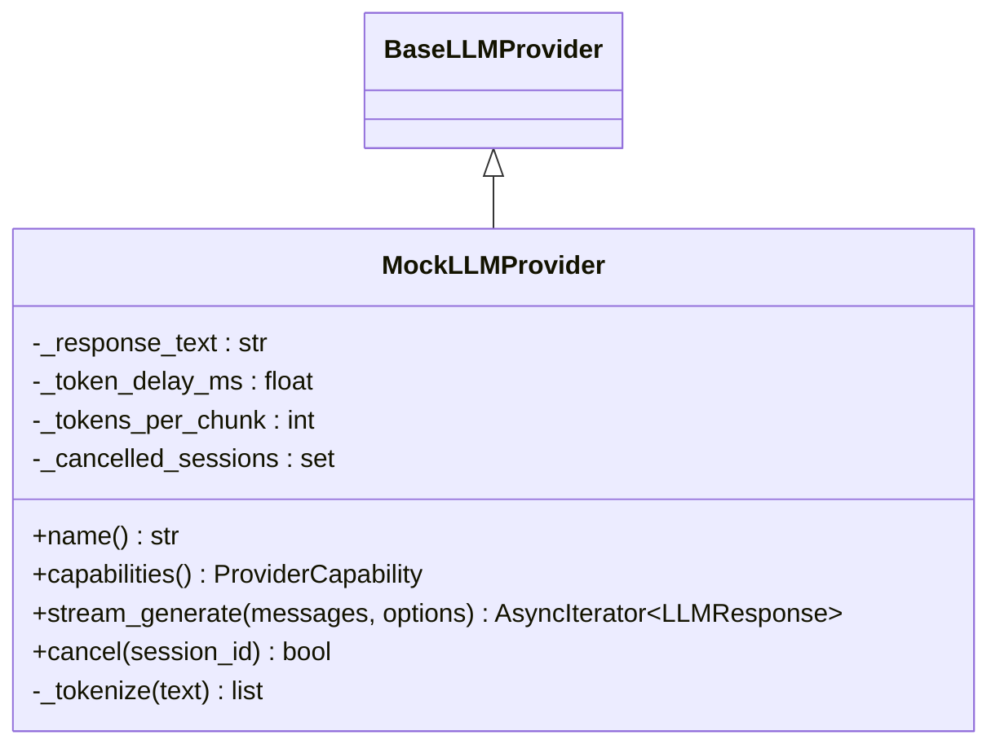

**Diagram sources**
- [base_provider.py:83-125](file://py/provider_gateway/app/core/base_provider.py#L83-L125)
- [mock_llm.py:15-218](file://py/provider_gateway/app/providers/llm/mock_llm.py#L15-L218)

**Section sources**
- [mock_llm.py:15-218](file://py/provider_gateway/app/providers/llm/mock_llm.py#L15-L218)
- [llm.py:25-78](file://py/provider_gateway/app/models/llm.py#L25-L78)
- [config-mock.yaml:22-25](file://examples/config-mock.yaml#L22-L25)

### TTS Providers

#### Google TTS Provider
- Purpose: Stub for Google Cloud Text-to-Speech. Requires credentials; raises clear exceptions if missing.
- Capabilities: Streaming output; voices support; interruptible generation; wide codec support.
- Implementation highlights:
  - Always raises NotImplementedError with guidance to install and configure credentials.

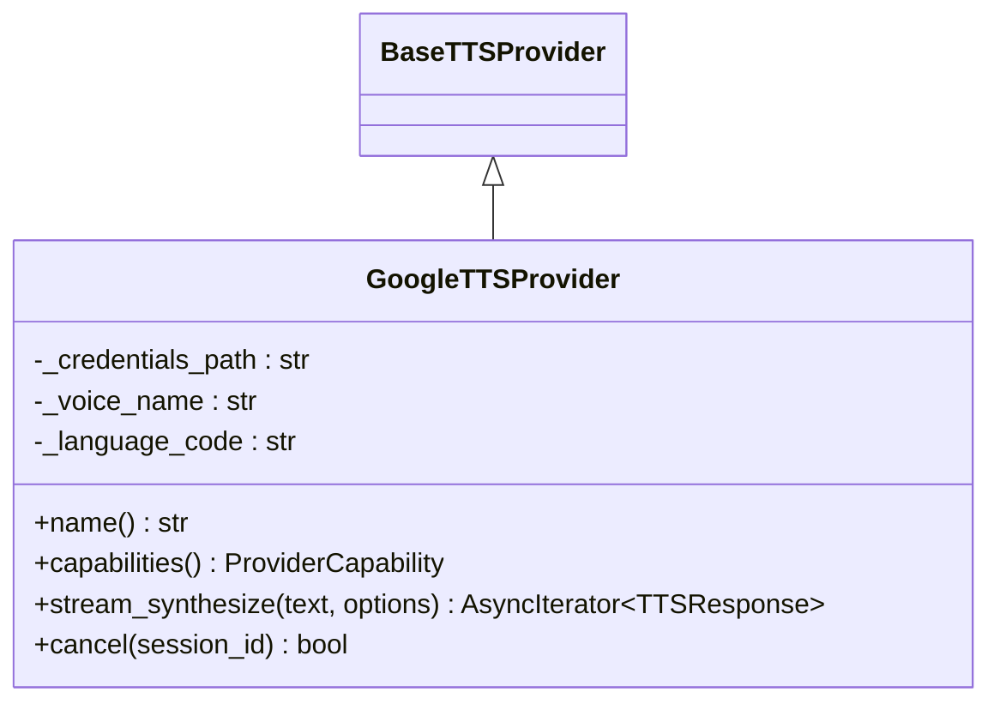

**Diagram sources**
- [base_provider.py:127-169](file://py/provider_gateway/app/core/base_provider.py#L127-L169)
- [google_tts.py:14-107](file://py/provider_gateway/app/providers/tts/google_tts.py#L14-L107)

**Section sources**
- [google_tts.py:14-107](file://py/provider_gateway/app/providers/tts/google_tts.py#L14-L107)
- [config-cloud.yaml:26-30](file://examples/config-cloud.yaml#L26-L30)

#### XTTS Provider
- Purpose: Stub for XTTS (Coqui) server. Requires a running XTTS server; raises clear exceptions if missing.
- Capabilities: Streaming output; voices support; interruptible generation; PCM16/WAV codecs.
- Implementation highlights:
  - Always raises NotImplementedError with guidance to deploy and connect to an XTTS server.

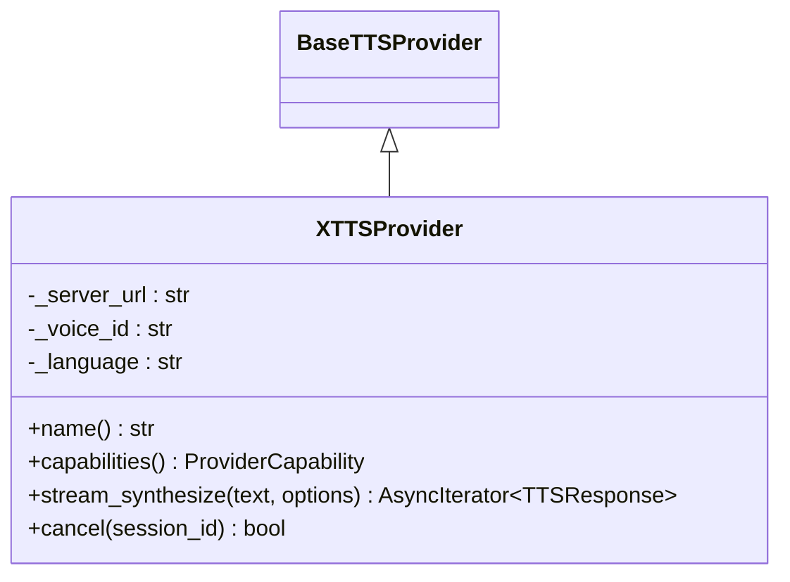

**Diagram sources**
- [base_provider.py:127-169](file://py/provider_gateway/app/core/base_provider.py#L127-L169)
- [xtts.py:14-106](file://py/provider_gateway/app/providers/tts/xtts.py#L14-L106)

**Section sources**
- [xtts.py:14-106](file://py/provider_gateway/app/providers/tts/xtts.py#L14-L106)

#### Mock TTS Provider
- Purpose: Generates PCM16 sine wave audio chunks at a fixed frequency; useful for testing audio pipelines.
- Implementation highlights:
  - Computes number of chunks from text length; generates sine wave samples; yields chunks with timing metadata on final chunk; supports cancellation.

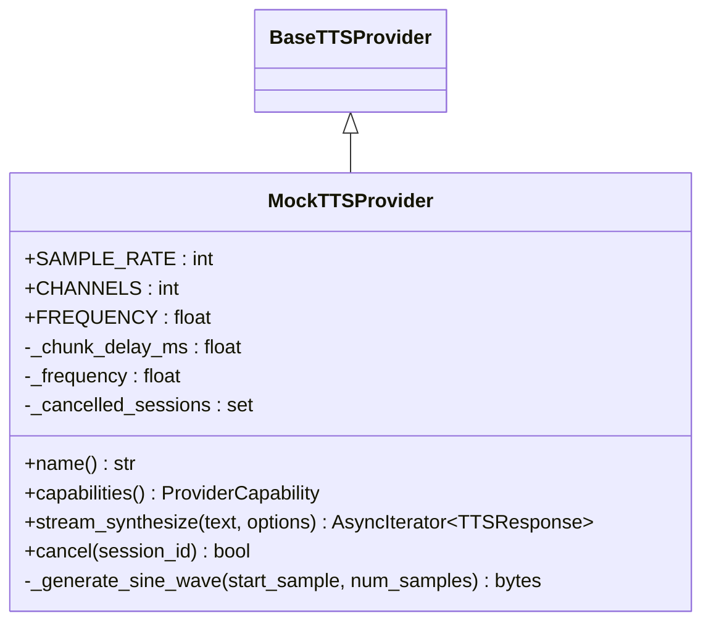

**Diagram sources**
- [base_provider.py:127-169](file://py/provider_gateway/app/core/base_provider.py#L127-L169)
- [mock_tts.py:17-206](file://py/provider_gateway/app/providers/tts/mock_tts.py#L17-L206)

**Section sources**
- [mock_tts.py:17-206](file://py/provider_gateway/app/providers/tts/mock_tts.py#L17-L206)
- [tts.py:10-56](file://py/provider_gateway/app/models/tts.py#L10-L56)
- [config-mock.yaml:26-29](file://examples/config-mock.yaml#L26-L29)

### VAD Provider

#### Energy VAD Provider
- Purpose: Simple energy-based voice activity detection for testing and lightweight scenarios.
- Implementation highlights:
  - Converts PCM16 to normalized float samples; computes RMS energy per 30 ms frame; segments speech regions respecting minimum durations; confidence derived from energy.

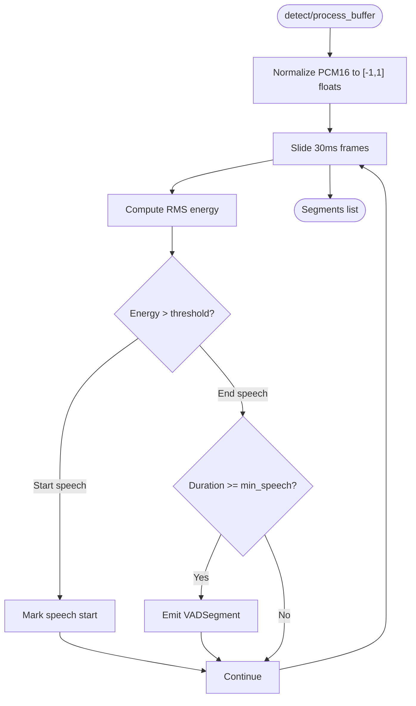

**Diagram sources**
- [energy_vad.py:73-147](file://py/provider_gateway/app/providers/vad/energy_vad.py#L73-L147)

**Section sources**
- [energy_vad.py:14-179](file://py/provider_gateway/app/providers/vad/energy_vad.py#L14-L179)

## Dependency Analysis
Provider discovery and registration are centralized in the registry. Built-in providers are auto-registered by importing provider modules and invoking their registration functions. Factories are cached by a composite key of provider name and hashed configuration to avoid redundant instantiations.

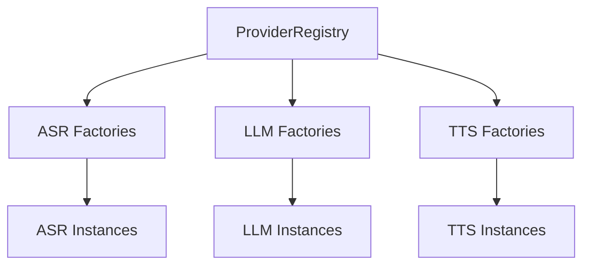

**Diagram sources**
- [registry.py:26-37](file://py/provider_gateway/app/core/registry.py#L26-L37)
- [registry.py:85-169](file://py/provider_gateway/app/core/registry.py#L85-L169)

**Section sources**
- [registry.py:206-241](file://py/provider_gateway/app/core/registry.py#L206-L241)
- [registry.py:242-262](file://py/provider_gateway/app/core/registry.py#L242-L262)

## Performance Considerations
- ASR
  - Faster Whisper: Choose model_size and compute_type to balance latency and accuracy; leverage device acceleration when available.
  - Mock ASR: Tune chunk_delay_ms to emulate realistic latency for testing.
- LLM
  - OpenAI-compatible: Adjust max_tokens, temperature, top_p; ensure base_url points to a performant endpoint (local vLLM or cloud).
  - Groq: Expect low-latency responses; handle rate-limiting with retries.
  - Mock LLM: Control token_delay_ms and tokens_per_chunk to simulate network and model latencies.
- TTS
  - Mock TTS: Frequency and chunk_delay_ms influence perceived quality and pacing; tune for UX.
  - Google/XTTS: Use appropriate sample rates and codecs; ensure server availability and bandwidth.
- VAD
  - Energy VAD: Tune energy_threshold, min_speech_duration_ms, min_silence_duration_ms for target environment.

[No sources needed since this section provides general guidance]

## Troubleshooting Guide
Common issues and resolutions:
- Missing Dependencies
  - Faster Whisper not installed: Provider raises SERVICE_UNAVAILABLE with installation guidance.
  - Google Cloud libraries not installed: Providers raise NotImplementedError with installation instructions.
- Authentication Failures
  - Groq: Invalid API key mapped to AUTHENTICATION; check credentials and permissions.
  - OpenAI-compatible: HTTP errors surfaced as SERVICE_UNAVAILABLE; verify base_url and API key.
- Rate Limits and Quotas
  - Groq: Rate limit errors mapped to RATE_LIMITED with retriable flag enabled.
  - Groq: Quota exceeded mapped to QUOTA_EXCEEDED.
- Timeouts and Connectivity
  - OpenAI-compatible: ConnectError and TimeoutException mapped to SERVICE_UNAVAILABLE and TIMEOUT respectively; verify endpoint reachability.
- Cancellation
  - All providers support cancel(session_id); ensure session_id matches the active session to stop generation or synthesis.

**Section sources**
- [faster_whisper.py:49-84](file://py/provider_gateway/app/providers/asr/faster_whisper.py#L49-L84)
- [google_speech.py:77-81](file://py/provider_gateway/app/providers/asr/google_speech.py#L77-L81)
- [google_tts.py:76-80](file://py/provider_gateway/app/providers/tts/google_tts.py#L76-L80)
- [groq.py:87-116](file://py/provider_gateway/app/providers/llm/groq.py#L87-L116)
- [openai_compatible.py:240-259](file://py/provider_gateway/app/providers/llm/openai_compatible.py#L240-L259)

## Conclusion
The provider implementations offer a robust, extensible foundation for integrating ASR, LLM, TTS, and VAD services. Built-in adapters demonstrate best practices for external service integration, authentication, streaming, cancellation, and error handling. Mock providers simplify testing and development, while the registry enables flexible configuration and runtime selection of providers.

[No sources needed since this section summarizes without analyzing specific files]

## Appendices

### Provider Configuration Examples
- Mock configuration: Selects mock providers for ASR, LLM, and TTS with per-provider tuning.
- vLLM configuration: Uses OpenAI-compatible provider pointing to a local vLLM endpoint.
- Cloud configuration: Selects Google Speech, Groq, and Google TTS with credentials and model parameters.

**Section sources**
- [config-mock.yaml:14-30](file://examples/config-mock.yaml#L14-L30)
- [config-vllm.yaml:12-23](file://examples/config-vllm.yaml#L12-L23)
- [config-cloud.yaml:12-30](file://examples/config-cloud.yaml#L12-L30)