# Provider Registry System

<cite>
**Referenced Files in This Document**
- [registry.go](file://go/pkg/providers/registry.go)
- [interfaces.go](file://go/pkg/providers/interfaces.go)
- [options.go](file://go/pkg/providers/options.go)
- [grpc_client.go](file://go/pkg/providers/grpc_client.go)
- [provider.go](file://go/pkg/contracts/provider.go)
- [session.go](file://go/pkg/session/session.go)
- [main.go](file://go/orchestrator/cmd/main.go)
- [main.go](file://go/media-edge/cmd/main.go)
- [registry.py](file://py/provider_gateway/app/core/registry.py)
- [capability.py](file://py/provider_gateway/app/core/capability.py)
- [base_provider.py](file://py/provider_gateway/app/core/base_provider.py)
- [provider_servicer.py](file://py/provider_gateway/app/grpc_api/provider_servicer.py)
- [faster_whisper.py](file://py/provider_gateway/app/providers/asr/faster_whisper.py)
- [groq.py](file://py/provider_gateway/app/providers/llm/groq.py)
- [xtts.py](file://py/provider_gateway/app/providers/tts/xtts.py)
- [config-cloud.yaml](file://examples/config-cloud.yaml)
- [provider-architecture.md](file://docs/provider-architecture.md)
</cite>

## Table of Contents
1. [Introduction](#introduction)
2. [Project Structure](#project-structure)
3. [Core Components](#core-components)
4. [Architecture Overview](#architecture-overview)
5. [Detailed Component Analysis](#detailed-component-analysis)
6. [Dependency Analysis](#dependency-analysis)
7. [Performance Considerations](#performance-considerations)
8. [Troubleshooting Guide](#troubleshooting-guide)
9. [Conclusion](#conclusion)
10. [Appendices](#appendices)

## Introduction
This document describes the Provider Registry System that powers dynamic provider registration, capability discovery, and service orchestration across the CloudApp platform. It explains how providers are registered, discovered, and resolved for sessions, how capabilities guide selection, and how lifecycle, health, and failover concerns are addressed. It also provides practical guidance for registering custom providers, querying capabilities, managing instances, ensuring isolation and performance, and implementing discovery, load balancing, and scaling strategies.

## Project Structure
The system spans two primary languages:
- Go: Orchestrator, provider registry, gRPC clients, and session management
- Python: Provider gateway, provider implementations, and gRPC service

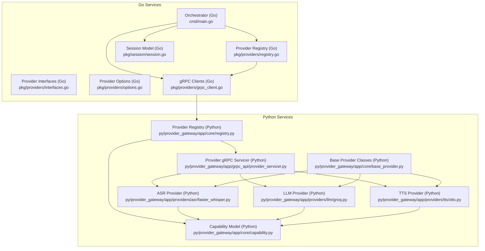

**Diagram sources**
- [main.go:195-257](file://go/orchestrator/cmd/main.go#L195-L257)
- [registry.go:14-40](file://go/pkg/providers/registry.go#L14-L40)
- [interfaces.go:21-97](file://go/pkg/providers/interfaces.go#L21-L97)
- [options.go:7-188](file://go/pkg/providers/options.go#L7-L188)
- [grpc_client.go:14-288](file://go/pkg/providers/grpc_client.go#L14-L288)
- [session.go:34-84](file://go/pkg/session/session.go#L34-L84)
- [registry.py:19-287](file://py/provider_gateway/app/core/registry.py#L19-L287)
- [capability.py:7-61](file://py/provider_gateway/app/core/capability.py#L7-L61)
- [base_provider.py:12-177](file://py/provider_gateway/app/core/base_provider.py#L12-L177)
- [provider_servicer.py:28-190](file://py/provider_gateway/app/grpc_api/provider_servicer.py#L28-L190)
- [faster_whisper.py:15-262](file://py/provider_gateway/app/providers/asr/faster_whisper.py#L15-L262)
- [groq.py:16-124](file://py/provider_gateway/app/providers/llm/groq.py#L16-L124)
- [xtts.py:14-106](file://py/provider_gateway/app/providers/tts/xtts.py#L14-L106)

**Section sources**
- [provider-architecture.md:1-320](file://docs/provider-architecture.md#L1-L320)

## Core Components
- Go Provider Registry: Manages provider registration and resolution for ASR, LLM, TTS, and VAD, with tenant-scoped overrides and request-level precedence.
- Go Provider Interfaces: Define streaming recognition, generation, synthesis, cancellation, and capability retrieval for providers.
- Go gRPC Clients: Stub implementations of gRPC provider clients for ASR, LLM, and TTS, designed to integrate with the Python provider gateway.
- Python Provider Registry: Dynamic discovery and registration of providers, caching instances, and capability exposure.
- Python Provider Base Classes: Abstract interfaces for ASR, LLM, and TTS providers with standardized capability reporting.
- Python Provider Servicer: gRPC service exposing provider listing, capability queries, and health checks.
- Provider Implementations: Example providers (ASR Whisper, LLM Groq, TTS XTTS) demonstrating capability modeling and cancellation.

**Section sources**
- [registry.go:14-262](file://go/pkg/providers/registry.go#L14-L262)
- [interfaces.go:21-97](file://go/pkg/providers/interfaces.go#L21-L97)
- [grpc_client.go:14-288](file://go/pkg/providers/grpc_client.go#L14-L288)
- [registry.py:19-287](file://py/provider_gateway/app/core/registry.py#L19-L287)
- [base_provider.py:12-177](file://py/provider_gateway/app/core/base_provider.py#L12-L177)
- [provider_servicer.py:28-190](file://py/provider_gateway/app/grpc_api/provider_servicer.py#L28-L190)
- [faster_whisper.py:15-262](file://py/provider_gateway/app/providers/asr/faster_whisper.py#L15-L262)
- [groq.py:16-124](file://py/provider_gateway/app/providers/llm/groq.py#L16-L124)
- [xtts.py:14-106](file://py/provider_gateway/app/providers/tts/xtts.py#L14-L106)

## Architecture Overview
The system uses a hybrid architecture:
- The Go orchestrator owns session orchestration and selects providers via a registry.
- Providers are implemented in Python and exposed via a provider gateway with a gRPC interface.
- The Go registry integrates with the Python gateway by registering gRPC clients that wrap provider calls.

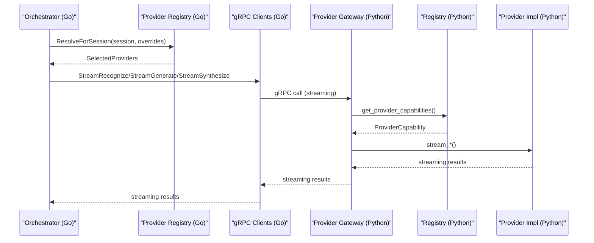

**Diagram sources**
- [main.go:195-257](file://go/orchestrator/cmd/main.go#L195-L257)
- [registry.go:172-251](file://go/pkg/providers/registry.go#L172-L251)
- [grpc_client.go:62-247](file://go/pkg/providers/grpc_client.go#L62-L247)
- [provider_servicer.py:43-190](file://py/provider_gateway/app/grpc_api/provider_servicer.py#L43-L190)
- [registry.py:182-204](file://py/provider_gateway/app/core/registry.py#L182-L204)

## Detailed Component Analysis

### Go Provider Registry
The Go registry maintains separate maps for ASR, LLM, TTS, and VAD providers, guarded by a mutex for thread safety. It supports:
- Registration of provider instances
- Lookup by name
- Listing provider names
- Resolution of providers for a session with priority: request → session → tenant → global defaults
- Validation that selected providers exist before returning selections

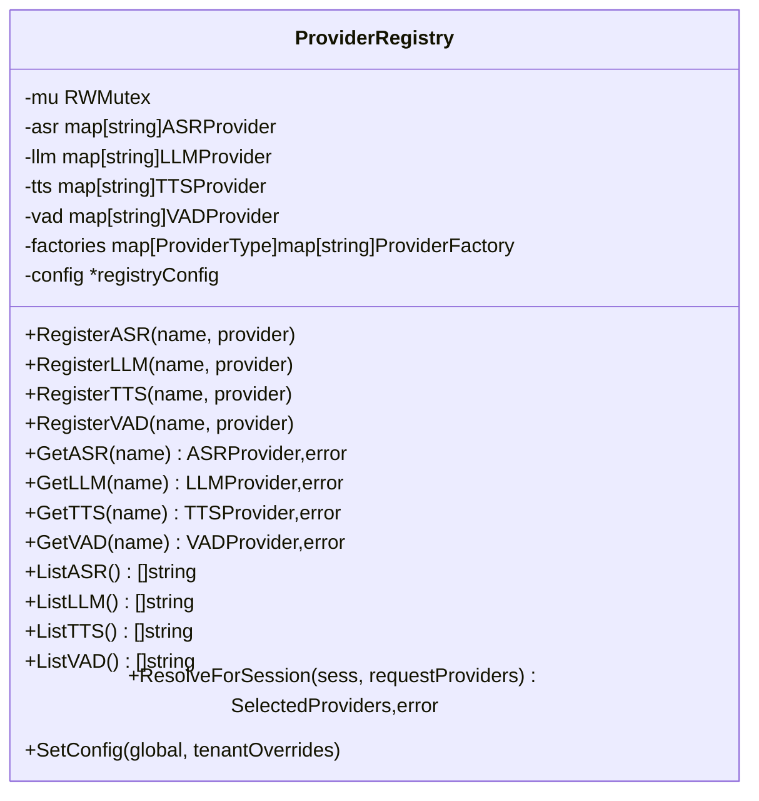

**Diagram sources**
- [registry.go:14-262](file://go/pkg/providers/registry.go#L14-L262)

**Section sources**
- [registry.go:14-262](file://go/pkg/providers/registry.go#L14-L262)

### Go Provider Interfaces and Options
Provider interfaces define streaming operations, cancellation, capability reporting, and naming. Options encapsulate provider-specific parameters for ASR, LLM, and TTS with builder-style helpers.

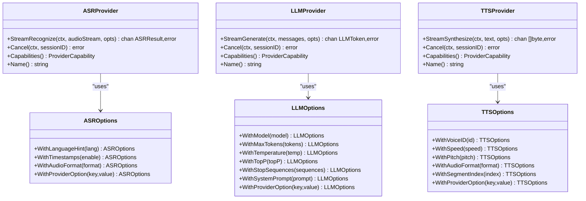

**Diagram sources**
- [interfaces.go:21-97](file://go/pkg/providers/interfaces.go#L21-L97)
- [options.go:7-188](file://go/pkg/providers/options.go#L7-L188)

**Section sources**
- [interfaces.go:21-97](file://go/pkg/providers/interfaces.go#L21-L97)
- [options.go:7-188](file://go/pkg/providers/options.go#L7-L188)

### Go gRPC Provider Clients
The Go gRPC clients are placeholders that demonstrate the expected structure for connecting to the Python provider gateway. They implement the provider interfaces and forward calls to the gateway, with capability reporting aligned to the contract.

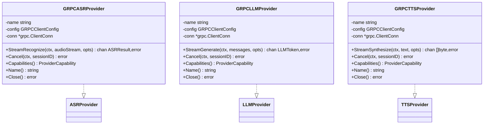

**Diagram sources**
- [grpc_client.go:35-288](file://go/pkg/providers/grpc_client.go#L35-L288)

**Section sources**
- [grpc_client.go:14-288](file://go/pkg/providers/grpc_client.go#L14-L288)

### Python Provider Registry and Capability Model
The Python registry supports dynamic discovery, factory-based instantiation, and caching of provider instances keyed by name and configuration hash. It exposes capability queries and integrates with the gRPC provider service.

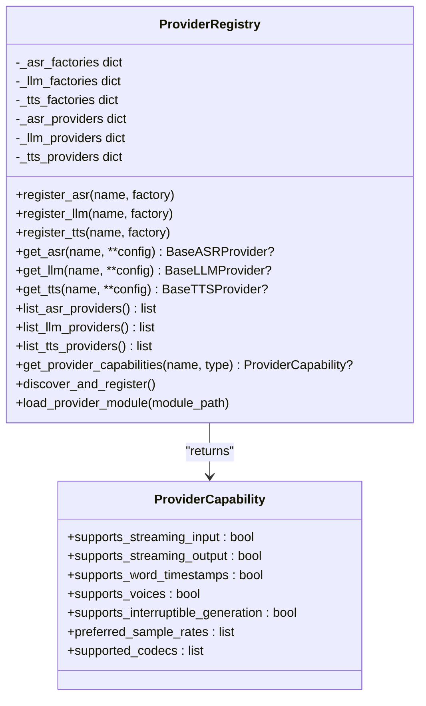

**Diagram sources**
- [registry.py:19-287](file://py/provider_gateway/app/core/registry.py#L19-L287)
- [capability.py:7-61](file://py/provider_gateway/app/core/capability.py#L7-L61)

**Section sources**
- [registry.py:19-287](file://py/provider_gateway/app/core/registry.py#L19-L287)
- [capability.py:7-61](file://py/provider_gateway/app/core/capability.py#L7-L61)

### Python Provider Base Classes and Implementations
Provider implementations inherit from base classes and expose capabilities and streaming operations. Example providers include:
- ASR: Faster Whisper with streaming input/output, word timestamps, and cancellation
- LLM: Groq adapter with streaming output and error normalization
- TTS: XTTS stub indicating server requirement

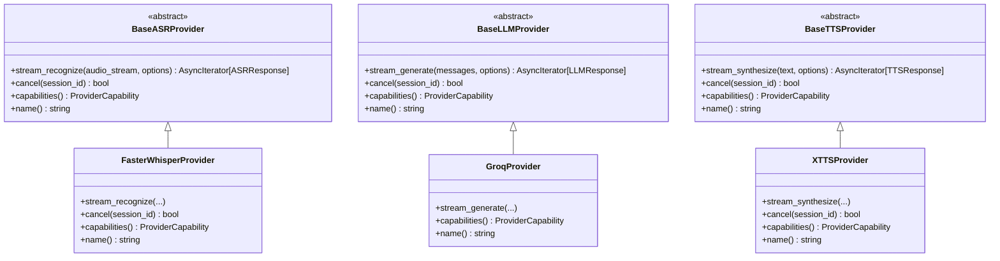

**Diagram sources**
- [base_provider.py:39-177](file://py/provider_gateway/app/core/base_provider.py#L39-L177)
- [faster_whisper.py:15-262](file://py/provider_gateway/app/providers/asr/faster_whisper.py#L15-L262)
- [groq.py:16-124](file://py/provider_gateway/app/providers/llm/groq.py#L16-L124)
- [xtts.py:14-106](file://py/provider_gateway/app/providers/tts/xtts.py#L14-L106)

**Section sources**
- [base_provider.py:12-177](file://py/provider_gateway/app/core/base_provider.py#L12-L177)
- [faster_whisper.py:15-262](file://py/provider_gateway/app/providers/asr/faster_whisper.py#L15-L262)
- [groq.py:16-124](file://py/provider_gateway/app/providers/llm/groq.py#L16-L124)
- [xtts.py:14-106](file://py/provider_gateway/app/providers/tts/xtts.py#L14-L106)

### Provider Discovery and Registration Flow
Dynamic discovery in the Python registry imports provider modules and invokes their registration functions. Factories are stored and later instantiated on demand with configuration.

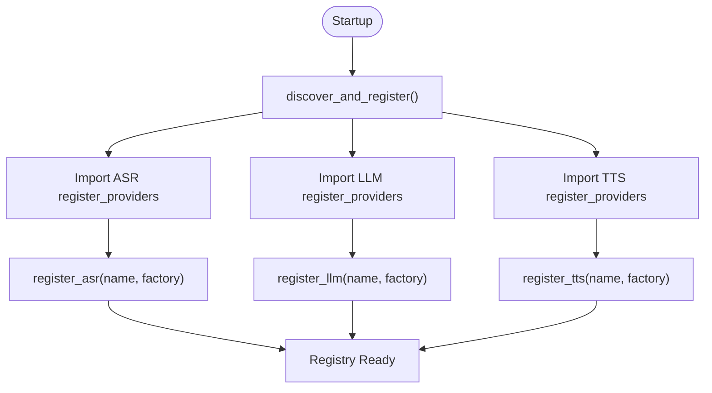

**Diagram sources**
- [registry.py:206-241](file://py/provider_gateway/app/core/registry.py#L206-L241)

**Section sources**
- [registry.py:206-241](file://py/provider_gateway/app/core/registry.py#L206-L241)

### Provider Capability-Based Selection
The Go registry’s resolution logic applies a strict priority order and validates provider availability before returning selections. The Python provider service surfaces capabilities for discovery and health checks.

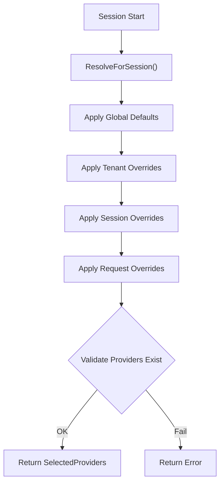

**Diagram sources**
- [registry.go:172-251](file://go/pkg/providers/registry.go#L172-L251)

**Section sources**
- [registry.go:172-251](file://go/pkg/providers/registry.go#L172-L251)
- [provider_servicer.py:43-190](file://py/provider_gateway/app/grpc_api/provider_servicer.py#L43-L190)

### Provider Lifecycle Management, Health Checking, and Failover
- Lifecycle: Providers are lazily instantiated and cached by registry keys. Cancellation is supported via provider interfaces and gRPC clients.
- Health: The Python provider service exposes a health check endpoint returning a serving status.
- Failover: The Go orchestrator can select alternate providers based on tenant/session/request overrides; gRPC clients can be extended to retry and route around failures.

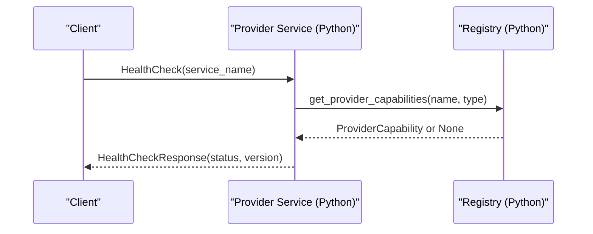

**Diagram sources**
- [provider_servicer.py:170-187](file://py/provider_gateway/app/grpc_api/provider_servicer.py#L170-L187)

**Section sources**
- [provider_servicer.py:170-187](file://py/provider_gateway/app/grpc_api/provider_servicer.py#L170-L187)
- [grpc_client.go:62-247](file://go/pkg/providers/grpc_client.go#L62-L247)

### Examples: Registering Custom Providers, Querying Capabilities, Managing Instances
- Registering a custom provider in Python:
  - Implement a provider class inheriting from the appropriate base class.
  - Export a function named register_providers(registry) that calls register_asr/register_llm/register_tts with a factory.
  - Use registry.load_provider_module(module_path) or rely on discover_and_register().
- Querying provider capabilities:
  - Use ProviderServicer.GetProviderInfo to retrieve ProviderInfo including capabilities.
  - Use ProviderRegistry.get_provider_capabilities(name, type) in Python.
- Managing provider instances:
  - Use get_asr/get_llm/get_tts with configuration; instances are cached by a composite key of name and hashed config.
  - Access capabilities via ProviderCapability attributes.

**Section sources**
- [registry.py:40-181](file://py/provider_gateway/app/core/registry.py#L40-L181)
- [provider_servicer.py:141-168](file://py/provider_gateway/app/grpc_api/provider_servicer.py#L141-L168)
- [capability.py:7-61](file://py/provider_gateway/app/core/capability.py#L7-L61)

## Dependency Analysis
The orchestrator depends on the Go provider registry and gRPC clients to coordinate provider operations. The registry integrates with the Python provider gateway through gRPC, which in turn relies on the Python registry and provider implementations.

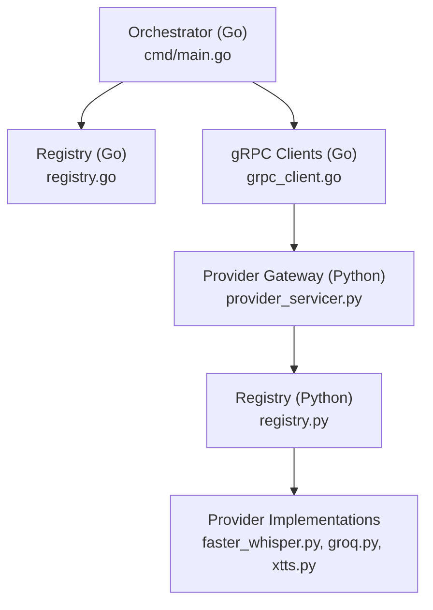

**Diagram sources**
- [main.go:195-257](file://go/orchestrator/cmd/main.go#L195-L257)
- [registry.go:14-40](file://go/pkg/providers/registry.go#L14-L40)
- [grpc_client.go:35-288](file://go/pkg/providers/grpc_client.go#L35-L288)
- [provider_servicer.py:28-190](file://py/provider_gateway/app/grpc_api/provider_servicer.py#L28-L190)
- [registry.py:19-287](file://py/provider_gateway/app/core/registry.py#L19-L287)
- [faster_whisper.py:15-262](file://py/provider_gateway/app/providers/asr/faster_whisper.py#L15-L262)
- [groq.py:16-124](file://py/provider_gateway/app/providers/llm/groq.py#L16-L124)
- [xtts.py:14-106](file://py/provider_gateway/app/providers/tts/xtts.py#L14-L106)

**Section sources**
- [main.go:195-257](file://go/orchestrator/cmd/main.go#L195-L257)
- [registry.go:14-40](file://go/pkg/providers/registry.go#L14-L40)
- [grpc_client.go:35-288](file://go/pkg/providers/grpc_client.go#L35-L288)
- [provider_servicer.py:28-190](file://py/provider_gateway/app/grpc_api/provider_servicer.py#L28-L190)
- [registry.py:19-287](file://py/provider_gateway/app/core/registry.py#L19-L287)

## Performance Considerations
- Streaming-first design: Both Go and Python providers expose streaming operations to minimize latency and memory overhead.
- Capability-aware routing: Use ProviderCapability to validate audio formats and streaming support before dispatching work.
- Instance caching: Python registry caches provider instances keyed by configuration to reduce initialization costs.
- Asynchronous processing: Python providers offload heavy operations to thread pools to keep async streams responsive.
- Observability: Enable metrics and tracing in both Go and Python services to monitor latency, throughput, and error rates.

[No sources needed since this section provides general guidance]

## Troubleshooting Guide
Common issues and remedies:
- Provider not found during resolution:
  - Verify provider registration and that names match exactly.
  - Confirm tenant/session/request overrides do not reference missing providers.
- Capability mismatch:
  - Ensure audio formats and streaming flags align with provider capabilities.
- Health check failures:
  - Confirm the provider gateway is reachable and serving.
- Cancellation not working:
  - Ensure providers implement cancel and that session IDs are propagated correctly.
- gRPC connectivity:
  - Validate gRPC client configuration (address, timeouts, retries) and network access.

**Section sources**
- [registry.go:234-250](file://go/pkg/providers/registry.go#L234-L250)
- [provider_servicer.py:170-187](file://py/provider_gateway/app/grpc_api/provider_servicer.py#L170-L187)
- [grpc_client.go:14-33](file://go/pkg/providers/grpc_client.go#L14-L33)

## Conclusion
The Provider Registry System cleanly separates provider implementations from orchestration logic, enabling dynamic registration, capability-driven selection, and scalable operation across ASR, LLM, and TTS domains. By leveraging streaming interfaces, capability models, and robust health and cancellation mechanisms, the system supports resilient, observable, and extensible AI service orchestration.

[No sources needed since this section summarizes without analyzing specific files]

## Appendices

### Provider Selection Hierarchy and Configuration
- Priority order: request-level overrides → session-level → tenant-level → global defaults
- Example configuration demonstrates default provider selection and per-provider settings.

**Section sources**
- [registry.go:172-251](file://go/pkg/providers/registry.go#L172-L251)
- [config-cloud.yaml:12-31](file://examples/config-cloud.yaml#L12-L31)

### Example Workflows

#### Provider Registration Workflow (Python)
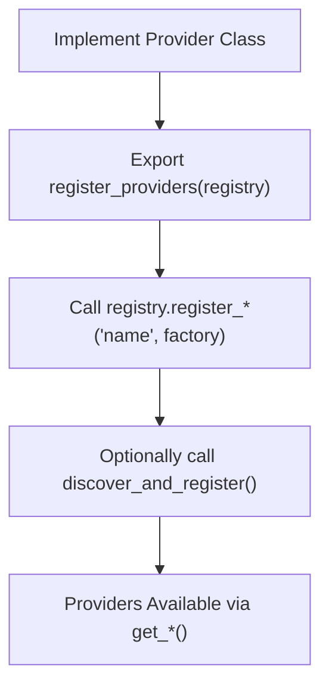

**Diagram sources**
- [registry.py:40-84](file://py/provider_gateway/app/core/registry.py#L40-L84)
- [faster_whisper.py:256-262](file://py/provider_gateway/app/providers/asr/faster_whisper.py#L256-L262)

#### Capability Query Workflow (Python)
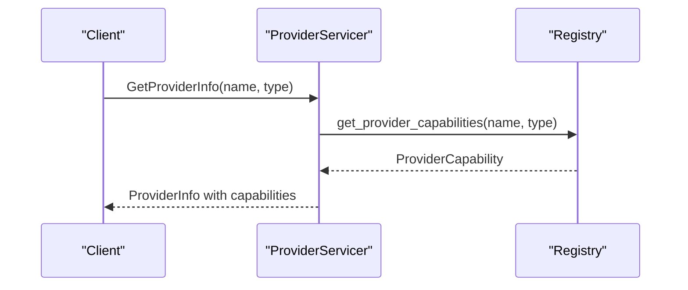

**Diagram sources**
- [provider_servicer.py:141-168](file://py/provider_gateway/app/grpc_api/provider_servicer.py#L141-L168)
- [registry.py:182-204](file://py/provider_gateway/app/core/registry.py#L182-L204)