# Provider-Gateway Service

<cite>
**Referenced Files in This Document**
- [main.py](file://py/provider_gateway/main.py)
- [__main__.py](file://py/provider_gateway/app/__main__.py)
- [base_provider.py](file://py/provider_gateway/app/core/base_provider.py)
- [capability.py](file://py/provider_gateway/app/core/capability.py)
- [errors.py](file://py/provider_gateway/app/core/errors.py)
- [registry.py](file://py/provider_gateway/app/core/registry.py)
- [server.py](file://py/provider_gateway/app/grpc_api/server.py)
- [asr_servicer.py](file://py/provider_gateway/app/grpc_api/asr_servicer.py)
- [llm_servicer.py](file://py/provider_gateway/app/grpc_api/llm_servicer.py)
- [tts_servicer.py](file://py/provider_gateway/app/grpc_api/tts_servicer.py)
- [settings.py](file://py/provider_gateway/app/config/settings.py)
- [asr.py](file://py/provider_gateway/app/models/asr.py)
- [llm.py](file://py/provider_gateway/app/models/llm.py)
- [tts.py](file://py/provider_gateway/app/models/tts.py)
- [asr/__init__.py](file://py/provider_gateway/app/providers/asr/__init__.py)
- [llm/__init__.py](file://py/provider_gateway/app/providers/llm/__init__.py)
- [tts/__init__.py](file://py/provider_gateway/app/providers/tts/__init__.py)
- [mock_asr.py](file://py/provider_gateway/app/providers/asr/mock_asr.py)
- [mock_llm.py](file://py/provider_gateway/app/providers/llm/mock_llm.py)
</cite>

## Table of Contents
1. [Introduction](#introduction)
2. [Project Structure](#project-structure)
3. [Core Components](#core-components)
4. [Architecture Overview](#architecture-overview)
5. [Detailed Component Analysis](#detailed-component-analysis)
6. [Dependency Analysis](#dependency-analysis)
7. [Performance Considerations](#performance-considerations)
8. [Troubleshooting Guide](#troubleshooting-guide)
9. [Conclusion](#conclusion)
10. [Appendices](#appendices)

## Introduction
The Provider-Gateway service is a Python-based gRPC server that acts as the bridge between the Go orchestrator and external AI providers. It exposes standardized gRPC services for Automatic Speech Recognition (ASR), Large Language Model (LLM), and Text-to-Speech (TTS), while encapsulating provider implementations behind a unified provider framework. The service manages provider lifecycle, capability discovery, and cross-language communication via protocol buffers, enabling pluggable provider backends and robust observability.

## Project Structure
The Python provider gateway is organized into cohesive layers:
- Entry points: application bootstrap and process lifecycle
- Core framework: base provider interfaces, capability model, registry, and error normalization
- gRPC API: server orchestration and service implementations for ASR, LLM, and TTS
- Models: typed request/response models for each domain
- Providers: built-in provider modules and factories for ASR, LLM, and TTS
- Config: settings management with YAML and environment overrides
- Telemetry: logging, metrics, and tracing integrations

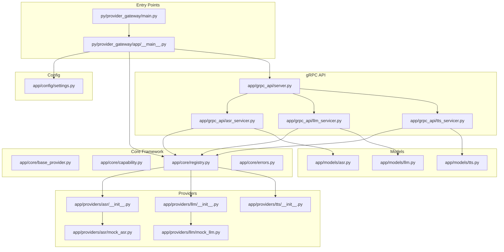

**Diagram sources**
- [main.py:1-13](file://py/provider_gateway/main.py#L1-L13)
- [__main__.py:1-80](file://py/provider_gateway/app/__main__.py#L1-L80)
- [base_provider.py:1-177](file://py/provider_gateway/app/core/base_provider.py#L1-L177)
- [capability.py](file://py/provider_gateway/app/core/capability.py)
- [errors.py](file://py/provider_gateway/app/core/errors.py)
- [registry.py:1-287](file://py/provider_gateway/app/core/registry.py#L1-L287)
- [server.py:1-171](file://py/provider_gateway/app/grpc_api/server.py#L1-L171)
- [asr_servicer.py:1-239](file://py/provider_gateway/app/grpc_api/asr_servicer.py#L1-L239)
- [llm_servicer.py:1-218](file://py/provider_gateway/app/grpc_api/llm_servicer.py#L1-L218)
- [tts_servicer.py:1-228](file://py/provider_gateway/app/grpc_api/tts_servicer.py#L1-L228)
- [asr.py:1-65](file://py/provider_gateway/app/models/asr.py#L1-L65)
- [llm.py:1-78](file://py/provider_gateway/app/models/llm.py#L1-L78)
- [tts.py:1-56](file://py/provider_gateway/app/models/tts.py#L1-L56)
- [asr/__init__.py:1-36](file://py/provider_gateway/app/providers/asr/__init__.py#L1-L36)
- [llm/__init__.py:1-36](file://py/provider_gateway/app/providers/llm/__init__.py#L1-L36)
- [tts/__init__.py:1-36](file://py/provider_gateway/app/providers/tts/__init__.py#L1-L36)
- [mock_asr.py:1-221](file://py/provider_gateway/app/providers/asr/mock_asr.py#L1-L221)
- [mock_llm.py:1-218](file://py/provider_gateway/app/providers/llm/mock_llm.py#L1-L218)

**Section sources**
- [main.py:1-13](file://py/provider_gateway/main.py#L1-L13)
- [__main__.py:1-80](file://py/provider_gateway/app/__main__.py#L1-L80)

## Core Components
- Base provider interfaces define the contract for ASR, LLM, and TTS providers, including capability reporting and cancellation semantics.
- Provider registry enables dynamic discovery and instantiation of providers, with caching and thread-safe access.
- gRPC server composes multiple service servicers and exposes them over an asynchronous gRPC server with graceful shutdown.
- Typed models define request/response schemas for each domain, ensuring consistent cross-language serialization.
- Built-in mock providers demonstrate provider implementation patterns and enable local testing.

**Section sources**
- [base_provider.py:1-177](file://py/provider_gateway/app/core/base_provider.py#L1-L177)
- [registry.py:1-287](file://py/provider_gateway/app/core/registry.py#L1-L287)
- [server.py:1-171](file://py/provider_gateway/app/grpc_api/server.py#L1-L171)
- [asr.py:1-65](file://py/provider_gateway/app/models/asr.py#L1-L65)
- [llm.py:1-78](file://py/provider_gateway/app/models/llm.py#L1-L78)
- [tts.py:1-56](file://py/provider_gateway/app/models/tts.py#L1-L56)

## Architecture Overview
The Provider-Gateway integrates the following layers:
- Application bootstrap initializes configuration, telemetry, registry, and gRPC server.
- Registry discovers and registers built-in providers and maintains provider instances.
- gRPC servicers translate protobuf messages to provider calls and stream results back to clients.
- Models provide strong typing for cross-language message exchange.
- Providers implement BaseProvider-derived interfaces and expose capabilities.

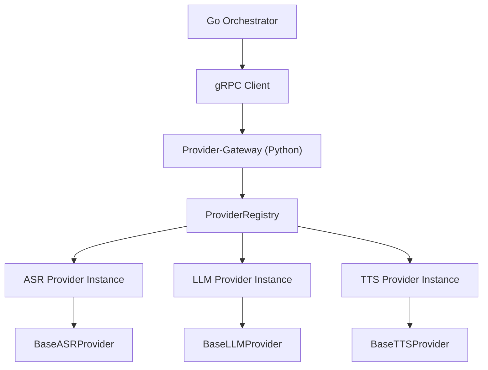

**Diagram sources**
- [__main__.py:15-64](file://py/provider_gateway/app/__main__.py#L15-L64)
- [registry.py:206-241](file://py/provider_gateway/app/core/registry.py#L206-L241)
- [asr_servicer.py:42-122](file://py/provider_gateway/app/grpc_api/asr_servicer.py#L42-L122)
- [llm_servicer.py:38-105](file://py/provider_gateway/app/grpc_api/llm_servicer.py#L38-L105)
- [tts_servicer.py:41-110](file://py/provider_gateway/app/grpc_api/tts_servicer.py#L41-L110)

## Detailed Component Analysis

### Base Provider Interfaces
The base provider abstractions define the common contract for all providers:
- BaseProvider: shared name, capabilities, and cancellation semantics
- BaseASRProvider: streaming speech recognition with audio chunks and transcript responses
- BaseLLMProvider: streaming token generation from chat messages
- BaseTTSProvider: streaming audio synthesis from text

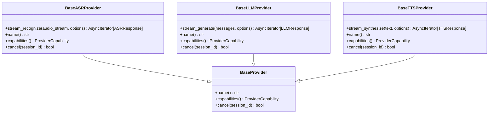

**Diagram sources**
- [base_provider.py:12-169](file://py/provider_gateway/app/core/base_provider.py#L12-L169)

**Section sources**
- [base_provider.py:1-177](file://py/provider_gateway/app/core/base_provider.py#L1-L177)

### Provider Registry System
The registry manages provider factories and instances:
- Registration APIs for ASR, LLM, and TTS
- Instance retrieval with configuration and caching
- Capability lookup by provider name and type
- Auto-discovery of built-in providers
- Dynamic module loading

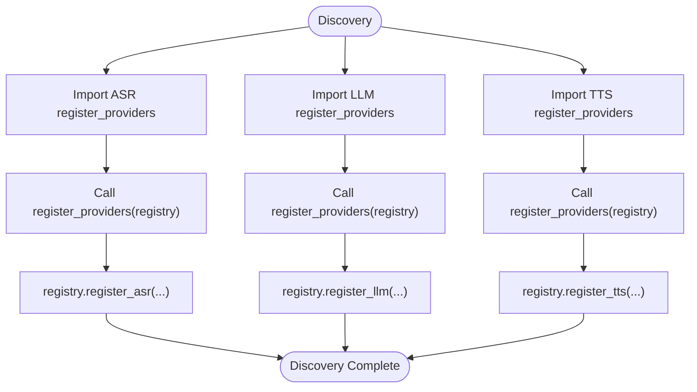

**Diagram sources**
- [registry.py:206-241](file://py/provider_gateway/app/core/registry.py#L206-L241)
- [asr/__init__.py:13-28](file://py/provider_gateway/app/providers/asr/__init__.py#L13-L28)
- [llm/__init__.py:13-28](file://py/provider_gateway/app/providers/llm/__init__.py#L13-L28)
- [tts/__init__.py:13-28](file://py/provider_gateway/app/providers/tts/__init__.py#L13-L28)

**Section sources**
- [registry.py:1-287](file://py/provider_gateway/app/core/registry.py#L1-L287)

### gRPC Server Implementation
The gRPC server composes multiple service servicers and manages lifecycle:
- Asynchronous server creation with configurable worker pool
- Servicer registration for ASR, LLM, TTS, and Provider services
- Graceful shutdown with signal handling
- Address binding and runtime monitoring

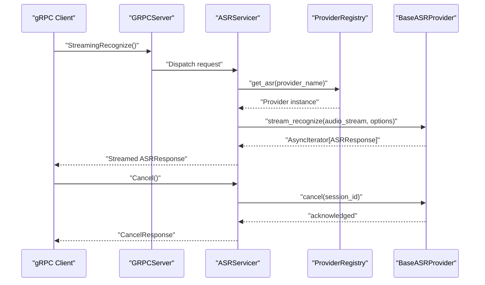

**Diagram sources**
- [server.py:54-93](file://py/provider_gateway/app/grpc_api/server.py#L54-L93)
- [asr_servicer.py:42-122](file://py/provider_gateway/app/grpc_api/asr_servicer.py#L42-L122)
- [registry.py:85-113](file://py/provider_gateway/app/core/registry.py#L85-L113)

**Section sources**
- [server.py:1-171](file://py/provider_gateway/app/grpc_api/server.py#L1-L171)
- [asr_servicer.py:1-239](file://py/provider_gateway/app/grpc_api/asr_servicer.py#L1-L239)
- [llm_servicer.py:1-218](file://py/provider_gateway/app/grpc_api/llm_servicer.py#L1-L218)
- [tts_servicer.py:1-228](file://py/provider_gateway/app/grpc_api/tts_servicer.py#L1-L228)

### Capability Discovery Mechanisms
Providers report capabilities via a shared capability model, enabling clients to query supported features:
- Streaming input/output flags
- Word timestamps support
- Voice support
- Interruptible generation
- Preferred sample rates and supported codecs

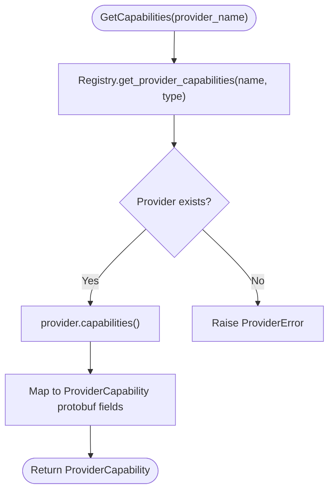

**Diagram sources**
- [registry.py:182-204](file://py/provider_gateway/app/core/registry.py#L182-L204)
- [asr_servicer.py:207-235](file://py/provider_gateway/app/grpc_api/asr_servicer.py#L207-L235)
- [llm_servicer.py:186-214](file://py/provider_gateway/app/grpc_api/llm_servicer.py#L186-L214)
- [tts_servicer.py:196-224](file://py/provider_gateway/app/grpc_api/tts_servicer.py#L196-L224)

**Section sources**
- [capability.py](file://py/provider_gateway/app/core/capability.py)
- [asr_servicer.py:207-235](file://py/provider_gateway/app/grpc_api/asr_servicer.py#L207-L235)
- [llm_servicer.py:186-214](file://py/provider_gateway/app/grpc_api/llm_servicer.py#L186-L214)
- [tts_servicer.py:196-224](file://py/provider_gateway/app/grpc_api/tts_servicer.py#L196-L224)

### Provider Lifecycle Management
Lifecycle management covers initialization, invocation, cancellation, and cleanup:
- Provider instances are cached per configuration to avoid redundant creation
- Active sessions are tracked per servicer to support cancellation
- Cancellation requests are forwarded to provider implementations
- Graceful shutdown stops the gRPC server and releases resources

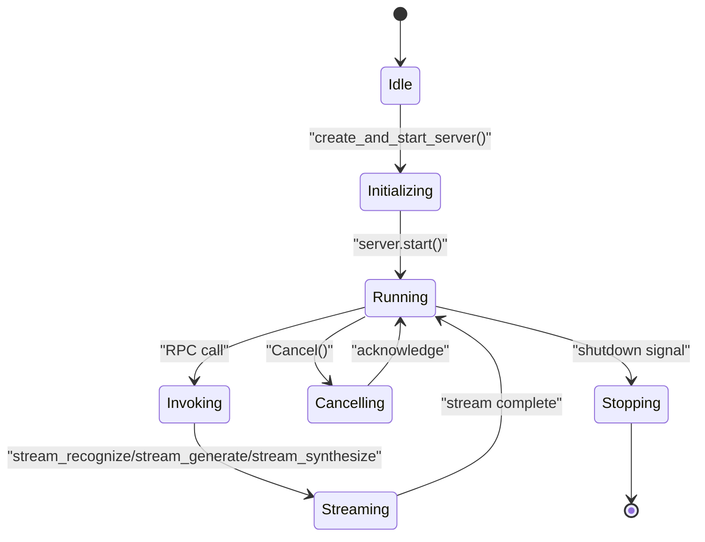

**Diagram sources**
- [server.py:104-129](file://py/provider_gateway/app/grpc_api/server.py#L104-L129)
- [asr_servicer.py:174-205](file://py/provider_gateway/app/grpc_api/asr_servicer.py#L174-L205)
- [llm_servicer.py:153-184](file://py/provider_gateway/app/grpc_api/llm_servicer.py#L153-L184)
- [tts_servicer.py:163-194](file://py/provider_gateway/app/grpc_api/tts_servicer.py#L163-L194)

**Section sources**
- [registry.py:96-112](file://py/provider_gateway/app/core/registry.py#L96-L112)
- [asr_servicer.py:79-82](file://py/provider_gateway/app/grpc_api/asr_servicer.py#L79-L82)
- [llm_servicer.py:73-76](file://py/provider_gateway/app/grpc_api/llm_servicer.py#L73-L76)
- [tts_servicer.py:76-79](file://py/provider_gateway/app/grpc_api/tts_servicer.py#L76-L79)

### Provider Implementation Patterns and Mock Providers
Built-in mock providers illustrate implementation patterns:
- MockASRProvider demonstrates deterministic partial and final transcripts, word timestamps, and cancellation handling
- MockLLMProvider demonstrates streaming token generation with configurable delays and usage metadata

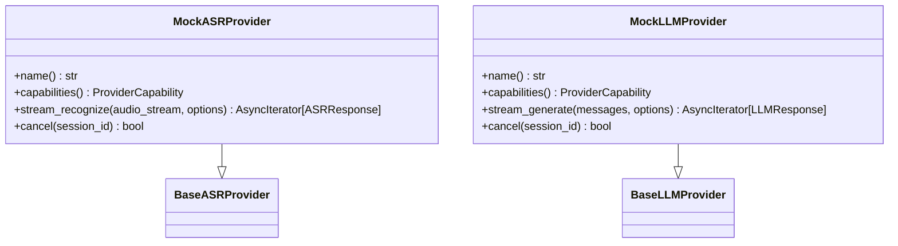

**Diagram sources**
- [mock_asr.py:16-213](file://py/provider_gateway/app/providers/asr/mock_asr.py#L16-L213)
- [mock_llm.py:15-209](file://py/provider_gateway/app/providers/llm/mock_llm.py#L15-L209)
- [base_provider.py:39-169](file://py/provider_gateway/app/core/base_provider.py#L39-L169)

**Section sources**
- [mock_asr.py:1-221](file://py/provider_gateway/app/providers/asr/mock_asr.py#L1-L221)
- [mock_llm.py:1-218](file://py/provider_gateway/app/providers/llm/mock_llm.py#L1-L218)

### Cross-Language Communication and Message Protocols
The gRPC services define strongly-typed messages for each domain:
- ASR: bidirectional streaming for audio input and transcript output, with cancellation and capability queries
- LLM: server streaming for chat messages and token output, with cancellation and capability queries
- TTS: server streaming for text input and audio output, with cancellation and capability queries
- Common: shared types for session context, timing metadata, audio format, and capability flags

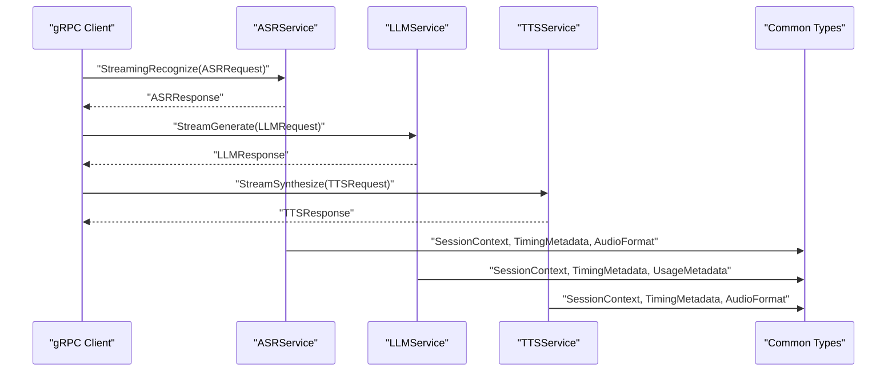

**Diagram sources**
- [asr_servicer.py:42-122](file://py/provider_gateway/app/grpc_api/asr_servicer.py#L42-L122)
- [llm_servicer.py:38-105](file://py/provider_gateway/app/grpc_api/llm_servicer.py#L38-L105)
- [tts_servicer.py:41-110](file://py/provider_gateway/app/grpc_api/tts_servicer.py#L41-L110)
- [asr.py:30-57](file://py/provider_gateway/app/models/asr.py#L30-L57)
- [llm.py:40-69](file://py/provider_gateway/app/models/llm.py#L40-L69)
- [tts.py:23-49](file://py/provider_gateway/app/models/tts.py#L23-L49)

**Section sources**
- [asr.py:1-65](file://py/provider_gateway/app/models/asr.py#L1-L65)
- [llm.py:1-78](file://py/provider_gateway/app/models/llm.py#L1-L78)
- [tts.py:1-56](file://py/provider_gateway/app/models/tts.py#L1-L56)

### Provider Registration, Capability Querying, and Service Invocation
Concrete examples of operational flows:
- Registration: Built-in providers are registered via module-level register_providers functions
- Capability querying: Clients call GetCapabilities to retrieve ProviderCapability
- Service invocation: Clients stream audio/text and receive streamed responses

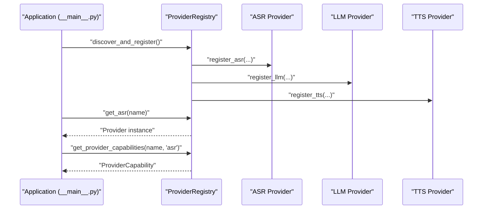

**Diagram sources**
- [__main__.py:44-51](file://py/provider_gateway/app/__main__.py#L44-L51)
- [registry.py:206-241](file://py/provider_gateway/app/core/registry.py#L206-L241)
- [asr/__init__.py:13-28](file://py/provider_gateway/app/providers/asr/__init__.py#L13-L28)
- [llm/__init__.py:13-28](file://py/provider_gateway/app/providers/llm/__init__.py#L13-L28)
- [tts/__init__.py:13-28](file://py/provider_gateway/app/providers/tts/__init__.py#L13-L28)

**Section sources**
- [__main__.py:44-51](file://py/provider_gateway/app/__main__.py#L44-L51)
- [registry.py:206-241](file://py/provider_gateway/app/core/registry.py#L206-L241)

## Dependency Analysis
The provider gateway exhibits clear layering and low coupling:
- Entry points depend on configuration and registry
- Registry depends on base provider interfaces and capability model
- gRPC servicers depend on registry and models
- Providers depend on base interfaces and models
- Configuration is decoupled via settings abstraction

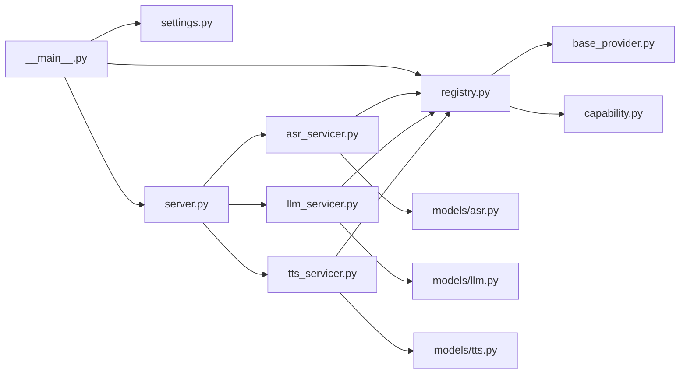

**Diagram sources**
- [__main__.py:15-64](file://py/provider_gateway/app/__main__.py#L15-L64)
- [server.py:136-164](file://py/provider_gateway/app/grpc_api/server.py#L136-L164)
- [asr_servicer.py:1-25](file://py/provider_gateway/app/grpc_api/asr_servicer.py#L1-L25)
- [llm_servicer.py:1-21](file://py/provider_gateway/app/grpc_api/llm_servicer.py#L1-L21)
- [tts_servicer.py:1-24](file://py/provider_gateway/app/grpc_api/tts_servicer.py#L1-L24)
- [registry.py:1-39](file://py/provider_gateway/app/core/registry.py#L1-L39)
- [base_provider.py:1-10](file://py/provider_gateway/app/core/base_provider.py#L1-L10)

**Section sources**
- [registry.py:1-287](file://py/provider_gateway/app/core/registry.py#L1-L287)

## Performance Considerations
- Concurrency: The gRPC server uses a configurable thread pool to handle concurrent RPCs efficiently.
- Streaming: Provider implementations should minimize latency in streaming loops and avoid blocking operations.
- Caching: Provider instances are cached per configuration to reduce startup overhead.
- Observability: Metrics and tracing are enabled via telemetry configuration for monitoring and debugging.
- Resource limits: gRPC message sizes are configured to accommodate larger payloads.

[No sources needed since this section provides general guidance]

## Troubleshooting Guide
- Provider not found: Ensure providers are registered and the provider name matches the registered key.
- Capability mismatches: Verify provider capabilities align with client expectations.
- Cancellation failures: Confirm session tracking and provider cancel implementation.
- Configuration issues: Validate YAML configuration and environment overrides.
- Telemetry problems: Check logging levels, metrics port, and OpenTelemetry endpoint settings.

**Section sources**
- [asr_servicer.py:70-76](file://py/provider_gateway/app/grpc_api/asr_servicer.py#L70-L76)
- [llm_servicer.py:63-70](file://py/provider_gateway/app/grpc_api/llm_servicer.py#L63-L70)
- [tts_servicer.py:66-73](file://py/provider_gateway/app/grpc_api/tts_servicer.py#L66-L73)
- [errors.py](file://py/provider_gateway/app/core/errors.py)
- [settings.py:131-150](file://py/provider_gateway/app/config/settings.py#L131-L150)

## Conclusion
The Provider-Gateway service provides a robust, extensible foundation for bridging the Go orchestrator with diverse AI providers. Its provider framework, capability-driven design, and gRPC-based communication enable scalable deployments, comprehensive observability, and seamless integration of new providers. The included mock providers and structured architecture simplify development, testing, and production operations.

[No sources needed since this section summarizes without analyzing specific files]

## Appendices

### Provider Scaling Strategies
- Horizontal scaling: Run multiple provider gateway instances behind a load balancer
- Vertical scaling: Increase max workers and adjust resource limits
- Health checks: Expose readiness/liveness endpoints and integrate with service mesh
- Circuit breakers: Integrate with upstream providers to prevent cascading failures

[No sources needed since this section provides general guidance]

### Health Monitoring and Integration Testing Approaches
- Metrics: Expose Prometheus-compatible metrics for latency, throughput, and error rates
- Tracing: Enable OpenTelemetry for distributed tracing across services
- Tests: Use pytest fixtures to initialize registry and mock providers for unit/integration tests
- End-to-end: Simulate client interactions with the gRPC server and validate streaming behavior

[No sources needed since this section provides general guidance]