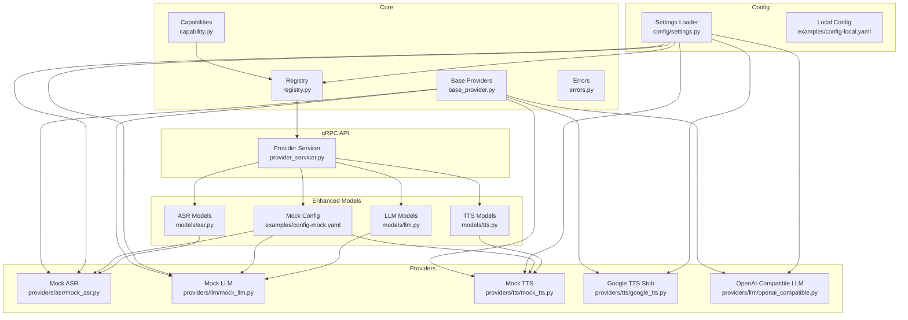
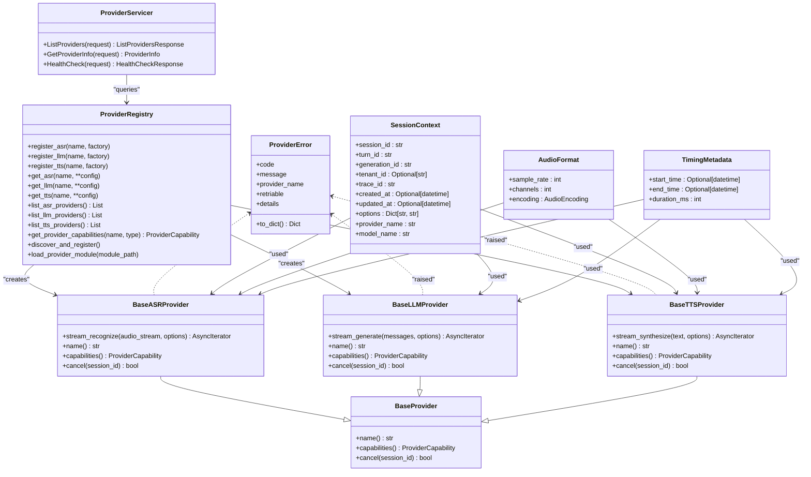
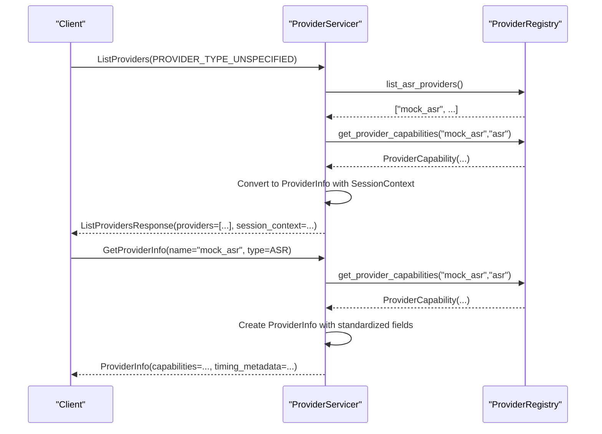
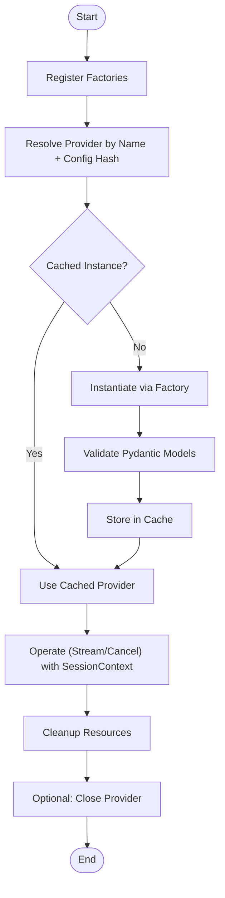
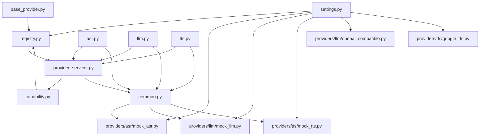

# Python Provider Framework

<cite>
**Referenced Files in This Document**
- [base_provider.py](file://py/provider_gateway/app/core/base_provider.py)
- [capability.py](file://py/provider_gateway/app/core/capability.py)
- [registry.py](file://py/provider_gateway/app/core/registry.py)
- [errors.py](file://py/provider_gateway/app/core/errors.py)
- [provider_servicer.py](file://py/provider_gateway/app/grpc_api/provider_servicer.py)
- [common.py](file://py/provider_gateway/app/models/common.py)
- [asr.py](file://py/provider_gateway/app/models/asr.py)
- [llm.py](file://py/provider_gateway/app/models/llm.py)
- [tts.py](file://py/provider_gateway/app/models/tts.py)
- [mock_asr.py](file://py/provider_gateway/app/providers/asr/mock_asr.py)
- [mock_llm.py](file://py/provider_gateway/app/providers/llm/mock_llm.py)
- [mock_tts.py](file://py/provider_gateway/app/providers/tts/mock_tts.py)
- [google_tts.py](file://py/provider_gateway/app/providers/tts/google_tts.py)
- [openai_compatible.py](file://py/provider_gateway/app/providers/llm/openai_compatible.py)
- [settings.py](file://py/provider_gateway/app/config/settings.py)
- [config-mock.yaml](file://examples/config-mock.yaml)
- [config-local.yaml](file://examples/config-local.yaml)
</cite>

## Update Summary
**Changes Made**
- Added comprehensive Pydantic models for standardized audio formats, session contexts, and timing metadata
- Enhanced provider architectures with robust data validation and serialization
- Integrated standardized models across ASR, LLM, and TTS domains
- Improved capability discovery with structured session context propagation
- Enhanced error handling with standardized provider error models

## Table of Contents
1. [Introduction](#introduction)
2. [Project Structure](#project-structure)
3. [Core Components](#core-components)
4. [Architecture Overview](#architecture-overview)
5. [Detailed Component Analysis](#detailed-component-analysis)
6. [Dependency Analysis](#dependency-analysis)
7. [Performance Considerations](#performance-considerations)
8. [Troubleshooting Guide](#troubleshooting-guide)
9. [Conclusion](#conclusion)
10. [Appendices](#appendices)

## Introduction
This document describes the Python Provider Framework used by the provider gateway to standardize and manage AI service providers for Automatic Speech Recognition (ASR), Large Language Model (LLM), and Text-to-Speech (TTS). The framework has been enhanced with robust Pydantic models for standardized audio formats, session contexts, timing metadata, and comprehensive provider architectures. It explains the abstract base provider interface design, capability discovery, lifecycle management, error handling patterns, and common utilities. It also provides guidelines for implementing custom providers, defining capabilities, handling provider-specific configurations, and integrating with external AI services.

## Project Structure
The provider gateway organizes core abstractions, provider implementations, gRPC interfaces, configuration, and models into cohesive packages with enhanced Pydantic-based data structures:
- Core abstractions and utilities: base provider interfaces, capability model, registry, and error handling
- Enhanced Pydantic models: standardized audio formats, session contexts, timing metadata, and domain-specific models
- Provider implementations: mock providers for testing and adapters for external services
- gRPC API: provider service implementation for listing providers and returning capabilities
- Configuration: settings loader and YAML-based configuration for providers

**Diagram sources**
- [base_provider.py:12-177](file://py/provider_gateway/app/core/base_provider.py#L12-L177)
- [capability.py:7-61](file://py/provider_gateway/app/core/capability.py#L7-L61)
- [registry.py:19-287](file://py/provider_gateway/app/core/registry.py#L19-L287)
- [errors.py:8-148](file://py/provider_gateway/app/core/errors.py#L8-L148)
- [provider_servicer.py:28-190](file://py/provider_gateway/app/grpc_api/provider_servicer.py#L28-L190)
- [common.py:1-69](file://py/provider_gateway/app/models/common.py#L1-69)
- [asr.py:1-65](file://py/provider_gateway/app/models/asr.py#L1-65)
- [llm.py:1-78](file://py/provider_gateway/app/models/llm.py#L1-78)
- [tts.py:1-56](file://py/provider_gateway/app/models/tts.py#L1-56)
- [mock_asr.py:16-221](file://py/provider_gateway/app/providers/asr/mock_asr.py#L16-L221)
- [mock_llm.py:15-218](file://py/provider_gateway/app/providers/llm/mock_llm.py#L15-L218)
- [mock_tts.py:17-206](file://py/provider_gateway/app/providers/tts/mock_tts.py#L17-L206)
- [google_tts.py:14-107](file://py/provider_gateway/app/providers/tts/google_tts.py#L14-L107)
- [openai_compatible.py:18-288](file://py/provider_gateway/app/providers/llm/openai_compatible.py#L18-L288)
- [settings.py:12-161](file://py/provider_gateway/app/config/settings.py#L12-L161)
- [config-mock.yaml:14-44](file://examples/config-mock.yaml#L14-L44)
- [config-local.yaml:12-38](file://examples/config-local.yaml#L12-L38)

**Section sources**
- [base_provider.py:12-177](file://py/provider_gateway/app/core/base_provider.py#L12-L177)
- [capability.py:7-61](file://py/provider_gateway/app/core/capability.py#L7-L61)
- [registry.py:19-287](file://py/provider_gateway/app/core/registry.py#L19-L287)
- [provider_servicer.py:28-190](file://py/provider_gateway/app/grpc_api/provider_servicer.py#L28-L190)
- [common.py:1-69](file://py/provider_gateway/app/models/common.py#L1-69)
- [asr.py:1-65](file://py/provider_gateway/app/models/asr.py#L1-65)
- [llm.py:1-78](file://py/provider_gateway/app/models/llm.py#L1-78)
- [tts.py:1-56](file://py/provider_gateway/app/models/tts.py#L1-56)
- [settings.py:12-161](file://py/provider_gateway/app/config/settings.py#L12-L161)

## Core Components
This section documents the foundational abstractions and utilities that define the enhanced provider framework with standardized data models.

### Enhanced Pydantic Models
The framework now includes comprehensive Pydantic models for standardized data handling:

- **Common Models**
  - AudioFormat: Standardized audio specifications with sample rate, channels, and encoding
  - SessionContext: Unified session context across all services with identifiers and metadata
  - TimingMetadata: Operation timing tracking with start/end times and duration
  - AudioEncoding: Enumerated audio encoding formats (PCM16, OPUS, G711_ULAW, G711_ALAW)

- **Domain-Specific Models**
  - ASR: WordTimestamp, ASROptions, ASRRequest, ASRResponse with standardized audio formats
  - LLM: ChatMessage, UsageMetadata, LLMOptions, LLMRequest, LLMResponse with token usage tracking
  - TTS: TTSOptions, TTSRequest, TTSResponse with audio format specifications

### Core Provider Interfaces
- BaseProvider: defines the provider identity and cancellation contract
- BaseASRProvider, BaseLLMProvider, BaseTTSProvider: extend BaseProvider with streaming operations and capability declarations using enhanced Pydantic models

### Capability Discovery and Registry
- ProviderCapability: typed capability descriptor with conversion helpers for protocol buffers
- ProviderRegistry: thread-safe factory and caching mechanism for provider instances, with discovery and dynamic module loading
- Enhanced ProviderServicer: exposes provider listing and capability queries with standardized session context propagation

### Error Handling and Configuration
- ProviderError and ProviderErrorCode: standardized error representation and normalization utilities
- Enhanced Settings: Pydantic-based configuration with validation and environment overrides

**Section sources**
- [common.py:1-69](file://py/provider_gateway/app/models/common.py#L1-69)
- [asr.py:1-65](file://py/provider_gateway/app/models/asr.py#L1-65)
- [llm.py:1-78](file://py/provider_gateway/app/models/llm.py#L1-78)
- [tts.py:1-56](file://py/provider_gateway/app/models/tts.py#L1-56)
- [base_provider.py:12-177](file://py/provider_gateway/app/core/base_provider.py#L12-L177)
- [capability.py:7-61](file://py/provider_gateway/app/core/capability.py#L7-L61)
- [registry.py:19-287](file://py/provider_gateway/app/core/registry.py#L19-L287)
- [errors.py:8-148](file://py/provider_gateway/app/core/errors.py#L8-L148)
- [provider_servicer.py:28-190](file://py/provider_gateway/app/grpc_api/provider_servicer.py#L28-L190)
- [settings.py:12-161](file://py/provider_gateway/app/config/settings.py#L12-L161)

## Architecture Overview
The enhanced provider framework follows a modular architecture with standardized data models:
- Abstractions define contracts for providers and capabilities with Pydantic validation
- Enhanced models ensure consistent data structures across all provider types
- Registry manages provider factories and caches instances with standardized session contexts
- gRPC service surfaces provider metadata and capabilities with structured responses
- Configuration drives provider selection and initialization with validated settings

**Diagram sources**
- [base_provider.py:12-177](file://py/provider_gateway/app/core/base_provider.py#L12-L177)
- [registry.py:19-287](file://py/provider_gateway/app/core/registry.py#L19-L287)
- [provider_servicer.py:28-190](file://py/provider_gateway/app/grpc_api/provider_servicer.py#L28-L190)
- [errors.py:24-148](file://py/provider_gateway/app/core/errors.py#L24-L148)
- [common.py:27-69](file://py/provider_gateway/app/models/common.py#L27-69)
- [asr.py:30-65](file://py/provider_gateway/app/models/asr.py#L30-65)
- [llm.py:40-78](file://py/provider_gateway/app/models/llm.py#L40-78)
- [tts.py:23-56](file://py/provider_gateway/app/models/tts.py#L23-56)

## Detailed Component Analysis

### Enhanced Pydantic Model System
The framework now uses comprehensive Pydantic models for standardized data handling:

#### Common Models
- **AudioFormat**: Provides standardized audio specifications with validation for sample rates, channels, and encoding formats
- **SessionContext**: Centralized session management with unique identifiers, tenant information, and distributed tracing support
- **TimingMetadata**: Structured timing information for performance monitoring and debugging
- **AudioEncoding**: Enumerated audio formats ensuring consistency across providers

#### Domain-Specific Enhancements
- **ASR Models**: Enhanced with standardized audio formats, word timestamps, and comprehensive session context
- **LLM Models**: Integrated token usage metadata and structured chat message formats
- **TTS Models**: Audio format specifications and segment indexing for multi-part synthesis

**Section sources**
- [common.py:1-69](file://py/provider_gateway/app/models/common.py#L1-69)
- [asr.py:1-65](file://py/provider_gateway/app/models/asr.py#L1-65)
- [llm.py:1-78](file://py/provider_gateway/app/models/llm.py#L1-78)
- [tts.py:1-56](file://py/provider_gateway/app/models/tts.py#L1-56)

### Base Provider Interfaces with Enhanced Models
The abstract base classes now leverage the new Pydantic models for consistent data handling:

- **Identity**: name() returns a human-readable provider identifier
- **Capabilities**: capabilities() returns a ProviderCapability describing streaming support, interruptibility, and media preferences
- **Cancellation**: cancel(session_id) enables interruption of in-flight operations
- **Enhanced Streaming**: All streaming methods now use standardized Pydantic models for request/response validation

Key behaviors:
- Streaming recognition/generation/synthesis via async iterators with Pydantic validation
- Deterministic session identification for cancellation and timing through SessionContext
- Consistent metadata propagation via standardized session context and timing metadata

**Section sources**
- [base_provider.py:12-177](file://py/provider_gateway/app/core/base_provider.py#L12-L177)

### Enhanced Capability Discovery Mechanism
Provider capabilities are now integrated with standardized session context propagation:

- **ProviderCapability**: attributes describe streaming, word timestamps, voices, interruptibility, preferred sample rates, and supported codecs
- **Enhanced ProviderServicer**: converts internal capabilities to protocol buffer form with standardized ProviderInfo responses
- **Session Context Integration**: All provider responses now include structured session context for consistent tracking

Discovery flow:
- Registry.get_provider_capabilities resolves a provider instance and reads its capabilities
- ProviderServicer.ListProviders and GetProviderInfo use the registry to populate responses with standardized metadata
- Enhanced ProviderInfo includes comprehensive provider information with validation

**Diagram sources**
- [provider_servicer.py:43-169](file://py/provider_gateway/app/grpc_api/provider_servicer.py#L43-L169)
- [registry.py:182-204](file://py/provider_gateway/app/core/registry.py#L182-L204)
- [capability.py:30-57](file://py/provider_gateway/app/core/capability.py#L30-L57)
- [common.py:52-69](file://py/provider_gateway/app/models/common.py#L52-69)

**Section sources**
- [capability.py:7-61](file://py/provider_gateway/app/core/capability.py#L7-L61)
- [provider_servicer.py:28-190](file://py/provider_gateway/app/grpc_api/provider_servicer.py#L28-L190)
- [registry.py:182-204](file://py/provider_gateway/app/core/registry.py#L182-L204)

### Enhanced Provider Lifecycle Management
Lifecycle stages with standardized data models:
- **Registration**: register_asr/register_llm/register_tts accept factory functions keyed by provider name
- **Resolution**: get_asr/get_llm/get_tts instantiate providers using cached keys derived from name and hashed config
- **Caching**: instances are cached by name+config hash to avoid redundant creation
- **Enhanced Cleanup**: providers may expose close() semantics with proper resource management
- **Session Context Management**: All operations now include standardized session context propagation

**Diagram sources**
- [registry.py:85-168](file://py/provider_gateway/app/core/registry.py#L85-L168)
- [openai_compatible.py:275-280](file://py/provider_gateway/app/providers/llm/openai_compatible.py#L275-L280)
- [common.py:27-42](file://py/provider_gateway/app/models/common.py#L27-42)

**Section sources**
- [registry.py:19-287](file://py/provider_gateway/app/core/registry.py#L19-L287)
- [openai_compatible.py:275-280](file://py/provider_gateway/app/providers/llm/openai_compatible.py#L275-L280)

### Enhanced Error Handling Patterns
Standardization with Pydantic validation:
- **ProviderError**: Encapsulates code, message, provider name, retry flag, and details with structured error reporting
- **normalize_error**: Maps exceptions to ProviderErrorCode and sets retriable flags heuristically
- **is_retriable**: Determines whether an operation should be retried based on standardized criteria
- **Enhanced Validation**: Pydantic models provide automatic validation and serialization

Common patterns:
- External service failures mapped to SERVICE_UNAVAILABLE or TIMEOUT with structured error details
- Authentication/authorization mapped to AUTHENTICATION or AUTHORIZATION with provider context
- Rate limits and quotas mapped to RATE_LIMITED and QUOTA_EXCEEDED with timing metadata
- Cancellations mapped to CANCELED with session context preservation

**Section sources**
- [errors.py:8-148](file://py/provider_gateway/app/core/errors.py#L8-L148)

### Enhanced Common Utility Functions
- **ProviderCapability.to_proto/from_proto**: Bridge between internal capability and protobuf messages with validation
- **Enhanced ProviderServicer**: Capability conversion with standardized ProviderInfo responses
- **Settings.get_provider_config**: Retrieves provider-specific configuration from YAML with Pydantic validation
- **Pydantic Model Validation**: Automatic validation and serialization for all domain-specific models

**Section sources**
- [capability.py:30-57](file://py/provider_gateway/app/core/capability.py#L30-L57)
- [provider_servicer.py:123-139](file://py/provider_gateway/app/grpc_api/provider_servicer.py#L123-L139)
- [settings.py:114-124](file://py/provider_gateway/app/config/settings.py#L114-L124)

### Enhanced Concrete Provider Implementations

#### Enhanced Mock Providers
- **MockASRProvider**: Deterministic partial and final transcripts with standardized Pydantic models, word timestamps, and cancellation support
- **MockLLMProvider**: Streaming token chunks with configurable delays, token batching, and usage metadata
- **MockTTSProvider**: PCM16 sine wave audio generation with adjustable frequency, chunk timing, and audio format specifications

Capabilities with enhanced models:
- Mock providers advertise streaming output and interruptible generation with standardized session context
- Preferred sample rates and supported codecs reflect typical development/testing needs with Pydantic validation
- All responses include TimingMetadata for performance tracking

**Section sources**
- [mock_asr.py:16-221](file://py/provider_gateway/app/providers/asr/mock_asr.py#L16-L221)
- [mock_llm.py:15-218](file://py/provider_gateway/app/providers/llm/mock_llm.py#L15-L218)
- [mock_tts.py:17-206](file://py/provider_gateway/app/providers/tts/mock_tts.py#L17-L206)

#### Enhanced External Adapter: OpenAI-Compatible LLM
- **OpenAICompatibleLLMProvider**: Streams SSE responses from OpenAI-compatible endpoints with Pydantic validation
- **Supports cancellation**, usage metadata extraction, robust error mapping, and structured session context
- **Lifecycle**: Lazily initializes httpx.AsyncClient with proper resource management

**Section sources**
- [openai_compatible.py:18-288](file://py/provider_gateway/app/providers/llm/openai_compatible.py#L18-L288)

#### Enhanced External Stub: Google TTS
- **GoogleTTSProvider**: Placeholder that advertises capabilities with standardized ProviderInfo and raises NotImplementedError with guidance
- **Useful for environments** where credentials are not available with proper error context

**Section sources**
- [google_tts.py:14-107](file://py/provider_gateway/app/providers/tts/google_tts.py#L14-L107)

### Enhanced Provider Initialization, Resource Management, and Cleanup
Initialization with Pydantic validation:
- **Providers** are constructed via factory functions registered with the registry with configuration validation
- **Configuration** is passed through provider-specific dictionaries keyed by provider name with Pydantic settings
- **Resource management**: Mock providers keep minimal resources with proper cleanup
- **Enhanced Resource management**: OpenAI-compatible provider maintains an httpx.AsyncClient and closes it on demand
- **Registry caching**: Instances are cached to reduce overhead with proper session context management
- **Cleanup**: Call close() on providers that expose it with proper resource deallocation

**Section sources**
- [registry.py:85-168](file://py/provider_gateway/app/core/registry.py#L85-L168)
- [openai_compatible.py:275-280](file://py/provider_gateway/app/providers/llm/openai_compatible.py#L275-L280)
- [settings.py:139-149](file://py/provider_gateway/app/config/settings.py#L139-L149)

### Extending the Framework with New Provider Types
To add a new provider type (e.g., Speaker Diarization) with enhanced model support:
- **Define a new abstract base class** similar to BaseASRProvider/BaseLLMProvider/BaseTTSProvider with Pydantic model integration
- **Implement concrete provider(s)** adhering to the new base with standardized session context
- **Register factories** with ProviderRegistry.register_<type> with proper validation
- **Expose capabilities** via ProviderCapability with enhanced metadata
- **Integrate with gRPC service** if needed with standardized ProviderInfo responses
- **Follow Pydantic patterns** for request/response model validation

Guidelines:
- Keep streaming signatures consistent with existing patterns using Pydantic models
- Implement cancel() to honor session-based interruption with session context
- Populate ProviderCapability accurately for capability discovery with metadata
- Use ProviderError for consistent error reporting with structured context
- Leverage TimingMetadata for performance tracking and debugging

### Integrating with External AI Services
Enhanced patterns with standardized models:
- **HTTP streaming** with SSE parsing (OpenAI-compatible LLM) with Pydantic validation
- **Protocol buffer capability mapping** for gRPC exposure with standardized ProviderInfo
- **Configuration-driven provider selection** and tuning with Pydantic settings validation
- **Session context propagation** across all provider interactions for consistent tracking

Best practices:
- **Validate and normalize errors** early with structured error reporting
- **Support cancellation** to maintain responsiveness with session context preservation
- **Prefer streaming APIs** for latency-sensitive workloads with Pydantic model validation
- **Document provider-specific configuration keys** and defaults with Pydantic validation
- **Use standardized audio formats** and session contexts for interoperability

**Section sources**
- [openai_compatible.py:87-260](file://py/provider_gateway/app/providers/llm/openai_compatible.py#L87-L260)
- [capability.py:30-57](file://py/provider_gateway/app/core/capability.py#L30-L57)
- [common.py:27-69](file://py/provider_gateway/app/models/common.py#L27-69)

## Dependency Analysis
The enhanced framework exhibits low coupling and high cohesion with standardized model dependencies:
- **Core abstractions** decouple providers from consumers with Pydantic validation
- **Enhanced models** provide consistent data structures across all provider types
- **Registry** centralizes provider lifecycle and discovery with standardized session context
- **gRPC service** depends on registry and capability model with structured responses
- **Configuration** is injected via Pydantic settings loader with validation
- **All providers** use standardized models for consistent behavior

**Diagram sources**
- [base_provider.py:12-177](file://py/provider_gateway/app/core/base_provider.py#L12-L177)
- [capability.py:7-61](file://py/provider_gateway/app/core/capability.py#L7-L61)
- [registry.py:19-287](file://py/provider_gateway/app/core/registry.py#L19-L287)
- [provider_servicer.py:28-190](file://py/provider_gateway/app/grpc_api/provider_servicer.py#L28-L190)
- [common.py:1-69](file://py/provider_gateway/app/models/common.py#L1-69)
- [asr.py:1-65](file://py/provider_gateway/app/models/asr.py#L1-65)
- [llm.py:1-78](file://py/provider_gateway/app/models/llm.py#L1-78)
- [tts.py:1-56](file://py/provider_gateway/app/models/tts.py#L1-56)
- [settings.py:12-161](file://py/provider_gateway/app/config/settings.py#L12-L161)
- [mock_asr.py:16-221](file://py/provider_gateway/app/providers/asr/mock_asr.py#L16-L221)
- [mock_llm.py:15-218](file://py/provider_gateway/app/providers/llm/mock_llm.py#L15-L218)
- [mock_tts.py:17-206](file://py/provider_gateway/app/providers/tts/mock_tts.py#L17-L206)
- [openai_compatible.py:18-288](file://py/provider_gateway/app/providers/llm/openai_compatible.py#L18-L288)
- [google_tts.py:14-107](file://py/provider_gateway/app/providers/tts/google_tts.py#L14-L107)

**Section sources**
- [registry.py:19-287](file://py/provider_gateway/app/core/registry.py#L19-L287)
- [provider_servicer.py:28-190](file://py/provider_gateway/app/grpc_api/provider_servicer.py#L28-L190)

## Performance Considerations
Enhanced performance with standardized models:
- **Streaming-first design** reduces latency and memory footprint with Pydantic validation
- **Caching provider instances** avoids repeated initialization costs with session context preservation
- **Configurable delays and chunk sizes** enable tuning for different environments with standardized timing
- **Proper error classification** enables intelligent retries and backoff strategies with structured error reporting
- **Pydantic validation** provides compile-time and runtime safety with minimal overhead
- **Session context tracking** enables efficient resource management and cleanup

## Troubleshooting Guide
Enhanced troubleshooting with standardized models:
Common issues and resolutions:
- **Provider not found**: Verify registration and provider name; check registry logs with session context
- **Capability mismatches**: Confirm advertised capabilities match client expectations with standardized metadata
- **Cancellation not working**: Ensure session_id is propagated and tracked consistently with SessionContext
- **External service errors**: Inspect normalized ProviderError for retriable flag and details with structured context
- **Configuration problems**: Validate YAML structure and environment overrides with Pydantic validation
- **Audio format issues**: Verify AudioFormat specifications match provider capabilities with standardized validation
- **Session context problems**: Check SessionContext propagation across provider boundaries with timing metadata

**Section sources**
- [registry.py:101-112](file://py/provider_gateway/app/core/registry.py#L101-L112)
- [errors.py:125-139](file://py/provider_gateway/app/core/errors.py#L125-L139)
- [openai_compatible.py:240-259](file://py/provider_gateway/app/providers/llm/openai_compatible.py#L240-L259)
- [common.py:27-69](file://py/provider_gateway/app/models/common.py#L27-69)

## Conclusion
The enhanced Python Provider Framework provides a robust, extensible foundation for integrating diverse AI services with standardized data models. Its abstract base classes, comprehensive Pydantic models, capability system, registry, and error handling standardize provider behavior while enabling flexible configuration and discovery. The enhanced framework ensures consistent session context propagation, standardized audio formats, and structured timing metadata across all provider types. By following the patterns outlined here, teams can implement custom providers, integrate external services, and operate at scale with predictable performance and reliability using validated data models.

## Appendices

### Enhanced Provider Capability Reference
ProviderCapability attributes with standardized metadata:
- **supports_streaming_input**: Whether provider accepts streaming input
- **supports_streaming_output**: Whether provider yields streaming output
- **supports_word_timestamps**: Whether ASR provider emits word-level timestamps
- **supports_voices**: Whether TTS provider supports multiple voices
- **supports_interruptible_generation**: Whether generation can be canceled mid-stream
- **preferred_sample_rates**: List of preferred audio sample rates
- **supported_codecs**: List of supported audio codecs

### Enhanced Configuration Examples
- **Mock configuration**: Default providers set to "mock" with per-provider tuning and Pydantic validation
- **Local configuration**: Selects faster-whisper, openai_compatible, and xtts with runtime parameters and standardized settings
- **Enhanced settings**: Pydantic-based configuration with environment overrides and validation

**Section sources**
- [config-mock.yaml:14-44](file://examples/config-mock.yaml#L14-L44)
- [config-local.yaml:12-38](file://examples/config-local.yaml#L12-L38)
- [settings.py:53-161](file://py/provider_gateway/app/config/settings.py#L53-L161)

### Enhanced Model Reference
Comprehensive Pydantic model documentation:
- **AudioFormat**: Standardized audio specifications with validation
- **SessionContext**: Unified session management with identifiers and metadata
- **TimingMetadata**: Structured timing information for performance tracking
- **ASROptions/ASRRequest/ASRResponse**: Complete ASR workflow with standardized models
- **LLMOptions/LLMRequest/LLMResponse**: LLM workflow with token usage tracking
- **TTSOptions/TTSRequest/TTSResponse**: TTS workflow with audio format specifications

**Section sources**
- [common.py:1-69](file://py/provider_gateway/app/models/common.py#L1-69)
- [asr.py:1-65](file://py/provider_gateway/app/models/asr.py#L1-65)
- [llm.py:1-78](file://py/provider_gateway/app/models/llm.py#L1-78)
- [tts.py:1-56](file://py/provider_gateway/app/models/tts.py#L1-56)