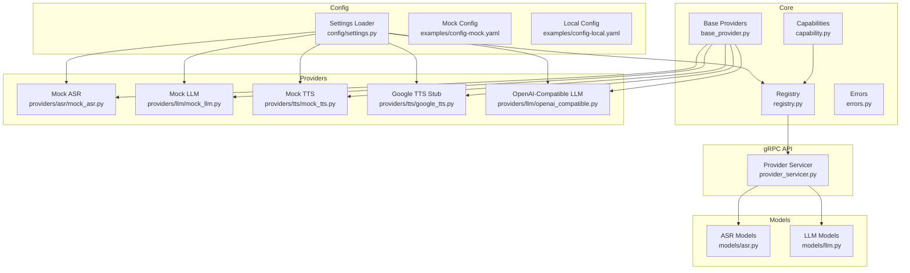
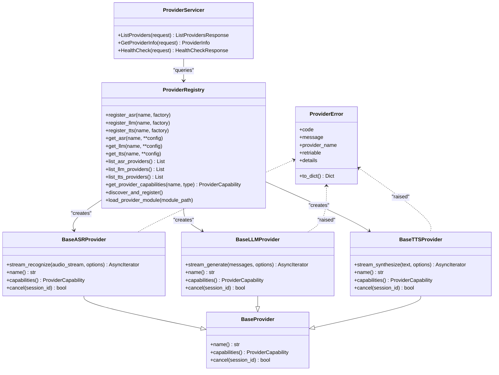
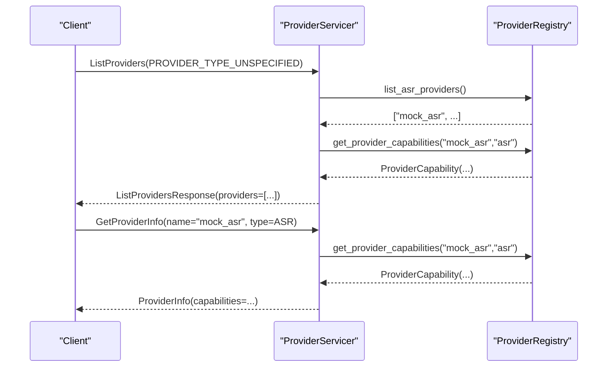
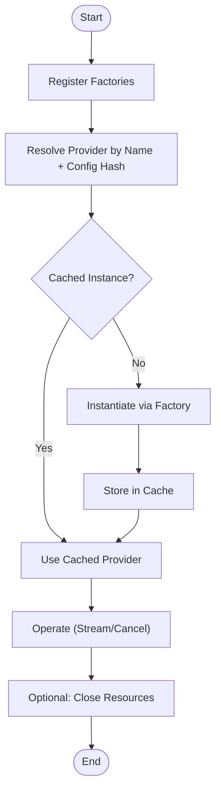
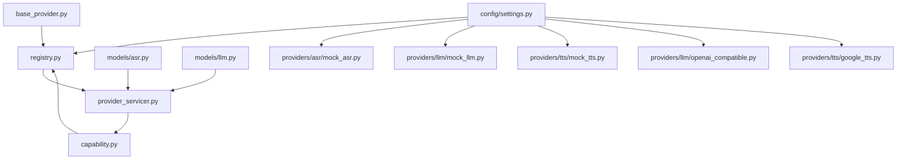

# Python Provider Framework

<cite>
**Referenced Files in This Document**
- [base_provider.py](file://py/provider_gateway/app/core/base_provider.py)
- [capability.py](file://py/provider_gateway/app/core/capability.py)
- [registry.py](file://py/provider_gateway/app/core/registry.py)
- [errors.py](file://py/provider_gateway/app/core/errors.py)
- [provider_servicer.py](file://py/provider_gateway/app/grpc_api/provider_servicer.py)
- [mock_asr.py](file://py/provider_gateway/app/providers/asr/mock_asr.py)
- [mock_llm.py](file://py/provider_gateway/app/providers/llm/mock_llm.py)
- [mock_tts.py](file://py/provider_gateway/app/providers/tts/mock_tts.py)
- [google_tts.py](file://py/provider_gateway/app/providers/tts/google_tts.py)
- [openai_compatible.py](file://py/provider_gateway/app/providers/llm/openai_compatible.py)
- [asr.py](file://py/provider_gateway/app/models/asr.py)
- [llm.py](file://py/provider_gateway/app/models/llm.py)
- [settings.py](file://py/provider_gateway/app/config/settings.py)
- [config-mock.yaml](file://examples/config-mock.yaml)
- [config-local.yaml](file://examples/config-local.yaml)
</cite>

## Table of Contents
1. [Introduction](#introduction)
2. [Project Structure](#project-structure)
3. [Core Components](#core-components)
4. [Architecture Overview](#architecture-overview)
5. [Detailed Component Analysis](#detailed-component-analysis)
6. [Dependency Analysis](#dependency-analysis)
7. [Performance Considerations](#performance-considerations)
8. [Troubleshooting Guide](#troubleshooting-guide)
9. [Conclusion](#conclusion)
10. [Appendices](#appendices)

## Introduction
This document describes the Python Provider Framework used by the provider gateway to standardize and manage AI service providers for Automatic Speech Recognition (ASR), Large Language Model (LLM), and Text-to-Speech (TTS). It explains the abstract base provider interface design, capability discovery, lifecycle management, error handling patterns, and common utilities. It also provides guidelines for implementing custom providers, defining capabilities, handling provider-specific configurations, and integrating with external AI services.

## Project Structure
The provider gateway organizes core abstractions, provider implementations, gRPC interfaces, configuration, and models into cohesive packages:
- Core abstractions and utilities: base provider interfaces, capability model, registry, and error handling
- Provider implementations: mock providers for testing and adapters for external services
- gRPC API: provider service implementation for listing providers and returning capabilities
- Models: typed request/response models for ASR, LLM, and TTS
- Configuration: settings loader and YAML-based configuration for providers

**Diagram sources**
- [base_provider.py:12-177](file://py/provider_gateway/app/core/base_provider.py#L12-L177)
- [capability.py:7-61](file://py/provider_gateway/app/core/capability.py#L7-L61)
- [registry.py:19-287](file://py/provider_gateway/app/core/registry.py#L19-L287)
- [errors.py:8-148](file://py/provider_gateway/app/core/errors.py#L8-L148)
- [provider_servicer.py:28-190](file://py/provider_gateway/app/grpc_api/provider_servicer.py#L28-L190)
- [asr.py:10-65](file://py/provider_gateway/app/models/asr.py#L10-L65)
- [llm.py:10-78](file://py/provider_gateway/app/models/llm.py#L10-L78)
- [mock_asr.py:16-221](file://py/provider_gateway/app/providers/asr/mock_asr.py#L16-L221)
- [mock_llm.py:15-218](file://py/provider_gateway/app/providers/llm/mock_llm.py#L15-L218)
- [mock_tts.py:17-206](file://py/provider_gateway/app/providers/tts/mock_tts.py#L17-L206)
- [google_tts.py:14-107](file://py/provider_gateway/app/providers/tts/google_tts.py#L14-L107)
- [openai_compatible.py:18-288](file://py/provider_gateway/app/providers/llm/openai_compatible.py#L18-L288)
- [settings.py:12-161](file://py/provider_gateway/app/config/settings.py#L12-L161)
- [config-mock.yaml:14-44](file://examples/config-mock.yaml#L14-L44)
- [config-local.yaml:12-38](file://examples/config-local.yaml#L12-L38)

**Section sources**
- [base_provider.py:12-177](file://py/provider_gateway/app/core/base_provider.py#L12-L177)
- [capability.py:7-61](file://py/provider_gateway/app/core/capability.py#L7-L61)
- [registry.py:19-287](file://py/provider_gateway/app/core/registry.py#L19-L287)
- [provider_servicer.py:28-190](file://py/provider_gateway/app/grpc_api/provider_servicer.py#L28-L190)
- [asr.py:10-65](file://py/provider_gateway/app/models/asr.py#L10-L65)
- [llm.py:10-78](file://py/provider_gateway/app/models/llm.py#L10-L78)
- [settings.py:12-161](file://py/provider_gateway/app/config/settings.py#L12-L161)

## Core Components
This section documents the foundational abstractions and utilities that define the provider framework.

- Base provider interfaces
  - BaseProvider: defines the provider identity and cancellation contract
  - BaseASRProvider, BaseLLMProvider, BaseTTSProvider: extend BaseProvider with streaming operations and capability declarations
- Capability model
  - ProviderCapability: typed capability descriptor with conversion helpers for protocol buffers
- Registry
  - ProviderRegistry: thread-safe factory and caching mechanism for provider instances, with discovery and dynamic module loading
- Error handling
  - ProviderError and ProviderErrorCode: standardized error representation and normalization utilities
- gRPC provider service
  - ProviderServicer: exposes provider listing and capability queries to clients

Implementation highlights:
- Asynchronous streaming APIs for real-time processing
- Capability-driven discovery enabling clients to select compatible providers
- Centralized error normalization for consistent diagnostics and retry decisions

**Section sources**
- [base_provider.py:12-177](file://py/provider_gateway/app/core/base_provider.py#L12-L177)
- [capability.py:7-61](file://py/provider_gateway/app/core/capability.py#L7-L61)
- [registry.py:19-287](file://py/provider_gateway/app/core/registry.py#L19-L287)
- [errors.py:8-148](file://py/provider_gateway/app/core/errors.py#L8-L148)
- [provider_servicer.py:28-190](file://py/provider_gateway/app/grpc_api/provider_servicer.py#L28-L190)

## Architecture Overview
The provider framework follows a modular architecture:
- Abstractions define contracts for providers and capabilities
- Registry manages provider factories and caches instances
- gRPC service surfaces provider metadata and capabilities
- Models define request/response schemas for each domain
- Configuration drives provider selection and initialization

**Diagram sources**
- [base_provider.py:12-177](file://py/provider_gateway/app/core/base_provider.py#L12-L177)
- [registry.py:19-287](file://py/provider_gateway/app/core/registry.py#L19-L287)
- [provider_servicer.py:28-190](file://py/provider_gateway/app/grpc_api/provider_servicer.py#L28-L190)
- [errors.py:24-148](file://py/provider_gateway/app/core/errors.py#L24-L148)

## Detailed Component Analysis

### Base Provider Interfaces
The abstract base classes define the common contract for all providers:
- Identity: name() returns a human-readable provider identifier
- Capabilities: capabilities() returns a ProviderCapability describing streaming support, interruptibility, and media preferences
- Cancellation: cancel(session_id) enables interruption of in-flight operations

Key behaviors:
- Streaming recognition/generation/synthesis via async iterators
- Deterministic session identification for cancellation and timing
- Consistent metadata propagation via session context and timing metadata

**Section sources**
- [base_provider.py:12-177](file://py/provider_gateway/app/core/base_provider.py#L12-L177)

### Capability Discovery Mechanism
Provider capabilities are modeled centrally and exposed via:
- ProviderCapability: attributes describe streaming, word timestamps, voices, interruptibility, preferred sample rates, and supported codecs
- ProviderServicer: converts internal capabilities to protocol buffer form and serves provider listings and details

Discovery flow:
- Registry.get_provider_capabilities resolves a provider instance and reads its capabilities
- ProviderServicer.ListProviders and GetProviderInfo use the registry to populate responses

**Diagram sources**
- [provider_servicer.py:43-169](file://py/provider_gateway/app/grpc_api/provider_servicer.py#L43-L169)
- [registry.py:182-204](file://py/provider_gateway/app/core/registry.py#L182-L204)
- [capability.py:30-57](file://py/provider_gateway/app/core/capability.py#L30-L57)

**Section sources**
- [capability.py:7-61](file://py/provider_gateway/app/core/capability.py#L7-L61)
- [provider_servicer.py:28-190](file://py/provider_gateway/app/grpc_api/provider_servicer.py#L28-L190)
- [registry.py:182-204](file://py/provider_gateway/app/core/registry.py#L182-L204)

### Provider Lifecycle Management
Lifecycle stages:
- Registration: register_asr/register_llm/register_tts accept factory functions keyed by provider name
- Resolution: get_asr/get_llm/get_tts instantiate providers using cached keys derived from name and hashed config
- Caching: instances are cached by name+config hash to avoid redundant creation
- Cleanup: providers may expose close() semantics (e.g., OpenAI-compatible LLM provider closes HTTP client)

**Diagram sources**
- [registry.py:85-168](file://py/provider_gateway/app/core/registry.py#L85-L168)
- [openai_compatible.py:275-280](file://py/provider_gateway/app/providers/llm/openai_compatible.py#L275-L280)

**Section sources**
- [registry.py:19-287](file://py/provider_gateway/app/core/registry.py#L19-L287)
- [openai_compatible.py:275-280](file://py/provider_gateway/app/providers/llm/openai_compatible.py#L275-L280)

### Error Handling Patterns
Standardization:
- ProviderError encapsulates code, message, provider name, retry flag, and details
- normalize_error maps exceptions to ProviderErrorCode and sets retriable flags heuristically
- is_retriable determines whether an operation should be retried

Common patterns:
- External service failures mapped to SERVICE_UNAVAILABLE or TIMEOUT
- Authentication/authorization mapped to AUTHENTICATION or AUTHORIZATION
- Rate limits and quotas mapped to RATE_LIMITED and QUOTA_EXCEEDED
- Cancellations mapped to CANCELED

**Section sources**
- [errors.py:8-148](file://py/provider_gateway/app/core/errors.py#L8-L148)

### Common Utility Functions
- ProviderCapability.to_proto/from_proto: bridge between internal capability and protobuf messages
- ProviderServicer capability conversion: maps internal capability to gRPC capability
- Settings.get_provider_config: retrieves provider-specific configuration from YAML

**Section sources**
- [capability.py:30-57](file://py/provider_gateway/app/core/capability.py#L30-L57)
- [provider_servicer.py:123-139](file://py/provider_gateway/app/grpc_api/provider_servicer.py#L123-L139)
- [settings.py:114-124](file://py/provider_gateway/app/config/settings.py#L114-L124)

### Concrete Provider Implementations

#### Mock Providers
- MockASRProvider: deterministic partial and final transcripts, word timestamps, and cancellation support
- MockLLMProvider: streaming token chunks with configurable delays and token batching
- MockTTSProvider: PCM16 sine wave audio generation with adjustable frequency and chunk timing

Capabilities:
- Mock providers advertise streaming output and interruptible generation
- Preferred sample rates and supported codecs reflect typical development/testing needs

**Section sources**
- [mock_asr.py:16-221](file://py/provider_gateway/app/providers/asr/mock_asr.py#L16-L221)
- [mock_llm.py:15-218](file://py/provider_gateway/app/providers/llm/mock_llm.py#L15-L218)
- [mock_tts.py:17-206](file://py/provider_gateway/app/providers/tts/mock_tts.py#L17-L206)

#### External Adapter: OpenAI-Compatible LLM
- OpenAICompatibleLLMProvider: streams SSE responses from OpenAI-compatible endpoints (e.g., vLLM, Groq)
- Supports cancellation, usage metadata extraction, and robust error mapping

Lifecycle:
- Lazily initializes httpx.AsyncClient
- Closes client via close()

**Section sources**
- [openai_compatible.py:18-288](file://py/provider_gateway/app/providers/llm/openai_compatible.py#L18-L288)

#### External Stub: Google TTS
- GoogleTTSProvider: placeholder that advertises capabilities and raises NotImplementedError with guidance
- Useful for environments where credentials are not available

**Section sources**
- [google_tts.py:14-107](file://py/provider_gateway/app/providers/tts/google_tts.py#L14-L107)

### Provider Initialization, Resource Management, and Cleanup
Initialization:
- Providers are constructed via factory functions registered with the registry
- Configuration is passed through provider-specific dictionaries keyed by provider name

Resource management:
- Mock providers keep minimal resources
- OpenAI-compatible provider maintains an httpx.AsyncClient and closes it on demand
- Registry caches instances to reduce overhead

Cleanup:
- Call close() on providers that expose it (e.g., OpenAI-compatible LLM)
- Reset registry and settings for testing scenarios

**Section sources**
- [registry.py:85-168](file://py/provider_gateway/app/core/registry.py#L85-L168)
- [openai_compatible.py:275-280](file://py/provider_gateway/app/providers/llm/openai_compatible.py#L275-L280)
- [settings.py:139-149](file://py/provider_gateway/app/config/settings.py#L139-L149)

### Extending the Framework with New Provider Types
To add a new provider type (e.g., Speaker Diarization):
- Define a new abstract base class similar to BaseASRProvider/BaseLLMProvider/BaseTTSProvider
- Implement concrete provider(s) adhering to the new base
- Register factories with ProviderRegistry.register_<type>
- Expose capabilities via ProviderCapability
- Integrate with gRPC service if needed

Guidelines:
- Keep streaming signatures consistent with existing patterns
- Implement cancel() to honor session-based interruption
- Populate ProviderCapability accurately for capability discovery
- Use ProviderError for consistent error reporting

[No sources needed since this section provides general guidance]

### Integrating with External AI Services
Patterns demonstrated:
- HTTP streaming with SSE parsing (OpenAI-compatible LLM)
- Protocol buffer capability mapping for gRPC exposure
- Configuration-driven provider selection and tuning

Best practices:
- Validate and normalize errors early
- Support cancellation to maintain responsiveness
- Prefer streaming APIs for latency-sensitive workloads
- Document provider-specific configuration keys and defaults

**Section sources**
- [openai_compatible.py:87-260](file://py/provider_gateway/app/providers/llm/openai_compatible.py#L87-L260)
- [capability.py:30-57](file://py/provider_gateway/app/core/capability.py#L30-L57)

## Dependency Analysis
The framework exhibits low coupling and high cohesion:
- Core abstractions decouple providers from consumers
- Registry centralizes provider lifecycle and discovery
- gRPC service depends on registry and capability model
- Models isolate domain-specific schemas
- Configuration is injected via settings loader

**Diagram sources**
- [base_provider.py:12-177](file://py/provider_gateway/app/core/base_provider.py#L12-L177)
- [capability.py:7-61](file://py/provider_gateway/app/core/capability.py#L7-L61)
- [registry.py:19-287](file://py/provider_gateway/app/core/registry.py#L19-L287)
- [provider_servicer.py:28-190](file://py/provider_gateway/app/grpc_api/provider_servicer.py#L28-L190)
- [asr.py:10-65](file://py/provider_gateway/app/models/asr.py#L10-L65)
- [llm.py:10-78](file://py/provider_gateway/app/models/llm.py#L10-L78)
- [settings.py:12-161](file://py/provider_gateway/app/config/settings.py#L12-L161)
- [mock_asr.py:16-221](file://py/provider_gateway/app/providers/asr/mock_asr.py#L16-L221)
- [mock_llm.py:15-218](file://py/provider_gateway/app/providers/llm/mock_llm.py#L15-L218)
- [mock_tts.py:17-206](file://py/provider_gateway/app/providers/tts/mock_tts.py#L17-L206)
- [openai_compatible.py:18-288](file://py/provider_gateway/app/providers/llm/openai_compatible.py#L18-L288)
- [google_tts.py:14-107](file://py/provider_gateway/app/providers/tts/google_tts.py#L14-L107)

**Section sources**
- [registry.py:19-287](file://py/provider_gateway/app/core/registry.py#L19-L287)
- [provider_servicer.py:28-190](file://py/provider_gateway/app/grpc_api/provider_servicer.py#L28-L190)

## Performance Considerations
- Streaming-first design reduces latency and memory footprint
- Caching provider instances avoids repeated initialization costs
- Configurable delays and chunk sizes enable tuning for different environments
- Proper error classification enables intelligent retries and backoff strategies

[No sources needed since this section provides general guidance]

## Troubleshooting Guide
Common issues and resolutions:
- Provider not found: Verify registration and provider name; check registry logs
- Capability mismatches: Confirm advertised capabilities match client expectations
- Cancellation not working: Ensure session_id is propagated and tracked consistently
- External service errors: Inspect normalized ProviderError for retriable flag and details
- Configuration problems: Validate YAML structure and environment overrides

**Section sources**
- [registry.py:101-112](file://py/provider_gateway/app/core/registry.py#L101-L112)
- [errors.py:125-139](file://py/provider_gateway/app/core/errors.py#L125-L139)
- [openai_compatible.py:240-259](file://py/provider_gateway/app/providers/llm/openai_compatible.py#L240-L259)

## Conclusion
The Python Provider Framework provides a robust, extensible foundation for integrating diverse AI services. Its abstract base classes, capability model, registry, and error handling standardize provider behavior while enabling flexible configuration and discovery. By following the patterns outlined here, teams can implement custom providers, integrate external services, and operate at scale with predictable performance and reliability.

## Appendices

### Provider Capability Reference
ProviderCapability attributes:
- supports_streaming_input: Whether provider accepts streaming input
- supports_streaming_output: Whether provider yields streaming output
- supports_word_timestamps: Whether ASR provider emits word-level timestamps
- supports_voices: Whether TTS provider supports multiple voices
- supports_interruptible_generation: Whether generation can be canceled mid-stream
- preferred_sample_rates: List of preferred audio sample rates
- supported_codecs: List of supported audio codecs

**Section sources**
- [capability.py:7-29](file://py/provider_gateway/app/core/capability.py#L7-L29)

### Configuration Examples
- Mock configuration: default providers set to "mock" with per-provider tuning
- Local configuration: selects faster-whisper, openai_compatible, and xtts with runtime parameters

**Section sources**
- [config-mock.yaml:14-44](file://examples/config-mock.yaml#L14-L44)
- [config-local.yaml:12-38](file://examples/config-local.yaml#L12-L38)