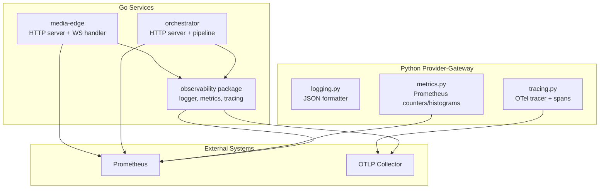
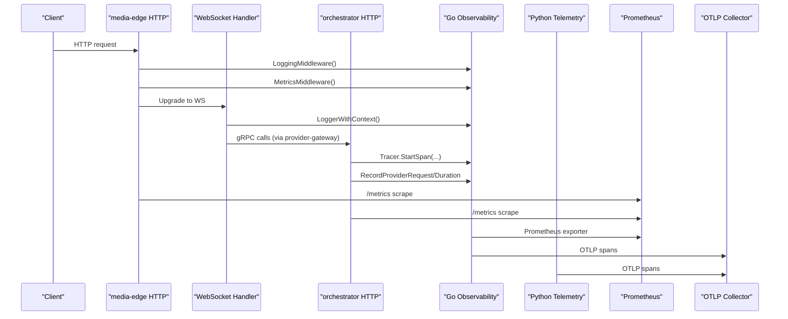
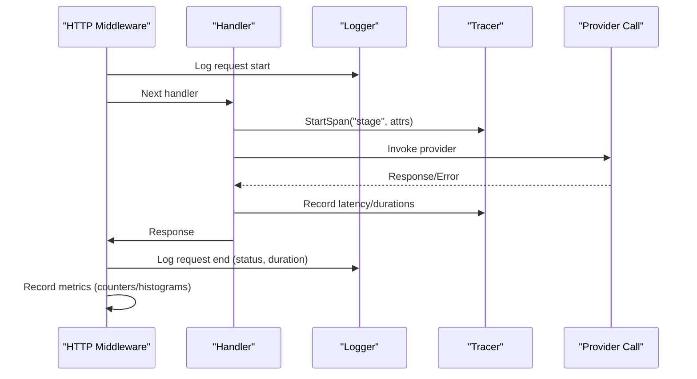
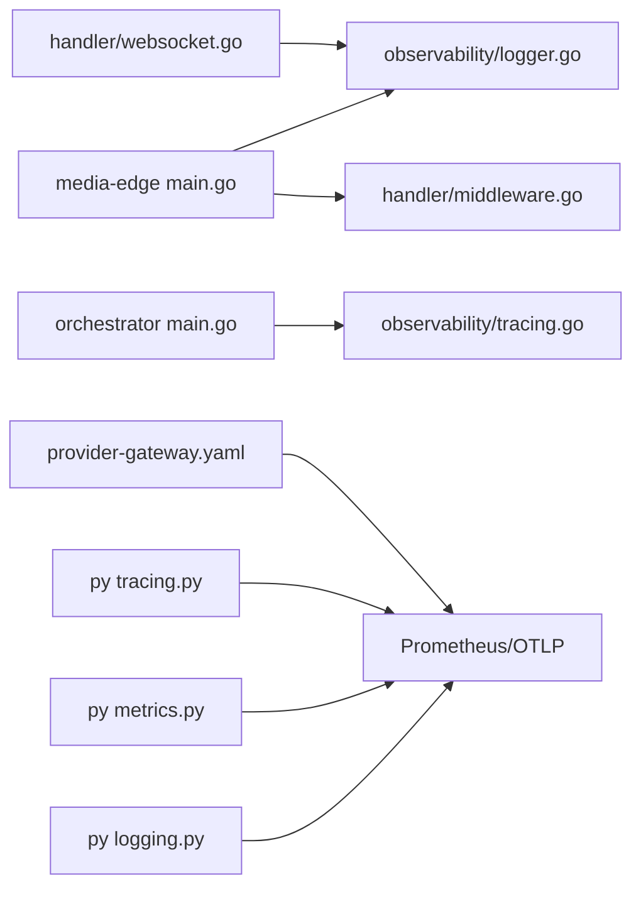

# Telemetry & Monitoring

<cite>
**Referenced Files in This Document**
- [logger.go](file://go/pkg/observability/logger.go)
- [metrics.go](file://go/pkg/observability/metrics.go)
- [tracing.go](file://go/pkg/observability/tracing.go)
- [logging.py](file://py/provider_gateway/app/telemetry/logging.py)
- [metrics.py](file://py/provider_gateway/app/telemetry/metrics.py)
- [tracing.py](file://py/provider_gateway/app/telemetry/tracing.py)
- [main.go](file://go/media-edge/cmd/main.go)
- [middleware.go](file://go/media-edge/internal/handler/middleware.go)
- [websocket.go](file://go/media-edge/internal/handler/websocket.go)
- [main.go](file://go/orchestrator/cmd/main.go)
- [config.go](file://go/pkg/config/config.go)
- [provider-gateway.yaml](file://infra/k8s/provider-gateway.yaml)
</cite>

## Table of Contents
1. [Introduction](#introduction)
2. [Project Structure](#project-structure)
3. [Core Components](#core-components)
4. [Architecture Overview](#architecture-overview)
5. [Detailed Component Analysis](#detailed-component-analysis)
6. [Dependency Analysis](#dependency-analysis)
7. [Performance Considerations](#performance-considerations)
8. [Troubleshooting Guide](#troubleshooting-guide)
9. [Conclusion](#conclusion)

## Introduction
This document explains the observability implementation for the Provider-Gateway service and related components in the system. It covers logging configuration, metrics collection, and distributed tracing, along with integration patterns, health checks, and practical guidance for monitoring provider performance and identifying bottlenecks across the provider ecosystem.

## Project Structure
The observability stack is implemented in both Go and Python layers:
- Go-based services (media-edge and orchestrator) use a shared observability package for logging, metrics, and tracing.
- Python-based provider-gateway exposes its own telemetry utilities for structured logging, metrics, and tracing.
- Kubernetes manifests enable Prometheus scraping of metrics endpoints.

**Diagram sources**
- [main.go:94-126](file://go/media-edge/cmd/main.go#L94-L126)
- [main.go:122-148](file://go/orchestrator/cmd/main.go#L122-L148)
- [logger.go:26-58](file://go/pkg/observability/logger.go#L26-L58)
- [metrics.go:10-82](file://go/pkg/observability/metrics.go#L10-L82)
- [tracing.go:34-62](file://go/pkg/observability/tracing.go#L34-L62)
- [logging.py:89-132](file://py/provider_gateway/app/telemetry/logging.py#L89-L132)
- [metrics.py:85-95](file://py/provider_gateway/app/telemetry/metrics.py#L85-L95)
- [tracing.py:17-51](file://py/provider_gateway/app/telemetry/tracing.py#L17-L51)

**Section sources**
- [main.go:94-126](file://go/media-edge/cmd/main.go#L94-L126)
- [main.go:122-148](file://go/orchestrator/cmd/main.go#L122-L148)
- [logger.go:26-58](file://go/pkg/observability/logger.go#L26-L58)
- [metrics.go:10-82](file://go/pkg/observability/metrics.go#L10-L82)
- [tracing.go:34-62](file://go/pkg/observability/tracing.go#L34-L62)
- [logging.py:89-132](file://py/provider_gateway/app/telemetry/logging.py#L89-L132)
- [metrics.py:85-95](file://py/provider_gateway/app/telemetry/metrics.py#L85-L95)
- [tracing.py:17-51](file://py/provider_gateway/app/telemetry/tracing.py#L17-L51)
- [provider-gateway.yaml:24-27](file://infra/k8s/provider-gateway.yaml#L24-L27)

## Core Components
- Structured logging: Centralized logger with development and production modes, contextual fields, and JSON/console encoders.
- Metrics: Gauges, counters, and histograms for sessions, turns, latency, and provider performance; Go and Python telemetry expose compatible metrics.
- Tracing: OpenTelemetry-based tracer with span helpers for pipeline stages and provider calls; optional Prometheus metric exporter initialization.

Key capabilities:
- Structured logging with caller and stack traces.
- Context-aware logging via session_id, trace_id, and tenant_id.
- HTTP middleware for request logging, panic recovery, and metrics recording.
- WebSocket handler metrics for active connections.
- Health and readiness endpoints for operational checks.
- Kubernetes scrape annotations for Prometheus.

**Section sources**
- [logger.go:14-167](file://go/pkg/observability/logger.go#L14-L167)
- [metrics.go:10-213](file://go/pkg/observability/metrics.go#L10-L213)
- [tracing.go:19-358](file://go/pkg/observability/tracing.go#L19-L358)
- [middleware.go:28-94](file://go/media-edge/internal/handler/middleware.go#L28-L94)
- [websocket.go:34-91](file://go/media-edge/internal/handler/websocket.go#L34-L91)
- [main.go:99-126](file://go/media-edge/cmd/main.go#L99-L126)
- [provider-gateway.yaml:24-27](file://infra/k8s/provider-gateway.yaml#L24-L27)

## Architecture Overview
The observability architecture integrates logging, metrics, and tracing across services and the provider gateway.

**Diagram sources**
- [main.go:128-143](file://go/media-edge/cmd/main.go#L128-L143)
- [middleware.go:28-94](file://go/media-edge/internal/handler/middleware.go#L28-L94)
- [websocket.go:261-374](file://go/media-edge/internal/handler/websocket.go#L261-L374)
- [main.go:122-148](file://go/orchestrator/cmd/main.go#L122-L148)
- [tracing.go:347-358](file://go/pkg/observability/tracing.go#L347-L358)
- [metrics.go:204-213](file://go/pkg/observability/metrics.go#L204-L213)
- [tracing.py:17-51](file://py/provider_gateway/app/telemetry/tracing.py#L17-L51)

## Detailed Component Analysis

### Logging Configuration
- Go logger supports development and production modes with console and JSON encoders, caller info, and stack traces.
- Context-aware logging injects session_id, trace_id, and tenant_id from context.
- Python logging provides a JSON formatter and configurable handlers.

Implementation highlights:
- Logger creation with level parsing and encoder selection.
- Context extraction for session and trace identifiers.
- JSON formatter for Python with source location and exception serialization.

Guidelines:
- Prefer JSON logging in production for structured ingestion.
- Always propagate session_id and trace_id in logs for cross-service correlation.
- Use appropriate log levels: debug for verbose diagnostics, info for operational signals, warn/error for anomalies.

**Section sources**
- [logger.go:26-58](file://go/pkg/observability/logger.go#L26-L58)
- [logger.go:86-109](file://go/pkg/observability/logger.go#L86-L109)
- [logging.py:10-86](file://py/provider_gateway/app/telemetry/logging.py#L10-L86)
- [logging.py:89-132](file://py/provider_gateway/app/telemetry/logging.py#L89-L132)

### Metrics Collection
- Go observability exports:
  - Active sessions and turns processed.
  - Latency histograms for ASR, LLM TTFT, TTS first chunk, server TTFA, and interruption stop.
  - Provider request counters and durations labeled by provider and type.
  - Active WebSocket connections.
- Python telemetry exports:
  - Provider request totals and durations.
  - Optional active sessions gauge.

Integration points:
- HTTP middleware records HTTP request metrics.
- WebSocket handler updates connection gauges.
- Orchestrator exposes /metrics endpoint.
- Kubernetes manifest annotates metrics scraping.

Best practices:
- Use histograms for latency to capture tail behavior.
- Label metrics with provider and type for drill-down.
- Expose /metrics endpoint and configure Prometheus to scrape.

**Section sources**
- [metrics.go:10-82](file://go/pkg/observability/metrics.go#L10-L82)
- [metrics.go:84-147](file://go/pkg/observability/metrics.go#L84-L147)
- [metrics.go:149-213](file://go/pkg/observability/metrics.go#L149-L213)
- [metrics.py:7-30](file://py/provider_gateway/app/telemetry/metrics.py#L7-L30)
- [metrics.py:32-83](file://py/provider_gateway/app/telemetry/metrics.py#L32-L83)
- [metrics.py:85-95](file://py/provider_gateway/app/telemetry/metrics.py#L85-L95)
- [middleware.go:78-94](file://go/media-edge/internal/handler/middleware.go#L78-L94)
- [websocket.go:122-125](file://go/media-edge/internal/handler/websocket.go#L122-L125)
- [main.go:147-148](file://go/orchestrator/cmd/main.go#L147-L148)
- [provider-gateway.yaml:24-27](file://infra/k8s/provider-gateway.yaml#L24-L27)

### Distributed Tracing
- Go tracer supports optional OTel tracing with resource attributes and span helpers for pipeline stages and provider calls.
- Timestamp trackers record and compute stage latencies for end-to-end analysis.
- Python tracer sets up OTLP exporter and provides span helpers.

Patterns:
- Start spans per pipeline stage and provider call with attributes (session_id, provider, type).
- Record latency metrics alongside spans for correlation.
- Export spans to OTLP collector for centralized tracing.

**Section sources**
- [tracing.go:19-62](file://go/pkg/observability/tracing.go#L19-L62)
- [tracing.go:107-117](file://go/pkg/observability/tracing.go#L107-L117)
- [tracing.go:119-183](file://go/pkg/observability/tracing.go#L119-L183)
- [tracing.go:185-307](file://go/pkg/observability/tracing.go#L185-L307)
- [tracing.go:317-358](file://go/pkg/observability/tracing.go#L317-L358)
- [tracing.py:17-51](file://py/provider_gateway/app/telemetry/tracing.py#L17-L51)
- [tracing.py:91-129](file://py/provider_gateway/app/telemetry/tracing.py#L91-L129)

### Health Checks and Readiness
- media-edge: /health returns OK; /ready checks readiness conditions.
- orchestrator: /health returns healthy; /ready validates Redis connectivity.
- Python provider-gateway: define similar endpoints in your service entrypoint.

Operational guidance:
- Use /health for liveness probes.
- Use /ready for startup/readiness checks against dependencies.

**Section sources**
- [main.go:99-121](file://go/media-edge/cmd/main.go#L99-L121)
- [main.go:125-145](file://go/orchestrator/cmd/main.go#L125-L145)

### Telemetry Integration Patterns
- HTTP middleware pattern: wrap handlers to log requests, recover from panics, and record metrics.
- Context propagation: inject logger and tracer instances into handlers and session lifecycles.
- Provider call instrumentation: start spans around gRPC calls to provider-gateway and record durations.

**Diagram sources**
- [middleware.go:28-94](file://go/media-edge/internal/handler/middleware.go#L28-L94)
- [websocket.go:261-374](file://go/media-edge/internal/handler/websocket.go#L261-L374)
- [tracing.go:327-344](file://go/pkg/observability/tracing.go#L327-L344)
- [metrics.go:99-137](file://go/pkg/observability/metrics.go#L99-L137)

**Section sources**
- [middleware.go:28-94](file://go/media-edge/internal/handler/middleware.go#L28-L94)
- [websocket.go:261-374](file://go/media-edge/internal/handler/websocket.go#L261-L374)
- [tracing.go:327-344](file://go/pkg/observability/tracing.go#L327-L344)
- [metrics.go:99-137](file://go/pkg/observability/metrics.go#L99-L137)

### Monitoring Provider Performance and Bottlenecks
- Use latency histograms to monitor ASR, LLM TTFT, TTS first chunk, and server TTFA.
- Track provider request counts and durations to detect slow or failing providers.
- Correlate spans with session_id and trace_id to trace end-to-end flows.
- Monitor active sessions and WebSocket connections to assess load.

Recommended queries (PromQL):
- Provider latency p95/p99: histogram_quantile(0.99, sum by(le, provider, type) (rate(cloudapp_provider_request_duration_ms_bucket{type!="http"}[5m])))
- Error rate: sum by(provider, type) (rate(cloudapp_provider_errors_total[5m]))
- Throughput: sum by(provider, type) (rate(cloudapp_provider_requests_total[5m]))

**Section sources**
- [metrics.go:23-76](file://go/pkg/observability/metrics.go#L23-L76)
- [metrics.go:124-137](file://go/pkg/observability/metrics.go#L124-L137)
- [tracing.go:185-307](file://go/pkg/observability/tracing.go#L185-L307)

## Dependency Analysis
- media-edge depends on observability package for logging, metrics, and optional tracing.
- orchestrator initializes tracer and exposes metrics endpoint.
- Python provider-gateway provides complementary telemetry utilities.
- Kubernetes manifest enables Prometheus scraping.

**Diagram sources**
- [main.go:40-71](file://go/media-edge/cmd/main.go#L40-L71)
- [middleware.go:28-94](file://go/media-edge/internal/handler/middleware.go#L28-L94)
- [websocket.go:34-91](file://go/media-edge/internal/handler/websocket.go#L34-L91)
- [main.go:60-71](file://go/orchestrator/cmd/main.go#L60-L71)
- [logging.py:89-132](file://py/provider_gateway/app/telemetry/logging.py#L89-L132)
- [metrics.py:85-95](file://py/provider_gateway/app/telemetry/metrics.py#L85-L95)
- [tracing.py:17-51](file://py/provider_gateway/app/telemetry/tracing.py#L17-L51)
- [provider-gateway.yaml:24-27](file://infra/k8s/provider-gateway.yaml#L24-L27)

**Section sources**
- [main.go:40-71](file://go/media-edge/cmd/main.go#L40-L71)
- [main.go:60-71](file://go/orchestrator/cmd/main.go#L60-L71)
- [logging.py:89-132](file://py/provider_gateway/app/telemetry/logging.py#L89-L132)
- [metrics.py:85-95](file://py/provider_gateway/app/telemetry/metrics.py#L85-L95)
- [tracing.py:17-51](file://py/provider_gateway/app/telemetry/tracing.py#L17-L51)
- [provider-gateway.yaml:24-27](file://infra/k8s/provider-gateway.yaml#L24-L27)

## Performance Considerations
- Use exponential histogram buckets aligned to expected latency ranges for accurate quantiles.
- Minimize overhead in hot paths by batching metrics and avoiding excessive allocations in spans.
- Prefer structured logging in production for efficient parsing and filtering.
- Keep spans lightweight; attach only essential attributes for correlation.
- Ensure Prometheus scrape intervals and retention align with alerting thresholds.

## Troubleshooting Guide
Common scenarios and remedies:
- Missing metrics: verify /metrics endpoint is exposed and Prometheus is configured to scrape the service.
- Tracing not exported: confirm OTLP endpoint is set and exporter is initialized.
- High error rates: inspect provider error counters and correlate with spans for root cause.
- Latency spikes: analyze latency histograms and compare with provider durations; check network and backend health.
- Session/connection issues: review active session and WebSocket connection gauges; validate readiness endpoints.

Health and readiness checks:
- Confirm /health returns OK for liveness.
- Confirm /ready passes dependency checks (e.g., Redis) before traffic is switched.

**Section sources**
- [main.go:99-121](file://go/media-edge/cmd/main.go#L99-L121)
- [main.go:125-145](file://go/orchestrator/cmd/main.go#L125-L145)
- [metrics.go:204-213](file://go/pkg/observability/metrics.go#L204-L213)
- [tracing.go:347-358](file://go/pkg/observability/tracing.go#L347-L358)

## Conclusion
The Provider-Gateway and related services implement a robust observability foundation with structured logging, comprehensive metrics, and distributed tracing. By leveraging context-aware logging, latency histograms, and span correlation, operators can effectively monitor provider performance, track request latency, and quickly identify bottlenecks across the provider ecosystem. Integrating health and readiness endpoints, combined with Prometheus scraping and OTLP export, ensures a complete observability story for production operations.